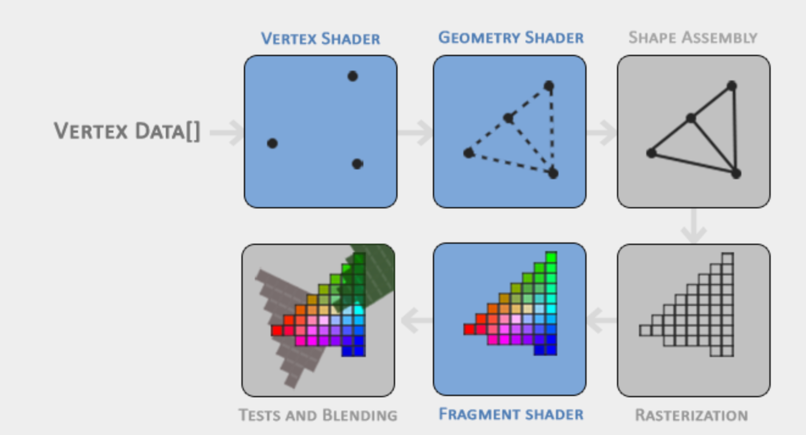
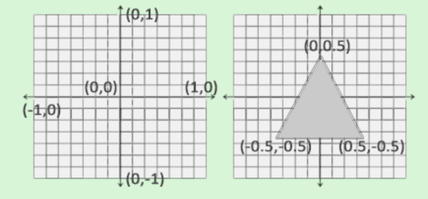
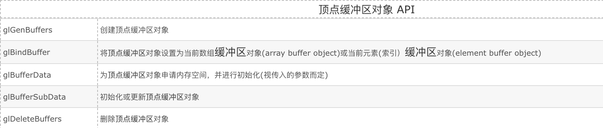
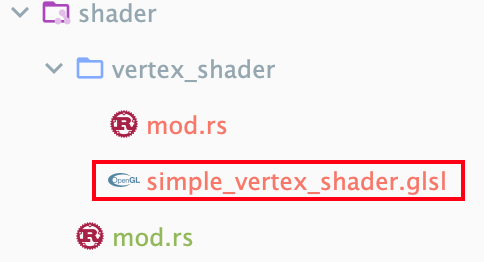
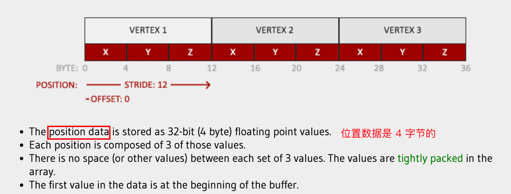
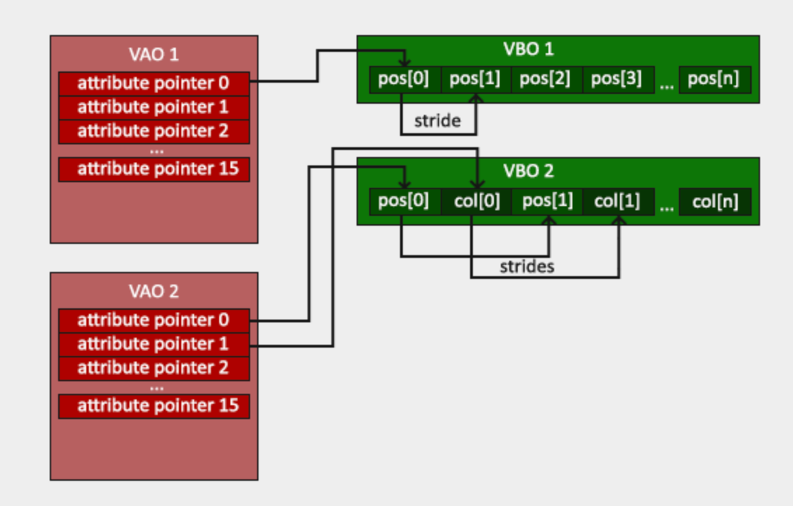
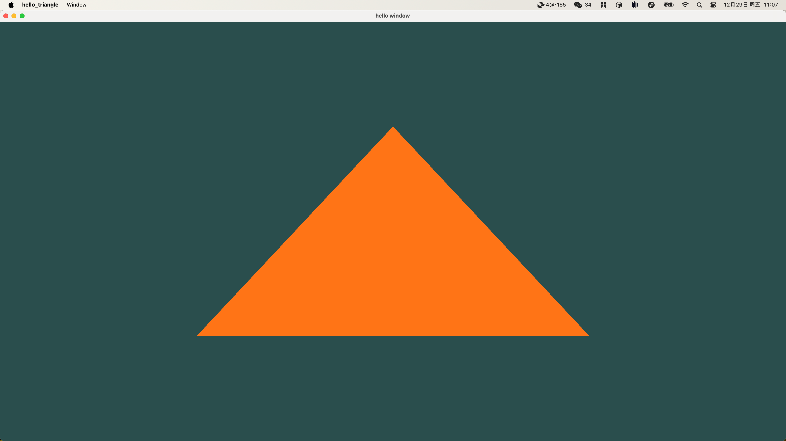
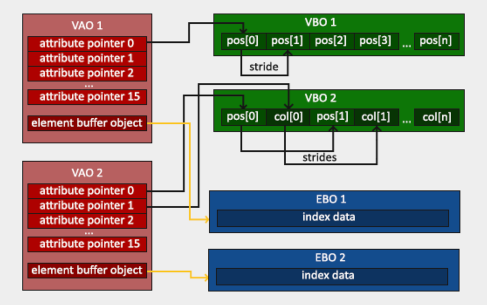
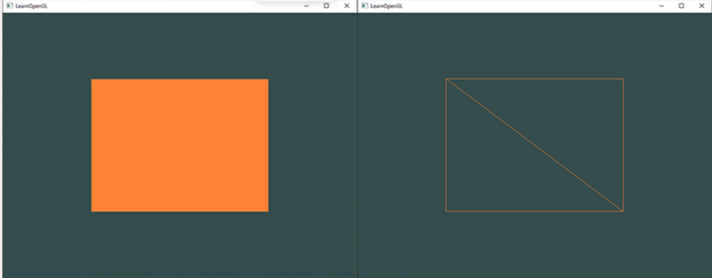

# 浅入图形管道，写一个三角形

OpenGL里所有的东西都在3D空间中，但屏幕或窗口是一组2D像素的数组，因此OpenGL的很大一部分工作就是将所有3D坐标转换为适合屏幕的2D像素。将3D坐标转换为2D像素的过程由OpenGL的图形管道管理。

该图形管道可以分为两大部分：

1. 第一部分将3D坐标转换为2D坐标，
2. 第二部分将2D坐标转换为实际的有颜色的像素。

在本章中，我们主要就是了解图形管道，然后渲染一些像素。

## 着色器

图形管线接受一组3D坐标作为输入，并将其转换为屏幕上的彩色2D像素。图形管线的处理可以明确的抽象为数个步骤，每个步骤都需要前一步的输出作为其输入。在现在，所有这些步骤都已经是高度特化的了（它们具有一个特定的功能），并且很容易并行执行。而正是由于它们的并行性质，**如今的图形卡拥有成千上万个小型处理核心**，这些小核心作为了一种特定电路来**快速并行的**处理图形管线中的数据。这些处理核心在GPU上为管线的每个步骤运行小型程序。这些小型程序称为着色器。

其中一些着色器可以由开发人员进行配置，这使我们能够编写自己的着色器来替换现有的默认着色器。这使我们能够更精细地控制管线的特定部分，并且因为它们在GPU上运行，它们还可以节省宝贵的CPU时间。着色器使用OpenGL着色语言（GLSL）编写，我们将在下一章更深入地探讨这一点。

下面是图形管线各个阶段的抽象表示。注意，**蓝色部分代表我们可以注入自己着色器的部分**：

如上图，图形管线包含许多部分，每个部分都处理将顶点数据(Vertex Data[])转换为最终完全渲染像素的特定部分。接下来会以简化的方式解释管线的每个部分。

我们传递了一个**三维坐标**列表(需要时刻记得的是，OpenGL接收 3D 数据)作为图形管线的输入，列表中的每一个数据称为顶点数据(Vertex Data)，一个顶点数据(Vertex Data)是三个 3D 坐标，可以形成一个三角形；这个顶点数据是顶点的集合。顶点是每个三维坐标的一组数据。这个顶点的数据是用顶点属性来表示的，**这些属性可以包含任何我们想要的数据**，但为了简单起见，现在我们假设每个顶点只包含一个三维位置和一些颜色值。

> 为了使OpenGL知道如何处理坐标和颜色值集合，我们需要告诉他想用数据形成什么样的渲染类型。例如：是否希望数据呈现为一组点、一组三角形，或者只是一条长线。
>
> 这些提示(hint)被称为原始图元(primitives)，并且需要在调用任何绘图命令时提供给OpenGL。上面提到的三种提示是GL_POINTS、GL_TRIANGLES和GL_LINE_STRIP。

## pipeline 组成部分

1. **顶点着色器(VS)**

顶点着色器以单个顶点作为输入，主要目的是将3D坐标转换为不同的3D坐标（稍后会详细介绍），此外，顶点着色器还允许我们对顶点属性进行一些基本处理。其输出可选的给到几何着色器。

2. **几何着色器(PS)**

几何着色器以一组形成基本图元(primitives)的顶点(Vertex)作为输入，并能够通过生成新顶点来形成新的基本图元(primitives)来生成其他形状。在本章图中示例中，几何着色器从给定的形状中生成了第二个三角形。

3. **图形装配**

图形装配阶段以来自顶点（或几何）着色器的所有顶点（或点，如果选择了GL_POINTS）作为输入，形成一个或多个基本图元，并组装给定形状的**所有点**。在上图的例子中下，是两个实线三角形，其中的点已经被补完了。

4. **光栅化**

图形装配的输出随后传递到光栅化阶段，光栅化阶段将基本图元的结果映射到最终屏幕上对应的像素，从而产生片段供片段着色器使用。片段(fragment)着色器运行之前，会进行裁剪。裁剪会丢弃所有超出视图范围的 fragment，提高性能。

> OpenGL中的一个 fragment 是OpenGL渲染单个像素所需的所有数据。

片段着色器的**主要目的是计算像素的最终颜色**，通常这是产生所有高级OpenGL效果的阶段。一般来说，片段着色器还包含**有关3D场景的数据**，它可以用来计算最终像素的真实颜色（如综合考虑光线、阴影、光线颜色等）。

5. **alpha测试和混合(blending)阶段**

在确定所有对应的颜色数值之后，最终对象将通过我们称之为alpha测试和混合(blending)阶段的另一个阶段。这个阶段检查 fragment 的**对应深度**（和模板）值（稍后会讲到），并使用这些值来检查生成的片段是**前面还是后面的对象**(这就是"盖住"的具体实实现)，并相应地丢弃。这个阶段还检查alpha值（**alpha值定义了对象的不透明度**），并相应地混合对象。因此，即使像素的输出颜色是在片段着色器中计算的，当渲染多个三角形时，最终像素颜色可能仍然是完全不同的。


正如看到的五部分，图形管线是一个相当复杂的整体，包含许多可配置的部分。然而，几乎所有情况下，我们只需要使用顶点着色器和片段着色器。几何着色器是可选的，通常使用默认着色器。(还有细分阶段和变换反馈环，我们没有在此描述，但这后面会提到)。在现代OpenGL中，我们需要至少定义自己的顶点和片段着色器（GPU上没有默认的顶点/片段着色器）。因此，学习现代OpenGL通常是相当困难的，因为在能够渲染第一个三角形之前需要大量的知识。一旦您最终在本章的末尾渲染三角形，您将对图形编程有更多的了解。

## 如何使用着色器

### 顶点输入(VBO-顶点buffer)

在开始绘制某个东西前，我们需要向OpenGL提供一些**输入顶点数据**。因为OpenGL是一个3D图形库，因此我们在OpenGL中指定的所有坐标都是**3D坐标（x，y和z坐标）**。

> OpenGL不会简单地直接转换所有3D坐标为屏幕上的2D像素。他定义了一个坐标系——标准设备坐标系，其取值均在特定范围内（-1.0和1.0之间），在这个坐标系中OpenGL才会处理3D坐标（在x、y和z上）。
>
> 在该坐标系中的所有坐标将最终显示在屏幕上，但在该区域之外的所有坐标则不会显示。

我们要渲染一个单一三角形，需要指定三个顶点的总数，每个顶点都有一个3D位置。我们在一个浮点数组中以标准设备坐标（OpenGL的可见区域）定义它们，此时我们没有进行麻烦的坐标转换，而是仅仅使用符合预期的坐标：

```rust
// C
float vertices[] = {
S
}; 

// Rust

```



定义好了的顶点数据，会被其作为输入给到图形管道的第一个部分——顶点着色器。核心的点在于，我们需要在GPU上创建存储顶点数据的内存。

而生成GPU能处理的数据OpenGL已经帮我们做了，我们只需要配置OpenGL如何解释内存，并指定将数据传输到显卡的方式即可。随后顶点着色器根就会据我们从内存中告诉它的顶点数量进行处理。OpenGL提供了顶点buffer（vertex buffer objects，VBO）来管理这部分内存，它可以在GPU的内存中存储大量的顶点。

VBO被命名为buffer的根源在于，我们需要一次性传输大批量的数据到显卡，并在内存充足的情况下将数据保留在那里，而无需一次发送一个顶点的数据。**从CPU传输数据到显卡相对较慢，因此我们需要尽可能地一次性传输尽可能多的数据**。但是只要数据被存储在了显卡的内存中之后，顶点着色器可以迅速的处理顶点。

此外，VBO是我们遇到的第一个OpenGL对象。OpenGL中的所有对象都有一个与之对应的唯一ID，VBO 也是这样。具体使用上面我们可以使用glGenBuffers函数生成一个缓冲ID：

```rust
// C
unsigned int VBO;
glGenBuffers(1, &VBO); 
```

OpenGL有许多种类型的Buffer对象，VBO的缓冲类型是**GL_ARRAY_BUFFER**。对于我们抽象出来的每一个Buffer，如果这个Buffer有着不同的缓冲类型的话，OpenGL允许我们同时进行绑定。对于VBO 来说，我们可以使用glBindBuffer函数将新创建的缓冲绑定到GL_ARRAY_BUFFER目标:

```rust
// C
glBindBuffer(GL_ARRAY_BUFFER, VBO);  
```

此时可以理解我们 new 了一个具体的 VBO 对象，我们所做的任何缓冲区调用（这里是对GL_ARRAY_BUFFER类型的对象）将用于配置当前绑定的缓冲区。然后我们可以调用glBufferData函数，将先前定义的顶点数据复制到缓冲区的内存中:

```rust
// C
glBufferData(GL_ARRAY_BUFFER, sizeof(vertices), vertices, GL_STATIC_DRAW);
```

`glBufferData`是一个专门用于将用户定义的数据复制到当前绑定缓冲区的函数。它的第一个参数是我们想要将数据复制到的缓冲区的类型————目前是绑定到GL_ARRAY_BUFFER类型的 VBO。第二个参数指定我们要传递给缓冲区的数据的大小（以**字节**为单位）。第三个参数是我们想要发送的实际数据。第四个参数指定了**我们希望_显卡_**如何管理给定的数据。这可以有三种形式：

1. GL_STREAM_DRAW：数据只set一次，并且最多由GPU使用给定次数。
2. GL_STATIC_DRAW：数据只set一次，并且被多次使用。
3. GL_DYNAMIC_DRAW：数据经常更改并被多次使用。

三角形的位置数据不会改变，经常使用，并且对于每次渲染调用都保持不变，因此它的使用类型最好是GL_STATIC_DRAW。例如，如果有一个缓冲区的数据可能**经常更改**，GL_DYNAMIC_DRAW的使用类型可以确保显卡将数据放入内存，从而实现更快的写入速度。

我们**已经将顶点数据存储在显卡内存中**，由名为VBO的顶点缓冲对象管理。在创建一个顶点和片元着色器来实际处理这些数据之前，先用 Rust 包装一下：

```rust
/// 基于给定的顶点数据生成一个类型为 ARRAY_BUFFER 的 vertex buffer object
/// 其显卡管理的策略给定。
pub fn gen_array_buffer(verticals: &[f32], gpu_mem_type: GLenum) -> *mut u32 {
    unsafe {
        // 我们先随意生成一个指针
        let mut vbo: u32 = 0;
        let mut vbo = (&mut vbo) as *mut u32;

        // vbo 指针会被赋值指向对应的位置
        GenBuffers(1, vbo);
        // VBO 的类型为 ARRAY_BUFFER
        BindBuffer(ARRAY_BUFFER, *vbo);

        // 将顶点数据绑定在 vbo 指针上
        let size = size_of_val(verticals);
        BufferData(ARRAY_BUFFER, size as isize, verticals.as_ptr() as *const c_void, gpu_mem_type);
        info!("vbo id={}", *vbo);

        vbo
    }
}
```

#### 小结——demo

如果我们想要生成一串 buffer 的话，可以使用数组：

```rust
let mut vbo: [c_uint; 3] = [0; 3];
unsafe {
    GenBuffers(3, vbo.as_mut_ptr());
    let size = size_of::<c_uint>();
    println!("size={size}, vbo={:?}", vbo);
}

let mut single_vbo: GLuint = 0;
unsafe {
    GenBuffers(1, &mut single_vbo as *mut c_uint);
    println!("single_vbo={:?}", single_vbo);
}

// 输出
size=4, vbo=[1, 2, 3]
single_vbo=4
```

可以看到，在我的机器上，c_uint 是 32 位。此时三个 buffer 的名字都被分配到了数组 vbo 中。需要注意的是，如果我们没有 BindBuffer，实际上 Buffer 是没有被创建的，而是仅存在一个名字，也即上面的`vbo`数组：

```rust
let mut vbo: [c_uint; 3] = [0; 3];
unsafe {
    GenBuffers(3, vbo.as_mut_ptr());
    let size = size_of::<c_uint>();
    println!("size={size}, vbo={:?}", vbo);

    println!("before bind, vbo={} is buffer={}", vbo[0], IsBuffer(vbo[0]));
    BindBuffer(ARRAY_BUFFER, vbo[0]);
    println!("after bind, vbo={} is buffer={}", vbo[0], IsBuffer(vbo[0]));

    println!("before bind, vbo={} is buffer={}", vbo[1], IsBuffer(vbo[1]));
    BindBuffer(ARRAY_BUFFER, vbo[1]);
    println!("after bind, vbo={} is buffer={}", vbo[1], IsBuffer(vbo[1]));
}

// 输出
size=4, vbo=[1, 2, 3]
before bind, vbo=1 is buffer=0
after bind, vbo=1 is buffer=1
before bind, vbo=2 is buffer=0
after bind, vbo=2 is buffer=1
```



参考：https://blog.csdn.net/csxiaoshui/article/details/52992797

### 顶点着色器

顶点着色器是我们可以编程定制化的着色器之一。 现代OpenGL要求我们至少对顶点着色器和片段着色器进行配置。我们需要做的第一件事是使用GLSL（OpenGL着色语言）编写顶点着色器，然后编译此着色器，以便在应用程序中使用它。 以下是GLSL中一个非常基本的顶点着色器的源代码：

```glsl
#version 330 core
layout (location = 0) in vec3 aPos;

void main()
{
    gl_Position = vec4(aPos.x, aPos.y, aPos.z, 1.0);
}
```

GLSL与C语言很相似。每个着色器的最开始都是其版本声明：自OpenGL 3.3及更高版本以来，GLSL的版本号与OpenGL的版本号匹配（例如，GLSL版本420对应OpenGL版本4.2），此外，core 说明了我们在使用核心配置功能。

接下来，`in`关键字在顶点着色器中声明了所有输入顶点属性。因为目前我们只关心位置数据，所以我们只需要一个极为简单的顶点属性——位置。GLSL的类型中有vec(矢量)以及mat(矩阵)，根据其后缀数字包含1到4个浮点数，例如vec3表明是一个3D向量数组。由于每个顶点都有一个3D坐标，我们创建了一个名为aPos的vec3输入变量。我们还通过layout（location = 0）特别设置了输入变量的位置(后面会进行解释)。

> The vertex shader is executed for each vertex.
>
> A vertex is composed by of or several attributes (positions, normals, texture coordinates etc.).
>
> On the CPU side when you create your VAO, you describe each attribute by saying "this data in this buffer will be attribute 0, the data next to it will be attribute 1 etc.". Note that the VAO only stores this information of where's who. The actual vertex data is stored in VBOs.
>
> In the vertex shader, the line with layout and position is just saying "get the attribute 0 and put it in a variable called position" (the *location* represents the number of the attribute).
>
> If the two steps are done correctly, you should end up with a position in the variable named position :) Is it clearer?

预定义的`gl_Position`变量接收我们的位置数据并生成顶点着色器的输出，它是一个vec4类型。在上面的代码中，我们设置`gl_Position`为顶点着色器的输出。由于我们的输入是大小为3的向量，**我们必须将其转换为大小为4的向量**：将vec3值输入vec4的构造函数并将其w分量设置为1.0f来实现这一点（我们将在以后的章节中解释为什么）。

> vec.w 组件不表示空间中的位置（我们处理的是 3D，而不是 4D），而是用于透视(perspective division)。

接下来我们尝试编译这个 glsl 着色器，首先把上面的代码写入一个文件中，大概是这样：



然后读入内存(**注意需要读为 CString 类型的**)：

```rust
/// 从 glsl 文件中读取所有字节
pub fn get_vertex_shader() -> anyhow::Result<CString> {
    let f = File::open("./src/shader/vertex_shader/simple_vertex_shader.glsl")?;
    let mut reader = BufReader::new(f);
    let mut buffer = Vec::new();

    // 将文件中的所有内容读取到一个 buffer 中
    reader.read_to_end(&mut buffer)?;

    // 将读取到的数据转换为一个 CString
    let ss = String::from_utf8(buffer)?;
    let cstr = CString::new(ss)?;

    Ok(cstr)
}
```

由于OpenGL是在运行时动态编译GLSL的源代码的，因此我们需要先在内存中创建一个着色器对象，该对象也有着一个ID用于寻找。我们将顶点着色器存储为一个无符号整数表示的 ID 标识的对象，方法是`glCreateShader`：

```C
// 着色器源码
const char *vertexShaderSource = "#version 330 core\n"
    "layout (location = 0) in vec3 aPos;\n"
    "void main()\n"
    "{\n"
    "   gl_Position = vec4(aPos.x, aPos.y, aPos.z, 1.0);\n"
    "}\0";

// 着色器 ID
unsigned int vertexShader;
vertexShader = glCreateShader(GL_VERTEX_SHADER);
```

接下来需要把源码放入这个顶点着色器中进行编译：

```C
// 获取到着色器对象、多少个源码 String、源码指针作为参数，至于第四个参数，我们可以给个 Null
glShaderSource(vertexShader, 1, &vertexShaderSource, NULL);
// 编译着色器对象
glCompileShader(vertexShader);
```

在完成编译之后，显然我们需要看一下是否成功：

```C
int  success;				// 错误状态，1 为成功，0 为失败
char infoLog[512];	// 错误日志
// 检查类型为GL_COMPILE_STATUS的错误消息，看是否成功
glGetShaderiv(vertexShader, GL_COMPILE_STATUS, &success);
if(!success)
{
  	// 失败的话需要打印一下
    glGetShaderInfoLog(vertexShader, 512, NULL, infoLog);
    std::cout << "ERROR::SHADER::VERTEX::COMPILATION_FAILED\n" << infoLog << std::endl;
}
```

#### 小结——demo

这部分代码我们可以用 Rust 写成：

```rust
/// 生成一个着色器并编译
pub fn get_vertex_shader() -> anyhow::Result<GLuint> {
    let glsl = get_vertex_shader_source()?;
    unsafe {
        // 创建 shader 并给入源码进行编译，这个就是 ID
        let p_v_shader = CreateShader(VERTEX_SHADER);
        // glsl 源码指针
        let p_glsl = &glsl.as_ptr() as *const *const c_char;
        ShaderSource(p_v_shader, 1, p_glsl, null());
        CompileShader(p_v_shader);

        // 处理错误信息
        let mut success = 0;
        let mut info: [c_char; 512] = [c_char::MIN; 512];
        GetShaderiv(p_v_shader, COMPILE_STATUS, &mut success);

        if success == 1 {
            info!("Compile success, success={success}")
        }else {
            // 这是一个可以为 NULL 的数，我们随便给一个传进去
            let mut length = 10;
            GetShaderInfoLog(p_v_shader, 512, &mut length, info.as_mut_ptr());
            info!("Compile fail, success={success}, infos: {:?}", CStr::from_ptr(info.as_ptr()));
        }
        Ok((p_v_shader))
    }
}
```

### 片段着色器

片段着色器是我们要为三角形渲染创建的最后一个着色器。片段着色器主要是为了计算像素的颜色输出。

为了保持简单，我们设置片段着色器将始终输出橘色：

> 计算机图形中的颜色表示为一个包含4个值的数组：红色、绿色、蓝色和alpha（不透明度），通常简称为RGBA。在OpenGL或GLSL中定义颜色时，我们将每个组件的强度设置为在0.0到1.0之间的值。
>
> 例如，如果我们将红色设置为1.0，绿色设置为1.0，我们将获得红色和绿色的混合并得到黄色。有了这3个颜色分量，我们可以生成超过1600万种不同的颜色!

```glsl
#version 330 core
out vec4 FragColor;

void main()
{
    FragColor = vec4(1.0f, 0.5f, 0.2f, 1.0f);
} 
```

片段着色器的输出只需要一个变量，其是一个大小为4的向量，定义了我们应该计算的最终颜色输出。我们使用out关键字声明了输出值`FragColor`，然后简单地将一个vec4赋值给颜色输出。该vec4含义是完全不透明的橙色。

编译片段着色器的过程与顶点着色器类似，不过这次我们使用GL_FRAGMENT_SHADER常量作为着色器类型:

```rust
// C
unsigned int fragmentShader;
fragmentShader = glCreateShader(GL_FRAGMENT_SHADER);
glShaderSource(fragmentShader, 1, &fragmentShaderSource, NULL);
glCompileShader(fragmentShader);
```

#### 小结——demo

```rust
/// 生成一个片段着色器并编译
pub fn get_fragment_shader() -> anyhow::Result<GLuint> {
    let glsl = get_fragment_shader_source()?;
    unsafe {
        // 创建 shader 并给入源码进行编译，这个就是 ID
        let p_v_shader = CreateShader(FRAGMENT_SHADER);
        // glsl 源码指针
        let p_glsl = &glsl.as_ptr() as *const *const c_char;
        ShaderSource(p_v_shader, 1, p_glsl, null());
        CompileShader(p_v_shader);

        // 处理错误信息
        let mut success = 0;
        let mut info: [c_char; 512] = [c_char::MIN; 512];
        GetShaderiv(p_v_shader, COMPILE_STATUS, &mut success);

        if success == 1 {
            info!("[get_fragment_shader]Compile success, success={success}")
        }else {
            // 这是一个可以为 NULL 的数，我们随便给一个传进去
            let mut length = 10;
            GetShaderInfoLog(p_v_shader, 512, &mut length, info.as_mut_ptr());
            error!("[get_fragment_shader]Compile fail, success={success}, infos: {:?}", CStr::from_ptr(info.as_ptr()));
        }
        Ok((p_v_shader))
    }
}
```

### 着色器程序(SPO, 着色器集合)

着色器程序对象(shader program object, SPO)是多个着色器的最终链接后的输出。就像 C 代码一样，如果我们要使用编译的着色器，必须先将它们链接到一起成为 SPO，然后在渲染对象时激活此着色器程序。激活的 SPO 的着色器将在我们每一次启动渲染相关调用的时候被使用。将着色器链接到SPO时，它会将每个着色器的输出链接到下一个着色器的输入。如果输出和输入不匹配，此时我们会得到一个链接错误。

创建程序对象很容易：

```
// C
unsigned int shaderProgram;
shaderProgram = glCreateProgram();
```

`glCreateProgram`函数创建一个SPO并返回新创建的对象的 ID 引用。然后我们将之前编译的着色器附加到程序对象，使用`glLinkProgram`将它们链接起来：

```C
glAttachShader(shaderProgram, vertexShader);
glAttachShader(shaderProgram, fragmentShader);
glLinkProgram(shaderProgram);
```

与着色器编译一样，我们也可以监控着色器程序，当链接失败的时候检索相应的日志。我们使用glGetProgramiv和glGetProgramInfoLog，而不是使用 glGetShaderiv 和 glGetShaderInfoLog:

```C
glGetProgramiv(shaderProgram, GL_LINK_STATUS, &success);
if(!success) {
    glGetProgramInfoLog(shaderProgram, 512, NULL, infoLog);
    ...
}###
```

最终我们能获取到一个程序对象SPO，可以通过调用glUseProgram并将新创建的程序对象作为参数传入来进行激活：

```C
glUseProgram(shaderProgram);
```

每次glUseProgram执行后，之后的每个着色器和渲染**函数调用**都会使用这个程序对象。

此外，**别忘了一旦我们将着色器链接到程序对象中，就要析构着色器对象**：

```C
glDeleteShader(vertexShader);
glDeleteShader(fragmentShader); 
```

现在我们将输入的顶点数据传送到 GPU 了，并且还指示了 GPU 如何在顶点和片段着色器中处理顶点数据。

目前还剩下一些工作：OpenGL 还不知道如何解释内存中的顶点数据，以及如何将顶点数据连接到顶点着色器的属性上。接下来我们学习如何告诉 OpenGL 如何做到这一点。

#### 小结——demo

转换为 Rust 为：

```rust
let vertex_shader_id = get_vertex_shader()?;
let fragment_shader_id = get_fragment_shader()?;

// 创建着色器程序对象
unsafe {
    let pso = CreateProgram();
    AttachShader(pso, vertex_shader_id);
    AttachShader(pso, fragment_shader_id);
    LinkProgram(pso);
    // 处理错误信息
    let mut success = 0;
    let mut info: [c_char; 512] = [c_char::MIN; 512];
    GetProgramiv(pso, LINK_STATUS, &mut success);

    if success == 1 {
        info!("Compile success, success={success}")
    }else {
        // 这是一个可以为 NULL 的数，我们随便给一个传进去
        let mut length = 10;
        GetProgramInfoLog(pso, 512, &mut length, info.as_mut_ptr());
        error!("Compile fail, success={success}, infos: {:?}", CStr::from_ptr(info.as_ptr()));
    }

    UseProgram(pso);
  
  	// 记得 delete 一下
    DeleteShader(vertex_shader_id);
    DeleteShader(fragment_shader_id);
}
```

### 链接顶点属性(Vertex Attributes)

顶点着色器允许我们以顶点属性的形式指定**任何**输入，这带来了很大的灵活性，但这也意味着我们必须手动指定输入数据的具体哪一部分去哪一个顶点属性。这意味着我们必须在渲染之前指定OpenGL应该如何解释顶点数据。

我们的顶点缓冲数据格式如下：



知道了数据结构之后我们就可以告诉 OpenGL 如何使用`glVertexAttribPointer`解释顶点数据了（每个顶点属性）：

```C
glVertexAttribPointer(0, 3, GL_FLOAT, GL_FALSE, 3 * sizeof(float), (void*)0);
glEnableVertexAttribArray(0); 
```

函数`glVertexAttribPointer`具有相当多的参数，我们逐个进行解释：

1. 第一个参数指定了我们要配置的顶点属性。**我们在顶点着色器中使用layout(location = 0)来指定顶点属性 position 的*位置***。在句话中，position 顶点属性的 location 被设置为0。我们要向该顶点属性传递位置数据，因此传入0。
2. 第二个参数指定了顶点属性的大小。该顶点属性是一个vec3，因此它由3个值组成，我们传入3。
3. 第三个参数指定了数据的类型，即GL_FLOAT（在GLSL中，vec由浮点值组成）。
4. 第四个参数指定了我们是否希望对数据进行标准化。如果我们输入整数数据类型（int、byte）并将其设置为GL_TRUE，则整数数据将被标准化为0（或对于有符号数据为-1）到1区间内。我们已经是标准化后的数据了，因此我们将其保留为GL_FALSE。
5. 第五个参数被称为步长(stride)，表示连续顶点属性之间的**内存间距**。因为每一组位置数据都是 3 个 float，因此步长就是一个float大小的3倍，所以我们将该值指定为步长。
6. 最后一个参数是void*类型，因此需要使用奇怪的转换。这是position属性在buffer中的偏移量。因为我们的position属性位于每一个数据数组的开头，所以该值就是 0。

> 需要注意的是，因为我们知道数组是紧密排列的（即从一个顶点属性值到下一个顶点属性值之间没有padding），步长也可以被指定为0，让OpenGL确定实际的步长（只有在数值被紧密打包时才起作用）。而当我们有更多的顶点属性时，我们必须仔细定义每个顶点属性之间的内存距离，我们稍后会看到更多的例子。

现在我们已经指定了OpenGL解释顶点数据的方法。由于顶点属性默认情况下是禁用的，接下来我们还应该使用`glEnableVertexAttribArray`函数来启用顶点属性，并将顶点属性位置作为其参数。

我们在顶点缓冲对象中使用顶点缓冲对象初始化了顶点数据，设置了顶点和片段着色器，并告诉OpenGL如何将顶点数据链接到顶点着色器的顶点属性。在OpenGL中绘制一个对象现在看起来会是这样的：

```C
// 0. copy our vertices array in a buffer for OpenGL to use
glBindBuffer(GL_ARRAY_BUFFER, VBO);
glBufferData(GL_ARRAY_BUFFER, sizeof(vertices), vertices, GL_STATIC_DRAW);
// 1. then set the vertex attributes pointers
glVertexAttribPointer(0, 3, GL_FLOAT, GL_FALSE, 3 * sizeof(float), (void*)0);
glEnableVertexAttribArray(0);  
// 2. use our shader program when we want to render an object
glUseProgram(shaderProgram);
// 3. now draw the object 
someOpenGLFunctionThatDrawsOurTriangle();  
```

每当我们想要绘制一个东西的时候都需要重复这个流程。目前这个流程还比较简单，但是作为一个基本单元，如果我们有超过5个顶点属性，或者甚至上百个不同的东西（这不是什么稀罕事），这个流程就会变得复杂起来，到这种具体的业务场景中时，如何绑定合适的 buffer 数组并为其中的每个对象配置好所有顶点属性就会变成一个繁琐的过程。

那接下来我们肯定会问，是否存在一种方法可以将所有这些**状态配置存储到一个对象中**，并通过简单地绑定这个对象来恢复它的状态？

### 顶点数组对象(VAO, 多个 VBO 的集合队列)

显然是有的，这个对象叫做顶点数组对象(vertex array object, VAO)：

VAO 可以像顶点缓冲对象(VBO，见第一节)一样绑定，并且对于从任意一个3D点作为起点后续顶点属性都会存储在VAO内，也即我们将位置同属性一起保存了。这样做的好处是，当配置顶点属性指针时只需要进行一次调用，我们只需绑定相应的VAO就可以绘制对应的对象了。这样，切换不同的顶点数据和属性配置就是简单的绑定不同的VAO。我们刚刚设置的所有状态都存储在VAO内：

> core OpenGL要求我们使用VAO，这样它才可以知道如何处理我们的顶点输入。如果我们没有绑定VAO的话，OpenGL不会绘制任何东西。

一个顶点数组对象中存储了以下内容：

1. 通过`glEnableVertexAttribArray`或`glDisableVertexAttribArray`进行的调用。
2. 通过`glVertexAttribPointer`进行的顶点属性配置。
3. 通过对`glVertexAttribPointer`的调用与顶点属性关联的顶点缓冲对象。



生成 VAO 的过程与 VBO 类似：

```C
// C
unsigned int VAO;
glGenVertexArrays(1, &VAO);  
```

要使用VAO，只需要使用`glBindVertexArray`绑定VAO即可。随后，我们应该绑定/配置相应的VBO和属性指针，然后解除绑定VAO以供后面继续使用。当我们想要绘制一个对象的时候，只需要在绘制对象之前简单地绑定具有首选设置的VAO就可以了。在代码中，这个过程的主流程看起来是这样的：

```C
// ..:: Initialization code (done once (unless your object frequently changes)) :: ..
// 1. bind Vertex Array Object
glBindVertexArray(VAO);
// 2. copy our vertices array in a buffer for OpenGL to use
glBindBuffer(GL_ARRAY_BUFFER, VBO);
glBufferData(GL_ARRAY_BUFFER, sizeof(vertices), vertices, GL_STATIC_DRAW);
// 3. then set our vertex attributes pointers
glVertexAttribPointer(0, 3, GL_FLOAT, GL_FALSE, 3 * sizeof(float), (void*)0);
glEnableVertexAttribArray(0);  

  
[...]

// ..:: Drawing code (in render loop) :: ..
// 4. draw the object
glUseProgram(shaderProgram);
glBindVertexArray(VAO);
someOpenGLFunctionThatDrawsOurTriangle();   
```

这就是我们所需要的全部东西了！前面这么多章节所做的就是为了这个结果————一个存储我们顶点属性配置和决定需要使用哪个VBO的VAO。

大多数情况下，当我们有多个要绘制的对象时，需要首先生成/配置所有的VAO（因此需要对应的VBO和属性指针），并将它们存储以备后用。当我们想要绘制我们的一个对象时，我们取对应的VAO，绑定它，然后绘制该对象并解绑VAO。

### 绘制三角形

绘制三角形就比较简单了：

```C
glUseProgram(shaderProgram);
glBindVertexArray(VAO);
glDrawArrays(GL_TRIANGLES, 0, 3);
```

glDrawArrays函数的第一个参数是我们想要绘制的OpenGL基本类型。由于我们想要绘制一个三角形，所以传入GL_TRIANGLES。第二个参数指定了我们想要绘制的顶点数组的起始索引；我们只需将其保留为0。最后一个参数指定我们想要绘制多少个顶点，即3个（我们只从我们的数据中渲染1个三角形，其长度恰好是3个顶点）。

## 源码

```rust
#![feature(core_intrinsics)]

use std::ffi::{c_uint, c_void, CStr};
use std::intrinsics::size_of;
use std::mem::size_of_val;
use std::os::raw::c_char;
use std::ptr;
use std::ptr::null;
use glad_gl::gl;
use glad_gl::gl::{ARRAY_BUFFER, AttachShader, BindBuffer, BindVertexArray, BufferData, Clear, ClearColor, COLOR_BUFFER_BIT, COMPILE_STATUS, CompileShader, CreateProgram, CreateShader, DeleteBuffers, DeleteShader, DeleteVertexArrays, DrawArrays, EnableVertexAttribArray, FALSE, FLOAT, GenBuffers, GenVertexArrays, GetProgramInfoLog, GetProgramiv, GetShaderInfoLog, GetShaderiv, GLfloat, GLsizei, LINK_STATUS, LinkProgram, ShaderSource, STATIC_DRAW, TRIANGLES, UseProgram, VERTEX_SHADER, VertexAttribPointer};
use glfw::{Action, Context, Key, Window};
use glfw::ffi::glfwTerminate;
use log::{error, info};
use egl_learn::log::{init_log, LogLevel};
use egl_learn::shader::fragment_shader::get_fragment_shader;
use egl_learn::shader::vertex_shader::get_vertex_shader;
use egl_learn::vbo::vbo::gen_vbo;
use egl_learn::window::GlfwLocal;

fn main() -> anyhow::Result<()> {
    init_log(LogLevel::TRACE);
    let mut glfw_local = GlfwLocal::new()?;
    glfw_local.window.set_framebuffer_size_callback(|window, width, height| {
        info!("frame buffer size changed! width={width}, height={height}")
    });

    // 使得当前窗口作为 context
    glfw_local.window.make_current();
    // 加载 glad
    gl::load(|e| glfw_local.window.glfw.get_proc_address_raw(e) as *const std::os::raw::c_void);

    // 创建着色器
    let vertex_shader_id = get_vertex_shader()?;
    let fragment_shader_id = get_fragment_shader()?;

    // 创建着色器程序对象并链接着色器
    let mut pso = 0;
    unsafe {
        pso = CreateProgram();
        AttachShader(pso, vertex_shader_id);
        AttachShader(pso, fragment_shader_id);
        LinkProgram(pso);
        // 处理错误信息
        let mut success = 0;
        let mut info: [c_char; 512] = [c_char::MIN; 512];
        GetProgramiv(pso, LINK_STATUS, &mut success);

        if success == 1 {
            info!("Compile success, success={success}")
        }else {
            // 这是一个可以为 NULL 的数，我们随便给一个传进去
            let mut length = 10;
            GetProgramInfoLog(pso, 512, &mut length, info.as_mut_ptr());
            error!("Compile fail, success={success}, infos: {:?}", CStr::from_ptr(info.as_ptr()));
        }

        DeleteShader(vertex_shader_id);
        DeleteShader(fragment_shader_id);
    }

    // 定义顶点数据及定点属性
    let verticals: [f32; 9] = [
        -0.5, -0.5, 0.0,
        0.5, -0.5, 0.0,
        0.0,  0.5, 0.0
    ];

    // vbo、vao 对象 ID
    let mut vbo: c_uint = 0;
    let mut vao: c_uint = 0;
    unsafe {
        // 生成 vbo、vao
        GenVertexArrays(1, &mut vao);
        GenBuffers(1, &mut vbo);
        info!("Create vao={vao}, vbo={vbo}");

        // 绑定 vao、vbo
        BindVertexArray(vao);
        BindBuffer(ARRAY_BUFFER, vbo);

        // 配置顶点属性
        BufferData(ARRAY_BUFFER, size_of_val(&verticals) as isize, verticals.as_ptr() as *const c_void, STATIC_DRAW);
        // 告诉 OpenGL 如何解释顶点数据
        VertexAttribPointer(0, 3, FLOAT, FALSE, (3 * size_of::<f32>()) as GLsizei, null());

        EnableVertexAttribArray(0);

        // unbind，释放资源
        BindBuffer(ARRAY_BUFFER, 0);
        BindVertexArray(0)
    }

    while !glfw_local.window.should_close() {
        process_input(&mut glfw_local.window);

        // 这里写渲染命令即可
        unsafe {
            ClearColor(0.2, 0.3, 0.3, 1.0);
            Clear(COLOR_BUFFER_BIT);

            // 画三角形
            UseProgram(pso);
            BindVertexArray(vao);
            DrawArrays(TRIANGLES, 0, 3)
        }

        // 持续交换 front 与 back buffer
        glfw_local.window.swap_buffers();
        // Poll for and process events
        glfw_local.window.glfw.poll_events();
    }

    // 析构
    // unsafe {
    //     DeleteVertexArrays(1, &vao);
    //     DeleteBuffers(1, &vbo);
    //     glfwTerminate();
    // }

    Ok(())
}

fn process_input(window: &mut Window) {
    if window.get_key(Key::F10) == Action::Press {
        // F10 关闭窗口
        window.set_should_close(true);
    }
}
```

## One last thing(EBO, 简化的 VBO)

在渲染顶点时，需要讨论的最后一件事是元素缓冲对象(element buffer objects, EBO)。

我们举个例来说明EBO是怎样使用的：假设我们想要绘制一个矩形而不是一个三角形。我们可以使用两个三角形来绘制一个矩形（OpenGL主要使用三角形）。这将生成以下顶点集：

```C
float vertices[] = {
    // first triangle
     0.5f,  0.5f, 0.0f,  // top right
     0.5f, -0.5f, 0.0f,  // bottom right
    -0.5f,  0.5f, 0.0f,  // top left 
    // second triangle
     0.5f, -0.5f, 0.0f,  // bottom right
    -0.5f, -0.5f, 0.0f,  // bottom left
    -0.5f,  0.5f, 0.0f   // top left
}; 
```

在上面的双三角形数组中，两个三角形的顶点存在重叠————有两个底部右侧和顶部左侧。这相当于多了50%的额外空间开销，因为对于生成的矩形来说，我们仅需要4个顶点而不是6个。可以想象，如果我们的模型极为复杂，包含数千万甚至上亿个三角形(虚幻五)，此时就会出现大块重叠的情况，极度需要优化。因此 OpenGL 提出了更好的解决方案：仅存储唯一的顶点，然后我们指定希望绘制这些顶点的顺序。也即我们只需要为矩形存储4个点即可，然后我们通过某种策略来指定希望绘制它们的顺序。

元素缓冲对象EBO就是为了这个优化而出现的。EBO是一个缓冲对象，就像顶点缓冲对象VAO一样，它存储OpenGL用来决定绘制哪些顶点的索引。这种所谓的索引绘制正是我们问题的解决方案。

我们接下来用一下：

首先我们必须指定（唯一的）顶点和绘制它们的索引作为一个矩形：

```C
float vertices[] = {
     0.5f,  0.5f, 0.0f,  // top right
     0.5f, -0.5f, 0.0f,  // bottom right
    -0.5f, -0.5f, 0.0f,  // bottom left
    -0.5f,  0.5f, 0.0f   // top left 
};
unsigned int indices[] = {  // note that we start from 0!
    0, 1, 3,   // first triangle
    1, 2, 3    // second triangle
};  
```

可以看到，此时我们只需要 4 个顶点数据及六个路径数据，相比于之前的的数据有所节省(这个例子中节省的主要是浮点与 INT 之间的开销，但是当点数量增加的时候会更明显)：

```
unsigned int EBO;
glGenBuffers(1, &EBO);
```

就像使用 VAO 等一样，我们只需要绑定 EBO 对象到一个 ID 上即可。此外，也与VBO类似，我们绑定EBO并使用glBufferData将索引复制到缓冲区中，这些调用也会被放在绑定和解绑调用之间。EBO 的缓冲区类型指定为GL_ELEMENT_ARRAY_BUFFER：

```C
glBindBuffer(GL_ELEMENT_ARRAY_BUFFER, EBO);
glBufferData(GL_ELEMENT_ARRAY_BUFFER, sizeof(indices), indices, GL_STATIC_DRAW); 
```

现在我们已经将GL_ELEMENT_ARRAY_BUFFER作为缓冲的 target。剩下要做的最后一件事就是用glDrawElements替换glDrawArrays调用，以表示我们要从索引缓冲区渲染三角形。在使用glDrawElements时，我们将使用元素缓冲对象中提供的索引进行绘制：

```C
glBindBuffer(GL_ELEMENT_ARRAY_BUFFER, EBO);
glDrawElements(GL_TRIANGLES, 6, GL_UNSIGNED_INT, 0);
```

在上面使用`glDrawElements`中，

1. 其第一个参数指定了我们要绘制的模式，类似于glDrawArrays。
2. 第二个参数是我们想要绘制的元素的数量或数量。我们指定了6个索引，所以我们想要总共绘制6个顶点。
3. 第三个参数是索引的类型，是GL_UNSIGNED_INT类型。
4. 最后一个参数允许我们在EBO中指定偏移量（或传递索引数组，但这是当您不使用元素缓冲对象时），但我们将其保留为0。

`glDrawElements`函数从当前绑定到GL_ELEMENT_ARRAY_BUFFER目标的EBO中获取其索引。这也意味着当每次我们想要用索引来渲染对象时，我们都必须绑定对应的EBO，这会有点繁琐。不过顶点数组对象还跟踪了元素缓冲对象EBO的绑定。

在绑定到VAO时，其数据结构中最后一个位置会放置元素缓冲对象，并被存储为VAO的元素缓冲对象EBO。绑定到VAO也会自动绑定该EBO：



> VAO 在设置里 target 为 GL_ELEMENT_ARRAY_BUFFER 的时候会存储 glBindBuffer 的调用。因此它也存储着其解绑调用，所以确保在解绑 VAO 之前**不要解绑元素数组缓冲区**，否则 EBO 会被错误的解绑甚至析构了。

初始化和绘图代码现在看起来大致是这样的：

```
// ..:: Initialization code :: ..
// 1. bind Vertex Array Object
glBindVertexArray(VAO);
// 2. copy our vertices array in a vertex buffer for OpenGL to use
glBindBuffer(GL_ARRAY_BUFFER, VBO);
glBufferData(GL_ARRAY_BUFFER, sizeof(vertices), vertices, GL_STATIC_DRAW);
// 3. copy our index array in a element buffer for OpenGL to use
glBindBuffer(GL_ELEMENT_ARRAY_BUFFER, EBO);
glBufferData(GL_ELEMENT_ARRAY_BUFFER, sizeof(indices), indices, GL_STATIC_DRAW);
// 4. then set the vertex attributes pointers
glVertexAttribPointer(0, 3, GL_FLOAT, GL_FALSE, 3 * sizeof(float), (void*)0);
glEnableVertexAttribArray(0);  

[...]
  
// ..:: Drawing code (in render loop) :: ..
glUseProgram(shaderProgram);
glBindVertexArray(VAO);
glDrawElements(GL_TRIANGLES, 6, GL_UNSIGNED_INT, 0);
glBindVertexArray(0);
```

运行该程序应该会显示如下图所示的图像。左边的图像应该看起来很熟悉，右边的图像是以线框模式(wireframe mode)绘制的矩形。线框矩形显示出该矩形确实由两个三角形组成:



> 线框模式
> 要以线框模式绘制三角形，可以通过glPolygonMode(GL_FRONT_AND_BACK, GL_LINE)配置OpenGL绘制基元的方式:
>
> 1. 第一个参数表示我们要将其应用于所有三角形的正面和背面.
>
> 2. 第二个参数告诉我们要将它们绘制为线条.
>
>    任何后续的绘图调用都会以线框模式渲染三角形，直到我们使用glPolygonMode(GL_FRONT_AND_BACK, GL_FILL)将其恢复到默认状态为止。
