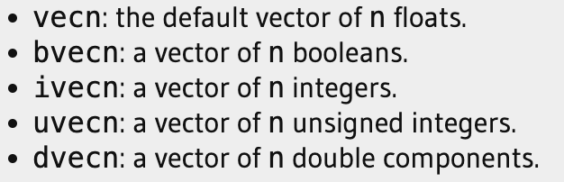
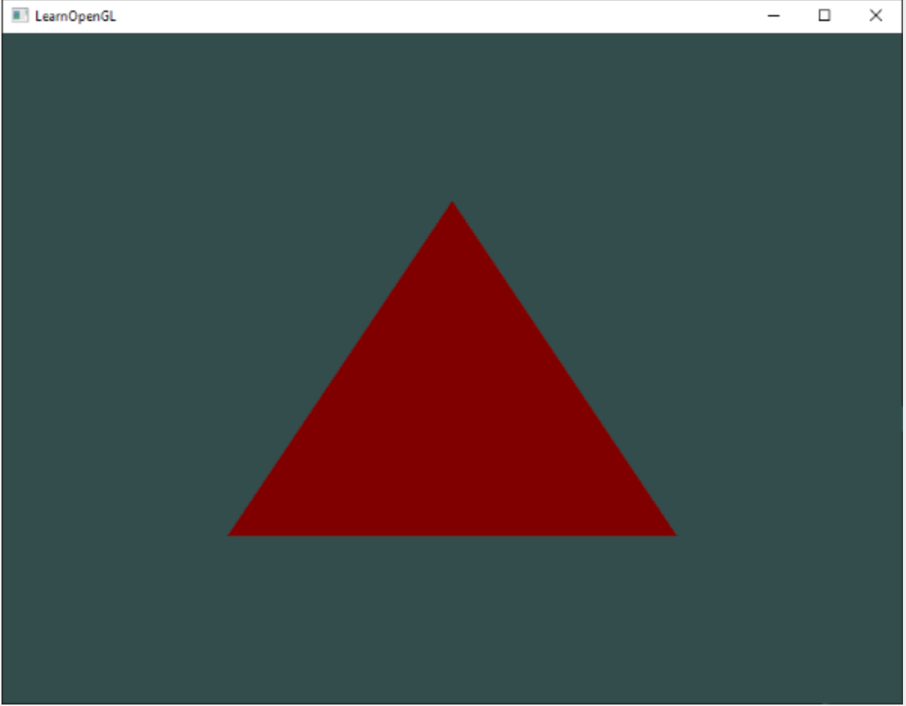
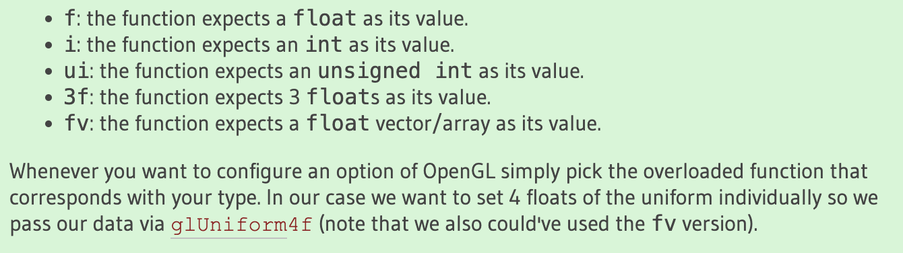
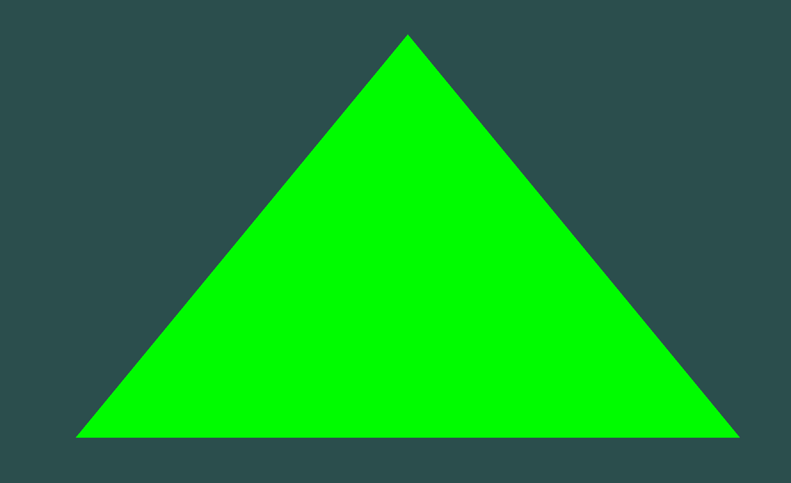
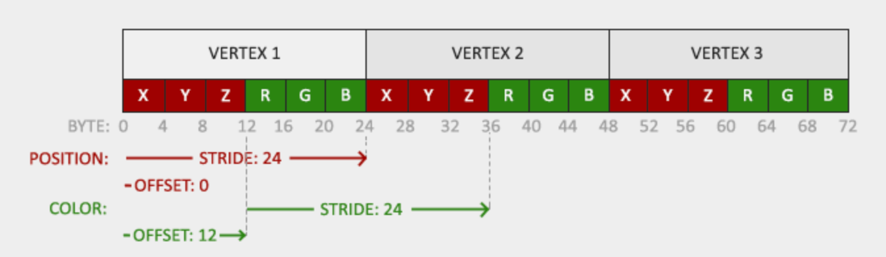
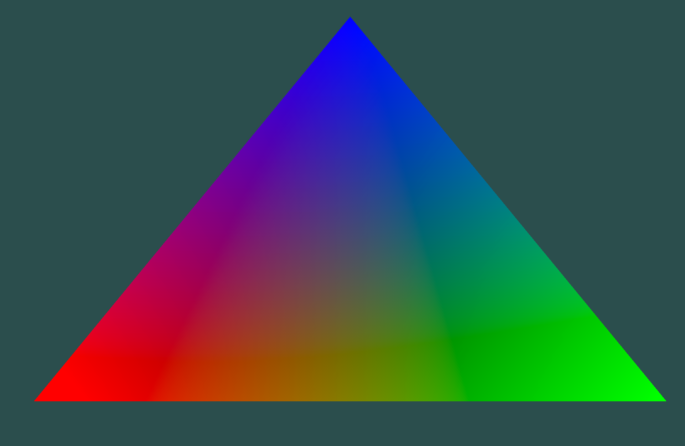

# GLSL 语法简介

一般一个表示 shader 的 GLSL 文件是以下的格式：

```glsl
#version version_number
in type in_variable_name;
in type in_variable_name;

out type out_variable_name;
  
uniform type uniform_name;
  
void main()
{
  // process input(s) and do some weird graphics stuff
  ...
  // output processed stuff to output variable
  out_variable_name = weird_stuff_we_processed;
}
```

假设我们谈得是 VS 的话，每一个输入的 type 对应了 VBO 中的一个属性：位置、颜色、纹理。。。

OpenGL保证始终至少有16个4分量(vec4)的顶点属性可用，但某些硬件可能允许更多，可以通过查询GL_MAX_VERTEX_ATTRIBS来获取：

```rust
// C++
int nrAttributes;
glGetIntegerv(GL_MAX_VERTEX_ATTRIBS, &nrAttributes);
std::cout << "Maximum nr of vertex attributes supported: " << nrAttributes << std::endl;

// Rust
let mut n_attrs = 0;
unsafe {
    GetIntegerv(MAX_VERTEX_ATTRIBS, &mut n_attrs);
    info!("VBO attrs supported by OpenGl is {n_attrs}")
}

// 输出
VBO attrs supported by OpenGl is 16
```

## 类型

GLSL 有着大多数基本类型：int，float，double，uint，bool

也有着独有的类型：vector 和 matrix

### Vectors

GLSL 计算向量是很特化的，不会超过四个向量的组成，主要是下面几部分：

每一个向量都有着一样的属性：

1. 位置属性：xyzw
2. 颜色属性：rgba
3. 纹理坐标：stpq

向量还有着独特的混合（swizzling）方式：

```glsl
vec2 someVec;
// 从 someVec 中拿到 x 和 y 分量组成一个新的 Vec
vec4 differentVec = someVec.xyxx;
vec3 anotherVec = differentVec.zyw;
vec4 otherVec = someVec.xxxx + anotherVec.yxzy;
```

也有着类似 Python 的组合方式：

```glsl
vec2 vect = vec2(0.5, 0.7);
vec4 result = vec4(vect, 0.0, 0.0);
vec4 otherResult = vec4(result.xyz, 1.0);
```

## 输入输出

GLSL 定义为了一种较小的执行程序，**就像一个函数一样**。

因此，对于一个 shader 程序来说，其输入输出很关键，他是整个着色器程序单元的接口，被 in/out 关键字所描述。除此之外，可能我们还想把上一个 shader 的输出发送给下一个 shader 的输入。我们看个例子：

```glsl
// VS

#version 330 core
layout (location = 0) in vec3 aPos; // the position variable has attribute position 0
  
out vec4 vertexColor; // specify a color output to the fragment shader

void main()
{
    gl_Position = vec4(aPos, 1.0); // see how we directly give a vec3 to vec4's constructor
    vertexColor = vec4(0.5, 0.0, 0.0, 1.0); // set the output variable to a dark-red color
}
```

```glsl
// PS

#version 330 core
out vec4 FragColor;
  
in vec4 vertexColor; // the input variable from the vertex shader (same name and same type)  

void main()
{
    FragColor = vertexColor;
} 
```

可以看到，VS 的输出被定义为了`vertexColor`，然后在 PS 的输入中同样定义同名的参数即可以使得链接器将二者链接起来。

因为我们在 VS 中将输出点的颜色定义为了黑红色，因此 PS 执行完毕之后，我们的三角形颜色会是如下的颜色：



### Uniforms

uniforms 是另一种在 Shaders 之间传输数据的方法，不同的是，uniforms 是一个 Gloable 的变量。

我们使用 uniforms 一般遵循以下步骤：

1. shader 中定义一个 uniform：

```glsl
#version 330 core
out vec4 FragColor;
  
uniform vec4 ourColor; // we set this variable in the OpenGL code.

void main()
{
    FragColor = ourColor;
}  
```

2. 在用户代码中进行设置。（注意到，我们在 shader 中定义的 uniform 没有值）

```c
float timeValue = glfwGetTime();
float greenValue = (sin(timeValue) / 2.0f) + 0.5f;
// 从 SPO 中获取到 uniform
int vertexColorLocation = glGetUniformLocation(shaderProgram, "ourColor");

// 激活 shaders
glUseProgram(shaderProgram);
// 设置 uniform 值
glUniform4f(vertexColorLocation, 0.0f, greenValue, 0.0f, 1.0f);
```

这里面比较关键的地方在于设置值的位置，**我们找到一个 uniform 不要求调用了`glUseProgram`，但是更新 uniform 则是要求在`glUseProgram`之后**，因为实际上这个值必须被设置到一个激活的 SPO 对象中。

> GLSL 没有函数重载，一般对类型的标注都是在函数后缀中，以 glUniform 为例：
>
> 

最后是一个典型的例子：

```c
while(!glfwWindowShouldClose(window))
{
    // input
    processInput(window);

    // render
    // clear the colorbuffer
    glClearColor(0.2f, 0.3f, 0.3f, 1.0f);
    glClear(GL_COLOR_BUFFER_BIT);

    // be sure to activate the shader
    glUseProgram(shaderProgram);
  
    // update the uniform color
    float timeValue = glfwGetTime();
    float greenValue = sin(timeValue) / 2.0f + 0.5f;
    int vertexColorLocation = glGetUniformLocation(shaderProgram, "ourColor");
    glUniform4f(vertexColorLocation, 0.0f, green0Value, 0.0f, 1.0f);

    // now render the triangle
    glBindVertexArray(VAO);
    glDrawArrays(GL_TRIANGLES, 0, 3);
  
    // swap buffers and poll IO events
    glfwSwapBuffers(window);
    glfwPollEvents();
}
```

## 抽象一个 MyShader 类出来

编写、编译和管理着色器可能会非常繁琐，而且基本是样板代码。我们这里会尝试将整个流程给封装完毕。

### MyShader 类型定义

基于上面的知识，我们知道对一个 SPO 来说，关键的地方在于其 ID。而创建 SPO 的时候需要做好错误 catch 等策略，不过都是可以封装在 new 中的：

```rust
pub struct MyShader {
    program_id: GLuint
}

trait TShader {
    /// 新建一个 shader program 对象
    fn new_spo(vs_path: &str, ps_path: &str) -> Self;

    /// 封装 glUseProgram
    fn use_spo();

    /// 设置 uniform bool 的工具方法
    fn set_bool(name: &str, val: bool);

    /// 设置 uniform int 的工具方法
    fn set_int(name: &str, val: i32);

    /// 设置 uniform float 的工具方法
    fn set_float(name: &str, val: f32);
}
```

### 读取文件

我们从文件中读取一个数据比较简单，不过在 Rust 中读出来的时候需要注意一下类型——使用 CStr 保证最后有换行：
```rust
/// 从 glsl 文件中读取数据为 CString 结构
pub(crate) fn read_glsl_from_resource(path: &str) -> anyhow::Result<CString> {
    let f = File::open(path)?;
    let mut reader = BufReader::new(f);
    let mut buffer = Vec::new();

    // 将文件中的所有内容读取到一个 buffer 中
    reader.read_to_end(&mut buffer)?;

    // 将读取到的数据转换为一个 CString
    let ss = String::from_utf8(buffer)?;
    let cstr = CString::new(ss)?;

    Ok(cstr)
}
```

### 转换 Rust char 为 c_char

我们在做 FFI 层的时候，经常需要考虑将 Rust 的 char 类型转换为 c 的 char 类型。这里面有一个比较麻烦的地方：

* Rust 的 char 支持 UTF-8 编码，因此是个 32 位的类型，4-byte；
* C 的 char 是 ASCII 编码，是个 8 位的类型，1-byte。

因此，这里问题的核心在于如何把一个 32 位数安全的转换为 8 位数，而这中间一定会存在截断。而实际上我们知道，UTF8 是兼容 ASCII 的：

```
let a = 'a';
println!("a in rust char={}", a as u32);
let a = b'a';
println!("a in c char={}", a);

// 输出
a in rust char=97
a in c char=97
```

因此，方案就出来了，我们仅需要确保输入的 Rust &str 类型中的数据大小在 ASCII 范围中即可满足转换要求：

> https://stackoverflow.com/questions/41750067/how-to-convert-a-char-to-a-libcc-char
>
> 有着比较清晰的解释。

```rust
let c = 'ï';
let v = c as u32;
assert!(v <= 127, "Invalid C character value");
let v = v as libc::c_char;
```

而我们封装函数就可以这么来弄：

```rust
impl MyShader {
		pub fn parse_uniform_location(&self, name: &str) -> GLint {
        let slice_c_char = name.chars().map(|c| {
            let v = c as u32;

            if v > 127 {
                // 不是 ASCII 字符
                error!("[parse_uniform_location] char {c} is not ASCII, can not transform to c_char");
                0
            } else {
                v as c_char
            }
        }).collect::<Vec<i8>>();
        let location = unsafe { GetUniformLocation(self.program_id, slice_c_char.as_ptr()) };

        location
    }
}
```

### 初始化 shader

读取了数据之后就可以将其链接上对应的 VS 和 PS 了, 此时我们的 new 方法就可以完整的展示出来：

```rust
impl TShader for MyShader {
    fn new_spo(vs_path: &str, ps_path: &str) -> anyhow::Result<Self> {
        // 1. 读取文件中的 glsl 代码
        let vs_code = read_glsl_from_resource(vs_path)?;
        let ps_code = read_glsl_from_resource(ps_path)?;

        // 2. 编译 shader
        let vs_id = Self::compile_shader(VERTEX_SHADER, vs_code)?;
        let ps_id = Self::compile_shader(FRAGMENT_SHADER, ps_code)?;

        let mut id = 0;
        unsafe {
            // 4. 生成 SPO ID
            id = CreateProgram();

            // 5. 获取 shader 并链接
            AttachShader(id, vs_id);
            AttachShader(id, ps_id);
            LinkProgram(id);

            // 处理错误信息
            Self::check_spo_compile_error(id);

            // 链接完毕，删除 shader
            DeleteShader(vs_id);
            DeleteShader(ps_id);
        }

        Ok(Self { program_id: id })
    }
}
```

### 封装修改 uniform 的方法

在获取到了 id 对象之后，并且阐述清楚 Rust char 同 C char 的差别后，我们就可以封装一下对应的修改 uniforms 的方法了：

```rust
impl TShader for MyShader {
		
  	// ...
  
    fn use_spo(&self) {
        unsafe { UseProgram(self.program_id) }
    }

    fn set_bool(&self, name: &str, val: bool) {
        unsafe {
            let val = match val {
                true => 1,
                false => 0
            };
            Uniform1i(self.parse_uniform_location(name), val)
        }
    }

    fn set_int(&self, name: &str, val: i32) {
        unsafe {
            Uniform1i(self.parse_uniform_location(name), val)
        }
    }


    fn set_float(&self, name: &str, val: f32) {
        unsafe {
            Uniform1f(self.parse_uniform_location(name), val)
        }
    }
}
```

## 完成一个变换颜色的三角形

基于我们的新对象以及对 GLFW 的封装：

```rust
use std::sync::Mutex;
use glfw::{Glfw, GlfwReceiver, OpenGlProfileHint, PWindow, WindowEvent, WindowHint};
use log::error;

pub struct GlfwLocal {
    pub window: PWindow,        // 里面有一个 GLFW 对象
    pub receiver: GlfwReceiver<(f64, WindowEvent)>
}

impl GlfwLocal {

    /// 创建一个本地 glfw 对象, 并创建一个 window
    pub fn new() -> anyhow::Result<GlfwLocal> {
        let mut glfw = glfw::init(glfw_error_callback).unwrap();
        // 配置 glfw 的版本为 3.3
        glfw.window_hint(WindowHint::ContextVersionMajor(3));
        glfw.window_hint(WindowHint::ContextVersionMinor(3));
        // 配置为 Core 模式，这也是我们学习的主要目标
        glfw.window_hint(WindowHint::OpenGlProfile(OpenGlProfileHint::Core));
        // mac 下需要配
        glfw.window_hint(WindowHint::OpenGlForwardCompat(true));

        let (window, receiver) = glfw.create_window(1920, 1080, "hello window", glfw::WindowMode::Windowed).expect("Failed to create GLFW window.");

        Ok(Self {
            window,
            receiver
        })
    }


}

pub fn glfw_error_callback(err: glfw::Error, description: String) {
    error!("GLFW error {:?}: {:?}", err, description);
}
```

我们可以实现一个颜色随时间变换的三角形：

```rust
use std::ffi::{c_uint, c_void, CStr};
use std::mem::{size_of, size_of_val};
use std::os::raw::c_char;
use std::ptr::null;
use glad_gl::gl;
use glad_gl::gl::{ARRAY_BUFFER, BindBuffer, BindVertexArray, BufferData, Clear, ClearColor, COLOR_BUFFER_BIT, DrawArrays, EnableVertexAttribArray, FALSE, FLOAT, GenBuffers, GenVertexArrays, GetIntegerv, GLfloat, GLsizei, GLuint, IsBuffer, MAX_VERTEX_ATTRIBS, STATIC_DRAW, TRIANGLES, Uniform4f, UseProgram, VertexAttribPointer};
use glfw::{Action, Context, Key, Window};
use glfw::ffi::glfwGetTime;
use log::{error, info};
use egl_learn::log::{init_log, LogLevel};
use egl_learn::shader::MyShader::{MyShader, TShader};
use egl_learn::utils::process_input;
use egl_learn::window::GlfwLocal;

fn main() -> anyhow::Result<()>{
    init_log(LogLevel::TRACE);
    let mut glfw_local = GlfwLocal::new()?;
    glfw_local.window.set_framebuffer_size_callback(|window, width, height| {
        info!("frame buffer size changed! width={width}, height={height}")
    });

    // 使得当前窗口作为 context
    glfw_local.window.make_current();
    // 加载 glad
    gl::load(|e| glfw_local.window.glfw.get_proc_address_raw(e) as *const std::os::raw::c_void);

    // 创建一个 shader
    let my_shader = MyShader::new_spo(
        "./src/shader/vertex_shader/simple_vertex_shader.glsl",
        "./src/shader/fragment_shader/simple_fragment_shader.glsl"
    )?;


    // 定义顶点数据及定点属性
    let verticals: [f32; 9] = [
        -0.5, -0.5, 0.0,
        0.5, -0.5, 0.0,
        0.0,  0.5, 0.0
    ];

    // vbo、vao 对象 ID
    let mut vbo: c_uint = 0;
    let mut vao: c_uint = 0;
    unsafe {
        // 生成 vbo、vao
        GenVertexArrays(1, &mut vao);
        GenBuffers(1, &mut vbo);
        info!("Create vao={vao}, vbo={vbo}");

        // 绑定 vao、vbo
        BindVertexArray(vao);
        BindBuffer(ARRAY_BUFFER, vbo);

        // 配置顶点属性
        BufferData(ARRAY_BUFFER, size_of_val(&verticals) as isize, verticals.as_ptr() as *const c_void, STATIC_DRAW);
        // 告诉 OpenGL 如何解释顶点数据
        VertexAttribPointer(0, 3, FLOAT, FALSE, (3 * size_of::<f32>()) as GLsizei, null());

        EnableVertexAttribArray(0);

        // unbind，释放资源
        BindBuffer(ARRAY_BUFFER, 0);
        BindVertexArray(0)
    }

    while !glfw_local.window.should_close() {
        process_input(&mut glfw_local.window);

        // 这里写渲染命令即可
        unsafe {
            ClearColor(0.2, 0.3, 0.3, 1.0);
            Clear(COLOR_BUFFER_BIT);

            my_shader.use_spo();

            let time = glfwGetTime();
            let green = time.sin() / 2f64 + 0.5f64;
            let location = my_shader.parse_uniform_location("ourColor");
            info!("ourColor location={location}");
            Uniform4f(location, 0 as GLfloat, green as GLfloat, 0 as GLfloat, 1 as GLfloat);

            // 画三角形
            BindVertexArray(vao);
            DrawArrays(TRIANGLES, 0, 3)
        }

        // 持续交换 front 与 back buffer
        glfw_local.window.swap_buffers();
        // Poll for and process events
        glfw_local.window.glfw.poll_events();
    }


    Ok(())
}
```

大致是会变换为下面这样的颜色，直到黑色：



# 更多属性的 VBO

在上一章中，我们看到了如何填充VBO，配置顶点属性指针并将所有内容存储在 VAO 中。这一次，我们还想**将颜色数据添加到顶点数据**中。我们将颜色数据作为 3 个浮点数添加到顶点数组中。我们分别为我们三角形的每个角分配红色、绿色和蓝色:

```rust
// 定义顶点数据及顶点属性
let verticals: [f32; 18] = [
  	// 位置						 // 颜色
    -0.5, -0.5, 0.0, 	1.0, 0.0, 0.0,
    0.5, -0.5, 0.0, 	0.0, 1.0, 0.0,
    0.0,  0.5, 0.0, 	0.0, 0.0, 1.0
];
```

此时回想我们在 VS 中写的 layout 属性，当时我们只写了针对位置的：

```
layout (location = 0) in vec3 aPos;
```

现在我们多了颜色属性，因此需要简单的修改一下 VS：

```glsl
#version 330 core
layout (location = 0) in vec3 aPos;   // the position variable has attribute position 0
layout (location = 1) in vec3 aColor; // the color variable has attribute position 1
  
out vec3 ourColor; // output a color to the fragment shader

void main()
{
    gl_Position = vec4(aPos, 1.0);
    ourColor = aColor; // set ourColor to the input color we got from the vertex data
}  
```

同样的，我们修改 PS 来接受 VS 的输出：

```rust
#version 330 core
out vec4 FragColor;  
in vec3 ourColor;
  
void main()
{
    FragColor = vec4(ourColor, 1.0);
}
```

此时，因为我们的 VBO 中多了另一个属性，其内存布局就不一样了：



相比于原来仅 12 字节的步长增加了一倍，此时步长是 24 字节。另外就是偏移也变化了：

1. 位置偏移还是 0；
2. 颜色偏移是 12，也即位置属性的长度。

我们看下怎么体现到代码中：

```rust
// 3.1. 配置位置属性
let offset = 0;
VertexAttribPointer(0, 3, FLOAT, FALSE, (6 * size_of::<f32>()) as GLsizei, offset as *const c_void);
EnableVertexAttribArray(0);

// 3.2. 配置颜色属性
let offset = 3 * size_of::<f32>();
VertexAttribPointer(1, 3, FLOAT, FALSE, (6 * size_of::<f32>()) as GLsizei, offset as *const c_void);
EnableVertexAttribArray(1);
```

接下来，我们运行代码就可以看到完整的输出了：



需要看到的是，虽然我们只是对三个点设置了红蓝绿三种颜色，但最终出来的结果是一个渐变的效果。这是由于 PS 中的 fragment 插值的结果：

当渲染三角形时，光栅化阶段通常会产生比最初指定的顶点数量更多的片元。然后光栅化器根据这些片元的位置确定它们的位置，这些位置会插值所有片段着色器的输入变量。

> 比如说，我们有一条线，上端点是绿色，下端点是蓝色。如果 PS 在该线位置的70%处运行，那么它的输入颜色属性将是绿色和蓝色的线性组合；更精确地说是30%的蓝色和70%的绿色。

## VertexAttribPointer pointer 参数详解

VertexAttribPointer 的参数包含以下几个：

```rust
// params：
// - index：在对应 VS 文件的 location 位置
// - size： 属性长度，例如二维坐标就是 2，三维坐标为 3，注意需要对应到数组中去。我们这里是三个数表示坐标，因此是 3
// - type： 数据类型，这里是 FLOAT
// - normalized：是否需要归一化为 [-1, 1] 区间
// - stride：步长
// - offset：偏移
```

最后一位 offset 是比较奇怪的，他是一个`void*`的类型，但是实际上在 C 中，`void*`指向的数据是不能直接被解码为对应的类型的，必须强转，例如：

```c
// 直接操作 void* 指针是不安全的
void*      pvoid ;
pvoid++          ; //ANSI：错误
pvoid+=1         ; //ANSI：错误

// 必须转一下
void * pvoid      ;
(char*) pvoid++    ; //ANSI：正确；GNU：正确
(char*) pvoid+=1   ; //ANSI：错误；GNU：正确

// 直接操作 void 是错误的，void不能代表一个真实的变量
void a            ; //错误
function(void a)  ; //错误
```

我们想要理解 VertexAttribPointer 中的 offset 可以对应着 **memcpy** 和 **memset** 来看：

```C
void * memcpy(void *dest,constvoid * src,size_tlen);
void * memset(void * buffer,intc,size_tnum);
```

任何类型的指针都可以传入memcpy和memset中，这真实地体现了内存操作函数的意义————它操作的对象仅仅是一片内存，而不论这片内存是什么类型。

如果 memcpy和memset的参数类型不是void *，而是char *，那才叫真的奇怪了！这样的memcpy和memset明显不是一个“纯粹的”函数。
下面的代码执行正确：

> 参考：https://www.cnblogs.com/limanjihe/p/10113304.html

```C
int  intarray[100] ;
memset(intarray,0,100*sizeof(int)); //将intarray清0

int intarray1[100], intarray2[100];
memcpy(intarray1,intarray2,100*sizeof(int));   //将intarray2拷贝给intarray1
```

而在这里，我们要正确使用 VertexAttribPointer 的话，我们传入的参数得是这样的：

```rust
let offset = 3 * size_of::<f32>();
// 我们将 offset 这个数直接转为了一个地址！
VertexAttribPointer(1, 3, FLOAT, FALSE, (6 * size_of::<f32>()) as GLsizei, offset as *const c_void);
EnableVertexAttribArray(1);
```

可以看到，他是直接读取`void*`指针的地址来获取 offset 值的，我们不能传入一个指向数据的指针：

```rust
let offset = 3 * size_of::<f32>();
let p_offset = &offset as *const usize;

// 我们将指向 offset 这个数的指针传了进去：
VertexAttribPointer(1, 3, FLOAT, FALSE, (6 * size_of::<f32>()) as GLsizei, p_offset as *const c_void);
EnableVertexAttribArray(1);
```

此时会绘制失败。很显然，这是因为 OpenGL 不对传入的类型做保证，因为传入一个`void*`数据时，OpenGL 是不清楚究竟是 int 还是 double 类型的，也无从解码，直接拿地址更好。

> 当然，我也不清楚为什么不直接定义为 GLint 啥的。

## vbo 设置步骤

经过这次处理，我们知道了 vbo 和 vao 遵循怎么一个处理步骤：

```rust
fn main() -> anyhow::Result<()>{
		// ....

    // 创建一个 shader
    let my_shader = MyShader::new_spo(
        "./src/shader/vertex_shader/vs_with_color.glsl",
        "./src/shader/fragment_shader/ps_get_color_from_vs.glsl"
    )?;


    // 定义顶点数据及顶点属性
    let verticals: [f32; 18] = [
        // 位置				// 颜色
        -0.5, -0.5, 0.0, 	1.0, 0.0, 0.0,
        0.5, -0.5, 0.0, 	0.0, 1.0, 0.0,
        0.0,  0.5, 0.0, 	0.0, 0.0, 1.0
    ];

    // vbo、vao 对象 ID
    let mut vbo: c_uint = 0;
    let mut vao: c_uint = 0;
    unsafe {
        // 生成一个 vbo、vao
        GenVertexArrays(1, &mut vao);
        GenBuffers(1, &mut vbo);
        info!("Create vao={vao}, vbo={vbo}");
        // 1. 绑定 VAO，这个应该是先于其他步骤的
        BindVertexArray(vao);

        // 2. 绑定和设置 VBO，配置顶点属性
        BindBuffer(ARRAY_BUFFER, vbo);
        BufferData(ARRAY_BUFFER, size_of_val(&verticals) as isize, verticals.as_ptr() as *const c_void, STATIC_DRAW);

        // 3. 配置顶点属性，此时需要配置两次
        // params：
        // - index：在对应 VS 文件的 location 位置
        // - size： 属性长度，例如二维坐标就是 2，三维坐标为 3，注意需要对应到数组中去。我们这里是三个数表示坐标，因此是 3
        // - type： 数据类型，这里是 FLOAT
        // - normalized：是否需要归一化为 [-1, 1] 区间
        // - stride：步长
        // - offset：偏移

        // 3.1. 配置位置属性
        let offset = 0;
        VertexAttribPointer(0, 3, FLOAT, FALSE, (6 * size_of::<f32>()) as GLsizei, offset as *const c_void);
        EnableVertexAttribArray(0);

        // 3.2. 配置颜色属性
        let offset = 3 * size_of::<f32>();
        VertexAttribPointer(1, 3, FLOAT, FALSE, (6 * size_of::<f32>()) as GLsizei, offset as *const c_void);
        EnableVertexAttribArray(1);


        // unbind，释放资源
        BindBuffer(ARRAY_BUFFER, 0);
        BindVertexArray(0)
    }

    // 因为只有一个 shader，所以可以在渲染 loop 外面直接激活一次
    my_shader.use_spo();

    while !glfw_local.window.should_close() {
				// ...
    }


    Ok(())
}
```

如上：

1. 绑定 VAO，这个应该是先于其他步骤
2. 绑定和设置 VBO，配置顶点属性
3. 配置顶点属性
   1. 配置位置属性
   2. 配置颜色属性
   3. 配置纹理属性
4. unbind，释放资源，这步可选。

> "可以解绑VAO，这样其他VAO调用就不会意外修改此VAO，但这种情况很少发生。修改其他VAO需要调用glBindVertexArray，因此在不直接需要时，通常我们不会解绑VAO（也不会解绑VBO）"

# 附录

## MyShader 源码

```rust
use std::ffi::{CStr, CString};
use std::os::raw::c_char;
use std::ptr::null;
use std::str::FromStr;
use glad_gl::gl::{AttachShader, COMPILE_STATUS, CompileShader, CreateProgram, CreateShader, DeleteShader, FRAGMENT_SHADER, GetProgramInfoLog, GetProgramiv, GetShaderInfoLog, GetShaderiv, GetUniformLocation, GLenum, GLint, GLuint, LINK_STATUS, LinkProgram, ShaderSource, Uniform1f, Uniform1i, UseProgram, VERTEX_SHADER};
use glfw::Key::O;
use log::{error, info};
use crate::shader;
use crate::shader::read_glsl_from_resource;

pub struct MyShader {
    program_id: GLuint,
}

pub trait TShader {
    /// 新建一个 shader program 对象
    fn new_spo(vs_path: &str, ps_path: &str) -> anyhow::Result<MyShader>;

    /// 封装 glUseProgram
    fn use_spo(&self);

    /// 设置 uniform bool 的工具方法
    fn set_bool(&self, name: &str, val: bool);

    /// 设置 uniform int 的工具方法
    fn set_int(&self, name: &str, val: i32);

    /// 设置 uniform float 的工具方法
    fn set_float(&self, name: &str, val: f32);
}

impl TShader for MyShader {
    fn new_spo(vs_path: &str, ps_path: &str) -> anyhow::Result<Self> {
        // 1. 读取文件中的 glsl 代码
        let vs_code = read_glsl_from_resource(vs_path)?;
        let ps_code = read_glsl_from_resource(ps_path)?;

        // 2. 编译 shader
        let vs_id = Self::compile_shader(VERTEX_SHADER, vs_code)?;
        let ps_id = Self::compile_shader(FRAGMENT_SHADER, ps_code)?;

        let mut id = 0;
        unsafe {
            // 4. 生成 SPO ID
            id = CreateProgram();

            // 5. 获取 shader 并链接
            AttachShader(id, vs_id);
            AttachShader(id, ps_id);
            LinkProgram(id);

            // 处理错误信息
            Self::check_spo_compile_error(id);

            // 链接完毕，删除 shader
            DeleteShader(vs_id);
            DeleteShader(ps_id);
        }

        Ok(Self { program_id: id })
    }

    fn use_spo(&self) {
        unsafe { UseProgram(self.program_id) }
    }

    fn set_bool(&self, name: &str, val: bool) {
        unsafe {
            let val = match val {
                true => 1,
                false => 0
            };
            Uniform1i(self.parse_uniform_location(name), val)
        }
    }

    fn set_int(&self, name: &str, val: i32) {
        unsafe {
            Uniform1i(self.parse_uniform_location(name), val)
        }
    }


    fn set_float(&self, name: &str, val: f32) {
        unsafe {
            Uniform1f(self.parse_uniform_location(name), val)
        }
    }
}

impl MyShader {
    fn compile_shader(shader_type: GLenum, code: CString) -> anyhow::Result<GLuint> {
        unsafe {
            // 创建 shader 并给入源码进行编译，这个就是 ID
            let p_shader = CreateShader(shader_type);
            // glsl 源码指针
            let p_glsl = &code.as_ptr() as *const *const c_char;
            ShaderSource(p_shader, 1, p_glsl, null());
            CompileShader(p_shader);

            // 处理错误信息
            let mut success = 0;
            let mut info: [c_char; 512] = [c_char::MIN; 512];
            GetShaderiv(p_shader, COMPILE_STATUS, &mut success);

            if success == 1 {
                info!("[compile_shader] Compile {:?} success, success={success}", shader_type)
            } else {
                // 这是一个可以为 NULL 的数，我们随便给一个传进去
                let mut length = 10;
                GetShaderInfoLog(p_shader, 512, &mut length, info.as_mut_ptr());
                error!("[get_vertex_shader] Compile {:?} fail, success={success}, infos: {:?}", shader_type, CStr::from_ptr(info.as_ptr()));
            }
            Ok((p_shader))
        }
    }

    fn check_spo_compile_error(id: GLuint) {
        let mut success = 0;
        let mut info: [c_char; 512] = [c_char::MIN; 512];
        unsafe {
            GetProgramiv(id, LINK_STATUS, &mut success);

            if success == 1 {
                info!("[check_spo_compile_error] Compile success, success={success}")
            }else {
                // 这是一个可以为 NULL 的数，我们随便给一个传进去
                let mut length = 10;
                GetProgramInfoLog(id, 512, &mut length, info.as_mut_ptr());
                error!("[check_spo_compile_error] Compile fail, success={success}, infos: {:?}", CStr::from_ptr(info.as_ptr()));
            }
        }
    }

    pub fn parse_uniform_location(&self, name: &str) -> GLint {
        let slice_c_char = name.chars().map(|c| {
            let v = c as u32;

            if v > 127 {
                // 不是 ASCII 字符
                error!("[parse_uniform_location] char {c} is not ASCII, can not transform to c_char");
                0
            } else {
                v as c_char
            }
        }).collect::<Vec<i8>>();
        let location = unsafe { GetUniformLocation(self.program_id, slice_c_char.as_ptr()) };

        location
    }
}
```

