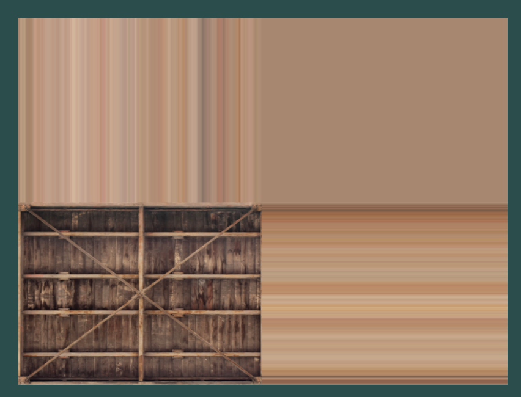

#  Texture

为了给物体增加更多细节，我们学会了使用每个顶点的颜色来创建一些有趣的图像。然而，为了获得相当多的真实感，我们必须拥有许多顶点，这样我们才能指定很多颜色。这需要大量的额外开销————**每个模型都需要更多的顶点，而每个顶点还需要一个颜色属性**。

艺术家和程序员通常更喜欢使用纹理。纹理是用来为物体增加细节的二维图像（甚至存在一维和三维纹理）；我们可以把纹理想象成一张上面有漂亮的砖块图像的贴纸，我们把这张贴纸贴在三维房子上，这样看起来房子外面就像是砖块一样。

由于我们可以在单个图像中插入许多细节，所以我们可以营造出物体非常详细的假象，而无需指定额外的顶点数据。

## 简介

### 什么是 Texture

Texture 本质上就是一张图片，可以选择性的覆盖在我们渲染的图形上，也即上面提到的贴纸。纹理是 1D、2D、3D 的图像。

### 坐标映射

为了将纹理映射到我们上一节画的三角形上，首先需要告诉 OpenGL **我们绘制的三角形的每个顶点具体对应纹理的哪个部分**。因此，每个三角形顶点都应该有与之关联的纹理坐标（texture coordinate），该坐标指定从纹理图像中采样的部分。然后片元插值（Fragment interpolation）为其他片元完成剩下的工作。我们假设纹理图片如下：


我们把他盖在之前的三角形上，预期如下：


其需要提供对应的纹理坐标。而与顶点坐标不同的是。纹理坐标在x和y轴上从0到1范围内（我们使用的是2D纹理图像）。**使用纹理坐标检索纹理颜色称为采样（sampling）**。纹理坐标从纹理图像的左下角（0,0）开始，到右上角（1,1）结束。

下图展示了我们如何将纹理坐标映射到三角形上：


在上面的图中，我们为**准备覆盖的三角形**指定了3个纹理坐标点：

1. 我们希望三角形的左下角与纹理的左下角对应，因此我们使用(0,0)纹理坐标来指定三角形的左下顶点。
2. 同样，右下角也对应(1,0)纹理坐标。
3. 三角形的顶部应与纹理图像的顶部中心对应，因此我们将(0.5,1.0)作为其纹理坐标。

我们只需要将3个纹理坐标传递给顶点着色器，然后由顶点着色器将这些坐标传递到片段着色器，片段着色器将为每个片段整洁地插值所有纹理坐标。

我们上面提到的纹理坐标可以表述如下：

```C
float texCoords[] = {
    0.0f, 0.0f,  // lower-left corner  
    1.0f, 0.0f,  // lower-right corner
    0.5f, 1.0f   // top-center corner
};
```

### 纹理采样（纹理坐标 s、t、r）

实际上，纹理的采样的实现方式较多，可以以许多不同的方式完成。因此，我们需要告诉OpenGL应该如何对其纹理进行采样。

这种宽松定义主要是为了解决某些情况下，当纹理会超过 (0,0)-(1,1) 这个坐标范围时不知道如何展示的问题。OpenGL 的默认行为是重复纹理图像，一般来说会忽略浮点纹理坐标的整数部分来完成（也即 (1.2, 5.1) 的位置会被映射到 (0.2, 0.1) 上），而实际上可选项也比较多：

* GL_REPEAT：默认的重复情况，也即上面的描述；
* GL_MIRRORED_REPEAT：类似于 GL_REPEAT 不过做了镜像处理；
* GL_CLAMP_TO_EDGE：将坐标强行夹在0和1之间。 一般结果是更高的坐标被夹在边缘，导致拉伸的边缘图案。
* GL_CLAMP_TO_BORDER：0-1 范围之外的坐标将被赋予用户指定的边框颜色。

上面比较抽象，文档中给了个图很清晰：


上面提到的类型，最终是使用`glTexParameter*`函数来针对**每个坐标轴**（s，t（如果您使用3D纹理，则还有r，相当于x，y，z））进行设置：

```C
glTexParameteri(GL_TEXTURE_2D, GL_TEXTURE_WRAP_S, GL_MIRRORED_REPEAT);
glTexParameteri(GL_TEXTURE_2D, GL_TEXTURE_WRAP_T, GL_MIRRORED_REPEAT);
```

该函数签名包含以下信息：

1. 第一个参数指定纹理类型；我们使用的是2D纹理，所以纹理目标是GL_TEXTURE_2D。

2. 第二个参数要求我们告诉要设置哪个选项以及哪个纹理轴；我们要为S和T轴都配置它。

3. 最后一个参数要求我们传入我们想要的纹理环绕模式，在这种情况下，OpenGL将在当前活动的纹理上用GL_MIRRORED_REPEAT来设置其纹理环绕选项。

如果我们选择了GL_CLAMP_TO_BORDER选项，我们还应该指定边框颜色。这可以通过使用glTexParameter函数的带fv后缀的等效函数来完成，选项是GL_TEXTURE_BORDER_COLOR，例如我们传入一个边框颜色值的浮点数组：

```C
float borderColor[] = { 1.0f, 1.0f, 0.0f, 1.0f };
glTexParameterfv(GL_TEXTURE_2D, GL_TEXTURE_BORDER_COLOR, borderColor);  
```

### 纹理过滤

上面我们提到的纹理坐标区域**不依赖于分辨率**，它可以是任何浮点值，因此OpenGL需要确定要**将纹理坐标映射到具体哪个纹理像素**（也称为 texel ）。

假设我们有一个非常大的被覆盖对象和一个比较低分辨率纹理，纹理过滤就变得特别重要了。OpenGL也有针对此纹理过滤的选项，它有好几个可用的，但现在我们仅讨论最重要的选项：GL_NEAREST 和 GL_LINEAR。

1. GL_NEAREST（也被称为最近邻点过滤）是OpenGL的默认纹理过滤方法。设置为GL_NEAREST时，OpenGL会选择离纹理坐标最近的像素。在下图中可以看到4个像素，而其中的黑色十字点代表着准确的纹理坐标。左上角的像素的中心最接近纹理坐标，因此被选为采样颜色。


2. GL_LINEAR（也称为（双）线性过滤）会从**纹理坐标附近的像素插值出一个值**，从而在像素之间计算近似颜色。**纹理坐标到像素中心的距离越小，该像素的颜色对采样颜色的贡献就越大**。下面我们可以看到返回了相邻像素的混合颜色：


下图我们可以看到当在一个大对象上使用低分辨率纹理时，上述这两个方法是如何工作的（我们将纹理放大，使得单个 texel 变得可见）：


在上图中可以看到：

1. GL_NEAREST会导致出现分块的现象，我们可以清晰地看到形成纹理的像素；
2. 而GL_LINEAR会产生一个更平滑的模式，在这种模式下，单独的像素不太明显。

GL_LINEAR产生了更真实的输出，但一些开发者更喜欢更接近8位风格的外观，因此选择了GL_NEAREST选项。

此外，纹理过滤**可以设置为放大和缩小操作**（当进行放大或缩小时）。例如在纹理被缩小时使用最近邻过滤，而在纹理被放大时使用线性过滤。因此，我们需要通过`glTexParameter*`为两个选项都指定过滤方法。例子如下：

```C
glTexParameteri(GL_TEXTURE_2D, GL_TEXTURE_MIN_FILTER, GL_NEAREST);
glTexParameteri(GL_TEXTURE_2D, GL_TEXTURE_MAG_FILTER, GL_LINEAR);
```

### Mipmaps

想象一下，我们有一个很大的房间，其中放置了成千上万个物体，每个物体都附带有一个纹理。远处的物体和靠近观察者的物体都使用相同分辨率的纹理。

我们考虑近大远小的观察情况，远处的物体可能在眼中或者屏幕上只产生很少的一些片段，OpenGL 无法从高分辨率纹理中检索片段的正确颜色值。这是因为它必须为**跨纹理的较大范围内的片段选择纹理颜色**。这将在小物体上产生可见的伪影，**更不用说在小物体上使用高分辨率纹理会浪费内存带宽**。

为了解决这个问题，OpenGL 使用了一个叫做 mipmaps 的概念，它是一组纹理图像，**其中每个后续纹理都比前一个小一倍**。 mipmaps 背后的思想应该很容易理解：在距离观察者一定距离以上，OpenGL 将使用最适合物体距离的不同 mipmap 纹理。因为物体很远，用户不会注意到较小的分辨率。OpenGL 能够对正确的纹素进行采样，而且在对 mipmap 的采样时涉及的高速缓存内存更少。让我们更近距离地看一下 mipmapped 纹理是什么样子的：


如果我们每次都需要手动为每个纹理图像创建一个级联纹理集合的话，样板代码会很多，也会比较繁琐。因此 OpenGL 提供了接口，一旦我们创建了一个纹理，OpenGL 能够通过一次`glGenerateMipmap`的调用来完成所有工作。

在渲染时切换不同的级联纹理层级时，OpenGL可能会显示一些伪影，例如在两个级联纹理层级之间可见的锋利边缘。因此就像普通纹理过滤一样，我们也可以使用NEAREST和LINEAR过滤来在级联纹理层级之间进行过滤。OpenGL 提供了以下四个过滤方法：

1. GL_NEAREST_MIPMAP_NEAREST：选择最接近像素大小的级联纹理，并使用最近邻插值进行纹理采样。
2. GL_LINEAR_MIPMAP_NEAREST：选择最近的级联纹理层级，并使用线性插值对该级别进行采样。
3. GL_NEAREST_MIPMAP_LINEAR：在最接近像素大小的两个级联纹理之间进行线性插值，并使用最近邻插值对插值级别进行采样。
4. GL_LINEAR_MIPMAP_LINEAR：在两个最接近的级联纹理之间进行线性插值，并使用线性插值对插值级别进行采样。

就像纹理过滤一样，我们可以使用glTexParameteri将过滤方法设置为前述的四种方法之一：

```C
glTexParameteri(GL_TEXTURE_2D, GL_TEXTURE_MIN_FILTER, GL_LINEAR_MIPMAP_LINEAR);
glTexParameteri(GL_TEXTURE_2D, GL_TEXTURE_MAG_FILTER, GL_LINEAR);
```

常见的错误是将mipmap滤波选项之一设置为放大滤波器。这没有任何效果，**因为mipmaps主要用于当纹理被缩小时**。

纹理放大时不会使用mipmaps，如果我们使用的话，mipmap滤波选项将生成OpenGL的GL_INVALID_ENUM错误代码。

## 例子

接下来我们会去尝试绘制一个带纹理的矩形。主要就是多了两个步骤：

1. 加载图片；
2. 添加纹理。

下面会详细进行讲解。

### 加载图片

在 Rust 中，我们有一个叫`image`的 create 可以直接用于加载各种格式的图片。引入很简单：

```rust
[dependencies]
image = "0.25.1"
```

我们如果只需要读取一张图片的原始 byte 数据的话也很简单：

```rust
use std::io::Cursor;
use image::io::Reader as ImageReader;

fn main() -> anyhow::Result<()> {
  	// 读取数据并解码为 DynamicImage 对象
    let img = ImageReader::open("./sources/images/container.jpg")?.decode()?;
    info!("w:{}, h:{}",img.width(), img.height());

    Ok(())
}
```

> 需要注意的是，我们在这里仅使用 jpg 格式，里面的数据主要是 RGB 的，便于后续处理，jpeg 格式的在最后附录中说明怎么处理。

### 加载着色器程序 SPO

我们使用上一节提到的 MyShader 对象来完成这个工作：

```rust
// 创建和编译 shader
let spo = MyShader::new_spo(
    "./src/shader/vertex_shader/vs_hello_texture.glsl",
    "./src/shader/fragment_shader/ps_hello_texture.glsl"
)?;
```

VS 代码如下：

```glsl
#version 330 core
layout (location = 0) in vec3 aPos;
// 输入颜色
layout (location = 1) in vec3 aColor;
// 输入纹理坐标
layout (location = 2) in vec2 aTexCoord;

// 输出颜色
out vec3 ourColor;
// 输出纹理坐标
out vec2 TexCoord;

void main()
{
    gl_Position = vec4(aPos, 1.0);
    ourColor = aColor;
    TexCoord = aTexCoord;
}
```

现在我们的 VS 相比之前多了纹理坐标的处理，并且需要将纹理坐标传输给 PS。PS 中代码如下：

> GLSL内置了一种名为采样器（sampler）的纹理对象数据类型，它以我们所需的纹理类型作为后缀，例如sampler1D、sampler3D，或在我们的例子中是sampler2D。
>
> 然后我们可以通过简单地声明一个uniform sampler2D，在片段着色器中添加一个纹理，然后将我们的纹理分配给它。

```glsl
#version 330 core
out vec4 FragColor;

// 来自于 VS 的两段输入
in vec3 ourColor;
in vec2 TexCoord;

// 这个比较特殊，虽然是 uniform，但是可以不用手动设置进入
uniform sampler2D ourTexture;

void main()
{
  	// 最终输出的片段颜色，使用内置的 texture 函数
  	// 它的第一个参数是一个纹理采样器，第二个参数是对应的纹理坐标。
  	// 
  	// 纹理函数使用我们之前设置的纹理参数来采样对应的颜色值。
  	// 该片段着色器的输出是：在（插值完毕后的）**纹理坐标处**`纹理`的（经过滤波的）颜色。
    FragColor = texture(ourTexture, TexCoord);
}
```

***

🌟：这里的 Uniform 是不用我们自己赋值的，但是具体原因在最后一节“纹理单元讲述”

***

### 画一个矩形，基于 EBO

我们使用 EBO 主要是为了降低点的数量，加速渲染。因此，相比于之前的三角形，我们需要提供一个注明为点绘制路径的 list：

```rust
let vertices: [f32; 32] = [
    // positions        // colors         // texture coords
    0.5,  0.5, 0.0,     1.0, 0.0, 0.0,   1.0, 1.0,   // top right
    0.5, -0.5, 0.0,     0.0, 1.0, 0.0,   1.0, 0.0,   // bottom right
    -0.5, -0.5, 0.0,    0.0, 0.0, 1.0,   0.0, 0.0,   // bottom left
    -0.5,  0.5, 0.0,    1.0, 1.0, 0.0,   0.0, 1.0    // top left
];

// 绘制路径
let indices: [u32; 6] = [
    0, 1, 3,            // 第一个三角形
    1, 2, 3             // 第二个三角形
];
```

可以看到，在上面的 VBO 中，我们提供了三组数据：位置、颜色、纹理坐标。因此接下来的步骤中，我们也需要对其进行解释：

```rust
// 绑定 VBO、VAO、EBO
let mut vao: c_uint = 0;
let mut vbo: c_uint = 0;
let mut ebo: c_uint = 0;
unsafe {
    // 1. 生成对应对象
    GenBuffers(1, &mut vbo);
    GenBuffers(1, &mut ebo);
    GenVertexArrays(1, &mut vao);

    // 2. 绑定 vao\vbo 数据
    BindVertexArray(vao);
    BindBuffer(ARRAY_BUFFER, vbo);
    BufferData(ARRAY_BUFFER, size_of_val(&vertices) as GLsizeiptr, vertices.as_ptr() as *const c_void, STATIC_DRAW);

    // 3. 绑定 ebo，提供 indices 数据
    BindBuffer(ELEMENT_ARRAY_BUFFER, ebo);
    BufferData(ELEMENT_ARRAY_BUFFER, size_of_val(&indices) as GLsizeiptr, indices.as_ptr() as *const c_void, STATIC_DRAW);

    // 4. 解释顶点数据
    VertexAttribPointer(0, 3, FLOAT, FALSE, 8 * size_of::<f32>() as GLsizei, 0 as *const c_void);
    EnableVertexAttribArray(0);

    VertexAttribPointer(1, 3, FLOAT, FALSE, 8 * size_of::<f32>() as GLsizei, (3 * size_of::<f32>()) as *const c_void);
    EnableVertexAttribArray(1);

    VertexAttribPointer(2, 2, FLOAT, FALSE, 8 * size_of::<f32>() as GLsizei, (6 * size_of::<f32>()) as *const c_void);
    EnableVertexAttribArray(2);
}
```

EBO 的绑定同 VBO 别无二致，只是参数变化为了`ELEMENT_ARRAY_BUFFER`并且接受一个`indices`数组。需要解释的是目前我们的顶点数据的内存布局：


如上图所示，我们目前的顶点数据中，每一个顶点数据包含了 8 个 f32，因此是 32Byte 的长度。此时 stride 为 32Byte。偏移的话，就是 0、3、6 的顺序。

***

⚠️：这里必须使用原始数组，不能使用 Vec，因为 Vec 的内存布局和 C 数组差距很大，读不出来。

⚠️：这里的 stride 和 offset 千万记得乘以`size_of::<f32>()`，否则可能读取错误。最开始我一直渲染不出来就是这个原因。

***

### 添加纹理

在着色器程序和顶点数据准备完毕之后就可以着手弄 Texture 了，具体步骤如下：

```rust
let mut texture1 = 0;
unsafe {
    // 1. 生成 texture 对象，texture1 依旧是 ID，和 VBO 一样
    GenTextures(1, &mut texture1);
    // 2. 绑定 texture 数据，此时 texture1 对象被激活
    BindTexture(TEXTURE_2D, texture1);
    // 3. 设置纹理采样和过滤
    TexParameteri(TEXTURE_2D, TEXTURE_WRAP_S, REPEAT);
    TexParameteri(TEXTURE_2D, TEXTURE_WRAP_T, REPEAT);
    TexParameteri(TEXTURE_2D, TEXTURE_MIN_FILTER, LINEAR_MIPMAP_LINEAR as GLint);
    TexParameteri(TEXTURE_2D, TEXTURE_MAG_FILTER, LINEAR as GLint);
    // 4. 基于图片数据创建 texture
    TexImage2D(TEXTURE_2D,
               0,
               RGB as GLint,
               img.width() as GLsizei,
               img.height() as GLsizei,
               0,
               RGB,
               UNSIGNED_BYTE,
               img.as_bytes().as_ptr() as *const c_void);
    GenerateMipmap(TEXTURE_2D);
}
```

需要提的是两点，一个是设置纹理采样和过滤，这个按照上面的去弄就行，我们可以仿照着玩。

另一点是`TexImage2D`方法，这个方法是加载 texture 的核心，参数很多，参数可选项更多：

但是上面的代码中还是比较清晰明了的，具体细节的图片格式什么的还还是得看[API文档](https://registry.khronos.org/OpenGL-Refpages/gl4/html/glTexImage2D.xhtml)

### 启动渲染流程

最后就是开始渲染：

```rust
spo.use_spo();

while !glfw_local.window.should_close() {
    process_input(&mut glfw_local.window);

    // 这里写渲染命令即可
    unsafe {
        ClearColor(0.2, 0.3, 0.3, 1.0);
        Clear(COLOR_BUFFER_BIT);

        // 绑定 texture
        BindTexture(TEXTURE_2D, texture1);

        // 画 EBO
        BindVertexArray(vao);
        DrawElements(TRIANGLES, 6, UNSIGNED_INT, 0 as *const c_void)
    }

    // 持续交换 front 与 back buffer
    glfw_local.window.swap_buffers();
    // Poll for and process events
    glfw_local.window.glfw.poll_events();
}
```

这里的关键点在于，我们没有通过 SPO 去设置 uniform，而是直接绑定就行，这个也和下面的“纹理单元”有关。最终结果(调整矩阵大小)：


### 玩一下纹理采样

上面提到，纹理采样是为了解决纹理坐标大于 0-1 这个范围的情况，因此我们改下坐标：

> 纹理坐标全改为 2.0

```rust
    let vertices: [f32; 32] = [
        // positions        // colors         // texture coords
        0.5,  0.5, 0.0,     1.0, 0.0, 0.0,   2.0, 2.0,   // top right
        0.5, -0.5, 0.0,     0.0, 1.0, 0.0,   2.0, 0.0,   // bottom right
        -0.5, -0.5, 0.0,    0.0, 0.0, 1.0,   0.0, 0.0,   // bottom left
        -0.5,  0.5, 0.0,    1.0, 1.0, 0.0,   0.0, 2.0    // top left
    ];
```

#### Repeate

```rust
// 3. 设置纹理采样和过滤
TexParameteri(TEXTURE_2D, TEXTURE_WRAP_S, REPEAT);
TexParameteri(TEXTURE_2D, TEXTURE_WRAP_T, REPEAT);
```

我们在重复模式下可以得到如下图的情况(四个窗格)：


#### Clamp_to_edge

```rust
// 3. 设置纹理采样和过滤
TexParameteri(TEXTURE_2D, TEXTURE_WRAP_S, CLAMP_TO_EDGE as GLint);
TexParameteri(TEXTURE_2D, TEXTURE_WRAP_T, CLAMP_TO_EDGE as GLint);
```

拉伸模式下是这样的效果：



#### Clamp_to_border

这个模式需要设置一个颜色：

```rust
// 3. 设置纹理采样和过滤
TexParameteri(TEXTURE_2D, TEXTURE_WRAP_S, CLAMP_TO_BORDER as GLint);
TexParameteri(TEXTURE_2D, TEXTURE_WRAP_T, CLAMP_TO_BORDER as GLint);
// 设置 border 颜色————黄色
let colors_border: [f32; 4] = [1.0, 1.0, 0.0, 1.0];
TexParameterfv(TEXTURE_2D, TEXTURE_BORDER_COLOR, colors_border.as_ptr());
```


### 混合 texture 和顶点颜色

为了使效果更加有趣，我们还可以将生成的纹理颜色与顶点颜色混合在一起。我们只需要在片段着色器中，将生成的纹理颜色与顶点颜色相乘，从而混合这两种颜色：

```glsl
FragColor = texture(ourTexture, TexCoord) * vec4(ourColor, 1.0);
```


### 纹理单元（Texture Units）

在上面的代码中，我们处理 texture 的变量是一个 uniform，但是我们没有使用 glUniform 为其分配值。要解释这个我们需要先了解什么是纹理单元。

* 一个纹理的位置值通常称为一个纹理单元(*Texture Unit*)。

> 类似的名词有：**纹理映射单元**（**Texture mapping unit**，TMU）。TMU 是现代[图形处理器](https://baike.baidu.com/item/图形处理器/0?fromModule=lemma_inlink)（GPU）的部件，他的出现是由于采样和将平面图像（作为纹理贴图）转换为需要在3D空间中的正确角度和远景的计算需求。计算操作是一个大的矩阵乘法，当时的CPU（早期奔腾）无法在可接受的性能下处理。

我们当然可以使用`glUniform1i`为纹理采样器分配一个位置值，这样就可以在片段着色器中**一次设置多个纹理**。不过因为上面我们只有一个纹理，而纹理的默认单元是0，因此我们不用去刻意分配位置。不过需要注意的是，并非所有的图形驱动都会分配一个默认纹理单元，所以上一部分在某些机型下可能并没有渲染。

通过将纹理单元分配给采样器，我们可以一次绑定多个纹理，**只要首先激活相应的纹理单元**。就像`glBindTexture`一样，我们可以使用`glActiveTexture`激活纹理单元，传入我们想要使用的纹理单元编号。我们接下来以两个纹理为例去弄：

```rust
let img1 = ImageReader::open("./sources/images/container.jpg")?.decode()?;
info!("w:{}, h:{}",img1.width(), img1.height());

// 注意，png 是有 a 通道的，因此是个 RGBA
let img2 = ImageReader::open("./sources/images/awesomeface.png")?.decode()?;
info!("png: w={}, h={}", img2.width(), img2.height());
```

绑定 texture 的时候需要设置两个：

```rust
// ----texture1,RGB----
let mut texture1 = 0;
unsafe {
    // 1. 生成 texture 对象，texture1 依旧是 ID，和 VBO 一样
    GenTextures(1, &mut texture1);
    // 2. 绑定 texture 数据，此时 texture1 对象被激活
    BindTexture(TEXTURE_2D, texture1);
    // 3. 设置纹理采样和过滤
    TexParameteri(TEXTURE_2D, TEXTURE_WRAP_S, REPEAT);
    TexParameteri(TEXTURE_2D, TEXTURE_WRAP_T, REPEAT);
    TexParameteri(TEXTURE_2D, TEXTURE_MIN_FILTER, LINEAR_MIPMAP_LINEAR as GLint);
    TexParameteri(TEXTURE_2D, TEXTURE_MAG_FILTER, LINEAR as GLint);
    // 4. 基于图片数据创建 texture
    TexImage2D(TEXTURE_2D,
               0,
               RGB as GLint,
               img1.width() as GLsizei,
               img1.height() as GLsizei,
               0,
               RGB,
               UNSIGNED_BYTE,
               img1.as_bytes().as_ptr() as *const c_void);
    GenerateMipmap(TEXTURE_2D);
}

// ----texture2 RGBA----
let mut texture2 = 0;
unsafe {
    GenTextures(1, &mut texture2);
    BindTexture(TEXTURE_2D, texture2);
    TexParameteri(TEXTURE_2D, TEXTURE_WRAP_S, REPEAT);
    TexParameteri(TEXTURE_2D, TEXTURE_WRAP_T, REPEAT);
    TexParameteri(TEXTURE_2D, TEXTURE_MIN_FILTER, LINEAR_MIPMAP_LINEAR as GLint);
    TexParameteri(TEXTURE_2D, TEXTURE_MAG_FILTER, LINEAR as GLint);

    TexImage2D(TEXTURE_2D,
               0,
               RGBA as GLint,
               img2.width() as GLsizei,
               img2.height() as GLsizei,
               0,
               RGBA,
               UNSIGNED_BYTE,
               img2.as_bytes().as_ptr() as *const c_void);
    GenerateMipmap(TEXTURE_2D);

}
```

在渲染循环前写入 uniform 然后并在渲染循环中绑定 texture：

```rust
// 使用渲染容器
spo.use_spo();
// ---------------------------------------------
spo.set_int("texture1", 0);
spo.set_int("texture2", 1);
// ---------------------------------------------


while !glfw_local.window.should_close() {
    process_input(&mut glfw_local.window);

    // 这里写渲染命令即可
    unsafe {
        ClearColor(0.2, 0.3, 0.3, 1.0);
        Clear(COLOR_BUFFER_BIT);
				
      	// ---------------------------------------------
        // 绑定 texture units
        ActiveTexture(TEXTURE0);
        BindTexture(TEXTURE_2D, texture1);
        ActiveTexture(TEXTURE1);
        BindTexture(TEXTURE_2D, texture2);
      	// ---------------------------------------------
      
        // 画 EBO
        BindVertexArray(vao);
        DrawElements(TRIANGLES, 6, UNSIGNED_INT, 0 as *const c_void)
    }

    // 持续交换 front 与 back buffer
    glfw_local.window.swap_buffers();
    // Poll for and process events
    glfw_local.window.glfw.poll_events();
}
```

最终结果：


