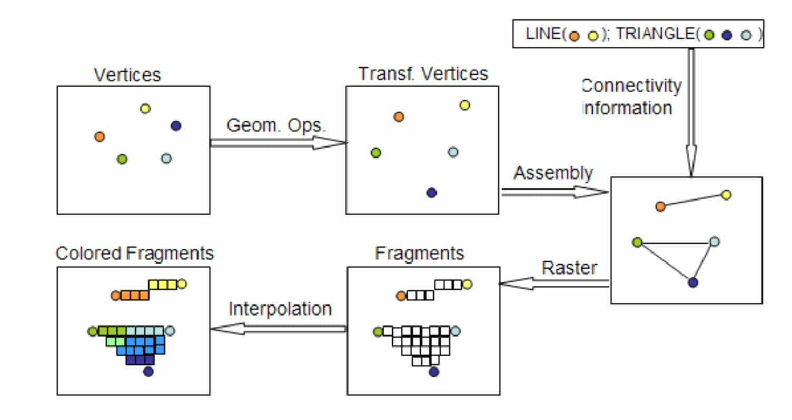
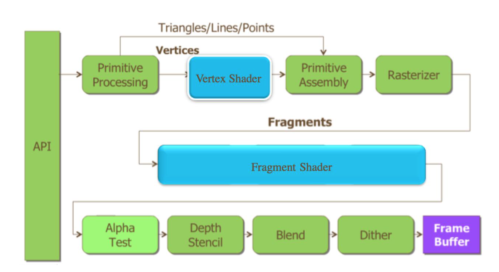

# OpenGL ES 2.0

## 简介

**谁定义了 OpenGL 这套标准?**

Khronos。不是一家公司,它是一个组织,它是由众多大公司联合组建而来,比如 Apple、 Intel、AMD、Google、ARM、Qualcomm、Nvidia 等等等等。各个大公司投入了大 量的人力、资金等创建了这个组织。对电脑 GPU 定义了统一的接口 OpenGL,对 手机 GPU 定义了统一的接口 OpenGL ES(我也非常有幸,在 Intel 工作期间,跟 Intel 驻 Khronos 的 3D 负责人共事了一段时间,每周一次的跨洋电话,都会让我受益匪浅)

这个组织除了定义了 OpenGL 接口之外,还定义了很多其他接口。目前针对 GPU 又提出了另外一套更底层的接口 Vulkan,这是一套比 OpenGL 更底层的接口, 使用其可以更容易优化,不过目前硬件厂商的驱动还有待开发,可能普及 Vulkan 还需要很多年。就好比 OpenGL ES 已经发展到了 3.1,而市面上的手机很多还是 只能支持 OpenGL ES 2.0 一样。所以新的科技从提出,到实现,到量产,到使用, 到普及,是一段很长的路。

所以,我们现在学习 OpenGL ES 2.0 是适时的,且是非常必要的(不懂 2.0, 想直接学习更难的 3.0、3.1、Vulkan,很难)。

事先预告一下,OpenGL ES 2.0 会分十三个课程,结束之后,我会立即奉上 OpenGL ES 3.0 在 OpenGL ES 2.0 基础上的改变。

**DirectX 是什么?**

我们发现 Khronos 组织的成员中没有提到大名鼎鼎的微软, 因为微软不在组织中, 而它提出了自己的 GPU 驱动标准————DirectX。

所以目前手机,不管是 iOS 还是 Android,都是支持 OpenGL ES。电脑,Windows 系统支持 DirectX 和 OpenGL,Linux/Mac(Unix)系统支持 OpenGL。

## OpenGL ES 涵盖内容

虽然标题是 OpenGL ES, 但是内容将不仅限于 OpenGL ES。

OpenGL ES 是负责 GPU 工作的, **目的是通过 GPU 计算, 得到一张图片**, 这张图片在内存中其实就是一块 buffer, 存储有每个点的颜色信息等。而这张图片最终是要显示到屏幕上, 所以还需要**具体的窗口系统**来操作, OpenGL ES 并没有相关的函数。所以,OpenGL ES 有一个好搭档 EGL。

EGL, 全称:embedded Graphic Interface, 是 OpenGL ES 和底层 Native 平台视窗系统之间的接口。

大概渲染流程是这样的:

1. 首先, **通过 EGL** 获取到手机屏幕的 handle, 获取到手机支持的配置(RGBA8888/RGB565之类, 表示每个像素中包含的颜色等信息的存储空间是多少位)
2. 然后**根据这个配置创建一块包含默认 buffer 的 surface**(buffer 的大小是根据屏幕分辨率乘以每个像素信息所占大小计算而得)和用于存放 OpenGL ES 状态集的 context,并将它们 enable 起来。
3. 然后, 通过 OpenGL ES **操作 GPU 进行计算**,将计算的结果保存在 surface 的 buffer 中。 
4. 最后, 使用 EGL, 将绘制的图片显示到手机屏幕上。

而在 OpenGL ES 操作 GPU 计算的时候, 还需要介绍 OpenGL ES 的另外一个好搭档 GLSL。

GLSL, 全称:OpenGL Shading Language, 是 OpenGL ES 中使用到的着色器的语言, 用这个语言可以编写小程序运行在 GPU 上。

在这里需要先提到 CPU 和 GPU 的区别,它们的功能都是用于计算,也都是由很多核组成,区别在于 CPU 的核比较少,但是单个核的计算能力比较强,而 GPU 的核很多,但是每个核的计算能力都不算特别强。目前 GPU 的主要工作是用于生成图片(现在也有通过 GPU 进行高性能运算_并行运算,但是在这里不属于讨论的范围),原因就是图片是由很多像素组成,每个像素都包含有颜色、深度等信息,而为了得到这些信息数据,针对每个像素点的计算,是可以通过统一的算法来完成。GPU 就擅长处理针对这种大规模数据,使用同一个算法进行计算。而这个算法,就是使用 GLSL 写成 Shader,供 GPU 运算使用。

**在图形学的视角中, 所有的图片都是由三角形构成的**。

所以通过 OpenGL ES 绘制图片的时候

1. 我们需要通过 OpenGL ES API 创建用于在 GPU 上运行的 shader
2. 然后将通过 CPU 获取到的图片顶点信息,传入 GPU 中的 Shader 中
3. 在 Vertex Shader 中通过矩阵变换,将顶点坐标从模型坐标系转换到世界坐标系,再到观察坐标系,到裁剪坐标系,最后投影到屏幕坐标系中,计算出在屏幕上各个顶点的坐标。
4. 然后,通过光栅化,以插值的方法得到所有像素点的信息,并在 Fragment shader 中计算出所有像素点的颜色。
5. 最后,通过 OpenGL ES 的 API 设定的状态,将得到的像素信息进行 depth/stencil test、blend,得到最终的图片。

## 屏幕图片的本质和产生过程

**分辨率**：

分辨率代表着像素的多少,比如我们熟知的 iphone6 的分辨率为 1334×750,而 iphone6 plus 的分辨率是1920×1080。

**像素点**：

手机屏幕上的图片,是由一个一个的像素组成,那么可以计算出来,一个屏幕上的图片,是由上百万个像素点组成。而每个像素点都有自己的颜色,每种颜色都是由 RGB 三原色组成。三原色按照不同的比例混合,组成了手机所能显示出来的颜色。

**像素颜色信息保存在哪里？**：

每个像素的颜色信息都保存在 buffer 中,这块 buffer 可以分给 RGB 每个通道各 8bit 进行信息保存,也可以分给 RGB 每个通道不同的空间进行信息保存, 比如由于人眼对绿色最敏感,那么可以分配给 G 通道 6 位,R 和 B 通道各 5 位。这些都是常见的手机配置。

> 举个🌰
>
> 假如使用 RGB888 的手机配置,也就是每种颜色的取值从 0 到 255(0 最小,255 最大)。那么红绿蓝都为 0 的时候,这个像素点的颜色就是黑色,红绿蓝都为 255 的时候,这个像素点的颜色就是白色。当红为 255, 绿蓝都为 0 的时候,这个像素点的颜色就是红色。当红绿为 255,蓝为 0 的时候, 这个像素点的颜色就是黄色。
>
> 当然不是只取 0 或者 255,可以取 0-255 中间的值, 100,200,任意在 0 和 255 中间的值都没有问题。那么我们可以算一下,按照红绿蓝不同比例进行搭配,每个像素点,可以显示的颜色有 255*255*255=16581375 种,这个数字是非常恐怖,所以我们的手机可以显示出来各种各样的颜色。 这里在延伸的科普一下,我们看到手机可以显示那么多种颜色了,但是是不是说我们的手机在颜色上就已经发展到极致了呢?其实是远远没有的,在这个手机配置下,三原色中每一种的取值可以从 0 到 255,而在现实生活中,它们的取 值可以从 0 到 1 亿,而我们人类的眼睛所能看到的范围是,从 0 到 10 万。所以手机硬件还存在很大的提升空间。
>
> 而在手机硬件提升之前,我们也可以通过 HDR 等技术尽量的在手机中多显示一些颜色。所以,讲到这里,我们知道了,手机屏幕上显示的图片,是由这上百万个像素点,以及这上百万个像素点对应的颜色组成的。

**程序员如何理解屏幕**

用程序员的角度来看,**手机屏幕对应着一块 buffer,这块 buffer 对应上百万个像素点,每个像素点需要一定的空间来存储其颜色**。

> 如果使用更加形象的例子来比喻,手机屏幕对应的 buffer 就好像一块巨大的棋盘,棋盘上有上百万个格子,每个格子都有自己的颜色,那么从远处整体的看这个棋盘,就是我们看手机的时候显示的样子。这就是手机屏幕上图片的本质。

通过我们对 EGL、GLSL、OpenGL ES 的理解,借助一张图片,从专业的角度来解释一下手机屏幕上的图片是如何生成的。

上面图片中对应着几个步骤：

1. **通过 EGL** 获取手机屏幕,进而获取到手机屏幕对应的这个棋盘, 同时, **在手机的 GPU 中根据手机的配置信息, 生成另外一个的棋盘和一个本子**, 本子是用于记录这个棋盘初始颜色等信息。

2. 接下来，OpenGL ES 就好像程序员的画笔,程序员需要知道自己想画什么东西,比如想画一个苹果,那么就需要通过为数不多的**基本几何图元**(如点、直线、三 角形)来创建所需要的模型。比如用几个三角形和点和线来近似的组成这个苹果 (图形学的根本就是点、线和三角形,所有的图形,都可以由这些基本图形组成, 比如正方形或者长方形,就可以由两个三角形组成,圆形可以由无数个三角形组成,只是三角形的数量越多,圆形看上去越圆润)。
3. 根据这些几何图元,建立数学描述,比如每个三角形或者线的顶点坐标位置、每个顶点的颜色。得到这些信息之后,可以先**通过 OpenGL ES 将 EGL 生成的棋盘 (buffer)进行颜色初始化**,一般会被初始化为黑色。
4. 将刚才我们**获取到的顶点坐标位置,通过矩阵变化的方式,进行模型变换、观察变换、投影变换,最后映射到屏幕上**,得到**屏幕上的坐标**。这个步骤可以在 CPU 中完成,也就是在 OpenGL ES 把坐标信息传给 Shader 之前,在 CPU 中通过矩阵相乘等方式进行更新,或者是直接把坐标信息通过 OpenGL ES 传给 Shader,同时也把矩阵信息传给 Shader,通过 Shader 在 GPU 端进行坐标更新,更新的算法通过 GLSL 写在 Shader 中。

> 第一个 shader：
>
> 这个**进行<u>坐标更新</u>的 Shader 被称为 vertex shader**,简称 VS,是 OpenGL ES2.0, 也是 GLSL130 版本对应的最重要两个 shader 之一。
>
> 作用是完成顶点操作阶段中的所有操作。
>
> 经过矩阵变换后的像素坐标信息,为屏幕坐标系中的坐标信息。
>
> 
>
> 输入：
>
> 在 VS 中,最重要的输入为顶点坐标、矩阵(还可以传入顶点的颜色、法线、纹理 坐标等信息),
>
> 输出：
>
> 最重要的运算结果, 就是这个将要显示在屏幕上的坐标信息。
>
> 
>
> 上图例子：
>
> VS 会针对传入的所有顶点进行运算,比如在 OpenGL ES 中只想绘制一个三角形和一条线,这两个图元不共享顶点,那么在 VS 中,也就传入了 5 个顶点信息, 根据矩阵变换,这 5 个顶点的坐标转换成了屏幕上的顶点坐标信息,从图上显示, 也就是从左上角的图一,更新成了中上图的图二。

5. 当图二生成之后, 我们知道了图元在屏幕上的顶点位置, 而顶点的颜色在 VS 中没有发生变化, 所以图元的顶点颜色我们也是知道的。下面就是根据 OpenGL ES 中设置的状态, **表明哪些点连成线, 哪些点组成三角形, 进行图元装配**, 也就是我们在右上角的图三中看到的样子。

> 光栅化与第二个 shader(PS)：
>
> **图三这个样子在 GPU 中不会显示, 那几条线也是虚拟的线**, 是不会显示在棋盘 buffer 中的, **而 GPU 做的是光珊化**。
>
> 
>
> 光栅化时机：
>
> 光栅化是发生在**从 VS 出来,进入另外一个Shader (Pixel shader,也称 fragment shader)之前**, 在 GPU 中进行的。作用是把线上,或者三角形内部所有的像素点找到, 并根据插值或者其他方式计算出其颜色等信息(如果不通过插值,可以使用其他的方法,这些在 OpenGL ES 和 GLSL 中都可以进行设置)。也就生成了下面一行的图四和图五。

6. 可以看到在图 4 和图 5 种出现了大量的顶点, 大概数一下估计有 40 个点左右, **这些点全部都会进入 PS 进行操作**。

> PS 🌰：
>
> 在 PS 中可以对图四这些点的颜色进行操作, 比如可以只显示这些点的红色通道, 其他的绿蓝通道的值设置为 0, 比如之前某个点的 RGB 为 200,100,100。在 PS 中可以将其通过计算,更新为 200,0,0。这样做的结果就是所显示的图片均为红色, 只是深浅不同。这也就好像戴上了一层红色的滤镜,其他颜色均为滤掉了。
>
> 所以用 PS 来做滤镜是非常方便的。再比如, 假如一盏红色的灯照到了苹果上, 那么显示出来的颜色就是在苹果原本的颜色基础上, 红色值进行一定的增值。

总结一下,经过 VS 和 PS 之后,程序员想要画的东西,就已经被画出来了。想要绘制的东西, 也就是左下角图五的样子。然后再根据 OpenGL ES 的设置,对新绘制出来的东西进行 Depth/Stencil Test, 剔除掉被遮挡的部分, 将剩余部分与原图片进行 Blend, 生成新的图片。 

最后,通过 EGL, **把这个生成的棋盘 buffer 和手机屏幕上对应的棋盘 buffer 进行调换,** 让手机屏幕显示这个新生成的棋盘, **旧的那个棋盘再去绘制新的图片信息**。周而复始,不停的把棋盘进行切换, 也就像过去看连环画一样, 动画就是由一幅幅的图片组成, 当每秒切换的图片数量超过 30 张的时候,我们的手机也就看到了动态的效果。这就是屏幕上图片的产生过程。

> one more thing:
>
> 在这里再进行一下延伸, 这个例子中, **VS 计算了 5 个顶点的数据, PS 计算 了大概 40 个顶点的数据**,而我们刚才说过,手机中存在上百万个像素点, 这上百万个像素点都可以是顶点, 那么这个计算量是非常大的。而这也是为什么要将 shader 运算放在 GPU 中的原因,因为 GPU 擅长进行这种运算。
>
> 我们知道 CPU 现在一般都是双核或者 4 核,多的也就是 8 核或者 16 核,但是 GPU 动辄就是 72 核,多的还有上千核,这么多核的目的就是进行并行运算, 虽然单个的 GPU 核不如 CPU 核,但是单个的 GPU 核足够进行加减乘除运算,所以大量的 GPU 核用在图形学像素点运算上,是非常有效的。而 CPU 虽然单个很强大,而且也可以通过多级流水来提高吞吐率,但是终究还是不如 GPU 的多核来得快。但是在通过 GPU 进行多核运算的时候,需要注意的是: **如果 shader 中存放判断语句,就会对 GPU 造成比较大的负荷**, 不同 GPU 的实现方式不同, 多数 GPU 会对判断语句的两种情况都进行运算,然后根据判断结果取其中一个。
>
> 我们通过这个例子再次清楚了 OpenGL ES 绘制的整个流程,而这个例子也是最简单的一个例子,其中有很多 OpenGL ES 的其他操作没有被涉及到。比如,我们绘制物体的颜色大多是从纹理中采样出来,那么设计到通过 OpenGL ES 对纹理 进行操作。而 OpenGL ES 的这些功能,我们会在下面一点一点进行学习。

## OpenGL ES pipeline

EGL 是用于与手机设备打交道, 比如获取绘制 buffer, 将绘制 buffer 展现到手机屏幕中。那么抛开 EGL 不说, OpenGL ES 与 GLSL 的主要功能,就是往这块 buffer 上绘制图片。

所以,我们可以**把OpenGL ES和GLSL的流程**单独拿出来进行归纳总结,而这幅流程图就是著名的 OpenGL ES2.0 pipeline：

1. 首先,最左边的 API 指的就是 OpenGL ES 的 API, OpenGL ES 其实是一个图形学库,由 109 个 API 组成, 只要明白了这 109 个 API 的意义和用途,就掌握了OpenGL ES 2.0。

2. 然后,我们通过 API 先**设定了顶点的信息**,顶点的坐标、索引、颜色等信息,将这些信息传入 VS。

3. 在 VS 中进行运算, 得到最终的顶点坐标。再把**算出来的顶点坐标进行图元装配**,构建成虚拟的线和三角形。
4. 然后进行光珊化(在光珊化的时候,把顶点连接起来形成直线,或者填充多边形的时候,需要考虑直线和多边形的直线宽度、点的大小、渐变算法以及是否使用支持抗锯齿处理的覆盖算法。最终的每个像素点,都具有各自的颜色和深度值)。
5. 将光珊化的结果传入 PS,进行最终的颜色计算。
6. 然后,这所谓最终的结果在被实际存储到绘制 buffer 之前, 还需要进行一系列的操作。这些操作可能会修改甚至丢弃这些像素点。这些操作主要为 alpha test、Depth/Stencil test、Blend、Dither。
   1. Alpha Test 采用一种很霸道极端的机制,只要一个像素的 alpha 不满足条件, 那么它就会被 fragment shader 舍弃,被舍弃的 fragments 不会对后面的各种 Tests 产生影响;否则,就会按正常方式继续下面的检验。Alpha Test 产生的效果也很极端,要么完全透明,即看不到,要么完全不透明。
   2. Depth/stencil test 比较容易理解。由于我们绘制的是 3D 图形,那么坐标为 XYZ,而 Z 一般就是深度值,OpenGL ES 可以对深度测试进行设定, 比如设定深度值大的被抛弃, 那么假如绘制 buffer 上某个像素点的深度值为 0, 而 PS 输出的 像素点的深度值为 1, 那么 PS 输出的像素点就被抛弃了。
   3. stencil 测试更加简单,其又被称为蒙版测试,比如可以通过 OpenGL ES 设定不同 stencil 值的配抛弃, 那么假如绘制 buffer 上某个像素点的 stencil 值为 0,而 PS 输出的像素点的 stencil 值为 1,那么 PS 输出的像素点就被抛弃了。
   4. 还有 blend,通过 OpenGL ES 可以设置 blend 混合模式。由于绘制 buffer 中原本每个像素点已经有颜色了, 那么 PS 输出的颜色与绘制 buffer 中的**颜色如何混合**, 生成新的颜色存储在绘制 buffer 中, 就是通过 blend 来进行设定。
   5. 最后的 dither, dither 是一种图像处理技术, 是故意造成的噪音, 用以随机化量化误差, 阻止大幅度拉升图像时, 导致的像 banding(色带)这样的问题。也是通过OpenGL ES 可以开启或者关闭。(Patrick：Dither还需要再开一个课题好好说)

> 既然说到了 Depth/stencil,那么就在这里说一下绘制 buffer 到底有多大,存 储了多少信息。
>
> 按照我们刚才的说法,手机可以支持一百万个像素, 那么生成的绘制 buffer 就需要存储这一百万个像素所包含的信息, 而每个像素包含的信息, 与手机配置有关, 假如手机支持 Depth/stencil。
>
> 那么通过 EGL 获取的绘制 buffer 中, 每个像素点就包含了
>
> 1. RGBA 的颜色值, RGBA 每个分量一般占据 8 位, 也就是 8bit, 也就是 1byte. 这儿总共 4byte。
> 2. depth 值, depth 大多数占 24 位, 总共 3byte
> 3. stencil 值, stencil 占 8 位, 总共 1byte。
>
> 所以每个像素占 64bit,也就是 8byte。
>
> 那么 iphone6 plus 的绘制 buffer 的尺寸为 1920×1080×8=16588800byte=16200KB=15.8MB。

经过了这一系列的运算和测试,也就得到了最终的像素点信息,将其存储到绘制 buffer 上之后,OpenGL ES 的 pipeline 也就结束了。

整个pipeline中，纵向按照流水线作业，横线按照独立作业，多级并行、提高渲染性能。

## OpenGL ES API 总览

刚才已经说了, OpenGL ES 就是一个图形学库, 由 109 个 API 组成。之后的教程我们会对这 109 个 API 进行详细解释, 在这里我们先介绍一下这 109 个 API 大概是做什么的。

1. 首先,有 9 个 API, 用于从手机创建绘制 buffer。

> 虽然 **EGL 会提供给 OpenGL ES 一块绘制 buffer**, 这块绘制 buffer 之后还会显示在屏幕上, 但是 OpenGL ES 也可以根据自定义的配置生成一块或者多块 buffer, 并且可以先把一些内容绘制到这些备用 buffer 上, 之后根据一定的处理, 最后再将正式的内容绘制到真正的绘制 buffer 上,然后显示到屏幕上。
>
> 或者也可以直接把备用 buffer 中的内容显示到屏幕上。一般复杂一些的图形程序,都会使用到这些 API。

2. 然后,有 12 个 API, 用于沟通 GPU 可编程模块 Shader。

> 根据我们上面所说的内容, 讲到了 shader 的概念。
>
> Shader 是由 OpenGL ES 创建的,在 OpenGL ES 看来 shader 就类似于一个 handle;然后通过 OpenGL ES 给 shader 中写入内容; 触发 GPU 对 Shader 进行编译;编译成功之后,通过 OpenGL ES 将一个 VS 和一个 PS 连接在一起,绑定在一个叫做 program 的另外一个 handle 上面;通过 OpenGL ES 启用这个 program, 也就相当于启用 program 绑定的两个编译好的 shader,供 GPU 调用。

3. 有 27 个 API,用于传入绘制信息,比如通过 API 从 CPU 把顶点信息、矩阵、纹理图片等传入 GPU 中。传入的方式有很多种,我们之后再一一讲解。

4. 有 30 个 API, 用于设置绘制状态, OpenGL ES 又被人称为状态集, 因为它就是不停的在设置各种状态供 GPU 等调用,比如设置是否进行颜色混合以及如何混合,比如设置是否需要 depth、stencil 等 test,以及如何 test 等。

5. 有 2 个 API, 用于执行绘制命令, 也就是执行这个 API 的时候,将之 前传入 GPU 的信息关联在一起。在这个 API 中,可以设置使用哪些顶点进行绘制,以及如何将这些顶点进行图元装配等。

6. 还有 25 个 API, 用于查询环境、清理状态, 由于 OpenGL ES 是状态集, 所以基本上所有的状态信息都可以查询出来, 即使我们并没有进行设置, 这些状态也会有默认值, 获取这些状态信息, 可以更有利的帮助我们做出判断。

7. 最后还有 4 个 API,用于其他用处,等我们说到的时候再进行一一介绍。

