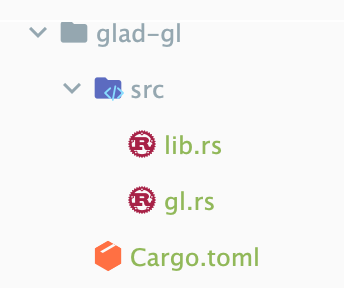

# 从例子开始

接下来会从几个例子来接触 OpenGL。首先需要配一下环境，由于我们使用的书是现代 OpenGL 教程，因此我们也随他一起用 GLFW：

> GLFW是一个用C语言编写的库，专门针对OpenGL。GLFW为我们提供了渲染窗口所需的基本要素。它允许我们创建OpenGL上下文，定义窗口参数，并处理用户输入，这对我们的目的已经足够了。

```yaml
[dependencies]
glfw = "0.54.0"
anyhow = "1.0.76"
some-error = "0.5.0"
log = "0.4.20"
env_logger = "0.10.1"
```

GLFW 比较好用，但是 GLAD 比较麻烦，我们首先需要去[官方页面](https://github.com/Dav1dde/glad/blob/glad2/example/rust/gl-glfw/README.md)中按照步骤进行编译，得到产物：



然后引入项目：

```yaml
[dependencies]
glad-gl = { path = "./glad-gl" }
```

# 创建一个 Window

创建图形应用程序的第一步是创建一个窗口。Let's do it!

```Rust
fn main() -> anyhow::Result<()> {
    let mut glfw = glfw::init(glfw_error_callback).unwrap();
    // 配置 glfw 的版本为 3.3
    glfw.window_hint(WindowHint::ContextVersionMajor(3));
    glfw.window_hint(WindowHint::ContextVersionMinor(3));
    // 配置为 Core 模式，这也是我们学习的主要目标
    glfw.window_hint(WindowHint::OpenGlProfile(OpenGlProfileHint::Core));
    // mac 下需要配
    glfw.window_hint(WindowHint::OpenGlForwardCompat(true));

    Ok(Self { glfw })
}
```

> 需要注意，在Mac OSX上，GLFW 需要在初始化代码中添加glfwWindowHint(GLFW_OPENGL_FORWARD_COMPAT, GL_TRUE)，才能正常工作。

`glfwInit`是创建了一个 GLFW 对象。

`glfwWindowHint`的第一个参数告诉我们想要配置的选项，我们可以从以GLFW_为前缀的可能选项的大型枚举中选择选项。第二个参数是一个整数，用于设置我们选项的值。可以在GLFW的窗口处理文档中找到所有可能选项及其相应的值的列表。然后准备创建一个窗口，该窗口对象保存所有窗口数据，并且是 GLFW 的大多数其他函数所需要使用的。

我们将这些配置抽象为一个对象：

```
/// glfw 本质上是一个不安全的 *const() 指针，在应用侧使用 struct 给保护起来
pub struct GlfwLocal {
    window: PWindow,
    receiver: GlfwReceiver<(f64, WindowEvent)>
}

impl GlfwLocal {

    /// 创建一个本地 glfw 对象, 并创建一个 window
    pub fn new() -> anyhow::Result<GlfwLocal> {
        let mut glfw = glfw::init(glfw_error_callback).unwrap();
        // 配置 glfw 的版本为 3.3
        glfw.window_hint(WindowHint::ContextVersionMajor(3));
        glfw.window_hint(WindowHint::ContextVersionMinor(3));
        // 配置为 Core 模式，这也是我们学习的主要目标
        glfw.window_hint(WindowHint::OpenGlProfile(OpenGlProfileHint::Core));
        // mac 下需要配
        glfw.window_hint(WindowHint::OpenGlForwardCompat(true));

        let (window, receiver) = glfw.create_window(1920, 1080, "hello window", glfw::WindowMode::Windowed).expect("Failed to create GLFW window.");

        Ok(Self {
            window,
            receiver
        })
    }

}
```

OpenGL 使用通过`glViewport`指定的数据来将其处理的2D坐标转换为屏幕上的坐标。例如，位置点(-0.5,0.5)经过处理后会被映射到屏幕坐标(200,450)作为最终的转换结果。请注意，OpenGL中处理的坐标位于-1和1之间，因此我们有效地将范围从(-1至1)映射到(0, 800)和(0, 600)。不过在 rust 包的这一层，我们不需要手动的调该函数了。

## 如果用户调整窗口大小

然而，当用户调整窗口大小时，视口也应该调整。我们可以在窗口上注册一个回调函数，每次调整窗口大小时都会调用该函数。这个调整大小回调函数具有以下原型：

```rust
void framebuffer_size_callback(GLFWwindow* window, int width, int height); 

impl Window
pub fn set_framebuffer_size_callback<T>(& mut self, callback: T) 
where     T: FnMut(&mut Window, i32, i32) + 'static,
```

帧缓冲区大小函数以 GLFW 窗口作为第一个参数，并采用两个整数表示新窗口尺寸。每当窗口的大小发生变化时，GLFW 都会调用此函数，并填充适当的参数以便处理。我们使用的话，就这样就行了：

```rust
let mut glfw_local = GlfwLocal::new()?;
// 将帧大小改变的回调注册进去
glfw_local.window.set_framebuffer_size_callback(|window, width, height| {
    log::info!("frame buffer size changed! width={width}, height={height}")
});
```

当窗口首次显示时，framebuffer_size_callback 函数也会被调用，获取窗口的最终尺寸。对于 Retina 显示屏，宽度和高度最终会比原始输入值高得多。我们可以设置许多回调函数来注册我们自己的函数。例如，我们可以创建一个回调函数来处理游戏手柄输入的变化，处理错误消息等。

**我们应该在创建窗口之后、渲染循环开始之前注册这些回调函数**。

## 启动渲染循环

我们不希望应用程序绘制一幅图像然后立即退出并关闭窗口。我们希望应用程序继续绘制图像并处理用户输入，直到显式地告诉程序停止为止。

因此，我们必须创建一个 while 循环，我们现在称之为**渲染循环**，该循环持续运行直到我们告诉 GLFW 停止。以下代码展示了一个非常简单的渲染循环：

```rust
let mut glfw_local = GlfwLocal::new()?;
glfw_local.window.set_framebuffer_size_callback(|window, width, height| {
    log::info!("frame buffer size changed! width={width}, height={height}")
});

while !glfw_local.window.should_close() {
    // 持续交换 front 与 back buffer
    glfw_local.window.swap_buffers();
    // Poll for and process events 
    glfw_local.window.glfw.poll_events();
}
```

`glfwWindowShouldClose`函数用于检查GLFW是否已被设置为关闭状态，这个设置是由我们控制的。

`glfwPollEvents`函数检查是否触发了任何事件（比如键盘输入或鼠标移动事件），我们可以在这些事件执行时回调对应的 listener 来更新窗口状态。

`glfwSwapBuffers`将交换颜色缓冲区（一个包含每个像素颜色值的大型2D缓冲区，用于在此渲染迭代期间进行渲染，并将其作为输出显示在屏幕上）。

> 这里需要提到的一个概念是双缓冲区设计，这也是 android 中的设计：
>
> 当应用程序在单个缓冲区中绘制时，**生成的图像可能会显示闪烁问题**。这是因为生成的输出图像不是立即绘制出来的，而是逐像素绘制，通常是从左到右，从上到下。因为这个图像在渲染的时候是不会立即显示给用户的，**结果可能会包含伪影**。为了规避这些问题，窗口应用程序会应用双缓冲区进行渲染。
>
> * 前缓冲区包含了显示在屏幕上的最终输出图像。
> * 渲染命令则是绘制到后缓冲区。
>
> 一旦所有渲染命令完成，我们就将后缓冲区与前缓冲区交换，这样图像就可以在不再渲染的情况下显示，消除了所有上述的伪影。

## 回收资源

一旦我们退出渲染循环，我们希望正确地清理/删除所有分配的 GLFW 资源。我们可以通过在主函数末尾调用的 glfwTerminate 函数来完成此操作：

```rust
glfwTerminate();
return 0;
```

但是在 Rust 中，Glfw-rs 已经在 drop 中帮我们完成了这件事：

```rust
impl Drop for Window {
    /// Closes the window and performs the necessary cleanups. This will block
    /// until all associated `RenderContext`s were also dropped, and emit a
    /// `debug!` message to that effect.
    ///
    /// Wrapper for `glfwDestroyWindow`.
    fn drop(&mut self) {
        drop(self.drop_sender.take());

        // Check if all senders from the child `RenderContext`s have hung up.
        #[cfg(feature = "log")]
        if self.drop_receiver.try_recv() != Err(std::sync::mpsc::TryRecvError::Disconnected) {
            debug!("Attempted to drop a Window before the `RenderContext` was dropped.");
            debug!("Blocking until the `RenderContext` was dropped.");
            let _ = self.drop_receiver.recv();
        }

        if !self.ptr.is_null() {
            unsafe {
                let _: Box<WindowCallbacks> =
                    mem::transmute(ffi::glfwGetWindowUserPointer(self.ptr));
            }
        }

        if !self.is_shared {
            unsafe {
                ffi::glfwDestroyWindow(self.ptr);
            }
        }
    }
}
```

## 接收输入及渲染

我们需要在渲染循环中不断的接受输入(键盘或者鼠标)，在 OpenGL 中我们可以通过`glfwGetKey`函数来处理键盘的输入，例如下面的方法：

```rust
fn process_input(window: &mut Window) {
    if window.get_key(Key::F10) == Action::Press {
        // F10 关闭窗口
        window.set_should_close(true);
    }
}

// C 是这样
void processInput(GLFWwindow *window)
{
    if(glfwGetKey(window, GLFW_KEY_F10) == GLFW_PRESS)
        glfwSetWindowShouldClose(window, true);
}
```

只需要在渲染循环中调就行:

```rust
    while !glfw_local.window.should_close() {
        process_input(&mut glfw_local.window);

        // 这里写渲染命令即可
        

        // 持续交换 front 与 back buffer
        glfw_local.window.swap_buffers();
        // Poll for and process events
        glfw_local.window.glfw.poll_events();
    }
```


# 安卓刷新原理

> 既然提到了双 buffer，就可以顺便提一下安卓的刷新原理了。

# 名词解释

### tearing（**撕裂**）

**一个屏幕内的数据来自2个不同的帧**，画面会出现撕裂感

> 出现时机：
>
> 系统帧速率比屏幕刷新率快。此时，屏幕未完全把前缓冲区的一帧映射到屏幕，而系统已经在后缓冲区准备好了下一帧，并要求读取下一帧到屏幕，将会导致屏幕上半部分是上一帧的图形，而下半部分是下一帧的图形，**造成屏幕上显示多帧，也就是屏幕撕裂。**

-20231222111342784.(null))

### jank (卡顿)

**一个帧在屏幕上连续出现2次**

> 出现时机：
>
> 屏幕刷新速率比系统帧速率快。此时，在前缓冲区内容全部映射到屏幕上之后，后缓冲区尚未准备好下一帧，屏幕将无法读取下一帧，所以只能继续显示当前一帧的图形，**造成一帧显示多次，也就是卡顿。** 

)

### lag（滞后）

从用户体验来说，就是点击下去到呈现效果之间存在延迟

## VSync & GUI

通常情况下，在显示系统中，一般包括CPU、GPU、Display三个部分， CPU负责计算数据，把计算好数据交给GPU, GPU会对图形数据进行渲染（计算、光栅化、着色），渲染好后放到BufferQueue里存起来，然Display（屏幕）负责把BufferQueue里的数据呈现到屏幕上。

**Opengl** **数据处理示意图**

-20231222111342784-3214822.(null))

# Android 图形系统

要完全理解 SurfaceView 需要先理解 Android 图形系统的一些基础知识。

## 刷新原理

首先需要对最重要的是 VSync（垂直同步）机制的上下文进行一个学习和理解。屏幕刷新的过程分为三步：

1. CPU 处理指令信息。
2. CPU 将处理完毕的数据转发到 GPU 进行渲染（也即光栅化等一系列步骤）。
3. GPU 将渲染完毕的数据发送给屏幕进行展示。

尤其需要注意的是，CPU 跟 Display 是不同的硬件，它们是可以并行工作的，就像鼠标键盘等外设一样，它们本质上通过中断进行同步。进一步的，我们写的代码，只是控制**让 CPU 在接收到屏幕刷新信号的时候开始去计算下一帧的画面工作**。而底层在每一次屏幕刷新信号来的时候都会去切换这一帧的画面，这点我们是控制不了的，是底层的工作机制。之所以要讲这点，是因为，当我们的 app 界面没有再刷新时（比如用户不操作了，当前界面也没动画），这个时候，我们 app 是接收不到屏幕刷新信号的，所以也就不会让 CPU 去计算下一帧画面数据，但是底层仍然会以固定的频率来切换每一帧的画面，只是它后面切换的每一帧画面都一样，所以给我们的感觉就是屏幕没刷新。例如下图：

-20231222111342724.(null))

在第三帧时，Display 发送 VSync 信号让 CPU 进行屏幕数据处理，然后在第四帧进行显示，随后由于界面不需要刷新（用户没有进行操作），那么屏幕就停止在了第四帧的画面上。**但是**，底层还是会每隔 16.6ms 发出一个屏幕刷新信号中断，只是我们 app 不会接收到而已，Display 还是会在每一个屏幕刷新信号到的时候去显示下一帧画面，只是下一帧画面一直是第4帧的内容而已。

由于 CPU、GPU 与 Display 间存在速度上的问题，那么必然存在缓存的策略。一般来说，CPU 和 GPU 的数据处理速率大于 Display 的显示速率。因此，在硬件上存在两种缓冲区：

1. 单缓冲：Display 从缓冲区中读取帧数据，同时 GPU 也在写入帧数据。
2. 双缓冲：Display 从前缓冲区中读取帧数据，同时 GPU 也在往后缓冲区中写入帧数据，后缓冲区将数据传输到前缓冲区。双缓冲的提出是为了缓解单缓冲容易造成撕裂的问题，因为在硬件层面的缓冲区是比较难和 GPU 以及 Display 做同步的。

## VSync 背景以及解决的问题

可以想象到，在这个过程中需要一个比较完美的同步，如果同步不及时，也即：

1. 上一帧显示完毕，下一帧还没有计算完毕，无法进行屏幕刷新，这会出现卡顿。
2. 上一帧尚未显示完毕，下一帧已经准备好，屏幕在没有完全同步的情况下开始刷新显示，出现撕裂（屏幕不是全部显示的，而是从左到右从上到下的扫出来的）。

针对这些问题（本质上是同步问题），提出了 VSync 机制。

### 没有 VSync 的情况

-20231222111342809.(null))

1. CPU 和 GPU 代表上层的绘制执行者
2. Composite 代表的是 SurfaceFlinger 对多个 Surface 的合成
3. Background Buffer 和 Front Buffer 分别代表的是硬件帧缓冲区中的前缓冲和后缓冲
4. 显示屏扫描完一帧之后，会发出VSync信号来切换并显示下一帧

上面的流程中，存在一个问题，屏幕的VSync信号只是用来控制帧缓冲区的切换，并未控制上层的绘制节奏，也就是说上层的生产节奏和屏幕的显示节奏是脱离的：

-20231222111342787.(null))

上图中，横轴表示时间，**纵轴表示 Buffer 的使用者，每个长方形表示 Buffer 的使用**，长方形的宽度代表使用时长，VSync 代表垂直同步信号，两个 VSync 信号之间间隔 16.6ms。此图描述了Android在4.1系统版本之前，上层的绘图流程在没有 VSync 信号的时候，出现的绘制问题。

我们从时间为0开始看，当前屏幕显示第0帧，上层CPU开始计算第1帧的纹理，计算完成后，交由 GPU 进行栅格化。当下一个垂直同步信号到来，屏幕显示下一帧，这时候，上层 CPU 并未马上开始准备下一帧，而当CPU开始准备下一帧的时候已经太晚了，下一个 VSync 信号来临的时候，GPU 未能绘制完第二帧的处理，导致屏幕再次显示上一帧，造成卡顿。

### 存在 VSync 的情况

上面的问题在于，由于上层不知道 VSync 信号已经发出，导致上层未能开始 CPU 的计算。google 在 Android 4.1 系统中加入了**上层接收垂直同步信号的逻辑**，大致流程如下：

-20231222111342959.(null))

也就是说，屏幕在显示完一帧后，发出的垂直同步除了**通知帧缓冲区的切换**之外，该消息还会发送到上层，通知上层开始绘制下一帧。此时上层绘制图形的流程与VSync信号的关系可以用下图表示：

-20231222111342939.(null))

可以看到，此时的 CPU 计算进程开始点被严格限制在 VSync 信号开始时。时间从屏幕显示第0帧开始，CPU开始准备第1帧图形的处理，好了之后交给GPU进行处理，在上层收到下一个VSync之后，CPU立马开始第2帧的处理，上层绘图的节奏就和VSync信号保持一致了，整个绘图非常流畅。

### 跨越 VSync 时间间隔的渲染计算问题

然而，理想很丰满，现实很骨感，如果 CPU 和 GPU 没能在下一个 VSync 信号到来之前完成下一帧的绘制工作，又会是怎么样的呢？

-20231222111343026.(null))

还是从屏幕显示第A帧开始，时间进入第一个16.6ms，CPU 和 GPU 合成第B帧，当下一个 VSync 信号到来的时候，**GPU 未能及时完成第B帧的绘制，此时，GPU 占有一个 Surface 里的 Buffer，而同时 SurfaceFlinger 又持有一个Buffer 用于合成显示下一帧到屏幕**，这样的话，就导致 Surface 里的两个缓冲区都被占用了。此时 SurfaceFlinger 只能使用第A帧已经准备好的 Buffer 来合成，GPU 继续在另一个缓冲区中合成第B帧，此时 CPU 无法开始下一帧的合成，因为缓冲区用完了。另外一个不好的事情是 CPU 只有在 VSync 信号来的时候才开始绘制下一帧，也是就是说在第二个16.6ms时间内，CPU 一直处于空闲状态，未进行下一帧的计算。

只有等到第二个 VSync 信号来了之后，CPU 才开始在绘制下一帧。如果 CPU 和 GPU 需要合成的图形太多，将会导致连续性的卡顿，如果 CPU 和 GPU 大部分时候都无法在16.6ms完成一帧的绘制，将会导致连续的卡顿现象。

为了解决双缓冲带来的卡顿问题，Android加入第三个Buffer，CPU和GPU还有SurfaceFlinger各占一个Buffer，并行处理图形：

-20231222111343014.(null))

从上图可以看出，在第一个 VSync 到来时，尽管 SurfaceFlinger 占了一个 Buffer，GPU 又占了一个 Buffer，CPU 仍然可以在第三个 Buffer 中开始下一帧的计算，整个显示过程就开始时卡顿了一帧，之后都是流畅的。

当然系统并非一直开启三个 Buffer，因为 Buffer 是需要消耗资源的，并且，我们会发现，上图中，GPU 处理好的图形，需要跨越两个 VSync 信号，才能显示。这样的话，给用户的影响是一个延迟的现象。

Android 通过 Buffer 来保存图形信息，为了让图形显示的更加流程，在提供一一个 Buffer 用于显示的同时，**开辟一个或者多个 Buffer 用于后台图形的合成**。

- Android4.1之前，VSync信号并未传递给上层，导致生产与消费节奏不统一
- Android4.1之后，上层开始绘制时机都放到了VSync信号的到来时候
- 除了在上层引入VSync机制，Anroid在4.1还加入了三缓冲，用来减少卡顿的产生

## Android 刷新原理

上面对屏幕刷新过程以及 VSync 机制进行了一个简单的介绍，接下来可以针对于 Android 本身的流程进行一个概括：

-20231222111343001.(null))

大体上，应用开发者可以通过两种方式将图像绘制到屏幕上：

- Canvas 
- OpenGL ES 

`Canvas`是一个2D图形API，是Android View树实际的渲染者。`Canvas`又可分为`Skia`软件绘制和`hwui`硬件加速绘制。Android4.0之前默认是`Skia`绘制，该方式完全通过CPU完成绘图指令，并且全部在主线程操作，在复杂场景下单帧容易超过16ms导致卡顿。从Android4.0开始，默认开启硬件加速渲染，而且5.0开始把渲染操作拆分到了两个线程：主线程和渲染线程，主线程负责记录渲染指令，渲染线程负责通过`OpenGL ES`完成渲染，两个线程可以并发执行。除了`Canvas`，开发者还可以在**异步**线程直接通过`OpenGL ES`进行渲染，一般适用于游戏、视频播放等独立场景。

从应用侧来看，不管是`Canvas`，还是`OpenGL ES`，最终渲染到的目标都是Surface，`Flutter`在Android平台上也是直接渲染到Surface。Surface是一个窗口，例如：一个Activity是一个Surface、一个Dialog也是一个Surface，承载了上层的图形数据，与SurfaceFlinger侧的Layer相对应。Native层Surface实现了`ANativeWindow`结构体，在构造函数中持有一个`IGraphicBufferProducer`，用于和`BufferQueue`进行交互。`BufferQueue`是连接Surface和Layer的纽带，当上层图形数据渲染到Surface时，实际是渲染到了`BufferQueue`中的一个`GraphicBuffer`，然后通过`IGraphicBufferProducer`把`GraphicBuffer`提交到`BufferQueue`，让 SurfaceFlinger 进行后续的合成显示工作。

### BufferQueue

Android图形系统包含了两对生产者和消费者模型，它们都通过BufferQueue进行连接：

1. `Canvas`和`OpenGL ES`生产图形数据，`SurfaceFlinger`消费图形数据。 
2. `SurfaceFlinger`合成所有图层的图形数据，Display显示合成结果。 

Surface属于APP进程，Layer属于系统进程，如果它们之间只用一个Buffer，那么必然存在显示和性能问题，所以图形系统引入了`BufferQueue`，一个Buffer用于绘制，一个Buffer用于显示，双方处理完之后，交换一下Buffer，这样效率就高很多了。`BufferQueue`的通信流程如下所示：

-20231222111342983.(null))

- 生产者从BufferQueue出队一个空闲GraphicBuffer，交给上层填充图形数据； 
- 数据填充后，生产者把装载图形数据的GraphicBuffer入队到BufferQueue，也可以丢弃这块Buffer，直接cancelBuffer送回到BufferQueue； 
- 消费者通过`acquireBuffer`获取一个有效缓存； 
- 完成内容消费后（比如上屏），消费者调用`releaseBuffer`把Buffer交还给BufferQueue。 
- `GraphicBuffer`代表的图形缓冲区是由`Gralloc`模块分配的，并且可以跨进程传输（实际传输的只是一个指针）。 
- 通常而言，APP端使用的是BufferQueue的`IGraphicBufferProducer`接口（在Surface类里面），用于生产；SurfaceFlinger端使用的是BufferQueue的`IGraphicBufferConsumer`接口（在GLConsumer类里面），用于消费。

### SurfaceFlinger

SurfaceFlinger负责合成所有的Layer并送显到Display，这些Layer主要有两种合成方式：

- `OpenGL ES`：把这些图层合成到FrameBuffer，然后把FrameBuffer提交给`hwcomposer`完成剩余合成和显示工作。 
- `hwcomposer`：通过`HWC`模块合成部分图层和FrameBuffer，并显示到Display。

`Surface`表示APP进程的一个窗口，承载了窗口的图形数据，`SurfaceFlinger`是系统进程合成所有窗口（Layer）的系统服务，负责合成所有Surface提供的图形数据，然后送显到屏幕。`SurfaceFlinger`既是上层应用的消费者，又是Display的生产者，起到了承上启下的作用。官方提供了一个架构图，如下所示：

-20231222111343181.(null))

### Surface 合成深入

-20231222111343190.(null))

-20231222111343207.(null))-20231222111343234.(null))

-20231222111343266.(null))
