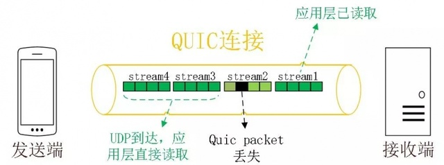

# Quic 协议

## 背景和简介

简单点说，QUIC协议等于TCP+TLS+HTTP/2，但是我们知道，QUIC在传输层是基于UDP去做的，TCP和UDP虽然同样都是传输层协议，但是前者提供了可靠的传输机制，而后者则是一种尽力而为的传输模式，即只管发送，不去保证可靠性。

QUIC在传输层的确是用UDP做的，可以看下面这张网络结构图：

QUIC虽然是基于UDP，但是**在应用层做了类似TCP的可靠性保证**，所以QUIC也是一个可靠的传输协议。但是仅仅可靠还远远不够，QUIC还提供安全方面的保证——引入了类似于TLS的加密传输，后面也会专门讲到QUIC在安全性方面的实现。

SPDY 协议可能没有那么出名，实际上它是HTTP/2协议的前身，HTTP/2协议很多特性都是直接继承自SPDY，而QUIC的很有特性又是基于HTTP/2，比如说多路复用、报文头压缩、二进制传输等等。

## Quic 解决了什么问题

### TCP 的问题

#### 建立连接耗时大

大家都知道TCP建立连接时需要三次握手，过程就不在这里赘述了，简单点说就是三次握手后才能开始数据的传输，并且每次建立连接时都需要三次握手，这部分的开销累加起来也是很大的，同时还没办法规避，因此这部分的损耗是很严重的。尤其是，加上 TLS 之后，TLS 本身也需要确认，二者相加，整个建立连接的阶段耗时会比较长。

#### 网络切换时表现不佳

TCP的连接由一个四元组唯一确定，分别是源IP、目的IP、源端口和目的端口，就以经典的C/S模型来说，一般服务端的，也就是目的IP和目的端口是不会轻易发生变化的，但是**客户端，也就是源IP和源端口可能会发生变更**，考虑以下几个场景：

- 网络制式的切换，Wi-Fi到移动网络之间的切换是一个高发操作。
- 弱网环境下变换、**移动网络中4G、3G、2G的切换**等等，都会导致源IP和端口的变更。
- NAT网关变动，这个是NAT端存在的变换状态，也会导致客户端IP的变化。

对于个TCP连接来说，**如果四元组发生变化，则必须重新建立连接**，再结合第一点说的，建立连接时的损耗，这样会导致整个传输效率下降很多。

#### 拥塞控制算法落伍

TCP的拥塞控制算法主要是慢启动、拥塞避免、快速重传和快速恢复，这些算法虽然都很经典，但都是几十年前提出的，对于当时那种有线低速网络为主的环境很适用，但是随着科技的发展，现在基本都是无线高速网络为主，TCP这些拥塞算法不仅落伍，甚至还会带来副作用，导致网络阻塞更加严重，究其原因，还是没有跟上时代的步伐而进步。

#### 重传二义性

先科普一下什么是TCP的重传二义性：每发出一个报文段，TCP就设定超时重传定时器并等待确认信息，如果在报文段中的数据未确认之前定时器超时，TCP就认为该报文段已经丢失或出现损坏，从而重传这一报文段。但是，存在着这样的一种情况，TCP数据报文段重发后，当确认到达的时侯，无法确定这次确认是对于首次发送的报文的确认，还是对于后来重发的报文的确认，即TCP重传二义性问题，这个二义性会带来一个RTT测量不准的问题，如下图所示：

.png)

可以看到无论是图a还是图b。都存在上述说的二义性问题，要么**测量出来的RTT过大，要么测量出来的RTT过小，这对于测量RTT来说都是不可预估的风险**，而RTT对于网络传输又是非常的重要。

目前二义性问题其实是有解决方案的，要么就是打开TCP时间戳选项，但是打开这个选项后也许会引入别的问题，要么就是Karn算法或者是其改进版的算法，这个算法还是蛮复杂的，这里就不再展开来讲了。总而言之TCP是没有彻底解决好二义性问题，也算是TCP的一个遗留问题。

### TLS 的问题

#### 建立连接耗时大

先看一下TLS握手过程：

可以看到，TLS握手至少需要2个RTT，这个消耗和TCP也有的一拼，自然是很耗时的一环。当然，TLS 1.3 之后优化了，但也需要一个 RTT。

#### TLS队头阻塞

TLS可能会有队头阻塞的问题，这是因为TLS协议处理的最小单位是 Record，一般最大不能超过 16K，由于一个 record 必须经过数据一致性校验才能进行加解密，所以一个 16K 的 record，就算丢了一个字节，也会导致已经接收到的数据无法处理，因为它不完整。

假设一个 record 需要6个 TCP segment 传输完成，如果最后一个 segment 丢了，那么上层应用程序必须 HANG 在那里等，无法继续处理，这就导致了队头阻塞，如图所示：

### HTTP/2 的问题

HTTP/2是一个新型协议，多路复用也是其一大特型，但是正是这个特型导致队头阻塞更容易发生，先看看H2的队头阻塞是怎样的：

.jpeg)

可以看到，流量已经被分成一个个stream进行转发了，但是在这个管道内，如果位于前面的stream由于丢包导致无法完全确认，那么即使后续的报文到达了，也只能等待前面的流确认完毕以后，才能被处理，这里就发生了队头阻塞。

虽然H2提出的多路复用想法很好很强大，但还是敌不过TCP的'可靠性'啊。

### 总结

综上所述，把QUIC相关的TCP、TLS、HTTP2的问题全部列了一遍，我们总结一下：

1、连接耗时严重：TCP三次握手和TLS握手阶段都需要几个RTT耗时才能完成连接

2、队头阻塞：TLS和HTPP2都有队头阻塞现象，究其原因还是TCP强制确认报文到达后才能继续传输

3、落后的拥塞算法：TCP之前的一套拥塞算法，已经跟不上时代的步伐，需要优化甚至重构

4、重传的二义性：同样也是TCP无法区分ACK来源导致二义性，进而导致RTT测量不准

如果说QUIC只是简单的TCP+TLS+HTTP/2的话，那么继承特性的同时，是否也将这些缺点一并继承了呢？答案是否定的，QUIC协议可以说是去粗取精，不仅保证了安全、可靠、多路复用等优点，还将它们的缺点都一一改进

## Quic 的改进

### 0-RTT 握手

首先看下很经典的图：

.png)

可以看到，TCP和TLS在握手时都有1个或多个RTT的损耗，而QUIC则只需要至多1个RTT的损耗，甚至只要不是首次建连，那么就是0-RTT。

试想一下，一个完整的请求，如果服务端处理耗时500ms(这算是个比较耗时的API了)，一次RTT算100ms，用HTTPS(TCP+TLS)则需要3个RTT、那么总共耗时至少也要800ms，而用QUIC协议，则整个过程可能只需要600ms就可以完成，仅仅在握手这一个环节上，就提升了百分之20的性能，这张图更为直观：

### 解决队头阻塞

QUIC也继承了HTTP2的多路复用，但是却解决了队头阻塞，前面提到的TLS和HTTP/2的队头阻塞，说到底都是由于**丢包后导致信息不完整**，进而影响数据的读取和处理，我们来看一下QUIC是如何处理的：

* 首先是解决HTTP/2的队头阻塞，虽然H2多路复用同一个连接，但实际上多个流之前存在一定的依赖关系--即在同一个连接中，必须要等前面的流处理完毕后才能处理后面的流，也就是说传输过程中同一个连接内的流是不独立的。
  * 而在QUIC中，同样是复用一个连接，但是**每个流之间都是相互独立的**，换言之，**某个流中的丢包，只会阻塞这个流本身**，而不会阻塞整个连接，这样便解决了多路复用时的队头阻塞问题

* 其次QUIC中的最基本传输单元是Packet，而TLS中的最基本传输单元为record，前面提到了TLS的队头阻塞就是因为在一个record中某个字段丢失，会导致整个record无法处理进而发生队头阻塞。
  * QUIC基于Packet做加密和认证，每个Packet都是独立完成，不需要跨越多个Packet来进行，因此也解决了TLS的队头阻塞

用一张图来直观地来表述QUIC在多路复用时的情景：

### 使用新的拥塞控制算法

之前提到了TCP的拥塞算法已经不太适用于目前的网络环境，虽然TCP的拥塞算法也在不断改进和优化，但是要想让这些优化措施生效，必须要操作系统层面支持才行，这样推行成本很高，而QUIC一大优点就是可以在应用层实现不同的拥塞算法，**比如说Cubic、BBR等算法**。

这里先简单介绍一下BBR算法，之前的拥塞算法以丢包作为拥塞控制的条件，这样做最大的弊端就在于，无法区分确实是因为网络阻塞导致的丢包，还是因为传输过程中的错误传输导致的(实际上此时网络并没有阻塞)，如果是前者还好，减小发送端的发报数量，确实能起到一定作用，那如果是后者的话，本来好好的一条高速路，因为控制变得更慢，这样就变得得不偿失了。

既然没办法区分拥塞丢包和错误丢包，BBR算法干脆就不做这个区分了，这也是该算法的独特之处，但是我们还需要调节发送窗口大小是不是，这里就要引入两个重要的概念：带宽和时延了，这两个参数决定了发送窗口的大小，拥塞算法实际上就是保证能够最大程度地利用网络通道，如果能够百分之百地利用管道，那么传输效率将会得到极大提升，换言之，如何能得到准确的带宽和时延，就成了问题的关键，可是事与愿违，这两个变量是没办法同时测量准确的，这是因为如果想要保证准确的带宽，也就是通道最大容量，则此时缓冲区内势必会有部分数据，因为缓存的引入，会导致时延增大；而当我们需要测量准确时延时，缓存区内就不能有数据，同时管道内的数据也尽可能少一些，这样倒是能得到准确的时延，但是此时得到的带宽值又偏小了。。。

这是个看上去很矛盾的事情，BBR的做法是--交替测量带宽和延迟；用一段时间内的带宽极大值和延迟极小值作为估计值，这样就可以获取相对精准的带宽和时延了，也为后续做拥塞控制提供了基础。下面再来看看带宽和时延是如何在BBR拥塞控制中发挥作用的：

这张图中RTprop (round-trip propagation time) 和 BtlBw (bottleneck bandwidth)分别代表了时延和带宽，可以看到，当时延和带宽同时达到第一个交汇点(也就是第一条黑线处)，此时BBR算法就开始进行拥塞控制了，如果继续增大报文发送数目会怎样呢？由于带宽已经满了，所以新的报文只能在缓存区里，当缓存区也满以后，则会发生真正意义上的拥塞丢包(也就是图中的第二条黑线)，此时传统的TCP拥塞算法才开始进行窗口控制，但是目前整个网络状态已经非常不友好了。

缓存满导致时延大，同时整个带宽也已经满了，再去调节未必能够得到好的效果，这也是BBR算法厉害的地方，提前选取最合适的控制点进行调控。

### 解决重传二义性

重传二义性已经讲过，由于无法区分ACK是对哪个报文的确认，也就没办法准确测量RTT，那在QUIC当中，是如何解决这个问题的呢？

首先要明确一个概念，QUIC中报文有Packet Number的概念，并且**Packet Number是严格单调递增的**，这样就能轻松解决重传二义性的问题了，如下面所示：

-1694506.jpeg)

通过单调递增的Packet Number，可以轻松地分辨出ACK是对原始报文还是对重传报文的确认，因此也就可以得到较为准确的RTT测量值，避免重传二义性问题。

### 其它优点

除了上面提到的一些改进外，QUIC还有一些很给力的特性：

协议头部的加密处理：我们知道TCP协议头部是没有经过任何加密和认证的，这就会带来一定的安全隐患。一些中间网络设备就可以对报文头进行注入和窃听，比如说修改端口号或一些标记位等等，QUIC则对所有的报文头部都进行了认真，对报文内容进行了加密，在中间传输环节如果发现报文被修改过，接收方都是可以及时发现的，这就大大降低了安全风险

连接迁移：TCP连接是由四元组唯一确定的，也就是说如果其中某个元素发生变化后，这个连接就不能再使用，需要重新建立新的四元组TCP连接，而QUIC在连接迁移方面，则是通过一个64位的随机数作为ID，也就是Connection ID，这样即使四元组发生了变化，只要ID不变，则连接也不会改变，也就不需要重连

除此之外，QUIC还实现了前向冗余纠错、证书压缩、报文头校验等功能。

## 实现

### QUIC包结构

之前提到过QUIC包的基本传输单位就是Packet，而一个Paclet都由header和payload组成：

header 头包括：

可以看到QUIC报文头主要包括：

- Public flags(公共标示)，1字节
- Connection ID(连接ID号)，1/4/8字节
- QUIC Version(版本号)，4字节
- Packet Number(包序列号)，1/2/4/6字节

而payload中则携带算法认证和加密过的密文，密文由一系列的帧组成，可以理解为数据报文。

下面就对QUIC包中各个字段的作用进行详细说明：

**Public flags：**该字段是必须的，主要用来补充说明后续包头的其它字段的，我们取比较关键的几点：

0X01位如果设置为1，则表示报文是由客户端发送QUIC版本，如果设置为0，则表示是服务端接收客户端的QUIC版本协商

0X02位如果设置为1，则表示这是一个公共的重置数据包

0X08位如果设置为1，则表示Connection ID是完整的64bit

高四位用来表示Packet Number的大小，如0X30位设置为1，表示Packet Number为6字节，0X20设置为1表示为4字节，依次类推

如果Public flags的值为0X39，则代表客户端发起的版本协商，同时包含完整的Connection ID，并且Packet Number为6字节

**Connection ID：**连接的标示符，由于是64bit的无符号数，基本上可以唯一指定一个连接

**QUIC Version：**表示QUIC的版本号，客户端提出想要使用的QUIC版本，如果服务端不支持这个版本，则会发送服务端支持的版本列表，但是这个报文不包含任何数据，仅仅是协商版本使用

**Packet Number：**作为一个长度可变类似于Packet ID的字段，用来标示每一个包，并且要求是严格递增的

以上是QUIC包头部的几个字段，接下来再看一下payload中的一些帧的含义：

**流帧：**QUIC可以进行多路复用，而流帧则承载其中一条流的应用数据，在帧头中必须体现流的编号，这个编号是由流帧决定的

**确认帧：**确认帧的作用类似于TCP当中的ACK确认包，但并不是完全相同的，发送确认帧的目的是为了通知对端哪些包被成功收到，哪些请求被接收方认为是丢失的而未去接收，如果包含确认帧的报文丢失了，不需要重传带有确认的帧，这是因为QUIC中的确认帧是累加的

**拥塞控制帧：**拥塞控制帧用来传递一个特定的拥塞算法信息，例如在拥塞算法中，拥塞控制帧就包含了报文何时收到，并且在什么时候被发送出去，这些统计在计算RTT时很有用，而RTT又是拥塞算法极为关键的一个信息

**重置流帧：**重置帧用来终止一个流，例如当接收方希望能够早点结束这个连接的时候，就可以发送一个重置流帧来重置这个连接

**连接关闭帧：**顾名思义，连接关闭帧用来快速地关闭一个连接，并且关闭所有连接上存在的流

**离开流帧：**离开流帧请求一个连接终止，由于QUIC也是一个双向的连接，虽然一方发送了离开流帧，表示这方不再发送数据了，但是这个连接仍然还可以继续接收数据，这一点和TCP中FIN包类似

### QUIC连接

之前提到了QUIC的一大特性和改进点就是0-RTT建连，那么究竟是如何实现的呢

其实QUIC的连接并不是每一次都为0-RTT建连的，先看一下首次建连过程：

可以看到首次建立连接时，客户端和服务端会在一个RTT内完成各种证书、协商信息以及建连配置的交互，这里预期是在1个RTT之后，所有的信息都可以完成校验，同时需要注意的是，客户端**最终拥有已经认证过的证书和同步后的cookie，这是0-RTT的必要条件**。另外，当发生某些错误导致认证失败后，则会再次通过一个RTT进行一轮消息的交换，如果能够完成认证，则在最多2个RTT后，首次连接就算建立完毕了，否则连接建立失败

再来看看再次建立连接的情况：

注意到，再次建立连接时，由于首次建立连接时，客户端已经存储了建连的数据cookie，因此可以直接进行数据的传输，这里等于说客户端没有进行连接的建立就可以直接发送数据，也就是所谓的0-RTT建连，但是如果说存储的cookie已经过期了，那么只能再进行一轮信息交换了，此时就和首次建立连接一样，需要1个或2个RTT了。

### QUIC流量控制

QUIC提供基于Connection和Stream的两种流量控制，这也符合QUIC多路复用的特性

可以简单将Stream比作一次HTTP请求，而Connection则是一条TCP连接，基于多路复用的特性，在一条Connection上可以同时存在多个Stream，并且这多个Stream又相互独立，因此在做流量控制时，既要对Connection做流控，也要对Stream做流控

QUIC实现流控的原理大致如下：

1. 接收方通过window_update帧来通知发送方自己可以接收的字节数，类似于TCP的滑动窗口

> window_update帧:
>
> window_update帧用来通知对端增加自身可接收的字节数，其默认值为16K，在握手协商过程中这个值会变大，控制窗口增大的两个重要参数是SFCW(Stream Flow Control Window)和CFCW(Connection/Session Flow Control Window)，这些都是在连接建立时，通过handshake数据交换时完成的.

2. 除此之外，还通过block帧来通知对端已经发生阻塞，暂时不要发送新的数据

> block帧也是QUIC的payload中众多frame里的一个，其作用就是告诉对端，目前这里已经产生了阻塞(一般是因为数据处理速率较慢)，不要继续发送数据了，这也是流控的一种，也可以理解为是一个window_update帧为0的特殊情况

下面这张图形象地展示了QUIC流控的实现：

针对 Stream 有：

针对 Connection 有：

-1694991.jpeg)
