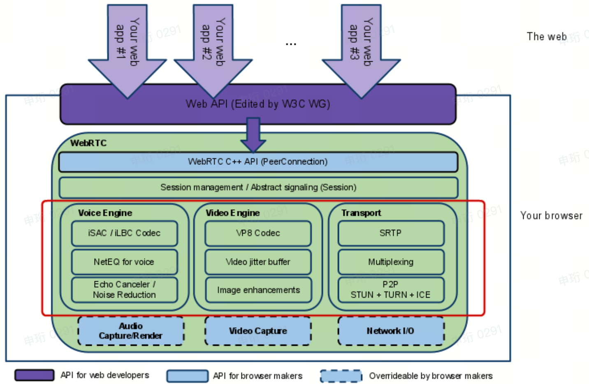
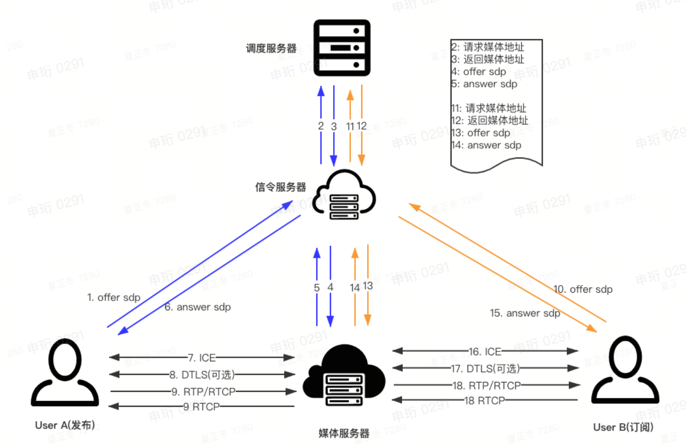
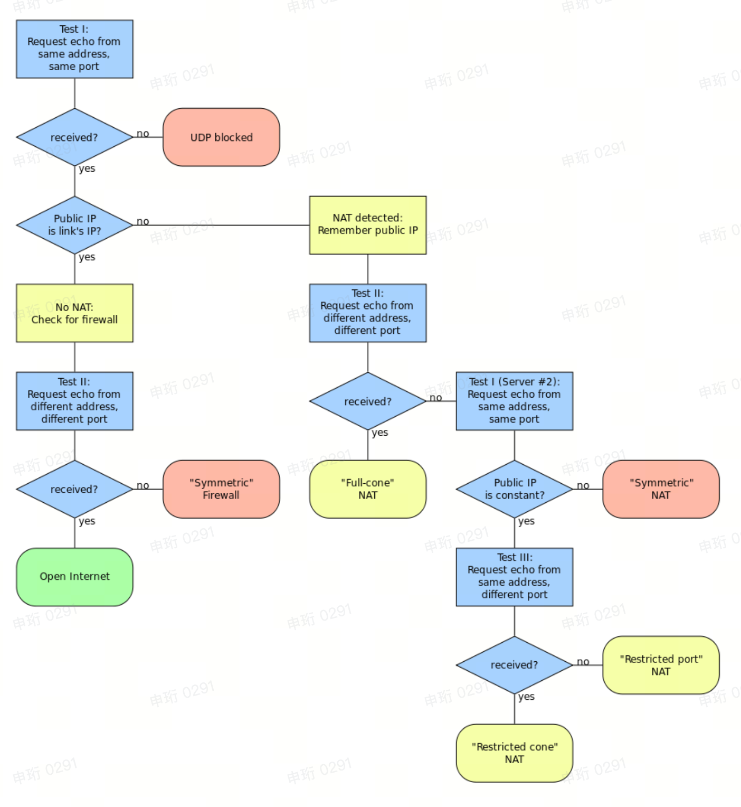

# 基本介绍

WebRTC（Web Real-Time Communication）是Google在2010年以6829万美元从Global IP Solutions公司购买，并于2011年将其开源。

WebRTC虽然名称中包含了“Web”，但是该框架不限于浏览器，他的目标是在浏览器（Chrome、Firefox、Opera）、移动端（Android、iOS）、IoT设备之间实现一套通用的实时通信框架。

# 基本框架



框架图中最关键是红框中的3个模块：

- Voice Engine：音频模块，包含音频编解码（Opus）、3A算法、NetEQ（Network Equalizer，音频的Jitter Buffer）。
- Video Engine：视频模块，包含视频编解码（VP8，VP9，H264，H265）、视频Jitter Buffer（防止视频抖动）、图像增强（超分、背景虚化、特效）。
- Transport：传输模块，包含SRTP（Secure Real-time Transport Protocol，基于UDP），多路复用（媒体流复用一个端口），P2P（STUN、TURN、ICE）。

最底部虚线部分根据不同平台有不同的实现，比如视频采集和渲染，音频采集和播放。

> 本文主要介绍传输模块中的P2P（STUN、TURN、ICE）。

# 整体流程

WebRTC的初衷是两个浏览器间建立P2P通信，但是视频会议通常采用[SFU](https://bytedance.feishu.cn/docs/doccnS2Rzk9dkJATcyx0NThXsve#IyzZdT)的方式（因为SFU才能满足视频会议的要求），以1v1通话为例，客户端A与媒体服务器建立P2P通信，客户端B与媒体服务器建立P2P通信，客户端A和客户端B的媒体数据通过媒体服务器转发。

下图描述了1v1通话的建连过程。



1. 客户端A将[SDP](https://bytedance.feishu.cn/docs/doccnS2Rzk9dkJATcyx0NThXsve#KgmhOQ) Offer发送给信令服务器，信令服务器将SDP Offer转发给媒体服务器。【1~4】
2. 媒体服务器生成SDP Answer发给信令服务器（包含了自己的公网IP和端口，称为Candidate），信令服务器将SDP Answer发回给客户端A。这时客户端A就知道了要与他建立UDP连接的媒体服务器Candidate。【5~6】
3. 随后客户端A和媒体服务器之间进行ICE连通性检查（通过STUN协议Request和Response），如果成功，则表示可以和媒体服务器建立UDP通道。【7】
4. 随后开始发送RTP/RTCP包。【8~9】

> 前面第1~7步的整个过程称为[ICE](https://bytedance.feishu.cn/docs/doccnS2Rzk9dkJATcyx0NThXsve#m4eJ9n)，ICE后文会介绍。

如果在第7步中，如果A和媒体服务器间UDP通道不能建立（可能A所在的网关把UDP端口封了），则需要和TURN Server建立TCP连接，作为Relay Server转发RTP包，数据流向为`A->TURN Server（TCP）->Media Server（UDP）->....->Media Server（UDP）->B`。

# 基本参与者

## 信令服务器

与客户端建立WebSocket连接（socket-io库），负责接收客户端发送的某个信令，下发给客户端某个信令。

在业务日志中搜索“signal_manager”可以查询信令服务器相关的日志，如下图：

-20231115193002288.(null))

- JoinRoom、updateSubscribe、updateStreamAttributes等都是客户端向信令服务器发送的信令；
- onAddStream、onRemoveStream等都是信令服务器下发给客户端的信令。

## 媒体服务器

媒体服务器与客户端建立UDP连接，通过RTP协议传输音视频数据，视频会议中不同参会者会将音视频数据传输给不同的媒体服务器，比如A连接M1服务器，B连接M2服务器，A为了将音视频数据发送给B，需要先发给M1，再M1发给M2（M1不一定直接发送到M2，而是经过若干个媒体服务器），再M2发给B。

与客户端进行UDP连接的媒体服务器称为边缘节点（Edge Node）。

## 调度服务器

在SDP Offer时，信令服务器会根据客户端所在地区，分配一个就近的媒体服务器，这个逻辑由调度服务器完成。

# 拓扑模型

对于视频会议这种多人音视频通信场景，有以下三种网络结构（黑色圆点表示参会人，黑色方块表示服务器）：

-20231115193002232.(null))

Lark视频会议是SFU，即客户端与媒体服务器进行音视频流传输。

Android Rooms低端机之前有考虑过使用MCU，因为可以降低Rooms的性能消耗，只需要解一路流，但是目前RTC还不能实现“千人千面”的MCU。

投屏盒子的P2P投屏场景就是第一种P2P结构。

# NAT

## 基本介绍

NAPT（网络地址端口转换，Network Address Port Translation）是NAT的一种，是当IP数据包通过路由器时将包头的IP和端口转换成另一个IP和端口的协议，用来解决IPv4的公网地址短缺问题（IPv4最多只有2^32个IP地址），因此就有了内网IP和公网IP的概念，内网的多个机器有各自不同的内网IP，但是共用一个公网IP。

内网IP的地址范围为：

- 10.0.0.0~10.255.255.255
- 172.16.0.0~172.31.255.255
- 192.168.0.0~192.168.255.255

NAPT维护了一张表，存放了“内网IP+端口”和“外网IP+端口”的双向映射，因此内网的机器能够发送数据到互联网，也能接收互联网的数据。


如果要为两个不同局域网内的客户端建立P2P连接，则需要了解NAT的种类，目前Lark视频会议是SFU的方式，即客户端和媒体服务器建立P2P连接，由于媒体服务器拥有公网IP，因此NAT穿透涉及的不多。

## 种类

### 完全锥形NAT（Full Cone NAT）

- 一旦内部地址`iAddr:iPort`映射到`eAddr:ePort`，所有来自`iAddr:iPort`的数据包都由`eAddr:ePort`向外发送。
- 任意外部主机只要发送数据包到`eAddr:ePort`，都能到达`iAddr:iPort`。

-20231115193002247.(null))

如上图所示，只要Client1通过一个`10.0.0.1:3000`发送数据给Server1，Server2就能通过向之前的出口地址（`172.217.194.113:8080`）发送数据传达给Client1。

### 限制锥形NAT（Restricted Cone NAT）

- 一旦内部地址`iAddr:iPort`映射到`eAddr:ePort`，所有来自`iAddr:iPort`的数据包都由`eAddr:ePort`向外发送。【和完全锥形NAT相同】
- 只有接收过`iAddr:iPort`数据包的外部主机`nAddr:any`（any表示端口不限），发送数据包给`eAddr:ePort`，才会到达`iAddr:iPort`。

-20231115193002240.(null))

如上图所示，只要Client1通过一个`10.0.0.1:3000`发送数据给Server1，则只有Server1能通过向之前的出口地址（`172.217.194.113:8080`）发送数据传达给Client1，Server2向该出口地址发数据就传不到Client1。

### 端口限制锥形NAT（Port-Restricted Cone NAT）

- 一旦内部地址`iAddr:iPort`映射到`eAddr:ePort`，所有来自`iAddr:iPort`的数据包都由`eAddr:ePort`向外发送。【和完全锥形NAT相同】
- 只有接收过`iAddr:iPort`数据包的外部主机`nAddr:nPort`（端口限制），发送数据包给`eAddr:ePort`，才会到达`iAddr:iPort`。

-20231115193002385.(null))

如上图所示，只要Client1通过一个`10.0.0.1:3000`发送数据给Server1的4443端口，则只有Server1的4443端口能通过向之前的出口地址（`172.217.194.113:8080`）发送数据传达给Client1，Server1的其他端口向该出口地址发数据就传不到Client1。

### 对称NAT（Symmetric NAT）

- 内部地址`iAddr:iPort`和外部主机`rAddr:rPort`，形成一个四元组`iAddr, iPort, rAddr, rPort`，只要四元组不同取值，NAT都会映射到不同的外网IP和端口。
- 只有曾经接收过`iAddr:iPort`发送的数据包的外部主机，才能把数据包发回。

)

举个例子，内网地址为`10.0.0.1:8000`，如果要发送数据给同一个外部主机`192.248.22.100`.，但是外部主机的端口不同（分别是3000和4000），则在NAT上还是会有两条映射，内网IP+端口都是`10.0.0.1:8000`。

# NAT穿透

## 基本思路

如果两个不同局域网内的客户端（C1，C2）要建立P2P连接，则需要实现NAT穿透，通常的流程如下：

1. 首先对C1和C2进行[NAT](https://bytedance.feishu.cn/docs/doccnS2Rzk9dkJATcyx0NThXsve#facjwD)**[类型检测](https://bytedance.feishu.cn/docs/doccnS2Rzk9dkJATcyx0NThXsve#facjwD)**，具体方法后续介绍。
2. 如果C1和C2都在锥形NAT内，则C1和C2分别通过**[STUN](https://bytedance.feishu.cn/docs/doccnS2Rzk9dkJATcyx0NThXsve#rkeQPK)**[服务器](https://bytedance.feishu.cn/docs/doccnS2Rzk9dkJATcyx0NThXsve#rkeQPK)获取自己的出口IP和端口，通过SDP Offer/Answer完成信息交换，从而实现NAT穿透。
3. 如果C1或C2有一个在对称NAT内，则STUN的方式不能实现NAT穿透，需要**[TURN](https://bytedance.feishu.cn/docs/doccnS2Rzk9dkJATcyx0NThXsve#gjMgZZ)**服务器作为转发服务器（Relay Server），A和B分别和TURN服务器建立UDP/TCP连接，TURN服务器负责转发媒体数据。

-20231115193002370.(null))

在Lark视频会议中，由于采用SFU的方式，客户端直接和媒体服务器建连，而媒体服务器是公网地址，因此相比上述的NAT穿透逻辑有所简化。

## NAT类型检测



## STUN

STUN（Session Traversal Utilities for NAT）是实现NAT穿透的一种方法。


STUN服务器的功能是让客户端知道自己的出口IP和端口。客户端向STUN服务器发起一个请求（使用STUN协议，Binding Request），STUN服务器将客户端的出口IP和端口作为响应回给客户端（Binding Response）。

STUN协议是基于UDP的应用层协议，STUN报文的格式如下：

-20231115193002443.(null))

在报文头中，比较重要的有：

- Message Type：消息类型，常用的有Binding Request（0x0001）和Binding Response（0x0101）。
- Transaction ID：事务ID，一次Binding Request和Binding Response有相同的事务ID，用来关联请求和响应。

报文体是由多个属性构成，常用的属性有：

- XOR-MAPPED-ADDRESS：IPv4和magic cookie做XOR运算。
- ICE_CONTROLLED：表明是Controlled的角色。
- ICE-CONTROLLING：表明是Controlling的角色。

在Lark视频会议中，媒体服务器充当了STUN服务器，客户端和媒体服务器会定期通过stun协议的Binding Request和Binding Response相互ping/pong，用来判断ICE连接状态：

-20231115193002494.(null))

客户端的Binding Request：

-20231115193002670.(null))

客户端的Binding Response：

-20231115193002586.(null))

虽然Response的XOR-MAPPED-ADDRESS属性中有客户端的出口IP和端口（101.87.183.27:28827），但是在Lark视频会议中实际并没有使用。

## TURN

在两个客户端P2P场景下，如果有一个客户端在对称NAT内，则STUN是不能实现NAT穿透的，需要使用TURN（Traversal Using Relays around NAT）服务器（使用TURN协议），转发双方的媒体数据。

在Lark视频会议中，通常客户端和媒体服务器使用UDP传输媒体数据，如果UDP不通，则可以使用TURN服务器实现客户端和媒体服务器之间媒体数据的转发（Client--TURN Server--Media Server），这时TURN协议基于TCP。

# SDP

SDP（会话描述协议，Session Description Protocol）是一种应用多媒体通话的文本协议，SDP的格式是由多个<type>=<value>组成，SDP协议定义了一些内置的type，比如v=（protocol version）、m=（media description）、a=（attribute）等，从这里也看出SDP协议扩展性很强，可以自定义type和value。

SDP协议包含了几个部分：

- 1个session level：从`v=0`开始，到`m=x`之前结束。
- 0或多个media level：从`m=x`开始，到下一个`m=x`之前结束，通常是2个media level（audio、video）。

Session Level举例：

```C%2B%2B
v=0

o=- 680121471469462884 2 IN IP4 127.0.0.1

s=-

t=0 0

a=group:BUNDLE audio video //音频和视频共用一个端口

a=msid-semantic: WMS GUKF430Khp9jEQiPrdYe0LbTAALiNAKAIfl2 //WMS表示WebRTC Media Stream，这个msid和后续的ssrc有关联
```

Media Level的Audio类型举例：

```c++
m=audio 54278 UDP/RTP/SAVPF 111 103 104 0 8 106 105 13 126 //UDP/RTP/SAVPF表示UDP传输RTP；后面的编号表示payload type list，这些数字后面都会有表示

c=IN IP4 180.6.6.6

a=rtcp:54278 IN IP4 180.6.6.6

a=mid:audio

a=extmap:1 urn:ietf:params:rtp-hdrext:ssrc-audio-level

a=sendrecv  //双向通信

a=rtcp-mux //RTCP和RTP共用一个端口

a=crypto:1 AES_CM_128_HMAC_SHA1_80 inline:qwaJWnQkwMChhIQ/dkC9tUnijwUBe2k50XLxm0G3


ICE Candidates 

a=candidate:4022866446 1 udp 2113937151 192.168.0.197 36768 typ host generation 0 //candidate交换

a=candidate:4022866446 2 udp 2113937151 192.168.0.197 36768 typ host generation 0

a=candidate:2706108158 1 tcp 1509957375 192.168.0.197 0 typ host generation 0

a=candidate:2706108158 2 tcp 1509957375 192.168.0.197 0 typ host generation 0

a=candidate:1853887674 1 udp 1845501695 46.2.2.2 36768 typ srflx raddr 192.168.0.197 rport 36768 generation 0

a=candidate:1853887674 2 udp 1845501695 46.2.2.2 36768 typ srflx raddr 192.168.0.197 rport 36768 generation 0

a=candidate:2157334355 1 udp 33562367 180.6.6.6 54278 typ relay raddr 46.2.2.2 rport 38135 generation 0

a=candidate:2157334355 2 udp 33562367 180.6.6.6 54278 typ relay raddr 46.2.2.2 rport 38135 generation 0


ICE Parameters  //ICE协商的安全验证信息

a=ice-ufrag:kwlYyWNjhC9JBe/V

a=ice-pwd:AU/SQPupllyS0SDG/eRWDCfA

a=ice-options:google-ice


DTLS Parameters //DTLS协商过程中需要的认证信息

a=fingerprint:sha-256 D1:2C:BE:AD:C4:F6:64:5C:25:16:11:9C:AF:E7:0F:73:79:36:4E:9C:1E:15:54:39:0C:06:8B:ED:96:86:00:39

a=setup:actpass


Codec Parameters

a=rtpmap:111 opus/48000/2  //opus编解码器，采样率48000，2表示双通道

a=fmtp:111 minptime=10  //对opus编解码器进行进一步解释

a=rtpmap:103 ISAC/16000  //ISAC编解码器

a=rtpmap:104 ISAC/32000

a=rtpmap:0 PCMU/8000

a=rtpmap:8 PCMA/8000

a=rtpmap:106 CN/32000

a=rtpmap:105 CN/16000

a=rtpmap:13 CN/8000

a=rtpmap:126 telephone-event/8000

a=maxptime:60


SSRC Parameters 

a=ssrc:189858836 cname:rfQMs6/rvuHHWkM4 //Synchronization Resource，表示一条流

a=ssrc:189858836 msid:GUKF430Khp9jEQiPrdYe0LbTAALiNAKAIfl2 ea392930-e126-4573-bea3-bfba519b4d59

a=ssrc:189858836 mslabel:GUKF430Khp9jEQiPrdYe0LbTAALiNAKAIfl2

a=ssrc:189858836 label:ea392930-e126-4573-bea3-bfba519b4d59
```

Media Level的Video类型举例：

```c++
Video Lines

m=video 54278 RTP/SAVPF 100 116 117

c=IN IP4 180.6.6.6

a=rtcp:54278 IN IP4 180.6.6.6

a=mid:video

a=extmap:2 urn:ietf:params:rtp-hdrext:toffset

a=extmap:3http://www.webrtc.org/experiments/rtp-hdrext/abs-send-time  //RTP Header扩展头

a=sendrecv

a=rtcp-mux

a=crypto:1 AES_CM_128_HMAC_SHA1_80 inline:qwaJWnQkwMChhIQ/dkC9tUnijwUBe2k50XLxm0G3


ICE Candidates

a=candidate:4022866446 1 udp 2113937151 192.168.0.197 36768 typ host generation 0

a=candidate:4022866446 2 udp 2113937151 192.168.0.197 36768 typ host generation 0

a=candidate:2706108158 1 tcp 1509957375 192.168.0.197 0 typ host generation 0

a=candidate:2706108158 2 tcp 1509957375 192.168.0.197 0 typ host generation 0

a=candidate:1853887674 1 udp 1845501695 46.2.2.2 36768 typ srflx raddr 192.168.0.197 rport 36768 generation 0

a=candidate:1853887674 2 udp 1845501695 46.2.2.2 36768 typ srflx raddr 192.168.0.197 rport 36768 generation 0

a=candidate:2157334355 1 udp 33562367 180.6.6.6 54278 typ relay raddr 46.2.2.2 rport 38135 generation 0

a=candidate:2157334355 2 udp 33562367 180.6.6.6 54278 typ relay raddr 46.2.2.2 rport 38135 generation 0


ICE Parameters

a=ice-ufrag:kwlYyWNjhC9JBe/V

a=ice-pwd:AU/SQPupllyS0SDG/eRWDCfA

a=ice-options:google-ice


DTLS Parameters

a=fingerprint:sha-256 D1:2C:BE:AD:C4:F6:64:5C:25:16:11:9C:AF:E7:0F:73:79:36:4E:9C:1E:15:54:39:0C:06:8B:ED:96:86:00:39

a=setup:actpass


Codec Parameters

a=rtpmap:100 VP8/90000 //请求支持VP8

a=rtcp-fb:100 ccm fir //RTCP-FeedBack（QoS），请求支持FIR

a=rtcp-fb:100 nack    //No-ACK

a=rtcp-fb:100 goog-remb //接收端REMB带宽估计

a=rtpmap:116 red/90000

a=rtpmap:117 ulpfec/90000


SSRC Parameters //定义ssrc（流ID）

a=ssrc:1993357196 cname:rfQMs6/rvuHHWkM4

a=ssrc:1993357196 msid:GUKF430Khp9jEQiPrdYe0LbTAALiNAKAIfl2 753ad6b1-31a6-4fea-8070-269c6df6ff0e

a=ssrc:1993357196 mslabel:GUKF430Khp9jEQiPrdYe0LbTAALiNAKAIfl2

a=ssrc:1993357196 label:753ad6b1-31a6-4fea-8070-269c6df6ff0e
```

在上文中“[整体流程](https://bytedance.feishu.cn/docs/doccnS2Rzk9dkJATcyx0NThXsve#aYEiYb)”的1~6步中是通过SDP协议做两个事（都是通过Offer/Answer模型完成）：

- 媒体能力的协商：Offer时客户端向服务器列举自身支持的媒体能力，比如音频和视频编解码器、是否支持FIR、NACK等；服务端收到Offer后，会结合自身的支持情况，回复Answer给客户端，决定最后使用的媒体能力。
- 信息交换：比如candidate（媒体服务器会在Answer时告诉客户端公网地址、TURN服务器地址），DTLS fingerprint，SSRC（Synchronization Sources）。

# ICE

ICE（交互式连通性建立，Interactive Connectivity Establishment）是一套建立P2P连接的框架。它利用了前文提到的STUN、TURN协议完成NAT穿透，使用了SDP协议完成Candidate的交换，并最后建立P2P连接。

先介绍几个基本概念。

- Candidate：`IP、端口`二元组。
- Host Candidate：内网IP和端口。
- Reflexive Candidate：出口IP和端口。
- Relay Candidate：TURN服务器的IP和端口。
- Candidate Pair：一个Local Candidate和Remote Candidate的组合。
- Controlling：提名Pair作为传输通道，Lark视频会议中客户端是Controlling。
- Controlled：Lark视频会议中媒体服务器是Controlled。

## 基本流程

-20231115193002622.(null))

从上图可知，基本步骤如下：

1. 和信令服务器建立websocket通道。
2. 向STUN服务器收集Candidate。
3. 通过SDP协议交换各自的Candidate。
4. 建立P2P通道。

### 收集Candidate

可以有多个，比如Host Candidate（客户端直接获取），Reflexive Candidate（通过STUN服务器获取出口地址），Relay Candidate（可以通过STUN服务器获取TURN地址）。

### 交换Candidate

通过SDP协议交换，类似：

> a=candidate:1 1 **udp** 2013266431 **120.78.91.103** 50531 typ **host** generation 0

包含了协议、优先级、IP、端口、类型。

Lark视频会议中，客户端的SDP Offer中是不会带本机的candidate的，在SDP Answer时媒体服务器会把自己的公网地址带给客户端。

### 生成Candidate Pair，并排序

知道Local Candidate和Remote Candidate后，生成Candidate Pair，并计算优先级排序。具体的计算公式略。

### 连通性检查

按照Candidate Pair的顺序做连通性检查，连通性检查是通过STUN协议完成（俗称ping pong），如下图。

-20231115193002622-0047802.(null))

每个Candidate Pair都有各自的连通状态：

- Frozen：默认状态。初始时每个Candidate Pair都是Frozen状态。当上一个Pair检查完毕，就会将下一个Pair改为Waiting状态。
- Waiting：检查没开始。
- In Progress：检查开始了，但是还没结束。
- Succeeded：检查成功。
- Failed：检查失败。


ICE的整体状态：

-20231115193002657.(null))

- new：ICE正在收集Candidate Pair。
- checking：Candidate Pair准备完成，校验中。
- connected：至少发现了一对可用的Candidate Pair，但是会继续探测更优的，不过此时已经可以进行P2P通信。
- completed：所有的Pair连通性检查完成，且有连通的Pair。
- failed：所有的Pair都不可用。
- disconnected：连上之后又断开。
- closed：connection断开。

最后选择的Candidate Pair称为Selected Pair。