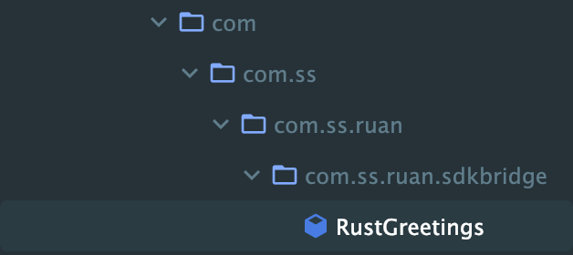

## 基本步骤

> 参考:https://imzy.vip/posts/27183/

1. AS 中添加相关的工具

```
主要是下面几个：
* Android SDK Tools
* NDK
* CMake
* LLDB
```

我们可以在 SDK Manager 中找到：


2. 添加 Rust 工具链

```
rustup target add armv7-linux-androideabi 	// arm
rustup target add aarch64-linux-android			// arm64
rustup target add i686-linux-android			  // 32 位 x86
```

3. 记录 NDK 的位置

```shell
# 修改 zsh
# $USER 一般已经是你的 shell 中的常量了
export ANDROID_HOME=/Users/$USER/Library/Android/sdk
# 我们使用 23
export NDK_HOME=$ANDROID_HOME/ndk/23.2.8568313
```

4. 修改 config 文件，添加工具链

```
// ~/.cargo/config
```

```toml
# Windows
[target.armv7-linux-androideabi]
linker = "%ANDROID_HOME%\\ndk\\23.2.8568313\\toolchains\\llvm\\prebuilt\\windows-x86_64\\bin\\armv7a-linux-androideabi22-clang++.cmd"

[target.aarch64-linux-android]
linker = "%ANDROID_HOME%\\ndk\\23.2.8568313\\toolchains\\llvm\\prebuilt\\windows-x86_64\\bin\\aarch64-linux-android22-clang++.cmd"

[target.i686-linux-android]
linker = "%ANDROID_HOME%\\ndk\\23.2.8568313\\toolchains\\llvm\\prebuilt\\windows-x86_64\\bin\\i686-linux-android22-clang++.cmd"

[target.x86_64-linux-android]
linker = "%ANDROID_HOME%\\ndk\\23.2.8568313\\toolchains\\llvm\\prebuilt\\windows-x86_64\\bin\\x86_64-linux-android22-clang++.cmd"

```

```toml
# MacOs
[target.armv7-linux-androideabi]
linker = "$ANDROID_HOME/ndk/23.2.8568313/toolchains/llvm/prebuilt/darwin-x86_64/bin/armv7a-linux-androideabi29-clang++"

[target.aarch64-linux-android]
linker = "$ANDROID_HOME/ndk/23.2.8568313/toolchains/llvm/prebuilt/darwin-x86_64/bin/aarch64-linux-android29-clang++"

[target.i686-linux-android]
linker = "$ANDROID_HOME/ndk/23.2.8568313/toolchains/llvm/prebuilt/darwin-x86_64/bin/i686-linux-android29-clang++"

[target.x86_64-linux-android]
linker = "$ANDROID_HOME/ndk/23.2.8568313/toolchains/llvm/prebuilt/darwin-x86_64/bin/x86_64-linux-android29-clang++"
```

> 注意，上面的 linker 中，**$ANDROID_HOME 需要替换为绝对路径**，不然找不到

5. 编译

```
cargo build --target aarch64-linux-android --release
cargo build --target armv7-linux-androideabi --release
cargo build --target i686-linux-android --release
```

6. 找到产物


7. 在安卓使用 Rust 代码的 module 中放置 so

首先需要创建文件夹:

> 注意！一个符号都不能错，安卓是根据路径来判断是否是 ABI 的：https://developer.android.com/ndk/guides/abis?hl=zh-cn#am

```
mkdir jniLibs
mkdir jniLibs/arm64-v8a
mkdir jniLibs/armeabi
mkdir jniLibs/x86
mkdir jniLibs/x86_64
```


然后对应放置产物。

8. 加载产物

```kotlin
class RustGreetings {
    init {
        System.loadLibrary("jni_sdk")
    }
    
    private external fun greeting(pattern: String): String

    fun sayHello(to: String): String {
        return greeting(to)
    }
}
```

这个类的路径是：



因此对应的 JNI 代码这么写：

```Rust
pub extern fn rust_greeting(to: *const c_char) -> *mut c_char {
    let c_str = unsafe { CStr::from_ptr(to) };
    let recipient = c_str.to_str().unwrap_or_else(|_| "there");
    CString::new("Hello ".to_owned() + recipient).unwrap().into_raw()
}

// 注意命名，Java 开头 + 全路径 + 类名 + 方法名
#[cfg(target_os = "android")]
#[allow(non_snake_case)]
#[no_mangle]
pub unsafe extern fn Java_com_ss_ruan_sdkbridge_RustGreetings_greeting(mut env: JNIEnv, _: JClass, java_pattern: JString) -> jstring {
    // Our Java companion code might pass-in "world" as a string, hence the name.
    let world = rust_greeting(env.get_string(&java_pattern).expect("invalid pattern string").as_ptr());
    // Retake pointer so that we can use it below and allow memory to be freed when it goes out of scope.
    let world_ptr = CString::from_raw(world);
    let output = env.new_string(world_ptr.to_str().unwrap()).expect("Couldn't create java string!");

    output.into_raw()
}
```

9. 在 onCreate 中调一下

```kotlin
class MainActivity : ComponentActivity() {
    override fun onCreate(savedInstanceState: Bundle?) {
        super.onCreate(savedInstanceState)
        enableEdgeToEdge()
        setContent {
            RuAnTheme {
                Scaffold(modifier = Modifier.fillMaxSize()) { innerPadding ->
                    Greeting(
                        name = "Android", modifier = Modifier.padding(innerPadding)
                    )
                }
            }
        }
      	// JNI 接口
        val sayHello = RustGreetings().sayHello("nihao ya")
        println("1111, $sayHello")
    }
}
```

最后看到打印：

