# Compose 原理

## 心智模型

> 例子来源于 Leland Richardson 的 [Compose From First Principles](http://intelligiblebabble.com/compose-from-first-principles/)，该文章几乎是介绍 Compose 设计思路的第一文章

在 Compose 中包含以下几大部分：

1. 描述 UI 树节点的数据结构——Node
2. 用于简化 UI 树节点插入、数据缓存以及树更新的 Composer
3. 用于差量更新的 Positional Memoization

### 描述成树状结构的UI

我们都知道，**UI** **可以简单描述为一个经由数据转换而成的一个树状的数据结构**。

Compose 也好，React、Flutter 也好，这些声明式 UI 框架的代码本质上都是对一颗树形结构的描述。

因此，我们可以想一下，一个完整的 UI 框架需要以下内容：

1. 需要一个基本的树节点 Node 类型，对应各种具体的 UI 节点类型，类比 Android 的 View 以及其各种子类。
2. 需要将数据转换成节点 Node。对于 Compose 而言，还使用了一个 compose 函数，用于将节点 Node 组合成一颗 UI 树。
3. 需要一个渲染 (renderNodeToScreen) 方法，用于将这棵树的节点渲染到屏幕上。

**因此，一个简单的应用程序就是执行这个渲染方法，将数据转换成的节点树渲染到屏幕上，并在每一次数据变化时响应数据的变化来重新渲染更新界面**。简单的流程图如下：

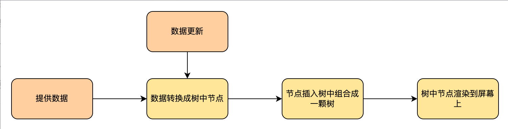

上面的过程很像 Redux 提供的数据更新公式：(状态+事件) => 状态

### 管理节点树的Composer

实现了基本的节点 Node 类型之后，我们可以在基本的节点类型上定义一些具体的**节点类型**，比如：

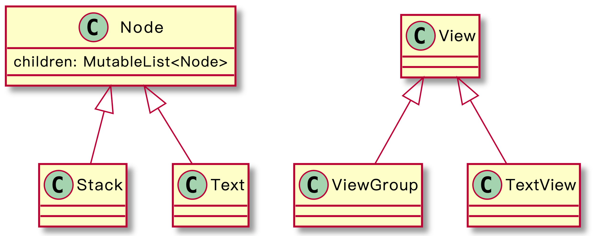

这里的 Stack 和 Text 都是 Node 的子类型，Node ，Stack ，Text 可以类比为 View ，ViewGroup ，以及具体的 TextView 。Stack 为非叶子节点的抽象表示，Text 为叶子节点的抽象表示。

将数据转换成节点，并组合节点。假设数据是一个 TodoItem 列表，然后用一个函数将数据转换为树中的节点并添加到树上：

> 一个 ViewGroup 描述了整个列表，其中有着其他的 ViewGroup，里面有着各种各样的 TextView

```kotlin
fun TodoItem(items: List<TodoItem>): Node {
    return Stack(Orientation.Vertical).apply {
        for (item in items) {
            children.add(Stack(Orientation.Horizontal).apply {
            children.add(Text(if (item.completed) "x" else " "))
            children.add(Text(item.title))
        })        
    }
}
```

可以看到，在组合树中节点时，主要是通过**手动给父节点依次添加子节点，再给子节点添加其子节点的方式进行的**。

这种方式需要保证：

* 能访问每个充当父节点的 children 属性，才能调用 add 方法添加子节点。

当树的结构越来越复杂时，这样的代码会越来越多，代码的嵌套层级也会越来越深，就会导致代码越来越难以维护：

```kotlin
children.add(node1).apply {
    children.add(node2).apply {
        children.add(node3).apply {
            // 随着树的结构变复杂，嵌套层级越来越深
            // 即使可以把这一部分代码抽成一个函数，仍然需要访问到对应的chidlren属性
            // ... 
        }
        children.add(node4).apply {
            // ...
        }
    }
}
```

Composer 就是被提出解决这个复杂的插入问题的抽象。Compose 使用了一个全局的 Composer 对象作为一个管理员，帮助进行上面的插入操作。**Composer 类似于一个指针，它指向树的当前要插入的节点，只需要调用 emit 函数，它就会把节点插入到这个维护的当前节点上。**我们可以用伪代码表示如下：

```kotlin
class ComposerImpl(root: Node): Composer {
    private var current: Node = root

    override fun emit(node: Node, content: () -> Unit = {}) {
        // 存储当前的 current 节点，用于后续的恢复
        val parent = current
      	// 访问到当前节点的 children 字段
        parent.children.add(node)
        current = node
        // 执行 content 块，执行时的 current 将为传递进来的 node 参数
        content()
        // 恢复原来的 current 节点
        current = parent
    }
}
```

基于上面的伪代码，我们可以想象一下，上面 TodoItem 的实现可以抽象为如下的过程：

```kotlin
fun Composer.App(items: List<TodoItem>) {
    // Composer#current = preCurrent
    emit(Stack(Orientation.Vertical)) { // 节点Stack
        // Composer#current = Stack
        for (item in items) {
             emit(Stack(Orientation.Horizontal)) { // 节点 item-index
                 // Composer#current = item-index
                 emit(Text(if (item.completed) "x" else " "))
                 emit(Text(item.title))
                 // Composer#current = Stack
             }
        }
        // Composer#current = preCurrent
    }
}

// for 中的 emit 代码还可以拆分成 Composer 的一个扩展函数，轻松实现复用
fun Composer.TodoItem(item: TodoItem) { // Composer 持有树的当前节点位置
    // Composer#current = preCurrent
    emit(Stack(Orientation.Horizontal)) { // 节点 item-index
        // Composer#current = item-index
        emit(Text(if (item.completed) "x" else " "))
        emit(Text(item.title))
        // Composer#current = preCurrent
    }
}
```

此时就很像我们写 Compose 时的样子了：

```kotlin
@Composable
fun SharedPrefsToggle(
    text: String,
    value: Boolean,
    onValueChanged: (Boolean) -> Unit
) {
    Row {
        Text(text)
        Checkbox(checked = value, onCheckedChange = onValueChanged)
    }
}
```

这其实也是一个树形遍历的结果。

### Positional Memoization & Gap Buffer

上面我们描述了 Composer 对于构建 UI 树的优化之处————更多在于人体工学上。新的问题是：每一次数据变化重新渲染屏幕时，如果都去重建整棵树，对于性能的损耗是巨大的。因此，要实现高效刷新 UI，最好的方式是 “差量重建” 而非 “全量构建”：即**只重建需要重建的子树**。

这种重建是 Compose 的黑魔法，对于应用程序员来说基本不可见。

Compose 采取了 **Positional Memoization** 的概念：**基于位置，在缓存中记录上一次的执行结果**（包括经由数据转换之后的树中节点，节点中的一些需要保存的私有属性等）。下一次数据变化导致重新执行时，优先从缓存中查找上一次执行的结果，然后通过参数比对等方式来判断该结果是否失效。如果未失效，则复用之前的缓存结果，否则重新执行函数得到新的执行结果并缓存。

Compose 会使用一系列方法来保证缓存中拿到的是对应的结果，这个缓存用到的数据结构就是 **Gap Buffer** ，这一块的具体逻辑在后面会讲到。

### @Composable注解 & 可组合函数

现在，已经可以形成一个简单完善的 UI 框架，不过会产生大量的构建 UI 树所需要的模板性代码。例如上面的大量的 emit 方法。

因此 **Compose 编译器**还提供了一个 @Composable 注解，用于简化代码。这个注解会作用在函数上，通过这个注解，编译器会隐藏 Composer 的使用，添加一些通用的代码逻辑，包括将**节点插入树中的逻辑以及数据的缓存和更新逻辑**等。这些被 @Composable 注解的函数，就称为**可组合函数**。基于可组合函数，在利用 Compose 编写 UI 代码时，就只需要**描述节点树的树状结构，而不用关心节点树是如何形成的，以及节点树如何渲染到界面上**。

Compose 是对 Kotlin 编译器的激进改造，黑魔法的部分基本都是基于 KCP 写入了编译器完成的。

### 架构分层

Jetpack Compose 在发布时并不跟随 Android 平台的发布而发布，而是以 UI 组件库的形式独立发布更新。其核心工具包由上至下主要包括以下 6 个分包：

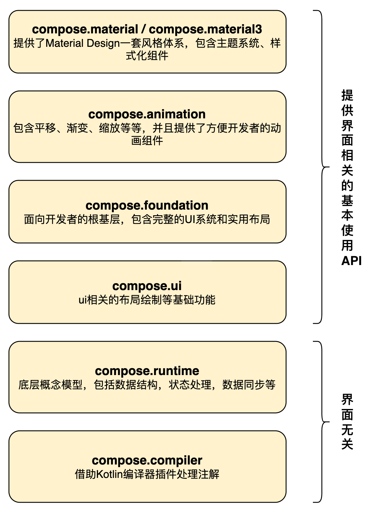

JetPack Compose 不仅仅可以用于构建原生 Android 界面，也可以用于构建 Web 和 Desktop 界面，这得益于其良好的分层设计。除了compiler，基本上每一层都是基于较底层的公共 API 构建的，同时通过组合功能来创建更高级别的组件，还支持根据需要替换任何层。其中，compiler 和 runtime 是构建 Compose 的声明式 UI 框架的基础，与界面无关，只提供 UI 树的构建，管理等功能，用于将数据转换成的节点组合成一颗完整的 UI 树。而在此基础上各平台只需要再实现 UI 的渲染，就可以形成一套完整的声明式 UI 框架。在 Compose for Android 中，这个节点就是 LayoutNode ，界面的渲染主要就是通过 ui 层提供的方法实现。

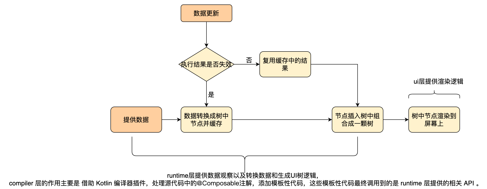

## 两颗树

Compose 将 Composable 执行后生成的渲染树称为 Compositioin。其实更准确来说，**Composition 中存在两棵树，一棵是 LayoutNode 树，这是真正执行渲染的树，LayoutNode 可以像 View 一样完成 measure/layout/draw 等具体渲染过程；而另一棵树是 SlotTable，它记录了 Composition 中的各种数据状态**。 

传统视图的状态记录在 View 对象中，在 Compose 面向函数编程而不面向对象，所以这些状态需要依靠 SlotTable 进行管理和维护。因此，SlotTable 是我们这篇文章的重中之重。

## 节点树（SlotTable）的形成

> 参考：[探索 Jetpack Compose 内核：深入 SlotTable 系统](https://juejin.cn/post/7113736450968911908#heading-2)

Composable 函数执行过程中产生的所有数据都会存入 SlotTable， 包括 State、CompositionLocal，remember 的 key 与 value 等等 ，这些数据不随函数的出栈而消失，可以跨越重组存在。Composable 函数在重组中**如果产生了新数据**则会更新 SlotTable。

SlotTable 的数据存储在 Slot 中，一个或多个 Slot 又归属于一个 Group。可以将 Group 理解为树上的一个个节点。说 SlotTable 是一棵树，其实它并非真正的树形数据结构，它用线性数组来表达一棵树的语义，从 SlotT able 的定义中可以看到这一点：

```kotlin
//SlotTable.kt
internal class SlotTable : CompositionData, Iterable<CompositionGroup> {

    /**
     * An array to store group information that is stored as groups of [Group_Fields_Size]
     * elements of the array. The [groups] array can be thought of as an array of an inline
     * struct.
     */
    var groups = IntArray(0)
        private set
 
    /**
     * An array that stores the slots for a group. The slot elements for a group start at the
     * offset returned by [dataAnchor] of [groups] and continue to the next group's slots or to
     * [slotsSize] for the last group. When in a writer the [dataAnchor] is an anchor instead of
     * an index as [slots] might contain a gap.
     */
    var slots = Array<Any?>(0) { null }
        private set

```

SlotTable 有两个数组成员，`groups` 数组存储 Group 信息，`slots` 存储 Group 所辖的数据。用数组替代结构化存储的好处是可以提升对“树”的访问速度。 Compose 中重组的频率很高，重组过程中会不断的对 SlotTable 进行读写，而访问数组的时间复杂度只有 O(1)，所以使用线性数组结构有助于提升重组的性能（这个原因后面在 gap buffer 会说）。结构如下：

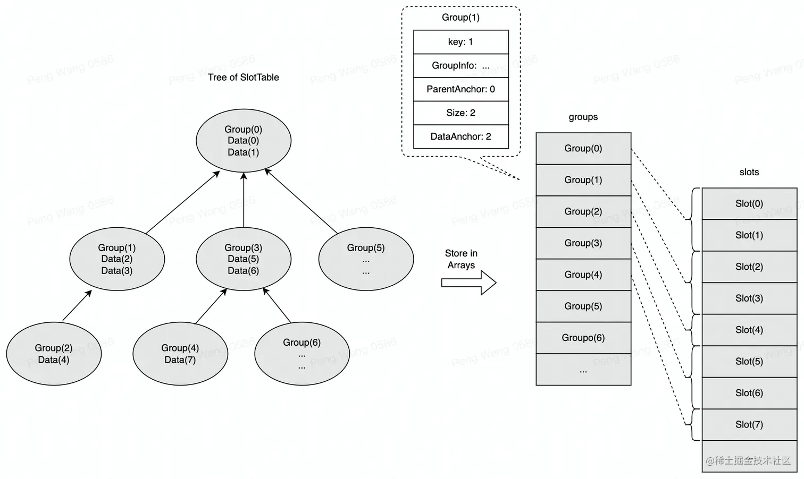

slots 是真正存储数据的地方，Composable 执行过程中可以产生任意类型的数据，所以数组类型是 `Any?`。每个 Gorup 关联的 Slot 数量不定，Slot 在 slots 中按照所属 Group 的顺序依次存放。

groups 和 slots 不是链表，所以当容量不足时，它们会进行扩容。

### 编译期添加模板代码

#### @Composable注解

通过给函数添加 @Composable 注解创建一个可组合函数，然后利用 Compose 的 compiler 处理，并生成大量的模板性代码 （将贯穿整个函数作用域的 **Composer** 作为隐式参数传进去等），可以简化代码的编写，让用户只需要关注 UI 具体的实现逻辑，而不需要关心如何构建这颗 UI 树。

Compose compiler **并不是一个注解处理器**，而是在 Kotlin 编译器的**类型检测与代码生成阶段**依赖 **Kotlin 编译器插件**(KCP)工作的，所以无需注解处理器即可使用 Compose。这一注解更类似于一个语言关键字，类似 Kotlin 的 suspend 关键字。至于为什么 Compose 使用注解的方式而不是关键字的方式，是因为关键字是语言层面的概念，而 Compose 只是一个 UI 框架，并不适合使用关键字方案。

通过给函数添加 @Composable 注解，可以改变该函数的类型，未被注解的相同函数类型与注解后的类型互不兼容。与 suspend 函数类似，Compose 同样需要一个贯穿所有的上下文调用对象，这意味着**只能在可组合函数中调用可组合函数**。

#### compiler处理注解

我们可以通过插件 [decomposer](https://github.com/takahirom/decomposer) ，在所需模块的 compileDebugKotlin 任务完成后直接查看反编译之后的代码，具体来说需要这样：

```kotlin
// settings.gradle.kts
pluginManagement {
    repositories {
				// 添加：
        maven("https://jitpack.io")
    }
		
  	// 添加
    resolutionStrategy {
        eachPlugin {
            if(requested.id.toString() == "com.github.takahirom.decomposer"){
                useModule("com.github.takahirom:decomposer:main-SNAPSHOT")
            }
        }
    }
}

// build.gradle.kts
plugins {
		// 添加
    alias(libs.plugins.decompose)
}

// libs.versions.toml 添加如下两个
[versions]
decompose = "1.0.0"

[plugins]
decompose = { id = "com.github.takahirom.decomposer", version.ref = "decompose"}
```

我们使用下面的代码：

```kotlin
@Preview
@Composable
fun HelloCompose() {
    Column {
        Text(text = "nihao")
    }
}
```

在`build/decompose`中可以看到如下内容：

```kotlin
 @Preview
 @Composable
 @ComposableTarget(
    applier = "androidx.compose.ui.UiComposable"
 )
// 编译器新增了两个参数
public static final void HelloCompose(
  @Nullable Composer $composer, 				// 编译器在这里把 Composer 传入的
  final int $changed) {									// 另一个参数标记是否修改了
  
  	// 然后这里编译器自动生成一串数字，这串数字是个 key，用于标记这个 UI
    $composer = $composer.startRestartGroup(-1206573073);
    ComposerKt.sourceInformation($composer, "C(HelloCompose)18@649L43:BaseFragmentContainer.kt#pjcr9p");
  
  	// 简化写法，即判断两次执行传入的参数是否发生了更改
    boolean dirty = $composer.changed(changed);
  	// 下面的 Change == 0 本质上就是上面的 dirty。
  	// 此时没有更改的话就跳过重组
    if ($changed == 0 && $composer.getSkipping()) {
       $composer.skipToGroupEnd();
    } else {
       // 依然是 layout 过程中遇到 request layout 的情况
       if (ComposerKt.isTraceInProgress()) {
          ComposerKt.traceEventStart(-1206573073, $changed, -1, "com.example.mvilearn.view.fragments.HelloCompose (BaseFragmentContainer.kt:17)");
       }
			
       // 复杂重组流程，实际上就是执行一遍 Colum {}
       $composer.startReplaceableGroup(-483455358);
       // 。。。
       $composer.endReplaceableGroup();
    }
		
  	// 对于一些无论怎么重新执行都不会改变执行结果的函数，scopeUpdateScope为空，比如无参且空方法体的函数
    ScopeUpdateScope var29 = $composer.endRestartGroup();
    if (var29 != null) {
       // 类似LiveData接收的lambda参数，用于判断当前可组合函数在需要被重新执行时如何重新执行
       var29.updateScope((Function2)(new Function2() {
          public final void invoke(@Nullable Composer $composer, int $force) {
             BaseFragmentContainerKt.HelloCompose($composer, RecomposeScopeImplKt.updateChangedFlags($changed | 1));
          }
       }));
    }
 }
```

可以看到，编译器给该 `@Composable` 注解的函数添加了额外的模板参数和调用，用于组合生成树中的节点，以及在数据发生变化时决定该可组合函数是否需要被重新执行、如何重新执行。

**传入Composer参数**

上面的代码中传入的 Composer 参数，就是前面提到的 Composer，持有当前在节点树中的位置，是帮助将节点插入当前树中的上下文，贯穿整个可组合函数作用域，提供可组合函数的运行环境。同时，Composer 还持有函数执行信息的缓存等内容，用于帮助在重新执行函数时智能跳过未更改部分。

**判断可组合函数是否重新执行**

数据变更导致函数重新执行时，重新执行数据转换成节点的逻辑这一操作是极耗费性能的。因此，Compose 缓存了上一次的执行结果，并在下一次执行时判断其是否可以被复用，即可组合函数是否需要被重新执行。编译器处理代码后生成了这样的逻辑，其中：

1. 给可组合函数添加了一个 changed 参数，用来帮助判断函数当前执行时传入的参数，与上一次执行时传入的参数是否相同，如果不相同则需要重新执行当前函数。
2. 即使两次执行该可组合函数调用的参数是一样的，该函数同样未必可以被跳过执行。因为该函数可能使用了一些会发生改变的 State 等，导致函数在两次执行时结果并不相同。因此编译器还会通过添加对应代码，用来判断该函数是否可以被跳过执行( getSkipping )，从而决定可组合函数是否需要被重新执行。

```Java
boolean dirty = $composer.changed(changed);
if (dirty || !$composer.getSkipping()) {
   Colum(...)
}
```

在实际的界面运行过程中，当出现了用户交互以及网络请求等情况，导致数据变化时，都会触发可组合函数的重新执行。compiler 编译器添加的这些模板性代码就是为了让可组合函数在重新执行时，选择是复用缓存中的执行结果，还是重新执行被“污染”的函数（比如读取了发生改变的数据）得到并更新执行结果，从而达到数据驱动 UI 高效刷新的效果。

### Gap Buffer

Compose 中用于缓存函数的各种执行信息的数据结构，就是 Gap Buffer，在 Compose 的代码中具体体现为 SlotTable 。

所谓的 Gap Buffer，其实是文本编辑器中常用的一个数据结构。将正在编辑的内容看成一个**一维数组**，这个数组是一个 buffer，但是一维数组实际的空间会比实际编辑的内容所需的空间要大，这些没有用到的空间就是一个 gap。这个 gap 会帮助进行文本的实际插入、删除和移动。


下面通过 [wiki](https://en.wikipedia.org/wiki/Gap_buffer) 上举的例子具体看看其流程：

如下面这段文本，方括号之间的空格表示 gap，实际编辑时，这些 gap 是不对用户可见的，`[`所在的位置可以看作是鼠标光标的位置

```
This is the way [                     ]out.
```

在插入时会优先在 gap 中插入：

```Plain%20Text
This is the way the world started [   ]out.
```

当**移动鼠标光标**时实际上也移动了gap：

```Plain%20Text
This is the way the world [   ]started out.
```

当 gap 被占满时需要对 gap 进行扩容：

```Plain%20Text
This is the way the world as we know it [                   ]started out.
```

这样，获取指定位置文本的时间复杂度是 O(1) ，而插入、删除和移动仅消耗移动光标（即移动 gap ）的时间代价：

* gap 移动的时间复杂度是 O(n) ，扩容的时间复杂度也是 O(n) 。

比如：假定 gap 要从 [old, old + gap_len] 移动到 [new, new + gap_len] ，只需要将 [old + gap_len, new + gap_len] 中数据复制到 [old, new] 中，再将 [new, new + gap_len] 中元素清空作为 gap 即可。因此，时间复杂度是 O(n) ：

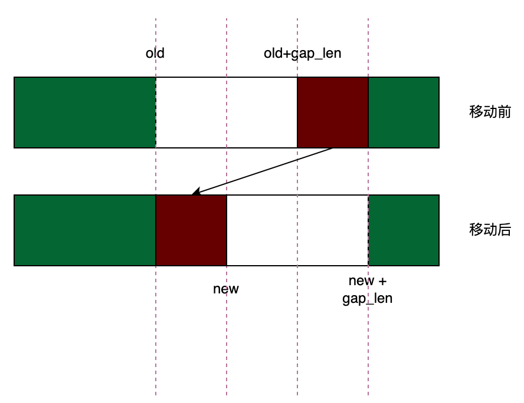

扩容同理，可以类比于数组末尾有一个 gap ，将数组末尾的 gap 移动到原来的 gap 后面，对数组扩容即可。

Compose 采用 GapBuffer 的数据结构，实际上是假定 **UI 的值会频繁地刷新(State 变化，以O(1)的时间查找 UI 节点)，但是 UI 的结构不会频繁地改变(少数的 UI 结构变化，以O(n)是时间去构建)**。而当它们确实需要改变结构时，则很可能需要做出大块的改动，此时进行 O(n) 的间隙移动操作便是一个合理的权衡。

### SlotTable

Compose 基于 Gap Buffer 的数据结构，构建了 SlotTable 用于缓存可组合函数的执行结果。SlotTable 本质上是一个线性结构，是一个树形结构经过 DFS 处理之后的扁平数组。

#### Group 数组

在 SlotTable 中，首先会用一个一维数组来存储一个 Group 数组，数组中每 5 位会表示一个 Group 的信息。从运行时的角度讲，这个 Group 指的是是组合在一起的一组节点，或者其他的状态信息。**一个可组合函数意味着一个 Group** 。Group 用来管理 UI 的动态处理（即数据结构视角的移动和插入）：创建完毕的 Group 会使编译器了解开发者的代码会改变哪些 UI 的结构。

我们从类`SlotTable`中可以找到如下注释：

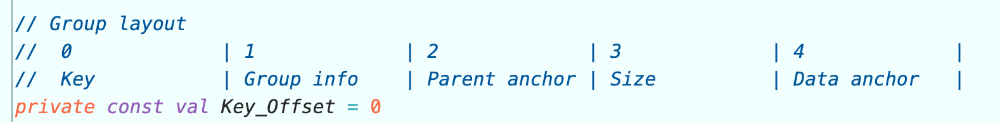

其中就描述了 Group 数组的相关信息：

* key 用于唯一标识这个 Group，
* Group info 描述这个组的信息，
* Parent anchor 描述的是这个组的父Group 的位置，
* Size 描述这个 Group 的规模，
* Data anchor 用于描述这个组的数据的位置

这些信息可以用于在接下来提到的 Slot 数组中找到每一个 Group 中的具体信息。Group 大致分为以下几种类型：

- 节点 Node
- 组合多个节点的容器
- 存储状态信息的 Group

对于 UI 的树形结构而言，只知道 Node 的概念而不知道 Group 的概念，Group 的存在主要是为了更好地管理 UI 结构的改变。**一个 Group 里的多个 Node 可以在 UI 树中被统一地移除、插入或者替换**。

比如以下例子：

```kotlin
@Composable
fun SingleText() {
    Text("one")
    Text("two")
    Text("three")
}
```

假定一个 Text 方法的调用代表一个节点 Node 生成，那么，在上述例子中，SingleText 方法对应的 Group 中最终会生成 **3 个 Node**，而这 3 个 Node 可以在 SingleText 中被统一地插入、移除或者替换。一个 SingleText 函数我们可以看为一个 group。其中有着编号为 0、1、2 的三个 Node.

再有一个例子：

```kotlin
@Composable
fun MyTexts(a: Boolean, b: Boolean, c: Boolean) {
  Colum {
    if (a) {
      	SingleText()
      }
    if (b) {
        SingleText()
      }
    if (c) {
        SingleText()
    	}
  }
}
```

当 a , b , c 的值发生变化时，对应调用位置中 SingleText 中的 3 个节点将会被统一地插入或者删除，而节点树对此是一无所知的，它只知道要删除和添加哪些节点。控制这 3 个节点一起插入和删除的是运行时维护的 Group。例如，b 从 true 变为 false，此时 runtime 可以很快的找到编号为 3、4、5 的三个节点需要被删除，这个就和我们上面说的 gap buffer 联系起来了。反之亦然，如果 b 从 false 变为 true，那么 runtime 就能比较快的知道，需要从下标 3 开始插入。

> 参考：[How to explain the concept of groups in JetPack Compose](https://stackoverflow.com/questions/68543263/how-to-explain-the-concept-of-groups-in-android-jetpack-compose)

#### Slot 数组

Group 数组用于存储每一个 Group 通用的关键性信息，这些 Group 中的具体信息都会展开存储到 Slot 数组中。不同的 Group 需要存储的具体信息内容以及数量是不同的，因此一个 Group 对应到 Slot 数组中的元素数量是不确定的。通过 Group 数组中存储的 Parent anchor 和 Data anchor 等信息，就可以获取某个 Group 的信息在 Slot 数组中的具体位置，从而从 Slot 数组中拿到对应的信息。

比如前面提到的 MyTexts 这个例子，鉴于三个条件语句逻辑基本一致，简单起见，只保留一个条件项，同时添加一个 Button 调用：

```kotlin
@Composable
fun MyTexts(a: Boolean, b: Boolean, c: Boolean) {
    if (a) {
        SingleText()
    }
    var count by remember { mutableStateOf(0) }
    Button(
        text = "Count: $count",
        onClick = { count++ }
    )
}
```

在编译后生成的伪代码逻辑大致如下：

```kotlin
// 假定当 Composer 第一次执行时，a 的值为 true 
fun MyTexts(a: Boolean 
    $composer: Composer, changed Int) {
    // Composer 的 start 相关方法被调用并存储了一个 Group 对象
    $composer.startRestartGroup(100) // 方便阅读的key，并非实际的key
    // 简化写法，其实会判断入参以及对应位置缓存是否已失效
    if ($composer.canSkip(changed)) { 
        $composer.skipToGroupEnd()
    } else {
        if (a) {
            $composer.startReplaceableGroup(200)
            // SingleText被调用，也会创建Group
            SingleText($composer, changed = 0)
            $composer.endReplaceableGroup()
        } else {
            // 即使没有else语句，编译器也会添加如下代码
            // 好处是if和else中的Group可直接替换，减少移动Group的性能损耗
            // a 为true，此语句块不会被执行
            $composer.startReplaceableGroup(300)
            $composer.endReplaceableGroup()
        }
        
        // remember被调用也插入了一个Group对象
        $composer.startReplaceableGroup(800)
        // mutableStateOf的值被返回，而state实例会被存储起来
        composer.rememberedValue() 
        $composer.endReplaceableGroup()
        
        // Button基于它的每一个参数存储了一个分组
        Button(text = "Count: $count", onClick = { count++ }, 
            $composer = $composer, changed = /* */)
    }
    $composer.endRestartGroup()
    // 执行完成时，执行时创建的这些分组以及存储的参数值等信息已经存储到SlotTable中
}
```

最后，在 SlotTable 的 Group 数组就会存储好创建的每一个 Group 的信息，每 5 位代表一个 Group 的关键信息:

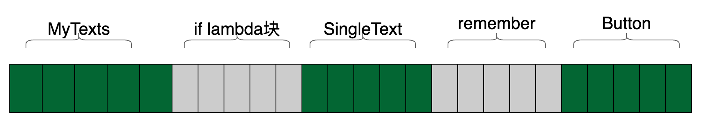

SingleText 中的 Text 调用等也会产生 Group 对象，实际构建的 Group 数量更多，实现也更复杂，在此做了简化，假定 SingleText 的调用只会产生一个组对象，关键逻辑一致即可，后面的介绍也是如此。

在 Slot 数组中，则会事无巨细地存储每个 Group 的具体信息：

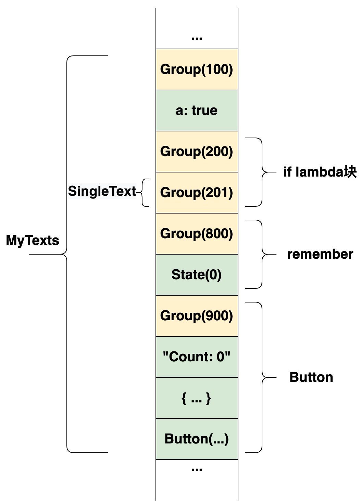

数据结构现在已经持有了来自组合的所有对象，整个树的节点也已经按照深度优先遍历的执行顺序排列。这也是为什么说利用 SlotTable 和 Group 的概念可以用一个数组来表示一个树形结构:

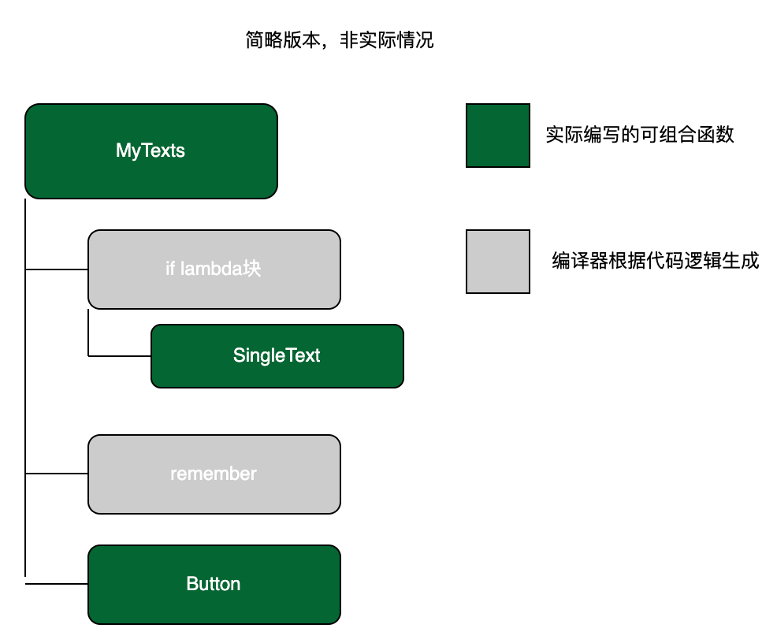

正如前面说到，这些组对象并不直接一一对应生成的 UI 树的节点，而是通过将节点分组，用来管理 UI 变化过程中可能发生的节点移动或者插入等情况。在数据发生变化导致 UI 变化的这个过程中，所用到的重要概念就是 **Positional Memoization。**

### 总结

经过上面的流程，我们知道了几个关键的地方：

1. **Group 是 SLotTable 的组成部分，直接描述了节点数的信息**
2. **树形结构是基于 Group 进行构建的**。Composable 首次执行过程中会在 startXXXGroup 中会创建 Group 节点存入 SlotTable，同时通过设置 Parent ahchor 构建 Group 的父子关系，Group 的父子关系是构建渲染树的基础。
3. **O(1)时间的 group 查找**。SlotTable 是基于 Gap Buffer 实现的，其实现了 O(1) 的查找的关键在于首次组合时 startXXXGroup 会给到一个 Group 唯一的 key。key 直接指向了对应的 Group，因此就像数组一样，查找是 O(1) 的，但是增删是 O(n) 的。SlotTable 中记录的 Group 携带了位置信息，这种机制被称为 **Positional Memoization**。

## 更新节点树

当状态发生变化时，Compose 会重建 UI 的树型结构，并基于所管理的节点树去刷新 UI。出于性能考虑，节点树需要重建时，会使用一些 diff 的技术对其进行“差量更新”，避免“全量重建”。Compose 团队所采纳的方法是使用 **位置记忆化** **（Positional Memoization）**的概念：所谓的位置记忆化，其实是一种指令式的思想：

* Compose 的 runtime 就相当于是一个 Composer（读写头）工作在一个SlotTable（纸带）上。

这里有一些 AST 相关的内容：

> 代码的执行流程**本质上就是深度遍历一棵树的过程**，于是在 Compose 的思想里，@Composable 函数代码里所有感兴趣的细节可以视为一棵 AST 树（不仅 @Composable 函数的嵌套关系被记录下来了，开发者传的每一个参数、调用的某些函数也被视为节点），然后 Composer 执行时就相当于按照深度遍历的顺序把这棵树事无巨细的记在 SlotTable 里。
>
> 如果这棵树的结构不发生变化（ UI 结构不发生变化），那么无论怎么重渲染，节点在纸带上的位置一定不会变化，所以 Composer 读到相应的位置，就相当于找到了相应节点在上一轮执行时留下的状态，就叫做 **Positional Memoization 。**
>
> 我们可以看一下 Rust 的 AST 树，就可以感受到事无巨细的感受了:[Rust AST 查看器](https://github.com/CarlKCarlK/rust-ast-explorer)
>
> 代码：
>
> ```rust
> fn main() {
>   println!()
> }
> 
> // AST
> 
> File {
>     shebang: None,
>     attrs: [],
>     items: [
>         Fn(
>             ItemFn {
>                 attrs: [],
>                 vis: Inherited,
>                 sig: Signature {
>                     constness: None,
>                     asyncness: None,
>                     unsafety: None,
>                     abi: None,
>                     fn_token: Fn,
>                     ident: Ident(
>                         main,
>                     ),
>                     generics: Generics {
>                         lt_token: None,
>                         params: [],
>                         gt_token: None,
>                         where_clause: None,
>                     },
>                     paren_token: Paren,
>                     inputs: [],
>                     variadic: None,
>                     output: Default,
>                 },
>                 block: Block {
>                     brace_token: Brace,
>                     stmts: [
>                         Semi(
>                             Macro(
>                                 ExprMacro {
>                                     attrs: [],
>                                     mac: Macro {
>                                         path: Path {
>                                             leading_colon: None,
>                                             segments: [
>                                                 PathSegment {
>                                                     ident: Ident(
>                                                         println,
>                                                     ),
>                                                     arguments: None,
>                                                 },
>                                             ],
>                                         },
>                                         bang_token: Bang,
>                                         delimiter: Paren(
>                                             Paren,
>                                         ),
>                                         tokens: TokenStream [],
>                                     },
>                                 },
>                             ),
>                             Semi,
>                         ),
>                     ],
>                 },
>             },
>         ),
>     ],
> }
> ```

从上面的例子中也能看到 AST 树本质上也是一颗深度优先遍历的一维数组，在这里 Compose 团队只是借鉴了这个思想。和上面 Rust 添加了大量的识别符号一样，这个 SlotTable 所代表的树状结构**并不是 UI 的最终树状结构**，而是在此基础上**添加了许多需要记录的内容** （比如可组合函数接收的参数等），这些内容也会被当成一个节点存储在 SlotTable 上。

当读写头(Composer)在纸带(SlotTabel)上从头到尾走一遍并执行相应代码时，就会执行构建 UI 树的节点以及 将节点插入到 UI 树上的逻辑，当遍历完这个 SlotTable ，最终的 UI 节点树也构建完成，我们可以用下图展示过程：

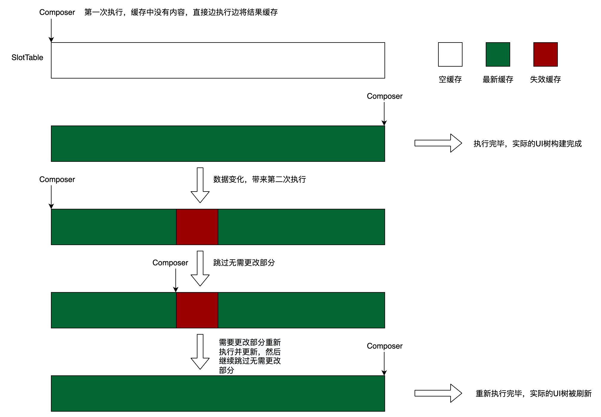

上面可以看到，深色部分展示了所谓位置记忆话的概念，本质上就是缓存了一次光标(当前的修改的数据)的位置，然后差量更新。目标是在每一次 View 树重建时，能够基于位置**复用之前执行时创建的 Node**，而不是每次重新构建一个新的 Node 对象。

因此，实际上在执行过程中缓存了创建的每一个 Node。同时，这个缓存还都有着 key 保证可以O(1)地从缓存中取回这个 Node 对象。

接下来我们分析一下这个过程。

### 缓存的信息

在 UI 结构不变时，根据函数的执行特点，假定可以直接使用**上面提到的树状执行顺序用作缓存的 key**。此时，每一次 UI 重渲染时，在 Node 不需要改变的情况下，都会直接去复用此前的 Node。但是，实际上缓存的信息不仅仅如此，例如前面的 Text 调用，假定最终会利用传入的 text 属性生成一个 Text 节点：

```kotlin
class Text(var text: String) : Node()
```

此时其实会缓存 Node 的一些私有状态，例如`text`字段。因为如果不对`text`属性进行缓存的话，那么在每一次`text`发生变化时，由于该属性发生变化导致不得不重建 Text Node，会带来不必要的性能损耗。

相反，现在复用这个 Text 节点，在`text`属性变化时，只更新节点`text`属性，就可以进一步提高其性能。因此，实际上是针对`Node`的属性专门缓存。在每一次重渲染时，如果`text`发生了变化，可以直接复用上一次的 Node 实例，然后更新这个 Node 实例的属性即可。这也是 remeber 的思路。

#### 树状执行顺序 key 存在的问题及实际方案

将执行顺序作为缓存的 key 存在的问题就是，如果**引入了条件语句等可能改变 UI 结构**的语句，就可能导致读取缓存时发生错位的情况。我们看个例子，就加一个 if：

```kotlin
@Composable
fun MyTexts(a: Boolean, b: Boolean, c: Boolean) {
    if (a) {
        SingleText()
    } else {
        var count by remember { mutableStateOf(0) }
        Button(
            text = "Count: $count",
            onClick = { count++ }
        )
    }
}
```

经过编译器处理，会得到如下结果：

```kotlin
// 假设第一次执行a为true
fun MyTexts(a: Boolean 
    $composer: Composer, changed Int) {
    $composer.startRestartGroup(100) // 1. 创建一个Group 100
    if ($composer.canSkip(changed)) { // 2. 缓存中没有内容，无法被跳过
        $composer.skipToGroupEnd()
    } else {
        if (a) { // 3. 第一次执行，a为true，执行if语句块
            $composer.startReplaceableGroup(200) // 4. 创建一个Group 200
            // 5. 简化：假设SingleText调用只创建一个Group
            SingleText($composer, changed = 0) 
            $composer.endReplaceableGroup()
        } else { // 6. a为true，不执行此语句块
            $composer.startReplaceableGroup(300) 
            
            $composer.startReplaceableGroup(800) 
            composer.rememberedValue()
            $composer.endReplaceableGroup()
            
            Button(text = "Count: $count", onClick = { count++ }, 
                $composer = $composer, changed = /* */) 
            
            $composer.endReplaceableGroup();
         }
    }
    $composer.endRestartGroup()
}
```

上面的注释是当函数第一次执行时，假设 a 的值为`true`。此时并没有相应的缓存，因此执行完后缓存中的 Group 数组为：

```
100 | 200 | SingleText
```

当函数第二次执行时，假设 a 的值为`false`：

```kotlin
// 1. 第二次执行时a为false
fun MyTexts(a: Boolean 
    $composer: Composer, changed Int) {
    $composer.startRestartGroup(100) // 2. 缓存对应位置已存在Group，不再重新创建
    if ($composer.canSkip(changed)) { // 3. 两次执行传入的参数a的值不一样，无法被跳过
        $composer.skipToGroupEnd()
    } else {
        if (a) { // 4. a为false，不执行此语句块
            $composer.startReplaceableGroup(200)
            SingleText($composer, changed = 0) 
            $composer.endReplaceableGroup()
        } else { // 5. a为false，执行此语句块
        
            // 6. 创建Group 300之前， 由于只将执行顺序作为 key，
            // 会先从缓存中对应位置拿执行结果， 发现缓存中已经存在了执行结果，
            // 因此不再重新创建
            $composer.startReplaceableGroup(300)
            
            // 7. 同样，创建 Group 800 之前，发现缓存中已经存在一个 SingleText，
            // 不再重新创建
            $composer.startReplaceableGroup(800)
            composer.rememberedValue()
            $composer.endReplaceableGroup()
            
            // 8. 缓存中没有，直接创建 Button 的 Group
            Button(text = "Count: $count", onClick = { count++ }, 
                $composer = $composer, changed = /* */) 
            
            $composer.endReplaceableGroup();
         }
    }
    $composer.endRestartGroup()
}
```

此时 Group 变化为（因为存在了 200 和 SingleText 因此避开了创建 300 和 800）：

```
100 | 200 | SingleText | Button
```

这时候结果不符合预期，我们期望的结果应该是：

```
100 | 300 | 800 | Button
```

为了规避这种情况，Compose 框架采用了大量的方法来判断 UI 结构是否发生了改变。

例如，当可组合函数执行时，SlotTable 不仅会缓存函数的执行信息，还会缓存为 Group 自动添加的 key 等。而在其重新执行时：当 Group 的 key 和当前执行位置遇到的 key 不匹配时，就会在缓存里搜索，判断该 Group 是被移动、删除还是添加了。

> Group 的 key 只要在 Parent Group 的范围内保持唯一即可，不需要全局唯一。

再来看一遍上面 MyTexts 函数的执行过程，我们假设第一次执行 a 为`true`：

```
100 | 200 | SingleText
```

第二次执行有了新的策略：

1. 创建 Group 100 之前，发现缓存中已有 Group 100， 不再创建
2. 创建 Group 300 时，**发现缓存中对应位置没有对应 key 的Group**，可以知道 UI 的结构发生了变化。因此需要在当前位置创建一个新的 Group 300 

这个创建过程会利用到 Gap Buffer 的特性，编译器会将 Gap 移动到当前位置：

```
100 | Gap | 200 | SingleText
```

在 Gap 中插入，然后移动 Gap：

```
100 | 300 | Gap | 200 | SingleText
```

3. 创建 Group 800 以及 Button 时，同样发现缓存中不存在，因此继续在 Gap 中插入：

```
100 | 300 | 800 | Button | Gap | 200 | SingleText
```

4. 继续往后执行时，发现不再有新的代码执行，而后面缓存中仍有内容，可以知道后面缓存中的内容已失效，因此直接删除：

```
100 | 300 | 800 | Button | Gap （后面删除了）
```

通过这种方式，成功实现了 UI 结构的改变。

#### for 场景中，key 存在的问题

除了上面 if 的情况外，for 的情况也会有问题，例如下面：

```kotlin
@Composable
fun MoveableGroupTest(list: List<Item>) {
    Column {
        list.forEach { 
            Text("Item:$it")
        }
    }
}
```

在 for 循环中生成了多个 text，回想上面的逻辑，实际上，Compose 无法基于代码位置实现 **Positional Memoization**。

如果此时参数 list 发生了变化，比如插入了一个新的 Item，此时 Composer 无法识别出 Group 的位移，这个时候，Compose 只能对其进行删除和重建，影响重组性能。针对这类无法依靠编译器生成 `$key` 的问题，Compose 给了解决方案，可以通过 `key {...}` 手动添加唯一索引 key，便于识别 Item 的新增，提升重组性能。经优化后的代码如下：

```kotlin
//Before Compiler
@Composable
fun MoveableGroupTest(list: List<Item>) {
    Column {
        list.forEach { 
            key(izt.id) { //Unique key
                Text("Item:$it")
            }
            
        }
    }
}

// 编译后：
@Composable
fun MoveableGroupTest(list: List<Item>, $composer: Composer?, $changed: Int) {
    Column {
        list.forEach { 
            key(it.id) {
                $composer.startMovableGroup(-846332013, Integer.valueOf(it));
                Text("Item:$it")
                $composer.endMovableGroup();
            }
        }
    }
}
```

startMoveableGroup 的参数中除了 GroupKey 还**传入了一个辅助的 DataKey**。当输入的 list 数据中出现了增/删或者位移时，MoveableGroup 可以基于 DataKey 识别出是否是位移而非销毁重建，提升重组的性能。

### Group 分类

基于上面的更新过程，Group 被 Compose 分为了多类来应对这些特殊场景，针对增删改查都有：

| startXXXGroup                 | 说明                                                         |
| ----------------------------- | ------------------------------------------------------------ |
| startNode /startResueableNode | 插入一个包含 Node 的 Group。例如 Text 源码的 Layout 函数中的 ReusableComposeNode，显示调用了 startResueableNode ，而后调用 createNode 在 Slot 中插入 LayoutNode。 |
| startRestartGroup             | 插入一个可重复执行的 Group，它可能会随着重组被再次执行，因此 RestartGroup 是重组的最小单元。 |
| startReplacableGroup          | 插入一个可以被替换的 Group，例如一个 if/else 代码块就是一个  ReplaceableGroup，它可以在重组中被插入后者从 SlotTable 中移除。 |
| startMovableGroup             | 插入一个可以移动的 Group，在重组中可能在兄弟 Group 之间发生位置移动。 |
| startReusableGroup            | 插入一个可复用的 Group，其内部数据可在 LayoutNode 之间复用，例如 LazyList 中同类型的 Item。 |

就像上面

* if 的情况，Compose 使用了 startReplacableGroup；
* for 的情况，Compose 使用了 startMovableGroup；

此外，还有个需要注意的，上面每一个 compose 函数，其实编译出来的代码前都有 startRestartGroup，这使得每个 Composable 函数都可以单独参与重组。我们看下 startRestartGroup 方法：
```kotlin
//Composer.kt
fun startRestartGroup(key: Int): Composer {
    start(key, null, false, null)
    addRecomposeScope() 
    return this
}

private fun addRecomposeScope() {
    //...
    val scope = RecomposeScopeImpl(composition as CompositionImpl)
    invalidateStack.push(scope) 
    updateValue(scope)
    //...
}
```

上面代码中，创建了`RecomposeScopeImpl`并存入 SlotTable 。

- **`RecomposeScopeImpl`本质上就是标记了重组范围**。其中包裹了一个 Compsoable 函数，当它需要参与重组时，Compose 会从 SlotTable 中找到它并调用 `RecomposeScopeImpl#invalide()` 标记失效，当重组来临时 Composable 函数被重新执行。
- RecomposeScopeImpl 被缓存到 `invalidateStack`，并在 `Composer#endRestartGroup()` 中返回。`updateScope` 为其设置需要参与重组的 Compsoable 函数，其实就是对当前函数的递归调用。注意 endRestartGroup 的返回值是可空的，如果 RestartGroupTest 中不依赖任何状态则无需参与重组，此时将返回 null。

### 更新策略

> 这一节参考自：

渲染树的更新是通过 Diff 实现的，类似 [React 通过 VirtualDom 的 Diff 实现 Dom 树的局部更新](https://www.geeksforgeeks.org/reactjs-virtual-dom/)，提升 UI 刷新的性能。

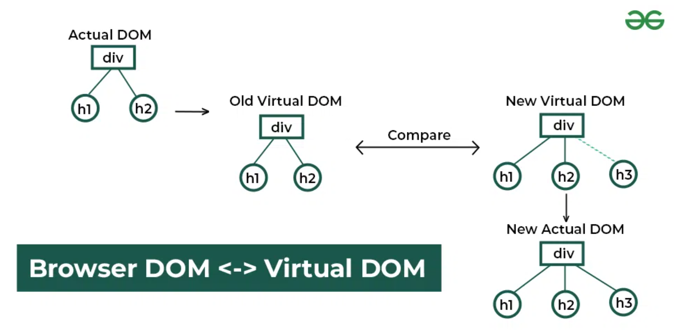

在 Compose 中，SlotTable 就是“VirtualDom”。Composable 初次执行时（也即初次组合时）在 SlotTable 中插入 Group 和对应的 Slot 数据。 当 Composable 参与重组时，**基于代码现状与 SlotTable 中的状态进行 Diff**，发现 Composition 中需要更新的状态，并最终应用到 LayoutNode 树。

这个 Diff 的过程也是在 startXXXGroup 过程中完成的，具体实现都集中在 `Composer#start()` ：

```kotlin
//Composer.kt
private fun start(key: Int, objectKey: Any?, isNode: Boolean, data: Any?) {
    //...
    
    if (pending == null) {
        val slotKey = reader.groupKey
        if (slotKey == key && objectKey == reader.groupObjectKey) {
            // 通过 key 的比较，确定 group 节点没有变化，进行数据比较
            startReaderGroup(isNode, data)
        } else {
            // group 节点发生了变化，创建 pending 进行后续处理
            pending = Pending(
                reader.extractKeys(),
                nodeIndex
            )
        }
    }
    //...
    if (pending != null) {
        // 寻找 gorup 是否在 Compositon 中存在
        val keyInfo = pending.getNext(key, objectKey)
        if (keyInfo != null) {
            // group 存在，但是位置发生了变化，需要借助 GapBuffer 进行节点位移
            val location = keyInfo.location
            reader.reposition(location)
            if (currentRelativePosition > 0) {
                // 对 Group 进行位移
                recordSlotEditingOperation { _, slots, _ ->
                    slots.moveGroup(currentRelativePosition)
                }
            }
            startReaderGroup(isNode, data)
        } else {
            //...
            val startIndex = writer.currentGroup
            when {
                isNode -> writer.startNode(Composer.Empty)
                data != null -> writer.startData(key, objectKey ?: Composer.Empty, data)
                else -> writer.startGroup(key, objectKey ?: Composer.Empty)
            }
        }
    }
    
    //...
}
```

> start 方法有四个参数：
>
> * `key`: 编译期基于代码位置生成的  `$key``
> * ``objectKey`: 使用 `key{}` 添加的辅助 key
> * `isNode`：当前 Gorup 是否是一个 Node，在 startXXXNode 中，此处会传入 true
> * `data`：当前 Group 是否有一个数据，在 startProviers 中会掺入 providers

start 方法中有很多对 reader 和 writer 的调用，这里只需要知道**他们可以追踪 SlotTable 中当前应该访问的位置，并完成读/写操作**。上面的代码是作者已经经过提炼过的，逻辑比较清晰，大致流程如下：

- 基于 key 比较 Group 是否相同（SlotTable 中的记录与代码现状），如果 Group 没有变化，则调用 startReaderGroup 进一步判断 Group 内的数据是否发生变化
- 如果 Group 发生了变化，则意味着 start 中 Group 需要新增或者位移，通过 pending.getNext 查找 key 是否在 Composition 中存在，若存在则表示需要 Group 需要位移，通过 slot.moveGroup 进行位移
- 如果 Group 需要新增，则根据 Group 类型，分别调用不同的 writer#startXXX 将 Group 插入 SlotTable

Group 内的数据比较是在 startReaderGroup 中进行的，实现比较简单：

```kotlin
private fun startReaderGroup(isNode: Boolean, data: Any?) {
    //...
  	// reader.groupAux 用于获取当前 Slot 中的数据与 data 做比较
    if (data != null && reader.groupAux !== data) {
      	// 如果不同，则调用 recordSlotTableOperation 对数据进行更新。
        recordSlotTableOperation { _, slots, _ ->
            slots.updateAux(data)
        }
    }
    //...    
}
```

**注意对 SlotTble 的更新并非立即生效**。

#### SlotReader & SlotWriter

SlotTable 被 CompositionImpl 持有，SlotReader、SlotWriter 为 SlotTable 的工具类。

SlotReader、SlotWriter 都有着对应的 startGroup/endGroup 方法。

* 对于 writer 来说 startGroup 代表对 SlotTable 的数据变更，例如插入或删除一个 Group ；
* 对于 reader 来说 startGroup 代表着移动 currentGroup 指针到最新位置。

`currentGroup` 和 `currentSlot` 两个内部字段指向 SlotTable 当前访问中的 Group 和 Slot 的位置。

SlotReader、SlotWriter 是 GapBuffer 数据结构中相关操作的执行抽象，我们可以看二者的 startGroup 方法：

```kotlin
// SlotWriter
private fun startGroup(key: Int, objectKey: Any?, isNode: Boolean, aux: Any?) {

    //...
    insertGroups(1) // groups 中分配新的位置，位置的查找来源于 GapBuffer 的查找策略
    val current = currentGroup 
    val currentAddress = groupIndexToAddress(current)
    val hasObjectKey = objectKey !== Composer.Empty
    val hasAux = !isNode && aux !== Composer.Empty
    groups.initGroup( //填充 Group 信息
        address = currentAddress, //Group 的插入位置
        key = key, //Group 的 key
        isNode = isNode, //是否是一个 Node 
        hasDataKey = hasObjectKey, //是否有 DataKey
        hasData = hasAux, //是否包含数据
        parentAnchor = parent, //关联Parent
        dataAnchor = currentSlot //关联Slot地址
    )
    //...
    val newCurrent = current + 1
    this.parent = current //更新parent
    this.currentGroup = newCurrent 
    //...
}
```

```kotlin
// SlotReader
fun startGroup() {
    //...
  	// 主要就是获取当前 Group 以及 Slot 的位置
    parent = currentGroup
    currentEnd = currentGroup + groups.groupSize(currentGroup)
    val current = currentGroup++
    currentSlot = groups.slotAnchor(current)
    //...
}
```

SlotTable 通过 openWriter/openReader 创建 writer/reader，使用结束需要调用各自的 close 关闭。

reader 可以 open 多个同时使用，而 writer 同一时间只能 open 一个。为了避免发生并发问题， writer 与 reader 不能同时执行，所以对 SlotTable 的 write 操作需要延迟到重组后进行。

#### 延迟更新

Composer 中使用 changes 记录变动列表用于最后延迟更新：

```kotlin
//Composer.kt
internal class ComposerImpl {
    //...
  	// 修改的数据
    private val changes: MutableList<Change>,
    //...
    
    private fun record(change: Change) {
        changes.add(change)
    }
}

```

record 方法的 `Change` 是一个函数，执行具体的变动逻辑，函数签名即参数如下：

```kotlin
//Composer.kt
internal typealias Change = (
    applier: Applier<*>, 							// 传入 Applier 用于将变化应用到 LayoutNode 树
    slots: SlotWriter,								// SlotWriter 用于更新 SlotTable
    rememberManager: RememberManager
) -> Unit
```

RemeberManger 比较重要，是用来注册 Composition 生命周期回调的。可以在特定时间点完成特定业务，比如 LaunchedEffect 在首次进入 Composition 时创建 CoroutineScope， DisposableEffect 在从 Composition 中离开时调用 onDispose ，这些都是通过在这里注册回调实现的。

了解上面的过程，可以以 remeber 来了解延迟更新，我们常看见下面的 remeber 源码：

```kotlin
//Composables.kt
@Composable
inline fun <T> remember(
    key1: Any?,
    calculation: @DisallowComposableCalls () -> T
): T {
    return currentComposer.cache(currentComposer.changed(key1), calculation)
}

//Composer.kt
@ComposeCompilerApi
inline fun <T> Composer.cache(invalid: Boolean, block: () -> T): T {
    @Suppress("UNCHECKED_CAST")
    return rememberedValue().let {
        if (invalid || it === Composer.Empty) {
            val value = block()
            updateRememberedValue(value)
            value
        } else it
    } as T
}
```

上面的关键点在于

- **key 的比较**：`Composer#changed` 方法中会读取 SlotTable 中存储的 key 与 key1 进行比较
- **读取 slotTabe 中的数据**：`Composer#cache` 中，`rememberedValue` 会读取 SlotTable 中缓存的当前 value。
- **必要时更新**：仅有此时 key 不同或者没有被写入 SlotTable 时，才调用 `block` 计算并返回新的 value，同时调用 `updateRememberedValue` 将 value 更新到 SlotTable。

而最终调用 `updateRememberedValue` 将 value 更新时是一个延迟的操作：

```kotlin
//Composer.kt
internal fun updateValue(value: Any?) {
    //...
    val groupSlotIndex = reader.groupSlotIndex - 1 //更新位置Index
    
    recordSlotTableOperation(forParent = true) { _, slots, rememberManager ->
        if (value is RememberObserver) {
            rememberManager.remembering(value) 
        }
        when (val previous = slots.set(groupSlotIndex, value)) {//更新
            is RememberObserver ->
                rememberManager.forgetting(previous)
            is RecomposeScopeImpl -> {
                val composition = previous.composition
                if (composition != null) {
                    previous.composition = null
                    composition.pendingInvalidScopes = true
                }
            }
        }
    }
    //...
}

//记录更新 SlotTable 的 Change

private fun recordSlotTableOperation(forParent: Boolean = false, change: Change) {
    realizeOperationLocation(forParent)
    record(change) //记录 Change
}
```

延迟的关键在方法 `recordSlotTableOperation` 中：

- **记录 Changes**：将 Change 加入到 changes 列表，这里 Change 的内容是通过`SlotWriter#set`将 value 更新到 SlotTable 的指定位置，`groupSlotIndex` 是计算出的 value 在 slots 中的偏移量。

传入的 change 方法就是一个典型的修改事件，其中，`previous`返回 remember 的旧 value ，可用来做一些后处理。此外，RememberObserver 与 RecomposeScopeImpl 等也都是 Compoisition 中的状态。

- RememberObserver 是一个生命周期回调，RememberMananger#forgetting 对其进行注册，当 previous 从 Composition 移除时，RememberObserver 会收到通知
- RecomposeScopeImpl 是可重组的单元，`pendingInvalidScopes = true` 意味着此重组单元从 Composition 中离开。

除了 remember，其他涉及到 SlotTable 结构的变化，例如删除、移动节点等也会借助 changes 延迟生效（插入操作对 reader 没有影响不大故会立即应用）。例子中 remember 场景的 Change 不涉及 LayoutNode 的更新，所以 recordSlotTableOperation 中没有使用到 `Applier` 参数。但是当造成 SlotTable 结构发生变化时，需要将变化应用到 LayoutNoel 树，这时就要使用到 Applier 了。

Changes 最终会在`applyChanges`中调用：：

```kotlin
override fun applyChanges() {
    synchronized(lock) {
        guardChanges {
            applyChangesInLocked(changes)
            drainPendingModificationsLocked()
        }
    }
}	

// 这个是 lateChanges，保证在所有 Changes 之后执行
override fun applyLateChanges() {
    synchronized(lock) {
        guardChanges {
            if (lateChanges.isNotEmpty()) {
                applyChangesInLocked(lateChanges)
            }
        }
    }
}
```

我们可以看下方法体内部：

```kotlin
private fun applyChangesInLocked(changes: ChangeList) {
    val manager = RememberEventDispatcher(abandonSet)
    try {
      	// 没有 changes 直接返回
        if (changes.isEmpty()) return
        trace("Compose:applyChanges") {
            applier.onBeginChanges()

            // Apply all changes，执行我们上面看见的所有 Changes 对象
            slotTable.write { slots ->
                changes.executeAndFlushAllPendingChanges(applier, slots, manager)
            }
            applier.onEndChanges()
        }
				
      	// 上面提到的生命周期回调
        // Side effects run after lifecycle observers so that any remembered objects
        // that implement RememberObserver receive onRemembered before a side effect
        // that captured it and operates on it can run.
        manager.dispatchRememberObservers()
        manager.dispatchSideEffects()

        if (pendingInvalidScopes) {
            trace("Compose:unobserve") {
                pendingInvalidScopes = false
                observations.removeScopeIf { scope -> !scope.valid }
                cleanUpDerivedStateObservations()
            }
        }
    } finally {
        // Only dispatch abandons if we do not have any late changes. The instances in the
        // abandon set can be remembered in the late changes.
        if (this.lateChanges.isEmpty())
            manager.dispatchAbandons()
    }
}
```

而 Changes 消费必须发生在 compose 完成之后，而组合是一个和渲染帧相关的动作，因此是一个延迟动作：

```kotlin
//Composition.kt
override fun setContent(content: @Composable () -> Unit) {
    //...
    this.composable = content
    parent.composeInitial(this, composable)
}

//Recomposer.kt
internal override fun composeInitial(
    composition: ControlledComposition,
    content: @Composable () -> Unit
) {
    //...
    composing(composition, null) {
        composition.composeContent(content) //执行组合
    }
    //...

    composition.applyChanges() //应用 Changes
    //...
}
```

## 节点树的渲染

渲染上面，Compose 和传统 Android 别无二致。

> UI的承载结构本质是树形结构，测量布局渲染都是对UI树进行深度遍历。

Compose的运行过程主要包括以下几个阶段：

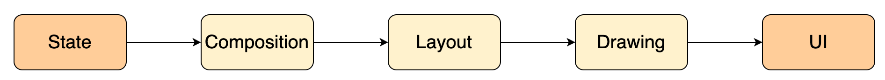

相比于传统的 Android 渲染来说，Compose 的渲染只是更抽象了 State 阶段以及多了组合阶段。前面我们看到了如何将数据(State)转换为节点，并将节点组合成一颗树的过程(Composition)，最终要变成屏幕上的可视 UI，还需要通过 Layout 与 Drawing 过程来将节点树最终渲染到屏幕上。

在 Compose  for Android 中，compose.ui 提供了渲染 UI 的能力。首先通过源码分析 Compose 页面是如何被添加到 Activity 上的。

### SetContent

Compose 页面要添加到 Activity上，可以使用 ComponentActivity 的扩展方法 setContent ，这相当于是 Compose 开发者提供的语法糖，方便将 Compose 的 UI 界面 attach 到 Activity 上。

例如我们使用 AS 的例子，会看到如下代码：

```kotlin
class MainActivity : ComponentActivity() {
    override fun onCreate(savedInstanceState: Bundle?) {
        super.onCreate(savedInstanceState)
        Mavericks.initialize(this)
        
      	// 将 Compose 添加到 Activity
        setContent {
          	// 使用 material3 的 theme
            MVILearnTheme { // A surface container using the 'background' color from the theme
                Surface(modifier = Modifier.fillMaxSize(), color = MaterialTheme.colorScheme.background) {
                    FragmentContainer()
                }
            }
        }
    }
}
```

因此，就像 runBlocking 桥接了同步异步代码一样，`setContent`桥接了传统安卓 UI 框架和 Compose 框架。其源码如下：

```kotlin
public fun ComponentActivity.setContent(
    parent: CompositionContext? = null,
    content: @Composable () -> Unit
) {
    val existingComposeView = window.decorView
        .findViewById<ViewGroup>(android.R.id.content)
        .getChildAt(0) as? ComposeView

    if (existingComposeView != null) with(existingComposeView) {
        setParentCompositionContext(parent)
        setContent(content)
    } else ComposeView(this).apply {
        // Set content and parent **before** setContentView
        // to have ComposeView create the composition on attach
        setParentCompositionContext(parent)
        setContent(content)
        // Set the view tree owners before setting the content view so that the inflation process
        // and attach listeners will see them already present
        setOwners()
        setContentView(this, DefaultActivityContentLayoutParams)
    }
}
```

上面的代码有着几个关键点：

* Compose 本质上是一个 ComposeView；
* 如果 window 的 decorView 中存在 ComposeView 的话，后续的 Compose 组件都会放到上面去；
* 在设置进入 View 之前需要把 Compose 的父组件以及当前内容都给设置进去。

setContent 方法的主要作用就是创建了一个 ComposeView ，最终还是通过调用 ComponentActivity 的 setContentView 方法来将 ComposeView attach 到 Activity 上的。

> 参考：[Compose完全脱离View系统了吗？](https://juejin.cn/post/7017811394036760612)

调用链如下：

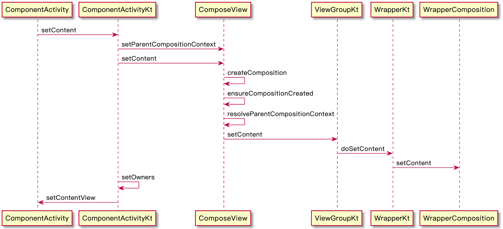

结合以上分析，Android 的一个纯 Compose 页面的页面层级大致如下：

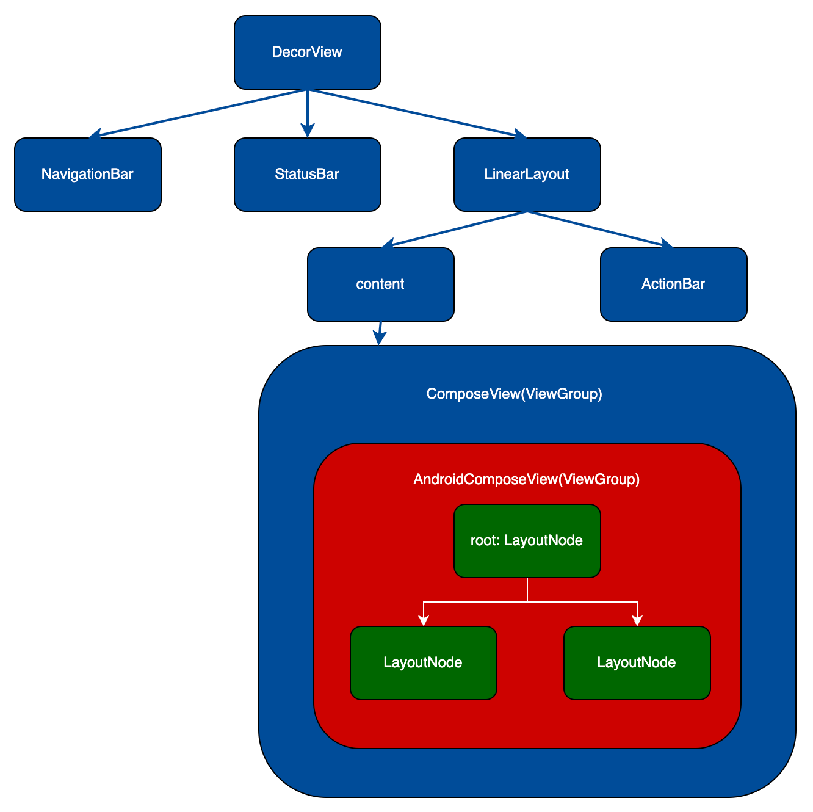

这里的 ComposeView 继承自 AbstractComposeView，是一个 ViewGroup，用于在视图层次结构中承载 Compose 内容。其 addView 相关方法只能添加一个 AndroidComposeView，不会添加其他类型的 View ，也不会添加更多的 View，并不负责 Compose 页面的具体渲染过程，而是靠 Compose 的AndroidComposeView 来实现的，布局与绘制都通过此类触发实现。

### UiApplier

我们渲染用的另一颗树——LayoutNodeTree，对其操作的方法都抽象为了 UiApplier：

```kotlin
//UiApplier.kt
internal class UiApplier(
    root: LayoutNode
) : AbstractApplier<LayoutNode>(root) {

    override fun insertTopDown(index: Int, instance: LayoutNode) {
        // Ignored
    }

    override fun insertBottomUp(index: Int, instance: LayoutNode) {
        current.insertAt(index, instance)
    }

    override fun remove(index: Int, count: Int) {
        current.removeAt(index, count)
    }

    override fun move(from: Int, to: Int, count: Int) {
        current.move(from, to, count)
    }

    override fun onClear() {
        root.removeAll()
    }

}
```

Composable 的执行过程只依赖 Applier 抽象接口，UiApplier 与 LayoutNode 只是 Android 平台的对应实现，理论上我们通过自定义 Applier 与 Node 可以打造自定义的渲染引擎。

### 布局以及绘制

与 Android View类似，Compose 的 LayoutNode 节点树显示在屏幕上也是通过 measure、layout、draw 三个步骤完成的。AndroidComposeView 实际上仍然是一个 ViewGroup，因此可以通过查看相关方法的实现，来探索 Compose 页面的布局与绘制实现。

上面提到，实际上完成绘制的是`AndroidComposeView`，因此我们看其对应的方法：

```kotlin
// AndroidComposeView#onMeasure
override fun onMeasure(widthMeasureSpec: Int, heightMeasureSpec: Int) {
    // ...
    measureAndLayoutDelegate.updateRootConstraints(constraints)
    measureAndLayoutDelegate.measureAndLayout()
    setMeasuredDimension(root.width, root.height) 
    // ...   
}

// AndroidComposeView#onDraw
// View自身绘制时会调用此方法
override fun onDraw {} /* 空方法体 */

// AndroidComposeView#onLayout    
override fun onLayout {/* ... */} /* 不涉及LayoutNode的具体layout过程代码 */
    
// AndroidComposeView#dispatchDraw    
// 绘制子View时会调用此方法
override fun dispatchDraw(canvas: android.graphics.Canvas) {
    // ...
    // 布局包括测量和放置
    measureAndLayout()
    // ...
    // Compose绘制入口
    canvasHolder.drawInto(canvas) { root.draw(this) }
    // canvasHolder 将 android.graphics.Canvas 代理成 androidx.compose.ui.graphics.Canvas,
    // 并最终传递至 LayoutNode 用于具体的绘制。
    //...
}

// AndroidComposeView#measureAndLayout
override fun measureAndLayout() {
    val rootNodeResized = measureAndLayoutDelegate.measureAndLayout()
    measureAndLayoutDelegate.dispatchOnPositionedCallbacks()
}
```

AndroidComposeView 在 onMeasure 时会通过委托 MeasureAndLayoutDelegate 的 measureAndLayout 对 LayoutNode 进行 measure 和 layout，在 dispatchDraw 时会通过 从 root 开始向下遍历它的子节点进行绘制，这里就是 LayoutNode 绘制的入口。

#### Modifier 链转为 LayoutNodeWrapper

LayoutNode 的布局和绘制都涉及到其对应的一条 LayoutNodeWrapper 链，这是通过 LayoutNode 中持有的 Modifier 引用来创建的。

> Modifier 可以理解为 Compose 的 UI 界面的修饰符，用于配置 UI 的样式和行为，类似于 xml 中的属性配置，具体可以查看 [图解 Modifier 实现原理 ，竟然如此简单! - 掘金](https://juejin.cn/post/6986933061845778446)。

在编写可组合函数时，通过传递 Modifier 参数，并最终赋值给对应的 LayoutNode 的 modifier 属性，在赋值的同时就会根据 modifier 创建当前 LayoutNode 的 LayoutNodeWrapper 链。 Modifier 的实现充分利用了 Kotlin 的语法特性。Compose 定义了一系列的 Modifier 的扩展方法，每一个扩展方法都会返回一个 Modifier 。在传递 Modifier 参数时，可以针对这些扩展方法进行有序的链式调用得到一个 Modifier 链。在最终绑定到 LayoutNode 时，使用的就是这个 Modifier 链。

在 LayoutNode 中，对这个 Modifier 进行倒序遍历，并在遍历过程中将每一个 Modifier 根据其具体的类型转换为不同的 LayoutNodeWrapper ，并添加到 LayoutNodeWrapper 链上。在 Modifier 链倒序遍历完成时，就可以得到这个 LayoutNodeWrapper 链正序遍历的起始点了。

大致伪代码逻辑如下：

```kotlin
// LayoutNode#modifier,只是描述逻辑并非实际实现
var modifier : Modifier = Modifier
    set(value) {
        // ...
        field = value
        // ...
        // foldOut 指的是对 modifier链进行倒序遍历
        val outerWrapper = modifier.foldOut(innerLayoutNodeWrapper) { mod, toWrap ->
            //...
            var wrapper = toWrap
            wrapper = when (mod) {
                // 比较的顺序是至关重要的，因为一个类可能实现多种Modifier
                is DrawModifier -> ModifiedDrawNode(wrapper, mod)
                is FocusModifier -> ModifiedFocusNode(wrapper, mod).assignChained(toWrap)
                // ...
                is LayoutModifier -> ModifiedLayoutNode(wrapper, mod).assignChained(toWrap)
                // ...
                // 注意这里只是为了阅读方便采取 when 的写法，实际不在这些类别内定义的 Modifier 是无效的
            }
            wrapper
        }
        // 与父项的LayoutNodeWrapper 关联
        outerWrapper.wrappedBy = parent?.innerLayoutNodeWrapper
        outerMeasurablePlaceable.outerWrapper = outerWrapper
    }
```

上面的第 8 行 的 innerLayoutNodeWrapper 相当于 LayoutNodeWrapper 的末尾，而对 Modifier 链倒序遍历之后转换得到的 outerWrapper 相当于 LayoutNodeWrapper 的起始点。

举个例子，假设 LayoutNode 的 modifier 参数是经过如下链式调用得到的：

```kotlin
modifier = Modifier.size(100.dp).padding(10.dp).background(Color.Blue)
```

那么最终得到的 LayoutWrapper 链以及 Modifier 链将如下所示：

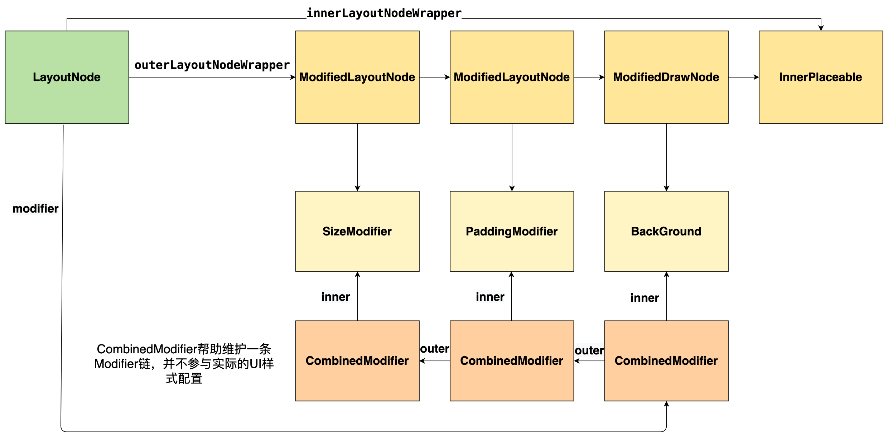

#### Measure & Layout

在布局这个过程，主要包括 测量子项 --> 确定自身尺寸 --> 放置子项 3 个阶段。

AndroidComposeView 的测量流程从  onMeasure 方法中开始，通过  root 节点来递归测量所有需要测量的 LayoutNode，每一个 LayoutNode 最终又通过自身持有的 OuterMeasurablePlaceable 引用得到最终的宽高。当测量完成，就会确定该 LayoutNode 自身所需要的尺寸，确定完自身尺寸，就可以通过 place 相关方法进行放置。具体的测量过程可以查看 [Jetpack Compose 测量流程源码分析 - 掘金](https://juejin.cn/post/6981805443219718151)。

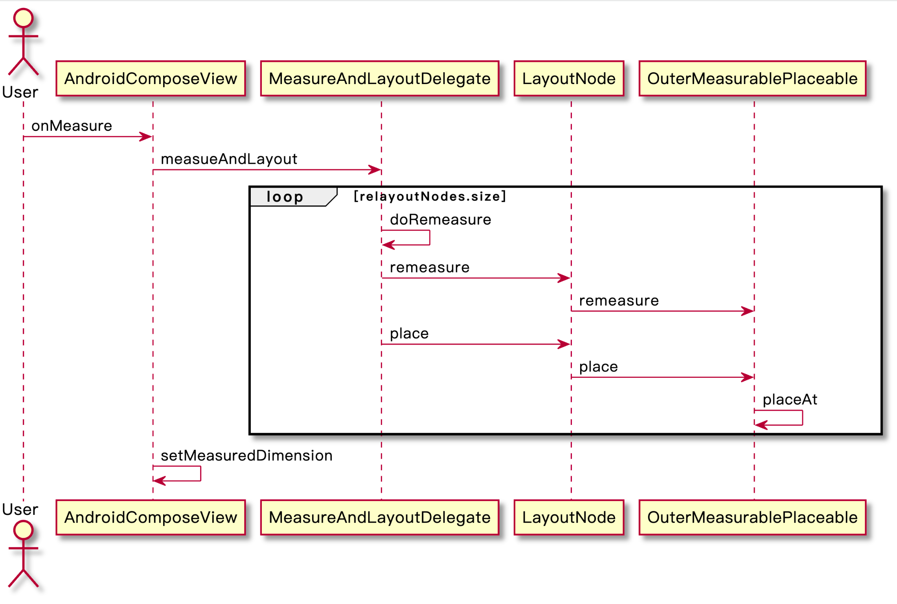

可以看到 remeasure 是关键，OuterMeasurablePlaceable 的 remeasure 方法如下：

```kotlin
// OuterMeasurablePlaceable#remeasure
fun remeasure(constraints: Constraints): Boolean {
    // ...
    // 遍历LayoutNodeWrapper链测量自身与子项
    outerWrapper.measure(constraints) 
    // ...
    // 确定自身尺寸
    measuredSize = IntSize(outerWrapper.width, outerWrapper.height)
    // ...
}
```

测量过程中，会递归遍历 LayoutNodeWrapper 链上所有的 LayoutNodeWrapper 进行各个属性测量 (调用 measure 方法)，最后会回到 LayoutNodeWrapper 链中的最后一个节点：就是链尾的 innerLayoutNodeWrapper ，实际是一个 InnerPlaceable 类型的 LayoutNodeWrapper 。然后继续测量 LayoutNode 的 children 的大小：

```kotlin
// InnerPlaceable#measure
override fun measure(constraints: Constraints): Placeable = performingMeasure(constraints) {
    val measureResult = with(layoutNode.measurePolicy) {
        // measurePolicy 定义测量策略，可以用于自定义布局
        // 这个 measurePolicy 也可以通过参数传入可组合函数，最终赋值给 LayoutNode
        layoutNode.measureScope.measure(layoutNode.children, constraints)
    }
    layoutNode.handleMeasureResult(measureResult)
    return this
}
```

我们还是以上面的例子为例：

```kotlin
modifier = Modifier.size(100.dp).padding(10.dp).background(Color.Blue)
```

调用链大致如下：

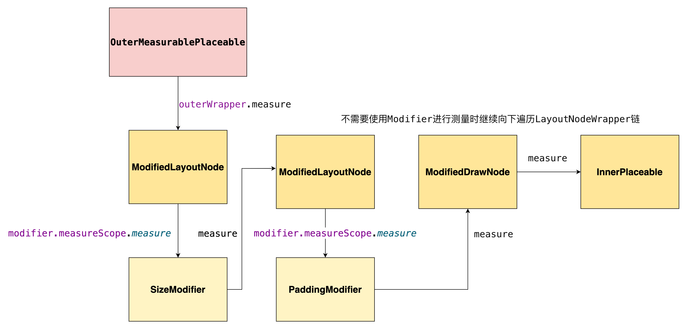

测量完成，得到尺寸后，LayoutNode 会利用得到的测量结果通过 place 相关方法来放置自身与子项：

```kotlin
// OuterMeasurablePlaceable#placeAt
override fun placeAt(
    position: IntOffset,
    zIndex: Float,
    layerBlock: (GraphicsLayerScope.() -> Unit)?
) {
    // ...
    outerWrapper.place(position, lastZIndex)
    // ...
}

// 最终会调用到每个LayoutNode的LayoutNodeWrapper链的链尾：
// InnerPlaceable 的placeAt方法
// InnerPlaceable#placeAt
override fun placeAt(
    position: IntOffset,
    zIndex: Float,
    layerBlock: (GraphicsLayerScope.() -> Unit)?
) {
    // ...
    layoutNode.onNodePlaced() // 通知LayoutNode自身放置完成
}

// LayoutNode#onNodePlaced
internal fun onNodePlaced() {
    // ...
    layoutChildren() // 放置LayoutNode的子项
}
```

#### Draw

确定好了每个 LayoutNode 的大小和位置等属性，就可以开始绘制了。

Compose 的 UI 绘制不依赖 Android UI 控件，而是完全实现了一套绘制流程，通过 LayoutNode 树完成绘制：

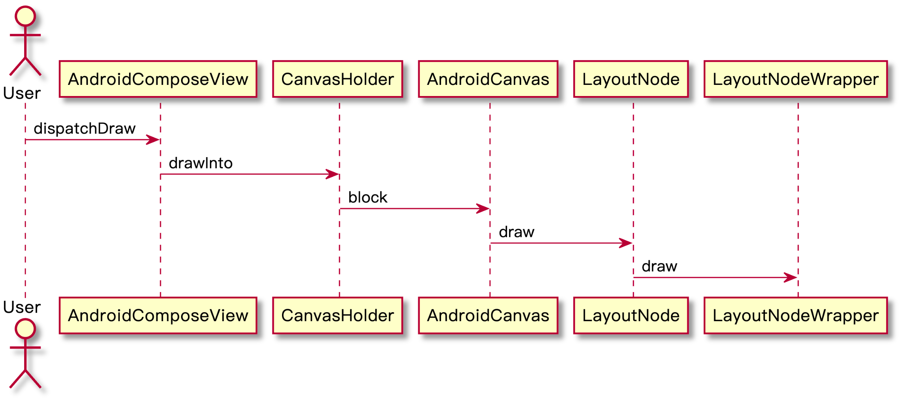

在绘制时仍然是从 AndroidComposeView 根节点开始调用 LayoutNode 的绘制方法进行绘制：

```kotlin
//LayoutNode#draw
internal fun draw(canvas: Canvas) = outerLayoutNodeWrapper.draw(canvas)
```

与测量流程类似，对于 LayoutNode 的 绘制仍然是通过 LayoutNodeWrapper 链来进行绘制的。同样从 LayoutNodeWrapper 链的起始点开始遍历，并调用 draw 方法，当在遍历过程中发现 ModifiedDrawNode 时，调用其 preformDraw 方法，并通过 DrawModifier 实现具体的绘制方法，执行完后继续向后遍历 LayoutNodeWrapper 链，直到到达 LayoutNodeWrapper 链的尾部：InnerPlaceable

```kotlin
//InnerPlaceable#performDraw
override fun performDraw(canvas: Canvas) {
    val owner = layoutNode.requireOwner()
    layoutNode.zSortedChildren.forEach { child ->
        if (child.isPlaced) {
            child.draw(canvas)
        }
    }
    if (owner.showLayoutBounds) {
        drawBorder(canvas, innerBoundsPaint)
    }
}
```

当到达当前的 LayoutNode 所对应的 LayoutNodeWrapper 链的尾部时，会继续遍历该 LayoutNode 的 children，并继续执行 draw 方法，直到所有的节点绘制完成，则最终的绘制完成。

现在，Compose 的页面已经被绘制到了屏幕上。

## 参考文档

> 尤其推荐：[探索 Jetpack Compose 内核：深入 SlotTable 系统](https://juejin.cn/post/7113736450968911908#) 以及 [Jetpack Compose - 彻底弄懂状态之remember和derivedStateOf](https://juejin.cn/post/7228959271605780540#heading-3)

1. Compose 的设计思路

[Compose From First Principles](http://intelligiblebabble.com/compose-from-first-principles/)

[Inside JetPack Compose](https://medium.com/@takahirom/inside-jetpack-compose-2e971675e55e)

[Jetpack Compose for Non UI - Tree construction and source code generation](https://arunkumar.dev/jetpack-compose-for-non-ui-tree-construction-and-code-generation/)

[对Jetpack Compose设计的初步解读与思考](https://www.jianshu.com/p/7bff0964c767)

2. Compose 的原理分析

[深入详解 Jetpack Compose | 实现原理](https://juejin.cn/post/6889797083667267598)

[Android JetPack Compose原理解析](https://juejin.cn/post/6988834798852800526)

[绘空 – 探索 Jetpack Compose 实现原理](https://juejin.cn/post/6966241418046078983)

[Introduction to the Compose Snapshot system](https://dev.to/zachklipp/introduction-to-the-compose-snapshot-system-19cn)

3. Compose 涉及到的相关概念

[Gap Buffer Data Structure - GeeksforGeeks](https://www.geeksforgeeks.org/gap-buffer-data-structure/)

[Jetpack Compose 核心组件 - Composer](https://shiro-umi.github.io/2021/05/10/JetpackCompose-Composer/)

4. Compose 的 compiler & runtime 实现

[Jetpack Compose Compilier& Runtime浅析_bigbigmajia的博客-CSDN博客](https://blog.csdn.net/bigbigmajia/article/details/119749674)

[JetPack Compose Runtime: 声明式UI的基础](https://juejin.cn/post/6976435919666544653)

[compose.runtime的samples代码](https://cs.android.com/androidx/platform/frameworks/support/+/androidx-main:compose/runtime/runtime/samples/src/main/java/androidx/compose/runtime/samples/)

5. Compose 的 ui 层实现

[Compose完全脱离View系统了吗？](https://juejin.cn/post/7017811394036760612)

[Compose UI](https://www.jianshu.com/p/062a4d1112a2)

[Jetpack Compose 测量流程源码分析 - 掘金](https://juejin.cn/post/6981805443219718151)

[Jetpack Compose UI创建布局绘制流程+原理](https://juejin.cn/post/7003606223438217223)
