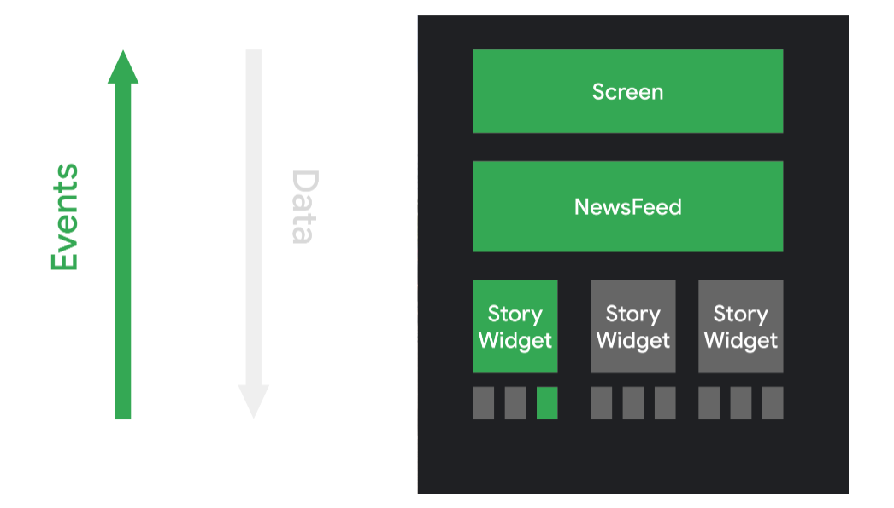

# Compose 概念

## 前言

在安卓中，19 年的时候提出了 Compose 的编程思想，而同年，SwiftUI、React 都提出了声明式 UI 编程的思想。在 21 年，jetpack compose 稳定，成为谷歌强推的安卓开发指南。

本着好奇心去了解 jetpack compose 的时候，发现谷歌对其解决关键问题以及方法给到了关键的总结在于：

1. 使用了声明式的 UI 编程 API，并且 runtime 执行了相关的加速操作，性能更好。
2. 互操作性及兼容性比较好。
3. 简化了之前 UI 组件的

因此，不难得到，如果想要学习 Compose 的关键概念，需要抓住的主线就是声明式 UI 编程。

## 声明式

说到声明式就需要说他的对头，命令式。我们通过一个例子来说明：

目标：我们计算一个字符串中，非“a”字符的其他字符的数量，我们有一个类：

```java
public static int calculateScore(String word)  {
 int score = 0;
 for(char c : word.toCharArray()) {
   score++;
 }
 return score;
}
public static int wordScore(String word)  {
 return word.length();
}
```

目标是：

```java
calculateScore("imperative") == 9     wordScore("declarative") == 9
calculateScore("no") == 2             wordScore("yes") == 3
```

这个问题中，命令式的写法是：

```java
public static int calculateScore(String word)  {
  int score = 0;
  for(char c : word.toCharArray()) {
    if(c != 'a')
      score++;
  }
  return score;
}
```

而声明式给出的解决方案是：

```java
public static String stringWithoutChar(String s, char c) {
 return s.replace(Character.toString(c), "");
}

public static int wordScore(String word)  {
 return stringWithoutChar(word, 'a').length();
}
```

其实两者看起来十分的相似，虽然都是对这个过程的描述，但是他们在阅读上面有着本质的不同：

1. 命令式更多的是在解释“how”的问题，通过过程和算法描述应该怎么完成，在上面的例子中是”如何数出非’a‘字符的其他字符的数量“
2. 而声明式是在解释“what”的问题，在上面的例子中就是”什么是非’a‘字符的其他字符的数量“

他们之间的关系很微妙，实际上，how 和 what 往往是一起合作的，how 擅长于具体的实现策略；而 what 可以作为 facade 直接暴露，提供较高的可读性。

函数式编程(FP)可以提供一些更为细致的定义，我们可以通过 FP 去进一步的了解声明式编程。在 FP 中，有着三个关键含义：

1. 纯函数。
   1. 一个函数永远只返回单个返回值。
   2. 一个函数仅基于输入计算返回值。
   3. 一个函数不会修改任何现有数据。
2. 不可变状态——所有状态数据只有新建和析构两种状态，不可修改。
3. 函数作为数据。

基于上面的定义，我们可以感受到 FP 是很难完成的，因为我们总是避免不了在函数内部去做一些额外的操作，也避免不了存储状态量简化代码。但是 FP 确实揭示了声明式 UI 最大的好处：**可以仅仅基于函数签名去安全的假设函数的作用**。

回到 Compose，一个典型风格的 widget 如下：

```kotlin
@Composable
fun Greeting(names: List<String>) {
    for (name in names) {
        Text("Hello $name")
    }
}
```

此时，我们通过`Greeting`函数来完成了 UI 的创建。相比于在 XML 中定义，此时的 UI 函数变成了一个完全动态的过程，他由一个函数声明“what”，而不是我们通过`findViewById`去指挥他“how”。widget 变成了无状态的模式，并且不提供 setter 或 getter 函数。更新界面就是函数重新调用一次，最终通过调用带有不同参数的同一可组合函数来更新界面。

这使得向架构模式（如 [`ViewModel`](https://developer.android.com/reference/androidx/lifecycle/ViewModel?hl=zh-cn)）提供状态变得很容易。然后，可组合项负责在每次可观察数据更新时将当前应用状态转换为界面。

也即每一次 UI 的更新是一个无状态的、仅基于数据层数据推送的、每次独立的更新，他们内部完全没有状态耦合和时间流画圈：


而 UI 事件则是直接往上更新数据，再由数据往下更新 UI，而不是画圈直接更改另一个 UI：



这就是 what 的好处：仅只是进行描述，实现来源于上游。