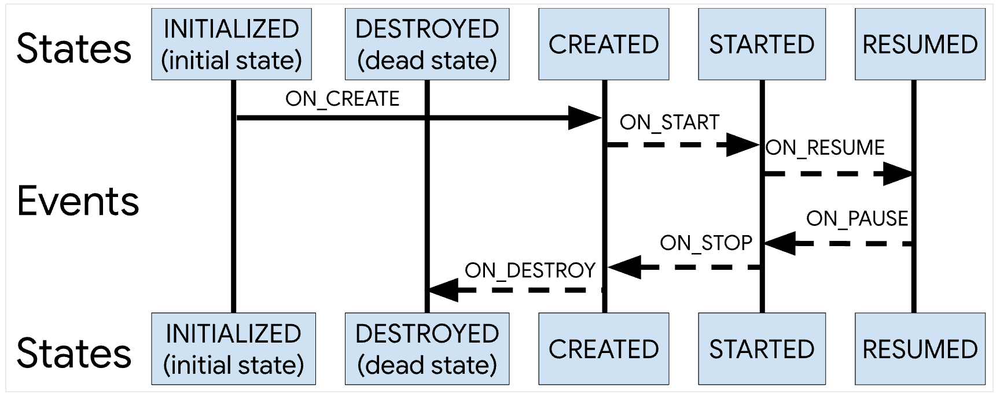

# 生命周期组件以及 ViewModel

## Lifecycle

Lifecycle提供了可用于构建生命周期感知型组件的类和接口，可以根据 Activity 或 Fragment 的当前生命周期状态自动调整其行为。**一句话：可以感知 Activity、Fragment 的生命周期**并且可以在相应的回调事件中处理。

我们使用 lifecycle 时，主要的需求是将业务代码与 Activity/Fragment 解耦，如果 onCreate 时有一大堆的逻辑全部放在 Activity/Fragment 中的话，项目会极难维护；此外就是为了给 LiveData 这个通知组件提供基建，能够抽象出一层数据层来感知生命周期并进行交互通信。lifecycle 中给到了如下的状态机：



### 基础使用

我们主要针对 activity/fragment 来进行生命周期观测，而他们二者都实现了`LifecycleOwner`接口，这个接口很简单：

```java
public interface LifecycleOwner {
    /**
     * Returns the Lifecycle of the provider.
     *
     * @return The lifecycle of the provider.
     */
    @NonNull
    Lifecycle getLifecycle();
}
```

它指明了一个类有着生命周期，例如我们可以给一个其他的类定义他自己的生命周期：

```kotlin
import android.util.Log
import androidx.lifecycle.Lifecycle
import androidx.lifecycle.LifecycleOwner
import androidx.lifecycle.LifecycleRegistry
import java.util.logging.Logger

class ClassWithLifecycle: LifecycleOwner {
    companion object {
        private const val TAG = "ClassWithLifecycle"
    }
    
    private val lifecycleRegistry: LifecycleRegistry = LifecycleRegistry(this)
    
    override val lifecycle: Lifecycle
        get() = lifecycleRegistry
    
    fun onCreate() {
      	// 注意这里我们添加了一个新的 observer，这个是最为常用的策略
      	// 但是记得 remove，防止内存泄露
        lifecycle.addObserver(ActivityLifecycleObserver())
        lifecycleRegistry.handleLifecycleEvent(Lifecycle.Event.ON_CREATE)
        Log.i(TAG, "[onCreate] state=${lifecycle.currentState}")
    }
    
    fun onResume() {
        lifecycleRegistry.handleLifecycleEvent(Lifecycle.Event.ON_RESUME)
        Log.i(TAG, "[onResume] state=${lifecycle.currentState}")
    }
    
    fun onStop() {
        lifecycleRegistry.handleLifecycleEvent(Lifecycle.Event.ON_PAUSE)
        Log.i(TAG, "[onStop] state=${lifecycle.currentState}")
    }
}
```

然后将这个类注入到 Activity 中，并在生命周期的几个阶段进行调用：

```kotlin
class MainActivity : ComponentActivity() {
		
  	// 注入我们的生命周期组件
    val classWithLifecycle = ClassWithLifecycle()

    override fun onCreate(savedInstanceState: Bundle?) {
        super.onCreate(savedInstanceState)
      	// 调用 onCreate 方法，传递 Activity 的生命周期到 ClassWithLifecycle 中
        classWithLifecycle.onCreate()
				
    }

    override fun onResume() {
        super.onResume()
      	// 一样的调用 onResume
        classWithLifecycle.onResume()
    }

    override fun onPause() {
        super.onPause()
      	// 一样
        classWithLifecycle.onStop()
    }
}
```

注意，上面还有一个关键点在于，我们还给`ClassWithLifecycle`添加了一个生命周期监听器，该监听器会根据生命周期执行我们的业务逻辑，同时它也会帮助 LiveData 传递事件信息。这个我们稍后再说。运行这个 Activity 之后我们能够从日志中看到：

```
2024-03-05 17:03:16.085  7765-7765  LifecycleObserver       com....apps.nowinandroid.demo.debug  I  [onCreate]
2024-03-05 17:03:16.085  7765-7765  ClassWithLifecycle      com....apps.nowinandroid.demo.debug  I  [onCreate] state=CREATED
2024-03-05 17:03:16.139  7765-7765  LifecycleObserver       com....apps.nowinandroid.demo.debug  I  [onResume]
2024-03-05 17:03:16.139  7765-7765  ClassWithLifecycle      com....apps.nowinandroid.demo.debug  I  [onResume] state=RESUMED
2024-03-05 17:03:20.543  7765-7765  LifecycleObserver       com....apps.nowinandroid.demo.debug  I  [onPause]
2024-03-05 17:03:20.543  7765-7765  ClassWithLifecycle      com....apps.nowinandroid.demo.debug  I  [onStop] state=STARTED
```

我们说回自定义的 Observer（可以看到日志里有他的打印），我们一般是通过继承`LifecycleObserver`接口或者类`DefaultLifecycleObserver`完成的，在以前的代码中，接口会常见一些：

```kotlin
class ActivityLifecycleObserver: LifecycleObserver {
    companion object {
        private const val TAG = "LifecycleObserver"
    }
    
	  // 使用接口来进行标记
    @OnLifecycleEvent(Lifecycle.Event.ON_CREATE)
    fun onCreate() {
        Log.i(TAG, "[onCreate]")
    }
    
    @OnLifecycleEvent(Lifecycle.Event.ON_RESUME)
    fun onResume() {
        Log.i(TAG, "[onResume]")
    }
    
    @OnLifecycleEvent(Lifecycle.Event.ON_DESTROY)
    fun onDestroy() {
        Log.i(TAG, "[onDestroy]")
    }
    
    @OnLifecycleEvent(Lifecycle.Event.ON_PAUSE)
    fun onPause() {
        Log.i(TAG, "[onPause]")
    }
}
```

但是会发现谷歌把这个类标记为了 deprecated 了，因此我们还是使用类继承更好一些：

```kotlin
class ActivityLifecycleObserver : DefaultLifecycleObserver {
    companion object {
        private const val TAG = "LifecycleObserver"
    }

    override fun onCreate(owner: LifecycleOwner) {
        Log.i(TAG, "[onCreate] ownerState=${owner.lifecycle.currentState}")
    }

    override fun onResume(owner: LifecycleOwner) {
        Log.i(TAG, "[onResume] ownerState=${owner.lifecycle.currentState}")
    }

    override fun onDestroy(owner: LifecycleOwner) {
        Log.i(TAG, "[onDestroy] ownerState=${owner.lifecycle.currentState}")
    }

    override fun onPause(owner: LifecycleOwner) {
        Log.i(TAG, "[onPause] ownerState=${owner.lifecycle.currentState}")
    }
}
```

除了这种比较业务特定的方式来添加 observer 外，我们最常用的还是直接在 Activity/Fragment 中添加 Observer：

```kotlin
open class BaseActivity : AppCompatActivity() {
    override fun onCreate(savedInstanceState: Bundle?) {
        super.onCreate(savedInstanceState)
        lifecycle.addObserver(ActivityLifecycleObserver())
    }
}
```

### 原理简介

要了解 lifeCycle 的原理很简单，注意到：

```kotlin
open class BaseActivity : AppCompatActivity() {
    override fun onCreate(savedInstanceState: Bundle?) {
        super.onCreate(savedInstanceState)
        lifecycle.addObserver(ActivityLifecycleObserver())
    }
}
```

我们使用的 Activity 都是继承自 AppCompatActivity，而他原生实现了`LifecycleOwner`，并且会分发事件，因此我们仅需要点进去看看就行：

```java
    /**
     * {@inheritDoc}
     *
     * If your ComponentActivity is annotated with {@link ContentView}, this will
     * call {@link #setContentView(int)} for you.
     */
    @Override
    protected void onCreate(@Nullable Bundle savedInstanceState) {
        // Restore the Saved State first so that it is available to
        // OnContextAvailableListener instances
        mSavedStateRegistryController.performRestore(savedInstanceState);
        mContextAwareHelper.dispatchOnContextAvailable(this);
        super.onCreate(savedInstanceState);
      	
      	// 这玩意完成的声明周期注入和分发
        ReportFragment.injectIfNeededIn(this);
        if (mContentLayoutId != 0) {
            setContentView(mContentLayoutId);
        }
    }
```

他是一个单例类：

```java
public class ReportFragment extends Fragment {
	
    @Override
    public void onActivityCreated(Bundle savedInstanceState) {
        super.onActivityCreated(savedInstanceState);
        dispatchCreate(mProcessListener);
        dispatch(Lifecycle.Event.ON_CREATE);·
    }

    @Override
    public void onStart() {
        super.onStart();
        dispatchStart(mProcessListener);
        dispatch(Lifecycle.Event.ON_START);
    }

    @Override
    public void onResume() {
        super.onResume();
        dispatchResume(mProcessListener);
        dispatch(Lifecycle.Event.ON_RESUME);
    }

    @Override
    public void onPause() {
        super.onPause();
        dispatch(Lifecycle.Event.ON_PAUSE);
    }

    @Override
    public void onStop() {
        super.onStop();
        dispatch(Lifecycle.Event.ON_STOP);
    }

    @Override
    public void onDestroy() {
        super.onDestroy();
        dispatch(Lifecycle.Event.ON_DESTROY);
        // just want to be sure that we won't leak reference to an activity
        mProcessListener = null;
    }

    private void dispatch(Lifecycle.Event event) {
        Activity activity = getActivity();
      	// 这里可以看到 activity 是类似我们手动创建 Owner 的方法来处理分发事件的
        if (activity instanceof LifecycleRegistryOwner) {
            ((LifecycleRegistryOwner) activity).getLifecycle().handleLifecycleEvent(event);
            return;
        }
				// 同上，不过就是类型不同
        if (activity instanceof LifecycleOwner) {
            Lifecycle lifecycle = ((LifecycleOwner) activity).getLifecycle();
            if (lifecycle instanceof LifecycleRegistry) {
                ((LifecycleRegistry) lifecycle).handleLifecycleEvent(event);
            }
        }
    }
}
```

从上面的代码在可以看出 ReportFragment 中的各个生命周期都调用了`dispatch(Lifecycle.Event event)` 方法，传递了不同的**Event**的值，这个就是在Activity、Fragment的各个生命周期回调时，Lifecycle 所要处理的生命周期方法。

在**dispatch(Lifecycle.Event event)**方法中最终调用了`((LifecycleRegistry) lifecycle).handleLifecycleEvent(event);`方法，我们点进去看一下：

```java
public void handleLifecycleEvent(@NonNull Lifecycle.Event event) {
    enforceMainThreadIfNeeded("handleLifecycleEvent");
    moveToState(event.getTargetState());
}

// 在这个方法中去更新状态
private void moveToState(State next) {
  if (mState == next) {
      return;
  }
  if (mState == INITIALIZED && next == DESTROYED) {
      throw new IllegalStateException("no event down from " + mState);
  }
  mState = next;
  if (mHandlingEvent || mAddingObserverCounter != 0) {
      mNewEventOccurred = true;
      // we will figure out what to do on upper level.
      return;
  }
  mHandlingEvent = true;
  sync();
  mHandlingEvent = false;
  if (mState == DESTROYED) {
      mObserverMap = new FastSafeIterableMap<>();
  }
}
```

可以看到实际处理生命周期相关状态的是`sync()`方法：

```java
private void sync() {
    LifecycleOwner lifecycleOwner = mLifecycleOwner.get();
    if (lifecycleOwner == null) {
        throw new IllegalStateException("LifecycleOwner of this LifecycleRegistry is already"
                + "garbage collected. It is too late to change lifecycle state.");
    }
    while (!isSynced()) {
        mNewEventOccurred = false;
        // no need to check eldest for nullability, because isSynced does it for us.
        if (mState.compareTo(mObserverMap.eldest().getValue().mState) < 0) {
            backwardPass(lifecycleOwner);
        }
        Map.Entry<LifecycleObserver, ObserverWithState> newest = mObserverMap.newest();
        if (!mNewEventOccurred && newest != null
                && mState.compareTo(newest.getValue().mState) > 0) {
            forwardPass(lifecycleOwner);
        }
    }
    mNewEventOccurred = false;
}
```

如果没有同步过，会比较mState当前的状态和mObserverMap中的eldest和newest的状态做对比，看是往前还是往后；比如mState由STARTED到RESUMED是状态向前，反过来就是状态向后。这个是和 Lifecycle 生命周期有关系，但不是一个东西，最上面的经典图就是描述了这个过程。

## ViewModel

ViewModel **说白了就是一个数据类，用一个容器进行了管理，其生命周期有着单独的定义**。他本质上是另一种写法的 DI，没有使用注解，而是使用的`ViewModelProvider`来获取实例。理解了这一点才能给 ViewModel 祛魅。

ViewModel 一般要配合 LiveData、DataBinding一起使用。他有着几个特点：

1. 在对应的作用域内，保正**有且仅有唯一实例**（很像 DI 的思路），保证UI组件间的通信。
2. 跟随 Activity 的生命周期，但是不是完全一致。

### 基础使用

我们就用文档里的例子，定义一个 ViewModel 就是继承一个`ViewModel()`出来即可，而继承只是为了方便管理使得他可以被直接通过反射创建并和 Activity 的生命周期进行绑定：

```kotlin
// 一个数据类，作为 ViewModel 中抽象出来的视图数据保存在 ViewModel 中
data class DiceUiState(
    val firstDieValue: Int? = null,
    val secondDieValue: Int? = null,
    val numberOfRolls: Int = 0,
)

class DiceRollViewModel : ViewModel() {

    // LiveData 或者 Flow 来通知 UI 更新。
    private val _uiState = MutableStateFlow(DiceUiState())
    val uiState: StateFlow<DiceUiState> = _uiState.asStateFlow()

    // 暴露给业务侧的更新接口，并没有什么黑魔法，就是外面摁调这个函数
    fun rollDice() {
      	// 更新数据
        _uiState.update { currentState ->
            currentState.copy(
                firstDieValue = Random.nextInt(from = 1, until = 7),
                secondDieValue = Random.nextInt(from = 1, until = 7),
                numberOfRolls = currentState.numberOfRolls + 1,
            )
        }
    }
}
```

而外部获取 ViewModel 则是通过代理模式或者`ViewModelProvider`完成：

```kotlin
class DiceRollActivity : AppCompatActivity() {

    override fun onCreate(savedInstanceState: Bundle?) {

      	// 我们可以通过代理方式完成创建
        val viewModel: DiceRollViewModel by viewModels()
      	// 也可以通过 	ViewModelProvider 完成
      	val viewModel2: DiceRollViewModel by lazy {
          	ViewModelProvider(this)[DiceRollViewModel::class.java]
        }
      	
        lifecycleScope.launch {
            repeatOnLifecycle(Lifecycle.State.STARTED) {
                viewModel.uiState.collect {
                    // Update UI elements
                }
            }
        }
    }
}
```

其实上面的两个 ViewModel 是同一个 ViewModel 实例，我们可以通过创建两个 Fragment 来更好的验证这一点：

```kotlin
class ViewModelActivity : AppCompatActivity() {
    override fun onCreate(savedInstanceState: Bundle?) {
        super.onCreate(savedInstanceState)
        setContentView(R.layout.activity_view_model)
      	
        supportFragmentManager.beginTransaction()
            .add(R.id.flContainer, FirstFragment())
            .add(R.id.flContainer, SecondFragment())
            .commit()
    }
}

class FirstFragment : Fragment() {
    private val TAG = javaClass.simpleName

    override fun onCreateView(inflater: LayoutInflater, container: ViewGroup?, savedInstanceState: Bundle?): View? {
        val diceRollViewModel = ViewModelProvider(activity as ViewModelStoreOwner)[DiceRollViewModel::class.java]
      	Log.i(TAG, "DiceRollViewModel = $diceRollViewModel")
        return super.onCreateView(inflater, container, savedInstanceState)
    }
}

class SecondFragment : Fragment() {
    private val TAG = javaClass.simpleName
    
    override fun onCreateView(inflater: LayoutInflater, container: ViewGroup?, savedInstanceState: Bundle?): View? {
        val diceRollViewModel = ViewModelProvider(activity as ViewModelStoreOwner)[DiceRollViewModel::class.java]
      	Log.i(TAG, "DiceRollViewModel = $diceRollViewModel")
        return super.onCreateView(inflater, container, savedInstanceState)
    }
}

// 输出
E/FirstFragment: DiceRollViewModel = com.example.viewmodel.DiceRollViewModel@7441321
E/SecondFragment: DiceRollViewModel = com.example.viewmodel.DiceRollViewModel@7441321
```

### 原理简介——单例化

#### Activity 存储 ViewModel 的方式

首先是需要介绍几个重要组件：

- ViewModelStoreOwner：是一个接口，用来获取一个ViewModelStore对象，我们获取 ViewModel 实例时都需要用到它。
- ViewModelStore：存储多个ViewModel，一个 ViewModelStore 的拥有者(实际上就是 Activity)在配置改变，重建的时候，依然会有这个实例
- ViewModelProvider：用于获取或者创建一个 ViewModel 的实例，(实际上在给定的 ViewModelStoreOwner 中存储了 ViewModel)

然后还是需要看一下官网中的经典图：


在上面的代码中，我们获取 ViewModel 的时候是这样的：

```kotlin
val viewModel2: DiceRollViewModel by lazy {
    ViewModelProvider(this)[DiceRollViewModel::class.java]
}
```

其中给`ViewModelProvider`传了个 Activity，点开源码可以看到：

```java
public class ComponentActivity extends androidx.core.app.ComponentActivity implements
        ContextAware,
				// 生命周期在这里
        LifecycleOwner,
				// ViewModel 在这里
        ViewModelStoreOwner,
        HasDefaultViewModelProviderFactory,
        SavedStateRegistryOwner,
        OnBackPressedDispatcherOwner,
        ActivityResultRegistryOwner,
        ActivityResultCaller,
        OnConfigurationChangedProvider,
        OnTrimMemoryProvider,
        OnNewIntentProvider,
        OnMultiWindowModeChangedProvider,
        OnPictureInPictureModeChangedProvider,
        MenuHost,
        FullyDrawnReporterOwner
```

实际上 Activity 早已经实现了对应的接口，这也是为什么它能够帮助我们管理 ViewModel 的关键。而该接口也比较简单，仅包含一个方法：

```java
public interface ViewModelStoreOwner {

    @NonNull
    ViewModelStore getViewModelStore();
}
```

顺着这个接口我们就能看到 ViewModel 的创建过程了：

```java
public ViewModelStore getViewModelStore() {
    if (getApplication() == null) {
        throw new IllegalStateException("Your activity is not yet attached to the "
                + "Application instance. You can't request ViewModel before onCreate call.");
    }
  	// 1. 如果存在 App 的时候创建一个 ViewModelStore
    ensureViewModelStore();
    return mViewModelStore;
}

void ensureViewModelStore() {
  if (mViewModelStore == null) {
    	// 2. LastNonConfigurationInstance 是在 onCreate 和 onStart 之后才会存在
    	//    实际上是获取到一个之前的 Activity 的数据，这也是为什么旋转屏幕之后，ViewModel 数据还存在的原因，
    	//	  因为实际上有过一个存储。适用于任何配置变更的变化。
      NonConfigurationInstances nc =
              (NonConfigurationInstances) getLastNonConfigurationInstance();
      if (nc != null) {
          // Restore the ViewModelStore from NonConfigurationInstances
          mViewModelStore = nc.viewModelStore;
      }
    	// 3. 这个才是真正的初始化 Store
      if (mViewModelStore == null) {
          mViewModelStore = new ViewModelStore();
      }
  }
}


// 4. ViewModelStore 很简单
public class ViewModelStore {
		
  	// 5. 通过一个 Map 来做了缓存，ViewModel 实例保存在里面
    private final HashMap<String, ViewModel> mMap = new HashMap<>();

    final void put(String key, ViewModel viewModel) {
        ViewModel oldViewModel = mMap.put(key, viewModel);
        if (oldViewModel != null) {
            oldViewModel.onCleared();
        }
    }

    final ViewModel get(String key) {
        return mMap.get(key);
    }

    Set<String> keys() {
        return new HashSet<>(mMap.keySet());
    }

    /**
     *  Clears internal storage and notifies ViewModels that they are no longer used.
     */
    public final void clear() {
        for (ViewModel vm : mMap.values()) {
            vm.clear();
        }
        mMap.clear();
    }
}
```

从上面的代码中我们知道了几个核心信息：

1. mViewModelStore 实际上存储在了 NonConfigurationInstances 中。
2. ViewModelStore 本质上就是一个 Map。

那么下一个问题是，NonConfigurationInstances 如何实现了一个跨 Activity 的传统生命周期的 Scope，这个问题也不难解答。首先是NonConfigurationInstances 他作为一个静态类存储在 Activity 中，在将 Activity attach 上窗口时进行创建：

```java
final void attach(Context context, ActivityThread aThread,
        Instrumentation instr, IBinder token, int ident,
        Application application, Intent intent, ActivityInfo info,
        CharSequence title, Activity parent, String id,
        NonConfigurationInstances lastNonConfigurationInstances,
        Configuration config, String referrer, IVoiceInteractor voiceInteractor,
        Window window, ActivityConfigCallback activityConfigCallback, IBinder assistToken,
        IBinder shareableActivityToken) {
    attachBaseContext(context);

    // ...
  	// 这里初始化的
    mLastNonConfigurationInstances = lastNonConfigurationInstances;
		// ...
    setContentCaptureOptions(application.getContentCaptureOptions());
}
```

其在`onRetainNonConfigurationInstance`进行存储：

```java
public final Object onRetainNonConfigurationInstance() {
    // Maintain backward compatibility.
    Object custom = onRetainCustomNonConfigurationInstance();

    ViewModelStore viewModelStore = mViewModelStore;
    if (viewModelStore == null) {
        // No one called getViewModelStore(), so see if there was an existing
        // ViewModelStore from our last NonConfigurationInstance
      	// 1. 这里的意思是没有初始化过 viewModelStore，可以看上面的初始化方法。
        NonConfigurationInstances nc =
                (NonConfigurationInstances) getLastNonConfigurationInstance();
        if (nc != null) {
            viewModelStore = nc.viewModelStore;
        }
    }

    if (viewModelStore == null && custom == null) {
        return null;
    }
		
  	// 2. 将 viewModelStore 保存起来，此时所有的 ViewModel 就交付给 NonConfigurationInstances 管理生命周期了
  	//    这个方法会在每次配置变化的时候调用，给存储一份
    NonConfigurationInstances nci = new NonConfigurationInstances();
    nci.custom = custom;
    nci.viewModelStore = viewModelStore;
    return nci;
}
```

上面代码也很清晰，实际上就是配置变化的时候，new 了一个 NonConfigurationInstances 存储 ViewModelStore，而存储一个 `mLastNonConfigurationInstances`**在这里**(他还存了其他的)的原因是为了获取到上一次保存的 ViewModelStore。

在这里我们也能想明白为什么``ensureViewModelStore`命名为 ensure 了：因为实际上 ViewModelStore 在每次 Retain 的时候都会存储在父类的`mLastNonConfigurationInstances`中，但是子类的`mViewModelStore`只有在 ensure 之后才会正确获取到值；如果没有 ensure 的话，Retain 时就需要去父类的`mLastNonConfigurationInstances`中拿。

至于图上的为什么 ViewModelStore 是在 destroy 之后才被 clear 掉就没法在应用层去看了。我们可以知道的是，父类的`mLastNonConfigurationInstances`是在`performResume`中置空的，而 Finish 之后也会调用他。

#### 如何创建以及获取到 ViewModel

在上面我们知道问题的关键在于 ViewModelStore 以及 Activity，以及其接口 ViewModelProvider，我们就顺着这条线看就行。首先 ViewModelProvider 只是一个 Util 类，在上面的使用中，我们每次使用的时候给他创建一下。他的核心方法为下面三个：

```java
// ViewModelProvider(this) 构造方法
// 注意，ViewModel 的实例化用了 defaultFactory 实现，owner 其实就是 Activity，也即实现了 ViewModelStoreOwner 接口
public constructor(
    owner: ViewModelStoreOwner
) : this(owner.viewModelStore, defaultFactory(owner), defaultCreationExtras(owner))


// ViewModelProvider(this)[DiceRollViewModel::class.java] 中的 get 方法
public open operator fun <T : ViewModel> get(modelClass: Class<T>): T {
    val canonicalName = modelClass.canonicalName
        ?: throw IllegalArgumentException("Local and anonymous classes can not be ViewModels")
    return get("$DEFAULT_KEY:$canonicalName", modelClass)
}

// 实际执行：
public open operator fun <T : ViewModel> get(key: String, modelClass: Class<T>): T {
  	// 1. 尝试从 Activity 中的 ViewModeSore 中去拿
    var viewModel = store[key]
    if (modelClass.isInstance(viewModel)) {
        (factory as? OnRequeryFactory)?.onRequery(viewModel)
        return viewModel as T
    } else {
        @Suppress("ControlFlowWithEmptyBody")
        if (viewModel != null) {
            // TODO: log a warning.
        }
    }
  	
  	// 2. 拿不到的时候通过 factory 去创建
    viewModel = if (factory is KeyedFactory) {
        factory.create(key, modelClass)
    } else {
        factory.create(modelClass)
    }
    store.put(key, viewModel)
    return viewModel
}

// 最后 defaultFactory 通过反射创建(注意是在)：
public open class NewInstanceFactory : Factory {
    @Suppress("DocumentExceptions")
    override fun <T : ViewModel> create(modelClass: Class<T>): T {
        return try {
          	// 反射
            modelClass.getDeclaredConstructor().newInstance()
        } catch (e: NoSuchMethodException) {
            throw RuntimeException("Cannot create an instance of $modelClass", e)
        } catch (e: InstantiationException) {
            throw RuntimeException("Cannot create an instance of $modelClass", e)
        } catch (e: IllegalAccessException) {
            throw RuntimeException("Cannot create an instance of $modelClass", e)
        }
    }

}
```

### 进阶使用

#### ViewModel 传入外部数据

通过上面的源码我们知道 ViewModel 创建时默认就是通过反射调用初始化方法，**此时是无法传入参数的**。现在有个需求就是：

* 我们期望 ViewModel 能够访问数据源和网域源。

ViewModelProvider 做了一层 Factory 的封装，这层封装使得我们可以自定义 Factory，使得 ViewModel 按照我们的需求去自定义的创建，也即如下创建接口：

```kotlin
public constructor(owner: ViewModelStoreOwner, factory: Factory) : this(
    owner.viewModelStore,
    factory,
    defaultCreationExtras(owner)
)
```

我们可以传入一个自定义的 Factory 来定义我们的 ViewModel，例如我们需要这个一个数据类，他包含 savedStateHandle 这个用于访问 bundle 的参数，以及访问数据层的引用参数 dataSource 和网络仓 myRepository：

```kotlin
class MyViewModel(
    private val myRepository: XXXRepository,
    private val savedStateHandle: SavedStateHandle,
  	private val dataSource: XXXDataSource
) : ViewModel() {
    // ViewModel logic

    // Define ViewModel factory in a companion object
    internal class Factory(
        private val savedStateHandle: SavedStateHandle,
        val dataSource: XXXDataSource,
      	val myRepository: MyRepository
    ): ViewModelProvider.Factory {
        override fun <T : ViewModel> create(modelClass: Class<T>): T {
            val viewModel =
                MyViewModel(myRepository, savedStateHandle, dataSource)
            return viewModel as T
        }
    }
}
```

此时外部创建这个 ViewModel 的时候就可以通过传入这个 Factory 来完成创建：

```kotlin
ViewModelProvider(
    activity, MyViewModel.Factory(
        myRepository, savedStateHandle, dataSource
    )
).get(MyViewModel::class.java)
```

可以看到，此时我们完成了想要 ViewModel **访问到某些数据的诉求**。

#### 通过 Extra 参数获取一些 APP 信息

在上面的 Factory 中我们获取到了业务的数据。安卓还通过 extras 参数为我们提供了一些获取 APP 信息的办法：

```kotlin
class MyViewModel(private val savedStateHandle: SavedStateHandle): ViewModel() {
    companion object {

        val Factory: ViewModelProvider.Factory = object : ViewModelProvider.Factory {
            @Suppress("UNCHECKED_CAST")
            override fun <T : ViewModel> create(
                modelClass: Class<T>,
                extras: CreationExtras
            ): T {
                // 从 extras 获取 app 对象
                val application = checkNotNull(extras[APPLICATION_KEY])
                // 从 extras 中创建 SavedStateHandle 对象
                val savedStateHandle = extras.createSavedStateHandle()
								
              	// 构造持有以上两个对象的 ViewModel
                return MyViewModel(
                    savedStateHandle
                ) as T
            }
        }
    }
}

// 外部创建
ViewModelProvider(this, MyViewModel.Factory).get(MyViewModel::class.java)
```

extras 信息包含以下几类：


#### scope 的使用

作用域是有效使用 ViewModel 的关键。每个 ViewModel 的作用域都限定为一个实现 [`ViewModelStoreOwner`](https://developer.android.com/reference/androidx/lifecycle/ViewModelStoreOwner?hl=zh-cn) 接口的对象(在上面所有例子中，这个对象是 Activity)。

除了 Activity 外，Fragment 也可以是作用域范围：

```kotlin
import androidx.activity.viewModels

class MyActivity : AppCompatActivity() {
    // ViewModel API available in activity.activity-ktx
    // The ViewModel is scoped to `this` Activity
    val viewModel: MyViewModel by viewModels()
}

import androidx.fragment.app.viewModels

class MyFragment : Fragment() {
    // ViewModel API available in fragment.fragment-ktx
    // The ViewModel is scoped to `this` Fragment
    val viewModel: MyViewModel by viewModels()
}
```

当然，我们也可以将作用域限定为任何 ViewModelStoreOwne，例如获取 Fragment 父亲 View：

```kotlin
import androidx.fragment.app.viewModels

class MyFragment : Fragment() {

    // ViewModel API available in fragment.fragment-ktx
    // The ViewModel is scoped to the parent of `this` Fragment
  	// 获取 Fragment 的父亲 Fragment 的
    val viewModel: SharedViewModel by viewModels(
        ownerProducer = { requireParentFragment() }
    )
  	
  	// ViewModel API available in fragment.fragment-ktx
    // The ViewModel is scoped to the host Activity
  	// 也可以直接获取到 Activity 的
    val viewModel: SharedViewModel by activityViewModels()
}
```

> **注意**：如果使用的是 Hilt 和 Jetpack Compose，需要将 `viewModel()` 调用替换为 `hiltViewModel()`（如 [Compose + Hilt 文档](https://developer.android.com/jetpack/compose/libraries?hl=zh-cn#hilt)中所述）。

最后，导航图也可以：

```kotlin
import androidx.navigation.navGraphViewModels

class MyFragment : Fragment() {

    // ViewModel API available in navigation.navigation-fragment
    // The ViewModel is scoped to the `nav_graph` Navigation graph
    val viewModel: SharedViewModel by navGraphViewModels(R.id.nav_graph)

    // Equivalent navGraphViewModels code using the viewModels API
    val viewModel: SharedViewModel by viewModels(
        { findNavController().getBackStackEntry(R.id.nav_graph) }
    )
}

// 除了 Jetpack Navigation 之外，您还使用 Hilt，则可以使用 hiltNavGraphViewModels(graphId) API
import androidx.hilt.navigation.fragment.hiltNavGraphViewModels

class MyFragment : Fragment() {

    // ViewModel API available in hilt.hilt-navigation-fragment
    // The ViewModel is scoped to the `nav_graph` Navigation graph
    // and is provided using the Hilt-generated ViewModel factory
    val viewModel: SharedViewModel by hiltNavGraphViewModels(R.id.nav_graph)
}
```

#### 进程结束仍然能够保存——SavedStateHandle

参考[官方文档](https://developer.android.com/topic/libraries/architecture/viewmodel/viewmodel-savedstate?hl=zh-cn)