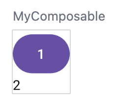
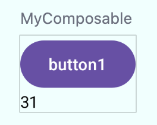
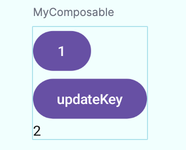
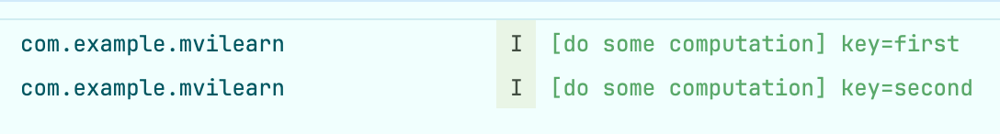
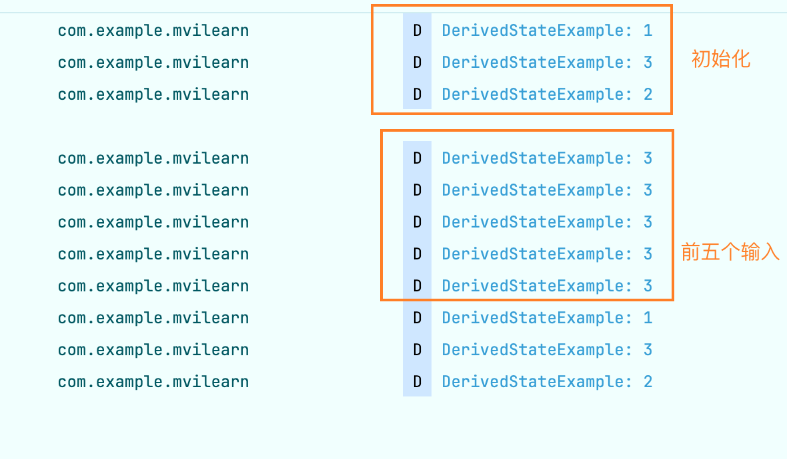

## 状态基础使用

### 无参数 remeber ———— 默认只计算一次

在使用 Compose 的 State 的时候，我们一般都会使用 remeber 使得状态可以保存在某个状态提升(将 View 的内部状态在外面包一层)的位置，然后通过一个`State`对象来将其进行注册到 slotTable 中，使得 Compose 能够感知到其变化并进行重组。一般来说，上面的流程我们可以抽象为以下的代码：

```kotlin
data class MyState(var state1: String, var state2: Int)

val myState = MyState("1", 2)

const val TAG = "MyCompose"

@Preview
@Composable
fun MyComposable() {
    var state by remember { 
      Log.i(TAG, "[do some computation]")
      mutableStateOf(myState) 
    }

    SmallView(state = state) {
        // 可以生效，Compose 能感知到 state 本身的变化
        state = MyState("button1", 31)

        // 无法生效，Compose 感知不到内部字段的变化
        myState.state1 = "button"
        myState.state2 = 3
    }
    
}

@Composable
fun SmallView(state: MyState, reducer: () -> Unit) {
    Column { 
        Button(onClick = reducer) {
            Text(text = state.state1)
        }
        Text(text = state.state2.toString())
    }
}
```


在点击按钮之后会从以下左图变为右图：



然后，我们发现，虽然可以多次点击，但实际上只有 Compose 第一次被组合出来的时候调用了 log：
```kotlin
[do some computation]
```

### 有参数的 remeber ———— 每次 key 改变均会执行

我们简单修改下上面的例子：

```kotlin
data class MyState(var state1: String, var state2: Int)

val myState = MyState("1", 2)

const val TAG = "MyCompose"

// 新增一个全局变量，用来看点击了几次
var data = 1
// key 的记录
var key = "first"

@Preview
@Composable
fun MyComposable() {
    var state by remember(key1 = key) {
        Log.i(TAG, "[do some computation] key=$key")
        mutableStateOf(myState)
    }

    SmallView(state = state) {
        // 可以生效，Compose 能感知到 state 本身的变化
        data += 1
        state = MyState("button1", data)

        // 无法生效，Compose 感知不到内部字段的变化
        myState.state1 = "button"
        myState.state2 = 3
    }
    
}

@Composable
fun SmallView(state: MyState, reducer: () -> Unit) {
    Column {
        Button(onClick = reducer) {
            Text(text = state.state1)
        }
      	// 用于更新 key
        Button(onClick = {
            key = "second"
        }) {
            Text(text = "updateKey")
        }
        Text(text = state.state2.toString())
    }
}
```

上面的 UI 渲染出来如下：



我们按照下面的步骤来：

1. 启动应用，此时打印第一条日志；
2. 点击上面的按钮，按钮更新，此时不显示日志，也即没有进行计算；
3. 点击下面的按钮，key 更新，此时不显示日志，也即没有进行计算；
4. 再次点击上面的按钮，**此时显示第二条日志**。



这个过程中可以看出，remeber 中的复杂计算逻辑执行时需要 key 变化才行。而且关键点在于，因为 button2 是没有 state 的，实际上没有触发重组，因此需要再次点击 button1 来触发重组时， lambda 才会执行。

## remeber 原理简谈

remeber 很简单：

```kotlin
// 无参 remeber
@Composable
inline fun <T> remember(calculation: @DisallowComposableCalls () -> T): T =
    currentComposer.cache(false, calculation)

// 带参 remeber
@Composable
inline fun <T> remember(
    key1: Any?,
    calculation: @DisallowComposableCalls () -> T
): T {
    return currentComposer.cache(currentComposer.changed(key1), calculation)
}
```

他本质上是通过 cache 方法，记录了一条 change 到 slotTable 中，在必要的时候进行计算。关键点在于什么时候，传入的 calculation 需要被重新计算。我们继续看 cache 方法：

```kotlin
inline fun <T> Composer.cache(invalid: Boolean, block: () -> T): T {
    @Suppress("UNCHECKED_CAST")
  	// rememberedValue 是从 slotTable 中拿出原本存储的对应 key 的 value
    return rememberedValue().let {
      	// 仅有 invalid 为 true 或者是之前没有存储过对应的 value 的情况下，才计算 lambda
        if (invalid || it === Composer.Empty) {
            val value = block()
          	// 更新值到 slotTable 中
            updateRememberedValue(value)
            value
        } else it
    } as T
}
```

cache 的第一个参数 invalid 代表目前记住(remember)的 state 是否无效。

- **如果是无 key 的remember，则不会无效**，invalid 直接传入 false。
- **如果是有 key 的 remember，则会先调用 Composer#changed 去比较 key 是否变化，若变化了，则无效**。

这就是 compose 所说的仅在必要时刻进行计算的原因。而具体的修改会被作为一个 Change 抽象放入 Change 队列，使得在下次重组完毕的时候可以被完全重新执行。了解了这一点之后，我们可以看下无参和有参 remeber 的关键不同的方法——changed：

```kotlin
@ComposeCompilerApi
override fun changed(value: Any?): Boolean {
    return if (nextSlot() != value) {
        updateValue(value)
        true
    } else {
        false
    }
}
```

这里的 nextSlot 比较有意思，因为 Slot 的顺序是在我们可以读到的方法的顺序基础上构建的，slot 的查找顺序也是如此。因此不论 remeber 怎么写，其 slot 的位置刚好的就是下一个位置，就像打点器一样。

在取到缓存 key 对应的 value 后进行比对，如果值没发生变化，返回 false，否则调用 updateValue，记录一条 change，在组合后的 applyChanges 阶段将新值更新到 SlotTable。因此，实际上，我们想要 lambda 多次执行只有通过改变其 key 来完成。

### remeber 的使用范式

在使用 remeber 时，需要抓住**状态向下，事件向上**，对于一个 UI 组件来说，其最好是无状态的。如果必须有状态，则应该使用状态提升的方式包一层。我们以官方提供的 LazyColumn 为例，它提供了一个状态类 LazyListState 来给我们处理滚动相关的需求，同时给我们提供了rememberLazyListState方法来生成这个State。典型的使用方式如下：

```kotlin
//LazyColumn的rememberLazyListState示例
val colors = listOf(Color.Cyan, Color.Gray, Color.Red, Color.Blue, Color.Yellow, Color.Green)

// 一个持有状态的组件
@Composable
fun RememberExample() {
    Box(modifier = Modifier.fillMaxSize()) {
        val lazyColumnState = rememberLazyListState()
        val coroutineScope = rememberCoroutineScope()
				
      	// 一个无状态的自定义组件
        LazyColumn(
            state = lazyColumnState,
            horizontalAlignment = Alignment.CenterHorizontally,
            modifier = Modifier.fillMaxSize()
        ) {
            items(50) {
                Card(
                    modifier = Modifier.padding(vertical = 10.dp),
                    backgroundColor = colors[it % colors.size]
                ) {
                    Text("PTQ is Power", Modifier.size(20.dp))
                }
            }
        }

        Button(modifier = Modifier
            .align(Alignment.BottomCenter)
            .padding(bottom = 20.dp),
            onClick = {
                coroutineScope.launch {
                    lazyColumnState.animateScrollToItem(0)
                }
            }) {
            Text(text = "滚动到顶部")
        }
    }
}
```

我们比较常使用的 UI 都是如上一样一层一层包出来的，需要做的就是将 State 放在（上升到）其 UI 子树能放置的最大根节点，这样可以尽可能的让最多的组件呈现无状态且可单测的形式。

另外，如果需要进行重计算 remeber lambda 块的话，我们也可以看官方的例子：

```kotlin
//使用key的remember
@Composable
fun BackgroundBanner(
   @DrawableRes avatarRes: Int,
   modifier: Modifier = Modifier,
   res: Resources = LocalContext.current.resources
) {
   val brush = remember(key1 = avatarRes) {
       ShaderBrush(
           BitmapShader(
               ImageBitmap.imageResource(res, avatarRes).asAndroidBitmap(),
               Shader.TileMode.REPEAT,
               Shader.TileMode.REPEAT
           )
       )
   }

   Box(
       modifier = modifier.background(brush)
   ) {
       // ...
   }
}
```

以上代码用一张背景图创建并缓存了一个 Brush，仅有传入的 avatarRes 变化时，ShaderBrush 才会重计算。这本质上也是 liveData 的思路。

## derivedStateOf

derivedStateOf 表征一种衍生的状态，也即其状态不是一个单一的变量就可以表示的，而是可能受其他状态影响导出。类似于 flow 的流操作。其方法签名如下：

```kotlin
fun <T> derivedStateOf(calculation: () -> T): State<T>
```

我们再看下 remeber 的签名：

```kotlin
@Composable
inline fun <T> remember(key1: Any?, calculation: @DisallowComposableCalls () -> T): T
```

可以看到二者最大的差别在于：

* remeber 返回的直接是数据，而 derivedStateOf 返回的是一个包裹了数据 T 的 State 类。

该 state 的主要作用为优化 Compose 重组部分，尽可能少的重组。

### 例子一：

> 这个例子参考：[Jetpack Compose - 彻底弄懂状态之remember和derivedStateOf](https://juejin.cn/post/7228959271605780540#heading-10)

这是一个简单的输入框，我们期望：

* 输入数字的时候，对输入框进行重组；
* 只有输入数字大于 6 的时候，才会对

```kotlin
@Preview
@Composable
fun DerivedStateExample1() {
    // 这里的 input 是一个 State<String> 类型，而不再是通过 by 得到的 String 类型
    val input = remember {
        mutableStateOf("")
    }

    // 这里返回的是 State<Boolean> 类型
    val enabled = remember {
        derivedStateOf {
            input.value.length >= 6
        }
    }

    Log.d(TAG, "DerivedStateExample: 1")

    Column(
        horizontalAlignment = Alignment.CenterHorizontally,
        modifier = Modifier.fillMaxSize(),
        verticalArrangement = Arrangement.Center
    ) {
        DerivedStateExampleInner(input = input, onUserInput = {
            input.value = it
        })

        Spacer(modifier = Modifier.height(height = 10.dp))

        Log.d(TAG, "DerivedStateExample: 2")

        Button(
            onClick = { /*TODO*/ },
            enabled = enabled.value
        ) {
            Text("登录")
        }
    }
}

@Composable
fun DerivedStateExampleInner(input: State<String>, onUserInput: (String) -> Unit) {
    Log.d(TAG, "DerivedStateExample: 3")
    TextField(
        value = input.value,
        onValueChange = onUserInput)
}
```

日志打印：



这个例子下可以将 enable 和 input 进行对比。

* enable 是一个条件触发的 State，观测他的 Compose 也仅在条件完成时才能观测到，**这可以辅助我们节约性能**。
* input 这种传统的 State 仅仅是在状态变化就会抛出，这会导致更新较为频繁，但是大多数情况下没啥问题。

### 例子二

更合适的例子是[官方例子](https://developer.android.com/develop/ui/compose/side-effects?hl=zh-cn#derivedstateof)

> 以及解释：当<u>可组合项输入的变化频率超过您需要的重组频率时</u>，就应该使用 [`derivedStateOf`](https://developer.android.com/reference/kotlin/androidx/compose/runtime/package-summary?hl=zh-cn#derivedStateOf(kotlin.Function0)) 函数。这种情况通常是指，某些内容（例如滚动位置）频繁变化，但可组合项只有在超过某个阈值时才需要对其做出响应。`derivedStateOf` 会创建一个新的 Compose 状态对象，您可以观察到该对象只会按照您的需要进行更新。这样，它的作用就与 Kotlin Flow [`distinctUntilChanged()`](https://kotlinlang.org/api/kotlinx.coroutines/kotlinx-coroutines-core/kotlinx.coroutines.flow/distinct-until-changed.html#:~:text=Returns flow where all subsequent,a StateFlow has no effect.) 运算符类似。

```kotlin
@Preview
@Composable
fun DerivedStateExample() {
    val state = rememberLazyListState()

    val currentGroup by remember {
        derivedStateOf {
            state.firstVisibleItemIndex / 50
        }
    }

    LazyColumn(
        state = state,
        modifier = Modifier.fillMaxSize(),
        horizontalAlignment = Alignment.CenterHorizontally
    ) {
        items(200) {
            Text(
                text = it.toString(),
                Modifier
                    .fillMaxWidth()
                    .padding(10.dp)
                    .background(Color.Yellow),
                textAlign = TextAlign.Center
            )
        }
    }

    ManyContents(current = currentGroup)
}

@Composable
fun ManyContents(current: Int) {
    Log.d(TAG, "DerivedStateExampleInner: aaa")
    Text(text = current.toString())
}
```

一个很长的列表，需要更新某些数据，例如上面的页数，他不是一个每次都需要计算和渲染的数据，此时就可以使用`derivedStateOf`优化。
