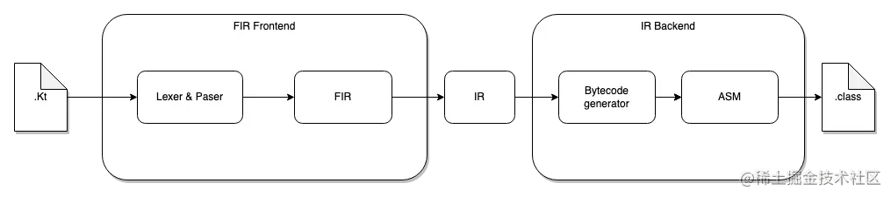
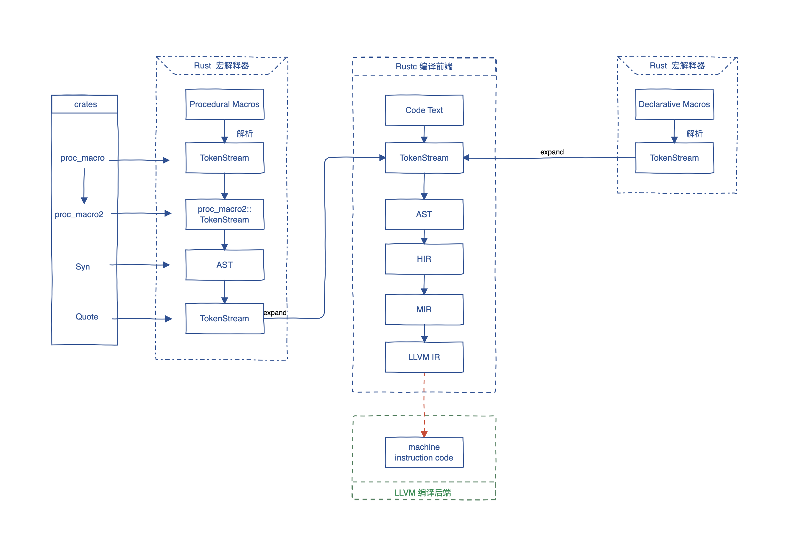

## Kotlin

Kotlin 编译器以及 KCP 可以参考这篇文档：https://juejin.cn/post/7153076275207208991

其主要流程为：

> Kotlin 编译器后端不仅仅支持 Java 字节码，还支持 JS 代码以及 LLVM 机器码

## Rust

Rust 编译器可以参考这两篇文档：

* https://rustmagazine.github.io/rust_magazine_2021/chapter_1/rustc_part1.html
* https://rustcrustc.github.io/rustc-dev-guide-zh/overview.html

Rust 编译器主要就是编译为 LLVM 机器码，流程如下：

## KCP

写一个 KCP 的官方例子：https://resources.jetbrains.com/storage/products/kotlinconf2018/slides/5_Writing%20Your%20First%20Kotlin%20Compiler%20Plugin.pdf

No-arg KCP 的使用文档：https://kotlinlang.org/docs/no-arg-plugin.html

No-arg KCP 的源码：https://cs.android.com/android-studio/kotlin/+/master:plugins/noarg/noarg.k2/build.gradle.kts