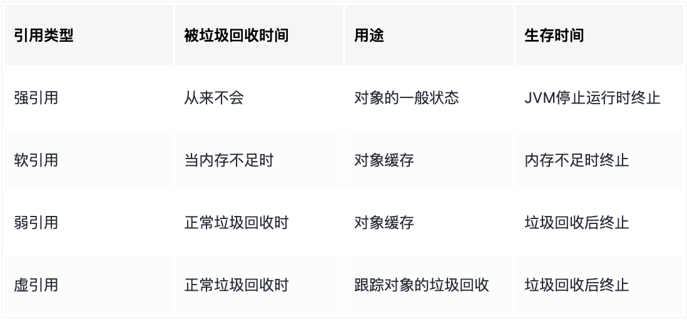

# 反射

## 背景及基本概念

我们平时写的 .java 代码，会被编译成 .class 文件，然后被 JVM 加载，这时我们的代码就处于运行时了，假如我们定义了一个类 People 的对象 people，到运行时就能获取 People这 个类的一些信息了。而保存这些信息的类就是我们非常熟悉的 Class 类了。

反射的主要作用就是在运行时通过 Class 类去获取到一些类的信息，例如属性、构造方法等。

> 为什么我们需要反射呢？
>
> 举个很常见的例子，那就是序列化库，假如你开发了一个序列化库 XXJSON，对于库开发者来说肯定是不能保证别人会把 json 转成啥类型的，所以只有在运行时拿到别人想转换的类型 A，然后获取类型 A 中有哪些属性，才可以进行转换，这时就可以使用反射来实现。
>
> 这个序列化库的思想在很多 Java 框架中都有，就是灵活配置的思想，你只需要传入特定的类型或者在 XML 中定义特定的类型，在运行时再由这个库对它进行处理。

Kotlin 也是编译成字节码在 JVM 中运行，但是作为 Java 的超集，Kotlin 又优化且开发了新的反射内容。在 Kotlin 中，我们完全可以使用 Java 的反射以及 API，也可以使用 Kotlin 新加的库，里面新增了一些 API，这些 API 实现的功能完全包含了 Java 反射 API 实现的功能，但是也有一些独特的 Kotlin 功能，比如可空类型、是否是数据类这种。

假如你想使用Kotlin的反射库，Kotlin默认是不带的，原因是减小内存使用，可以通过添加下面依赖来完成：

```js
implementation "org.jetbrains.kotlin:kotlin-reflect"
```

## Soft 引用

在软引用放在这里的关键原因是，整个 KClassImpl 都是基于软引用构建的。我们以 KClassImpl 中最关键的数据`KDeclarationContainerImpl.Data()`为例：

```kotlin
inner class Data : KDeclarationContainerImpl.Data() {
    val descriptor: ClassDescriptor by ReflectProperties.lazySoft {
        val classId = classId
        val moduleData = data().moduleData

        val descriptor =
            if (classId.isLocal) moduleData.deserialization.deserializeClass(classId)
            else moduleData.module.findClassAcrossModuleDependencies(classId)

        descriptor ?: reportUnresolvedClass()
    }

    val annotations: List<Annotation> by ReflectProperties.lazySoft { descriptor.computeAnnotations() }

    // ...
} 
```

可以看到所有的字段都是通过一个`ReflectProperties.lazySoft`的方法懒加载出来的，我们点进去能够看到：

```kotlin
// 通过这个函数构建的
public static <T> LazySoftVal<T> lazySoft(@NotNull Function0<T> initializer) {
    return lazySoft(null, initializer);
}  


// 实际上调用了这个函数返回了一个 LazySoftVal 对象
public static <T> LazySoftVal<T> lazySoft(@Nullable T initialValue, @NotNull Function0<T> initializer) {
    return new LazySoftVal<T>(initialValue, initializer);
}
```

我们可以注意到，lazy 方法加载出来的代理对象就是 LazySoftVal，其实现比较简单：

```kotlin
// A delegate for a lazy property on a soft reference, whose initializer may be invoked multiple times
// including simultaneously from different threads
// 原本的注释中比较清晰，说明了就是创建了一个软引用指向的懒加载属性，而该属性的 initializer 方法可能会被多个线程
// 在多个地方同时调用多次
public static class LazySoftVal<T> extends Val<T> implements Function0<T> {
  	// 这个是用于初始化代理字段类型的初始化方法
    private final Function0<T> initializer;
  	// 软引用对象，是一个 volatile 的
    private volatile SoftReference<Object> value = null;

    public LazySoftVal(@Nullable T initialValue, @NotNull Function0<T> initializer) {
        this.initializer = initializer;
        if (initialValue != null) {
            this.value = new SoftReference<Object>(escape(initialValue));
        }
    }

  	// 每次获取数据的时候回调这个方法
    @Override
    public T invoke() {
      	// 这儿比较有意思，如果软引用指向的对象没有被 GC 的话，那就是 unescape 的，可以拿出来
        SoftReference<Object> cached = value;
        if (cached != null) {
            Object result = cached.get();
            if (result != null) {
                return unescape(result);
            }
        }
				
      	// 如果被 GC 了，就得重新创建一个。说明原数据 escape 了。
        T result = initializer.invoke();
        value = new SoftReference<Object>(escape(result));

        return result;
    }
}
```

然后我们再去看软引用，里面的细节不需要看了，就看文档就行，里面有四个重要信息：

1. JVM 保证 OOM 时，所有软引用已经被清掉了；
2. 软引用用于内存敏感的内存 cache 中；
3. 在软引用链上的对象被清掉的时候，或者稍晚一些，JVM 会将新的软引用加入引用队列。JVM 会尽可能优先回收**长时间闲置不用**的**软引用对象**。对那些**刚构建**的或刚使用过的**"较新的"**软对象会被虚拟机尽可能**保留**，这就是引入**引用队列**`ReferenceQueue`的原因。
4. 软引用不是一 GC 就会被回收的，弱引用才是。



顺便一提，**虚引用**并**不会**决定对象的**生命周期**。如果一个对象**仅持有虚引用**，那么它就和**没有任何引用**一样，在任何时候都可能被垃圾回收器回收。

如果我们通过 get 获取一个虚引用，此时获取到的是一个`null`。虚引用必须和引用队列(ReferenceQueue)联合使用。当垃圾回收器准备回收一个对象时，如果发现它还有虚引用，就会在回收对象的内存之前，把这个虚引用加入到与之关联的引用队列中。

```java
String str = new String("abc");
ReferenceQueue queue = new ReferenceQueue();
// 创建虚引用，要求必须与一个引用队列关联
PhantomReference pr = new PhantomReference(str, queue);
```

程序可以通过判断引用**队列**中是否已经加入了**虚引用**，来了解被引用的对象是否将要进行**垃圾回收**。如果程序发现某个虚引用已经被加入到引用队列，那么就可以在所引用的对象的**内存被回收之前**采取必要的行动。

## KClass

KClass 其实就是 Class 的 Kotlin 版本，Kotlin 是这么介绍它的：

```
//KClass 的注释
Represents a class and provides introspection capabilities. Instances of this class are obtainable by the ::class syntax. See the Kotlin language documentation  for more information.
Params:
T - the type of the class.
```

一个能够获取类内部信息的类，通过::class访问。

我们可以看一个简单的例子：

```kotlin
class TestClass {
    private val filedA = 20
    var filedB: String? = null

    fun doSomething() {
        println(
            filedB + filedA
        )
    }
}

fun main() {
    val kc = TestClass::class
  	// 获取到 memberProperties 并打印
    kc.memberProperties.forEach {
        println(it)
    }
}

// 输出
val contributors.TestClass.filedA: kotlin.Int
var contributors.TestClass.filedB: kotlin.String?
```

会发现能打印出 TestClass 类的2个属性，但是没有方法，这个和 Java 中的反射比较像了。我们看下具体 memberProperties 的实现：

```kotlin
/**
 * Returns non-extension properties declared in this class and all of its superclasses.
 */
@SinceKotlin("1.1")
val <T : Any> KClass<T>.memberProperties: Collection<KProperty1<T, *>>
    get() = (this as KClassImpl<T>).data().allNonStaticMembers.filter { it.isNotExtension && it is KProperty1<*, *> } as Collection<KProperty1<T, *>>
```

可以看到 memberProperties 是 KClass 的一个拓展方法，这个方法主要就是对所有非静态的成员进行了过滤，当成员不是扩展的且是 KProperty1 类型的才可以。


我们继续往里走，可以看到相关的信息都是存储在一个`KDeclarationContainerImpl.Data()`中的，我们以里面咱们用最多的 name 为例：

```kotlin
// 弱引用，在需要是创建类名对象
val simpleName: String? by ReflectProperties.lazySoft {
  	// 这里挺有意思，jClass 对象其实已经在 KClass 中了
    if (jClass.isAnonymousClass) return@lazySoft null

    val classId = classId
    when {
      	// 计算类的 simpleClass
        classId.isLocal -> calculateLocalClassName(jClass)
        else -> classId.shortClassName.asString()
    }
}

private fun calculateLocalClassName(jClass: Class<*>): String {
    val name = jClass.simpleName
  	// 可以看到这里就和 Java 的反射接轨了，没啥差。
    jClass.enclosingMethod?.let { method ->
        return name.substringAfter(method.name + "$")
    }
    jClass.enclosingConstructor?.let { constructor ->
        return name.substringAfter(constructor.name + "$")
    }
    return name.substringAfter('$')
}
```

可以看到，本质上是调用 JClass 也即 Java 反射的能力，我们看 KClassImpl 签名：

```kotlin
internal class KClassImpl<T : Any>(
    override val jClass: Class<T>		//在这里呢
) : KDeclarationContainerImpl(), KClass<T>, KClassifierImpl, KTypeParameterOwnerImpl
```

## KProperty

类最关键的属性和方法信息，它是保存在：

```kotlin
//KClass中保存类属性和方法的变量
override val members: Collection<KCallable<*>>
```

我们来看看类中的属性和方法在Kotlin的反射中是如何保存的。

### KCallable

KCallable 是函数(KFunction)和属性(KProperty)的超接口,我们看下实现：

```kotlin
//Kcallable表示一个可调用的实体，比如函数或者属性
public actual interface KCallable<out R> : KAnnotatedElement {
    
    //这个可调用对象在代码中声明的名称
    public actual val name: String

    //调用这个可调用对象所需要的参数，假如调用这个对象需要this实例或者扩展接收器参数，把这些
    //参数类型放在列表首位
    public val parameters: List<KParameter>

    //这个可调用对象的返回类型
    public val returnType: KType

    //类型参数列表，也就是使用泛型时会用到
    @SinceKotlin("1.1")
    public val typeParameters: List<KTypeParameter>

    //使用指定的参数列表调用这个可调用对象并且返回结果
    public fun call(vararg args: Any?): R

    //访问权限可见性，即public、protected等
    @SinceKotlin("1.1")
    public val visibility: KVisibility?

    //是否是final
    @SinceKotlin("1.1")
    public val isFinal: Boolean

    //是否是open
    @SinceKotlin("1.1")
    public val isOpen: Boolean

    //是否是抽象的
    @SinceKotlin("1.1")
    public val isAbstract: Boolean

    //是否是挂起函数
    @SinceKotlin("1.3")
    public val isSuspend: Boolean
}
```

其实就把一个函数和属性它的公共点给抽离出来，包括属性/方法的可见性、参数、返回值等等，我们这里主要关注的是这个call方法。call方法说的是调用这个可调用对象，把参数传递给它，然后便可以调用该实例，返回结果。

其实 call 方法加了层糖：

* 当 Callable 是属性的话，就是调用属性的 getter 函数；
* 当 Callable 是函数时，也就是调用函数它本身。

我们还是先看个例子：

```kotlin
class TestClass {
  	// 一个属性
    val classNameVal = "--TestClass--"
		
  	// 一个方法
    fun printSomething() {
        println("printSomething")
    }
}


fun main() {
  	// 通过 "::" (成员引用)语法, 通过反射把类信息拿出来, 这里拿的的属性
    val property = TestClass::classNameVal
  	// call 方法需要一个接收者, 也即类的实例
    val clazz = TestClass()

    println("[Before] val call before KCallable is $property")
    val callValue = property.call(clazz);
    println("[After] val call by KCallable is $callValue")
		
  	// 这里拿的是方法
    val function = TestClass::printSomething
    function.call(clazz)
}
```

上面的代码执行会打印：

```kotlin
[Before] val call before KCallable is val TestClass.classNameVal: kotlin.String
[After] val call by KCallable is --TestClass--
printSomething
```

这点印证了我们上面说的，`call`方法对属性和方法有了不同的处理。一个是调用了 getter 方法，一个是调用函数。

#### 调用顶层属性

有个例外是调用顶层属性：

```kotlin
//定义的顶层属性
var topLevelValue = 10
```

如果我们想要使用反射去访问的话，可以这么写：

```kotlin
val kcallable = ::topLevelValue
println("value = ${kcallable.call()}")
```

通过 IDE 我们会发现它是 KProperty0 类型的。

### KProperty

上面我们了解了 KCallable 是什么，也知道，KProperty 是 Kcallable 的一个实现，接下来深入一下 KProperty，看看其主要指代什么以及怎么做到调用 getter 的。

```kotlin
// Represents a property, such as a named val or var declaration. 
// Instances of this class are obtainable by the :: operator.
public actual interface KProperty<out V> : KCallable<V> {
    
    //该属性是否是延迟初始化
    @SinceKotlin("1.1")
    public val isLateinit: Boolean

    //该属性是否是const
    @SinceKotlin("1.1")
    public val isConst: Boolean

    //get函数
    public val getter: Getter<V>
}
```

从注释中我们可以看到两部分信息：

1. 表示 val 和 var 指代的属性；
2. 我们需要**通过"::"操作符**获取到的 KProperty 实例。

不过这里没有说明的是，其实这个接口是仅仅给到 val 使用的，var 使用的是下面这个：

```kotlin
//对于var定义的属性
public actual interface KMutableProperty<V> : KProperty<V> {
    public val setter: Setter<V>
    public interface Setter<V> : KProperty.Accessor<V>, KFunction<Unit>
}
```

#### call 方法解析

KMutableProperty 是 KProperty 的子类型，也即，他们都有这 getter 方法提供给`call`方法，我们先来看下，getter 是怎么获得的。

首先我们进入 KCallableImpl 中：

```kotlin
internal abstract class KCallableImpl<out R> : KCallable<R>, KTypeParameterOwnerImpl {
  	
  	// caller 实际上是子类实现的
  	// The instance which is used to perform a positional call, i.e. `call`
    abstract val caller: Caller<*>
  
  	// 执行 call 的直接调用
		@Suppress("UNCHECKED_CAST")
    override fun call(vararg args: Any?): R = reflectionCall {
        return caller.call(args) as R
    }
}
```

我们往下点就能看到一些实现，在 KProperty 中有：

```kotlin
internal abstract class KPropertyImpl<out V> private constructor(
    override val container: KDeclarationContainerImpl,
    override val name: String,
    val signature: String,
    descriptorInitialValue: PropertyDescriptor?,
    private val rawBoundReceiver: Any?
) : KCallableImpl<V>(), KProperty<V> {
  
 	  // 由这个 abstract 字段提供了 Getter 的具体实现
 	  abstract override val getter: Getter<V>
  
  	// 这里实现的 KProperty 的 caller
  	override val caller: Caller<*> get() = getter.caller
}
```

继续往下我们就能看到 Getter 和 Setter 的实现，而这是另一个关键————Caller 的实现类其实是 Getter 和 Setter 中：

```kotlin
// KPropertyImpl 中
// Getter 抽象类实现，在具体的 KProperty0Impl、KProperty1Impl、KProperty2Impl 中实现
abstract class Getter<out V> : Accessor<V, V>(), KProperty.Getter<V> {
    override val name: String get() = "<get-${property.name}>"

    override val descriptor: PropertyGetterDescriptor by ReflectProperties.lazySoft {
        // TODO: default getter created this way won't have any source information
        property.descriptor.getter ?: DescriptorFactory.createDefaultGetter(property.descriptor, Annotations.EMPTY)
    }
		
  	// caller 在这里！
    override val caller: Caller<*> by ReflectProperties.lazy {
        computeCallerForAccessor(isGetter = true)
    }

    override fun toString(): String = "getter of $property"

    override fun equals(other: Any?): Boolean =
        other is Getter<*> && property == other.property

    override fun hashCode(): Int =
        property.hashCode()
}

// setter 的具体实现，在具体的 KMutableProperty0Impl、KMutableProperty1Impl、KMutableProperty2Impl 中实现
abstract class Setter<V> : Accessor<V, Unit>(), KMutableProperty.Setter<V> {
    override val name: String get() = "<set-${property.name}>"

    override val descriptor: PropertySetterDescriptor by ReflectProperties.lazySoft {
        // TODO: default setter created this way won't have any source information
        property.descriptor.setter ?: DescriptorFactory.createDefaultSetter(property.descriptor, Annotations.EMPTY, Annotations.EMPTY)
    }
		
  	// 这里也是 caller
    override val caller: Caller<*> by ReflectProperties.lazy {
        computeCallerForAccessor(isGetter = false)
    }

    override fun toString(): String = "setter of $property"

    override fun equals(other: Any?): Boolean =
        other is Setter<*> && property == other.property

    override fun hashCode(): Int =
        property.hashCode()
}
```

可以注意到 Getter 合 Setter 在抽象类层面是完全一样的，关键在于方法`computeCallerForAccessor`传入的`isGetter`是什么。`computeCallerForAccessor`方法很长，里面基本上就是通过 JVM 的接口解码字节码，返回的类型是一个 Caller：

```kotlin
internal interface Caller<out M : Member?> {
    val member: M

    val returnType: Type

    val parameterTypes: List<Type>

    fun checkArguments(args: Array<*>) {
        if (arity != args.size) {
            throw IllegalArgumentException("Callable expects $arity arguments, but ${args.size} were provided.")
        }
    }

    fun call(args: Array<*>): Any?
}
```

里面相关的参数都会在方法`computeCallerForAccessor`中通过字节码解码出来。最后就是直接调用了：

```kotlin
sealed class FieldGetter(
    field: ReflectField,
    requiresInstance: Boolean
) : CallerImpl<ReflectField>(
    field,
    field.genericType,
    if (requiresInstance) field.declaringClass else null,
    emptyArray()
) {
  	// memeber 已经有了，直接调用
    override fun call(args: Array<*>): Any? {
        checkArguments(args)
        return member.get(if (instanceClass != null) args.first() else null)
    }

		// ...
}
```

到这里我们再理一下源码中的写法：

1. call 是调用的 caller 的 call 方法；
2. caller 被 KPropertyImpl 的 Getter、Setter 以及 KFunctionImpl 实现；
3. caller 最终会由 JVM 提供包装，是实际触发函数调用的起始点。

理解了 call 之后就知道怎么用 set/get 以及 KProperty 了。实际上，get 是可以直接通过 get 方法来调用的，而不用经过 call，只不过是 call 对于 val 变量默认实现了 get，set 同理：

```kotlin
class TestClass {
    val classNameVal = "--TestClass--"

    var canBeMut = 1
}

fun main() {
    val property = TestClass::classNameVal
    val clazz = TestClass()

    val callValue = property.get(clazz);
    println("val call by KCallable is $callValue")

    val varMut = TestClass::canBeMut
    varMut.set(clazz, 10)
    println("var change to ${clazz.canBeMut}")
}

// 输出：
val call by KCallable is --TestClass--
var change to 10
```

用于获取信息的类里的 var 已经被从 1 修改为 10 了。

### KProperty0

无接收的属性，这种情况是定义在顶层函数中的属性或者属性定义时它自带get方法，源码如下：

```kotlin

public actual interface KProperty0<out V> : KProperty<V>, () -> V {
    //不用传递参数即可获取属性的值
    public actual fun get(): V
}

public actual interface KMutableProperty0<V> : KProperty0<V>, KMutableProperty<V> {
    //直接传递属性值即可赋值
    public actual fun set(value: V)
}
```

### KProperty1

一个接收者的属性，这种也是最常见的，比如定义在类中的非扩展属性，定义的扩展属性，这种属性获取其值必须要传入其接收者，该类源码如下：

```kotlin
public actual interface KProperty1<T, out V> : KProperty<V>, (T) -> V {
    //必须传递一个接收者，才可以获取属性值
    public actual fun get(receiver: T): V
}

public actual interface KMutableProperty1<T, V> : KProperty1<T, V>, KMutableProperty<V> {
    //必须传递一个接收者，也就是给哪个对象的属性设置值
    public actual fun set(receiver: T, value: V)
}
```

### KProperty2

2个接收者的属性，这种比较少见，只有定义在类中的扩展属性才可以，当然要获取这种属性的值或者给它赋值需要传入2个接收者。

```kotlin
public actual interface KProperty2<D, E, out V> : KProperty<V>, (D, E) -> V {

    public actual fun get(receiver1: D, receiver2: E): V
}

public actual interface KMutableProperty2<D, E, V> : KProperty2<D, E, V>, KMutableProperty<V> {
   
    public actual fun set(receiver1: D, receiver2: E, value: V)
}
```

# 附录

## KClass 结构

```kotlin
//一共实现了3个接口
public actual interface KClass<T : Any> : KDeclarationContainer, KAnnotatedElement, KClassifier {
    //简单名字
    public actual val simpleName: String?
    //类的全名
    public actual val qualifiedName: String?
    //类以及父类定义的所有属性和方法
    //其中类型是KCallable
    override val members: Collection<KCallable<*>>
    //所有构造函数
    //类型KFunction
    public val constructors: Collection<KFunction<T>>
    //内部定义的所有类，包括内部类和静态嵌套类
    public val nestedClasses: Collection<KClass<*>>
    //该类的类型参数，即泛型类的类型参数
    public val typeParameters: List<KTypeParameter>
    //该类直接的父类类型列表
    public val supertypes: List<KType>
    //假如这个类是密封类，获取其所有子类
    public val sealedSubclasses: List<KClass<out T>>
    //该类的可见修饰符，也就是PUBLIC PROTECT等4种情况
    public val visibility: KVisibility?
    //是否是final，Kotlin的类默认就是final，无法继承
    public val isFinal: Boolean
    //是否是Open，和isFinal反过来
    public val isOpen: Boolean
    //是否是抽象的类
    public val isAbstract: Boolean
    //是否是密封类
    @SinceKotlin("1.1")
    public val isSealed: Boolean
    //是否是数据类
    public val isData: Boolean
    //是否是内部类
    public val isInner: Boolean
    //是否是伴生对象
    public val isCompanion: Boolean
    //类是否是一个Kotlin函数接口
    public val isFun: Boolean
    //是否是value class，这个是1.5才推出的新内容
    public val isValue: Boolean
}
```

## KClass 拓展方法

```kotlin
//KClass的扩展函数

//返回类的主构造函数，没有主构造函数返回null
val <T : Any> KClass<T>.primaryConstructor: KFunction<T>?
    get() = (this as KClassImpl<T>).constructors.firstOrNull {
        ((it as KFunctionImpl).descriptor as ConstructorDescriptor).isPrimary
    }

//返回伴生对象实例，没有的话返回null
val KClass<*>.companionObject: KClass<*>?
    get() = nestedClasses.firstOrNull {
        (it as KClassImpl<*>).descriptor.isCompanionObject
    }

//返回伴生对象实例，否则为null
val KClass<*>.companionObjectInstance: Any?
    get() = companionObject?.objectInstance

//返回该类定义的属性和方法，父类中的不计入
val KClass<*>.declaredMembers: Collection<KCallable<*>>
    get() = (this as KClassImpl).data().declaredMembers

//返回该类以及父类的所有函数，包括静态函数
val KClass<*>.functions: Collection<KFunction<*>>
    get() = members.filterIsInstance<KFunction<*>>()

//返回该类中的静态函数
val KClass<*>.staticFunctions: Collection<KFunction<*>>
    get() = (this as KClassImpl).data().allStaticMembers.filterIsInstance<KFunction<*>>()

//返回该类和父类的所有成员函数，即非扩展、非静态的函数
val KClass<*>.memberFunctions: Collection<KFunction<*>>
    get() = (this as KClassImpl).data().allNonStaticMembers.filter { it.isNotExtension && it is KFunction<*> } as Collection<KFunction<*>>

//返回该类和父类所有的扩展函数
val KClass<*>.memberExtensionFunctions: Collection<KFunction<*>>
    get() = (this as KClassImpl).data().allNonStaticMembers.filter { it.isExtension && it is KFunction<*> } as Collection<KFunction<*>>

//返回该类的所有函数
val KClass<*>.declaredFunctions: Collection<KFunction<*>>
    get() = (this as KClassImpl).data().declaredMembers.filterIsInstance<KFunction<*>>()

//返回该类中的非静态、非扩展函数
val KClass<*>.declaredMemberFunctions: Collection<KFunction<*>>
    get() = (this as KClassImpl).data().declaredNonStaticMembers.filter { it.isNotExtension && it is KFunction<*> } as Collection<KFunction<*>>

//返回该类的扩展函数
val KClass<*>.declaredMemberExtensionFunctions: Collection<KFunction<*>>
    get() = (this as KClassImpl).data().declaredNonStaticMembers.filter { it.isExtension && it is KFunction<*> } as Collection<KFunction<*>>

//返回该类的静态属性
val KClass<*>.staticProperties: Collection<KProperty0<*>>
    get() = (this as KClassImpl).data().allStaticMembers.filter { it.isNotExtension && it is KProperty0<*> } as Collection<KProperty0<*>>

//返回该类和父类的所有非扩展属性
val <T : Any> KClass<T>.memberProperties: Collection<KProperty1<T, *>>
    get() = (this as KClassImpl<T>).data().allNonStaticMembers.filter { it.isNotExtension && it is KProperty1<*, *> } as Collection<KProperty1<T, *>>

//返回该类和父类的扩展属性
val <T : Any> KClass<T>.memberExtensionProperties: Collection<KProperty2<T, *, *>>
    get() = (this as KClassImpl<T>).data().allNonStaticMembers.filter { it.isExtension && it is KProperty2<*, *, *> } as Collection<KProperty2<T, *, *>>

//返回该类中的非扩展属性
val <T : Any> KClass<T>.declaredMemberProperties: Collection<KProperty1<T, *>>
    get() = (this as KClassImpl<T>).data().declaredNonStaticMembers.filter { it.isNotExtension && it is KProperty1<*, *> } as Collection<KProperty1<T, *>>

//返回该类的扩展属性
val <T : Any> KClass<T>.declaredMemberExtensionProperties: Collection<KProperty2<T, *, *>>
    get() = (this as KClassImpl<T>).data().declaredNonStaticMembers.filter { it.isExtension && it is KProperty2<*, *, *> } as Collection<KProperty2<T, *, *>>

//创建实例，通过空参数构造函数或者全参构造函数
@SinceKotlin("1.1")
fun <T : Any> KClass<T>.createInstance(): T {
    // TODO: throw a meaningful exception
    val noArgsConstructor = constructors.singleOrNull { it.parameters.all(KParameter::isOptional) }
                            ?: throw IllegalArgumentException("Class should have a single no-arg constructor: $this")

    return noArgsConstructor.callBy(emptyMap())
}
```

