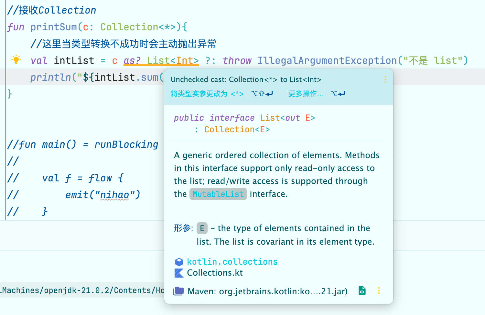

# 泛型

## 泛型擦除

提到泛型时，在 Java 语境中总是离不开类型擦除(type erasure)这个概念。Java/Kotlin的泛型在运行时**其类型参数会被擦除**，这么设计的很大原因是占用内存会更少。

例如 List< Int > 这种类型它的**基础类型就是List**，当我们的代码运行时，其实 JVM 只知道它是List，这里有个很经典的例子，我们来看一下：

```kotlin
fun main() {
    //定义一个保存Int类型的List
    val listInt: ArrayList<Int> = arrayListOf(1,2,3)
    //定义一个保存String类型的List
    val listString: ArrayList<String> = arrayListOf("hello","java")

    //在运行时，他们的class是相同的，都是List
    if (listInt.javaClass == listString.javaClass){
        println("类型相同")
    }

    //通过反射可以往保存Int类型的List中添加String
    listInt.javaClass.getMethod("add",Object::class.java).invoke(listInt,"aa")
    //打印结果发现居然还加成功了，没有报错
    println("listInt size = ${listInt.size}, listInt = $listInt")
}
```

上面的输出结果为:

```kotlin
类型相同
listInt size = 4, listInt = [1, 2, 3, aa]
```

可以看到 String 不仅被加入 Int 的数组中，而且还能够被调用 toString 方法。但是如果我们想要单独那出最后的数据时，就会有问题了：

```kotlin
listInt.last()

// 报错
Exception in thread "main" java.lang.ClassCastException: class java.lang.String cannot be cast to class 
```

这里就和类型转换、类型检查结合起来了。

### 类型检查

伴随了类型擦除这个特性，泛型类的类型就有了一些约束，比如**类型检查**。

Kotlin中的类型检查是通过 is 函数，但是当类型参数被擦除时，你无法直接使用以下代码：

```kotlin
//定义一个ArrayList<String>
val listInt = arrayListOf(1,2,3)
//判断是否是ArrayList<String> 这代码无法编译
if (listInt is ArrayList<String>){
    
}
```

上面代码是**无法编译的，会直接报错**，因为在**运行时根本携带不了类型实参**，这里你只能判断它是不是List。Idea 也会提示你换为如下代码：

```kotlin
fun main() {
    //定义一个ArrayList<String>
    val listInt = arrayListOf(1,2,3)
    
  	// 使用 * 号，投影
    if (listInt is ArrayList<*>){
				// 永远为 true
    }
}
```

### 类型转换

同样伴随着类型擦除，类型转换 as 函数也受到限制，直接看个代码：

```kotlin
//接收Collection
fun printSum(c: Collection<*>){
    //这里当类型转换不成功时会主动抛出异常
    val intList = c as? List<Int> ?: throw IllegalArgumentException("不是 list")
    Logger.d("${intList.sum()}")
}
```

我们使用两种调用方式，一种是放进去一个 set：

```kotlin
val intSet = hashSetOf(1,2,3)
printSum(intSet)
```

这个代码会直接抛出异常，提示"不是 list"。这很显然，因为基类型不同了，但是如果我们放一个：

```kotlin
val stringList = arrayListOf("a","b")
printSum(stringList)
```

这个时候会抛一个类型转换异常：

```
java.lang.ClassCastException: java.lang.String cannot be cast to java.lang.Number
```

实际上，编译器已经在提醒了：



因为**编译器知道这个泛型参数会被擦除，这个操作是危险操作**，所以后面还是会报出类型转换错误。

上面2个函数也是由编译器就直接在你**编码阶段会提醒你的危险操作，防止出现由于泛型类型擦除导致的程序异常**。

# Kotlin 中的泛型

## Kotlin 中泛型的基本使用

### Kotlin 要求泛型类型显示说明

我们看个例子：

```java
//这里Java代码中，tempList的类型就是List
List tempList = new ArrayList();
```

种写法在Kotlin中是不允许的，因为Kotlin的创建之初就有泛型的概念，**要不显示的指明泛型参数的类型**，**要不通过自动推导**。在 Kotlin 中，需要这么写：

```kotlin
//已经指明类型参数就是String
val list: MutableList<String> = mutableListOf()
//能自动推导出类型参数是String
val list1 = mutableListOf("a","b")
```

如果不能推断的话，会直接不能编译，如下：

```kotlin
//这里无法知道类型参数，会直接报错
val errorList = listOf()
```

### 泛型函数

我们直接看集合类型中的泛型函数的定义：

```kotlin
//这里的 <T> 就是定义了一个类型形参 
//接收者和返回者都用了这个形参
public fun <T> List<T>.slice(indices: IntRange): List<T> {
    if (indices.isEmpty()) return listOf()
    return this.subList(indices.start, indices.endInclusive + 1).toList()
}
```

而这个类型其实在传入参数的时候，T 就已知了：

```kotlin
//类型自动推导，List的类型实参是String
val list1 = mutableListOf("a","b")
//显示的给slice函数传递一个类型实参
val newList = list1.slice<String>(0 .. 1)
```

### 泛型属性

泛型属性就和泛型函数有点区别，它**只能定义为扩展属性，不能定义为非扩展属性**。

```kotlin
//定义一个扩展属性last
val <T> List<T>.last : T
    get() = this.last()
```

泛型字段只需要声明为：

```kotlin
val value: T? = null
```

### 泛型类

声明泛型类也非常简单，和接口一样，把**需要定义的类型参数通过<>放在类名后面**即可，

```kotlin
//直接在类名后面加上<>定义类型形参
public interface List<out E> : Collection<E> {
     //方法内部可以使用这个形参
    public operator fun get(index: Int): E
```

### 类型约束

类型参数约束可以**约束泛型类或者泛型方法的类型实参的类型**。

这里也非常容易理解，也就是约束这个类型参数的范围，在Java中使用extends来表达，在**Kotlin中直接使用冒号**，**<T:Number>就说明这个类型参数必须是Number或者Number的子类型**。

```kotlin
//定义类型参数约束条件，上界为Number
fun <T : Number> List<T>.sum(): Number{
    //...
}


//可以编译
val list0 = arrayListOf(1,2,3,4,5,6,7,8)
list0.sum()
//无法编译
val list1 = arrayListOf("a","b")
list1.sum()
```

### 类型参数可空处理

一般来说，如果不加约束，那**类型T的默认上界是Any?**，注意这里是可空的。我们可以看一段代码：

```kotlin
// 这里没有加其他约束，例如 T: Number，因此 T 的上界默认是 Any?
class TestKT<T> {
    fun progress(t: T){
        // 可以为空
        t?.hashCode()
    }
}

//所以调用的时候可以传入null
val stringNull = TestKT<String?>()
stringNull.progress(null)
```

这里如果想让类型非空，给**指定一个上界 Any** 即可。

```Kotlin
//这里类型参数就不能传入可空类型实参
class TestKT<T : Any> {
    fun progress(t: T){
        t.hashCode()
    }
}
```

### 声明带实化类型参数的函数

不同于Java，Kotlin 可以**实化类型参数** ， 也即可以让这个类型参数**在运行时不会被擦除**。

比如下面代码是编译不过的：

```kotlin
fun <T> isAny(value: Any): Boolean {
    // 由于类型擦除，在执行时这个T的值是不携带的
    return value is T
}
```

但是Kotlin可以让上面的代码编译且执行成功，如下:

```kotlin
//函数声明为inline函数，且泛型参数使用reified来修饰
inline fun <reified T> isAny(value: Any): Boolean {
    //能执行成功
    return value is T
}
```

上面能保留类型实参的关键不仅仅是把**类型实参使用reified修饰**，也**必须在内联函数中**，因为**编译器把实现内联函数的字节码插入到每一次调用发生的地方**，所以每次调用带实化类型参数的函数时，编译器都知道调用中作为类型实参的确切类型，会直接把类型实参的值替换到字节码中，所以不会被擦除。

关于普通的内联函数，Java是可以调用的，但是无法进行内联。对于带reified类型参数的内联函数，Java是不能调用的，因为要实现实化功能，必须要内联，且做一些处理，Java编译器是无法内联的。

## 变型

从字面意思来理解，变型指的是是**变异/变化的泛型参数**，用来描述**拥有相同基础类型和不同类型实参的类型之间是如何关联的**。变型主要包括三种：

1. 协变
2. 逆变
3. 不变

变型是类型系统的关键，描述了复合类型、函数类型以及生命周期之间(Rust 中，生命周期的变型基本是最为复杂的知识)的关系。

在讨论变型的时候又需要提一下子类型的概念：

> **在任何时候如果需要类型A的值，都能够使用类型B的值来当做类型A的值，这样类型B就是类型A的子类型。也即子类型可以传递到需要父类型的位置**

有了子类型之后，上述三种类型可以进行定义：

> 对于List这种类来说，A是B的子类型，List< A >是List< B >的子类型，就说这个类是**协变的**；对于MutableList这种类来说，对于任意2种类型A和B，MutableList< A >即不是MutableList< B >的子类型也不是超类型，它就被称为在该类型参数上是**不变型的**。

### 协变、逆变、不变在 Kotlin 中的实现

变型在 Kotlin 中有着关键字的对应，协变就是`out`，逆变是`in`。

我们可以写一个例子去展示对变型的控制。首先我们需要一个基类：Animal 以及两个子类：Cat 和 Dog

```kotlin
// 动物类
open class Animal {

    open fun type(): String {
        return ""
    }

    fun sleep() {
        println("sleep")
    }

    open fun call() {
        println("Animal call")
    }
}

class Cat(): Animal() {
    override fun type(): String {
        return "Cat"
    }

    override fun call() {
        println("miao miao")
    }
}

class Dog(): Animal() {
    override fun type(): String {
        return "Dog"
    }

    override fun call() {
        println("wang wang")
    }
}
```

此时，因为 Cat 和 Dog 是 Animal 的子类型，我们定义以下方法：

```kotlin
fun call(animal: Animal) {
    animal.call()
}
```

我们可以把子类型当做父类型进行使用：

```kotlin
fun main() {
    val cat = Cat()
    val dog = Dog()
    call(cat)
    call(dog)
    call(Animal())
}

// 输出
miao miao
wang wang
Animal call
```

但是我们在给他包上一层之后就需要考虑变型的问题了。

#### 不变

我们实现一个动物种群的类型，此时我们仅仅给到一个泛型 T：

```kotlin
// 定义一个动物种群，这个种群中会包含 T 这种类型的动物
class Population<T: Animal>(private val animal: Animal) {
    fun getAnimalType(): T {
        return animal as T
    }
}
```

然后我们想要实现一个方法，这个方法能够去访问到动物的类型并让他们叫一下：

```kotlin
fun animalsCall(population: Population<Animal>) {
    println("${population.getAnimalType()::class.simpleName}:")
    population.getAnimalType().call()
}
```

此时我们去构建一个猫种群，然后想要把这个种群放入函数时：

```kotlin
fun main() {
    val cat = Cat()
    val population = Population<Cat>(cat)
    animalsCall(population)
}
```

此时会报错并编译失败：


也即，虽然 Cat 是 Animal 的子类型，但是因为我们的写法，`Population<Cat>`并不是`Population<Animal>`的子类型，我们没法传入。

#### 协变

我们稍稍修改一下类的定义，此时就能够正确的将`Population<Cat>`修改为`Population<Animal>`的子类型:

```kotlin
// 泛型用 out 修饰
class Population<out T: Animal>(private val animal: Animal) {
    fun getAnimalType(): T {
        return animal as T
    }
}
```

此时上面的代码不会有问题：

```kotlin
fun main() {
    val cat = Cat()
    val population = Population<Cat>(cat)
    animalsCall(population)
}

// 打印
Cat:
miao miao
```

#### 逆变

我们也可以通过修改类定义，改为逆变的关系：

```kotlin
// 泛型用 out 修饰
class Population<in T: Animal>(private val animal: Animal) {
    fun getAnimalType(): T {
        return animal as T
    }
}
```

我们会发现编译不过了：


这个和之前的一个知识结合起来了：函数的返回值是协变的，参数是逆变的。

我们可以修改方法为：

```kotlin
// 参数上就没问题了，这个是 FP 相关的内容了，这里不做解释
fun printAnimalType(animal: T) {
    println("${animal.type()::class.simpleName}")
}
```

不过为了说明逆变，我们不做这样的改变，而是把`Population`类修改为：

```kotlin
// 定义一个动物种群，这个种群中会包含 T 这种类型的动物
class Population<in T: Animal>(private val animal: T) {
    fun printAnimalType() {
        println("${animal.type()::class.simpleName}")
    }
}
```

而上面的方法我们修改为：

```kotlin
fun animalsCall(population: Population<Cat>) {
    population.printAnimalType()
}
```

预期上，如下方法是可以调入的：

```kotlin
fun main() {
    val population = Population(Animal())
    animalsCall(population)
}
```

此时我们将将`Population<Cat>`修改为`Population<Animal>`的父类型了。但是 Dog 就传入不了了：


#### in 和 out 的位置

上面我们熟悉了协变，就是给类型参数加上out关键字，那能不能把所有类型参数都定义为out呢 当然不可以，**定义为out的类型参数在泛型类中只能被用在 out 位置，其实这里的 out 位置也就是返回值的位置，或者叫做生产者的位置，也就是生成类型为 T 的值**。

其实这也是为什么叫 in 和 out 的原因，in 就是函数输入，out 就是函数返回值。因此函数参数是逆变的，返回值是协变的。


所以在类型参数T上加上 out 关键字有2层含义：

- 子类型化会被保留
- T 只能用在 out 位置

所以当类型参数定义为了 out，这个类型参数在泛型类中就不能出现在 in 位置，编译器会报错。

### 为什么需要有变型

一句话回答：为了类型系统的完整，可以**安全的**处理数据。


有个经典的应用场景是 Rust 的生命周期，短生命周期是长生命周期的**父类型**，因此长生命周期用在短生命周期的位置是没问题的，但是如上图，引用是逆变的，这使得短生命周期的指针是长生命周期的**子类型**，只能是短生命周期的指针能够用于长生命周期指针位置传入，这可以保护数据不泄露。

否则下面的代码就会内存泄露了：

```rust
fn assign<T>(input: &mut T, val: T) {
    *input = val;
}

fn main() {
    let mut hello: &'static str = "hello";
    {		
      	// 短生命周期赋值给长生命周期，hello 指针泄露
        let world = String::from("world");
        assign(&mut hello, &world);
    }
    println!("{hello}");
}
```

逆变在 Kotlin 中也有个经典的例子是：

```kotlin
//这是迭代集和的排序函数，这里要传递进来一个Comparator，它的类型是in T
public fun <T> Iterable<T>.sortedWith(comparator: Comparator<in T>): List<T> {
    if (this is Collection) {
       if (size <= 1) return this.toList()
       @Suppress("UNCHECKED_CAST")
       return (toTypedArray<Any?>() as Array<T>).apply { sortWith(comparator) }.asList()
    }
    return toMutableList().apply { sortWith(comparator) }
}
```

然后有一下情况：

```kotlin
//泛型实参为Any
val anyComparator = Comparator<Any> { o1, o2 -> o1.hashCode() - o2.hashCode() }
//泛型实参为Number
val numberComparator = Comparator<Number> { o1, o2 -> o1.toInt() - o2.toInt() }
//泛型实参为Int
val intComparator = Comparator<Int> { o1, o2 -> o1.toInt() - o2.toInt() }

//创建了Number类型的集和，按照接口，它期望的参数是Comparator<Number>
val numbers: List<Number> = arrayListOf(1,11,111)
//可以编译
numbers.sortedWith(numberComparator)
//可以编译
numbers.sortedWith(anyComparator)
//不可以编译
numbers.sortedWith(intComparator)
```

**Number 是 Int 的超类型，是 Any 的子类型，但是在传递参数却无法传递 Comparator<Int>**

标记为 in 的逆变，这里期望是 Number，我调用 Number 中的方法，但是来了一个它的子类型 Int，假如 Int 有个 getInt 的方法，这时在泛型类中类型参数还是 Number，它是没有 getInt 方法的，所以不允许。但是来了一个它的超类型 Any，Any 中的操作我 Number 都可以操作，所以是安全的。

### 点变型

点变型其实就是在一个函数已经定义为 T 泛型时，使其参数可以接收不同的变型种类的方法，对应过来就是 Java 代码：

```java
//这里使用<? extent T>就说明可以使用T的子类型
public static <T> void copyDataJava(ArrayList<? extends T> source
        , ArrayList<T> destination){
    for (int i = 0; i < source.size(); i++) {
        destination.add(source.get(i));
    }
}

private void  testJava(){
    ArrayList<String> strings = new ArrayList<>();
    strings.add("zyh");
    strings.add("wy");
    //这里虽然类型是Object，但是不会报错
    ArrayList<Object> objects = new ArrayList<>();
    copyDataJava(strings, objects);
}
```

就像上面代码中，T 是 Object，此时给到 String 是可以的，因为 String 是 Object 的子类型。在 Kotlin 中可以这样写：

```kotlin
//加了一个out变型修饰符
fun <T> copyData2(source: MutableList<out T>
                 , target: MutableList<T>){
    for (item in source) {
        target.add(item)
    }
}
```

**直接指定source的类型类是协变的，使得可以传递其子类型。**

### 投影、星号投影

上面代码中，MutableList 这个类在定义的时候是不变型的，在使用时又给它设置为了协变，那是不是 MutableList<T> 在 T 上就是协变了呢？

答案肯定为不是，要是这样那岂不是乱套了。

也即：

```kotlin
fun <T> copyData2(source: MutableList<out T>
                 , target: MutableList<T>){
    for (item in source) {
        target.add(item)
    }
}
```

这里的**source其实不是一个常规的MutableList，它是受到限制的**，这个叫做**类型投影，即它不是真正的类型，只是一个投影**。

其实投影还挺好理解的，它就是受限制的类型，不是真正的类型，因为它的有些功能是受限的，是假类型。例如我们加两行：

```kotlin
fun <T> copyData2(source: MutableList<out T>
                  , target: MutableList<T>){
    for (item in source) {
        target.add(item)
    }
    val tar = target[0]
  	// 报错：类型不匹配。
		// 要求:
		//			Nothing
		// 实际:
		//      T
    source.add(tar)
}
```

这里 **add 方法**在 MutableList 中是泛型参数在 in 的位置，所以这里直接无法使用，功能受限，也验证了为什么叫做投影。

实际上，我们给他添加自己也是不行的：

```kotlin
fun <T> copyData2(source: MutableList<out T>
                  , target: MutableList<T>){
    for (item in source) {
        target.add(item)
    }
    val item = source[0]
  
  	// 添加 source 自身的元素
    source.add(item)
}
```

这个其实也非常好理解，**一旦使用点变型让一个类型协变，将无法使用类型参数在in位置的方法，然后这个新的"假"类型就叫做投影。**


**星号投影也是一种投影，它的限制是相当于out，即只能使用类型参数在out位置的方法。**

直接理解完定义后，我们需要思考为什么要有这个星号投影，**当类型参数不重要时可以使用星号投影**，啥叫做不重要呢 就是当不调用带有类型参数的方法或者只读取数据而不关心其具体类型时。

比如我想判断一个集和是不是ArrayList时：

```kotlin
val strings = arrayListOf("zyh","wy")
//这里只能用星号投影
if (strings is ArrayList<*>){
    Logger.d("ArrayList")
}
```

因为泛型在运行时会被擦除，所以类型参数并不重要，所以这里使用星号投影。

关于星号投影还容易理解出错，**比如MutableList< \* >和MutableList< Any? >这两个是不一样的东西**，其中MutableList< Any? >这种列表可以包含任何类型，但是MutableList< * >是包含某种类型的列表，这个类型你不知道而已，只有当被赋值时才知道。例如：


在被赋值前，不知道unknowns的类型，但是赋值后，可以通过get获取它的值，但是add方法无法调用，这里受到了限制，是不是有点熟悉，这个限制就是 out 点变型的协变。

所以这里星号投影被转换成了 < out Any? >，只能调用其类型参数在out位置的方法，不能调用类型参数在in位置的方法。
