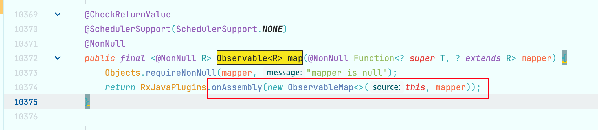

## 例子

### 基础例子

```kotlin
fun main() {
    val observable = Observable.create(object : ObservableOnSubscribe<String> {
        override fun subscribe(emitter: ObservableEmitter<String>) {
            println("subscribe")
            emitter.onNext("emitted!!!!")
	          emitter.onComplete()
        }
    })

    val observer = object : Observer<String> {
        override fun onSubscribe(d: Disposable) {
            println("onSubscribe")
        }

        override fun onError(e: Throwable) {
            println("onError")
        }

        override fun onComplete() {
            println("onComplete")
        }

        override fun onNext(t: String) {
            println("observer onNext, t=$t")
        }

    }

    observable.subscribe(observer)
}

// 打印
onSubscribe
subscribe
observer onNext, t=emitted!!!!
onComplete
```

上面的例子是最基础的，我们可以看到，observer 的 onSubscribe 是最先调用的。然后执行 observer 的相关逻辑时，`observable`会调用到 subscribe 方法，继而通过 onNext 传递给 observer，然后调用 observer 的对应回调。

### 计时器例子

```kotlin
fun main() {
    // 创建一个每1秒发出一个值的Observable
    val secondsCounter = Observable.interval(1, TimeUnit.SECONDS)

    // 订阅并打印已过去的时间
    val disposable = secondsCounter.subscribe { n ->
        val name = Thread.currentThread().name
        println("已过去 ${n + 1} 秒, name=$name")
    }

    // 保持程序运行以便观察输出
    Thread.sleep(5000)  // 等待5秒以便观看输出

    // 取消订阅
    disposable.dispose()
    println("订阅已取消, name=${Thread.currentThread().name}")
}

// 输出
已过去 1 秒, name=RxComputationThreadPool-1
已过去 2 秒, name=RxComputationThreadPool-1
已过去 3 秒, name=RxComputationThreadPool-1
已过去 4 秒, name=RxComputationThreadPool-1
已过去 5 秒, name=RxComputationThreadPool-1
订阅已取消, name=main
```

上面的例子比较直白，需要注意的是后面的都 sleep 保证了 Observable 线程能够执行完毕。在调用`interval`的时候，会切一个线程出来。

### 上游数据处理后发送的例子

我们假设有一个 dataSource，里面存储着我们想要请求的数据，然后通过 flatMap 去向服务端请求数据并杂糅成一个 res 集合，该 res 集合会被下游监听到，并打印出来：

```kotlin
fun main() {
    val dataSource = mapOf(
        "tag1" to 123,
        "tag2" to 456,
        "tag3" to 789
    )
    val resData = mutableListOf<String>()
    Observable
        .fromIterable(dataSource.keys)
        .flatMap { key ->
            val value = dataSource[key]
            Observable.create<String> {
                when (key) {
                    "tag1" -> {
                        // 模拟从服务端拿数据 tag1，然后装载
                        sleep(1000)
                        resData.add(value.toString() + "_res")
                        it.onNext("tag1")
                        it.onComplete()
                    }

                    "tag2" -> {
                        sleep(1000)
                        resData.add(value.toString() + "_res")
                        it.onNext("tag2")
                        it.onComplete()
                    }

                    "tag3" -> {
                        resData.add(value.toString() + "_res")
                        it.onNext("tag3")
                        it.onComplete()
                    }

                    else -> {
                        it.onNext("unknown")
                        it.onComplete()
                    }
                }
            }
        }.subscribe(
            {
                println("onNext, str=$it")
            },
            { println("onError") },
            {
                println("onComplete, res=$resData")
            }
        )
}
```

我们可以看到有如下的打印：

```kotlin
onNext, str=tag1
onNext, str=tag2
onNext, str=tag3
onComplete, res=[123_res, 456_res, 789_res]
```

可以看到，执行顺序就是我们的流顺序，onComplete 会在所有的 onNext 执行完毕之后调用。

## RxJava 涉及到的设计模式

### 观察者模式

RxJava 是对观察者模式的直接改进。在观察者模式中：**被观察者通过订阅将事件按顺序依次传递给观察者**。

主要分为以下几大部分：

- `Observable` (被观察者)
- `Observer` (观察者)
- `subscribe` (订阅)
- `event`(事件)

`Observable` 和 `Observer` 通过 `subscribe()` 方法实现订阅关系，从而 `Observable` 可以在需要的时候发出事件来通知 `Observer`。

Observer的事件回调方法除了普通事件 `onNext()` （`onEvent()`）之外，还定义了两个特殊的事件：`onComplete()` 和 `onError()`。

- `onComplete()`: 事件队列完结。RxJava 不仅把每个事件单独处理，还会把它们看作一个队列。RxJava 规定，当不会再有新的 `onNext()` 发出时，需要触发 `onComplete()` 方法作为标志。
- `onError()`: 事件队列异常。在事件处理过程中出异常时，`onError()` 会被触发，同时队列自动终止，不允许再有事件发出。
- 在事件序列中, `onComplete()` 和 `onError()` 有且只有一个（互斥的），并且是事件序列中的最后一个。

有着以下的关系：


### 装饰者模式

在装饰者模式中：在**不必改变原类和使用继承的情况下**，动态地扩展一个对象的功能。最终是通过创建一个包装对象，也就是装饰来包裹真实的对象。

> [装饰者模式参考文档](https://zhuanlan.zhihu.com/p/64584677)

以一次 RxJava 的变换操作为例子：

`map` 操作符在建立链的时候返回的是 `ObservableMap`，和上游的源一样是 `Observable` 的一个子类。	

在调用 `source.subscribe(new MapObserver<T, U>(t, function))`之后把上游订阅给自己的一个静态内部类 `MapObserver`。`MapObserver` 是对下游观察者进行了一次装饰，和其他观察者一样都实现了 `Observer`。


## 心智模型

RxJava 的心智模型极为简单，就是基于观察者和被观察者建立的一个响应式的链式调用。我们看个例子：

```kotlin
Observable.create(new ObservableOnSubscribe()) //创建一个事件流，参数是我们创建的一个事件源
           .map(...)//操作符进行变换事件源
           .subscribeOn(Schedulers.io())//指定事件源代码执行的线程
           .observeOn(AndroidSchedulers.mainThread())//指定订阅者代码执行的线程
           .subscribe(new Observer())//参数是我们创建的一个订阅者，在这里与事件流建立订阅关系
```

可以看到，主要就是在观察者、被观察者、订阅以及线程选择这几部分做文章。

### 主要组成部分

#### 观察者

`Observer` 即观察者，它决定事件触发的时候将有怎样的行为。 一个典型的观察者实现了 RxJava 的 Observer 接口：

```java
Observer<Integer> observer = new Observer<Integer>() {
    // 观察者接收事件前  ，当 Observable 被订阅时，观察者onSubscribe方法会自动被调用
    @Override
    public void onSubscribe(Disposable d) {
        Log.d(TAG, "开始采用subscribe连接");
    }

    // 当被观察者生产Next事件
     @Override
     public void onNext(Integer value) {
         Log.d(TAG, "对Next事件作出响应" + value);
     }

     // 当被观察者生产Error事件
      @Override
      public void onError(Throwable e) {
          Log.d(TAG, "对Error事件作出响应");
      }

      // 当被观察者生产Complete事件
       @Override
       public void onComplete() {
           Log.d(TAG, "对Complete事件作出响应");
       }
 };
```

但是在 RxJava2 中，Subscriber 虽然名为订阅者，但实际上也是一个观察者。它实现了Observer接口的抽象类，对 Observer 接口进行了一些扩展，使用方式基本一样：

```java
Subscriber<String> subscriber = new Subscriber<String>() { 
     @Override
        public void onSubscribe(Disposable d) {
            Log.d(TAG, "开始采用subscribe连接");
        }
       
        // 当被观察者生产Next事件
         @Override
         public void onNext(String value) {
             Log.d(TAG, "对Next事件作出响应" + value);
         }
       
         // 当被观察者生产Error事件
          @Override
          public void onError(Throwable e) {
              Log.d(TAG, "对Error事件作出响应");
          }
        
          // 当被观察者生产Complete事件
           @Override
           public void onComplete() {
               Log.d(TAG, "对Complete事件作出响应");
           }
};
```

实际上在 RxJava 的 subscribe 过程中，`Observer` 也总是会先被转换成一个 `Subscriber` 再使用，所以如果只想使用基本功能，选择 `Observer` 和 `Subscriber` 是完全一样的。

它们的区别对于使用者来说主要有两点：

1. `onStart()`: 这是 `Subscriber` 增加的方法。它会在 subscribe 刚开始，而事件还未发送之前被调用，可以用于做一些准备工作，例如数据的清零或重置。这是一个可选方法，默认情况下它的实现为空。
2. `unsubscribe()`: 这是 `Subscriber` 所实现的另一个接口 `Subscription` 的方法，用于取消订阅。在这个方法被调用后，`Subscriber` 将不再接收事件。一般在这个方法调用前，可以使用 `isUnsubscribed()` 先判断一下状态。

在 `subscribe()` 之后，`Observable` 会持有 `Subscriber` 的引用，这个引用如果不能及时被释放，将有内存泄露的风险。所以最好保持一个原则：要在**不再使用的时候尽快在合适的地方调用 `unsubscribe()` 来解除引用关系**，以避免**内存泄露**的发生。

#### 被观察者

`Observable` 即被观察者，它决定什么时候触发事件以及发送的事件的内容。 RxJava 使用 **`create()`** **方法来创建一个 Observable** ，并为它定义事件触发规则：

```java
Observable observable = Observable.create(new Observable.OnSubscribe<String>() { 
    @Override 
    public void call(Subscriber<? super String> subscriber) { 
        subscriber.onNext("a"); 
        subscriber.onNext("b"); 
        subscriber.onNext("c"); 
        subscriber.onCompleted(); 
    } 
}); 
```

(在源码中不同的【装配】(回想一下，这个是装配阶段)会创建不同的Observable，比如map()会创建一个`ObservableMap`，`subscribeOn()`会创建一个`ObservableSubscribeOn`，但它们实际上都是Observable的子类）

通过 create 创建 observable 的参数就一个：`OnSubscribe` 对象。

- `OnSubscribe` 会被存储在返回的 `Observable` 对象中，它的作用相当于一个计划表。
- 当 `Observable` **被订阅的时候**，`OnSubscribe` 的 `call()` 方法会自动被调用，事件序列就会依照设定依次触发。
- 这样，由被观察者调用了观察者的回调方法，就实现了由被观察者向观察者的事件传递，即观察者模式。

`Observable.create()` 方法是最基本的**创造事件序列**的方法。RxJava 还提供了快捷创建事件队列的方法，例如：

- `just(T...)`: 将传入的参数依次发送出来。

```java
Observable observable = Observable.just("a", "b", "c");
// 将会依次调用：
// onNext("a");
// onNext("b");
// onNext("c");
// onCompleted(); onError()
```

- `from(T[])` / `from(Iterable<? extends T>)` : 将传入的数组或 `Iterable` 拆分成具体对象后，依次发送出来。

```java
String[] words = {"a", "b", "c"};
Observable observable = Observable.from(words);
// 将会依次调用：
// onNext("a");
// onNext("b");
// onNext("c");
// onCompleted(); onError()
```

上面 `just(T...)` 的例子和 `from(T[])` 的例子，都和之前的 `create(OnSubscribe)` 的例子是等价的。

#### 订阅实现

创建了 `Observable` 和 `Observer` 之后，再用 `subscribe()` 方法将它们联结起来，整条链子就可以工作了（在`Observable`未被subscribe前，不会发送事件，也就是不会执行`OnSubscribe#call`，在 RxJava3 是`ObservableOnSubscribe#subscribe`）：

```Java
observable.subscribe(observer); 
// 或者： 
observable.subscribe(subscriber); 
```

RxJava2 中`subscribe(Subscriber)`核心代码：

```Java
//已删掉大部分代码
public Subscription subscribe(Subscriber subscriber) { 
    subscriber.onStart(); 
    onSubscribe.call(subscriber); 
    return subscriber; 
}
```

可以看到，`subscribe()` 做了3件事：

1. 调用 `Subscriber.onStart()` ，设置observable发送事件前subscriber的准备工作。
2. 调用 `Observable` 中的 `OnSubscribe.call(Subscriber)` 。在这里，事件发送的逻辑开始运行。从这也可以看出，在 RxJava 中， `Observable` 并不是在创建的时候就立即开始发送事件，而是在它被订阅的时候，即当 `subscribe()` 方法执行的时候。
3. 将传入的 `Subscriber` 作为 `Subscription` 返回。这是为了方便 `unsubscribe()`

### 调度器实现

> RxJava如何实现一句话线程切换

在不指定线程的情况下， RxJava 遵循的是线程不变的原则，即：

- 在哪个线程调用 `subscribe()`，就在哪个线程生产事件；
- 在哪个线程生产事件，就在哪个线程消费事件。

如需要切换线程，就需要用到 `Scheduler` （调度器）。

#### 种类

`Scheduler` 调度器，相当于线程控制器，RxJava 通过它来**指定每一段代码应该运行在什么样的线程**。 

RxJava内置的几个 `Scheduler` ：

- `Schedulers.immediate()`: 直接在当前线程运行，相当于不指定线程。这是默认的 Scheduler。
- `Schedulers.newThread()`: 总是启用新线程，并在新线程执行操作。
- `Schedulers.io()`: I/O 操作（读写文件、读写数据库、网络信息交互等）所使用的 `Scheduler`。
- `Schedulers.computation()`: 计算所使用的 `Scheduler`。这个计算指的是 **CPU 密集型计算，即不会被** **I/O** **等操作限制性能的操作**，例如图形的计算。这个 `Scheduler` 使用的固定的线程池，大小为 CPU 核数。不要把 I/O 操作放在 `computation()` 中，否则 I/O 操作的等待时间会浪费 CPU。
- 另外， Android 还有一个专用的 `AndroidSchedulers.mainThread()`，它指定的操作将在 Android 主线程运行。

#### 使用方法

我们主要是用使用`subscribeOn()`和`observeOn()`进行线程控制：

* `subscribeOn()`: 指定 *`subscribe()`* 所发生的**线程**，即`Observable.OnSubscribe`被激活时所处的线程。或者叫做事件产生的线程。

* `observeOn()`: 指定 `Subscriber` 所运行在的线程。或者叫做事件消费的线程。

例如：
```kotlin
Observable.just(1, 2, 3, 4) 
    .subscribeOn(Schedulers.io()) // 指定 subscribe() 发生在 IO 线程 
    .observeOn(AndroidSchedulers.mainThread()) // 指定 Subscriber 的回调发生在主线程 
    .subscribe(new Action1<Integer>() { 
        @Override 
        public void call(Integer number) { 
            Log.d(tag, "number:" + number); 
        } 
    }); 
```

* 由于`subscribeOn(Schedulers.io())`的指定，**被创建的事件**将会在IO线程**发出**；

* 由于`observeOn(AndroidScheculers.mainThread()`)的指定，因此`subscriber`  `Log.d(tag, "number:" + number); `将发生在主线程 。

实际上，RxJava 更为灵活，可以通过 observeOn 切换线程，因为`observeOn()`指定的是它之后的操作所在的线程。因此如果有多次切换线程的需求，只要在每个想要切换线程的位置调用一次 `observeOn()` 即可：

```java
Observable.create(new OnSubscribe<Drawable>() { 
    @Override 
    public void call(Subscriber<? super Drawable> subscriber) {
        Srting url = requestImage();    
        subscriber.onNext(url); 
        subscriber.onCompleted(); 
    } 
}) 
.subscribeOn(Schedulers.io()) // 指定 subscribe() 发生在 IO 线程 
.observeOn(Schedulers.io())  // 指定 Subscriber 的回调发生 IO 线程 
.subscribe(new Observer<String>() { 
    @Override 
    public void onNext(String url) { 
        checkUrl(url) 
    } 
    @Override 
    public void onCompleted() { 
    } 
    @Override 
    public void onError(Throwable e) { 
        Toast.makeText(activity, "Error!", Toast.LENGTH_SHORT).show(); 
    } 
}))
.observeOn(AndroidSchedulers.mainThread()) // 指定 Subscriber 的回调发生在主线程 
.subscribe(new Observer<String>() { 
    @Override 
    public void onNext(String url) { 
        imageView.setImageURI(url); 
    } 
    @Override 
    public void onCompleted() { 
    } 
    @Override 
    public void onError(Throwable e) { 
        Toast.makeText(activity, "Error!", Toast.LENGTH_SHORT).show(); 
    } 
})
```

#### 原理

##### 注册线程，`subscribeOn`

在subscribeOn切换线程以后的流程，均将在新的线程中执行

```Java
public final Observable<T> subscribeOn(Scheduler scheduler){
    //第一层
    return Observable.create(new ObservableOnSubscribe<T>() {
        @Override
        public void call(@NonNull ObservableEmitter<Object> e) {
            //第二层
            // 在调度器分配的新线程中执行。
            scheduler.createWorker().schedule(new SubscribeTask() {
                @Override
                public void run() {
                //直接调用了上游的call()
                    source.call(e);
                }
            });
        }
    });
}
```


多次`subscribeOn`情况下：


##### 观察线程，`observeOn`

`observeOn`不会影响调用链中在它前面的流程，在它后面的流程全部都将在切换后的新线程中执行。

```java
public final Observable<T> observeOn(Scheduler scheduler) {
    //第一层
    return Observable.create(new ObservableOnSubscribe<T>() {
        @Override
        public void call(@NonNull Observer<Object> e) {
            //第二层
            source.call(new Observer<T>() {

                @Override
                public void onNext(T var1) {
                    //第三层
                    // 在调度器分配的新线程中执行。
                    scheduler.createWorker().schedule(new Runnable() {
                        @Override
                        public void run() {
                            e.onNext(var1);
                        }
                    });
                }
            });
        }
    });
}
```


