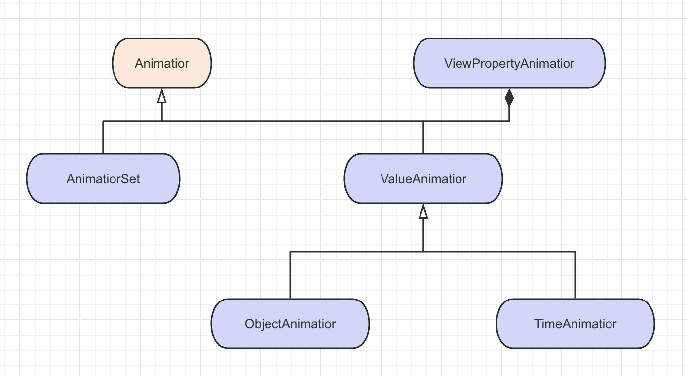
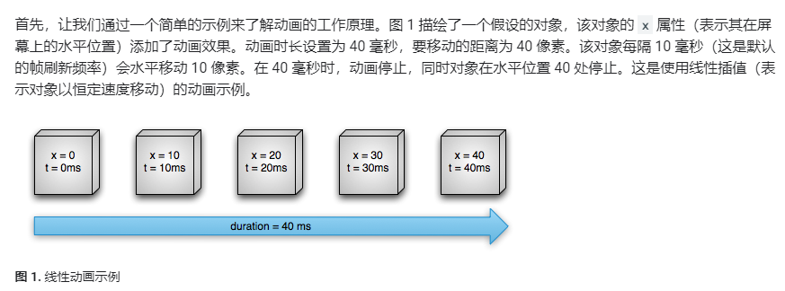

# Android 常用动画

## 概览

在上面的动画中：

* **视图动画**(View Animation)：【几乎不使用】
* **属性动画**(Property Animation)：【最常用】
* **物理动画**(Physics Animation)：【最自然】因为动画由物理引擎驱动，每一帧张总动画的值和速度都会更新，受力平衡时动画停止
* **过渡动画**(Transition Animation)：Android 的过渡框架，只需提供起始布局和结束布局，即可未界面中各种运动添加动画效果（基于属性动画实现）

## 视图动画【几乎不使用】

视图动画是最早出现的动画形式，仅在绘制时进行变化，不会修改视图的属性。它主要分为两种：

* 补间动画
* 帧动画

### 补间动画

可以对 View 对象执行一系列的简单变换，例如位置、大小、旋转、透明度。

缺点：

1. **作用对象局限**：补间动画只能作用于 View 对象，无法对非 View 对象进行动画操作。
2. **没有改变 View 的属性**：只是在父 ViewGroup 绘制子 View 时改变了绘制参数，没有改变 View 的属性。
3. **动画效果单一**：只能实现位置、大小、旋转、透明度四中变换。

主要用途是：实现页面间的简单过度动画。

例如实现两个 Activity 中的相互淡出：

```kotlin
// Activity1 中这么写，跳转 Activity2

startActivity(Intent(this::class.java, SecondActivity::class.java))
overridePendingTransition(R.anim.fade_in, R.anim.fade_out)
```

在 Activiity2 中这么写：

```kotlin
override fun finish() {
    super.finish()
    overridePendingTransition(R.anim.fade_in, R.anim.fade_out)
}
```

资源代码：

```xml
<!--淡出-->
<?xml version="1.0" encoding="utf-8"?>
<alpha xmlns:android="http://schemas.android.com/apk/res/android"
    android:fromAlpha="1.0"
    android:toAlpha="0.0"
    android:duration="8000"
    />
```

```xml
<!--淡入-->
<?xml version="1.0" encoding="utf-8"?>
<alpha xmlns:android="http://schemas.android.com/apk/res/android"
    android:fromAlpha="0.0"
    android:toAlpha="1.0"
    android:duration="8000"
    />
```

### 帧动画

帧动画就是每一帧显示一个 drawable（可绘制对象，例如 BitmapDrawable 用来显示图片），一帧一帧顺序播放。

帧动画由于复杂动画会引入大量图片，容易引起 OOM，现在也不使用了。

## 属性动画

属性动画是在一定时间间隔内，不断改变某个对象的属性值，通过重绘实现动画效果。其继承组合关系如下：



### 基本用法

上面的相关类中，TimeAnimator 不能直接实现动画效果，而是在`TimeListener#onTimeUpdate`里返回动画持续的时间和与上次调用的间隔时间，而具体要怎么改变 view 需要自己操作，一般不使用。
`void onTimeUpdate(TimeAnimator animation, long totalTime, long deltaTime);`
剩余的几个实现类中，从使用难易程度(由易到难)来看：

* ViewPropertyAnimator < ObjectAnimator <ValueAnimator < AnimatorSet

以`translateX`属性为例，它代表的一个`View`水平方向的位移，作用是用来做动画，translateX 为正数表示向右平移，为负表示向左平移。默认值为0。

### 下面测试的基本 demo

1. Activity

```kotlin
class MainActivity : FragmentActivity() {
    companion object {
        private const val TAG = "MainActivity"
    }
    
    override fun onCreate(savedInstanceState: Bundle?) {
        super.onCreate(savedInstanceState)
        Log.i(TAG, "[onCreate]")
        setContentView(R.layout.main_activity)
        supportFragmentManager
            .beginTransaction()
            .add(R.id.base_fragment_container, BaseFragment())
            .addToBackStack("BaeFragment")
            .commit()
    }

    override fun finish() {
        super.finish()
    }
}
```

```kotlin
<?xml version="1.0" encoding="utf-8"?>
<LinearLayout xmlns:android="http://schemas.android.com/apk/res/android"
    android:layout_width="match_parent"
    android:layout_height="match_parent"
    android:orientation="vertical">
    
    <TextView
        android:layout_width="match_parent"
        android:layout_height="wrap_content"
        android:text="@string/tradition_view_small_test"
        android:gravity="center"
        android:textColor="@color/purple_200"
        android:textSize="36px"
        android:layout_marginTop="5dp"
        android:background="@color/teal_200"
        />

    <FrameLayout
        android:id="@+id/base_fragment_container"
        android:layout_width="match_parent"
        android:layout_height="match_parent"
        android:layout_gravity="center">
    </FrameLayout>

</LinearLayout>
```

2. Fragment

```kotlin
class BaseFragment: Fragment() {
    
    companion object {
        private const val TAG = "BaseFragment"
    }
    
    private var activity: ComponentActivity? = null
    
    private var rootView: View? = null
    
    private var button: Button? = null
    
    private var animContent: FrameLayout? = null
    
    override fun onAttach(context: Context) {
        super.onAttach(context)
        activity = context as ComponentActivity
        Log.i(TAG, "[onAttach] activity=$activity")
    }


    override fun onCreateView(inflater: LayoutInflater, container: ViewGroup?, savedInstanceState: Bundle?): View? {
        val view = inflater.inflate(R.layout.base_fragment, container, false)
        rootView = view
        return view
    }

    override fun onViewCreated(view: View, savedInstanceState: Bundle?) {
        super.onViewCreated(view, savedInstanceState)
        initViews()
    }
    
    private fun initViews() {
        button = rootView?.findViewById(R.id.button_show_anim)
        animContent = rootView?.findViewById(R.id.anim_content)
        initClickListeners()
    }

    private fun initClickListeners() {
        button?.setOnClickListener {
					// 这里是实现动画的地方
        }
    }
}
```

```xml
<?xml version="1.0" encoding="utf-8"?>
<androidx.constraintlayout.widget.ConstraintLayout xmlns:android="http://schemas.android.com/apk/res/android"
    android:layout_width="match_parent"
    android:layout_height="match_parent"
    xmlns:app="http://schemas.android.com/apk/res-auto">
    
    <TextView
        android:id="@+id/top_text"
        android:layout_width="wrap_content"
        android:layout_height="wrap_content"
        android:gravity="center"
        app:layout_constraintTop_toTopOf="parent"
        app:layout_constraintLeft_toLeftOf="parent"
        app:layout_constraintRight_toRightOf="parent"
        android:textSize="36sp"
        android:text="@string/base_fragment"
        android:textColor="@color/purple_200"
        android:layout_marginTop="10dp"
        />
    
    <FrameLayout
        android:id="@+id/anim_content"
        android:layout_width="wrap_content"
        android:layout_height="wrap_content"
        app:layout_constraintTop_toBottomOf="@id/top_text"
        app:layout_constraintBottom_toTopOf="@id/button_show_anim"
        app:layout_constraintLeft_toLeftOf="parent"
        >
        <TextView
            android:layout_width="wrap_content"
            android:layout_height="wrap_content"
            android:text="Anim!"
            android:textSize="20sp"
            android:textColor="@color/black"/>
    </FrameLayout>
    
    
    <Button
        android:id="@+id/button_show_anim"
        android:layout_width="match_parent"
        android:layout_height="wrap_content"
        app:layout_constraintBottom_toBottomOf="parent"
        app:layout_constraintLeft_toLeftOf="parent"
        app:layout_constraintRight_toRightOf="parent"
        android:text="@string/click_to_show_animation"
        android:gravity="bottom"
        android:textSize="25dp"
        />

</androidx.constraintlayout.widget.ConstraintLayout>
```

### ViewPropertyAnimator

#### 例子

我们想实现一个控件，5S 内往右移动 1000 个像素，同时不断的放大到原本的三倍，代码可以这样写：

```kotlin
button?.setOnClickListener {
    animContent
        ?.animate()                 // ViewPropertyAnimator
        ?.translationX(1000F)
        ?.scaleX(3F)
        ?.scaleY(3F)
        ?.setDuration(5 * 1000)
        ?.start()
}
```

结果：

> 上面代码只会执行到 1000，而不是每次增加 1000，因此看起来仅执行了一次，如果要支持执行多次，需要使用 translationXBy

<video src="./video/demo1_properityAnimator.mp4"></video>

总的来说 ViewPropertyAnimator 支持的动画：

> alpha(float value) 设置View的透明度，value最终值
> alphaBy(float value) 设置View的透明度，value是在view当前值的基础上的偏移量，rotation(float value)：旋转View，正值顺时针，负值逆时针，value最终值
> rotationBy(float value)：旋转，在当前值得基础上偏移量
> rotationX(float value)：绕x轴旋转
> rotationXBy(float value)：当View旋转的基础上以value为偏移量绕X轴旋转
> rotationY(float value)：绕Y轴旋转
> rotationYBy(float value)：在当前旋转的基础上绕Y轴旋转
> scaleX(float value)：缩放view的X轴方向上的大小
> scaleXBy(float value)：当前View缩放的基础上，在X轴方向上对view进行缩放
> scaleY(float value)：缩放view的Y轴方向上的大小
> scaleYBy(float value)：当前View缩放的基础上，对view的Y轴方向进行缩放
> translationX(float value):沿X轴方向平移，value大于0，X轴正方向
> translationXBy(float value)：带有偏移量的平移
> translationY(float value)：沿Y轴方向平移，value大于0，沿Y轴正方向平移
> translationYBy(float value) :在当前值的基础上，在Y轴方向上平移
> x(float value)：在当前值的基础上，修改view 的X坐标
> xBy(float value)：在当前值的基础上，修改view 的X坐标
> y(float value)：在当前值的基础上，修改View的Y的坐标
> yBy(float value)：在当前值的基础上，修改View的Y的坐标
> z(float value)：在当前值的基础上，修改View的Z的坐标
> zBy(float value):在当前值的基础上，修改View的Z的坐标

#### 设置插值器

插值器的作用是：根据时间流速的百分比计算属性的百分比，也即一个动画的速度/时间模型。



不同插值器有不同的效果，例如弹跳效果：

```kotlin
button?.setOnClickListener {
    animContent
					?.translationXBy(200F)
          ?.scaleX(3F)
          ?.scaleY(3F)
          ?.setInterpolator(BounceInterpolator()) // 弹跳器效果
          ?.setDuration(2 * 1000)
          ?.start()
}
```

<video src="./video/demo2_properityAnimator.mp4"></video>

类似的，还有贝塞尔效果`PathInterpolator(0.3f, 1.3f, 0.3f, 1f)`等:

> LinearInterpolator 线性（匀速）
>
> AccelerateInterpolator 持续加速
>
> DecelerateInterpolator 持续减速
>
> AccelerateDecelerateInterpolator 先加速后减速
>
> OvershootInterpolator 结束时回弹一下
>
> AnticipateInterpolator 开始回拉一下
>
> BounceInterpolator 结束时Q弹一下
>
> CycleInterpolator 来回循环

#### 监听器

我们可以实现对生命周期的监听：

```kotlin
button?.setOnClickListener {
    animator
        ?.translationXBy(200F)
        ?.scaleX(3F)
        ?.scaleY(3F)
        ?.setInterpolator(PathInterpolator(0.3f, 1.3f, 0.3f, 1f)) // 弹跳器效果
        ?.setDuration(2 * 1000)
        ?.setListener(object : Animator.AnimatorListener {
            override fun onAnimationStart(animation: Animator) {
                println("动画开始")
            }

            override fun onAnimationEnd(animation: Animator) {
                println("动画结束")
            }

            override fun onAnimationCancel(animation: Animator) {
                println("动画取消")
            }

            override fun onAnimationRepeat(animation: Animator) {
                println("动画重复")
            }
        })
        ?.setUpdateListener {anim ->
            println("属性值更新，anim=${anim.animatedValue}")
        }
        ?.start()
}
```

### ObjectAnimator

ObjectAnimator 是【最常用】的属性动画，基本步骤如下：

1. 通过`ObjectAnimator.ofXXX`传入动画参数，创建 ObjectAnimator 对象；
2. 调用 `start()`执行动画；
3. 如果对自定义属性做动画，还需要加 setter/getter 方法。

#### 例子

上面的例子我们可以用 ObjectAnimator 改写为如下的形式：

```kotlin
val holder1 = PropertyValuesHolder.ofFloat("translationX", 1000f)
val holder2 = PropertyValuesHolder.ofFloat("scaleX", 2f)
val holder3 = PropertyValuesHolder.ofFloat("scaleY", 2f)
objectAnimator = ObjectAnimator.ofPropertyValuesHolder(animContent, holder1, holder2, holder3)
objectAnimator?.duration = 2 * 1000

button?.setOnClickListener {
    objectAnimator?.start()
}
```

当然，简单的平移还是可以写为：

```kotlin
objectAnimator = ObjectAnimator.ofFloat(animContent, "translationX", 1000f)
objectAnimator?.duration = 2 * 1000

button?.setOnClickListener {
    objectAnimator?.start()
}
```

相比于 ViewPropertyAnimator，ObjectAnimator 除了 by 后缀方法都可以使用来作为属性。

#### 自定义 View 的自定义属性

我们实现一个简单的进度条：

```kotlin
class ProcessView @JvmOverloads constructor(
    context: Context,
    attrs: AttributeSet? = null,
    defStyleAttr: Int = 0
): ImageView(context, attrs, defStyleAttr) {
    // 用于绘制的笔
    private val paint = Paint()
    
    // 我们 ObjectAnimator 修改的属性
    private var process = 0f
        set(value) {
            field = value
            invalidate()
        }

    override fun onDraw(canvas: Canvas) {
        super.onDraw(canvas)
        
        // 灰色背景
        paint.color = Color.GRAY
        canvas.drawRect(
            0f,
            height / 2f - 20f, 
            width.toFloat(),
            height / 2f + 20f,
            paint
        )
        // 红色进度条
        paint.color = Color.RED
        canvas.drawRect(
            0f,
            height / 2f - 20f,
            width.toFloat() * process,
            height / 2f + 20f,
            paint 
        )
    }
}
```

将其加入 Fragment 之后，通过 Animator 去执行：

```kotlin
objectAnimator = ObjectAnimator.ofFloat(processView, "process", 0f, 1f)
objectAnimator?.duration = 5 * 1000

button?.setOnClickListener {
    objectAnimator?.start()
}
```

<video src="./video/demo3_objectAnimatior.mp4"></video>

它内部的执行过程大概有三步:
1.根据动画的参数,将初始值平滑过渡到结束值;
2.过渡过程中,同时通过反射调用set方法改变设置的属性住值;
3.触发View的重绘,使属性的修改生效。

#### 设置插值器和监听器

和上面一样，ObjectAnimator 也支持设置插值器：

```kotlin
objectAnimator = ObjectAnimator.ofFloat(processView, "process", 0f, 1f)
objectAnimator?.duration = 5 * 1000
// 插值器
objectAnimator?.interpolator = BounceInterpolator()
// 监听器
objectAnimator?.addListener(object : Animator.AnimatorListener {
    override fun onAnimationStart(animation: Animator) {
        println("动画开始")
    }

    override fun onAnimationEnd(animation: Animator) {
        println("动画结束")
    }

    override fun onAnimationCancel(animation: Animator) {
        println("动画取消")
    }

    override fun onAnimationRepeat(animation: Animator) {
        println("动画重复")
    }
})
objectAnimator?.addUpdateListener { anim ->
    println("属性值更新，anim=${anim.animatedValue}")
}
```

#### 通过 XML 创建属性动画【不常用】

除了通过代码，也可以通过 xml 设置动画的属性值，但是一般不用，没有代码清晰。具体分为几步：

在 res/animator 中添加 xml，例如平移：

```xml
<?xml version="1.0" encoding="utf-8"?>
<objectAnimator xmlns:android="http://schemas.android.com/apk/res/android"
    android:valueType="floatType"
    android:valueFrom="0"
    android:valueTo="500"
    android:propertyName="tanslationX"
    android:duration="5000"
    />
```

然后代码中使用：

```kotlin
val xmlAnim = AnimatorInflater.loadAnimator(context, R.animator.object_animator) as ObjectAnimator
xmlAnim.setTarget(animContent)
xmlAnim.start()
```

### ValueAnimator

ValueAnimator 是 ObjectAnimator 的父类，它封装了动画值直计算的过程，会更加抽象。

与ObjectAnimator最大的区别在于:

* ValueAnimator只负责计算当前动画应该设置的值，这个值具体设置给View的哪个属性，需要开发者自己决定。

它的用法也可分为3步:

1. 用ValueAnimator.ofXXX创建 ValueAnimator对象;
2. 添加动画更新的监听,当值更新的时候手动去应用于作用对象;
3. 用start()方法执行动画;

#### 例子

上面平移放大的例子，我们这里也可以表示为：

```kotlin
val animator = ValueAnimator.ofFloat(0f, 500f)
animator.duration = 5 * 1000
animator.addUpdateListener { anim ->
    val currentValue = anim.animatedValue as Float
    animContent?.translationX = currentValue
    animContent?.scaleX = 3 * currentValue / 500
    animContent?.scaleY = 3 * currentValue / 500
}

button?.setOnClickListener {
    animator.start()
}
```


### AnimatorSet

当遇到需要将几个动画组合起来使用的时候，就会用到Animatorset 了。它支持定义多个动画播放的次序，如同时播放、顺序播放以及特定顺序播放。

使用步骤如下:

1. 创建AnimatorSet对象,以及其他属性动画(Animator)对象;
2. 定义这些属性动画对象的播放顺序;
3. 调用start()方法执行动画。

#### 例子

例如，上面的方法平移以及进度条，我们想要他们顺序播放或者一起播放可以这么写。

1. 顺序播放

```kotlin
// 放大平移
val animator = ValueAnimator.ofFloat(0f, 500f)
animator.duration = 5 * 1000
animator.addUpdateListener { anim ->
    val currentValue = anim.animatedValue as Float
    animContent?.translationX = currentValue
    animContent?.scaleX = 3 * currentValue / 500
    animContent?.scaleY = 3 * currentValue / 500
}

// 进度条
objectAnimator = ObjectAnimator.ofFloat(processView, "process", 0f, 1f)
objectAnimator?.duration = 2 * 1000

val animatorSet = AnimatorSet()
animatorSet.playSequentially(objectAnimator, animator)

button?.setOnClickListener {
    animatorSet.start()
}
```

2. 同时播放

```kotlin
animatorSet.playTogether(objectAnimator, animator)
```

### 其他用法

#### 估值器

**估值器**：根据当前属性改变的百分比来计算改变后的属性值。估值器与插值器一起用于计算动画。

SDK中默认带有的估值器有： `IntEvaluator`、`FloatEvaluator`、`ArgbEvaluator`，他们分别对应前面我们调用  `ValueAnimator`对象所有对应的`ofInt`、`ofFloat`、`ofArgb`函数的估值器，分别用在Int类型，Float，颜色值类型之间计算。而`ofObject`函数则对应我们自定义类型的属性计算。

当估值器的类型不满足需求，就需要自定义类型估值器。例如我们实现一个二维平面上的斜线运动：

1. 定义点

```kotlin
data class Point(var x: Float, var y: Float)
```

2. 定义估值器

```kotlin
class PointEvaluator: TypeEvaluator<Point> {

    /**
     * 根据插值器计算出当前对象的属性的百分比fraction,估算去属性当前具体的值
     * @param fraction 属性改变的百分比
     * @param startValue 对象开始的位置，例如这里点坐标开始位置：屏幕左上角位置
     * @param endValue 对象结束的位置，例如这里点坐标结束的位置:屏幕右下角位置
     */
    override fun evaluate(fraction: Float, startValue: Point?, endValue: Point?): Point {
        if (startValue == null || endValue == null) {
            return Point(0f, 0f)
        }

        // 简单的斜线计算公式
        return Point(
            fraction * (endValue.x - startValue.x),
            fraction * (endValue.y - startValue.y)
        )
    }
}
```

3. 使用

```kotlin
// 放大平移
val animator = ValueAnimator.ofObject(
    PointEvaluator(),
    Point(0f, 0f),//动画开始属性值
    Point(
        1500f,
        1500f,
    )//动画结束值
)
animator.addUpdateListener {//手动更新TextView的x和y 属性
    val point = it.animatedValue as Point
    animContent?.x = point.x
    animContent?.y = point.y
}
animator.duration = 5000

button?.setOnClickListener {
    animator.start()
}
```

## 物理动画

基于物理特性的动画是依靠力来驱动的。

* 比如弹簧动画是基于弹簧的阻尼和刚度这两个属性来描述动画的。
* 比如投掷动画是基于初速度和摩擦力这两个因素来描述动画的。

由于动画的描述形式是符合自然规律的,所以动画作用起来会特别自然。

### 基本用法

#### SpringAnimation，弹簧动画

例子：X 轴方向的弹跳动画

```kotlin
// 弹簧动画，作用于 translationX 属性
val springAnimator = SpringAnimation(animContent, DynamicAnimation.TRANSLATION_X)
// 弹力对象
val force = SpringForce()
// 阻尼比
force.dampingRatio = SpringForce.DAMPING_RATIO_HIGH_BOUNCY
// 刚度
force.stiffness = SpringForce.STIFFNESS_HIGH
// 静止时位置
force.finalPosition = 1000f

springAnimator.spring = force
// 初速度
springAnimator.setStartVelocity(1000f)

button?.setOnClickListener {
    springAnimator.start()
}
```

> 参考：https://juejin.cn/post/6980139721594765319

#### FlingAnimation，投掷动画

例子，也是 X 轴方向移动：

```kotlin
// 投掷动画
val flingAnimation = FlingAnimation(animContent, FlingAnimation.TRANSLATION_X)
// 初速度
flingAnimation.setStartVelocity(2000f)
// 摩擦力
flingAnimation.friction = 0.1f

button?.setOnClickListener {
    flingAnimation.start()
}
```

