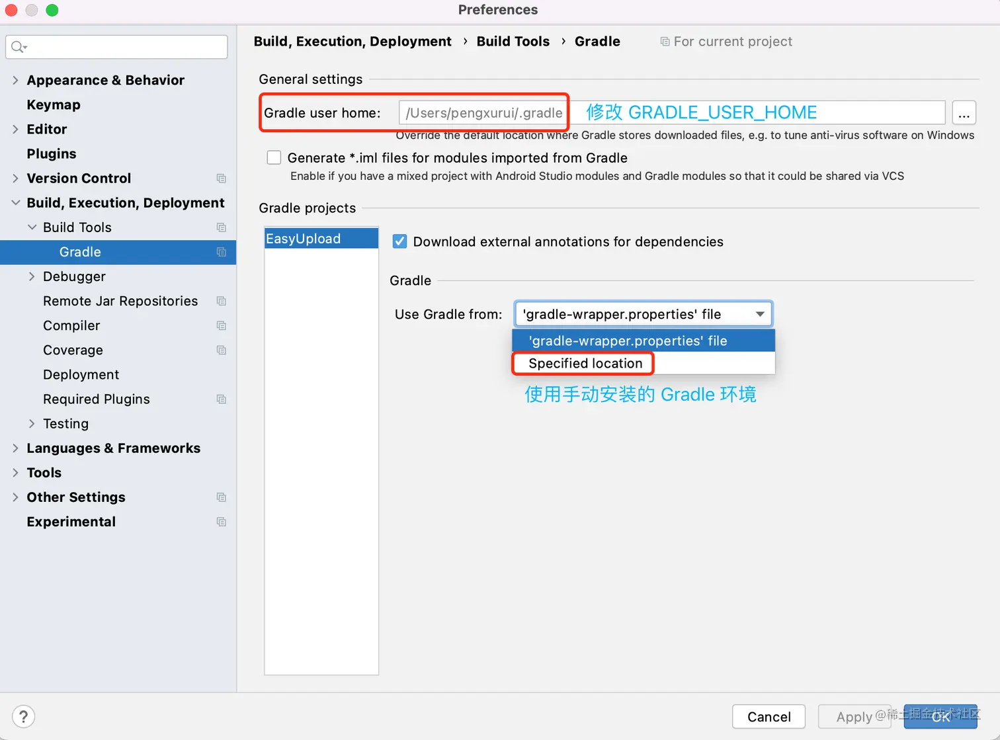

# Gradle 构建工具

> 文章大量抄袭与参考[彭佬](https://juejin.cn/post/7092367604211253256)，仅供个人记录使用

# 一、基础知识及背景

### 1.1 Gradle 的优缺点

相比于早期出现的构建工具，Gradle 能够脱颖而出主要是以下优点：

- **表达性的 DSL：** Gradle 构建脚本采用基于 Groovy 的 DSL 领域特定语言，而不是采用传统的 XML 文件，相比 Maven 等构建系统更加简洁；
- **基于 Java 虚拟机：** Groovy 语言基于 Java 虚拟机，这使得 Gradle 支持用 Java / Kotlin 代码编写构建脚本，我们完全可以只学习一小部分 Groovy 语法就能上手 Gradle 脚本，降低了 Gradle 的学习强度；
- **约定优先于配置：** Gradle 具有约定优先于配置的原则，即为属性提供默认值，相比 Ant 等构建系统更容易上手。我们在开发 Gradle 插件时也需要遵循这一原则。

Gradle 也有明显的缺点，例如：

- **较弱的向后兼容性：** Gradle 是一个快速发展的工具，新版本经常会打破向后兼容性，有经验的同学就知道，一个工程在低版本 Gradle 可以编译，但换了新版本 Gradle 可能就编译不通过了。

### 1.2 Gradle 工程的基本结构

典型的 gradle 工程目录如下：

```
.
├── a-subproject
│   └── build.gradle
├── build.gradle
├── settings.gradle
├── gradle.properties
├── local.properties
├── gradle
│   └── wrapper
│       ├── gradle-wrapper.jar
│       └── gradle-wrapper.properties
├── gradlew
└── gradlew.bat
```

**settings.gradle 文件：** 用于确定哪些模块参与构建；

**项目级 build.gradle 文件：** 用于定义所有子模块公共的配置参数；

**模块级 build.gradle 文件：** 用于定义子模块的配置参数，它可以覆盖项目级 build.gradle 文件中定义的配置；

**gradle/warpper：** 负责自动下载安装项目所需的 Gradle 环境的脚本；

**gradle.properties：** 用作项目级 Gradle 配置项，会覆盖全局的配置项；

**local.properties：** 用作项目的私有属性配置，例如 SDK 安装目录，一般不把 local.properties 加入版本控制。

### 1.3 Gradle 中的重要概念

- **Gradle：** 提供核心构建流程，但不提供具体构建逻辑；
- **Gradle 插件：** Gradle 提供的是一套核心的构建机制，而 Gradle 插件正是运行在这套机制上的一些具体构建逻辑，本质上和 .gradle 文件没有区别。例如，我们熟悉的 Android 构建流程就是由 Android Gradle Plugin 引入的构建逻辑；
- **Gradle Daemon：** 用于提升构建速度的后台进程；
- **Gradle Wrapper：** 对 Gradle 的封装，增加了自动下载安装 Gradle 环境的能力；
- **环境变量 GRADLE：** 用于定义 Gradle 的安装目录；
- **环境变量 GRADLE_USER_HOME：** 用于定义 Gradle 运行过程的文件存储目录，例如 Gradle Wrapper 自动安装的 Gradle 环境、构建缓存等；

### 1.4 Gradle Daemon

**[Gradle Daemon](https://link.juejin.cn?target=https%3A%2F%2Fdocs.gradle.org%2Fcurrent%2Fuserguide%2Fgradle_daemon.html) 是 Gradle 3.0 引入的构建优化策略，通过规避重复创建 JVM 和内存缓存的手段提升了构建速度。** Daemon 进程才是执行构建的进程，当构建结束后，Daemon 进程并不会立即销毁，而是保存在内存中等待承接下一次构建。根据官方文档说明，Gradle Daemon 能够降低 15-75% 的构建时间。

Daemon 的优化效果主要体现在 3 方面：

- **1、缩短 JVM 虚拟机启动时间：** 不需要重复创建；
- **2、JIT 编译：** Daemon 进程会执行 JIT 编译，有助于提升后续构建的字节码执行效率；
- **3、构建缓存：** 构建过程中加载的类、资源或者 Task 的输入和输出会保存在内存中，可以被后续构建复用。

相关的 Gradle 命令：

- **gradle —status：** 查看存活的 Daemon 进程信息；
- **gradle —stop：** 停止所有 Daemon 进程。

> **提示：** 并不是所有的构建都会复用同一个 Daemon 进程，如果已存活的 Daemon 进程无法满足新构建的需求，则 Gradle 会新建一个新的 Daemon 进程。影响因素：
>
> - Gradle 版本： 不同 Gradle 版本的构建不会关联到同一个 Daemon 进程；
> - Gradle 虚拟机参数： 不满足的虚拟机参数不会关联到同一个 Daemon 进程。

### 1.5 Gradle Wrapper

**Gradle Wrapper 本质是对 Gradle 的一层包装，会在执行 Gradle 构建之前自动下载安装 Gradle 环境。** 在开始执行 Gradle 构建时，如果当前设备中还未安装所需版本的 Gradle 环境，Gradle Wrapper 会先帮你下载安装下来，将来其他需要这个 Gradle 版本的工程也可以直接复用。


Android Studio 默认使用 Gradle Wrapper 执行构建，你可以在设置中修改这一行为：



命令行也有区分：

- `gradle` ：使用系统环境变量定义的 Gradle 环境进行构建；
- `gradlew` ：使用 Gradle Wrapper 执行构建。

为什么 Gradle 官方从早期就专门推出一个自动安装环境工具呢，我认为原因有 2 个：

- **确保 Gradle 版本正确性：** 鉴于 Gradle 有较弱向后兼容性的特点，Gradle Wrapper 能够从项目工程级别固化项目所需要的 Gradle 版本，从而确保同一个工程移植到其他电脑后能够正确地、可重复地构建；
- **减少了手动安装 Gradle 环境的工作量：** 单单从 Gradle 4 到 Gradle 7 就有大大小小十几个版本，而且每个工程所需要的 Gradle 版本不尽相同，使用 Gradle Wrapper 能够减少手动安装环境的工作量；

简单说下 Gradle Wrapper 相关的文件，主要有 4 个：

- **gradlew & gradlew.bat：** 在 Linux 或 Mac 上可用的 Shell 脚本，以及在 Window 上可用的 Batch 脚本，用于以 Gradle Wrapper 的方式执行构建。也就是说，在命令行使用 `gradlew` 才是基于 Gradle Wrapper 执行的，而使用 `gradle` 命令是直接基于系统安装的 Gradle 环境执行编译；

- **gradle-wrapper.jar：** 负责下载安装 Gradle 环境的脚本；

- gradle-wrapper.properties：

   Gradle Wrapper 的配置文件，主要作用是决定 Gradle 版本和安装目录：

  - distributionBase + distributionPath：指定 Gradle 环境安装路径；
  - zipStoreBase + zipStorePath：指定 Gradle 安装包的存储路径；
  - distributionUrl：指定版本 Gradle 的下载地址，通过这个参数可以配置项目工程所需要的 Gradle 版本。

```kotlin
# Gradle Daemon 开关，默认 ture
org.gradle.daemon=true  

# 虚拟机参数
org.gradle.jvmargs=-Xmx2048m -Dfile.encoding=UTF-8

# 多模块工程并行编译多个模块，会消耗更多内存
org.gradle.parallel=true  

```

> **提示：** GRADLE_USER_HOME 的默认值是 `用户目录/.gradle`，可以通过系统环境变量 GRADLE_USER_HOME 修改。

### 1.6 gradle.properties 构建环境配置

Gradle 是运行在 Java 虚拟机的，gradle.properties 文件可以配置 Gradle 构建的运行环境，并且会覆盖 Android Studio 设置中的全局配置，完整构建环境配置见官方文档：[Build Enviroment](https://link.juejin.cn?target=https%3A%2F%2Fdocs.gradle.org%2Fcurrent%2Fuserguide%2Fbuild_environment.html)。常用的配置项举例：

```kotlin
kotlin
复制代码# Gradle Daemon 开关，默认 ture
org.gradle.daemon=true  

# 虚拟机参数
org.gradle.jvmargs=-Xmx2048m -Dfile.encoding=UTF-8

# 多模块工程并行编译多个模块，会消耗更多内存
org.gradle.parallel=true  
```

除了构建环境配置，其他配置也可以用类似的键值对方式放在 gradle.properties 中，并直接在 .gradle 文件中引用。

# 二、Gradle 构建生命周期

Gradle 将构建划分为三个阶段： **初始化 - 配置 - 执行** 。理解构建生命周期（Gradle Build Lifecycle）非常重要，否则你可能连脚本中的每个代码单元的执行时机都搞不清楚。

## 2.1 初始化阶段

由于 Gradle 支持单模块构建或多模块构建，因此在初始化阶段（Initialization Phase），Gradle 需要知道哪些模块将参与构建。主要包含 4 步：

- 1、执行 Init 脚本：

  Initialization Scripts

   会在构建最开始执行，一般用于设置全局属性、声明周期监听、日志打印等。Gradle 支持多种配置 Init 脚本的方法，以下方式配置的所有 Init 脚本都会被执行：

  - gradle 命令行指定的文件：`gradle —init-script <file>`
  - USER_HOME/.gradle/init.gradle 文件
  - USER_HOME/.gradle/init.d/ 文件夹下的 .gradle 文件
  - GRADLE_HOME/init.d/ 文件夹下的 .gradle 文件

- **2、实例化 [Settings](https://link.juejin.cn?target=https%3A%2F%2Fdocs.gradle.org%2Fcurrent%2Fdsl%2Forg.gradle.api.initialization.Settings.html) 接口实例：** 解析根目录下的 `settings.gradle` 文件，并实例化一个 Settings 接口实例；

- **3、执行 settings.gradle 脚本：** 在 settings.gradle 文件中的代码会在初始化阶段执行；

- **4、实例化 Project 接口实例：** Gradle 会解析 `include` 声明的模块，并为每个模块 `build.gradle` 文件实例化 Project 接口实例。Gradle 默认会在工程根目录下寻找 include 包含的项目，如果你想包含其他工程目录下的项目，可以这样配置：

```gradle
// 引用当前工程目录下的模块
include ':app'

// 引用其他工程目录下的模块
include 'video' // 易错点：不要加’冒号 :‘
project(:video).projectDir = new File("..\\libs\\video")
```

> **提示：** 模块 build.gradle 文件的执行顺序和 include 顺序没有关系。

## 2.2 配置阶段

配置阶段（Configuration Phase）将执行 build.gradle 中的构建逻辑，以完成 Project 的配置。主要包含 3 步：

- **1、下载插件和依赖：** Project 通常需要依赖其他插件或 Project 来完成工作，如果有需要先下载；
- **2、执行脚本代码：** 在 build.gradle 文件中的代码会在配置阶段执行；
- **3、构造 Task DAG：** 根据 Task 的依赖关系构造一个有向无环图，以便在执行阶段按照依赖关系执行 Task。

> **提示：** 执行任何 Gradle 构建命令，都会先执行初始化阶段和配置阶段。

## 2.3 执行阶段

在配置阶段已经构造了 Task DAG，执行阶段（Execution Phase）就是按照依赖关系执行 Task。这里有两个容易理解错误的地方：

- **1、Task 配置代码在配置阶段执行，而 Task 动作在执行阶段执行；**
- **2、即使执行一个 Task，整个工程的初始化阶段和所有 Project 的配置阶段也都会执行，这是为了支持执行过程中访问构建模型的任何部分。**

> **原文：** This means that when a single task, from a single project is requested, *all* projects of a multi-project build are configured first. The reason every project needs to be configured is to support the flexibility of accessing and changing any part of the Gradle project model.

## 2.4 实践

```groovy
USER_HOME/.gradle/init.gradle

println 'init.gradle:This is executed during the initialization phase.'
```

```groovy
settings.gradle

rootProject.name = 'basic'
println 'settings.gradle:This is executed during the initialization phase.'
```

下面可以放在项目级也可以在模块级，在模块级改一下名字为`test1`

```groovy
build.gradle

println 'build.gradle:This is executed during the configuration phase.'

tasks.register('test') {
    doFirst {
        println 'build.gradle:This is executed first during the execution phase.'
    }
    doLast {
        println 'build.gradle:This is executed last during the execution phase.'
    }
    // 易错点：这里在配置阶段执行
    println 'build.gradle:This is executed during the configuration phase as well.'
}
```

在完成定义之后直接 build 或者 sync 是不会执行到 task 的！因此只能看到下面的结果：

```
Executing tasks: [:app:assembleDebug] in project /Users/bytedance/AndroidStudioProjects/testgradle

settings.gradle:This is executed during the initialization phase.

> Configure project :
build.gradle:This is executed during the configuration phase.

// ... 一堆官方 task

BUILD SUCCESSFUL in 169ms
31 actionable tasks: 31 up-to-date

Build Analyzer results available
```

如果想要执行 task 需要使用下面的命令：

```
gradle :test
gradle app:test1
```

然后就会自动创建了：


另一种方法是在下面调用一下：

```
project.test
```

## 2.5 生命周期监听

Gradle 提供了一系列监听构建生命周期流程的接口，大部分的节点都有直接的 Hook 点，这里我总结一些常用的：

- **1、监听初始化阶段**

Gradle 接口提供了监听 Settings 初始化阶段的方法：

```groovy
settings.gradle
// Settings 配置完毕
gradle.settingsEvaluated {
    ...
}

// 所有 Project 对象创建（注意：此时 build.gradle 中的配置代码还未执行）
gradle.projectsLoaded {
    ...
}
```

- **2、监听配置阶段**

Project 接口提供了监听当前 Project 配置阶段执行的方法，其中 afterEvaluate 常用于在 Project 配置完成后继续增加额外的配置，例如 Hook 构建过程中的 Task。

```groovy
// 执行 build.gradle 前
project.beforeEvaluate { 
    ...
}

// 执行 build.gradle 后
project.afterEvaluate { 
    ...
}
```

除此之外，Gradle 接口也提供了配置阶段的监听：

```groovy
// 执行 build.gradle 前
gradle.beforeProject { project ->
    ...
}

// 执行 build.gradle 后
gradle.afterProject { project ->
    // 配置后，无论成功或失败
    if (project.state.failure) {
        println "Evaluation of $project FAILED"
    } else {
        println "Evaluation of $project succeeded"
    }
}

// 与 project.beforeEvaluate 和 project.afterEvaluate 等价
gradle.addProjectEvaluationListener(new ProjectEvaluationListener() {
    @Override
    void beforeEvaluate(Project project) {
        ...
    }

    @Override
    void afterEvaluate(Project project, ProjectState projectState) {
        ...
    }
})

// 依赖关系解析完毕
gradle.addListener(new DependencyResolutionListener() {
    @Override
    void beforeResolve(ResolvableDependencies dependencies) {
        ....
    }

    @Override
    void afterResolve(ResolvableDependencies dependencies) {
        ....
    }
})

// Task DAG 构造完毕
gradle.taskGraph.whenReady {   
}

// 与 gradle.taskGraph.whenReady 等价
gradle.addListener(new TaskExecutionGraphListener() {
    @Override
    void graphPopulated(TaskExecutionGraph graph) {
        ...
    }
})

// 所有 Project 的 build.gradle 执行完毕
gradle.projectsEvaluated {
    ...
}
```

- **3、监听执行阶段**

Gradle 接口提供了执行阶段的监听：

```groovy
gradle.addListener(new TaskExecutionListener() {

    // 执行 Task 前
    @Override
    void beforeExecute(Task task) {
        ...
    }

    // 执行 Task 后
    @Override
    void afterExecute(Task task, TaskState state) {
        ...
    }
})

gradle.addListener(new TaskActionListener() {

    // 开始执行 Action 列表前，回调时机略晚于 TaskExecutionListener#beforeExecute
    @Override
    void beforeActions(Task task) {
        ...
    }

    // 执行 Action 列表完毕，回调时机略早于 TaskExecutionListener#afterExecute
    @Override
    void afterActions(Task task) {
        ...
    }
})

// 执行 Task 前
gradle.taskGraph.beforeTask { Task task ->
}

// 执行 Task 后
gradle.taskGraph.afterTask { Task task, TaskState state ->
    if (state.failure) {
        println "FAILED"
    }
    else {
        println "done"
    }
}
```

- **4、监听 Task 创建**

TaskContainer 接口提供了监听 Task 添加的方法，可以在 Task 添加到 Project 时收到回调：

```groovy
tasks.whenTaskAdded { task ->
}
```

- **5、监听构建结束**

当所有 Task 执行完毕，意味着构建结束：

```groovy
gradle.buildFinished {
    ...
}
```

# 三、Project 核心 API

[Project](https://link.juejin.cn?target=https%3A%2F%2Fdocs.gradle.org%2Fcurrent%2Fdsl%2Forg.gradle.api.Project.html) 可以理解为模块的构建管理器，在初始化阶段，Gradle 会为每个模块的 build.gradle 文件实例化一个接口对象。在 .gradle 脚本中编写的代码，本质上可以理解为是在一个 Project 子类中编写的。

## 4.1 Project API

Project 提供了一系列操作 Project 对象的 API：

- **getProject()：** 返回当前 Project；
- **getParent()：** 返回父 Project，如果在工程 RootProject 中调用，则会返回 null；
- **getRootProject()：** 返回工程 RootProject；
- **getAllprojects()：** 返回一个 Project Set 集合，包含当前 Project 与所有子 Project；
- **getSubprojects()：** 返回一个 Project Set 集合，包含所有子 Project；
- **project(String)：** 返回指定 Project，不存在时抛出 UnKnownProjectException；
- **findProject(String)：** 返回指定 Project，不存在时返回 null；
- **allprojects(Closure)：** 为当前 Project 以及所有子 Project 增加配置；
- **subprojects(Closure)：** 为所有子 Project 增加配置。

## 4.2 Project 属性 API

Project 提供了一系列操作属性的 API，通过属性 API 可以实现在 Project 之间共享配置参数：

- **hasProperty(String)：** 判断是否存在指定属性名；
- **property(Stirng)：** 获取属性值，如果属性不存在则抛出 MissingPropertyException；
- **findProperty(String)：** 获取属性值，如果属性不存在则返回 null；
- **setProperty(String, Object)：** 设置属性值，如果属性不存在则抛出 MissingPropertyException。

实际上，你不一定需要显示调用这些 API，当我们直接使用属性名时，Gradle 会帮我们隐式调用 property() 或 setProperty()。例如：

```
build.gradle

name => 相当于 project.getProperty("name")
project.name = "Peng" => 相当于 project.setProperty("name", "Peng")
```

### **4.2.1 属性匹配优先级**

Project 属性的概念比我们理解的字段概念要复杂些，不仅仅是一个简单的键值对。Project 定义了 4 种命名空间（scopes）的属性 —— **自有属性、Extension 属性、ext 属性、Task。** 当我们通过访问属性时，会按照这个优先级顺序搜索。

`getProperty()` 的搜索过程：

- 1、自有属性： Project 对象自身持有的属性，例如 rootProject 属性；
- 2、Extension 属性；
- 3、ext 属性；
- 4、Task： 添加到 Project 上的 Task 也支持通过属性 API 访问；
- 5、父 Project 的 ext 属性： 会被子 Project 继承，因此当 1 ~ 5 未命中时，会继续从父 Project 搜索。需要注意： **从父 Project 继承的属性是只读的；**
- 6、以上未命中，抛出 MissingPropertyException 或返回 null。

`setProperty()` 的搜索路径（由于部分属性是只读的，搜索路径较短）：

- 1、自有属性
- 2、ext 额外属性

> **提示：** 其实还有 Convention 命名空间，不过已经过时了，我们不考虑。

### **4.2.2 Extension 扩展**

Extension 扩展是插件为外部构建脚本提供的配置项，用于支持外部自定义插件的工作方式，其实就是一个对外开放的 Java Bean 或 Groovy Bean。例如，我们熟悉的 `android{}` 就是 Android Gradle Plugin 提供的扩展。

关于插件 Extension 扩展的更多内容，见下一篇文章。

### **4.2.3 ext 属性**

Gradle 为 Project 和 Task 提供了 ext 命名空间，用于定义额外属性。如前所述，子 Project 会继承 父 Project 定义的 ext 属性，但是只读的。我们经常会在 Root Project 中定义 ext 属性，而在子 Project 中可以直接复用属性值，例如：

```
项目 build.gradle

ext {
    kotlin_version = '1.4.31'
}

模块 build.gradle
// 如果子 Project 也定义了 kotlin_version 属性，则不会引用父 Project
implementation "org.jetbrains.kotlin:kotlin-stdlib-jdk7:$kotlin_version"
```

## 4.3 Project 文件 API

### **4.3.1 文件路径**

- **getRootDir()：** Project 的根目录（不是工程根目录）
- **getProjectDir()：** 包含 build 文件夹的项目目录
- **getBuildDir()：** build 文件夹目录

### **4.3.2 文件获取**

- **File file(Object path)：** 获取单个文件，相对位置从当前 Project 目录开始
- **ConfigurableFileCollection files(Object... paths)：** 获取多个文件，相对位置从当前 Project 目录开始

```kotlin
kotlin
复制代码def destFile = file('releases.xml')
if (destFile != null && !destFile.exists()) {
    destFile.createNewFile()
}
```

### **4.3.3 文件拷贝**

- **copy(Closure)：** 文件拷贝，参数闭包用于配置 [CodeSpec](https://link.juejin.cn?target=https%3A%2F%2Fdocs.gradle.org%2Fcurrent%2Fjavadoc%2Forg%2Fgradle%2Fapi%2Ffile%2FCopySpec.html) 对象

```kotlin
kotlin
复制代码copy {
    // 来源文件
    from file("build/outputs/apk")
    // 目标文件
    into getRootProject().getBuildDir().path + "/apk/"
    exclude {
        // 排除不需要拷贝的文件
    }
    rename {
        // 对拷贝过来的文件进行重命名
    }
}
```

### **4.3.4 文件遍历**

- **fileTree(Object baseDir)：** 将指定目录转化为文件树，再进行遍历操作

```kotlin
kotlin
复制代码fileTree("build/outputs/apk") { FileTree fileTree ->
    fileTree.visit { FileTreeElement fileTreeElement ->
        // 文件操作
    }
}
```

# 四、Task 核心 API

Project 的构建逻辑由一系列 [Task](https://link.juejin.cn?target=https%3A%2F%2Fdocs.gradle.org%2Fcurrent%2Fdsl%2Forg.gradle.api.Task.html) 的组成，每个 Task 负责完成一个基本的工作，例如 Javac 编译 Task、资源编译 Task、Lint 检查 Task，签名 Task等。在构建配置阶段，Gradle 会根据 Task 的依赖关系构造一个有向无环图，以便在执行阶段按照依赖关系执行 Task。

## 4.1 创建简单 Task

Gradle 支持两种创建简单 Task 的语法：

- **1、通过 task 关键字：**

```kotlin
// 创建名为 MyTask 的任务
task MyTask(group: "MyGroup") {
    // Task 配置代码
}
```

- 2、通过 TaskContainer 方法：

   通过 Project 的 

  TaskContainer

   属性，可以创建 Task，分为热创建和懒创建：

  - **Task create(String, Closure) 热创建：** 立即实例化 Task 对象；
  - **TaskProvider register(String, Closure) 懒创建：** 注册 Task 构造器，但不会实例化对象。创建 Task 操作会延迟到访问该 Task 时，例如通过 TaskProvider#get() 或 TaskContainer#getByName()。

```kotlin
// 创建名为 MyTask 的任务
project.tasks.create(name: "MyTask") {
    // Task 配置代码
}
```

## 4.2 创建增强 Task（自定义 Task 类型）

除了简单创建 Task 的方式，我们还可以自定义 Task 类型，Gradle 将这类 Task 称为增强 Task。增强 Task 的可重用性更好，并且可以通过暴露属性的方式来定制 Task 的行为。

- **1、DefaultTask：** 自定义 Task 必须继承 DefaultTask。

```kotlin
class CustomTask extends DefaultTask {
    final String message
    final int number
}
```

- **2、带参数创建 Task：** 除了可以在创建 Task 后配置属性值，我们也可以在调用 TaskContainer#create() 时传递构造器参数。为了将值传递给任务构造函数，必须使用 `@Inject` 注解修饰构造器。

```kotlin
class CustomTask extends DefaultTask {
    final String message
    final int number

    @Inject
    CustomTask(String message, int number) {
        this.message = message
        this.number = number
    }
}

// 第二个参数为 Task 类型
tasks.register('myTask', CustomTask, 'hello', 42)
```

## 4.3 获取已创建 Task

可以获取 TaskContainer 中已创建的任务，对于通过 register 注册的任务会在这个时机实例化。例如：

- **Task getByName(String)：** 获取 Task，如果 Task 不存在则抛出 UnKnownDomainObjectException；
- **Task findByName(String)：** 获取 Task，如果 Task 不存在则返回 null。

```kotlin
// 获取已创建的 Task
project.MyTask.name => 等同于 project.tasks.getByName("MyTask").name
```

## 4.4 设置 Task 属性

设置 Task 属性的语法主要有三种：

- **1、在创建 Task 时设置**

```kotlin
task MyTask(group: "MyGroup")
```

- **2、通过 setter 方法设置**

```kotlin
task MyTask {
    group = "MyGroup" => 等同于 setGroup("MyGroup")
}
```

- **3、通过 ext 额外属性设置：** Task 也支持与 Project 类似的额外属性。例如：

```kotlin
task MyTask(group:"111") {
    ext.goods = 2
}

ext.goods = 1

println MyTask.good

输出：2
```

Task 常用的自有属性如下：


**注意事项：**

- 严格避免使用带空格的 Task `name`，否则在一些版本的 Android Studio 中会被截断，导致不兼容；
- Android Studio 的 Gradle 面板会按照 `group` 属性对 Task 进行分组显示。其中， Tasks 组为 Root Project 中的 Task，其他分组为各个 Project 中的 Task，未指定 group 的 Task 会分配在 other 中。

## 4.5 执行 Task

- **1、命令行：** gradlew :[模块名]:[任务名]，例如：gradlew -q :app:dependencies
- **2、IDE 工具：** 通过 IDE 提供的用户界面工具执行，例如 Gradle 面板或绿色三角形，支持普通执行和调试执行；
- **3、默认任务：** 通过 Project#defaultTasks 可以指定 Project 配置阶段的默认任务，在配置阶段会执行（这说明 Task 是有可能在配置阶段执行的，了解即可，不用钻牛角尖）。

```
build.gradle

defaultTasks 'hello','hello2'

task hello {
    println "defaultTasks hello"
}

task hello2 {
    println "defaultTasks hello2"
}

输出：
> Configure project :easyupload
defaultTasks hello
defaultTasks hello2
--afterEvaluate--
--taskGraph.whenReady--
```

## 4.6 Task Action 动作

每个 Task 内部都保持了一个 Action 列表 `actions`，执行 Task 就是按顺序执行这个列表，Action 是比 Task 更细的代码单元。Task 支持添加多个动作，Task 提供了两个方法来添加 Action：

- **doFirst(Closure)：** 在 Action 列表头部添加一个 Action；
- **doLast(Closure)：** 在 Action 列表尾部添加一个 Action。

```kotlin
task MyTask

MyTask.doFirst{
    println "Action doFirst 1"
}

MyTask.doFirst{
    println "Action doFirst 2"
}

MyTask.doLast{
    println "Action doLast 1"
}

执行 MyTask 输出:

Action doFirst 2
Action doFirst 1
Action doLast 1
```

对于自定义 Task，还可以通过 `@TaskAction` 注解添加默认 Action。例如：

```kotlin
abstract class CustomTask extends DefaultTask {
    @TaskAction
    def greet() {
        println 'hello from GreetingTask'
    }
}
```

## 4.7 跳过 Task 的执行

并不是所有 Task 都会被执行，Gradle 提供了多个方法来控制跳过 Task 的执行：

- **1、onlyIf{}：** 闭包会在即将执行 Task 之前执行，闭包返回值决定了是否执行 Task；
- **2、enabled 属性：** Task 的 enabled 属性默认为 true，设置为 false 表示无效任务，不需要执行。

剩下两种方式允许在执行 Task 的过程中中断执行：

- 3、Task 异常：

   Task 提供了两个异常，能够当 Action 执行过程中抛出以下异常，将跳过执行并继续后续的构建过程：

  - **[StopActionException](https://link.juejin.cn?target=https%3A%2F%2Fdocs.gradle.org%2Fcurrent%2Fjavadoc%2Forg%2Fgradle%2Fapi%2Ftasks%2FStopActionException.html)：** 中断当前 Action，并继续当前 Task 的下一个 Action；
  - **[StopExecutionException](https://link.juejin.cn?target=https%3A%2F%2Fdocs.gradle.org%2Fcurrent%2Fjavadoc%2Forg%2Fgradle%2Fapi%2Ftasks%2FStopExecutionException.html)：** 中断当前 Task，并继续 Task 依赖树上的下一个 Action。

- **4、timeouts 属性：** 当 Task 执行时间到达 timeouts 超时时间时，执行线程会收到一个中断信号，可以借此许控制 Task 的执行时间（前提是 Task 要响应中断信号）。

## 4.8 Task 依赖关系

通过建立 Task 的依赖关系可以构建完成的 Task 有向无环图：

- **dependsOn 强依赖：** Task 通过 dependsOn 属性建立强依赖关系，可以直接通过 dependsOn 属性设置依赖列表，也可以通过 dependsOn() 方法添加一个依赖；
- **输入输出隐式依赖：** 通过建立 Task 之间的输入和输出关系，也会隐式建立依赖关系。例如 Transform Task 之间就是通过输入输出建立的依赖关系。

```kotlin
// 通过属性设置依赖列表
task task3(dependsOn: [task1, task2]) {
}

// 添加依赖
task3.dependsOn(task1, task2)

依赖关系：task3 依赖于 [task1, task2]，在执行 task3 前一定会执行 task1 和 task2
```

在某些情况下，控制两个任务的执行顺序非常有用，而不会在这些任务之间引入显式依赖关系，可以理解为弱依赖。 **任务排序和任务依赖关系之间的主要区别在于，排序规则不影响将执行哪些任务，只影响任务的执行顺序。**

- **mustRunAfter 强制顺序：** 指定强制要求的任务执行顺序；
- **shouldRunAfter 非强制顺序：** 指定非强制的任务执行顺序，在两种情况下会放弃此规则：1、该规则造成环形顺序；2、并行执行并且任务的所有依赖项都已经完成。

```kotlin
task3 mustRunAfter(task1, task2)
task3 shouldRunAfter(task1, task2)

依赖关系：无，在执行 task3 前不一定会执行 task1 和 task2
顺序关系：[task1, task2] 优先于 task3
```

## 4.9 Finalizer Task

给一个 Task 添加 Finalizer 终结器任务后，无论 Task 执行成功还是执行失败，都会执行终结器，这对于需要在 Task 执行完毕后清理资源的情况非常有用。

```kotlin
// taskY 是 taskX 的终结器
taskX finalizedBy taskY
```

# 五、增量构建

## 5.1 什么是增量构建？

任何构建工具都会尽量避免重复执行相同工作，这一特性称为 Incremental Build 增量构建，这一特性能够节省大量构建时间。例如编译过源文件后就不应该重复编译，除非发生了影响输出的更改（例如修改或删除源文件）。

Gradle 通过对比自从上一次构建之后，Task 的 `inputs` 和 `outputs` 是否变化，来决定是否跳过执行。如果相同，则 Gralde 认为 Task 是最新的，从而会跳过执行。在 Build Outputs 中看到 Task 名称旁边出现 `UP-TO-DATE` 标志，即说明该 Task 是被跳过的。例如：

```kotlin
> Task :easyupload:compileJava NO-SOURCE
> Task :easyupload:compileGroovy UP-TO-DATE
> Task :easyupload:pluginDescriptors UP-TO-DATE
> Task :easyupload:processResources UP-TO-DATE
> Task :easyupload:classes UP-TO-DATE
> Task :easyupload:jar UP-TO-DATE
> Task :easyupload:uploadArchives
```

那么，在定义 Task 的输入输出时，要遵循一个原则：如果 Task 的一个属性会影响输出，那么应该将该属性注册为输入，否则会影响 Task 执行；相反，如果 Task 的一个属性不会影响输出，那么不应该将该属性注册为输入，否则 Task 会在不必要时执行。

## 5.2 Task 输入输出

大多数情况下，Task 需要接收一些 input 输入，并生成一些 output 输出。例如编译任务，输入是源文件，而输出是 Class 文件。Task 使用 [TaskInputs](https://link.juejin.cn?target=https%3A%2F%2Fdocs.gradle.org%2Fcurrent%2Fjavadoc%2Forg%2Fgradle%2Fapi%2Ftasks%2FTaskInputs.html) 和 [TaskOutputs](https://link.juejin.cn?target=https%3A%2F%2Fdocs.gradle.org%2Fcurrent%2Fjavadoc%2Forg%2Fgradle%2Fapi%2Ftasks%2FTaskOutputs.html) 管理输入输出：

- **Task#inputs：** 返回 Task 的 TaskInputs 输入管理器；
- **Task#outputs：** 返回 Task 的 TaskOutputs 输出管理器。


对于 Task 的输入输出，我们用面向对象的概念去理解是没问题的。如果我们把 Task 理解为一个函数，则 Task 的输入就是函数的参数，而 Task 的输出就是函数的返回值。在此理解的基础上，再记住 2 个关键点：

- **1、隐式依赖：** 如果一个 Task 的输入是另一个 Task 的输出，Gradle 会推断出两者之间的强依赖关系；
- **2、在配置阶段声明：** 由于 Task 的输入输出会用于构建依赖关系，那么我们应该确保在配置阶段定义输入输出，而不是在执行阶段定义。

**Task 支持三种形式的输入：**

- **1、简单值：** 包括数值、字符串和任何实现 Serializable 的类；
- **2、文件：** 包括单个文件或文件目录；
- **3、嵌套对象：** 不满足以上两种条件，但其字段声明为输入。

```kotlin
public abstract class ProcessTemplates extends DefaultTask {

    @Input
    public abstract Property<TemplateEngineType> getTemplateEngine();

    @InputFiles
    public abstract ConfigurableFileCollection getSourceFiles();

    @Nested
    public abstract TemplateData getTemplateData();

    @OutputDirectory
    public abstract DirectoryProperty getOutputDir();

    @TaskAction
    public void processTemplates() {
        // ...
    }
}

public abstract class TemplateData {

    @Input
    public abstract Property<String> getName();

    @Input
    public abstract MapProperty<String, String> getVariables();
}
```

## 5.3 Task 输入输出校验

通过注解方式注册输入输出时，Gradle 会在配置阶段会对属性值进行检查。如果属性值不满足条件，则 Gradle 会抛出 `TaskValidationException` 异常。特殊情况时，如果允许输入为 null 值，可以添加 `@Optional` 注解表示输入可空。

- **@InputFile：** 验证该属性值不为 null，并且关联一个文件（而不是文件夹），且该文件存在；
- **@InputDirectory：** 验证该属性值不为 null，并且关联一个文件夹（而不是文件），且该文件夹存在；
- **@OutputDirectory：** 验证该属性值不为 null，并且关联一个文件夹（而不是文件），当该文件夹不存在时会创建该文件夹。

