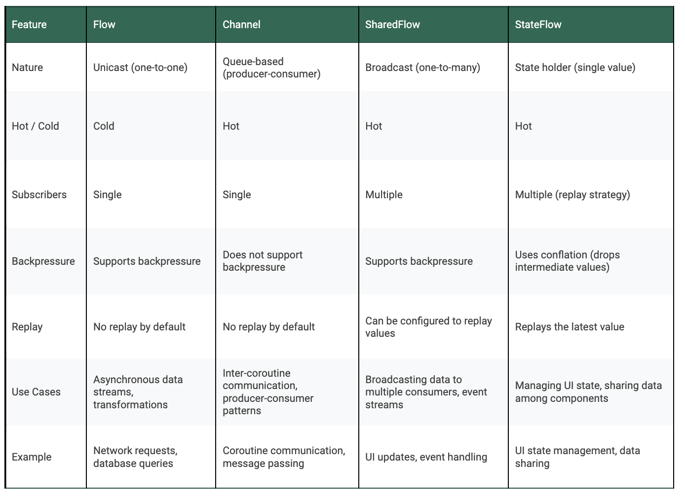

## Cold streams(冷流) VS Hot streams(热流)

### 热流

示例： `channel`, Collections (`List`, `Set` …). 

热流是**立即启动**的：也即无论是否有订阅者，都会发射值。

存储元素：存储的元素不需要重新计算，所有订阅者都**收到相同的值序列**。

### 冷流

示例： `Sequence`, `Flow`

冷流是**按需启动**的：只有当订阅者主动订阅时，冷流才开始发射值。其数据源是 lazy 的。

独立发射：每个订阅者都收到**自己独立的值序列**。冷流不存储任何元素。

## Channel

### 基本使用原则

* Channel 是一个热流
* Channel 保证不存在冲突（no problem with shared state）且公平。因此当不同的协程需要相互通信时，它们很有用。
* 支持任意数量的发送者和接收者。MPMC。
* 每一个发送到 Channel 的值都保证只接收一次。
* 如果有几个 receivers 同时订阅，发送的 value 将在 receivers 之间公平分配。（接收器的FIFO队列）。

```
对于公平性这点有个例子：
The channel has 3 receivers, by order of subscription: 
Receiver1, Receiver2, Receiver3.

All the receivers have already subscribed to the channel.

The channel emit 4 values: "A", "B", "C" then "D".

Receiver1 receives "A" and "D"
Receiver2 receives "B"
Receiver3 receives "C"
```

* Channel 有2个挂起函数：`send`、 `receive`。
* 如果 Channel 中没有元素，则`receive`将挂起，并将等待元素可用时恢复。
* 如果 Channel 达到其设置的容量，则`send`将暂停（通道容量见下文）。
* 我们还可以使用非挂起版本`trySend`和`tryReceive`，他们会返回 ChannelResult（告诉我们操作是否成功）。
* 一旦完成数据发送或发生异常时，Channel 需要手动调用关闭方法：`myChannel.off()`。否则 receivers 将一直挂起等待元素到来。

### 通道容量

```kotlin
val myChannel = Channel<Int>(capacity = 3)

// OR

val myChannel = produce(capacity = 3) {
  // emit values here
}
```

* `Channel.UNLIMITED`：无限制的 buffer，Channel 发送元素永远不会挂起。
* `Channel.BUFFERED`：buffer 容量为64。这个默认值可以用 JVM 中的系统属性 kotlinx.coroutines.channels.defaultBuffer 更改。
* `Channel.RENDEZVOUS`：（默认行为）缓冲区容量为 0。receiver 只有在数据发出时订阅了 sender 才会收到数据。
* `Channel.CONFLATED`：缓冲区容量为1。每个新元素替换前一个元素。
* 任何int值：缓冲区将具有 int 设置的容量。

### 处理 buffer 溢出

Channel 有一个参数onBufferOverflow，用于设置缓冲区填满时的行为。有3个选项：

* `BufferOverflow.SUSPEND`：（默认行为）缓冲区已满时挂起send方法。
* `BufferOverflow.DROP_OLDEST`：缓冲区已满时删除最旧的元素。
* `BufferOverflow.DROP_LATEST`：缓冲区已满时删除最新元素。

### 创建一个会自动关闭的 Channel

我们可以先使用 coroutine builder 启动一个协程，并在其中使用`produce`生成一个子协程。该子协程结束时会关闭 Channel（完成、停止或被取消）。

```kotlin
suspend fun myFunction() = coroutineScope {
  val channel = produce {
    // emit values here and don't need to call close() at the end
  }
}

// 可以参考：https://kotlinlang.org/api/kotlinx.coroutines/kotlinx-coroutines-core/kotlinx.coroutines.channels/produce.html

// 一个展示其及时关闭特性的例子
val channel = produce<Int> {
    send(1)
    send(2)
    try {
        send(3) // will throw CancellationException
    } catch (e: CancellationException) {
        println("The channel was cancelled!)
        throw e // always rethrow CancellationException
    }
}
check(channel.receive() == 1)
check(channel.receive() == 2)
channel.cancel()
```

### 当元素无法处理时，自动清理

如果 Channel 已关闭或取消，或者在`send`, `receive`, `hastNext`时抛出异常时，此时会导致有些元素无法进行处理，可能需要清理一下：

```kotlin
val myChannel = Channel(
  capacity,
  // 我们可以使用这个字段完成
  onUnderliveredElement = { /* clean up operations here */ }
)
```

### 例子：触发刷新

在 Android 中，Channel 常用于触发屏幕刷新（例如，下拉刷新列表或点击重试按钮）。下面的 Fragment 展示了当我们第一次订阅流或触发刷新时如何从API获取数据。

> 很多人使用 SharedFlow 来触发刷新，这是种有效但非最优的解决方案，因为 SharedFlow 被设计为存在多个 *receivers*（有关SharedFlow的更多详细信息，请参阅下文）。

```kotlin
// This is a simplify version to demonstrate how we can use channels. 
// In a real use case, we would require some extra logic to avoid 
// refreshing if the data is already loading for example.

interface ApiService {
  	// 向数据源获取数据
    suspend fun fetchData(): List<String>
}

class FetchDataUseCase @Inject constructor (
  private val apiService: ApiService
) {
  // create a channel with a buffer of 1 and will drop the newest data
  // so if we trigger refresh several times in a row we will only
  // keep the first element.
  private val refreshChannel = Channel<Unit>(
        capacity = 1, 
        onBufferOverflow = BufferOverflow.DROP_LATEST
    )

  // this flow can be received by the viewModel to build the UI state
  val dataState: Flow<FetchDataState> =
        refreshChannel
            // 注意：转换 channel 为一个 flow
            .consumeAsFlow()
            // emit an element on start to fetch data as soon as we subscribe 
            // to the flow
            .onStart { emit(Unit) }
            .map { fetchData() }

  fun refresh() {
    // We use the trySend function here to not have to create a 
    // suspend function and so we don't need a scope to call it.
    // this method can be called from the viewModel to trigger a refresh
    refreshChannel.trySend(Unit)
  }

  private suspend fun fetchData(): FetchDataState =
    try {
        val data = apiService.fetchData()
        FetchDataState.Success(data)
    } catch (e: Exception) {
        FetchDataState.Error(e.message ?: "An error occurred")
    }

   sealed interface FetchDataState {
        data object Loading : FetchDataState
        data class Success(val data: List<String>) : FetchDataState
        data class Error(val message: String) : FetchDataState
   }
}
```

## Flow

### 基本原则

* 冷流
* 开箱即用、支持结构化并发。
* Flow 的最后一个操作称为**终端操作** (`collect`, `first`, etc…)
* 一个 flow 可以有修改 flow 的**中间操作** (`map`, `onEach`, `flatMapLastest`, etc…).
* **终端操作**是挂起函数，需要协程 scope。
* 未捕获的异常会立即 cancel flow，`collect`方法将重新抛出异常。
* 默认情况下，流将从调用`collect`的协程上下文中获取其自身的上下文。

### 组合流

`merge`,`combine`, `zip`是我们会用到的组合流的三个终端操作。他们的差异如下：

* `merge`:

1. 不会修改任何元素。
2. 元素一产生就会发出，不会因为另一个流未产生元素而等待，而是按照自身的节奏产生值
3. 当有多个**应该使用相同操作**的事件源时使用。

```kotlin
flowA emits: 1
flowB emits: 2
flowA emits: 3

merge(flowA, flowB) produces 1, 2, 3
```

* `combine`:

1. **组合**来自不同 flow 的元素创建一个新的 flow。
2. 需要一个函数来指定元素**如何组合在一起**。
3. 在 combine 得到**新最终元素**之前，需要等待较慢的 flow 第一次发出值。
4. 当一个流产生一个新元素时，它会替换它的上一个值并**立即组合以发出一个新最终值**（combine 不会等待每个流发出的每一个新元素）。

```kotlin
flowA emits: 1
flowB emits: 2
flowA emits: 3

flowA.combines(flowB) { fA, fB -> fA + fB } produces 3 (1+2) then 5 (3+2)
```

* `zip`:

1. 组合来自不同 flow 的元素以创建新 flow。
2. 需要一个函数来指定元素**如何组合在一起**。
3. 需要等待每个流都发出一个值时才能创建对。
4. 元素只能是一对的一部分。没有一对的元素会丢失。

```
flowA emits: 1
flowB emits: 2
flowA emits: 3

flowA.zip(flowB) {fA, fB -> fA + fB } produces 3 (1+2 and 3 is dropped)
```

### fold 和 scan 的区别

`fold`和`scan`都通过一个**描述值如何组合在一起的函数**将单个流发出的所有值组合到一个元素中。不同点在于：

* `fold`是一个终端操作。它会 suspend 直到 flow 产生最终值。
* `scan`是一个中间操作，产生所有中间值

```kotlin
val myflow = flowOf(1, 2, 3, 4)
myFlow.fold(0) { acc, newElement -> acc + newElement } // produces 10

myFlow.scan(0) { acc, newElement -> acc + newElement } 
// produces 1, 3 (1+2), 6 (3+3), 10 (6+4)
```

### flatMapConcat, flatMapMerge and flatMapLatest

* 它们都是**中间操作**。
* 通过在元素上**应用另一个 flow** 来转换原始流发出的元素并返回另一个流

```kotlin
myFlowA.flatMapConcat { fA -> myFlowB(fA) } // return value produced by flow B
```

**flatMapConcat**：

* 将调用该方法的原始流中每个发出的元素转换为流，并**按顺序连接**最终生成的多个流。
* 在调用该方法的原始流中**发出的第一个元素转换为的新 flow 中元素发送完毕**时，再开始下一个元素转换为 flow 的处理。
* 用例：用于按顺序处理转换出来的内部流。

**flatMapMerge**

* 将调用该方法的原始流中每个发出的元素转换为流，并**并发的合并**生成的流。
* 所有生产的内部流中都会在可用时发出值，可能会乱序。
* 用例：用于同时处理内部流并且不关心发出值的顺序场景。

**flatMapLatest**

* 将调用该方法的原始流中每个发出的元素转换为流，**在新的内部类发新值时取消之前的内部流流**，并**从最新的流中发出值**。
* 只有**最新的内部流处于活动状态**，其值被发出。以前的流被取消。
* 用例：只关心最新的值并希望取消以前的操作场景。

```kotlin
data class User(val id: Int, val name: String)
data class UserDetails(val userId: Int, val address: String)

fun fetchUserData(): Flow<User> = flow {
    emit(User(1, "Alice"))
    delay(500)
    emit(User(2, "Bob"))
    delay(500)
    emit(User(3, "Charlie"))
}

fun fetchUserDetails(userId: Int): Flow<UserDetails> = flow {
    delay(1000) // Simulate network delay
    emit(UserDetails(userId, "$userId's address"))
}

// flatMapConcat
fetchUserData()
  .flatMapConcat { user ->
      fetchUserDetails(user.id)
  }
  .collect { userDetails ->
      println("flatMapConcat: ${userDetails}")
  }
// Each user's details are fetched sequentially.
// flatMapConcat: UserDetails(userId=1, address=1's address)
// flatMapConcat: UserDetails(userId=2, address=2's address)
// flatMapConcat: UserDetails(userId=3, address=3's address)

// flatMapMerge
fetchUserData()
  .flatMapMerge { user ->
      fetchUserDetails(user.id)
  }
  .collect { userDetails ->
      println("flatMapMerge: ${userDetails}")
  }
// User details might be interleaved due to concurrent fetching.
// flatMapMerge: UserDetails(userId=1, address=1's address)
// flatMapMerge: UserDetails(userId=2, address=2's address)
// flatMapMerge: UserDetails(userId=3, address=3's address)

// flatMapLatest
fetchUserData()
  .flatMapLatest { user ->
      fetchUserDetails(user.id)
  }
  .collect { userDetails ->
      println("flatMapLatest: ${userDetails}")
  }
// Only the details for the last user are fetched and printed because 
// new users cancel previous fetches.
// flatMapLatest: UserDetails(userId=3, address=3's address)
```

### 转换函数为一个流

```kotlin
val function = suspend {
  // this is suspending lambda expression
  // define function here
}

function.asFlow()
```

或者：

```kotlin
suspend fun myFunction(): Flow<T> {
  // define function here
}

::myFunction.asFlow()
```

### 创建一个在订阅之前就生成元素的Flow

`channelFlow`函数是流和 channel 之间的混合体————它既能产生热流，但也实现了 Flow 接口。

```kotlin
val myChannelFlow = channelFlow {
  val myData = // fetch data here
  send(myData)
}

suspend fun fetchData() {
  myData.first()
}
```

### 修改一个 Flow 的上下文

```kotlin
myFlow
  .flowOn(Dispatchers.IO)

// OR

myFlow
  .flowOn(CoroutineName("NewName"))
```

### 启动Flow时避免额外的嵌套

```kotlin
// instead of this
viewModelScope.launch {
  myFlow
    .collect()
}

// do this
myFlow
  .launchIn(viewModelScope)
```

## SharedFlow

* 是热流。
* 可以有多个 receivers，它们都将接收相同的值。
* 主要用于：向多个 receivers 广播值、希望在 APP 的不同部分之间共享状态或事件。
* 在关闭整个协程 scope 之前永远不会走到 completed 状态。
* 有一个可变版本 MutableSharedFlow，允许我们通过使用挂起函数`emit`来发出新值更新状态。
* 可以使用非挂起版本`tryEmit`。
* 支持可配置的 replay 和 buffer 溢出策略。
* SharedFlow 的所有方法都是线程安全的，无需外部同步即可在并发协程安全调用。

### 配置参数

Kotlin 为我们提供了一种有用的方法来创建`MutableSharedFlow`并定义我们希望缓冲区的行为方式：

```kotlin
public fun <T> MutableSharedFlow(
    // the number of values replayed to new subscribers
    replay: Int = 0, 
    // the number of values buffered in addition to `replay`
    extraBufferCapacity: Int = 0,
    // action on buffer overflow
    // Possible values: SUSPEND, DROP_OLDEST, DROP_LATEST
    onBufferOverflow: BufferOverflow = BufferOverflow.SUSPEND
): MutableSharedFlow<T>
```

### shareIn function

* 将 flow 转换为 SharedFlow。
* 当我们想将一个 flow 转换为多个 flow 时很有用。
* 第一个参数为协程 scope，用于启动协程并收集流的元素。
* 第二个参数决定了 sharedFlow 何时开始**监听 flow** 发出的值。需要一个`SharingStarted`对象（见下文）。
* 第三个参数，replay（默认为0），它定义 replay 给**新订阅者**的值的数量。

```kotlin
public fun <T> Flow<T>.shareIn(
    scope: CoroutineScope,
    started: SharingStarted,
    replay: Int = 0
): SharedFlow<T>
```

### `SharingStarted`

> 参考：https://blog.p-y.wtf/whilesubscribed5000?source=post_page-----cb8157d4f848--------------------------------

* `SharingStarted.Eagerly`：**立即开始**监听元素，并且在协程 scope 被 cancel 之前永远不会停止。
* `SharingStarted.Lazily`：**当第一个订阅者出现时**开始监听，并且在协程 scope 被 cancel 之前永远不会停止。
* `SharingStarted.WhileSubscribe()`：当第一个订阅者出现时开始监听，并**在最后一个订阅者消失时立即停止**。我们可以通过`stopTimeoutMillis`参数配置最后一个订阅者消失时，需要多少延迟（以毫秒为单位）才真正停止共享协程。

关于`WhileSubscribed`的注意事项：

* 在例如从一个 APP 触发（如相机应用程序）新 intnet 的场景中，原 Activity 会暂停，此时`SharedFlow`将不再有订阅者，并将停止发射。而返回原 Activity 时，将重新订阅，此时可能再次在流中运行操作。这可能会导致问题或重新触发不必要的操作。

注意`SharingStarted.Eagally`和`SharingStarted.Lazily`：

* 如果使用`ViewModelScope`或`LifeycleScope`，`SharedFlow`将在 lifecycle 走向 destroy 时停止发送元素。

### 转换一个流为 SharedFlow

```kotlin
// from a viewModel or a class with a lifeCycleScope
myFlow.shareIn(
  scope = viewModelScope
  started = SharingStarted.Lazily
)

// from a class without a lifeCycleScope (repository or use case)

suspend fun myFunction() = coroutineScope {
  myFlow.shareIn(
    scope = this
    started = SharingStarted.Lazily
  )
}
```

### 例子：从多个位置观察数据库更改

如果用过`Room`库处理数据库场景的话，应该知道它支持开箱即用的`Flow`。因此，它可以观察数据库中的更改并在新数据可用时立即接收。

但是考虑到从磁盘读取数据可能会很重，如果我们需要在多个组件中接收数据数据的话，可以使用SharedFlow来避免必须为每个组件获取数据。在此示例中，演示了如何获取一次用户设置，但在多个组件上接收更新：

```kotlin
// simple DAO to fetch the data from Room
@Dao
interface UserSettingsDao {
  // fetch all the user settings from the database and emit a flow
  @Query("SELECT * FROM user_settings")
  fun getAll(): Flow<List<UserSettings>>
}

class UserSettingsRepository @Inject constructor(
  private val dao: UserSettingsDao
) {

  // We only read from the DB once and all the receiver will receive the
  // data that is computed here.
  suspend fun getAll(): SharedFlow<List<UserSettings>> = coroutineScope {
    dao.getAll.shareIn(
      // pass down the scope
      scope = this,
      // only start emitting when we have a receiver
      started = SharingStarted.Lazily,
      // replay the latest element when a new receiver subscribe to it
      replay = 1
    )
  }
}
```

## StateFlow

### 基本原则

* 与`replay`参数设置为1的`SharedFlow`行为类似。
* 始终只存储一个值。
* 可以使用`value`属性访问存储的值。
* 我们需要在构造函数中设置初始值。
* LiveData的现代替代品。
* 如果新元素等于前一个元素，则不会发出新元素。

### 设置和读取值

```kotlin
val state = MutableStateFlow("A") // initial value is A

state.value = "B" // set value to B

state.value = "B" // this won't emit a new element because the value is already B

val myValue = state.value // read value from the state, here "B"
```

### stateIn function

* 用于将 flow 转换为`StateFlow`。
* 需要指定协程 scope。
* 有2个变体，一个挂起，一个不挂起

**stateIn suspending**

挂起，直到流的第一个元素发出并计算出新值

```kotlin
suspend fun myFunction() = coroutineScope {
  myFlow.stateIn(this)
}
```

**stateIn not suspending**

* 在其`startalValue`参数中需要一个初始值。
* 它的第二个参数`started`需要一个`SharingStarted`元素。（有关此参数的更多详细信息，参阅上面的SharedFlow shareIn）。

```kotlin
myFlow.stateIn(
  scope = viewModelScope,
  started = SharingStarted.Lazily,
  initialValue = "A"
)
```

### 用例：将数据从viewModel发送到 UI

```kotlin
class MyViewModel @Inject constructor(
    private val fetchDataUseCase: FetchDataUseCase
) : ViewModel() {
    
    val myState: StateFlow<MyState> =
        fetchDataUseCase.dataState
            .map { 
                when (it) {
                    is FetchDataUseCase.FetchDataState.Loading -> MyState.Loading
                    is FetchDataUseCase.FetchDataState.Success -> MyState.Success(it.data)
                    is FetchDataUseCase.FetchDataState.Error -> MyState.Error(it.message)
                }
            }
            // transform flow into a state flow
            .stateIn(
                // set the scope to the viewModel so we will stop
                // listening when the viewModel is destroyed
                scope = viewModelScope,
                started = SharingStarted.WhileSubscribed(5_000),
                initialValue = MyState.Loading
            )
    
    
    sealed interface MyState {
        data object Loading : MyState
        data class Success(val data: List<String>) : MyState
        data class Error(val message: String) : MyState
    }
}

@Composable
fun MyScreen(viewModel = MyViewModel()) {
  val state = viewModel.myState.collectAsStateWithLifecycle()
  when (state) {
    is MyState.Loading -> // show loading view
    is MyState.Success -> // show success view
    is MyState.Error -> // show error view
  } 
}
```


## 对比图

