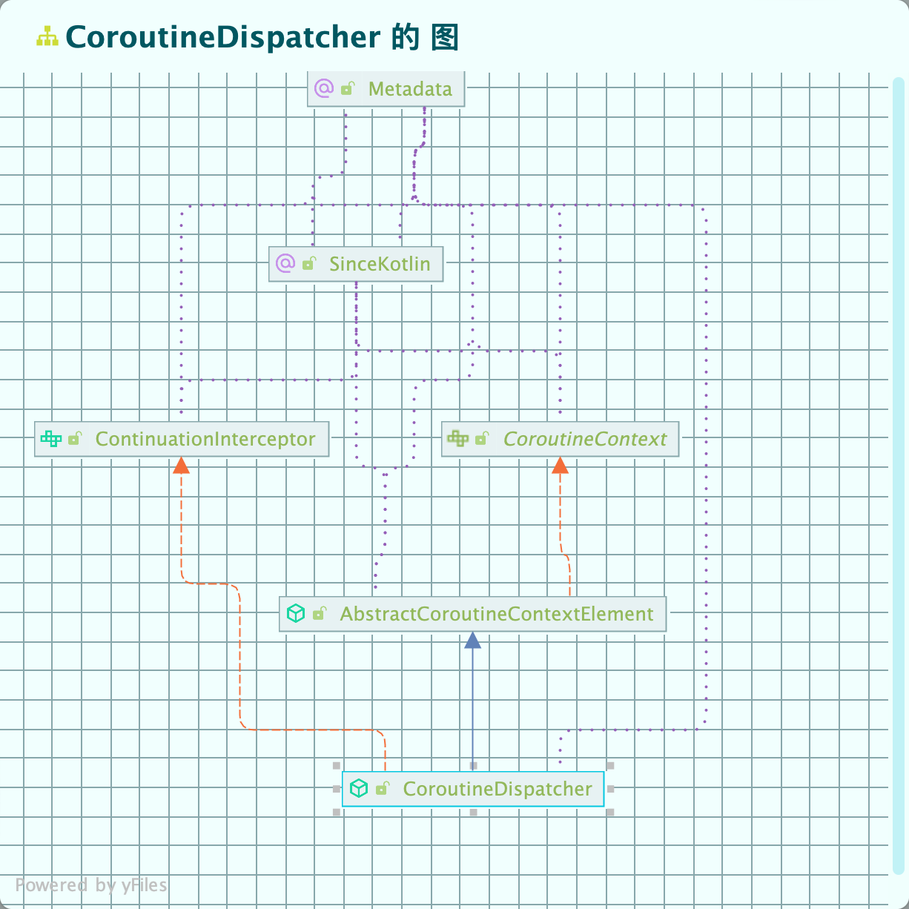
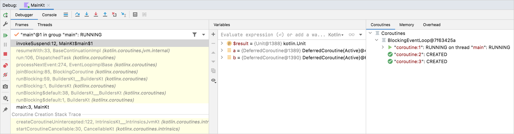

# Kotlin 中的异步

## 基础组件

### Defer&Job

在 kotlin 中，Future 或者 promise 是称之为 Defer(延期) 的东西。这个取名的含义在官方给到了解释：

> `Deferred` represents a concept known by other names such as `Future` or `Promise`. It stores a computation, but it **defers** the moment you get the final result; it *promises* the result sometime in the **future**.

在 kotlin 中，async 会启动一个新的 coroutine，并且返回一个 Defer 类型。这个 coroutine 本质上就是 Rust 中的一个 Future，其执行的时间点是在创建出来的时候就会执行，同样的，也是在`.await`时可以维护一个 happens-before 关系，我们看个例子：

```kotlin
import kotlinx.coroutines.*

fun main() = runBlocking {
  	// 启动一个预期返回 Int 的 coroutine
    val deferred: Deferred<Int> = async {
        loadData()
    }
    println("waiting...")
  	// 将 coroutine 放入 Executor 中执行
    println(deferred.await())
  	println("End")
}

suspend fun loadData(): Int {
    println("loading...")
    delay(1000L)
    println("loaded!")
    return 42
}

// 输出
waiting...
loading...
loaded!
42
End

// 去掉 await 输出，可以看到 happens-before End 的关系没了
waiting...
End
loading...
loaded!
```

上面代码中还有一层很重要的含义是，在 runBlocking(本质上是 Runtime 中的 Executor)中，异步代码的执行是一个**非阻塞的**，我们同样可以理解 runBlocking 为一个根 task。

除了 Defer 外，kotlin 还有另一种异步类型————Job，kotlin 将不返回值的 Defer/Future 定义为了一个 Job，其由 launch 函数返回:

```kotlin
fun main() = runBlocking {
  	// 执行一个 Job
    val job = launch {
        printData()
    }
    println("End")
}

suspend fun printData() {
    println("Job waiting...")
    delay(1000L)
    println("print 42!")
}

// 输出
End
Job waiting...
print 42!
```

这里可以看到 Job 和 Defer 的核心区别——Job 是不需要返回值的。同样的，Job 不会阻塞线程，也即其不会阻塞 Executor。Job 的执行对应用测的观察来说，和多线程呈现高度的相似性。如果我们想要其阻塞的话，只需要加上`job.join()`：

```kotlin
fun main() = runBlocking {
    val job = launch {
        printData()
    }
    job.join()
    println("End")
}

// 输出
Job waiting...
print 42!
End
```

此时会像多线程一样，确保一个 coroutine 间的 happen-before 关系。除此之外，借鉴于 Rust 的`spawn_blocking`，kotlin 中处理计算密集型任务而不阻塞 Executor 也可以这么来用：

```kotlin
fun main() {
    println("--Starting--")
    runBlocking {
        println("runBlocking waiting...")
        val t = thread {
            println("before sleep")
            Thread.sleep(2000)
            println("after sleep")
        }
        println("end...")
    }
    println("--End--")
}

// 打印
--Starting--
runBlocking waiting...
end...
before sleep
--End--
after sleep
```

不同的是，在这里我并不能确认这个线程的调度是否会受到 kotlin runtime 的影响，但是我能确定的是，此时他是自动被 join 起来的。如果我们也想要在异步块中确定其 happens-before 关系，也可以使用 join：

```kotlin
fun main() {
    println("--Starting--")
    runBlocking {
        println("runBlocking waiting...")
        val t = thread {
            println("before sleep")
            Thread.sleep(2000)
            println("after sleep")
        }
        t.join()
        println("end...")
    }
    println("--End--")
}

// 输出
--Starting--
runBlocking waiting...
before sleep
after sleep
end...
--End--
```

最后，一系列的 defer，kotlin 还提供了语法糖来进行统一处理：

```kotlin
import kotlinx.coroutines.*

fun main() = runBlocking {
    val deferreds: List<Deferred<Int>> = (1..3).map {
        async {
            delay(1000L * it)
            println("Loading $it")
            it
        }
    }
    val sum = deferreds.awaitAll().sum()
    println("$sum")
}
```

#### 类比 Rust

类比的来看，在 Rust 中，Future 就是一个很单纯的 Future，对比来看，更像是 Kotlin 中的 suspend 函数：

```rust
fn main() {
    let rt1 = Runtime::new().unwrap();
  	// Rust 中的 future，此时，这个 future 就是一个类似的 defer
    let defer = async  {
        println!("loading");
        sleep(Duration::from_millis(1000)).await;
        println!("loaded!");
        42
    };
    println!("--Starting--");
    rt1.block_on(async {
      	println!("waiting...");
      	// 在
        let res = defer.await;
        println!("Get! res={res}");
    });
    println!("--End--")
}

// 输出
--Starting--
waiting...
loading
loaded!
Get! res=42
--End--
```

future 本身创建时不会被执行，而是在`.await`时阻塞的执行，这个和 Defer 有着本质的差别。

而 Job 和 Defer 在 Rust 有着相同的体现，也即 Task 的概念：

```rust
fn main() {
    let rt1 = Runtime::new().unwrap();
  
    println!("--Starting--");
    rt1.block_on(async {
      	// 启动一个 task，会立即执行
        let job = spawn(async {
            sleep(Duration::from_millis(20)).await;
            println!("spawn task")
        });
        println!("running before task");

    });
    println!("--End--")
}

// 输出
--Starting--
end
--End--
```

可以看到，在输出中，压根没有 spawn task，因为在 spawn 开始的时候，task 就立即执行了，然后 tokio 的 sleep 会将其 yield 出去，此时，由于没有 join 的机制，导致了根 task 直接运行结束，Executor 被销毁，task 再也没有被调度回来。这个意义上，job 和 task 是等价的，不同的是，在 Rust 中，join 的机制就是 await：

```rust
fn main() {
    let rt1 = Runtime::new().unwrap();
  
    println!("--Starting--");
    rt1.block_on(async {
      	// 启动一个 task，会立即执行
        let job = spawn(async {
            sleep(Duration::from_millis(20)).await;
            println!("spawn task")
        });
      	job.await.unwrap();
        println!("running before task");

    });
    println!("--End--")
}

// 输出
--Starting--
spawn task
running before task
--End--
```

除此之外，Rust 还有一个阻塞线程的方法(注意，不是上面这种阻塞 Executor 的)：

```rust
fn main() {
    let rt1 = Runtime::new().unwrap();

    println!("--Starting--");
    rt1.block_on(async {
        println!("waiting...");
        let handle = spawn_blocking(|| {
            println!("loading");
            thread::sleep(Duration::from_millis(20));
            println!("loaded!");
            42
        });
        let res = handle.await.unwrap();
        println!("Get! res={res}");
    });
    println!("--End--")
}

// 输出
--Starting--
waiting...
loading
loaded!
Get! res=42
--End--
```

这个输出是强行 join 的，实际上我们不加`await`那两行之后：

```rust
fn main() {
    let rt1 = Runtime::new().unwrap();

    println!("--Starting--");
    rt1.block_on(async {
        println!("waiting...");
        let handle = spawn_blocking(|| {
            println!("loading");
            thread::sleep(Duration::from_millis(20));
            println!("loaded!");
            42
        });
      	println!("after...")
    });
    println!("--End--")
}

// 输出
--Starting--
waiting...
after...
--End--
loading
loaded!
```

可以看到，`spawn_blocking`既没有阻塞根 task(或者说异步 Executor)，也没有阻塞 main 线程。实际上，`spawn_blocking`是在 tokio 的 blocking 线程中执行的，有着上限数量，这个接口的出现就是为了防止某些计算密集型函数阻塞住 Executor，而线程级别的阻塞 tokio 是无能为力的，甚至 Executor 都会被限制住。当然这本质上是因为操作系统线程本来就没有一个可以强行关闭的低层级 API，我们都是使用原子内存来进行线程间通信的。

#### 深入 Job

在概念上，Job 是一个可取消的任务，其生命周期以 completion 为终点。

Job 可以按照父子的树层次结构进行排列，其实就是典型的 Task/Thread 设计。其中取消父 Job 会立即递归地取消所有子 Job。子 Job 如果因为除了CancellationException 之外的异常而失败的话，将会立即取消其父 Job，进而取消其所有其他子 Job。这种行为可以使用SupervisorJob进行定制。

最基本的 Job 接口实例是这样创建的：

1. 使用launch协程构建器创建**Coroutine job**。它运行指定的代码块，并在此代码块完成时达到 Completed 以结束。

2. 使用Job()工厂函数创建[**CompletableJob**](https://kotlinlang.org/api/kotlinx.coroutines/kotlinx-coroutines-core/kotlinx.coroutines/-completable-job/index.html) 。通过调用CompletableJob.complete来完成它。

在概念上，Job 的执行不会输出一个返回值。(Deferred接口是用于产生结果的 Job)。

```
                                          wait children
    +-----+ start  +--------+ complete   +-------------+  finish  +-----------+
    | New | -----> | Active | ---------> | Completing  | -------> | Completed |
    +-----+        +--------+            +-------------+          +-----------+
                     |  cancel / fail       |
                     |     +----------------+
                     |     |
                     V     V
                 +------------+                           finish  +-----------+
                 | Cancelling | --------------------------------> | Cancelled |
                 +------------+                                   +-----------+

```

通常情况下，Job 是在 Active 状态下创建的（即创建并启动）。但是，当提供可选启动参数的协程构建器在将此参数设置为`CoroutineStart.LAZY`时，其会创建一个 New 状态的协程。通过调用 start 或 join 可以激活 Job 为 Active 状态。

当协程在 completing 时，都会一直处于 Active 状态，直到 CompletableJob 完成，或者直到它失败或被取消。

具有异常的 Active Job 的 Fail 会使其被 cancel。Job 也可以随时通过`cancel()`函数取消，这会立即将其转换为 cancelling 状态。当 Job 完成剩余执行其工作并且所有子 Job 完成时，Cancelling Job 将会处于 Cancelled 状态。

Active 协程体的完成或调用CompletableJob.complete都可以将 Job 转换为完成状态。在 completed 状态中，它会等待所有子 Job 完成后再过渡到 Completed 状态。需要注意的是，Completed 状态完全是 Job 的内部状态。对于外部观察者来说，Completed 的 Job 仍然是 Active 的，而实际上在内部，它只是在等待其子 Job Completed。

### 上下文，Executor

提到 Executor 就需要提到 Context，对于异步 Runtime 来说，Context 是实现树形 task 关系的重中之重。在 Kotlin 中，协程始终在由标准库中 CoroutineContext 类型的值所表示/继承出来的某个上下文中执行。协程上下文是一组各种元素(名字就是 Element)，其中的元素包括了协程的 Job 以及它的dispatcher，这在本节中进行了介绍。

#### Dispatcher

我们先来看看 Dispatcher 的 UML 图：



其中，。CoroutineContext 是一个接口，它的实现包括协程调度器（请参阅CoroutineDispatcher），因此 Dispatcher 本质上就是一个 Context。

协程调度器主要是用于确定相应协程在其中执行时使用的线程。协程调度器可以将协程执行限制在特定线程上，将其分派到线程池，或让其以无限制方式运行。所有类似 launch 和 async 的协程构建器都接受一个可选的 CoroutineContext 参数，该参数可用于明确指定新协程的调度器和其他上下文元素。举个例子：

```kotlin
fun main() = runBlocking<Unit> {
    launch { // context of the parent, main runBlocking coroutine
        println("main runBlocking      : I'm working in thread ${Thread.currentThread().name}")
    }
    launch(Dispatchers.Unconfined) { // not confined -- will work with main thread
        println("Unconfined            : I'm working in thread ${Thread.currentThread().name}")
    }
    launch(Dispatchers.Default) { // will get dispatched to DefaultDispatcher 
        println("Default               : I'm working in thread ${Thread.currentThread().name}")
    }
    launch(newSingleThreadContext("MyOwnThread")) { // will get its own new thread
        println("newSingleThreadContext: I'm working in thread ${Thread.currentThread().name}")
    }    
}

// 输出：
nconfined            : I'm working in thread main @coroutine#3
Default               : I'm working in thread DefaultDispatcher-worker-2 @coroutine#4
main runBlocking      : I'm working in thread main @coroutine#2
newSingleThreadContext: I'm working in thread MyOwnThread @coroutine#5
```

大部分情况下，我们使用 Default 即可，它提供了一个线程池作为协程的 Executor。需要注意的是 Unconfined 这个配置，The Dispatchers.Unconfined coroutine dispatcher 会在**调用线程**中启动协程，但是，**仅仅持续到第一个 suspend point 之前**。在 suspend 之后，它会在由被调用方来确定的执行线程中恢复协程。Unconfined 调度程序适用于**既不消耗 CPU 时间**也**不更新任何特定线程**的共享数据（如 UI）的协程.

与之相对的是 Confined 调度。默认情况下，调度程序从外部 CoroutineScope 继承。对于我们最常用的 runBlocking 协程，默认调度程序限定在调用者线程中，因此继承它会将执行**限定在**这个线程中，并具有可预测的FIFO调度效果，我们看个对比的例子:

```kotlin
fun main() = runBlocking<Unit> {
    launch(Dispatchers.Unconfined) { // not confined -- will work with main thread
        println("Unconfined      : I'm working in thread ${Thread.currentThread().name}")
        delay(500)
        println("Unconfined      : After delay in thread ${Thread.currentThread().name}")
    }
    launch { // context of the parent, main runBlocking coroutine
        println("main runBlocking: I'm working in thread ${Thread.currentThread().name}")
        delay(1000)
        println("main runBlocking: After delay in thread ${Thread.currentThread().name}")
    }    
}

// 输出
Unconfined      : I'm working in thread main @coroutine#2
main runBlocking: I'm working in thread main @coroutine#3
Unconfined      : After delay in thread kotlinx.coroutines.DefaultExecutor @coroutine#2	// 切线程了
main runBlocking: After delay in thread main @coroutine#3
```

> 非受限调度程序是一种特殊的机制，主要是针对于某些边缘情况下发挥作用。他们的特点在于：
>
> * 有可能产生不良 side effect 的情况下，需要立即执行协程的调度(协程中的某些操作必须立即执行。)
> * 一般不应该在通用代码中使用非受限调度程序。

#### 切换线程

上面提到了`newSingleThreadContext`这种 Dispatcher，其是使用用户自己定义的线程作为协程的运行时的。在此抽象之下，协程任务抛到某一个线程中处理会是一个很简单的流程：

```kotlin
// 打开 VM 选项：-Dkotlinx.coroutines.debug

fun log(msg: String) = println("[${Thread.currentThread().name}] $msg")

fun main() {
//sampleStart
    newSingleThreadContext("Ctx1").use { ctx1 ->
        newSingleThreadContext("Ctx2").use { ctx2 ->
            runBlocking(ctx1) {
                log("Started in ctx1")
                withContext(ctx2) {
                    log("Working in ctx2")
                }
                log("Back to ctx1")
            }
        }
    }
//sampleEnd
}

// 输出
[Ctx1 @coroutine#1] Started in ctx1
[Ctx2 @coroutine#1] Working in ctx2
[Ctx1 @coroutine#1] Back to ctx1
```

可以看到 log 在不同的线程中打印了出来。而一般来说，UI 线程会去处理各种渲染相关的任务且一定不能阻塞，因此，我们也可以直接抛到主线程：

```kotlin
// 一个实际 UI 更新的小例子，外层是默认 Dispatcher
launch(Dispatchers.Default) {
  	// 数据操作
    loadContributorsChannels(service, req) { users, completed ->
			  // 获取到返回值之后抛到 UI 线程上去
        withContext(Dispatchers.Main) {
            updateResults(users, startTime, completed)
        }
    }
}.setUpCancellation()
```

#### Context & Element

在 kotlin 中，将 Context 抽象为了各种各样的 Element，Context 由多个 Element 共同构成，且他们直接实现了加法。这样的好处是，我们可以较为灵活的组装 Context：

```kotlin
launch(Dispatchers.Default + CoroutineName("test")) {
    println("I'm working in thread ${Thread.currentThread().name}")
}

// 输出
I'm working in thread DefaultDispatcher-worker-1 @test#2
```

其中 Context 有一个大类是 ThreadLocal，支持我们将一些线程本地数据传递给协程或协程之间进行通信。但是，由于它们并没有绑定到任何特定的线程，如果手动完成，这可能会导致一些问题。kotlin 对于 ThreadLocal，提供了 asContextElement 扩展函数来进行处理。这个函数会创建一个额外的 Context Element，该 Element 将会存储 ThreadLocal 的值，并在每次协程切换其上下文时恢复该值：

```kotlin
val threadLocal = ThreadLocal<String?>() // declare thread-local variable

fun main() = runBlocking<Unit> {
    threadLocal.set("main")
    println("Pre-main, current thread: ${Thread.currentThread()}, thread local value: '${threadLocal.get()}'")
    val job = launch(Dispatchers.Default + threadLocal.asContextElement(value = "launch")) {
        println("Launch start, current thread: ${Thread.currentThread()}, thread local value: '${threadLocal.get()}'")
        yield()
        println("After yield, current thread: ${Thread.currentThread()}, thread local value: '${threadLocal.get()}'")
    }
    job.join()
    println("Post-main, current thread: ${Thread.currentThread()}, thread local value: '${threadLocal.get()}'")    
}

// 输出
Pre-main, current thread: Thread[main @coroutine#1,5,main], thread local value: 'main'
Launch start, current thread: Thread[DefaultDispatcher-worker-1 @coroutine#2,5,main], thread local value: 'launch'
After yield, current thread: Thread[DefaultDispatcher-worker-2 @coroutine#2,5,main], thread local value: 'launch'
Post-main, current thread: Thread[main @coroutine#1,5,main], thread local value: 'main'
```


## 不同 task 之间的顺序

### kotlin 的策略

我们假设有两个期望有着先后顺序的函数，并且外部必须在这两个函数返回之后拿到返回值去进行计算：

```kotlin
suspend fun doSomethingUsefulOne(): Int {
    delay(1000L) // pretend we are doing something useful here
    return 13
}

suspend fun doSomethingUsefulTwo(): Int {
    delay(1000L) // pretend we are doing something useful here, too
    return 29
}
```

在这两个 suspend 函数之间，他们二者本身就是确保顺序的:

```kotlin
fun main() = runBlocking<Unit> {
    val time = measureTimeMillis {
        val one = doSomethingUsefulOne()
        val two = doSomethingUsefulTwo()
        println("The answer is ${one + two}")
    }
    println("Completed in $time ms")    
}
```

但是需要注意的是，此时是通过阻塞 Executor 完成的保序，本身不提供并发特性，上面代码打印出来的会是：

```
The answer is 42
Completed in 2017 ms
```

在上面的例子中我们可以知道，`.await`或者`join()`可以确保任务的执行一定早于该时间点，因此我们可以修改为并发的：

```kotlin
fun main() = runBlocking<Unit> {
    val time = measureTimeMillis {
        val one = async { doSomethingUsefulOne() }
        val two = async { doSomethingUsefulTwo() }
        println("The answer is ${one.await() + two.await()}")
    }
    println("Completed in $time ms")    
}

// 输出
The answer is 42
Completed in 1035 ms
```

可以看到，时间大大缩短，而`.await`保证了他们的 happens-before 关系。除此之外，kotlin 中的 job 是支持懒加载的，这个很关键：

```kotlin
fun main() = runBlocking<Unit> {
    val time = measureTimeMillis {
        val one = async(start = CoroutineStart.LAZY) { doSomethingUsefulOne() }
        val two = async(start = CoroutineStart.LAZY) { doSomethingUsefulTwo() }
        // some computation
        one.start() // start the first one
        two.start() // start the second one
        println("The answer is ${one.await() + two.await()}")
    }
    println("Completed in $time ms")    
}
```

此时 job 的整个生命周期都由我们来把握了。但实际上，Kotlin 十分建议我们使用结构化并发的方式来进行书写——使用一个 scope 包裹起来两个方法：

```kotlin
suspend fun concurrentSum(): Int = coroutineScope {
    val one = async { doSomethingUsefulOne() }
    val two = async { doSomethingUsefulTwo() }
    one.await() + two.await()
}
```

好处在于，如果 scope 内部并行进行求和的两个函数中，任意一个内部出现问题，并抛出异常，所有在其 scope 启动的协程都将被取消，这将保证安全性：

```kotlin
fun main() = runBlocking<Unit> {
    try {
        failedConcurrentSum()
    } catch(e: ArithmeticException) {
        println("Computation failed with ArithmeticException")
    }
}

suspend fun failedConcurrentSum(): Int = coroutineScope {
    val one = async<Int> { 
        try {
            delay(Long.MAX_VALUE) // Emulates very long computation
            42
        } finally {
            println("First child was cancelled")
        }
    }
    val two = async<Int> { 
        println("Second child throws an exception")
        throw ArithmeticException()
    }
    one.await() + two.await()
}

// 输出
Second child throws an exception
First child was cancelled
Computation failed with ArithmeticException
```

### Rust 的策略

类似的，单纯的 future 的执行，在 rust 中也可以使用`.await`来保证先后顺序：

```rust
#[tokio::main]
async fn main() {
    let start = Local::now();
    let res1 = task_one().await;
    let res2 = task_two().await;
    let dual = Local::now() - start;

    println!("Dual = {}ms, res={}", dual.num_milliseconds().to_string(), res1 + res2)
}

async fn task_one() -> i32 {
    sleep(Duration::from_millis(1000)).await;
    20
}

async fn task_two() -> i32 {
    sleep(Duration::from_millis(2000)).await;
    42
}

// 输出
Dual = 3004s, res=62
```

此时也同样是一个阻塞的函数，同样的，我们也可以改写为两个 task 来增加并发性：

```rust
#[tokio::main]
async fn main() {
    let start = Local::now();
    let handle1 = spawn(task_one());
    let handle2 = spawn(task_two());
    let res = handle1.await.unwrap() + handle2.await.unwrap();

    let dual = Local::now() - start;
    println!("Dual = {}ms, res={}", dual.num_milliseconds().to_string(), res)
}

// 输出
Dual = 2003ms, res=62
```

还有就是：

```rust
#[tokio::main]
async fn main() {
    let tr = TaskTracker::new();
    let start = Local::now();
    let (s, mut r) = mpsc::channel(100);

    for idx in 0..10 {
        let send = s.clone();
        let result = tr.spawn(async move {
            sleep(Duration::from_millis(1000)).await;
            send.send(10).await.unwrap();
        });
    }

    let mut res = 0;
    while let Ok(i) = r.try_recv() {
        res += i;
    }
    tr.close();
    tr.wait().await;

    let dual = Local::now() - start;
    println!("Dual = {}ms, res={}", dual.num_milliseconds().to_string(), res)
}

// 输出
Dual = 1003ms, res=0
```

## Cancel

### Kotlin 中的 cancel

在 kotlin 中 cancel 是一个合作的概念，通过下面的例子来进行说明：

```kotlin
fun main() = runBlocking {
    val startTime = System.currentTimeMillis()
    val job = launch(Dispatchers.Default) {
        var nextPrintTime = startTime
        var i = 0
        while (i < 5) { // computation loop, just wastes CPU
            // print a message twice a second
            if (System.currentTimeMillis() >= nextPrintTime) {
                println("job: I'm sleeping ${i++} ...")
                nextPrintTime += 500L
            }
        }
    }
    delay(1300L) // delay a bit
    println("main: I'm tired of waiting!")
    job.cancelAndJoin() // cancels the job and waits for its completion
    println("main: Now I can quit.")    
}

// 输出
job: I'm sleeping 0 ...
job: I'm sleeping 1 ...
job: I'm sleeping 2 ...
main: I'm tired of waiting!
job: I'm sleeping 3 ...
job: I'm sleeping 4 ...
main: Now I can quit.
```

可以看到，虽然 cancel 和 join 都执行了，但是还是继续调度并执行了一部分 job 中的内容。实际上，kotlin 中的 coroutine 是没法直接 cancel 掉的，它被设计为了协作 cancel。当 cancel 被调用的时候，该 coroutine 中的 suspend 函数再次被调用会触发`JobCancellationException`:

```kotlin
fun main() = runBlocking {
    val job = launch(Dispatchers.Default) {
        repeat(5) { i ->
            try {
                // print a message twice a second
                println("job: I'm sleeping $i ...")
                delay(500)
            } catch (e: Exception) {
                // log the exception
                println(e)
            }
        }
    }
    delay(1300L) // delay a bit
    println("main: I'm tired of waiting!")
    job.cancelAndJoin() // cancels the job and waits for its completion
    println("main: Now I can quit.")    
}

// 输出
job: I'm sleeping 0 ...
job: I'm sleeping 1 ...
job: I'm sleeping 2 ...
main: I'm tired of waiting!
kotlinx.coroutines.JobCancellationException: StandaloneCoroutine was cancelled; job="coroutine#2":StandaloneCoroutine{Cancelling}@47009ed4
job: I'm sleeping 3 ...
kotlinx.coroutines.JobCancellationException: StandaloneCoroutine was cancelled; job="coroutine#2":StandaloneCoroutine{Cancelling}@47009ed4
job: I'm sleeping 4 ...
kotlinx.coroutines.JobCancellationException: StandaloneCoroutine was cancelled; job="coroutine#2":StandaloneCoroutine{Cancelling}@47009ed4
main: Now I can quit.
```

官方推荐我们使用状态去协作时的在 coroutine 内部检查 cancel 的状态：

```kotlin
fun main() = runBlocking {
    val startTime = System.currentTimeMillis()
    val job = launch(Dispatchers.Default) {
        var nextPrintTime = startTime
        var i = 0
        while (isActive) { // cancellable computation loop
            // print a message twice a second
            if (System.currentTimeMillis() >= nextPrintTime) {
                println("job: I'm sleeping ${i++} ...")
                nextPrintTime += 500L
            }
        }
    }
    delay(1300L) // delay a bit
    println("main: I'm tired of waiting!")
    job.cancelAndJoin() // cancels the job and waits for its completion
    println("main: Now I can quit.")    
}

// 输出
job: I'm sleeping 0 ...
job: I'm sleeping 1 ...
job: I'm sleeping 2 ...
main: I'm tired of waiting!
main: Now I can quit.
```

而资源的释放则可以利用这个特性———— cancel 之后下一次调用 suspend 函数时会触发 Exception：

```kotlin
fun main() = runBlocking {
    val job = launch {
        try {
            repeat(1000) { i ->
                println("job: I'm sleeping $i ...")
                delay(500L)
            }
        } finally {
            println("job: I'm running finally")
        }
    }
    delay(1300L) // delay a bit
    println("main: I'm tired of waiting!")
    job.cancelAndJoin() // cancels the job and waits for its completion
    println("main: Now I can quit.")    
}

// 打印
job: I'm sleeping 0 ...
job: I'm sleeping 1 ...
job: I'm sleeping 2 ...
main: I'm tired of waiting!
job: I'm running finally
main: Now I can quit.
```

此时，job 不会一直执行到结束，在第一次 catch 到 CancellingException 时会进入 finally 块完成资源的释放。在 finally 块中尝试使用 suspend 函数会导致 CancellationException，因为此时运行此代码的协程已被取消。通常情况下，这不会是问题，因为所有行为良好的关闭操作（关闭文件、取消作业或关闭任何类型的通信通道）通常都是非阻塞的，并不涉及任何 suspend 函数。但是，在某些情况下，需要在已取消的协程中 suspend 并进行一些操作，此时 Kotlin 提供了 withContext 函数和 NonCancellable 上下文，只需要将相应的代码包装在withContext(NonCancellable) {...}中，如下面的示例所示：

```kotlin
fun main() = runBlocking {
    val job = launch {
        try {
            repeat(1000) { i ->
                println("job: I'm sleeping $i ...")
                delay(500L)
            }
        } finally {
            withContext(NonCancellable) {
                println("job: I'm running finally")
                delay(1000L)
                println("job: And I've just delayed for 1 sec because I'm non-cancellable")
            }
        }
    }
    delay(1300L) // delay a bit
    println("main: I'm tired of waiting!")
    job.cancelAndJoin() // cancels the job and waits for its completion
    println("main: Now I can quit.")    
}

// 输出
job: I'm sleeping 0 ...
job: I'm sleeping 1 ...
job: I'm sleeping 2 ...
main: I'm tired of waiting!
job: I'm running finally
job: And I've just delayed for 1 sec because I'm non-cancellable
main: Now I can quit.
```

### 对比 Rust 中的 abort

在 Rust 中，cancel 不是一个协作式的，abort 就会直接将任务取消。上面 kotlin 的第一个例子我们可以改写为：

>  需要注意的是，cancel 只有在 .await 被调用时才会真的被执行，且有可能会出现执行完毕之后再 cancel 的情况

```rust
fn now() -> String {
    Local::now().format("%F %T").to_string()
}

fn main() {
    let rt1 = Runtime::new().unwrap();
		
    println!("--Starting, now={}--", now());
    rt1.block_on(async {
        let task = spawn(async {
            for idx in (0..500) {
                println!("task: I'm running idx={idx}");
                tokio::time::sleep(Duration::from_millis(200)).await;
            }
        });
        tokio::time::sleep(Duration::from_millis(1300)).await;
        println!("main: I'm tired of waiting!");
        task.abort();
        println!("main: task is finished={}", task.is_finished());
      	
      	// 注意这个代码
        while !task.is_finished() {
            sleep(Duration::from_millis(200)).await
        }
        println!("main: Now I can quit.")
    });
    println!("--End, now={}--", now())
}

// 输出
--Starting, now=2024-02-26 15:44:55--
task: I'm running idx=0
task: I'm running idx=1
task: I'm running idx=2
task: I'm running idx=3
task: I'm running idx=4
task: I'm running idx=5
task: I'm running idx=6
main: I'm tired of waiting!
main: task is finished=false
main: Now I can quit.
--End, now=2024-02-26 15:44:56--
```

可以看到 abort 之后没有再打印什么代码，而是直接给结束了。这里可以看到 Rust 中，abort 不是一个协作时的设计。资源的释放上 Rust 的 RAII 机制更为简单，我们添加一个用于测试的 struct：

```rust
struct DropData(String);

impl Drop for DropData {
    fn drop(&mut self) {
        println!("{:?}: is dropped", self.0)
    }
}
```

然后把上面的代码修改为：

```rust
fn main() {
    let rt1 = Runtime::new().unwrap();
    let defer = async  {
        println!("loading");
        sleep(Duration::from_millis(1000)).await;
        println!("loaded!");
        42
    };
    println!("--Starting, now={}--", now());
    rt1.block_on(async {
        let task = spawn(async {
            let mut vec = vec![];
            for idx in (0..500) {
                println!("task: I'm running idx={idx}");
                let drop_data = DropData(format!("DropData{}", idx));
                vec.push(drop_data);
                tokio::time::sleep(Duration::from_millis(200)).await;
            }
        });
        tokio::time::sleep(Duration::from_millis(1300)).await;
        println!("main: I'm tired of waiting!");
        task.abort();
        println!("main: task is finished={}", task.is_finished());
        while !task.is_finished() {
            sleep(Duration::from_millis(200)).await
        }
        println!("main: Real finished! I can quit.")
    });
    println!("--End, now={}--", now())

}

// 输出
--Starting, now=2024-02-26 17:00:33--
task: I'm running idx=0
task: I'm running idx=1
task: I'm running idx=2
task: I'm running idx=3
task: I'm running idx=4
task: I'm running idx=5
task: I'm running idx=6
main: I'm tired of waiting!
main: task is finished=false
"DropData0": is dropped
"DropData1": is dropped
"DropData2": is dropped
"DropData3": is dropped
"DropData4": is dropped
"DropData5": is dropped
"DropData6": is dropped
main: Real finished! I can quit.
--End, now=2024-02-26 17:00:35--
```

可以看到，在 abort task 的时候，RAII 机制保证了数据的安全 drop。对 cancel 的处理的话，Rust 和 kotlin 都是推荐用类似的方法————channel 通知来搞：

> 我们参照[Chayim Friedman 老哥的代码](https://stackoverflow.com/questions/73528236/how-to-terminate-a-blocking-tokio-task)

```rust
use tokio::task;
use tokio::sync::{oneshot, mpsc};

#[tokio::main]
async fn main() {
    let (incoming_tx, mut incoming_rx) = mpsc::channel(2);
    // A new channel to communicate when the process must finish.
    let (term_tx, mut term_rx) = oneshot::channel();
    // Some blocking task that never ends
    let queue_reader = task::spawn_blocking(move || {
        // As long as termination is not signalled
        while term_rx.try_recv().is_err() {
            // Stand in for receiving messages from queue
            incoming_tx.blocking_send(5).unwrap();
        }
    });

    let mut acc = 0;
    // Some complex condition that determines whether the job is done
    while acc < 95 {
        tokio::select! {
            Some(v) = incoming_rx.recv() => {
                acc += v;
            }
        }
    }
    assert_eq!(acc, 95);
    // Signal termination
    term_tx.send(()).unwrap();
    println!("Finalizing thread");
    queue_reader.await.unwrap();
    println!("Done");
}
```

这老哥的代码是个很好的例子，展示了基于 channel 的两个 task 之间的通知和关闭机制。task 像 main 传递信息，当 main 接收到的数据累加到 95 之后，main 发送一个信息去关闭 task，此时**不是通过 abort 的方式去关闭的**，其实本质上也是 thread 的关闭策略了。

> 这个例子的启示在于，使用 abort 是无法关闭这种 CPU-bound 的 task 的，因为本质上等同于关闭 thread，而其中没有任何的 .await 点使得 tokio 甚至无法介入。虽然 tokio 建议不要在 task 中写这种阻塞的代码，但谁谁知道呢，再良好的设计也会劣化。因此，最好的方法就是：
>
> 1. 框死不要在 task 中写阻塞代码。
> 2. 使用 channel 来优雅的进行关闭。

#### Rust 中更为复杂的 cancel

此外，用于通知和资源回收的还可以使用官方建议的策略：

```rust
#[tokio::main]
async fn main() {
    // Step 1: Create a new CancellationToken
    let token = CancellationToken::new();

    // Step 2: Clone the token for use in another task
    let cloned_token = token.clone();

    // Task 1 - Wait for token cancellation or a long time
    // 这个 task 是被 cancel 的 task
    let task1_handle = tokio::spawn(async move {
        tokio::select! {
        // Step 3: Using cloned token to listen to cancellation requests
        _ = cloned_token.cancelled() => {
                // The token was cancelled, task can shut down
                println!("Task1: Do cancel")
        }
        _ = tokio::time::sleep(std::time::Duration::from_secs(9999)) => {
            // Long work has completed
        }
    }
    });

    // Task 2 - Cancel the original token after a small delay
    tokio::spawn(async move {
        println!("Task2: before sleep");
        tokio::time::sleep(std::time::Duration::from_millis(10)).await;

        // Step 4: Cancel the original or cloned token to notify other tasks about shutting down gracefully
        token.cancel();
        println!("Task2: cancel task1");
        sleep(Duration::from_millis(1000)).await;
        println!("Task2: End");
    });

    // Wait for tasks to complete
    task1_handle.await.unwrap()
}

// 输出
Task2: before sleep
Task2: cancel task1
Task1: Do cancel
```

可以看到，task2 专门起来用于 cancel task1 并进行一些处理的。当 cancel 掉 task1 的时候，task2 也被 cancel 了，此时最后一行日志没有打出来。而根据最开始的知识，我们可以确定，task1 一定是 happens-before .await 的，`.await`之后会发现`task1_handle`已经被 move 了。但是此时有个问题，`.await`方法本质上只是调度 task 的执行，在`.await`的下一行我们并不能保证 task 已经资源释放完毕了，我们需要一个保序的策略。实际上，配合 cancelationToken 的还有 TaskTracker，它就是做这个事的：

```rust
// 一个耗时任务的抽象
async fn background_task(num: u64) {
    for i in 0..10 {
        time::sleep(Duration::from_millis(100*num)).await;
        println!("Background task {} in iteration {}.", num, i);
    }
}

#[tokio::main]
async fn main() {
    let tracker = TaskTracker::new();
    let token = CancellationToken::new();
		
  	// 分配了 10 个 task
    for i in 0..10 {
        let token = token.clone();
        tracker.spawn(async move {
            // Use a `tokio::select!` to kill the background task if the token is
            // cancelled.
            tokio::select! {
              	// 某些耗时任务
                () = background_task(i) => {
                    println!("Task {} exiting normally.", i);
                },
                () = token.cancelled() => {
                    // Do some cleanup before we really exit.
                    time::sleep(Duration::from_millis(50)).await;
                    println!("Task {} finished cleanup.", i);
                },
            }
        });
    }

    // Spawn a background task that will send the shutdown signal.
    {
        let tracker = tracker.clone();
        tokio::spawn(async move {
            // Normally you would use something like ctrl-c instead of
            // sleeping.
            time::sleep(Duration::from_secs(2)).await;
            tracker.close();
            token.cancel();
        });
    }

    // Wait for all tasks to exit.
    tracker.wait().await;

    println!("All tasks have exited now.");
}
```

TaskTracker 的主要作用是补齐了`CancellationToken`无法确保所有 task 都完成关闭的时间点的问题。它在`wait()`方法调用之后，可以安全的保证，所有 task 的关闭以及资源回收一定 happens-before `wait()`方法。

最后就是，tokio 的主 create 中有一个类似于 TaskTracker 的数据结构——JoinSet，JoinSet 类型有比 TaskTracker 更多的特性，所以只有在需要 TaskTracker 的独特功能时才应使用 TaskTracker：

- 当任务退出时，TaskTracker允许任务**立即**释放它的内存。
- 不关闭 TaskTracker 的情况下(调用`close()`)，即使TaskTracker为空，wait也会被阻止返回(上面的代码会卡死)。
- TaskTracker不需要可变访问权即可插入任务。
- TaskTracker可以被克隆以与多个任务共享。

**第一点是最重要的**。因为在 JoinSet 中，其跟踪每个插入任务的返回值，而这意味着如果调用者持续插入任务而从不调用 join_next，它们的返回值就会不断积累并消耗内存，即使此时大部分的任务已经退出。这中情况下，可能会导致进程耗尽内存。使用TaskTracker则不会发生这种情况。一旦任务退出，它们就会立即从TaskTracker中移除。

正常情况下，我们需要使用`join_next`来使得所有的 task 执行完毕，例如下面的代码：

```rust
#[tokio::main]
async fn main() {
    let mut set = JoinSet::new();

    for i in 0..10 {
        set.spawn(async move { i });
    }

    let mut seen = [false; 10];
    
    while let Some(res) = set.join_next().await {
        let idx = res.unwrap();
        seen[idx] = true;
    }

    for i in 0..10 {
        assert!(seen[i]);
    }
}
```

但是如果一个都不掉用的话，我们写个小例子：

```rust
struct DropData(String);

impl Drop for DropData {
    fn drop(&mut self) {
        println!("{:?}: is dropped", self.0)
    }
}

#[tokio::main]
async fn main() {
    let mut set = JoinSet::new();

    for i in 0..10 {
        set.spawn(async move {
            println!("Task{}: End", i);
            DropData(format!("DropData: {i}"))
        });
    }

    println!("Main: End");
}

// 输出
Task0: End
Task4: End
Task6: End
Task1: End
Task9: End
Main: End
Task3: End
"DropData: 3": is dropped
Task2: End
"DropData: 2": is dropped
Task5: End
"DropData: 5": is dropped
Task7: End
"DropData: 7": is dropped
Task8: End
"DropData: 0": is dropped
"DropData: 4": is dropped
"DropData: 6": is dropped
"DropData: 1": is dropped
"DropData: 9": is dropped
"DropData: 8": is dropped
```

很显然，Exit 的时候 DropData 没有被立即 Drop。

# Debuge coroutine

## kotlin

debug 很简单，已经收敛到了 Idea 中了，[参考](https://kotlinlang.org/docs/coroutine-context-and-dispatchers.html#debugging-coroutines-and-threads):



可以看到最右边直接就有 coroutine 按照 Dispatcher 的分组。使用 log 也很简单：

> 这个功能是日志框架普遍支持的。在使用协程时，仅仅线程名称并不能提供足够的上下文，因此 kotlinx.coroutines 包含了方便的调试工具。使用-Dkotlinx.coroutines.debug JVM选项运行以下代码：

```kotlin
fun main() = runBlocking<Unit> {
    val a = async {
        log("I'm computing a piece of the answer")
        6
    }
    val b = async {
        log("I'm computing another piece of the answer")
        7
    }
    log("The answer is ${a.await() * b.await()}")    
}

// 输出
[main @coroutine#2] I'm computing a piece of the answer
[main @coroutine#3] I'm computing another piece of the answer
[main @coroutine#1] The answer is 42
```

我们如果要看某个 Dispatcher 中的所有 Job 的话，可以使用下面的方法：

```kotlin
fun main() = runBlocking<Unit> {
    println("My job is ${coroutineContext[Job]}")    
}

// 输出
My job is "coroutine#1":BlockingCoroutine{Active}@18ef96
```

## Rust

Rust 中的日志设计就贼啦复杂和灵活了，直接看 tokio 创始人的[文章](https://tokio.rs/blog/2019-08-tracing)，里面有着详细的设计思路。