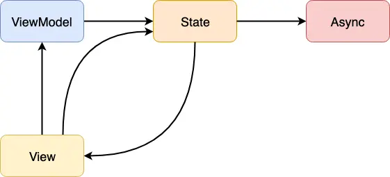

# MvRx

基于 Redux 的设计，Android 中出现了 MvRx 框架，对上述概念进行了本地化。它有着四个关键概念：State、ViewModel、View、Async，有着以下关系：



## State

在详细讲述 MvRx 中的相关概念时，我们需要先从 jetpack compose 的 state 概念入手。在 Jetpack 中，`state`表示**一个和 UI 状态相关的值**。每当状态发生改变，Jetpack Compose 都会自动刷新 UI。

`State`的值可以是任意类型：如像`Boolean`或者`String`一样的简单的基础类型，也可以是一个包含整个渲染到屏幕上的 UI 状态的复杂数据类型。

为了让 Compose 能够感知到状态变化，状态的值需要包装到一个`State`对象里。Jetpack Compose 提供的`mutableStateOf()`函数就能帮我们完成这个包装操作。这个函数会返回一个`MutableState<T>`实例，Compose 会跟踪这个实例的变化，在值被修改时进行 UI 更新。 


State 是 LiveData 的变体，但是 State 将职责边界框定在了 UI 这一侧，这个是比较重要的，因为 LiveData 大多数情况下正是因为介入了业务逻辑导致出现问题。

一个典型的例子是：

```kotlin
data class MyState(var state1: String, var state2: Int)

val myState = MyState("1", 2)

@Preview
@Composable
fun MyComposable() {
    var state by remember { mutableStateOf(myState) }

    SmallView(state = state) {
        // 可以生效，Compose 能感知到 state 本身的变化
        state = MyState("button1", 31)

        // 无法生效，Compose 感知不到内部字段的变化
        myState.state1 = "button"
        myState.state2 = 3
    }
    
}

@Composable
fun SmallView(state: MyState, reducer: () -> Unit) {
    Column { 
        Button(onClick = reducer) {
            Text(text = state.state1)
        }
        Text(text = state.state2.toString())
    }
}
```

可以看到`SmallView`的思路和 Redux 如出一辙：

>  (State, Reducer) => State

MvRx 的 State 中也提到了最关键的一点————不可变性，它内部的每个属性必须以`val`而不是`var`来修饰。如果要修改状态，必须用`data class`的`clone`方法：

```kotlin
data class MyState(
    val foo: Int,
    val bar: String,
) : MvRxState
```

## 基本组成部分

和 Redux 基本一致，MvRx 分为几大组成部分：

**[MavericksState](https://airbnb.io/mavericks/#/core-concepts?id=mavericksstate)**

定义：State 是一个 data class 的 immut 实现，每个属性都有默认值，以确保屏幕可以立即渲染。

一个典型的 State 例子如下：

```kotlin
data class UserState(
    val score: Int = 0,
    val previousHighScore: Int = 150,
    val livesLeft: Int = 99,
) : MavericksState {
    // Properties inside the body of your state class are "derived".
    val pointsUntilHighScore = (previousHighScore - score).coerceAtLeast(0)
    val isHighScore = score >= previousHighScore
}
```

使用不可变 data class 的优势在于：

1. 线程安全
2. 易读易懂
3. 渲染独立于事件
4. 便于测试

**[MavericksViewModel](https://airbnb.io/mavericks/#/core-concepts?id=mavericksviewmodel)**

Mavericks 定义了 ViewModel 的职责：

1. 更新 State
2. 暴露一串状态流给到其他类注册（MavericksViewModel.stateFlow）

在 Mavericks 中，其定义了几个典型的接口去做这两件事，用一个例子来表示：

```kotlin

```

