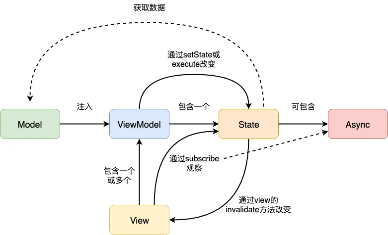

# MvRx 心智模型

## 基本组成部分

基于 Redux 的设计，Android 中出现了 MvRx 框架，对上述概念进行了本地化。它有着四个关键组成部分：State、ViewModel、View、Async，有着以下关系：


### State

我们先回想一下，在 Jetpack 中，`state`表示**一个和 UI 状态相关的值**。每当状态发生改变，Jetpack Compose 都会自动刷新 UI。

`State`的值可以是任意类型：如像`Boolean`或者`String`一样的简单的基础类型，也可以是一个包含整个渲染到屏幕上的 UI 状态的复杂数据类型。为了让 Compose 能够感知到状态变化，状态的值需要包装到一个`State`对象里。Jetpack Compose 提供的`mutableStateOf()`函数就能帮我们完成这个包装操作。这个函数会返回一个`MutableState<T>`实例，Compose 会跟踪这个实例的变化，在值被修改时进行 UI 更新。 

MvRx 的 State 和 Compose 的 State 很相似，但是核心含义不同：

* **MvRx 的 State 强调不可变性**。

MvRxState 是一个接口，它**也代表了页面的状态**，包含渲染页面所需的数据，不包含逻辑。在使用时**必须以不可变**的 data class 来实现。

一个典型的 state 如下：

```kotlin
data class UserState(
    val score: Int = 0,
    val previousHighScore: Int = 150,
    val livesLeft: Int = 99,
) : MavericksState {
    // Properties inside the body of your state class are "derived".
    val pointsUntilHighScore = (previousHighScore - score).coerceAtLeast(0)
    val isHighScore = score >= previousHighScore
}
```

### ViewModel

MvRx的ViewModel 基类是`BaseMvRxViewModel`，它继承自 AAC 的 ViewModel，因此也继承了它对于生命周期的感知能力，以及 Configuration Changed 不重建的优点。

MvRxViewModel 与 AAC 的 ViewModel 的区别在于：

1. **面向状态**：MvRxViewModel 内操作的是 MvRxState，而 ViewModel 中操作的是 LiveData。
2. **数据约束**：View 只能通过 MvRxViewModel 观察 State 的数据变化，而 LiveData 则没有限制。

从 state 以及 viewModel 可以看出来，MvRx 都是在 AAC 的基础上添加了额外的限制来实现 MVI 架构的。其思想和 Compose 如出一辙，但是因为 Compose 更为通用，所以有很多限制，例如不可变性的放开了。

### View

View 主要指的是 View 层，MvRx 对 View 层也提供了接口`MvRxView`。该接口可以在 Activity/Fragment 中实现。它只有一个方法：`invalidate()`，表示状态已更改，视图需要更新。

State 中的任何一个属性发生变化，都会触发`invalidate()`方法，因此视图状态应该是短暂的，换句话说，`invalidate()`方法中应该是某一时刻视图状态的快照。 MvRx 库中提供了`BaseMvRxFragment`，它已经实现了`MvRxView`。

在这一点上来看，MvRxView 实际上是极为暴力版的 Compose，缺少了 Compose 的 slotTable 来优化渲染次数。

### Async

`Async`是 MvRx 对异步请求的封装，它是一个具有四个子类的**密封类**：

```kotlin
// 这里有一个协变的 T，用于成功或者失败时的数据传递
// 主要有两个状态
// Complete: Success, Fail
// ShouldLoad: Uninitialized, Fail
sealed class Async<out T>(val complete: Boolean, val shouldLoad: Boolean, private val value: T?) {

  	// 返回一个值或者 null
  	// Success 应该是总会有一个值的，Loading 和 Fail 推荐返回一个值
  	// 可以被 yourProp() 这种操作给 invoke
    open operator fun invoke(): T? = value

    companion object {
        fun <T> Success<*>.setMetadata(metadata: T) {
            this.metadata = metadata
        }

        @Suppress("UNCHECKED_CAST")
        fun <T> Success<*>.getMetadata(): T? = this.metadata as T?
    }
}

// 未初始化
object Uninitialized : Async<Nothing>(complete = false, shouldLoad = true, value = null), Incomplete

// 加载中
data class Loading<out T>(private val value: T? = null) : Async<T>(complete = false, shouldLoad = false, value = value), Incomplete

// 执行成功
data class Success<out T>(private val value: T) : Async<T>(complete = true, shouldLoad = false, value = value) {

    override operator fun invoke(): T = value

    /**
     * Optional information about the value.
     * This is intended to support tooling (eg logging).
     * It allows data about the original Observable to be kept and accessed later. For example,
     * you could map a network request to just the data you need in the value, but your base layers could
     * keep metadata about the request, like timing, for logging.
     *
     * @see MavericksRepository.execute
     * @see Async.setMetadata
     * @see Async.getMetadata
     */
    @InternalMavericksApi
    var metadata: Any? = null
}

// 执行失败
data class Fail<out T>(val error: Throwable, private val value: T? = null) : Async<T>(complete = true, shouldLoad = true, value = value) {
    override fun equals(other: Any?): Boolean {
        if (other !is Fail<*>) return false

        val otherError = other.error
        return error::class == otherError::class &&
            error.message == otherError.message &&
            error.stackTrace.firstOrNull() == otherError.stackTrace.firstOrNull()
    }

    override fun hashCode(): Int = arrayOf(error::class, error.message, error.stackTrace.firstOrNull()).contentHashCode()
}
```

1. Uninitialized ：未初始化
2. Loading ：加载中
3. Success ：执行成功（包含结果）
4. Fail ：执行失败（包含error信息）

MvRx 为配合 Async，在`MvRxViewModel`中提供了一个非常好用的扩展：`Observable.execute`，它的作用是将 Observable（网络、数据库或者任何映射到 Observable 的数据流）转换成`Async`对象，并根据Observable的事件发出对应的`Success`、`Fail`等消息。

> 上面的 Async 很像 Rust Future 的抽象。但是接口的设计又很像 RxJava，属于是大结合了。

### 关系

上面四个组成部分中，他们的关系如下：




