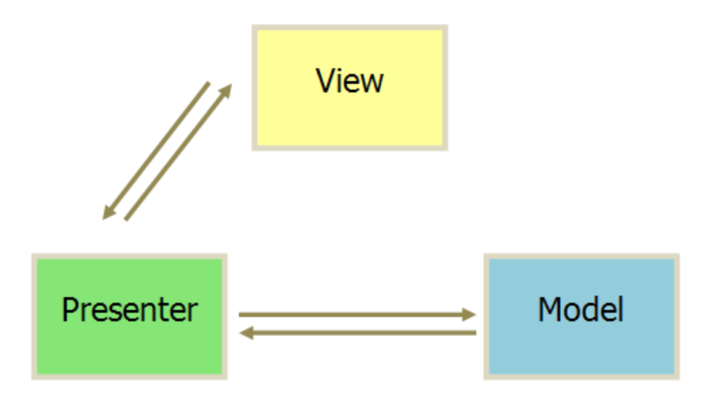

# MVI

MVI（Model-View-Intent）是GUI（图形用户界面）编程中的一种架构模式，它起源于函数式编程领域，旨在提供一种更加声明式的方式来构建用户界面和处理用户交互。MVI模式主要在前端和移动应用开发中受到欢迎，比如在使用React或者iOS/Android开发中。

MVI架构的核心组件通常包括：

* Model - 它代表应用程序的状态。在MVI中，Model是不可变的，这意味着每次状态变化时，都会创建一个新的状态实例。Model包含了应用程序在任何给定时间点的所有必要信息。
* View - 它是用户与应用程序交互的界面。在MVI中，View通常是一个简单的声明性组件，它观察Model的变化并渲染界面。View不直接修改状态，而是生成Intent。
* Intent - 这不是Android中的Intent概念，而是一个更通用的概念。Intent在这里指的是用户意图的表示，是发起状态变化的触发器。用户与View的交互会产生Intent，这些Intent描述了用户想要执行的操作。

MVI的好处是能够提供一个清晰和一致的数据流，这使得状态管理变得更加可预测，也使得应用程序更易于维护和测试。由于Model是不可变的，这还有助于避免状态管理中的许多常见问题，如竞态条件和不一致的状态更新。

MVI 本质上是变种版的MVVM，其 Model层，View 层定义类似，ViewModel 层和 Intent 层也类似。

Android 官方之前推荐的MVVM范式，在Activity/Fragment 直接提供了ViewModel组件+LiveData，这里的LiveData就类似MvRx/Redux中的State。

在 MVVM 架构中 LiveData 是分散的，因此平时的开发中，我们可能会定义多个 LiveData 以表示多个不同的属性，业务方分别订阅这些LiveData，这种设计下，职责确实明晰了，但是**一旦 LiveData 过多**，对于后续的管理维护就会造成负担。MVI 就针对这个问题做了进一步的处理，**提倡将这些分散的LiveData 聚合在一起管理**，就演变成了 MvRx/Redux 中的State。因此本质上，MVI 架构在单向数据流动的基础上仅仅只是加上了状体集中管理以及函数式的一些思维。

MvRx/Redux 框架遵循这一设计思路，MvRx 是安卓的框架，其源于前端的 reactjs 的 redux。

# 再提 MVC、MVP、MVVM

> 参考 https://www.ruanyifeng.com/blog/2015/02/mvcmvp_mvvm.html

## MVC 架构

MVC 是所有架构的基础，其将软件分为了三部分：

- 视图（View）：用户界面。
- 控制器（Controller）：业务逻辑
- 模型（Model）：数据保存


通信模式如上：

1. View 传送指令到 Controller
2. Controller 完成业务逻辑后，要求 Model 改变状态
3. Model 将新的数据发送到 View，用户得到反馈

接受用户指令时，MVC 可以分成两种方式。一种是通过 View 接受指令，传递给 Controller；另一种是直接通过controller接受指令。


实际上也有更灵活的方式：


1. 用户可以向 View 发送指令（DOM 事件），再由 View 直接要求 Model 改变状态。
2. 用户也可以直接向 Controller 发送指令（改变 URL 触发 hashChange 事件），再由 Controller 发送给 View。
3. Controller 非常薄，只起到路由的作用，而 View 非常厚，业务逻辑都部署在 View。所以，Backbone 索性取消了 Controller，只保留一个 Router（路由器） 。

### 优缺点

优点：简介易懂、实现了 MVC 三层分离、有着最初版的单向数据流的影子。

缺点：View 层很容易做得很厚、而 Controller 就是路由且会随着业务拓展而不断变大、架构没有考虑到数据源等抽象。

## MVP 架构

MVP 模式将 Controller 改名为 Presenter，同时改变了通信方向。



在 MVP 架构中：

1. 各部分之间的通信，都是双向的。
2. View 与 Model 不发生联系，都通过 Presenter 传递。
3. View 非常薄，不部署任何业务逻辑，称为"被动视图"（Passive View），即没有任何主动性，而 Presenter非常厚，所有逻辑都部署在那里。

在 MVP 这里可以看到，MVP 是想解决 MVC View 层较为臃肿的问题，想把 View 层做薄，但是业务总得有个放的地方和比较好翻阅的地方，因此基于接口的 presenter 就出来了。此时数据的更新会仅仅只和 Presenter 交互，而视图的更新以及视图的事件也仅仅和 Presenter 交互，完成了比较好的分离，为后期的 MVVM 打下了基础。

但是 Presenter 做厚本身就会带来缺点：

1. 接口太多，难以维护；
2. View 和 Presenter 交互过于密集；
3. View 虽然是被动视图，但是它不是 Presenter 描述的，而是 Presenter 命令的。

## MVVM


到 MVVM 时代之后，相比 MVC 以及 MVP 时代，一些比较关键的地方已经固化下来了：

1. 单向数据流；
2. 声明式的描述 View；
3. 视图、数据分离、数据、视图数据分离；
4. 数据、事件分离；

虽然大体上还是 MVP 的结构，但是内核变了：

1. ViewModel 负责观测数据层 Model 的信息，并通知到 View，这就是 LiveData 的设计（观察者），此举减少了接口众多的问题；
2. ViewModel 引入生命周期，防止数据的泄露问题；
3. View 接受 Hid 事件不是直接更新到 ViewModel，而是通知到数据层构建新的事件下来，形成单向数据流和大回环；

### MVI

在上面可以知道 MVVM 是没有解决或者说没法解决业务庞大这个问题的。整个架构的迭代过程中无非就是把增长的业务想个法子去放起来，并且防止一些内存安全和并发安全问题。虽然 LiveData 所代表的观察者模式能够去描述界面了，但是其会和业务进行耦合，最终带来数量膨胀的问题，而最糟糕的是，此时表征业务的 LiveData 和表征 View 的 LiveData 也会耦合，使得越发难以维护，加上 LiveData 最终就是会到处观察的，其类“图”的调用逻辑会导致人力难以看出来影响面。而且最最关键的，LiveData 一旦和业务有关联，那么其就会被用于通知事件，而 LiveData 的设计并不适合 Channel 的场景。

因此，在 MVVM 的基础上，结合一些 FP 的思维就是自然而然的了。MVI 在 MVVM 的基础上没有做大的改进，而是着重集中在了 LiveData 的改进上，将描述业务的 LiveData 和描述 View 的 LiveData 分离。

* 前者成为了 Redux 纯函数，和 State 结合在一起表征一个纯粹的事件，该事件不依赖于任何现有数据和状态（FP 中纯函数的衍生）；
* 后者则是继续以 LiveData、Compose 或者其他什么形式存在，它直接描述一个界面，由事件来触发构建。

此外，还有个问题，在 MVVM 中，我们 View 的一个 Hid 事件是直接通知到的数据层，再由数据层构建事件传下来，这种情况下使得不论如何我们都需要绕大环才能更新界面，但是有的时候影响面并不大，例如我就是开个 dialog，无需等待网络推送，因此 Hid 事件并不需要走到数据层。这种情况下，我们需要绕下小环就行。因此事件上面在 MVI 也做了进一步的区分：

* Hid Action
* 数据 Action

而这两种事件会经由一个更上层去做转发，更新 state。

# Redux 的 MVI 设计

## 函数式编程的一些概念

函数式编程中，有个几个重要的概念：

1. 纯函数，数学上说，一个函数是纯函数，其符合三个原则：
   1. 仅一个输出；
   2. 方法体中没有其他与方法签名无关的数据变化；
   3. 不修改任何现有状态。
2. 函数作为数据，这个其实就是函数指针，用得比较多了
3. 数据不可变性，FP 中坚持不可变数据，因此不会出现 data race 的情况
4. 声明式，不同于命令式着重于 how，声明式着重于 what。但其实 what 也是基于良好的 how 函数的封装。

## Redux 的基本组成部分

在 Redux 中主要由五个部分组成：

1. Actions：用于描述事件，可以是点击事件也可以是 IO 事件；
2. Reducers：纯函数，基于上面纯函数的定义，其有三个属性
   1. 仅仅输出一个 State
   2. 仅根据现有 State 和 Action 输出 State
   3. 不更改当前 State，而是做 immutable 替换更新。
3. Store：存储各种 State，State 直接声明界面
   1. 声明式的思想，State 描述界面是 what，而非去很细节的构建界面，也即 how to。
4. Dispatch：**更新 state 的唯一方法是调用 `store.dispatch()` 并传入一个 action 对象**。 store 将执行所有 reducer 函数并计算出更新后的 state，调用 `getState()` 可以获取新 state。
5. Selector：负责从 store 中提取指定的部分，其实就是用小的 what 构建大的 what。

## 数据流

上面的组成部分比较抽象，我们直接看 gif 即可：


# MvRx

基于 Redux 的设计，Android 中出现了 MvRx 框架，对上述概念进行了本地化。

## State

在详细讲述 MvRx 中的相关概念时，我们需要先从 jetpack compose 的 state 概念入手。在 Jetpack 中，`state`表示**一个和 UI 状态相关的值**。每当状态发生改变，Jetpack Compose 都会自动刷新 UI。

`State`的值可以是任意类型：如像`Boolean`或者`String`一样的简单的基础类型，也可以是一个包含整个渲染到屏幕上的 UI 状态的复杂数据类型。

为了让 Compose 能够感知到状态变化，状态的值需要包装到一个`State`对象里。Jetpack Compose 提供的`mutableStateOf()`函数就能帮我们完成这个包装操作。这个函数会返回一个`MutableState<T>`实例，Compose 会跟踪这个实例的变化，在值被修改时进行 UI 更新。 


State 是 LiveData 的变体，但是 State 将职责边界框定在了 UI 这一侧，这个是比较重要的，因为 LiveData 大多数情况下正是因为介入了业务逻辑导致出现问题。

一个典型的例子是：
```kotlin
data class MyState(var state1: String, var state2: Int)

val myState = MyState("1", 2)

@Preview
@Composable
fun MyComposable() {
    var state by remember { mutableStateOf(myState) }

    SmallView(state = state) {
        // 可以生效，Compose 能感知到 state 本身的变化
        state = MyState("button1", 31)

        // 无法生效，Compose 感知不到内部字段的变化
        myState.state1 = "button"
        myState.state2 = 3
    }
    
}

@Composable
fun SmallView(state: MyState, reducer: () -> Unit) {
    Column { 
        Button(onClick = reducer) {
            Text(text = state.state1)
        }
        Text(text = state.state2.toString())
    }
}
```

可以看到`SmallView`的思路和 Redux 如出一辙：

>  (State, Reducer) => State

## 基本组成部分

和 Redux 基本一致，MvRx 分为几大组成部分：

**[MavericksState](https://airbnb.io/mavericks/#/core-concepts?id=mavericksstate)**

定义：State 是一个 data class 的 immut 实现，每个属性都有默认值，以确保屏幕可以立即渲染。

一个典型的 State 例子如下：

```kotlin
data class UserState(
    val score: Int = 0,
    val previousHighScore: Int = 150,
    val livesLeft: Int = 99,
) : MavericksState {
    // Properties inside the body of your state class are "derived".
    val pointsUntilHighScore = (previousHighScore - score).coerceAtLeast(0)
    val isHighScore = score >= previousHighScore
}
```

使用不可变 data class 的优势在于：

1. 线程安全
2. 易读易懂
3. 渲染独立于事件
4. 便于测试

**[MavericksViewModel](https://airbnb.io/mavericks/#/core-concepts?id=mavericksviewmodel)**

Mavericks 定义了 ViewModel 的职责：

1. 更新 State
2. 暴露一串状态流给到其他类注册（MavericksViewModel.stateFlow）

在 Mavericks 中，其定义了几个典型的接口去做这两件事，用一个例子来表示：

```kotlin
```

