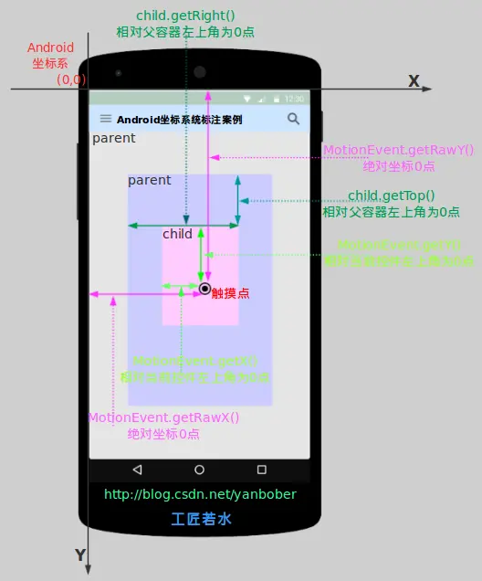
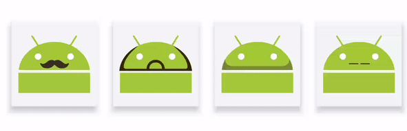
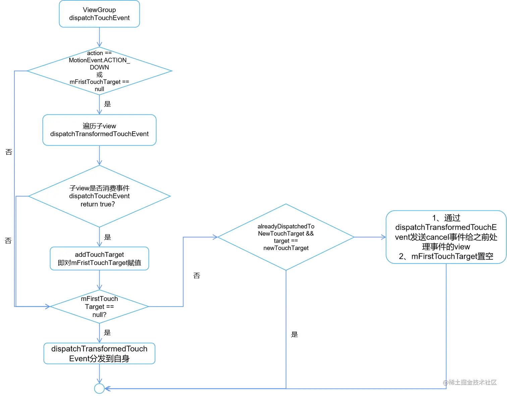
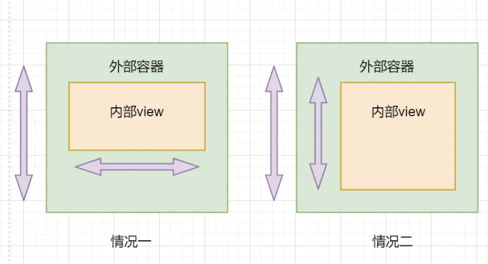
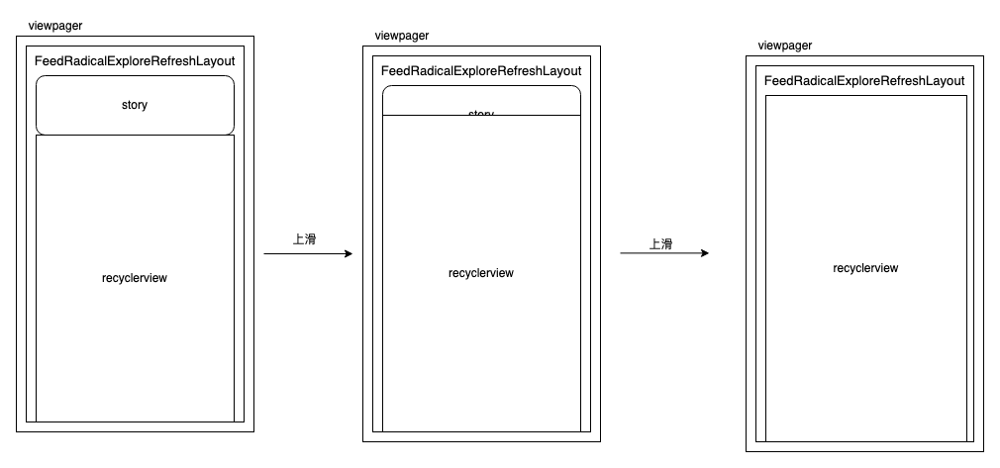

## Touch 事件简介

> 参考文档：[【透镜系列】看穿 > NestedScrolling 机制 >](https://blog.rubitree.com/15467469615604.html)
>
> 

安卓中的 MotionEvent 表示用户与设备屏幕的交互事件，例如触摸、滑动等操作。

它包含了以下重要信息：

1. **事件类型**：例如按下、移动、抬起等。
2. **触摸点的坐标**：用于确定用户触摸的位置。
3. **时间信息**：包括事件发生的时间。

而类型涵盖了：

| 事件                | 简介                                               |
| ------------------- | -------------------------------------------------- |
| ACTION_DOWN         | 第一个 手指 初次接触到屏幕 时触发。                |
| ACTION_MOVE         | 手指 在屏幕上滑动 时触发，会多次触发。             |
| ACTION_UP           | 最后一个 手指 离开屏幕 时触发。                    |
| ACTION_POINTER_DOWN | 有非主要的手指按下(即按下之前已经有手指在屏幕上)。 |
| ACTION_POINTER_UP   | 有非主要的手指抬起(即抬起之后仍然有手指在屏幕上)。 |

一般通过`getAction()`获取这个 MotionEvent的 类型

- 多点触摸

要区分多点触摸，需要用`getActionMasked()`

此外，看代码可以知道，`getAction()`、`getActionMasked()`、`getActionIndex()`这三个方法的返回是存在一个字段上。感觉是谷歌工程师的洁癖，不会给类型枚举字段分配一整个int，在framework的代码里有大量位移取值的设计。

```java
//MotionEvent.java
/**
 * Return the kind of action being performed.
 * Consider using {@link #getActionMasked} and {@link #getActionIndex} to retrieve
 * the separate masked action and pointer index.
 * @return The action, such as {@link #ACTION_DOWN} or
 * the combination of {@link #ACTION_POINTER_DOWN} with a shifted pointer index.
 */
public final int getAction() {
    return nativeGetAction(mNativePtr);
}

/**
 * Return the masked action being performed, without pointer index information.
 * Use {@link #getActionIndex} to return the index associated with pointer actions.
 * @return The action, such as {@link #ACTION_DOWN} or {@link #ACTION_POINTER_DOWN}.
 */
public final int getActionMasked() {
    return nativeGetAction(mNativePtr) & ACTION_MASK;
}

/**
 * For {@link #ACTION_POINTER_DOWN} or {@link #ACTION_POINTER_UP}
 * as returned by {@link #getActionMasked}, this returns the associated
 * pointer index.
 * The index may be used with {@link #getPointerId(int)},
 * {@link #getX(int)}, {@link #getY(int)}, {@link #getPressure(int)},
 * and {@link #getSize(int)} to get information about the pointer that has
 * gone down or up.
 * @return The index associated with the action.
 */
public final int getActionIndex() {
    return (nativeGetAction(mNativePtr) & ACTION_POINTER_INDEX_MASK)
            >> ACTION_POINTER_INDEX_SHIFT;
}
```

### 区分多点触摸

我们依然可以通过 MotionEvent 来实现多点触摸：

```kotlin
fun onTouchEvent(event: MotionEvent): Boolean {
    when (event.getActionMasked()) {
        MotionEvent.ACTION_DOWN -> Log.i(TAG, "第一个手指按下")
        MotionEvent.ACTION_UP -> Log.i(TAG, "最后一个手指抬起")
        MotionEvent.ACTION_MOVE -> {
            var i = 0
            while (i < event.getPointerCount()) {
                Log.i(TAG, "第" + event.getPointerId(i) + "个手指移动")
                i++
            }
        }
        MotionEvent.ACTION_POINTER_DOWN -> Log.i(TAG, "第" + (event.getPointerId() + 1) + "个手指按下")
        MotionEvent.ACTION_POINTER_UP -> Log.i(TAG, "第" + (event.getPointerId() + 1) + "个手指松开")
        MotionEvent.ACTION_CANCEL -> Log.i(TAG, "第" + (event.getPointerId() + 1) + "个手指CANCEL")
        MotionEvent.ACTION_OUTSIDE -> Log.i(TAG, "第" + (event.getPointerId() + 1) + "个手指OUTSIDE")
    }
    return true
}
```

### 触摸点坐标

一般用`getX()`，`getRawX()`获取坐标，有张图很好地说明坐标点的含义：



## Touch 事件消费

### 手势识别

安卓提供了一个工具类`GestureDetector`帮助将连续的MotionEvent识别为具体的手势

其中一个接口能识别的手势类型：

```java
public static class SimpleOnGestureListener implements OnGestureListener, OnDoubleTapListener,
        OnContextClickListener {

    public boolean onSingleTapUp(MotionEvent e) {
        return false;
    }

    public void onLongPress(MotionEvent e) {
    }

    public boolean onScroll(MotionEvent e1, MotionEvent e2,
            float distanceX, float distanceY) {
        return false;
    }

    public boolean onFling(MotionEvent e1, MotionEvent e2, float velocityX,
            float velocityY) {
        return false;
    }

    public void onShowPress(MotionEvent e) {
    }

    public boolean onDown(MotionEvent e) {
        return false;
    }

    public boolean onDoubleTap(MotionEvent e) {
        return false;
    }

    public boolean onDoubleTapEvent(MotionEvent e) {
        return false;
    }

    public boolean onSingleTapConfirmed(MotionEvent e) {
        return false;
    }

    public boolean onContextClick(MotionEvent e) {
        return false;
    }
}
```

### 点击事件

点击事件是最常用的事件，我们一般通过给View设置`OnClickListener`和`OnTouchListener`来实现

View触发事件的大概流程：

```java
//View.java
public boolean dispatchTouchEvent(MotionEvent event) {
    if (mOnTouchListener!=null && mOnTouchListener.onTouch(event)){
        return true;
    } else {
        if (单击事件){
            mOnClickListener.onClick(view);
        } else if (长按事件){
            mOnLongClickListener.onLongClick(view);
        }
    }
}
```

### 滑动事件

#### scroll

简单的滑动事件识别和处理很简单，就是直接通过touch 事件来计算滑动多少距离就好了，按照View预设计的可以滑动的方向，比如横向就计算不同时间点MotionEvent的坐标值，得到一个水平距离deltaX

#### fling

Fling也即是快速滑动，就是手指在屏幕上使劲的『挠』一下，手势的要点是手指在屏幕快速滑过一小段短距离，就像把一个小球弹出去的感觉一样。对于Fling手势来说，最重要的是速度，水平方向的速度和垂直方向的速度

识别到fling后，再在view上播放一个惯性滑动的动画，能带来更丝滑的体验：



最常用的`RecyclerView`和`GestureDetector`识别fling的原理差不多，就是在手抬起的时候，计算位移的距离和时间，计算速度是否超过一个阈值：

```java
//RecyclerView.java
@Override
public boolean onTouchEvent(MotionEvent e) {
            case MotionEvent.ACTION_UP: {
                mVelocityTracker.addMovement(vtev);
                eventAddedToVelocityTracker = true;
                mVelocityTracker.computeCurrentVelocity(1000, mMaxFlingVelocity);
                final float xvel = canScrollHorizontally
                        ? -mVelocityTracker.getXVelocity(mScrollPointerId) : 0;
                final float yvel = canScrollVertically
                        ? -mVelocityTracker.getYVelocity(mScrollPointerId) : 0;
                if (!((xvel != 0 || yvel != 0) && fling((int) xvel, (int) yvel))) {
                    setScrollState(SCROLL_STATE_IDLE);
                }
                resetTouch();
            } break;
```

## 复杂滑动事件处理

### 唯一响应者

触摸事件从Down开始，ViewGroup 会在 mFirstTouchTarget 记录第一个消费事件的View，直到up事件，都由同一个view处理：



### 滑动冲突

> 滑动冲突适配解决的问题：控制我们希望的滑动事件被我们喜欢的View消费



当我们希望父容器消费事件：在父容器`onInterceptTouchEvent()`时拦截事件:

```java
private int mLastXIntercept;
    private int mLastYIntercept;
    @Override
    public boolean onInterceptTouchEvent(MotionEvent event) {
 
        int x = (int) event.getX();
        int y = (int) event.getY();
        final int action = event.getAction();
        switch (action) {
            case MotionEvent.ACTION_DOWN:
                mLastXIntercept = (int) event.getX();
                mLastYIntercept = (int) event.getY();
                break;
            case MotionEvent.ACTION_MOVE:
      
                if (needIntercept) {//判断是否需要拦截的条件
                    return true;
                }
 
                break;
            case MotionEvent.ACTION_UP:
                break;
        }
 
 
        return super.onInterceptTouchEvent(event);
```

当我们希望子容器消费事件：在明确子容器需要消费事件时，通过`requestDisallowInterceptTouchEvent()`方法，控制父容器别拦截事件:

```java
public boolean dispatchTouchEvent(MotionEvent event) {
        int x = (int) event.getX();
        int y = (int) event.getY();
 
        switch (event.getAction()) {
            case MotionEvent.ACTION_DOWN: {
                parent.requestDisallowInterceptTouchEvent(true);
                break;
            }
            case MotionEvent.ACTION_MOVE: {
                int deltaX = x - mLastX;
                int deltaY = y - mLastY;
                if (父容器需要此类点击事件) {
                    parent.requestDisallowInterceptTouchEvent(false);
                }
                break;
            }
            case MotionEvent.ACTION_UP: {
                break;
            }
            default:
                break;
        }
 
        mLastX = x;
        mLastY = y;
        return super.dispatchTouchEvent(event);
```

### 滑动嵌套

> 滑动嵌套解决的问题是：滑动事件不全被一个容器消费，而是在不同的容器之间传递，带来连贯丝滑的体验

当滑动事件需要传递时，我们在一个容器的move事件需要控制另一个容器的位移.

#### 嵌套滚动

google提供了一套系统组件，能较低成本实现两个容器嵌套滚动，思路就是，**滚之前商量着来**

目前有三个版本，每个版本都有bug，https://blog.rubitree.com/15467469615604.html#toc_1 关于这个组件的bug，这篇文章讲的很好

-20240710112341040.(null))

#### CordinatorLayout/AppbarLayout吸顶组件

google官方提供了一个方便实现MaterialDesign悬浮吸顶的组件

)

AppbarLayout的部分在列表往下滚动时会先收起再吸顶

```Kotlin
public class CoordinatorLayout extends ViewGroup implements NestedScrollingParent2{}
```

CoordinatorLayout是基于NestedScrollingParent2，子列表如果实现了NestedScrollingChild2，就能轻松实现吸顶效果。

上面组件的滑动效果可以定制.

### 三层滑动嵌套

那么如果有三个人容器需要连续滑动呢？核心思路是把三层当作两个两层来处理

#### 方案1:两个双层嵌套递归实现三层嵌套

-20240710112341034.(null))

-20240710112341033.(null))

##### 案例 即刻apphttps://cloud.tencent.com/developer/article/1740282

这种做法，好处是三层可滑动的容器是解耦的，抽象会非常独立。坏处是滑动适配的代码会非常复杂，成本很高。

在我们的业务迭代中，如果不是迫不得已，出于成本限制是没法采用这种方案的。

#### 方案2: 其中一个滑动嵌套在容器内部处理，实际上还是双层嵌套

问题是三个容器之间直接滑动嵌套，那我直接把两个容器合并，内部单独处理滑动事件

案例：沉浸式天窗、西瓜个人主页

都是上两层嵌套，由一个类控制，耦合在一起实现

##### 案例：沉浸式天窗

- 嵌套交互介绍：竖向涉及三个滑动交互的嵌套传递，从里到外：
  - 列表RecyclerView的滑动
  - 天窗展开收起
  - 频道的下拉刷新
- 容器实现：扩展通用的下拉刷新容器，让下拉刷新容器实现“可以塞入订制View作为天窗”的能力，下拉刷新天窗内部独立判断滑动事件应该用于下拉刷新还是天窗的展开收起
- 这么做的原因：
  - 为啥不做三层嵌套：按照方案1实现一个中间容器，成本过高，业务无法接受
  - 为啥让上两层耦合：视频app的列表业务逻辑及其复杂，能够单独抽象的能力，应该和列表解耦



##### 案例：个人主页

- 嵌套交互介绍：竖向涉及三个滑动交互的嵌套传递，从里到外：
  - 列表RecyclerView的滑动
  - 个人介绍页展开、收起吸顶
  - 个人页下拉刷新
- 容器实现：外两层嵌套，在AppbarLayout内部实现
- 这么做的原因：
  - 为啥不做三层嵌套：成本过高，没必要
  - 为啥让上两层耦合：AppbarLaout内部实现下拉刷新成本不高，比较独立


#### 方案3:滑动交互降级、三层嵌套拆分为双层嵌套和滑动冲突

问题是三个容器之间直接滑动嵌套，那咱简单点，两个容器之间嵌套，和第三个容器冲突

##### 案例：三列短剧频道

- 嵌套交互介绍：竖向涉及三个滑动交互的嵌套传递，从里到外：
  - 三列RecyclerView的滑动
  - ViewPager上方的单列RecyclerView收起吸顶
  - 频道下拉刷新
- 容器实现：内两层嵌套，频道下拉刷新和内两层滑动冲突
- 这么做的原因：
  - 为啥不做三层嵌套：成本过高，业务无法接受

这样做的好处：成本低，三层容器都非常独立

坏处：下层容器的滑动事件无法传递到上层，如果用户从列表底部滑动到顶部，需要松手，才能触发下拉刷新

标签吸顶的嵌套滑动使用CoordinatorLayout-AppBarLayout嵌套，而下拉刷新NestedSwipeRefreshLayout，和下面两层是冲突关系。

### 三列短剧频道开发过程中解决的其他滑动问题

#### appbarlayout下嵌套的recyclerview滑动惯性未消减问题

问题：采用 CoordinatorLayout-AppbarLayout 方案实现吸顶效果时，如果AppbarLayout内包含一个列表，会存在bug：列表会捕捉fling惯性，导致松手再次滑动时页面剧烈抖动

- 解决方案：在触摸屏幕时，通过反射获取appbarlayout的惯性事件字段，手动取消。**如果有类似的问题，可以直接复制粘贴代码**
- 注意：android8前后，控制appbarlayout惯性滑动的字段不同，需要区分一下

```Kotlin
class NestedScrollHeaderBehavior(context: Context?, attrs: AttributeSet?) :
    AppBarLayout.Behavior(context, attrs) {

    companion object {
        const val KEY_FLING_RUNNABLE_FILED = "key_fling_runnable_filed"
        const val KEY_SCROLL_FILED = "key_scroll_filed"
        private const val TAG = "CustomBehavior"
        private const val TYPE_FLING = 1
    }

    private var isFlinging = false
    private var shouldBlockNestedScroll = false
    //缓存反射获取到的字段，避免重复反射
    private val fieldCache: MutableMap<String, Field> = HashMap()

    init {
        setDragCallback(object : DragCallback() {
            override fun canDrag(p0: AppBarLayout): Boolean {
                return true
            }

        })
    }
    override fun onInterceptTouchEvent(
        parent: CoordinatorLayout,
        child: AppBarLayout,
        ev: MotionEvent,
    ): Boolean {
        log("onInterceptTouchEvent:" + child.totalScrollRange)
        shouldBlockNestedScroll = isFlinging
        when (ev.actionMasked) {
            MotionEvent.ACTION_DOWN ->                 //手指触摸屏幕的时候停止fling事件
                stopAppbarLayoutFling(child)
            else -> {}
        }
        return super.onInterceptTouchEvent(parent, child, ev)
    }


    /**
     * 反射获取私有的flingRunnable
     * sdk28及以上，字段和28以下不一样
     * @return Field
     * @throws NoSuchFieldException
     */
    @get:Throws(NoSuchFieldException::class)
    private val flingRunnableField: Field?
        get() {
            if (!fieldCache.containsKey(KEY_FLING_RUNNABLE_FILED)) {
                val superclass: Class<*>? = this.javaClass.superclass
                val runnableField: Field? =  try {
                    // support design 27及一下版本
                    if (Build.VERSION.SDK_INT >= Build.VERSION_CODES.P) {
                        val headerBehaviorType = superclass?.superclass?.superclass
                        headerBehaviorType?.getDeclaredField("flingRunnable")
                    } else {
                        val headerBehaviorType = superclass?.superclass
                        headerBehaviorType?.getDeclaredField("mFlingRunnable")
                    }
                } catch (e: NoSuchFieldException) {
                    log("get runnable field err")
                    null
                }?.apply {
                    fieldCache[KEY_FLING_RUNNABLE_FILED] = this
                }
                return runnableField
            }  else {
                return fieldCache[KEY_FLING_RUNNABLE_FILED]
            }
        }

    /**
     * 反射获取私有的flingRunnable
     * sdk28及以上，字段和28以下不一样
     * @return Field
     * @throws NoSuchFieldException
     */
    @get:Throws(NoSuchFieldException::class)
    private val scrollerField: Field?
        get() {
            if (!fieldCache.containsKey(KEY_SCROLL_FILED)) {
                val superclass: Class<*>? = this.javaClass.superclass
                val scrollField: Field? =  try {
                    if (Build.VERSION.SDK_INT >= Build.VERSION_CODES.P) {
                        val headerBehaviorType = superclass?.superclass?.superclass
                        headerBehaviorType?.getDeclaredField("scroller")
                    } else {
                        val headerBehaviorType = superclass?.superclass
                        headerBehaviorType?.getDeclaredField("mScroller")
                    }
                } catch (e: NoSuchFieldException) {
                    log("get scroll field err")
                    null
                }?.apply {
                    fieldCache[KEY_SCROLL_FILED] = this
                }
                return scrollField
            }  else {
                return fieldCache[KEY_SCROLL_FILED]
            }
        }

    /**
     * 停止appbarLayout的fling事件
     *
     * @param appBarLayout
     */
    private fun stopAppbarLayoutFling(appBarLayout: AppBarLayout) {
        //通过反射拿到HeaderBehavior中的flingRunnable变量
        try {
            val flingRunnableField = flingRunnableField
            val scrollerField = scrollerField
            if (flingRunnableField != null) {
                flingRunnableField.isAccessible = true
            }
            if (scrollerField != null) {
                scrollerField.isAccessible = true
            }
            var flingRunnable: Runnable? = null
            if (flingRunnableField != null) {
                flingRunnable = flingRunnableField[this] as? Runnable
            }
            val overScroller = scrollerField?.get(this) as? OverScroller
            if (flingRunnable != null) {
                log("存在flingRunnable")
                appBarLayout.removeCallbacks(flingRunnable)
                flingRunnableField!![this] = null
            }
            if (overScroller != null && !overScroller.isFinished) {
                overScroller.abortAnimation()
            }
        } catch (e: NoSuchFieldException) {
        } catch (e: IllegalAccessException) {
        }
    }

    override fun onStartNestedScroll(
        parent: CoordinatorLayout, child: AppBarLayout,
        directTargetChild: View, target: View,
        nestedScrollAxes: Int, type: Int,
    ): Boolean {
        log("onStartNestedScroll")
        stopAppbarLayoutFling(child)
        return super.onStartNestedScroll(
            parent, child, directTargetChild, target,
            nestedScrollAxes, type
        )
    }

    override fun onNestedPreScroll(
        coordinatorLayout: CoordinatorLayout,
        child: AppBarLayout, target: View,
        dx: Int, dy: Int, consumed: IntArray, type: Int,
    ) {
        val isPositive = dy > 0
        (target as? PlayletTabRecyclerView)?.isPositive = isPositive

        log("onNestedPreScroll:" + child.totalScrollRange
                    + " ,dx:" + dx + " ,dy:" + dy + " ,type:" + type
        )
        //type返回1时，表示当前target处于非touch的滑动，
        //该bug的引起是因为appbar在滑动时，CoordinatorLayout内的实现NestedScrollingChild2接口的滑动
        //子类还未结束其自身的fling
        //所以这里监听子类的非touch时的滑动，然后block掉滑动事件传递给AppBarLayout
        if (type == TYPE_FLING) {
            isFlinging = true
        }
        if (!shouldBlockNestedScroll) {
            super.onNestedPreScroll(coordinatorLayout, child, target, dx, dy, consumed, type)
        }
    }

    override fun onNestedScroll(
        coordinatorLayout: CoordinatorLayout,
        child: AppBarLayout,
        target: View,
        dxConsumed: Int,
        dyConsumed: Int,
        dxUnconsumed: Int,
        dyUnconsumed: Int,
        type: Int,
    ) {
        log("onNestedScroll: target:" + target.javaClass + " ,"
                    + child.totalScrollRange + " ,dxConsumed:"
                    + dxConsumed + " ,dyConsumed:" + dyConsumed + " " + ",type:" + type
        )
        if (!shouldBlockNestedScroll) {
            super.onNestedScroll(
                coordinatorLayout, child, target, dxConsumed,
                dyConsumed, dxUnconsumed, dyUnconsumed, type
            )
        }
    }

    override fun onStopNestedScroll(
        coordinatorLayout: CoordinatorLayout, abl: AppBarLayout,
        target: View, type: Int,
    ) {
        log("onStopNestedScroll")
        super.onStopNestedScroll(coordinatorLayout, abl, target, type)
        isFlinging = false
        shouldBlockNestedScroll = false
    }

    private fun log(message: String) {
        if (Logger.debug()) {
            Logger.d(TAG, message)
        }

    }
}
```

#### 底viewpager抢占底列表滑动事件

解决：自定义viewpager，不抢占竖向滑动

```Kotlin
open class DisInterceptVerticalScrollViewPager: SSViewPager {

    constructor(context: Context?) : super(context)
    constructor(context: Context?, attrs: AttributeSet?) : super(context, attrs)

    var downMotionX = 0f
    var downMotionY = 0f

    override fun onInterceptTouchEvent(ev: MotionEvent?): Boolean {
        if (ev?.action == MotionEvent.ACTION_DOWN) {
            downMotionX = ev.rawX
            downMotionY = ev.rawY
        }
        if (ev?.action == MotionEvent.ACTION_MOVE) {
            val xDiff = abs(ev.rawX - downMotionX)
            val yDiff = abs(ev.rawY - downMotionY)
            if (xDiff < yDiff * sqrt(3.0)) {
                return false
            }
        }
        return  super.onInterceptTouchEvent(ev)
    }
}
```

#### 偶现fling下层recyclerview时，滑动反向

解决：如果是下滑，保证recyclerview的滑动事件是向下的

```Kotlin
//behavior
override fun onNestedPreScroll(coordinatorLayout: CoordinatorLayout, child: AppBarLayout,
                               target: View, dx: Int, dy: Int, consumed: IntArray, type: Int) {
    // 尝试解决CoordinatorLayout + AppbarLayout + RecyclerView嵌套滚动偶现滑动回弹的问题
    // 原因是nestedScroll时，RecyclerView fling的velocityY方向错了，系统bug实在难修，写了一段不优雅的代码
    val isPositive = dy > 0
    (target as? PlayletRecyclerView)?.isPositive = isPositive
}
//recyclerview
@Override
public boolean fling(int velocityX, int velocityY) {
    if (velocityY > 0 && !isPositive || velocityY < 0 && isPositive) {
                velocityY = -velocityY;
     }
    return super.fling(velocityX, velocityY);
}
```

客官，看到这了，点个赞呗