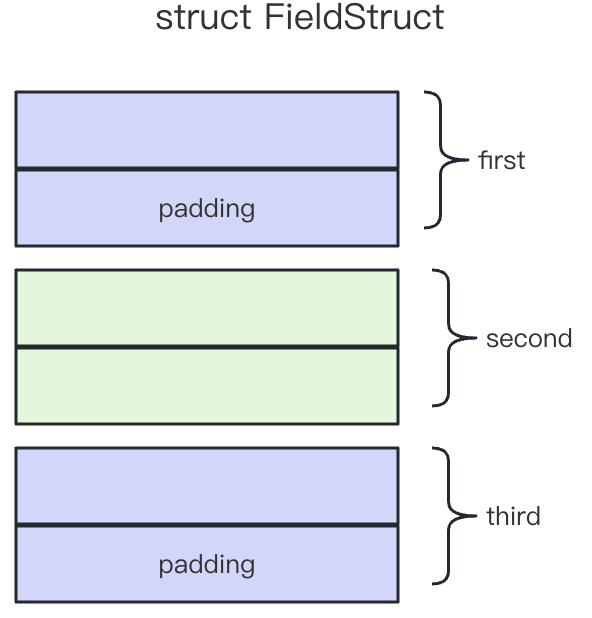
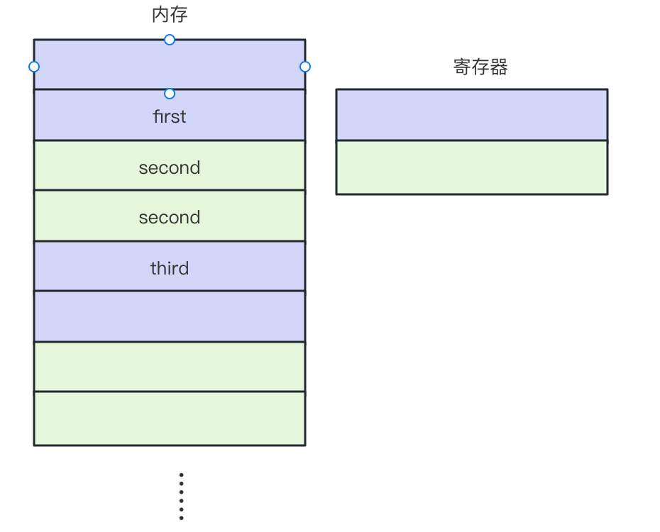
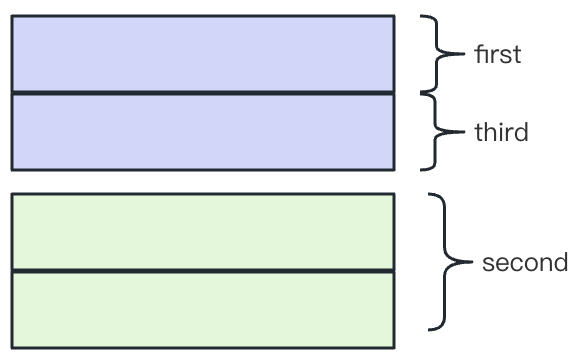
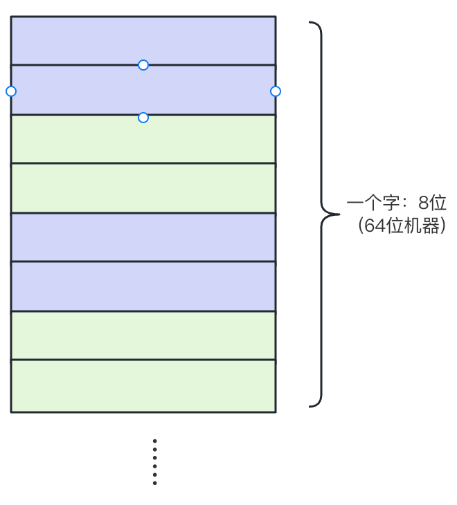

# Rust 内存布局

# 内存概述

要理解 Rust 内存布局需要关注两个关键库中的函数和结构体：

```Rust
std::mem::size_of<T>();
std::alloc::Layout;
```

所有的内存中的东西，不论是堆上还是栈上，其存储时都是以两个关键维度存储的：

1. Address: 起始地址
2. Size: 所占大小

但是在实际计算大小的时候还需要考虑内存对齐 alignment，因为 CPU 在读取数据(指令也是一种数据)时候做了优化，必须是读取以 2 的某次幂数量的数据，且编译器进行了进一步的优化，会以某个 2 的幂次读取数据。因此，`address`与`size`都必须是【对齐位数`alignment`】的**自然数**倍。

> 为什么需要内存对齐：
>
> 1. **CPU 读取内存不是一字节一字节的读取，而是以块为单位读取**：CPU 从内存中读取数据时需要通过cache 来作为中间层，会根据目标地址首先在cache 中找，如果找不到，就会首先从内存加载数据到cache 中，然后再读取。 单次从内存加载到cache 的数据大小叫做cache line，它的大小跟硬件有关，**一般是16 到256 字节**
>
> 2. **平台原因(移植原因)**：不是所有的硬件平台都能访问任意地址上的任意数据的；某些硬件平台只能在某些地址处取某些特定类型的数据，否则抛出硬件异常。
>
> 3. **性能原因**：数据结构(尤其是栈)应该尽可能地在自然边界上对齐。原因在于，为了访问未对齐的内存，处理器需要作两次内存访问；而对齐的内存访问仅需要一次访问。

为了理解这个问题，我们看两个简单的例子(方便起见，我们使用`#[repr(C)]`来使用 C ABI 的标准内存布局，避免 LLVM 激进的优化带来模糊的结果)：

```rust
#[repr(C)]
struct FieldStruct {
    first: u8,
    second: u16,
    third: u8
}
assert_eq!(6, mem::size_of::<FieldStruct>());
assert_eq!(2, std::mem::align_of::<FieldStruct>())
```

可以看到上面的结果为，大小 6 字节，对齐两字节，padding 2 字节，他的内存布局如下(每一格是一字节)：



如果没有对齐的话，那么会出现这种读取情况，我们假设 CPU 一次读取 2 字节：



这使得需要两次读取才能够获取到数据`second`，**这也是为什么一般是以 struct 中最大 size 的字段作为对齐**。

```rust
#[repr(C)]
struct FieldStructOptimized {
    first: u8,
    third: u8,
    second: u16
}
assert_eq!(4, mem::size_of::<FieldStructOptimized>());
assert_eq!(2, std::mem::align_of::<FieldStructOptimized>())
```

可以从上面的图看到，有两个 padding 的位置被浪费了，因此，调整位置之后可以节约 2 字节，此时内存布局如下：



在过去 C 的时代，程序员需要类似上面的方法去调整字段的位置来节约内存，实际上在现在的 Rust 中，如果把`#[repr(C)]`去掉，LLVM 直接优化为了最新的结果：

```rust
struct FieldStruct {
    first: u8,
    second: u16,
    third: u8
}
assert_eq!(4, mem::size_of::<FieldStructOptimized>());
assert_eq!(2, std::mem::align_of::<FieldStructOptimized>())
```

这也是为什么 Rust ABI 不稳定的原因，**但是在做 FFI 的时候，依旧需要理解 C 内存布局，C ABI 是跨语言交流中目前的唯一标准**。

对于内存的理解来说其实很简单，就是一堆从上往下排的小方格：



各个数据是不一样的长度，但是我们又不能一个字节一个字节的读，所以就东补补西放放，地主家余粮也不多嘛。

# 简单内存布局

## 基本数据类型

基本数据类型的大小如下所示，它们的内存布局在不同型号的设备上略有差异:

- 在非x86设备上，存储宽度`size` = 对齐位数`alignment`（即，倍数`N = 1`）
- 在x86设备上，因为设备允许的最大对齐位数不能超过4字节，所以`alignment ≼ 4 `Byte
  - `u64`与`f64`的`size = alignment * 2`（即，`N = 2`）。
  - `u128`与`i128`的`size = alignment * 4`（即，`N = 4`）。
  - 其它基本数据类型依旧`size = alignment`（即，倍数`N = 1`）。

```
size_of::<Type>()

()								0
bool 							1
u8								1
u16								2
u32								4
u64								8
u128							16
i8								1
i16								2
i32								4
i64								8
i128							16
f32								4
f64								8
char							4
```

## 指针类型

虽然 Rust 中的裸指针本质上是胖指针，存储了其他信息，但是依旧可以通过是否实现了：

```rust
Thin = Pointee<Metadata = ()> 
```

如果实现了`Thin`，意味着其原数据类型为`()`，大小为零，为静态类型指针，也即瘦指针。

我们可以看一个比较反常的例子：

```rust
// Box<[i32; N]> 拆解为最底层的结构体
Box<[i32; N]> (
    Unique<[i32; N]> {
        pointer: NonNull<[i32; N]> {
            pointer: *const [i32; N] ~ PtrComponents<[i32; N]> {
                data_address: *const ()
                metadata: <[i32; N] as Pointee>::Metadata = ()
            }
        }
        _marker: PhantomData<[i32; N]>
    }
) 

assert_eq!(size_of::<Box<[i32; N]>>(), size_of::<*const ()>());
```

上面的数据类似于 Java 中的`Int[N]`，指向该数据的指针为一个瘦指针，可以看到其元数据为`()`。但是如果是一个`Box<[i32]>`：

```rust
// Box<[i32]> 拆解
Box<[i32]> (
    Unique<[i32]> {
        pointer: NonNull<[i32]> {
            pointer: *const [i32] ~ PtrComponents<[i32]> {
                data_address: *const ()
                metadata: <[i32] as Pointee>::Metadata = usize
            }
        }
        _marker: PhantomData<[i32]>
    }
) 

assert_eq!(size_of::<Box<[i32]>>(), size_of::<(*const (), usize)>());
```

它就是一个胖指针，因为隐去的`大小`数据需要被有效的存储以避免出现问题。进一步的，我们看一个 trait object，可以类比于 Java 中直接调接口，使用多态：

```rust
// Box<dyn Any> 拆解
Box<dyn Any> (
    Unique<dyn Any> {
        pointer: NonNull<dyn Any> {
            pointer: *const dyn Any ~ PtrComponents<dyn Any> {
                data_address: *const ()
                metadata: <dyn Any as Pointee>::Metadata = DynMetadata<dyn Any> {
                    vtable_ptr: &'static VTable
                    phantom: PhantomData<dyn Any>
                }
            }
        }
        _marker: PhantomData<dyn Any>
    }
) 

assert_eq!(size_of::<Box<dyn Any>>(), size_of::<(*const (), DynMetadata<dyn Any>)>()); 
```

可以看到原数据中多了一个虚表。

### 瘦指针，静态大小的类型(FST)指针

瘦指针的内存布局与`usize`类型是一致的。因此，在不同设备和不同架构上，其性能表现略有不同

- 在非x86的
  - `32`位架构上，`size = alignment = 4 Byte`（N = 1）
  - `64`位架构上，`size = alignment = 8 Byte`（N = 1）
- 在x86的
  - `32`位架构上，`size = alignment = 4 Byte`（N = 1）
  - 64位设备上，
    - `size = 8 Byte`
    - `alignment = 4 Byte` — `x86`设备最大对齐位数不能超过`4`字节
    - `N = 2`

### 胖指针，动态大小类型(DST)指针

胖指针的存储宽度`size`是`usize`类型的**两**倍，对齐位数却与`usize`相同。就依赖于设备/架构的性能表现而言，其与瘦指针行为一致：

- 在非x86的

  - 32位架构上，
    - `size = 8 Byte`
    - `alignment = 4 Byte`
    - `N = 2`
  - 64位架构上，
    - `size = 16 Byte`
    - `alignment = 8 Byte`
    - `N = 2`

- 在x86的

  - 32位架构上，
    - `size = 8 Byte`
    - `alignment = 4 Byte`
    - `N = 2`

  - 64位设备上，
    - `size = 16 Byte`
    - `alignment = 4 Byte` — `x86`设备最大对齐位数不能超过`4`字节
    - `N = 4`

## 数组[T; N], 切片[T]及 str

Rust 中 `str` 本质上就是满足`UTF-8`编码规范的增强版`[u8]`切片，其存储宽度`size`是全部元素存储宽度之和

```
array.size = std::mem::size_of::<T>() * array.len();
```

对齐位数`alignment`与单个元素的对齐位数一致。

```
array.alignment = std::mem::align_of::<T>();
```

## 是 null 不是 null 的 ()

存储宽度`size` = `0 Byte`

对齐位数`alignment` = `1 Byte`

所有**零宽度**数据类型都是这样的内存布局配置。

来自【标准库】的零宽度数据类型包括但不限于：

- `()` 单位类型 — 模拟“空”。
- `std::marker::PhantomData<T>` — 绕过“泛型类型形参必须被使用”的编译规则。进而，成就[类型状态设计模式](https://rustcc.cn/article?id=e026f840-1c04-4f6e-b00e-95a475d7d317)中的`Phantom Type`。
- `std::marker::PhantomPinned<T>` — 禁止变量值在内存中“被挪来挪去”。进而，成就异步编程中的“自引用结构体`self-referential struct`”。

## 自定义 struct 布局

### 预置内存布局方案

编译器内置了四款内存布局方案，分别是

1. 默认`Rust`内存布局 —— 没有元属性注释，Rust 会进行大量的激进优化，**FFI 一定不能使用这个**！

2. `C`内存布局 `#[repr(C)]`

3. 数字类型内存布局 —— 调整对齐大小

   ```
   #[repr(u8 / u16 / u32 / u64 / u128 / usize / i8 / i16 / i32 / i64 / i128 / isize)]
   ```

   - 仅适用于枚举类。
   - 支持与`C`内存布局**混搭**使用。比如，`#[repr(C, u8)]`。

4. 透明内存布局 —— **外部来看 struct 的内存布局直接等价于内部的内存布局**，外部是个空壳，可以理解为 struct 这一层编译后会被干掉。

   ```
   #[repr(transparent)]
   ```

   - 仅适用于单字段数据结构。

### struct 例子

参考最开始的内存概述。

值得一提的是，struct 套 struct 也是一样的策略，按照最大的部分进行对齐，然后在以对齐的倍数作为大小：

```rust
struct Inner {
    first: u8,
    second: u64,
}
struct Test {
    first: u8,
    second: u16,
    third: u8,
    forth: Inner
}

assert_eq!(24, std::mem::size_of::<Test>())
assert_eq!(8, std::mem::align_of::<Test>())
```

对齐到了 8 字节，然后进行了填充。

### enum 

Rust 中的`enum`类似与 Kotlin 的，可以存储值，因此可以分为两类：

- `C`风格的枚举 — 仅标记状态，却不记录细节数据。
- `Rust`风格枚举 — 标记状态的同时也记录细节数据。

在[Rust References](https://doc.rust-lang.org/reference/introduction.html)一书中，

- `C`风格的枚举被称为[“无字段·枚举类 field-less enum”或“仅单位类型·枚举类 unit-only enum”](https://doc.rust-lang.org/reference/items/enumerations.html#field-less-enum)。
- `Rust`风格枚举又称为enum with fields

> 在`Cpp`程序中，需要借助【标准库】的`Tagged Union`数据结构才能模拟出同类的功能来。

**注意**：`C`内存布局的枚举类必须**至少包含一个**枚举值。否则，编译器就会报错：`error[E0084]: unsupported representation for zero-variant enum`。

### C风格枚举

C 风格枚举中，唯一有效数据就是记录了哪个枚举项被选中的分辨因子(discriminant)或者说其 filed，枚举类的内存布局就是枚举类中【整数类型】元素的内存布局。即，

```
Enum.alignment = discriminant.alignment; // 对齐位数
Enum.size = discriminant.size;           // 存储宽度
```

对于 FFI 两端的 Rust 和 C 而言，其无符号类型的对应关系如下：

| Rust      | C                      | 存储宽度 |
| --------- | ---------------------- | -------- |
| u8 / i8   | unsigned char / char   | 单字节   |
| u16 / i16 | unsigned short / short | 双字节   |
| u32 / i32 | unsigned int / int     | 四字节   |
| u64 / i64 | unsigned long / long   | 八字节   |

然而，虽然存在对应关系，同一类型的 Rust 和 C 之间的 FFI 接口中的枚举类型有着一个问题：

- `C / Cpp enum`实例可存储**任意类型的整数值**（比如，`char`，`short`，`int`和`long`）— 部分原因是`C`系语法灵活的定义形式：“`typedef enum`块 + 具名常量”。所以，`C / Cpp enum`非常适合被做成“比特开关”。但在`Rust`程序中，就不得不引入外部软件包[bitflags](https://docs.rs/bitflags/latest/bitflags/)了。

- [`C`内存布局`Rust`枚举类分辨因子`discriminant`**只能是**`i32`类型](https://github.com/rust-lang/rust/pull/107592) — 【存储宽度`size`】是固定的`4`字节。

  > [`Rust`内存布局·枚举类·分辨因子`discriminant`的整数类型是编译时由`rustc`决定的，但最宽支持到`isize`类型](https://doc.rust-lang.org/reference/items/enumerations.html#discriminants)。

这就使得 FFI 中 `C` 端的程序设计提出了额外的限制条件：**由`ABI`接口导出的枚举值需要使用`int`类型定义**。否则，`Rust`端`FFI`函数调用就会触发`U.B.`。

对于老接口来说，修改这么底层的 enum 有着许多问题，Rust 侧给的方案是：以【元属性】`#[repr(整数类型名)]`注释枚举类定义

从`C / Cpp`整数类型至`Rust`内存布局元属性的映射关系包括但不限于

| C                      | Rust 元属性                 |
| ---------------------- | --------------------------- |
| unsigned char / char   | #[repr(u8)] / #[repr(i8)]   |
| unsigned short / short | #[repr(u16)] / #[repr(i16)] |
| unsigned int / int     | #[repr(u32)] / #[repr(i32)] |
| unsigned long / long   | #[repr(u64)] / #[repr(i64)] |

例如以下代码：

```rust
#[repr(C)]
enum Case{	// Size of Case:4, alignment of Case:4
    A{},
    B(),
    C
}

#[repr(u8)]
enum Case{	// Size of Case:1, alignment of Case:1
    A{},
    B(),
    C
}

#[repr(u16)]
enum Case{	// Size of Case:2, alignment of Case:2
    A{},
    B(),
    C
}
```

`C`布局的枚举中，因为其每个枚举值不是“空字段”，就是“单位类型”。因此其内存布局就是`i32`类型的`alignment = size = 4 Byte`。但是当我们指定了特定的对齐方案后，就是对应的 1 或者 2 字节了。

### Rust 风格枚举

在 FFI 侧，由于 C 没有对应的概念使得 Rust 设计时做了些取舍。

**在使用 C 内存布局时(这里先探讨 C 内存布局)**，此类 enum 是被 rustc 弄成了一个 C 风格 enum + union 的组合，我们看个例子：

```rust
#[repr(C)]
enum Case{
    A(u8, u16),
    B{x: u8, y: u16},
    C
}
```

对于如上 enum，在编译器眼里他由两部分组成：

```rust
#[repr(C)]
struct Case {								// 称为 Discriminant Enum
    tag: Discriminant,			// C 风格 enum
    union: Fields,						// 联合体
}
```

对于结构体 Case 中的两个部分分别又表示为:

```rust
#[repr(C)]
enum Discriminant {
  	A,
  	B,
  	C
}

#[repr(C)]
union Fileds {
  	A: A,
  	B: B,
  	C: C,
}

// 其中
#[repr(C)]
#[derive(Copy, Clone)]
struct A(u8, u16)

#[repr(C)]
#[derive(Copy, Clone)]
struct B{x: u8, y: u16}

#[repr(C)]
#[derive(Copy, Clone)]
struct C
```

需要注意的是：

1. 保存枚举值字段的结构体 struct A / B / C都派生了`Copy`和 `Clone`，这是因为：
   - `union`数据结构要求它的每个字段都是**可复制**的
   - 同时，`trait Copy`又是`trait Clone`的`subtrait`
2. 编译器将`enum Case`变为`struct Case`时，**字段排列次序会直接影响到其中 filed 的内存排列顺序**。这是因为在`C ABI`中，结构体字段的存储次序就是它们在源码中的声明次序，所以`Cpp`标准库中的`Tagged Union`数据结构总是根据约定的字段次序排序，且满足：
   1. 将第一个字段解释为“选中项的索引号”，
   2. 将第二个字段解读为“选中项的数据值”。
3. `C`内存布局下的枚举类`enum Discriminant`的`discriminant`依旧是`i32`类型值，所以`FFI - C`端的枚举值仍旧被要求采用`int`整数类型。

此时我们可以运用上面的知识去算一个简单的例子下的内存布局了：

```rust
#[repr(C)]
enum Case{				// Size of Case:8, alignment of Case:4
    A(u8, u16),
    C
}
// 因为拆分后 enum 部分为 C 风格，因此其 size 和 slinment 均为 4, 而 union 中由较大的结构体来确定, 因此 size = 4, alignment = 2

#[repr(C)]
enum Case{				// Size of Case:24, alignment of Case:8
    A(u8, u64),
    C
}
// 因为拆分后 enum 部分为 C 风格，因此其 size 和 slinment 均为 4, 而 union 中由较大的结构体来确定, A 的 size = 16, alignment = 8, 因此总 alignment = 8, 然后全部对齐到 8, C 风格 enum 也变为 8 字节, 就是 16+8 = 24 了。
```

#### 优化一，加上数字类型

上面本质上是一个 union + enum 的方案，可用，但是继承了 C ABI 的缺点，引入了很多内存空白。此时`C`与【数字类型】的**混合**内存布局被提出解决这个问题，同样的，对于上面的 enum：

```rust
#[repr(C, u8)]
enum Case{
    A(u8, u16),
    B{x: u8, y: u16},
    C
}
```

仅 C 风格情况下，**是变为了 `struct+enum` 的组合，而现在，其变为了 `union+enum` 的组合**:

```rust
#[repr(u8)]						// 1. 注意这里，enum 变为了数字内存布局
enum Discriminant {
  	A,
  	B,
  	C
}

#[repr(C)]
union Case {					// 2. 这里是核心的变化，struct 变为了 union
  	A: A,
  	B: B,
  	C: C,
}
// 3. 第三个关键变化是，内部的 struct 中都分别持有了 Discriminant：
#[repr(C)]
#[derive(Copy, Clone)]
struct A(Discriminant, u8, u16)								// 注意在第一个

#[repr(C)]
#[derive(Copy, Clone)]
struct B{tag:Discriminant, x: u8, y: u16}			// 注意在第一个

#[repr(C)]
#[derive(Copy, Clone)]
struct C(Discriminant)												// 注意在第一个
```

其优点显而易见：

- 既保证了降级后`union`与`struct`数据结构继续满足`C ABI`的存储格式要求。
- 又确保了【`Rust`端枚举类字段】与【`C`端枚举值】之间整数类型的一致性。

此时我们可以运用上面的知识去算一个简单的例子下的内存布局了：

```rust
#[repr(C, u8)]
enum Case{				// Size of Case:6, alignment of Case:2
    A(u8, u16),
    C
}
// 因为拆分后 enum 部分为 u8 风格，因此其 size 和 slinment 均为 1, 
// 而 union 中由较大的结构体来确定, 注意多了一个字段 Discriminant, 其占 1 个字节(u8 的数字类型)。
// 最大的 struct 为 A, 其 size = 6, alignment = 2, 不用看 C, 
// 因此总 size = 6, alignment = 2

#[repr(C, u32)]
enum Case{				// Size of Case:8, alignment of Case:4
    A(u8, u16),
    C
}
// 因为拆分后 enum 部分为 u32 风格，因此其 size 和 slinment 均为 4,
// 而 union 中由较大的结构体来确定, 注意多了一个字段 Discriminant, 其占 4 个字节(u16 的数字类型)。
// 最大的 struct 为 A, 其 size = 4 + 2 + 2 = 8, alignment = 4, 不用看 C(全部对齐到 4)
// 因此总 size = 8, alignment = 4

#[repr(C, u8)]
enum Case{				// Size of Case:24, alignment of Case:8
    A(u8, u64),
    C
}
// 因为拆分后 enum 部分为 u8 风格，因此其 size 和 slinment 均为 1, 
// 而 union 中由较大的结构体来确定, 注意多了一个字段 Discriminant, 其占 1 个字节(u8 的数字类型)。
// 最大的 struct 为 A, 其 size = 24, alignment = 8, 不用看 C, 
// 因此总 size = 24, alignment = 8
```

我们再梳理一下优点：

1. 优化掉了一层`struct`封装。即，从`enum ➜ struct ➜ union`缩编至`enum ➜ union`
2. 将被优化掉的struct的能力（— 记录选中项的“索引值”）合并入了union字段的子数据结构中。于是，联合体的每个字段
   - 既保存枚举值的字段数据 — 旧职能
   - 还记录枚举值的“索引号” — 新职能

但有趣的是，比较上一版数据存储设计方案，`C`内存布局却没有发生变化。逻辑描述精简了但物理实质未变！因此，**由`Cpp`标准库提供的`Tagged Union`数据结构依旧“接得住”`Rust`端枚举值**。

#### 优化二，纯数字类型

若不以`C`**加**【数字类型】的**混合**内存布局来组织枚举类`enum Case`的数据存储，而仅保留【数字类型】内存布局，那么优化一中的 union 和 enum 会变成 Rust 默认类型，我们继续看这个例子：

```rust
#[repr(u8)]
enum Case{
    A(u8, u16),
    B{x: u8, y: u16},
    C
}
```

此时他变成这样的：

```rust
#[repr(u8)]						// 1. 注意这里，enum 变为了数字内存布局
enum Discriminant {
  	A,
  	B,
  	C
}

union Case {					// 2. struct 变为了 Rust 风格 union
  	A: A,
  	B: B,
  	C: C,
}
// 3. 这里是核心的变化，内部的 struct 都变为了 Rust 风格，且都分别持有了 Discriminant
#[derive(Copy, Clone)]
struct A(Discriminant, u8, u16)								// 注意在第一个

#[derive(Copy, Clone)]
struct B{tag:Discriminant, x: u8, y: u16}			// 注意在第一个

#[derive(Copy, Clone)]
struct C(Discriminant)												// 注意在第一个
```

这种情况下我们无须考虑 FFI，直接让 rustc 算就完事了哈哈哈哈哈。

## union

union 内存布局很简单，就是以最大的作为 size 和对齐，Rust 裸指针就是这么实现的：

```rust
// Union size is the size of the largest field.
#[repr(C)]
union ExampleUnion {
    smaller: u8,
    larger: u16
}

assert_eq!(2, mem::size_of::<ExampleUnion>());
```


# 参考文章

https://rustcc.cn/article?id=98adb067-30c8-4ce9-a4df-bfa5b6122c2e

https://www.bilibili.com/read/cv21375023/
