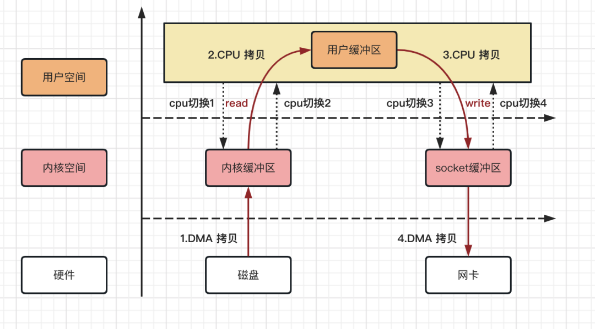
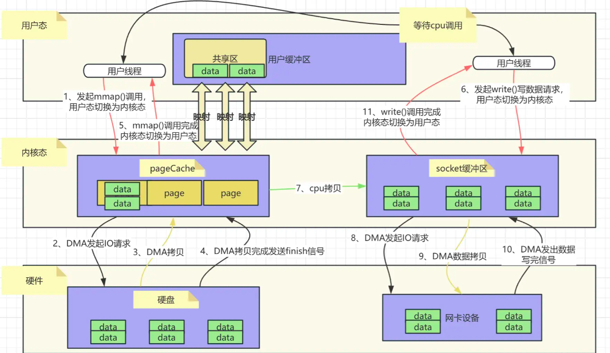
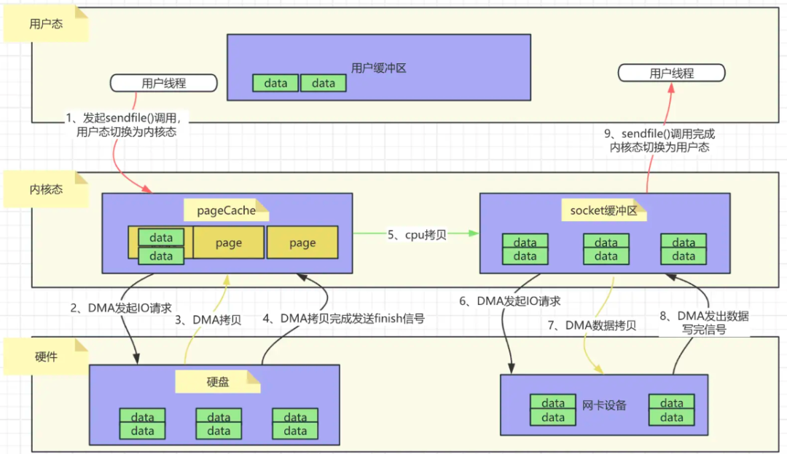
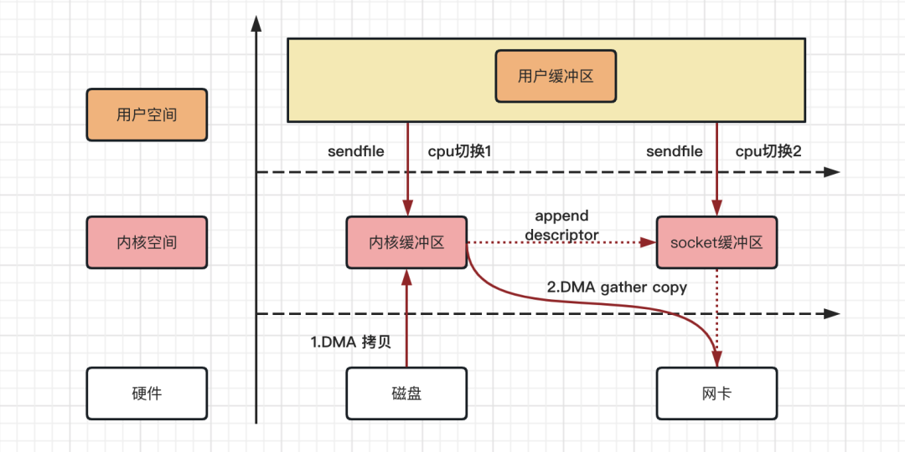
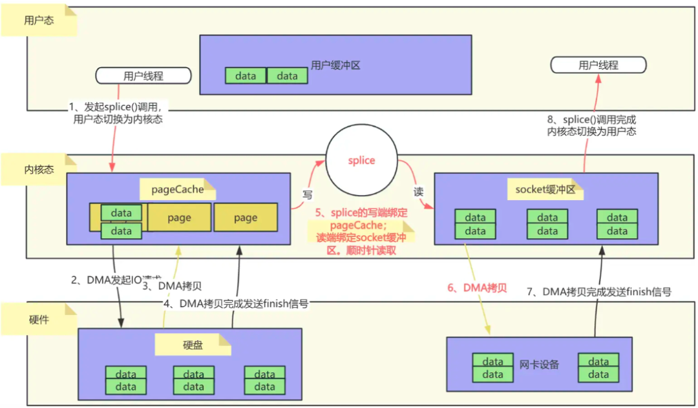
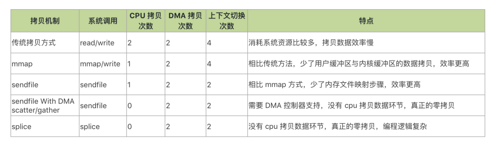

## 简介

这里我想用一位老哥的话来对零拷贝进行解释：

> Zero copy is most commonly applied to I/O and the interaction between software and OS kernels.
>
> The traditional way that works is that (details vary by OS and type of hardware) the kernel receives a hardware interrupt from some peripheral like a network card or hard disk controller, which can send and receive data. That interrupt means “I have some data for you” and it’s the job of the kernel to go collect that data in some fashion (the hardware might have access to a bit of memory directly, or it might get copied into memory by the kernel, depending on what it is), and deliver it to whatever application is interested in it.
>
> Historically, the way applications deal with that is something resembling a stream API, like Java’s InputStream.
>
> But unless you are just reading and immediately discarding the data - if you’re, say, saving it to disk - then you’re going to make an intermediate copy of the data in your process’ memory - and that has a cost.
>
> Wouldn’t it be nicer if the kernel could just hand your program a pointer to the data where it was received from the driver - and if you’re, say, saving it to a file or forwarding it on the network, you could, in turn, say to the kernel “here’s a pointer to some memory whose contents you should send *here*”?
>
> Modern memory managers - which can update the mapping from physical memory to process memory - make some interesting things possible. And for file I/O, memory mapping solves a lot as well - just tell the kernel *hey, send these bytes of this file to the network card* and if it’s already mapped or cached, that often means the network driver just gets handed a pointer to the memory where it already is. No read the bytes from here, copy them to a specific buffer area needed.
>
> So, the result is, far less pointless overhead when doing I/O, and far more scalable, since doing I/O that way is asking the hardware to do a *lot* less work.

翻译：

零拷贝是一种常应用于 I/O 以及软件和操作系统内核之间的交互的数据拷贝技术。

说到零拷贝，需要先说一下传统的拷贝方式（具体细节因操作系统和硬件类型而异）。一般来说，内核会从一些外设（如网卡或硬盘控制器）接收硬件中断，这些外设可以发送和接收数据。当这些中断发生时，意味着“外设有一些数据要给内核”，而内核的任务是以某种方式收集这些数据，并将其传递给任何对其感兴趣的应用程序。

> 硬件可能直接访问一点内存，或者内核可能会将其复制到内存中，具体取决于硬件类型。(DMA 技术)

从历史上看，应用程序处理这种外设与内核通信的情况都采用类似流 API 的方式，比如 Java 的 InputStream。

问题在于：除非应用只是读取数据然后立即丢弃数据(比如说，如果应用要将数据保存到磁盘上)，**一般情况下都需要在进程的内存存储一份数据的副本**。这种在内存中的拷贝都会带来额外的成本。

因此就会有人想到更好的办法：如果**内核能够直接将驱动程序接收到数据的存储位置包装为一个指针**，并给到应用程序使用。当然，我们也可以反过来，假设我们要将外设给到的数据保存到文件中或进行网络传输，此时可以对内核说 “这是一个指向一些内存的指针，你应该将其内容发送到这里”。

现代内存管理器 —— 能够更新从物理内存到进程内存的映射 —— 使得一些有趣的事情成为可能。

在文件 I/O 场景，内存映射解决了很多问题：

* 我们告诉内核需要将某个文件的某些字节发送到网卡，此时，如果这些数据已经被映射或缓存的话，网络驱动程序只需获得一个指向已存在数据的内存的指针即可，**而无需从内存重新读取字节并将它们复制到所需的特定缓冲区**。这就是零拷贝。因此，在进行 I/O 时，无意义的开销大大减少，并且可扩展性大大提高(以这种方式进行 I/O 意味着要求硬件做的工作少得多)。

> 后续完全复制：https://mp.weixin.qq.com/s/ncGovyLYla3jVj3pq3ERuw，并加了些自己的理解

## 传统 IO 拷贝方式

传统的IO拷贝执行流程主要涉及用户空间、内核空间以及硬件之间的数据交互。在这个过程中，数据通常需要从硬盘（或其他存储设备）读取到内核缓冲区，然后再复制到用户缓冲区，最后根据需要将数据发送到网络或其他外部设备。如下图：

> 下面，步骤 1-4 是一次读数据的流程，5-8 是一次写数据的流程。两个流程各包含了 2 次 CPU 切换和拷贝、2 次内核态用户态切换以及 2 次 DMA 拷贝。

1. 用户进程发起读请求：
   - 当用户进程需要读取文件时，它会通过系统调用（如`read()`）向操作系统发起读请求。
   - 此时，用户进程的上下文从用户态切换到内核态。
2. DMA拷贝数据到内核缓冲区：
   - 操作系统接收到读请求后，会利用DMA（Direct Memory Access，直接内存存取）控制器将数据从硬盘（或其他存储设备）拷贝到内核缓冲区。
   - 这个过程是由DMA控制器完成的，不需要CPU的参与，从而减轻了CPU的负担。
3. CPU拷贝数据到用户缓冲区：
   - 数据被DMA拷贝到内核缓冲区后，CPU会将数据从内核缓冲区拷贝到用户缓冲区。
   - 这个过程需要CPU的参与，因为它需要执行内存访问指令来完成数据的复制。
4. 用户进程处理数据：
   - 数据被拷贝到用户缓冲区后，用户进程可以对其进行处理。
   - 此时，用户进程的上下文从内核态切换回用户态。
5. 用户进程发起写请求（如果需要）：
   - 如果用户进程需要将数据写入到网络或其他外部设备，它会通过系统调用（如`write()`）向操作系统发起写请求。
   - 同样，用户进程的上下文会从用户态切换到内核态。
6. CPU拷贝数据到socket缓冲区：
   - 操作系统接收到写请求后，CPU会将数据从用户缓冲区拷贝到socket缓冲区（或其他设备缓冲区）。
   - 这个过程也需要CPU的参与。
7. DMA拷贝数据到外部设备：
   - 最后，DMA控制器会将数据从socket缓冲区拷贝到网卡（或其他外部设备），完成数据的发送。
   - 这个过程同样是由DMA控制器完成的，不需要CPU的参与。
8. 系统调用返回：
   - 当数据成功发送后，系统调用会返回给用户进程，用户进程的上下文从内核态切换回用户态。

从上述过程可以看出总共经历了4 次拷贝次数、4 次上下文切换次数。

其中数据拷贝次数包括2 次 DMA 拷贝，2 次 CPU 拷贝；而CPU 切换次数包括4 次用户态和内核态的切换。

## 零拷贝优化

零拷贝技术**并非指完全没有数据拷贝的过程**，而是减少用户态和内核态的切换次数以及CPU拷贝的次数。它通常通过直接内存访问（DMA）技术和内存映射（如mmap）等机制来实现。

> 零拷贝的主要优化点在于：减少用户态、内核态的切换次数，降低 CPU 拷贝次数——数据就放在同一个内存地，不用转一次。

1. DMA技术：DMA允许硬件设备（如网卡、硬盘控制器等）直接访问内存，而无需CPU的介入。在数据传输过程中，DMA控制器负责将数据从源地址传输到目标地址，从而减少了CPU的拷贝工作。
2. 内存映射：内存映射技术将文件或设备的内容映射到进程的地址空间中，使得进程可以直接访问这些数据，而无需通过传统的读/写系统调用。这种方式减少了数据在用户空间和内核空间之间的拷贝次数。

零拷贝技术广泛应用于网络传输、文件读写等场景，以提高数据传输效率和系统性能。

零拷贝技术的实现方式有多种，包括但不限于以下几种：

1. sendfile系统调用：sendfile 系统调用允许在**内核空间中直接传输数据**，避免了数据在用户空间和内核空间之间的额外拷贝。
2. mmap 内存映射：mmap 函数通过**内存映射将文件或设备的内容映射到进程的地址空间**中，使得进程可以直接访问这些数据。这种方式减少了数据在用户空间和内核空间之间的拷贝次数，并提高了数据访问速度。
3. splice 系统调用：splice 系统调用用于在管道（pipe）或套接字（socket）之间高效地传输数据。它允许将一个文件描述符的数据直接传输到另一个文件描述符，而无需经过用户空间的拷贝。

零拷贝技术的优势在于能够显著提高数据传输效率和系统性能，减少CPU和内存的开销。然而，它也面临一些挑战：由于零拷贝技术减少了数据在用户空间和内核空间之间的拷贝次数，因此**可能会增加安全风险**。例如，恶意程序可能会利用零拷贝技术绕过某些安全机制来访问敏感数据。因此，在实现零拷贝技术时需要加强安全措施。

## mmap 原理

> 这一篇写得也很好：https://www.cnblogs.com/binlovetech/p/17712761.html

mmap技术利用了虚拟内存的特性，将**内核中的读缓冲区与用户空间的缓冲区进行映射**。这种映射关系建立后，进程可以直接通过访问虚拟内存地址来读写文件内容。

> 进程访问到的内存全是虚拟内存，他们指向的具体物理地址需要 MMU 硬件加上其他机制进行转换，这给到了 mmap 优化的空间。
>
> 在 Linux 系统中：
>
> 1. 一个文件包含多个物理磁盘块，也对应多个文件数据页，这些页存储在内核态的物理地址中，由一个叫`page cache`的数据结构存储；
> 2. `page cache`和文件相关，**和进程是没有关系的**，多个进程可以打开同一个文件，每个进程中都有有一个 struct file 结构来描述这个文件，但是**一个文件在内核中只会对应一个`page cache`**。
> 3. `page cache`有权限，是只读的，而且在进程间共享。因此在写入场景时，需要在物理内存中拷贝一份完整的`page cache`再最终写入硬盘。

具体过程：

1. 映射建立：

- 用户进程通过mmap系统调用，请求将**文件的某个部分或全部内容映射到进程的虚拟地址空间**。(注意，此时文件假设已经被 OS 从硬盘读取或者通过 DMA 拷贝到了内存中)
- 内核响应这个请求，创建映射关系，并将文件的页缓存（page cache）与进程的虚拟内存地址进行绑定。

2. 数据访问：

- 当用户进程访问映射后的虚拟内存地址时，**如果对应的内存页尚未加载到物理内存中**，会触发缺页异常。
- 内核处理缺页异常，将文件内容从磁盘加载到页缓存，并更新进程的页表，使页表指向页缓存中的相应页。

3. 数据读写：

- 用户进程对映射后的虚拟内存地址进行读写操作，这些操作实际上是对页缓存的读写。
- **由于页缓存与文件内容保持同步**，因此这些操作也会反映到文件上。

4. 减少拷贝次数：

- 在传统的文件读写操作中，数据需要从磁盘拷贝到页缓存，再从页缓存拷贝到用户空间缓冲区，最后从用户空间缓冲区拷贝到网络缓冲区或磁盘（如果是写操作）。在这个过程中，有着完整的 4 次用户态内核态切换、4 次 CPU 拷贝。
- 而使用mmap后，**数据只需要从磁盘拷贝到页缓存 1 次**，用户进程可以直接通过映射后的虚拟内存地址访问数据，**无需将数据从内核缓冲区拷贝到用户缓冲区这一步**。

> 这次 CPU 拷贝很重要，因为`page cache`的 PTE(page table entry)只读权限特性导致的。在写入时，会触发写保护类型的缺页中断。由内核态触发重新申请一个内存页，然后将 page cache 中的内容拷贝到这个新的内存页中。

一共发生了2 次 DMA 拷贝，1 次 CPU 拷贝CPU 切换次数：4 次用户态和内核态的切换。相比于传统的IO流程少了1次CPU拷贝。

优势：

- 减少了数据拷贝次数和上下文切换次数，提高了IO操作的效率。
- 对于大文件传输，mmap可以显著提高性能。
- 提供进程间共享内存及互相通信的方式。不管是父子进程还是无亲缘关系进程，都可以将自身空间用户映射到同一个文件或者匿名映射到同一片区域。从而通过各自映射区域的改动，打到进程间通信和进程间共享的目的。

限制：

- mmap需要占用进程的虚拟地址空间，对于小文件传输，可能会由于文件内容不满一个页而浪费进程的虚拟地址空间，也就是产生碎片空间的浪费。

## sendfile 原理

sendfile系统调用可以在内核态中直接将文件内容发送到网络设备的缓冲区，避免了数据在用户态和内核态之间的拷贝。

其工作原理如下：

1. 文件描述符：
   - sendfile系统调用需要两个文件描述符作为参数：输入文件描述符（in_fd）和输出文件描述符（out_fd）。输入文件描述符指向要发送的文件，输出文件描述符通常指向一个网络套接字。
2. 数据传输：
   - 当调用sendfile时，内核会直接从输入文件描述符对应的文件缓冲区中读取数据，并将其发送到输出文件描述符对应的网络缓冲区中。这个过程是在内核态中完成的，无需将数据复制到用户空间。
3. 减少上下文切换和数据复制：
   - 使用sendfile系统调用可以减少上下文切换和数据复制的次数。在传统的数据传输方式中，需要多次上下文切换和数据复制。而使用sendfile时，只需一次上下文切换（从用户态切换到内核态进行sendfile调用），并减少了数据在用户空间和内核空间之间的复制。

如下图所示，是一个用户程序**通过sendfile从磁盘读取数据并通过网络发送出去**的过程。

> 注意，这个过程中没有用户态参与修改数据。
>
> 主要场景为：**用户从磁盘读取一些文件数据后不需要经过任何计算与处理就通过网络传输出去**。

整个过程中只发生了2次上下文切换，1次cpu拷贝；相比`mmap+write()`又节省了2次上下文切换。同时**内核缓冲区和用户缓冲区也无需建立内存映射**，节省了内存上的占用开销。

### 实现细节

DMA（Direct Memory Access）：

- 在sendfile系统调用的过程中，DMA技术被用来加速数据传输。DMA允许硬件设备（如磁盘和网络设备）直接访问内存，而无需CPU的介入。这进一步提高了数据传输的效率。

管道和环形缓冲区：

- 在某些实现中，sendfile可能会使用**管道和环形缓冲区**来优化数据传输。例如，当**需要将文件数据拷贝至socket缓冲区**时，可以临时创建一个管道（环形缓冲区），将文件数据先拷贝至管道，再将管道数据迁移至socket缓冲区。**这个过程并不是真正的数据拷贝，而是将指针指向内存地址**。

splice系统调用：

- 从Linux内核2.6.17版本开始，splice系统调用被用来在内部实现sendfile。splice可以将一个文件描述符的数据直接传输到另一个文件描述符，也可以将数据从一个文件描述符传输到网络设备的缓冲区。它支持零拷贝操作，并提供了更灵活的数据传输方式。

### sendfile+DMA scatter/gather相比单纯的sendfile有何优势

以下是对这两种技术的详细比较：

1. 单纯的sendfile
   - 拷贝过程：sendfile系统调用在Linux内核中实现了将磁盘数据通过DMA拷贝到内核态Buffer后，再通过CPU拷贝（或少量参与）和DMA拷贝到网卡设备的过程。尽管sendfile已经减少了CPU的拷贝负担，**但在数据从内核Buffer传输到socket Buffer的过程中，CPU仍然需要参与一定的拷贝或调度工**作。
   - 拷贝次数：通常包括2次DMA拷贝和1次CPU拷贝（尽管在某些实现中CPU拷贝可能被优化至最低程度），以及必要的上下文切换。
2. sendfile+DMA scatter/gather
   - 拷贝过程：在Linux 2.4内核版本中引入的SG-DMA技术，对DMA拷贝加入了scatter/gather操作。这意味着DMA控制器可以直接从内核空间缓冲区中读取数据并传输到网卡，无需CPU的进一步拷贝。
   - 拷贝次数：实现了真正的零拷贝，即全程没有CPU参与数据拷贝。数据拷贝完全由DMA控制器完成，包括2次DMA拷贝和0次CPU拷贝。

### splice 如何实现零拷贝

### splice的流程

splice的工作流程大致如下：

1. 准备阶段：
   - 在使用splice之前，通常需要创建一个管道（pipe）作为数据的中转站。这个管道并不会真正存储数据，而是作为一个**通道来传递数据指针或元数据**。
2. 数据拷贝阶段：
   - 使用splice系统调用，将源文件（如磁盘文件）的数据直接“拷贝”到管道的写端。这里的“拷贝”实际上是将文件的页缓存（Page Cache）与管道的环形缓冲区（Ring Buffer）进行绑定。
   - 接着，再次使用splice系统调用，将管道读端的数据“拷贝”到目标文件（如网络套接字）中，这一步CPU并没有参与数据拷贝，因为它只是将管道的环形缓冲区与目标文件的缓冲区进行绑定，并传递数据指针。
3. 数据传输完成：
   - 通过上述两次splice操作，数据就完成了从源文件到目标文件的传输，而无需经过用户态的拷贝。这大大提高了数据传输的效率。

这个过程中全程没有CPU参与数据拷贝。数据拷贝完全由DMA控制器完成，包括2次DMA拷贝和0次CPU拷贝。

## 对比图

