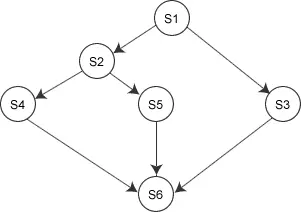
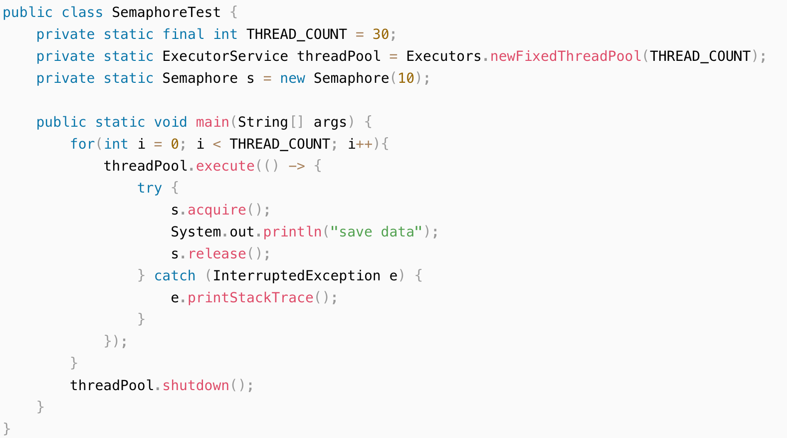

## 简介

信号量机构是一种功能较强的机制，可用来解决互斥与同步的问题。在长期且广泛的应用中，信号量机制得到了很大的发展。由最初的整形信号量，经过记录性信号量、AND信号量，最后发展为“信号量集”。

## 信号量分类

### 整形信号量

信号量如果单纯是一个整数型的变量，那么就称为整型信号量，**它的值记录了系统中某种资源的数量**。

整型信号量被定义为一个用于表示资源数目的整型量S，它只能被两个标准的原语wait(S)和signal(S)来访问，也可以记为“P操作”和“V操作”。可描述为：

```c
wait(S){
    while (S<=0);
    S=S-1;
}//p操作
signal(S){
    S=S+1;
}//v操作
```

wait操作中，只要信号量S<=0，就会不断地测试。因此，该机制并未遵循“让权等待” 的准则，而是使进程处于“忙等”的状态。

以进程 P0，P1 为例进行说明：

```c
P0：                    P1:
wait(S)                wait(S)            // 进入区
critical section       critical section   // 临界区
signal(S)              signal(S)          // 退出区 
```

我们假定 P0 想要进入临界区：

1. P0 在进入区申请资源：执行 P 操作，进行“检查”和“上锁”
   1. 此时，由于 S 一开始是1（表示目前有一个资源可以使用），所以 P0 可以跳过循环，成功申请到资源。
2. S 减一变为 0，代表已经没有可用资源了 —— 这一步也相当于上锁
3. P1 也想要申请资源，来到进入区执行 P 操作，由于 S = 0，所以此时 P1 陷入了死循环
4. P0 完成任务后会在退出区释放资源，S 加一变为 1
5. P1 此时才有机会退出循环，进而申请资源。

整个过程其实和之前介绍的方法是很类似的，但是由于这次，“检查”和“上锁”两个操作被封装在一个原语里，所以这两个操作必定是一气呵成、无法被打断的，这就避免了某个进程钻空子的现象。但是同时我们也发现，在 P0 时间片用完后，P1 仍然会占用处理机进行没有意义的死循环，也就是**仍然违背了“让权等待”的原则**。

在此基础上，又出现了记录型信号量。

### 记录型信号量

记录型信号量是不存在“忙等”现象的进程同步机制。除了需要一个用于代表资源数目的整型变量 value 外，再增加一个进程链表 L，用于链接所有等待该资源的进程，记录型信号量是由于釆用了记录型的数据结构得名。记录型信号量可描述为：

```c
typedef struct {
    int value
    sturct process *L
} semaphore
```

记录型信号量的思想其实是，如果由于 P0 在使用临界资源而导致 P1 暂时无法使用，那么干脆就不给 P1 陷入循环的机会，**直接让它自己去阻塞队列**，这样 P1 在被唤醒之前，永远无法占用处理机，也自然就不可能出现白白占用处理机的情况。而在 P0 释放资源后，我们才来考虑唤醒 P1。

相应的 wait(S) 和 signal(S) 的操作如下：

```c
wait (semaphore S){
    S.value--
    if(S.value < 0){
        block(S.L)
    }
}
signal(semaphore S){
    S.value++
    if(S.value <= 0){
        wakeup(S.L)
    }
}
```

`value` 是可用的资源数，当它大于 0 的时候自然是存在可用资源（供大于求），当它小于 0 的时候，则说明不仅无可用资源而且有其他进程等着用（供不应求）。在进入区 value 一定会减一，表示申请到了资源，或者表示存在着某个进程有想要申请资源的意愿。

同样，举个例子：

```c
PO:            P1              P2           P3
wait(S)        wait(S)         wait(S)      wait(S)
临界区          临界区          临界区        临界区
signal(S)      signal(S)       signal(S)    signal(S)
```

假设计算机中有两台可用的打印机 A 和 B（也就是说，value = 2），有四个进程需要用到打印机资源。

1. P0 先占有打印机，其在进入区申请资源。由于 value 一开始是 2，所以 P0 成功申请到资源 A，之后 value 数量减一变为 1。P0 停留在临界区。
2. 接下来 P1 尝试占有处理机，申请到资源 B，value 由 1 变为 0。P1 停留在临界区“干活”。两个打印机都被占用了。
3. 然后 P2 尝试占有处理机并申请资源，value 由 0 变为 -1 < 0。此时，value < 0 说明无可用资源，P2 被**放入**阻塞队列。
4. P3 来申请资源时，和 P2 一样，因为没有资源也被放入阻塞队列。value 由 -1 变为 -2。
5. P2，P3 都从运行态转为阻塞态。
6. P0 执行完毕，于是在退出区执行 P 操作释放资源，将 value 加一变为 -1。
7. 注意，此时在`signal`函数中，P1 的 P 操作触发了 P2 的唤醒。
8. P2 从阻塞态回到就绪态，并进入临界区，在完成后同样来到退出区释放资源，**value 由 -1 变为 0**。
9. P2 执行完毕，在`signal`函数中，P2 的 P 操作触发 P3 唤醒。
10. P3 回到就绪态，并直接进入临界区开始工作。
11. P3 执行完毕，在`signal`函数中，value 由 0 变为 1，**此时没有进程等待唤醒**。

自此，P0，P2，P3 都拿到了 A 资源，而 P1 也在不久后完成工作，在退出区释放资源 B，此时 value 从 1 变回最初的 2 ，代表占用的资源已经全数归还。

> PS：当然，实际情况还可能是，P2 拿到了 A 资源，P3 拿到了 B 资源，但分析过程也是大同小异的。

### AND信号量

上述进程互斥问题都是针对一个临界资源而言的，在有些应用场合，一个进程需要同时获得两个或者更多的资源。AND信号量可以解决多临界资源申请问题。假设有S1，...Sn，N个资源，进程必须申请到所有资源后才可执行，则其wait 和signal描述为：

```c
Swait(S1,S2,...,Sn)
{
    if(S1>=1 && S2>=1 &&...&& Sn>=1)    // 注意这里是先检查后分配
        for (i=1;i<=n;i++) Si--
    else block(Si.L)                    // 将当前进程放置在第一个不满足Si>=1的阻塞队列中 
}
Ssignal(S1,S2,...,Sn)
{
    for(i=1;i<=n;i++){
        Si++
        wakeup(Si.L)
    }    	
}
```

假设有 P0，P1 两个进程，它们都需要在临界区同时用到两个资源 AB，这两个资源 AB 的信号量分别用 S1=1，S2=2 表示：

```c
PO:               P1:                     
Swait(S1,S2)      Swait(S1,S2)       
临界区             临界区             
Ssignal(S1,S2)    Ssignal(S1,S2)   
```

1. 处理机来到 P0，`Swait`中 if 判断的条件很苛刻，要求必须所有资源都够用才能给 P0 分配所需资源，因为初始信号量分别为 1 和 2 ，所以 P0 同时申请到了资源，来到临界区执行任务；
2. 然后 P1 来申请资源，`Swait`中尽管 B 资源满足`S2=1 >= 1`，但是 A 资源是不满足条件的，**但凡有一个条件不满足，P1 进程都无法得到任何资源**，所以此时 P1 进程被送到 A 资源对应的阻塞队列。
3. P0 完成任务后来到退出区，把自己占有的资源都释放了，
   1. 释放 A 资源的时候顺便查看对应的阻塞队列是否有进程在等待，刚好 P1 在阻塞队列，所以这时候把 P1 唤醒，送它到就绪队列；
   2. 释放 B 资源的时候也查看对应的阻塞队列是否有进程在等待，这时候是没有的。

P0 执行完之后，P1 再从就绪态进入运行态，完成自己的工作。

### 信号量集

在记录型信号量机制中，wait和signal操作只能进行加一减一的操作。当需要一次性需要申请N个同类资源时，需要进行N次操作，这显然是低效的。为方便对资源的控制，每种资源在分配前需要检查其数量是否在其极限值之上。为此，对AND信号量进行扩充。S为信号量，d为需求量，t为下限值：

```c
Swait(S1,t1,d1, S2,t2,d2 ,..., Sn,tn,dn)
{
    if(S1>=t1 && S2>=t2 &&...&& Sn>=tn)   
        for (i=1;i<=n;i++) Si = Si-di
    else block(Si.L)
}
Ssignal(S1,d1, S2,d2,..., Sn,dn)
{
    for(i=1;i<=n;i++){
        Si = Si+di
        wakeup(Si.L)
    }    	
}
```

这里不难发现，一般信号量集机制是相对于 AND 信号量集机制来说，更加普遍和一般的机制 ——

从 P0 进程的角度来说，执行 P 操作的时候，不仅要传多个信号量进去，而且每一个信号量还有配套的 t 和 d，分别表示“最小必须满足值”和“分配数目”，也就是说，每一个资源 Si 的数目都必须大于等于对应的 ti，才能将其中的 di 个分配给某个进程；同理，执行 V 操作的时候，也是要传多对 Si，di 进去，让每一种资源都得到一定的释放，同时唤醒对应阻塞队列中的进程。

从 P1 进程的角度来说，可能由于某个资源被分配给 P0 而导致自己对应的 ti 不符合要求，**但凡有一个条件不满足，P1 进程都无法得到任何资源**，所以 P1 进入这个对应资源的阻塞队列，直到后面 P0 释放对应资源并尝试唤醒队列中的进程的时候，P1 才会从阻塞态回到就绪态，进入就绪队列。

## 信号量的应用

### 实现进程互斥

信号量机构能很方便地解决进程互斥问题。设 S 为实现进程 P1、P2 互斥的信号量，由于每次只允许一个进程进入临界区，所以 S 的初值应为 1（即可用资源数为1)。只需把临界区置于 P(S) 和 V(S) 之间，即可实现两进程对临界资源的互斥访问。其算法如下：

```c
semaphore mutex = 1;
P0(){
    P(mutex)
    critical section
    V(mutex)
}
P1(){
    P(mutex)
    critical section
   	V(mutex)
}
```

要实现互斥，关键就是要**在临界区之前使用 P 操作进行上锁，在临界区之后使用 V 操作进行解锁**。

### 实现进程同步

信号量机构能用于解决进程间各种同步问题。设 S 为实现进程 P1、P2 同步的公共信号量，初值为 0。进程 P2 中的语句 y 要使用进程 P1 中语句 x 的运行结果，所以只有当语句 x 执行完成之后语句 y 才可以执行。其实现进程同步的算法如下：

```c
semaphore S = 0; //初始化信号量
P1() {
     P1 process
     x; //语句x
     V(S); //告诉进程P2,语句 x 已经完成
 }

P2() {
     P2 process1
     P(S) ; //检查语句 x 是否运行完成
     y; // 检查无误，运行 y 语句
     P2 process2
 }
```

在前面，我们一直用大量的篇幅解释进程互斥的实现，那么如何实现进程同步呢？也就是说，多个进程一起完成某项任务的时候，如何确保它们按照一定的先后顺序有秩序地执行呢？

实际上，信号量机制也可以很好地实现进程同步。它的核心是三个关键步骤：

- 设置信号量初始值为 0
- 在”前操作“之后执行 V(S)
- 在”后操作“之前执行 P(S)

先来解释一下原理，即：为什么这样就可以保证两个操作的前后顺序呢？首先我们先记住一点，**0 是一个非常关键的”分水岭“**，大于 0 的时候不会发生阻塞，小于0则会发生阻塞。

我们要确保”前操作“在前面，”后操作“在后面，实际上只要做到三件事：V 在”前操作“后面、P 在”后操作“前面、V 在 P 前面。第一个和第二个条件都是可以通过实际书写代码来做到的，而**要达到第三个条件 —— V 在 P 前面，就有必要让信号量初始值为 0**，因为一旦初始值为 0，则每当 P 想要”违规“抢先于 V 执行的时候，都会由于首先执行信号量自减的操作而导致当前所在进程进入阻塞队列 ，也就是说：

> P 先于 V 执行 ==> P 所在进程会被阻塞 ==> ”后操作“始终无法执行

所以，在这种情况下，就只能转而执行 V 所在的进程了。在这个进程里，由于 V 在”前操作“后面，所以一定是”前操作“执行完了再去执行 V。而执行 V 就会自增信号量，同时唤醒对方进程，对方进程再去顺序执行 P 操作 —— **虽然此时信号量又自减，但是是在加一的基础上自减，所以并不会导致再次阻塞**，所以 P 执行完后就顺序执行”后操作“。由此，我们确保了两个操作一定是严格按照先后顺序执行的。

```c
// 顺序应该是：code1,code2,code4

P0：                 P1:
code 1               P(S)
code 2               code 4
V(S)                 code 5
code 3               code 6
```

我们设想比较差的情况 —— P1 拼命想要抢先执行 code 4，看看会发生什么。(实现还是“记录型信号量“)

1. 假设是 P1 首先占用处理机，那么就会执行 P 操作，这个操作使得信号量由 0 变成 -1，进而进入 if 代码块，使得 P1 进程阻塞；
2. 这之后，处理机来到 P0，执行 code1，code2，V 操作，使得信号量由 -1 变成 1，同时唤醒 P1 进程；
3. P1 进程使得信号量由 1 变成 0，但是不满足 if 条件，所以不会阻塞自己，而是正常往下执行，来到 code4。
4. 以上，整个过程确保了按照 code1，code2，code4 的顺序执行。

### 利用信号量实现前驱关系

信号量也可以用来描述程序之间或者语句之间的前驱关系。下图给出了一个前驱图，其中S1, S2, S3, …, S6是最简单的程序段。为保证S1 -> S2、 S1 -> S3、 S2 -> S4、S2 ->S5、S3 -> S6、S4 -> S6、S5 -> S6等前驱关系需要设置信号量a1、a2、bl、b2、c、d、e，并初始化为0。


```
semaphore al=a2=bl=b2=c=d=e=0; //初始化信号量
 S1() {
     S1 process
     V(al); V(a2) ; //S1已经运行完成
 }
 S2() {
     P(a1); //检查S1是否运行完成
     S2 process
     V(bl); V(b2); // S2已经运行完成
 }
 S3() {
     P(a2); //检查S1是否已经运行完成
     S3 process
     V(c); //S3已经运行完成
 }
 S4() {
     P(b1); //检查S2是否已经运行完成
     S4 process
     V(d); //S4已经运行完成
 }
 S5() {
     P(b2); //检查S2是否已经运行完成
     S5 process
     V(e); // S5已经运行完成
 }
 S6() {
     P(c); //检查S3是否已经运行完成
     P(d); //检查S4是否已经运行完成
     P(e); //检查S5是否已经运行完成
     S6 process
 }
```

这里不难发现，一般信号量集机制是相对于 AND 信号量集机制来说，更加普遍和一般的机制 ——

从 P0 进程的角度来说，执行 P 操作的时候，不仅要传多个信号量进去，而且每一个信号量还有配套的 t 和 d，分别表示“最小必须满足值”和“分配数目”，也就是说，每一个资源 Si 的数目都必须大于等于对应的 ti，才能将其中的 di 个分配给某个进程；同理，执行 V 操作的时候，也是要传多对 Si，di 进去，让每一种资源都得到一定的释放，同时唤醒对应阻塞队列中的进程。

从 P1 进程的角度来说，可能由于某个资源被分配给 P0 而导致自己对应的 ti 不符合要求，**但凡有一个条件不满足，P1 进程都无法得到任何资源**，所以 P1 进入这个对应资源的阻塞队列，直到后面 P0 释放对应资源并尝试唤醒队列中的进程的时候，P1 才会从阻塞态回到就绪态，进入就绪队列


## 应用场景

### 流量控制

https://blog.csdn.net/cold___play/article/details/104064342



## 不同实现

Java 版本的实现分析：

1. https://juejin.cn/post/7005875906119991327
2. https://juejin.cn/post/7005875906119991327

C 版本的实现：

https://www.cnblogs.com/biyeymyhjob/archive/2012/07/21/2602015.html