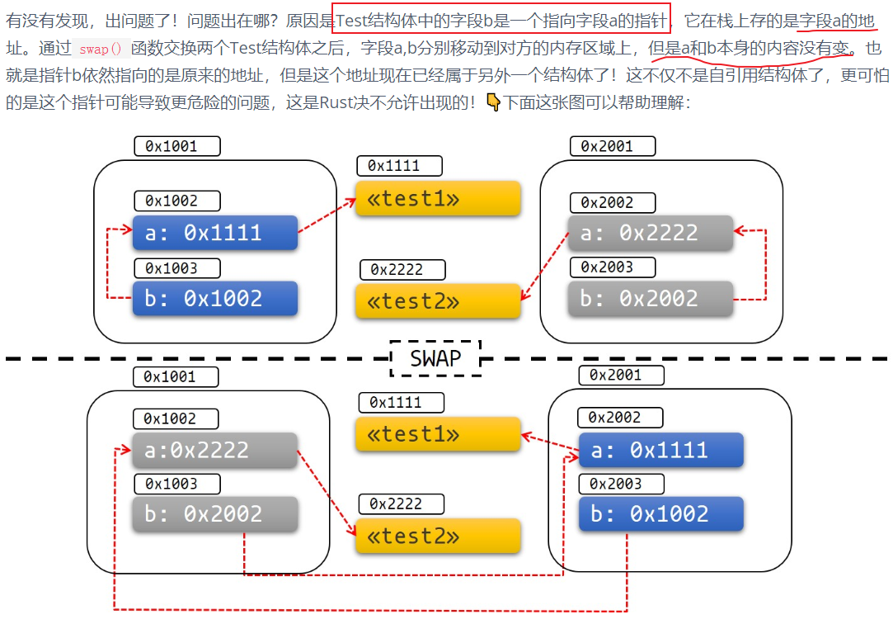

# 异步 task 的 cancel

# Future 以及 Task

## Future

首先看一下 Future 的类型：

```rust
pub trait Future {
    /// The type of value produced on completion.
    #[stable(feature = "futures_api", since = "1.36.0")]
    #[rustc_diagnostic_item = "FutureOutput"]
    type Output;

    #[lang = "poll"]
    #[stable(feature = "futures_api", since = "1.36.0")]
    fn poll(self: Pin<&mut Self>, cx: &mut Context<'_>) -> Poll<Self::Output>;
}
```

对于一个 Future 抽象来说，最为重要的就是理解到他是一个状态机，他本质上存在三个状态：

1. running，这个状态是在使用 .await 激活时，其执行态。
2. pending，这个状态是`Output`中的状态，其作为一个返回值可以被 Runtime 感知，此时 Future 释放了 CPU 资源，在等待 IO。
3. `Ready(val)`，这个状态也是`Output`中的状态，其作为一个返回值可以被 Runtime 感知，此时 Future 完成。

Future 本身极为好懂，但是`Pin`的历史包袱就比较大了。`Pin`这个类型几乎是单纯为了异步而设计的，根源在于解决自引用导致的内存安全问题。

## Pin

自引用结构体（Self-Referential Structs）是一个这个样的结构体，它内部某个成员是对另外一个成员的引用：

```Rust
struct Test<'a> {
    a: String,
    b: &'a String,
}

fn main() {
    let a = String::from("Hello");
    let _test = Test { a, b: &a };
//  编译不过：
//    let _test = Test { a, b: &a };
//  |                        -     ^^ value borrowed here after move
//  |                        |
//  |                        value moved here
}
```

如果使用指针绕开这个问题：

```rust
#[derive(Debug)]
struct Test {
    a: String,
    b: *const String, // 改成指针
}

impl Test {
    fn new(txt: &str) -> Self {
        Test {
            a: String::from(txt),
            b: std::ptr::null(),
        }
    }

    fn init(&mut self) {
        let self_ref: *const String = &self.a;
        self.b = self_ref;
    }

    fn a(&self) -> &str {
        &self.a
    }

    fn b(&self) -> &String {
        unsafe {&*(self.b)}
    }
}
/// 如果出现 move 的话
fn main() {
    let mut test1 = Test::new("test1");
    test1.init();
    let mut test2 = Test::new("test2");
    test2.init();

    println!("a: {}, b: {}", test1.a(), test1.b());
    // 使用swap()函数交换两者，这里发生了move
    std::mem::swap(&mut test1, &mut test2);
    test1.a = "I've totally changed now!".to_string();
    println!("a: {}, b: {}", test2.a(), test2.b());
}

/// 会出现奇怪的结果
a: test1, b: test1
a: test1, b: I've totally changed now!
```



上面出现的问题根因在于`std::mem::swap(&mut test1, &mut test2)`允许在这种情况下交换数据，此时出现了 UB。

```rust
#[inline]
#[stable(feature = "rust1", since = "1.0.0")]
pub fn swap<T>(x: &mut T, y: &mut T) {
    // SAFETY: the raw pointers have been created from safe mutable references satisfying all the
    // constraints on `ptr::swap_nonoverlapping_one`
    unsafe {
        ptr::swap_nonoverlapping_one(x, y);
    }
}
```

而实际上，异步代码块(函数)本身会含有一个对自己的引用，这也是为什么自引用问题在异步中如此重要的原因。但其实解决他的方法也十分简单，其实就是依靠类型系统(这也是为什么老外对于 Rust 的类型系统极为自豪的原因，他们很喜欢说"with type system")，如果一个类型的子类是 Unpin 的，那么其父类就是 Unpin 的，而 Unpin 的数据只需要禁止其可变指针的直接使用即可。

> 我们找到了问题的根源在哪，**Pin**就是从根源上解决这个问题的。现在我们很清晰了，似乎是不是可以用一句话概括：**Pin****就是一个不会让你在Safe Rust暴露可变借用** **&mut** **的智能指针?**
>
> 答案是：不全正确。这就是**Pin**概念起初让大家一脸懵逼的地方。下面让**Pin**自己来解答大家的疑惑，**Pin**说：“你们不是想让我保证被我包裹的指针P<T>永远钉住不让move吗？我可以答应，但我有一个原则。那就是我永远不能钉住持有通行证的朋友，这张通行证就是**Unpin**。如果没有这张通行证，请放心，我会把你钉得死死的！”

实际上就是对于一个 Pin 的类型：

```rust
/// 1. 直接 get_mut()
impl<'a, T: ?Sized> Pin<&'a mut T> {
    #[stable(feature = "pin", since = "1.33.0")]
    #[inline(always)]
    pub fn get_mut(self) -> &'a mut T where T: Unpin {
        self.pointer
    }
}
/// 2. 继承 DerefMut
#[stable(feature = "pin", since = "1.33.0")]
impl<P: DerefMut<Target: Unpin>> DerefMut for Pin<P> {
    fn deref_mut(&mut self) -> &mut P::Target {
        Pin::get_mut(Pin::as_mut(self))
    }
}
```

从上面代码可以看出，当且仅当`Pin`中的数据是`Unpin`的才可以拿到可变指针，如果可变指针都拿不到，何尝来谈起自引用问题。

大多数情况下我们无需考虑 Pin 的问题，因为所有的类型都是默认 Unpin 的：

```rust
#[lang = "unpin"]
pub auto trait Unpin {}

#[stable(feature = "pin", since = "1.33.0")]
impl<'a, T: ?Sized + 'a> Unpin for &'a T {}

#[stable(feature = "pin", since = "1.33.0")]
impl<'a, T: ?Sized + 'a> Unpin for &'a mut T {}

#[stable(feature = "pin_raw", since = "1.38.0")]
impl<T: ?Sized> Unpin for *const T {}

#[stable(feature = "pin_raw", since = "1.38.0")]
impl<T: ?Sized> Unpin for *mut T {}
```

如果要标记一个类型是`!Unpin`的，则需要使用到了幽灵类型(不占任何内存，仅仅标记父 struct act like T in it)：

```Rust
#[stable(feature = "pin", since = "1.33.0")]
#[derive(Debug, Copy, Clone, Eq, PartialEq, Ord, PartialOrd, Hash)]
pub struct PhantomPinned;

#[stable(feature = "pin", since = "1.33.0")]
impl !Unpin for PhantomPinned {}
```

只需要在类型中加入`PhantomPinned`，此时这个类型就是`!Unpin`的。此外也可以自己手动 `impl !Unpin for XXX {}`。Rust 还有一个 unsafe 的阀门提供给高阶玩家：

```rust
/// 不管你有没有实现Unpin，你都可以通过调用这个方法拿到&mut T
impl<'a, T: ?Sized> Pin<&'a mut T> {
    #[stable(feature = "pin", since = "1.33.0")]
    #[inline(always)]
    pub unsafe fn get_unchecked_mut(self) -> &'a mut T {
        self.pointer
    }
}
```

## Task

tokio官方手册[tokio::task](https://docs.rs/tokio/1.12.0/tokio/task/index.html)中用了一句话介绍task：Asynchronous green-threads(异步的绿色线程)。

Rust中的原生线程(`std::thread`)是OS线程，每一个原生线程，都对应一个操作系统的线程。操作系统线程在内核层，由操作系统负责调度，缺点是涉及相关的系统调用，它有更重的线程上下文切换开销。green thread则是用户空间的线程，由程序自身提供的调度器负责调度，由于不涉及系统调用，同一个OS线程内的多个绿色线程之间的上下文切换的开销非常小，因此非常的轻量级。可以认为，它们就是一种特殊的协程。

解释了何为绿色线程后，回到tokio的task概念。什么是task呢？

每定义一个`Future`(例如一个async语句块就是一个Future)，就定义了一个静止的尚未执行的task，当它在runtime中开始运行的时候，它就是真正的task，一个真正的异步任务。

要注意，在tokio runtime中执行的并不都是异步任务，绑定在runtime中的可能是同步任务(例如一个数值计算就是一个同步任务，只是速度非常快，可忽略不计)，可能会长时间计算，可能会阻塞整个线程。tokio严格区分异步任务和同步任务，只有异步任务才算是tokio task。tokio推荐的做法是将同步任务放入blocking thread中运行。从官方手册将task描述为绿色线程也能理解，`tokio::task`只能是完全受tokio调度管理的异步任务，而不是脱离tokio调度控制的同步任务。


`tokio::task`模块本身提供了几个函数：

- spawn：向runtime中添加新异步任务
- spawn_blocking：生成一个blocking thread并执行指定的任务
- block_in_place：在某个worker thread中执行同步任务，但是会将同线程中的其它异步任务转移走，使得异步任务不会被同步任务饥饿
- yield_now: 立即放弃CPU，将线程交还给调度器，自己则进入就绪队列等待下一轮的调度
- unconstrained: 将指定的异步任务声明未不受限的异步任务，它将不受tokio的协作式调度，它将一直霸占当前线程直到任务完成，不会受到tokio调度器的管理
- spawn_local: 生成一个在当前线程内运行，一定不会被偷到其它线程中运行的异步任务

这里的三个spawn类的方法都返回JoinHandle类型，JoinHandle类型可以通过await来等待异步任务的完成，也可以通过abort()来中断异步任务，异步任务被中断后返回JoinError类型。

这些 API 的解释可以参考文档[理解tokio核心(2): task](https://rust-book.junmajinlong.com/ch100/02_understand_tokio_task.html#理解tokio核心2-task)

# Cancel

异步 Task 的 cancel 是一个大问题，他涉及到几个麻烦的地方：

1. 如果一个 task crash 了，如何及时发现并控制？也即如何将 task 做成 unwindSafe 的？
2. 如果一个 task 条件不足需要停止，此时这个 task 正在执行过程中，那么应该在什么时候将其停止？如何安全的跨线程通知其停止？
3. 如果一个 task 处于 pending 状态被 cancel 了，而其要在 running 状态才能执行 cancel 流程，如何去处理？

这些棘手的问题其实本质上和操作系统的线程调度面临的问题是一样的，我们需要对资源有个更合理的管理，并且防止 panic “毒扩散”，不过好在 Rust 所有基本类型都是 UnwindSafe 的，Tokio 在实现上也给我们屏蔽了这一层，我们可以安全的结束线程，只需要防止死锁逻辑导致的 hang 起来 task 即可。

## 何时进行 cancel，如何通知到 Runtime

时间点当然取决于应用程序，但一个非常常见的关闭标准是当应用程序收到来自操作系统的信号时。例如，当在终端中按下ctrl+c时，此时正在运行的程序需要被关闭。为了检测到这一点，Tokio提供了tokio::signal::ctrl_c函数，它会等待直到收到这样的信号：

```rust
use tokio::signal;

#[tokio::main]
async fn main() {
    // ... spawn application as separate task ...

    match signal::ctrl_c().await {
        Ok(()) => {},
        Err(err) => {
            eprintln!("Unable to listen for shutdown signal: {}", err);
            // we also shut down in case of error
        },
    }

    // send shutdown signal to application and wait
}
```

如果有多个关闭条件，则可以使用 mpsc 通道将关闭信号发送到一处。例如：

```rust
use tokio::signal;
use tokio::sync::mpsc;

#[tokio::main]
async fn main() {
    let (shutdown_send, mut shutdown_recv) = mpsc::unbounded_channel();

    // ... spawn application as separate task ...
    //
    // application uses shutdown_send in case a shutdown was issued from inside
    // the application

    tokio::select! {
        _ = signal::ctrl_c() => {},
        _ = shutdown_recv.recv() => {},
    }

    // send shutdown signal to application and wait
}
```

当想要告知一个或多个任务关闭时，可以使用取消标记([Cancellation Tokens](https://docs.rs/tokio-util/latest/tokio_util/sync/struct.CancellationToken.html))。这些标记允许我们去通知到 Task，它们会响应取消请求并终止自己，从而轻松实现 graceful shutdown。

### CancellationToken

要在多个 Task 之间共享`CancellationToken`，必须对其进行 clone。

> 这是由于单一所有权规则要求每个值只有一个所有者。
>
> 当`clone()`被调用时时，我们会得到另一个与原始标记完全相同的标记(可以理解为广播信道接收者)；如果一个 task 被取消，那么另一个获取到 clone 的标记的 task 也会被取消。

以下是在多个 task 中使用`CancellationToken`的官方建议：

1. 首先，创建一个新的`CancellationToken`。
2. 然后，通过在原始`CancellationToken`上调用`clone`方法来创建原始取消标记的克隆。这将创建一个新的标记，可供另一个任务使用。
3. 将原始或克隆的标记传递给应该响应取消请求的任务。
4. 当想要优雅地关闭任务时，在原始或克隆的标记上调用cancel方法。监听原始或克隆标记上的取消请求的任何任务都将被通知关闭。

以下是展示上述步骤的代码片段：

```rust
// Step 1: Create a new CancellationToken
let token = CancellationToken::new();

// Step 2: Clone the token for use in another task
let cloned_token = token.clone();

// Task 1 - Wait for token cancellation or a long time
let task1_handle = tokio::spawn(async move {
    tokio::select! {
        // Step 3: Using cloned token to listen to cancellation requests
        _ = cloned_token.cancelled() => {
            // The token was cancelled, task can shut down
        }
        _ = tokio::time::sleep(std::time::Duration::from_secs(9999)) => {
            // Long work has completed
        }
    }
});

// Task 2 - Cancel the original token after a small delay
tokio::spawn(async move {
    tokio::time::sleep(std::time::Duration::from_millis(10)).await;

    // Step 4: Cancel the original or cloned token to notify other tasks about shutting down gracefully
    token.cancel();
});

// Wait for tasks to complete
task1_handle.await.unwrap()
```

使用`CancellationToken`时，无需在`CancellationToken`被 cancel 时立即关闭任务。而是可以在终止任务之前运行关闭流程(合理的析构以及生命周期处理)，例如将数据刷新到文件或数据库，或在 socket 上发送关闭消息。

### 等待安全的关闭

一旦告诉了其他 task 执行 cancel 之后，我们只需要等待它们关闭完成即可。这是另一个问题，有可能任务未在调度的时候被 cancel 的情况。

Tokio 提供了一个简单的方法————使用任务跟踪器`TaskTracker`。任务跟踪器是一组任务的集合。`TaskTracker`的`wait`方法**会给我们一个将在其所有包含的 Future 都已经执行完毕且任务跟踪器已关闭后才执行完毕的 Future**。下面的例子将生成10个任务，然后使用任务跟踪器等待它们关闭：

```rust
#[tokio::main]
async fn main() {
    let tracker = TaskTracker::new();

    for i in 0..10 {
        tracker.spawn(some_operation(i));
    }

    // Once we spawned everything, we close the tracker.
    tracker.close();

    // Wait for everything to finish.
    tracker.wait().await;

    println!("This is printed after all of the tasks.");
}

async fn some_operation(i: u64) {
    sleep(Duration::from_millis(100 * i)).await;
    println!("Task {} shutting down.", i);
}
```

### 单个 Task 的关闭

要仅终止单个任务，可以使用`JoinHandle::abort`方法，该方法将**尽快**终止任务。请注意，此方法仅在Tokio 1.x和0.3.x中可用:

```
let task = tokio::spawn(start());

...

task.abort();
```


## 如何解决的 Cancel 的问题

所有上面的方法都能保证在`.await`处杀死`real_start`方法。然而，在 task 执行在两个`.awaits`之间时，不可能杀死任务，原因很简单，因为 Tokio 只能在`.await`时切换任务，因为仅只有此时才会 poll 一次 Future 也才会进入到 Executor 的逻辑(.await 去糖代码就是 poll future 一次)。

> [mini-redis](https://github.com/tokio-rs/mini-redis/) 项目包含了一个关于服务器优雅关闭的工程化例子。

Tokio 在其[文档](https://docs.rs/tokio/1.36.0/tokio/task/index.html#cancellation)中给到了具体的设计 Cancel 的方式：

> Spawned tasks may be cancelled using the [`JoinHandle::abort`](https://docs.rs/tokio/1.36.0/tokio/task/struct.JoinHandle.html#method.abort) or [`AbortHandle::abort`](https://docs.rs/tokio/1.36.0/tokio/task/struct.AbortHandle.html#method.abort) methods. When one of these methods are called, the task is signalled to shut down next time it yields at an `.await` point. If the task is already idle, then it will be shut down as soon as possible without running again before being shut down. Additionally, shutting down a Tokio runtime (e.g. by returning from `#[tokio::main]`) immediately cancels all tasks on it.
>
> When tasks are shut down, it will stop running at whichever `.await` it has yielded at. All local variables are destroyed by running their destructor. Once shutdown has completed, awaiting the [`JoinHandle`](https://docs.rs/tokio/1.36.0/tokio/task/struct.JoinHandle.html) will fail with a [cancelled error](https://docs.rs/tokio/1.36.0/tokio/task/struct.JoinError.html#method.is_cancelled).
>
> Note that aborting a task does not guarantee that it fails with a cancelled error, since it may complete normally first. For example, if the task does not yield to the runtime at any point between the call to `abort` and the end of the task, then the [`JoinHandle`](https://docs.rs/tokio/1.36.0/tokio/task/struct.JoinHandle.html) will instead report that the task exited normally.
>
> Be aware that calls to [`JoinHandle::abort`](https://docs.rs/tokio/1.36.0/tokio/task/struct.JoinHandle.html#method.abort) just schedule the task for cancellation, and will return before the cancellation has completed. To wait for cancellation to complete, wait for the task to finish by awaiting the [`JoinHandle`](https://docs.rs/tokio/1.36.0/tokio/task/struct.JoinHandle.html). Similarly, the [`JoinHandle::is_finished`](https://docs.rs/tokio/1.36.0/tokio/task/struct.JoinHandle.html#method.is_finished) method does not return `true` until the cancellation has finished.
>
> Calling [`JoinHandle::abort`](https://docs.rs/tokio/1.36.0/tokio/task/struct.JoinHandle.html#method.abort) multiple times has the same effect as calling it once.
>
> Tokio also provides an [`AbortHandle`](https://docs.rs/tokio/1.36.0/tokio/task/struct.AbortHandle.html), which is like the [`JoinHandle`](https://docs.rs/tokio/1.36.0/tokio/task/struct.JoinHandle.html), except that it does not provide a mechanism to wait for the task to finish. Each task can only have one [`JoinHandle`](https://docs.rs/tokio/1.36.0/tokio/task/struct.JoinHandle.html), but it can have more than one [`AbortHandle`](https://docs.rs/tokio/1.36.0/tokio/task/struct.AbortHandle.html).

从上面的解释中我们就知道几个麻烦的问题 Tokio 是怎么解决的了：

1. task 的 cancel 仅只是对其进行了标记，而实际上的 cancel 是在下一次 .await 时机时。

```rust
/// 这一点上代码直接体现了：
/// Remotely aborts the task.
///
/// The caller should hold a ref-count, but we do not consume it.
///
/// This is similar to `shutdown` except that it asks the runtime to perform
/// the shutdown. This is necessary to avoid the shutdown happening in the
/// wrong thread for non-Send tasks.
pub(super) fn remote_abort(&self) {
    if self.state().transition_to_notified_and_cancel() {
        // The transition has created a new ref-count, which we turn into
        // a Notified and pass to the task.
        //
        // Since the caller holds a ref-count, the task cannot be destroyed
        // before the call to `schedule` returns even if the call drops the
        // `Notified` internally.
      	// 调度了一次
        self.schedule();
    }
}
```

2. 如果一个 task 被 cancel 了，那么以后的 .await 都不会被执行，这个是显而易见的。
3. 一但 cancel 完毕之后，我们拿到的 JoinHandle 如果被 .await 的时候会抛一个意义明确的`cancelled error`。但是，cancel 任务并不保证它一定会有`cancelled error`，因为该 task 可能**会先正常的运行完毕**。

> 例如，如果任务在中止调用和任务结束之间的任何时刻都没有 yeiled 给 runtime 来进行调度，那么 JoinHandle 将会报告任务正常退出。

4. 对JoinHandle::abort的调用只是安排任务 cancel，且会在 cancel 完成之前正常返回。要等待 cancel 完成，需要通过JoinHandle来等待任务完成。同样，JoinHandle::is_finished方法直到 cancel 完成之前都不会返回true。

5. 多次调用JoinHandle::abort具有与一次调用相同的效果。

6. Tokio还提供了AbortHandle，它类似于JoinHandle，不过它没有提供等待任务完成的机制。每个任务只能有一个JoinHandle，但可以有多个AbortHandle。