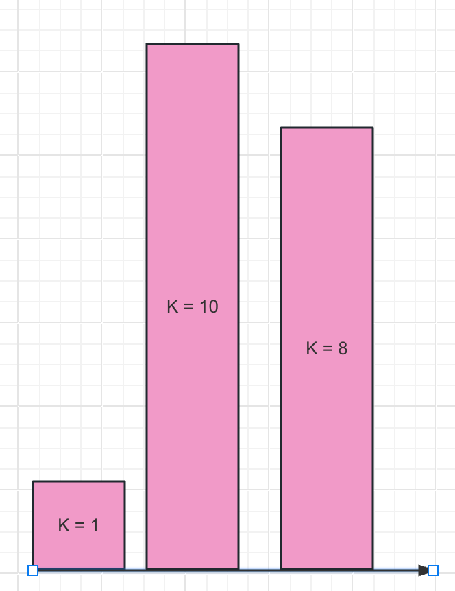
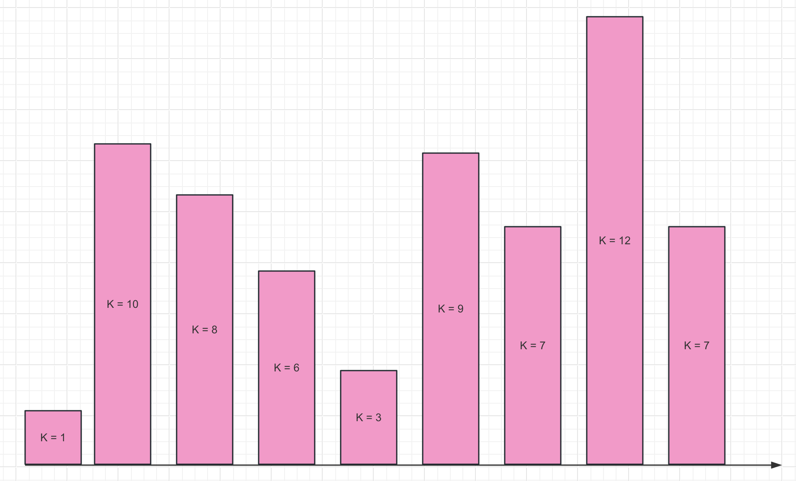

# 允许奇迹发生

今天(3 月 19 号)在车上听播客的时候听到了这么一个话题。引子是OpenAi 科学家[肯尼斯·斯坦利](https://book.douban.com/search/肯尼斯·斯坦利) / [乔尔·雷曼](https://book.douban.com/search/乔尔·雷曼)的一本书：《为什么伟大不能被计划》。

太长不看：

> 允许我们是某个伟大奇迹的垫脚石，相信兴趣和探索的意义。局部最优在人生问题上无法构成全局最优，增加点随机性，更进一步，增加点兴趣带来的方差。虽然九成以上就是玩玩而已，但是最后最差也收获了玩玩而已，最好可能找到某条我们**期望外**目标路径。
>
> 人的局限性决定了我们是没法一次性获取到所有的信息的，也无法看到伟大目标同当下的关联的。我们能做的就是使用最优的搜索办法，去做最大的探索，而最好的条件和路径就是兴趣和专注，去做一些方差大的事。

## 山峰问题——人生抽象

我们从目标开始。基于山峰问题，假设存在一个抽象的目标 k，我们期望找到的 k 尽可能的大。我们爬到一座山顶可以得到对应的 k，想要能够快速搜索出空间内最大的 k 值的山峰。此时我们可能会遇到三个场景：

1. 可见范围，无成本的搜索空间。
2. 无限范围，无成本的搜索空间。
3. 无限范围，有成本的搜索空间。

对于问题一，我们遇到的“任务”或者说可以用于搜索我们收益的空间是这样的：

这里可以用任何最简单的算法完成，一次搜索找到。我们把问题推到问题二，也即经典的山峰问题：

假设每次只能搜索 3 个山峰。我们此时通过穷举出来找寻最高山峰的次数就越来越多了，更严重的是，目前我们画出来的还是能够看到的山峰，有可能我们真正在山峰上的时候是看不到其他山峰的，有可能在 k=10 的山峰上我们就停止了搜索。这就引出了最后一个问题——如果我们每查找一个山峰需要对应 k 值的时间的话，那么我们一生都可能找不到最高的山峰。

这个问题很像人生的例子，在我们有限时间内，我们只能搜索三个山峰————一天做三件事，这三件事都会给到一定的收获(可能是指标、成绩、钱等)，也会有一定的付出(时间、钱、车损耗)。我们想要在这一生中去找到那个最高的山峰，做成前无古人的事，或者更小点，赚一两百万，**这种目标很难，因为我们在有限的视野里无法看到明确的搜索路径**。

最初的计算机科学家提出了好几种办法：

1. 贪心策略，我们在每天能够做到的三件事里寻找最优解。但是贪心总会陷入局部最优，形成井底之蛙效应。
2. 随机搜索，在贪心的基础上，我们拓展自己的滑动窗口，主动搜索三件事内的随机某一件收益可能非最高的，触发周围视野。随机性好一些了，但是成本上可能把控不住了，我们可能损失了时间又让自己觉得浪费时间。
3. 兴趣导向的随机搜索。这个是书中作者提出的，针对这种抽象问题(其实就是人生)提出的改进方法，去做点方差大的事，跟随兴趣，保持专注。此时虽有随机性策略的不可控后果，但是避免了路途上的糟心，而且**兴趣指引的专注可以引导真正的爬上山**(这是人生这个问题更麻烦的地方，你甚至不知道是不是真的爬上去了)，而不是“我爬上山了”。

## 结论

人生就是一个类似的巨大搜索空间，他不一定是一个一个的，是有着成本的，是完全没有信息的，还是有着干扰的。这种复杂命题我们无法用一个通用模型抽象，但是就像探索地球的探险家和允许错误但不允许作假的学术论坛一样，我们可以用兴趣和专注，在系统层面上去追逐。于大，人类依靠这种探索推进系统完善，基因通过突变推进适者生存；于小，我们可能随时失败甚至随时死去，但是可以不用那么糟心的觉得付出了但是是浪费或者失去意义感。

人生目标的实现，本质就是通过探索各种可能性，探寻到足够信息，引出联系性进一步推导出可行路径的一个过程。我们需要允许奇迹发生，也更需要允许预期外的奇迹发生。