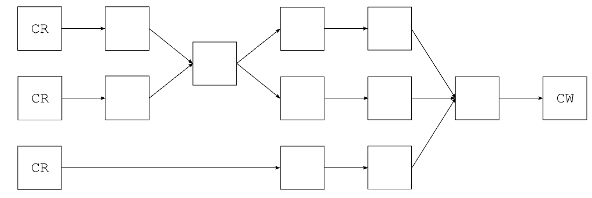
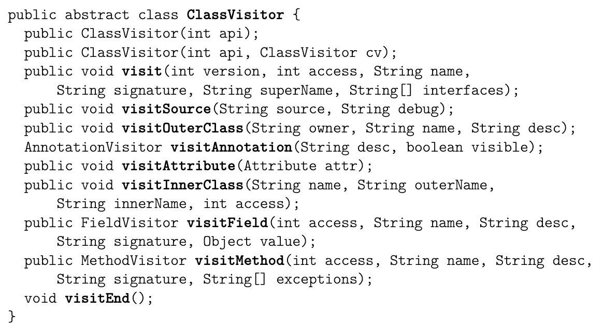

# ASM 学习

> [字节码操作码科普](https://www.bilibili.com/read/cv13433468/)

# 简介

## 总揽

ASM库的目标是生成、转换和分析编译后的 Java 类(即 .class 文件)，这些类以字节数组的形式表示（就如它们在硬盘上存储和在Java虚拟机中加载的方式）。为此，ASM提供了工具来**读取、写入和转换这样的字节数组，它使用的是比字节更高级的概念，如数字常量、字符串、Java标识符、Java类型、Java类结构元素等**。需要注意的是，ASM库的范围严格限制在读取、写入、转换和分析类。特别是，类加载过程不在此范围内。

ASM库提供了两大类API用于生成和转形编译后的类：

1. core API提供了一个基于**事件**的类表示
2. tree API提供了一个基于**对象**的类表示。

在基于事件的模型中，一个类由一系列事件表示，每个事件都表示类的一个元素，如其 head、字段、方法声明、指令等。而基于事件的API定义了可能的事件集和它们必须发生的顺序，提供了一个解析生成每个解析元素的事件的类解析器，以及一个从这些事件序列生成编译类的类写(ClassWriter)程序。

而在基于对象的模型中，一个类由一个对象树表示，每个对象都代表类的一部分，例如类本身、字段、方法、指令等。每个对象都有引用指向代表其成分的对象。基于对象的API提供了将表示类的事件序列转换为表示相同类的对象树（反之亦然）的方式。换句话说，基于对象的API是建立在基于事件的API之上的。

这两个API可以与XML文档的Simple API for XML (SAX) 和 Document Object Model (DOM) API进行比较：基于事件的API类似于SAX，而基于对象的API类似于DOM。基于对象的API是建立在基于事件的API之上的，就像DOM可以建立在SAX之上一样。

ASM提供了这两个API，因为没有最好的API。事实上，每个API都有其自身的优点和缺点：
• 基于事件的API比基于对象的API更快，需要的内存更少，因为没有必要创建和在内存中存储表示类的对象树（SAX和DOM之间也存在同样的区别）。
• 然而，使用基于事件的API实现类转换可能更困难，因为在任何给定时间，只有类的一个元素是可用的（即与当前事件相对应的元素），而使用基于对象的API，整个类都在内存中可用。

两种 API 同时只能操作一个 class 文件，他们互相独立。**如果存在一个类的转换影响到了另一个类，需要用户自己手动去处理**。

## 架构

ASM 的架构比较清晰。

基于事件的API是围绕事件生产者（类解析器），事件消费者（类写入器）和各种预定义的事件过滤器而组织的，用户可以添加定义的生产者，消费者和过滤器。因此，使用这个API是一个两步过程：

1. 在复杂的业务架构中组装事件生产者、过滤器和消费者组件。
2. 然后启动事件生产者运行生成或转换过程。

基于对象的API架构有所不同：可以组合在对象树上操作的类生成器或转换器组件，它们之间的链接代表了转换的顺序。

虽然大多数典型的ASM应用程序中的大多数组件架构都很简单，但是我们可以想象一种像下面这样的复杂架构，箭头表示类解析器，写入器或转换器之间基于事件的或基于对象的通信，链路中的任何位置都可能做事件和对象表示之间的转换：

## 组织结构
ASM库在几个包中进行了组织，并分布在多个jar文件中：

• org.objectweb.asm和org.objectweb.asm.signature包定义了基于事件的API并提供了类解析器和编写器组件。它们包含在asm.jar中。

• org.objectweb.asm.util包，在asm-util.jar中，提供了基于核心API的各种工具，可以在开发和调试ASM应用程序期间使用。

• org.objectweb.asm.commons包提供了几个有用的预先定义的类转换器，主要基于核心API。它包含在asm-commons.jar中。

• org.objectweb.asm.tree包，在asm-tree.jar中，定义了基于对象的API，并提供了在基于事件和基于对象表示之间转换的工具。

• org.objectweb.asm.tree.analysis包提供了一个类分析框架和几个预先定义的基于树API的类分析器。它包含在asm-analysis.jar中。

# Core API

生成和转换编译类的ASM API基于ClassVisitor抽象类（参见下图）。

这个类中的每个方法对应于与其同名的类文件结构部分。简单的部分通过一个方法调用进行访问，这个方法的参数描述了它们的内容，并返回void。内容可以具有任意长度和复杂性的部分，通过一个返回辅助访问者类的初始方法调用进行访问。这就是visitAnnotation，visitField和visitMethod方法的情况，它们分别返回一个AnnotationVisitor，一个FieldVisitor和一个MethodVisitor。"