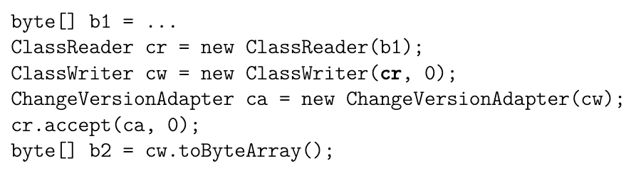

# ASM 学习

> [字节码操作码科普](https://www.bilibili.com/read/cv13433468/)

# 简介

## 总揽

ASM库的目标是生成、转换和分析编译后的 Java 类(即 .class 文件)，这些类以字节数组的形式表示（就如它们在硬盘上存储和在Java虚拟机中加载的方式）。为此，ASM提供了工具来**读取、写入和转换这样的字节数组，它使用的是比字节更高级的概念，如数字常量、字符串、Java标识符、Java类型、Java类结构元素等**。需要注意的是，ASM库的范围严格限制在读取、写入、转换和分析类。特别是，类加载过程不在此范围内。

ASM库提供了两大类API用于生成和转形编译后的类：

1. core API提供了一个基于**事件**的类表示
2. tree API提供了一个基于**对象**的类表示。

在基于事件的模型中，一个类由一系列事件表示，每个事件都表示类的一个元素，如其 head、字段、方法声明、指令等。而基于事件的API定义了可能的事件集和它们必须发生的顺序，提供了一个解析生成每个解析元素的事件的类解析器，以及一个从这些事件序列生成编译类的类写(ClassWriter)程序。

而在基于对象的模型中，一个类由一个对象树表示，每个对象都代表类的一部分，例如类本身、字段、方法、指令等。每个对象都有引用指向代表其成分的对象。基于对象的API提供了将表示类的事件序列转换为表示相同类的对象树（反之亦然）的方式。换句话说，基于对象的API是建立在基于事件的API之上的。

这两个API可以与XML文档的Simple API for XML (SAX) 和 Document Object Model (DOM) API进行比较：基于事件的API类似于SAX，而基于对象的API类似于DOM。基于对象的API是建立在基于事件的API之上的，就像DOM可以建立在SAX之上一样。

ASM提供了这两个API，因为没有最好的API。事实上，每个API都有其自身的优点和缺点：
• 基于事件的API比基于对象的API更快，需要的内存更少，因为没有必要创建和在内存中存储表示类的对象树（SAX和DOM之间也存在同样的区别）。
• 然而，使用基于事件的API实现类转换可能更困难，因为在任何给定时间，只有类的一个元素是可用的（即与当前事件相对应的元素），而使用基于对象的API，整个类都在内存中可用。

两种 API 同时只能操作一个 class 文件，他们互相独立。**如果存在一个类的转换影响到了另一个类，需要用户自己手动去处理**。

## 架构

ASM 的架构比较清晰。

基于事件的API是围绕事件生产者（类解析器），事件消费者（类写入器）和各种预定义的事件过滤器而组织的，用户可以添加定义的生产者，消费者和过滤器。因此，使用这个API是一个两步过程：

1. 在复杂的业务架构中组装事件生产者、过滤器和消费者组件。
2. 然后启动事件生产者运行生成或转换过程。


基于对象的API架构有所不同：可以组合在对象树上操作的类生成器或转换器组件，它们之间的链接代表了转换的顺序。

虽然大多数典型的ASM应用程序中的大多数组件架构都很简单，但是我们可以想象一种像下面这样的复杂架构，箭头表示类解析器，写入器或转换器之间基于事件的或基于对象的通信，链路中的任何位置都可能做事件和对象表示之间的转换：


## 组织结构
ASM库在几个包中进行了组织，并分布在多个jar文件中：

• org.objectweb.asm和org.objectweb.asm.signature包定义了基于事件的API并提供了类解析器和编写器组件。它们包含在asm.jar中。

• org.objectweb.asm.util包，在asm-util.jar中，提供了基于核心API的各种工具，可以在开发和调试ASM应用程序期间使用。

• org.objectweb.asm.commons包提供了几个有用的预先定义的类转换器，主要基于核心API。它包含在asm-commons.jar中。

• org.objectweb.asm.tree包，在asm-tree.jar中，定义了基于对象的API，并提供了在基于事件和基于对象表示之间转换的工具。

• org.objectweb.asm.tree.analysis包提供了一个类分析框架和几个预先定义的基于树API的类分析器。它包含在asm-analysis.jar中。

# Core API

生成和转换编译类的ASM API基于ClassVisitor抽象类（参见下图）。


这个类中的每个方法对应于与其同名的类文件结构部分。简单的部分通过一个方法调用进行访问，这个方法的参数描述了它们的内容，并返回void。内容可以具有任意长度和复杂性的部分，通过一个返回辅助的对应 Visitor 类的初始方法调用进行访问。visitAnnotation，visitField和visitMethod 方法即为这样，它们分别返回一个AnnotationVisitor，一个FieldVisitor和一个MethodVisitor。

对于 ClassVisitor 而言，其执行顺序严格按照下图来：


即：

1. visit
2. 至多一次 visitSource
3. 至多一次 visitOuterClass
4. 任何数量、任何顺序的：visitAnnotation 与 visitAttribute
5. 任何数量、任何顺序的：visitInnerClass, visitField 以及 visitMethod
6. 最后以 visitEnd 结尾

ASM 提供了三个基于ClassVisitor API的核心组件来生成和转换类：

• ClassReader类解析作为字节数组给出的编译类，并在传递给其接受方法的ClassVisitor实例上调用相应的visitXxx方法。它可以被看作是一个事件生产者。

• ClassWriter类是ClassVisitor抽象类的一个子类，它直接以二进制形式构建编译类。它以包含编译类的字节数组的形式产生输出，这可以通过toByteArray方法获取。它可以被看作是一个事件消费者。

• ClassVisitor类将它接收到的所有方法调用委托给另一个ClassVisitor实例。它可以被看作是一个事件过滤器。
## 例子一：解析一个 class

我们可以如下的简单完成一个 ClassVisitor，仅只是去看究竟 visit 到了什么东西:

```kotlin
package asm

import org.objectweb.asm.*
import org.objectweb.asm.Opcodes.ASM9

class SimpleClassVisitor: ClassVisitor(ASM9) {

    override fun visit(
        version: Int,
        access: Int,
        name: String?,
        signature: String?,
        superName: String?,
        interfaces: Array<out String>?
    ) {
        super.visit(version, access, name, signature, superName, interfaces)
        println("------ [visit start] ------")
        println("[visit] class name=$name, signature=$signature, superName=$superName")
    }

    override fun visitOuterClass(owner: String?, name: String?, descriptor: String?) {
        super.visitOuterClass(owner, name, descriptor)
        println("[visit outer class]")
    }

    override fun visitAnnotation(descriptor: String?, visible: Boolean): AnnotationVisitor? {
        println("[visit annotation]")
        return super.visitAnnotation(descriptor, visible)
    }

    override fun visitAttribute(attribute: Attribute?) {
        super.visitAttribute(attribute)
        println("[visit attribute]")
    }

    override fun visitInnerClass(name: String?, outerName: String?, innerName: String?, access: Int) {
        super.visitInnerClass(name, outerName, innerName, access)
        println("[visit inner class]")
    }

    override fun visitField(
        access: Int,
        name: String?,
        descriptor: String?,
        signature: String?,
        value: Any?
    ): FieldVisitor? {
        println("[visitField] desc={$descriptor} name={$name}");
        return super.visitField(access, name, descriptor, signature, value)
    }

    override fun visitMethod(
        access: Int,
        name: String?,
        descriptor: String?,
        signature: String?,
        exceptions: Array<out String>?
    ): MethodVisitor? {
        println("[visitMethod] desc={$descriptor} name={$name}");
        return super.visitMethod(access, name, descriptor, signature, exceptions)
    }

    override fun visitEnd() {
        super.visitEnd()
        println("------ [visit end] ------")
    }
}
```

然后去调用它，这里可以得到的结论其实和我们使用 Rust 解析 .class 文件一样，都是对应的模版类的信息：

```kotlin
// 目标类
package testclasses
class SimpleClass {
    private val name = "shen heng"
    private val id = 1

    fun printInfo() {
        println("name=$name, id=$id")
    }
}

// main 方法
fun main(args: Array<String>) {
    val cv = SimpleClassVisitor() as ClassVisitor
    val cr = ClassReader("testclasses.SimpleClass")
    cr.accept(cv, 0)
}
```

可以看到结果：

```kotlin
------ [visit start] ------
[visit] class name=testclasses/SimpleClass, signature=null, superName=java/lang/Object
[visit annotation]
[visitField] desc={Ljava/lang/String;} name={name}
[visitField] desc={I} name={id}
[visitMethod] desc={()V} name={<init>}
[visitMethod] desc={()V} name={printInfo}
------ [visit end] ------
```

有趣的是，visitAttribute、visitInnerClass 以及 visitOuterClass 没有被调用。

## 例子二：生成一个 class

我们首先写一个类：

```kotlin
package testclasses

class ForGeneratedClass(val value: String) {
    constructor() : this("default") {
        println("no-arges constructor is called! value=$value")
    }

    companion object {
        const val TAG = "ForGeneratedClass"
    }

    var a = 10

    private val name = "shen heng"

    fun add(a: Int, b: Double): Double {
        return a.toDouble() + b
    }
}
```

然后通过插件 ASM ByteCode viewer 直接生成即可：

```java
package asm.testclasses;

public class ForGeneratedClassDump implements Opcodes {

    public static byte[] dump() throws Exception {
			// 太长省略
       return classWriter.toByteArray()
    }
}

```

生成的代码就完全是 ASM 的标准 ClassWriter 流程，最后返回对应的 .class 文件的 byte 数组，可以保存为 .class 文件，也可以直接加载为类来进行执行，如果选择加载的话，推荐的方案是继承 ClassLoader 并暴露其`defineClass`方法:

```kotlin
class SimpleClassLoader: ClassLoader() {
    // 通过字节码加载 class
    fun defineClass(name: String?, b: ByteArray): Class<*> {
        return defineClass(name, b, 0, b.size)
    }
}
```

然后我们可以直接反射调用：

```
fun main(args: Array<String>) {
    val cl = SimpleClassLoader()
    // 这个就是对应的 .class 文件的字节数组
    val bytes = ForGeneratedClassDump.dump()
    // 此时获取到对应类的 Class<*> 对象，我们可以直接反射操作该类
    val gerClass = cl.defineClass("testclasses.ForGeneratedClass", bytes)
    // 创建一个实例
    val realObj = gerClass.kotlin.createInstance()
    // 通过这个实例的反射去调用方法等
    val kotlinClazz = realObj.javaClass.kotlin
    // 访问伴生对象的属性
    kotlinClazz.companionObject?.memberProperties?.find {
        it.name == "TAG"
    }?.also {
        val tag = it.call(realObj)
        println(tag)
    }
    // 访问里面的方法，注意需要传入类对象
    val addRes = kotlinClazz.functions.find {
        it.name == "add"
    }?.call(realObj, 1, 2.0)
    println(addRes)
}
```

## 例子三：转换一个 class

之前两个例子是单独的使用`ClassReader`与`ClassWriter`，合起来用其实就是 transfrom。

第一步往往是将`ClassReader`产生的事件引导至`ClassWriter`，也即将`ClassReader`解析的类由`ClassWriter`重构，典型的过程如下：


如上代码中，解析得到的字节码数组给到了 cw，此时 cw 里面的字节码数组其实就是 cr 所读取到的！

但这不足以满足我们的奇奇怪怪的业务要求，我们需要更简单更通用的方法去拷贝字节码数组。因此，第二步就是在其中加入一个 ClassVisitor:


相比于最开始的示例，这里所做的就是将 cw 代理给 cv，而 cv 去获取到 cr 读取到的所有字节码，cv 中如果是给到了单纯一个不做任何处理的通道的话，此时 cw 输出的数组就是一摸一样的 cr 读取到的数组。该事件流的传递可以用以下的图来表示：


### 优化

上面的逻辑比较暴力，直接解析了整个 byte 数组，对于 ASM 来说，实际上是按需处理的，它会优化需要被动到的部分：

* 如果ClassReader组件检测到作为其accept方法参数传递的ClassVisitor返回的MethodVisitor来自ClassWriter，这意味着该方法的内容将不会被转换，实际上甚至不会被应用程序看到。也即不会执行转换为数组。



由于这种优化，上述代码比先前的代码快两倍，因为ChangeVersionAdapter不会转换任何方法。对于通常的类转换，它会转换一些或所有的方法，速度提升较小，但仍然明显：实际上在10%到20%的范围内。不幸的是，这种优化需要将原始类中定义的所有常量复制到转换后的类中。对于添加字段、方法或指令的转换来说，这不是一个问题，但对于移除或重命名许多类元素的转换来说，会导致更大的类文件，与未优化的情况相比。**因此，建议仅对“增加性”转换使用此优化**。

上面代码中转换后的 .class 类 b2 可以存储在磁盘上或使用类加载器加载，如前一节所述。但是，在类加载器内部进行的类转换只能转换由该类加载器加载的类。**如果您想要转换所有类，您需要将转换逻辑放在ClassFileTransformer中，该类定义在java.lang.instrument包中**（有关更多细节，请参阅该包的文档），可以参考下面的例子：


## 例子四：修改一个 class，删除一些东西

我们实现一个简单的 ClassVisitor，他可以移除 innerClass、outerClass、以及一个方法：

```java
package asm

import org.objectweb.asm.ClassVisitor
import org.objectweb.asm.FieldVisitor
import org.objectweb.asm.MethodVisitor
import org.objectweb.asm.Opcodes
import org.objectweb.asm.Opcodes.ASM9

class AddOrRemoveAdaptor(cv: ClassVisitor): ClassVisitor(ASM9, cv) {

    var removedMethodName = ""

    private var hasMethod = false

    /**
     * 不执行任何语句就是移除 source file 的 name
     */
    override fun visitSource(source: String?, debug: String?) {
    }

    /**
     * 不执行任何语句就是移除所有的 InnerClass
     */
    override fun visitInnerClass(name: String?, outerName: String?, innerName: String?, access: Int) {
    }

    /**
     * 不执行任何语句就是移除所有的 OuterClass
     */
    override fun visitOuterClass(owner: String?, name: String?, descriptor: String?) {

    }

    /**
     * 但是移除方法或者字段不能这样干，需要单独的进行处理，如果是返回 Null 的话就会全部移除了
     */
    override fun visitMethod(
        access: Int,
        name: String?,
        descriptor: String?,
        signature: String?,
        exceptions: Array<out String>?
    ): MethodVisitor? {
        println("visit method: $name")
        if (name.equals(removedMethodName)) {
            // do not delegate to next visitor -> this removes the method
            println("removed method: $name, desc=$descriptor")
            return null
        }

        return super.visitMethod(access, name, descriptor, signature, exceptions)
    }

}
```

可以通过 classLoader 去加载然后调用该函数来证明其不可用：

```kotlin
fun main(args: Array<String>) {
    println("Hello World!")

    val fileName = "SimpleClass.class"
    val file = File("./examples/$fileName")

    val cw = ClassWriter(ClassWriter.COMPUTE_FRAMES)
    val cv = RemoveMethodVisitor(ASM9, cw, "printInfo")
    val cr = ClassReader("from.SimpleClass")

    cr.accept(cv, ClassReader.SKIP_DEBUG or ClassReader.SKIP_FRAMES)
    val res = cw.toByteArray()

    if (file.exists()) {
        file.delete()
    }
    val fos = FileOutputStream(file)
    fos.write(res)
    fos.close()

//    val cr = ClassReader("from.SimpleClass")
//    val cw = ClassWriter(0)
//    cr.accept(cw, 0)
//    val res = cw.toByteArray()

    val cl = SimpleClassLoader()
    val ger = cl.defineClass("from.SimpleClass", res)
    val obj = ger.kotlin.createInstance()
    val retunType = ger.kotlin.functions.find {
        it.name == "printInfo"
    }?.call(obj)
    println(retunType)
}
```

但是需要注意的是，返回的 class 文件中，虽然没有了这个方法，但是还保留了其在 kotlin 的 metadata 中的标记，使得我们虽然可以通过反射找到这个方法，但是调用直接报错:

```
// class version 52.0 (52)
// access flags 0x31
public final class from/SimpleClass {


  @Lkotlin/Metadata;(mv={1, 9, 0}, k=1, xi=48, d1={"\u0000 \n\u0002\u0018\u0002\n\u0002\u0010\u0000\n\u0002\u0008\u0002\n\u0002\u0010\u0008\n\u0000\n\u0002\u0010\u000e\n\u0000\n\u0002\u0010\u0002\n\u0002\u0008\u0003\u0018\u00002\u00020\u0001:\u0001\nB\u0005\u00a2\u0006\u0002\u0010\u0002J\u0006\u0010\u0007\u001a\u00020\u0008J\u0006\u0010\u0009\u001a\u00020\u0008R\u000e\u0010\u0003\u001a\u00020\u0004X\u0082D\u00a2\u0006\u0002\n\u0000R\u000e\u0010\u0005\u001a\u00020\u0006X\u0082D\u00a2\u0006\u0002\n\u0000\u00a8\u0006\u00
  // ----------------------------------------------------------------- | 
  // ----------------------------------------------------------------- v
  0b"}, d2={"Lfrom/SimpleClass;", "", "()V", "id", "", "name", "", "printInfo", "", "removedMethod", "Inner", "asm_examples"})
  // access flags 0x11
  public final INNERCLASS from/SimpleClass$Inner from/SimpleClass Inner

  // access flags 0x12
  private final Ljava/lang/String; name
  @Lorg/jetbrains/annotations/NotNull;() // invisible

  // access flags 0x12
  private final I id

  // access flags 0x1
  public <init>()V
	//...

  // access flags 0x11
  public final removedMethod()V
	//...
}

```

## 例子五：为某些方法添加计时器

第一步我们先写一个常规的定时器, 类似下面的结构：

```kotlin
package from

class TimerClass {
    var timer: Long = 0

    fun add(): Int {
        timer = 0L
        timer -= System.currentTimeMillis()
        val a = 1
        val b = 2
        val res = a + b
        timer += System.currentTimeMillis()
        println("add cost time:$timer")
        return res
    }
}
```

我们通过插件生成对应的字节码和 ASM 策略，该方法对应的字节码为：

```java
// access flags 0x11
  public final add()I
   L0
    LINENUMBER 7 L0
    ALOAD 0
    LCONST_0
    PUTFIELD from/TimerClass.timer : J
   L1
    LINENUMBER 8 L1
    ALOAD 0
    ALOAD 0
    GETFIELD from/TimerClass.timer : J
    INVOKESTATIC java/lang/System.currentTimeMillis ()J
    LSUB
    PUTFIELD from/TimerClass.timer : J
   L2
    LINENUMBER 9 L2
    ICONST_1
    ISTORE 1
   L3
    LINENUMBER 10 L3
    ICONST_2
    ISTORE 2
   L4
    LINENUMBER 11 L4
    ILOAD 1
    ILOAD 2
    IADD
    ISTORE 3
   L5
    LINENUMBER 12 L5
    ALOAD 0
    ALOAD 0
    GETFIELD from/TimerClass.timer : J
    INVOKESTATIC java/lang/System.currentTimeMillis ()J
    LADD
    PUTFIELD from/TimerClass.timer : J
   L6
    LINENUMBER 13 L6
    NEW java/lang/StringBuilder
    DUP
    INVOKESPECIAL java/lang/StringBuilder.<init> ()V
    LDC "add cost time:"
    INVOKEVIRTUAL java/lang/StringBuilder.append (Ljava/lang/String;)Ljava/lang/StringBuilder;
    ALOAD 0
    GETFIELD from/TimerClass.timer : J
    INVOKEVIRTUAL java/lang/StringBuilder.append (J)Ljava/lang/StringBuilder;
    INVOKEVIRTUAL java/lang/StringBuilder.toString ()Ljava/lang/String;
    GETSTATIC java/lang/System.out : Ljava/io/PrintStream;
    SWAP
    INVOKEVIRTUAL java/io/PrintStream.println (Ljava/lang/Object;)V
   L7
    LINENUMBER 14 L7
    ILOAD 3
    IRETURN
   L8
    LOCALVARIABLE a I L3 L8 1
    LOCALVARIABLE b I L4 L8 2
    LOCALVARIABLE res I L5 L8 3
    LOCALVARIABLE this Lfrom/TimerClass; L0 L8 0
    MAXSTACK = 5
    MAXLOCALS = 4
```

从上面可以看到字节码中有着大量的 Label 来标记代码位置，方法的核心信息区域在最后：

```java
   L8
    // LOCALVARIABLE <variable_name> <variable_type> <start_pc 起点 PC 位置> <length 作用域长度> <slot 在局部变量槽中的位置>
    LOCALVARIABLE a I L3 L8 1
    LOCALVARIABLE b I L4 L8 2
    LOCALVARIABLE res I L5 L8 3
    LOCALVARIABLE this Lfrom/TimerClass; L0 L8 0
    MAXSTACK = 5			// 栈深度
    MAXLOCALS = 4			// 局部变量数量
```

然后，对于字段的生成来说就是：

```java
fieldVisitor = classWriter.visitField(ACC_PRIVATE, "timer", "J", null, null);
fieldVisitor.visitEnd();
```

而其中的方法是：

```java
methodVisitor = classWriter.visitMethod(ACC_PUBLIC | ACC_FINAL, "add", "()I", null, null);
methodVisitor.visitCode();
Label label0 = new Label();
methodVisitor.visitLabel(label0);
methodVisitor.visitLineNumber(7, label0);
methodVisitor.visitVarInsn(ALOAD, 0);
methodVisitor.visitInsn(LCONST_0);
methodVisitor.visitFieldInsn(PUTFIELD, "from/TimerClass", "timer", "J");
Label label1 = new Label();
methodVisitor.visitLabel(label1);
methodVisitor.visitLineNumber(8, label1);
methodVisitor.visitVarInsn(ALOAD, 0);
methodVisitor.visitVarInsn(ALOAD, 0);
methodVisitor.visitFieldInsn(GETFIELD, "from/TimerClass", "timer", "J");
methodVisitor.visitMethodInsn(INVOKESTATIC, "java/lang/System", "currentTimeMillis", "()J", false);
methodVisitor.visitInsn(LSUB);
methodVisitor.visitFieldInsn(PUTFIELD, "from/TimerClass", "timer", "J");
Label label2 = new Label();
methodVisitor.visitLabel(label2);
methodVisitor.visitLineNumber(9, label2);
methodVisitor.visitInsn(ICONST_1);
methodVisitor.visitVarInsn(ISTORE, 1);
Label label3 = new Label();
methodVisitor.visitLabel(label3);
methodVisitor.visitLineNumber(10, label3);
methodVisitor.visitInsn(ICONST_2);
methodVisitor.visitVarInsn(ISTORE, 2);
Label label4 = new Label();
methodVisitor.visitLabel(label4);
methodVisitor.visitLineNumber(11, label4);
methodVisitor.visitVarInsn(ILOAD, 1);
methodVisitor.visitVarInsn(ILOAD, 2);
methodVisitor.visitInsn(IADD);
methodVisitor.visitVarInsn(ISTORE, 3);
Label label5 = new Label();
methodVisitor.visitLabel(label5);
methodVisitor.visitLineNumber(12, label5);
methodVisitor.visitVarInsn(ALOAD, 0);
methodVisitor.visitVarInsn(ALOAD, 0);
methodVisitor.visitFieldInsn(GETFIELD, "from/TimerClass", "timer", "J");
methodVisitor.visitMethodInsn(INVOKESTATIC, "java/lang/System", "currentTimeMillis", "()J", false);
methodVisitor.visitInsn(LADD);
methodVisitor.visitFieldInsn(PUTFIELD, "from/TimerClass", "timer", "J");
Label label6 = new Label();
methodVisitor.visitLabel(label6);
methodVisitor.visitLineNumber(13, label6);
methodVisitor.visitTypeInsn(NEW, "java/lang/StringBuilder");
methodVisitor.visitInsn(DUP);
methodVisitor.visitMethodInsn(INVOKESPECIAL, "java/lang/StringBuilder", "<init>", "()V", false);
methodVisitor.visitLdcInsn("add cost time:");
methodVisitor.visitMethodInsn(INVOKEVIRTUAL, "java/lang/StringBuilder", "append", "(Ljava/lang/String;)Ljava/lang/StringBuilder;", false);
methodVisitor.visitVarInsn(ALOAD, 0);
methodVisitor.visitFieldInsn(GETFIELD, "from/TimerClass", "timer", "J");
methodVisitor.visitMethodInsn(INVOKEVIRTUAL, "java/lang/StringBuilder", "append", "(J)Ljava/lang/StringBuilder;", false);
methodVisitor.visitMethodInsn(INVOKEVIRTUAL, "java/lang/StringBuilder", "toString", "()Ljava/lang/String;", false);
methodVisitor.visitFieldInsn(GETSTATIC, "java/lang/System", "out", "Ljava/io/PrintStream;");
methodVisitor.visitInsn(SWAP);
methodVisitor.visitMethodInsn(INVOKEVIRTUAL, "java/io/PrintStream", "println", "(Ljava/lang/Object;)V", false);
Label label7 = new Label();
methodVisitor.visitLabel(label7);
methodVisitor.visitLineNumber(14, label7);
methodVisitor.visitVarInsn(ILOAD, 3);
methodVisitor.visitInsn(IRETURN);
Label label8 = new Label();
methodVisitor.visitLabel(label8);
methodVisitor.visitLocalVariable("a", "I", null, label3, label8, 1);
methodVisitor.visitLocalVariable("b", "I", null, label4, label8, 2);
methodVisitor.visitLocalVariable("res", "I", null, label5, label8, 3);
methodVisitor.visitLocalVariable("this", "Lfrom/TimerClass;", null, label0, label8, 0);
methodVisitor.visitMaxs(5, 4);
methodVisitor.visitEnd();
```

我们可以将所需要的前面部分和后面提出来为：

```java
// 前面部分，定义 timer 初始化，并计时

methodVisitor.visitInsn(LCONST_0); 																				// 将常量 0 入栈
methodVisitor.visitFieldInsn(PUTFIELD, "from/TimerClass", "timer", "J");	// 将常量赋值给 timer

methodVisitor.visitVarInsn(ALOAD, 0);																			// 将 this 入栈
methodVisitor.visitFieldInsn(GETFIELD, "from/TimerClass", "timer", "J");  // 获取到字段
methodVisitor.visitMethodInsn(INVOKESTATIC, "java/lang/System", "currentTimeMillis", "()J", false); // 初始化方法
methodVisitor.visitInsn(LSUB);																						// 相减
methodVisitor.visitFieldInsn(PUTFIELD, "from/TimerClass", "timer", "J");  // 放入字段
```

类似的也可以处理后半部分，实际上就是直接复制粘贴 ASM 插件给出来的代码。然后使用`AdviceAdapter`作为 MethodVisitor 来进行处理：

```kotlin
package visitors

import org.objectweb.asm.MethodVisitor
import org.objectweb.asm.commons.AdviceAdapter

class CastTimerMethodAdaptor(
    api: Int,
    mv: MethodVisitor,
    access: Int,
    name: String?,
    descriptor: String?
): AdviceAdapter(api, mv, access, name, descriptor) {
    // 新增方法的 owner
    var owner = ""

    /**
     * 进入方法时
     */
    override fun onMethodEnter() {
        super.visitVarInsn(ALOAD, 0);
        super.visitInsn(LCONST_0)  // 类型为int，数值为0的常量入栈
        super.visitFieldInsn(PUTFIELD, owner, "timer", "J")
        super.visitVarInsn(ALOAD, 0);
        super.visitVarInsn(ALOAD, 0);																			// 将 this 入栈
        super.visitFieldInsn(GETFIELD, owner, "timer", "J");  // 获取到字段
        super.visitMethodInsn(INVOKESTATIC, "java/lang/System", "currentTimeMillis", "()J", false); // 初始化方法
        super.visitInsn(LSUB);																						// 相减
        super.visitFieldInsn(PUTFIELD, owner, "timer", "J");  // 放入字段
    }

    override fun onMethodExit(opcode: Int) {
        super.visitVarInsn(ALOAD, 0);
        super.visitVarInsn(ALOAD, 0);
        super.visitFieldInsn(GETFIELD, owner, "timer", "J");
        super.visitMethodInsn(INVOKESTATIC, "java/lang/System", "currentTimeMillis", "()J", false);
        super.visitInsn(LADD);
        super.visitFieldInsn(PUTFIELD, owner, "timer", "J");

        super.visitTypeInsn(NEW, "java/lang/StringBuilder");
        super.visitInsn(DUP);
        super.visitMethodInsn(INVOKESPECIAL, "java/lang/StringBuilder", "<init>", "()V", false);
        super.visitLdcInsn("add cost time:");
        super.visitMethodInsn(INVOKEVIRTUAL, "java/lang/StringBuilder", "append", "(Ljava/lang/String;)Ljava/lang/StringBuilder;", false);
        super.visitVarInsn(ALOAD, 0);
        super.visitFieldInsn(GETFIELD, owner, "timer", "J");
        super.visitMethodInsn(INVOKEVIRTUAL, "java/lang/StringBuilder", "append", "(J)Ljava/lang/StringBuilder;", false);
        super.visitMethodInsn(INVOKEVIRTUAL, "java/lang/StringBuilder", "toString", "()Ljava/lang/String;", false);
        super.visitFieldInsn(GETSTATIC, "java/lang/System", "out", "Ljava/io/PrintStream;");
        super.visitInsn(SWAP);
        super.visitMethodInsn(INVOKEVIRTUAL, "java/io/PrintStream", "println", "(Ljava/lang/Object;)V", false);
    }

}
```

最后在通过一个过滤器去完成即可：

```kotlin
package visitors

import org.objectweb.asm.ClassVisitor
import org.objectweb.asm.FieldVisitor
import org.objectweb.asm.MethodVisitor
import org.objectweb.asm.Opcodes.ACC_INTERFACE
import org.objectweb.asm.Opcodes.ACC_PRIVATE

class MethodCostTimeClassVisitor(api: Int, classVisitor: ClassVisitor): ClassVisitor(api, classVisitor) {

    // 当前 visit 的这个类的名字
    private var owner: String? = null
    private var isInterface = false
    private var hasTimer = false

    override fun visit(
        version: Int,
        access: Int,
        name: String?,
        signature: String?,
        superName: String?,
        interfaces: Array<out String>?
    ) {
        super.visit(version, access, name, signature, superName, interfaces)
        owner = name
        isInterface = access and ACC_INTERFACE != 0
    }

    override fun visitField(
        access: Int,
        name: String?,
        descriptor: String?,
        signature: String?,
        value: Any?
    ): FieldVisitor {
        // 如果已经有 timer 字段了，则跳过
        if (access and ACC_PRIVATE != 0 && "timer" == name && "J" == descriptor) {
            hasTimer = true
        }
        return super.visitField(access, name, descriptor, signature, value)
    }

    /**
     * 在 visitMethod 中排除掉构造方法等后，返回自定义的 MethodVisitor（相当于覆盖了原来的 MethodVisitor）
     */
    override fun visitMethod(
        access: Int,
        name: String?,
        descriptor: String?,
        signature: String?,
        exceptions: Array<out String>?
    ): MethodVisitor {
        var mv = super.visitMethod(access, name, descriptor, signature, exceptions)

        // 此时赋值为我们自己的 mv
        if (!isInterface && mv!=null && "<init>" != name && "<clinit>" != name) {
            val ourMv = CastTimerMethodAdaptor(api, mv, access, name, descriptor)
            ourMv.owner = owner.toString()
            mv = ourMv
        }

        return mv
    }

    /**
     * 在这里添加字段
     */
    override fun visitEnd() {
        if (!isInterface && !hasTimer) {
            super.visitField(ACC_PRIVATE, "timer", "J", null, null)?.visitEnd()
        }

        super.visitEnd()
    }
}
```

验证的话，同样可以使用反射的方式，去调这个代码：

```kotlin
fun main(args: Array<String>) {
    val fileName = "SimpleClass.class"
    val file = File("./examples/$fileName")

    val cw = ClassWriter(ClassWriter.COMPUTE_FRAMES)
    val cv = MethodCostTimeClassVisitor(ASM9, cw)
    val cr = ClassReader("from.SimpleClass")

    cr.accept(cv, ClassReader.SKIP_DEBUG or ClassReader.SKIP_FRAMES)
    val res = cw.toByteArray()
    if (file.exists()) {
        file.delete()
    }
    val fos = FileOutputStream(file)
    fos.write(res)
    fos.close()

    val cl = SimpleClassLoader()
    val ger = cl.defineClass("from.SimpleClass", res)
    val obj = ger.kotlin.createInstance()
    val retunType = ger.kotlin.functions.find {
        it.name == "printInfo"
    }?.call(obj)
    println(retunType)
}
```


# 参考文档

[这一篇文章](https://leaderli.github.io/2020/04/23/java%E5%AD%97%E8%8A%82%E7%A0%81/)写字节码执行过程写得很好
