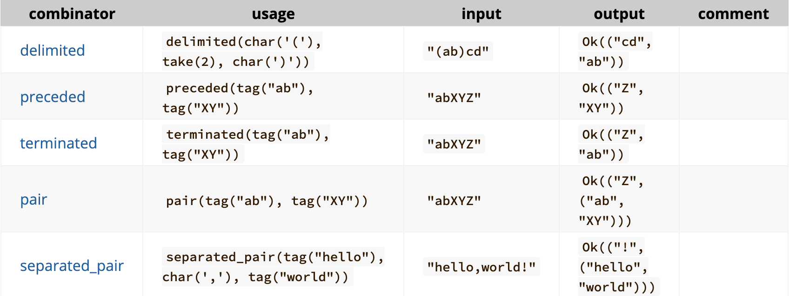
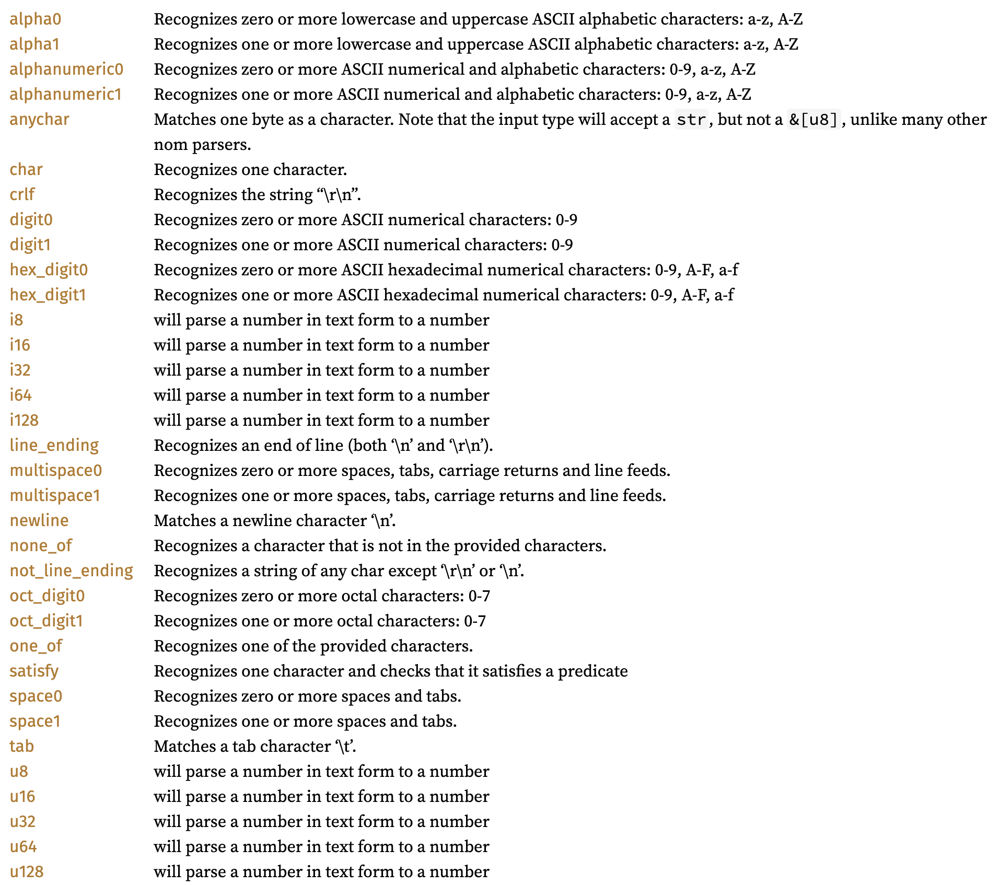

# Nom 使用

# 简介

## Nom 是什么

Nom 是一个解析器组合库。换句话说，它会提供定义以下内容的工具：
"解析器"（一个接受输入并返回输出的函数）和
"组合器"（将解析器组合在一起的函数）。

通过将解析器与组合器相结合，可以从简单的解析器构建复杂的解析器。这些复杂的解析器足以理解 HTML、mkv 甚至 Python！

在我们开始之前，有一些重要的注意事项需要列出来：

这篇学习指南适用于 Nom7。在这个版本 Nom 经历了重大变化，因此如果在搜索文档或 StackOverflow 的答案，可能会找到较旧的文档。

> 一些表明这是旧版本的常见指标包括：
> 文档早于2021年8月21日。
> 使用了 named! 宏。
> 使用了 CompleteStr 或 CompleteByteArray。

## nom 的解析设计是什么

我们先思考一下“解析器”实际上是做什么的，解析器本质上就是将输入作为参数，并返回一个结果：

1. Ok 表示解析器成功找到了它要查找的内容
2. Err 表示解析器无法找到它要查找的内容。

如果解析器成功，它将返回一个 tuple。元组的第一个字段将包含解析器未处理的所有内容。第二个字段将包含解析器处理的所有内容。这个概念是，解析器可以愉快地解析输入的第一部分，而不必解析整个内容。

如下图所示：

```
                                   ┌─► Ok(
                                   │      what the parser didn't touch, // 解析器没有处理的所有内容
                                   │      what matched the regex				// 解析器已经处理完毕的所有内容
                                   │   )
             ┌─────────┐           │
 my input───►│my parser├──►either──┤
             └─────────┘           └─► Err(...)

```

为了表示这个模型，nom 使用了`IResult<I, O>`类型。其中`Ok` variant 包含了两种类型 -- I，输入的类型；和O，输出的类型；而 Err variant 则存储了一个错误信息。

I 和 O 是参数化的（考虑简单的示例，其中I = &str，O = u64-这将把字符串解析为无符号整数）。
我们写我们的第一个解析器！我们可以编写的最简单的解析器，其逻辑为成功时什么都不做。我们假设这个解析器应该接受一个&str：

```rust
use nom::IResult;
use std::error::Error;

pub fn do_nothing_parser(input: &str) -> IResult<&str, &str> {
    Ok((input, ""))
}

fn main() -> Result<(), Box<dyn Error>> {
    let (remaining_input, output) = do_nothing_parser("my_input")?;
    assert_eq!(remaining_input, "my_input");
    assert_eq!(output, "");
  Ok(())
}
```

根据 nom 的假设：

1. 他一定会返回 OK，因为什么也没做。
2. 第一个参数就是输入，因为什么也没做，没有理的内容就是原内容。
3. 第二个参数是空，因为什么也没做，处理过的内容即为空。

# 基本使用

## Tag

基本使用：

```rust
fn main() {
    let x:IResult<&str, &str, Error<&str>> = tag("nihao")("nihao 111222");
    let y = x.unwrap();
    println!("{}", y.0);
    println!("{}", y.1);
}	
```

可以看到`tag`返回了一个函数指针，他所执行的就是很简单，就是将第一部分字符串拿出来：

```rust
// 输出
 111222
nihao
```

我们可以看一下这个函数本身：

```rust
pub fn tag<T, Input, Error: ParseError<Input>>(
  tag: T,
  // 返回的是一个函数指针，执行的是内部的函数的内容
) -> impl Fn(Input) -> IResult<Input, Input, Error>
where
  Input: InputTake + Compare<T>,
  T: InputLength + Clone,
{
  move |i: Input| {
    let tag_len = tag.input_len();
    // 存在一次 clone
    let t = tag.clone();
    let res: IResult<_, _, Error> = match i.compare(t) {
      CompareResult::Ok => Ok(i.take_split(tag_len)),
      _ => {
        let e: ErrorKind = ErrorKind::Tag;
        Err(Err::Error(Error::from_error_kind(i, e)))
      }
    };
    res
  }
}
```

标签非常有用，但它们也非常具有限制性。Nom 的另一端是预先编写的解析器，允许我们接受一组字符中的任何字符，而不仅仅是按照定义的顺序接受字符。为此 nom 封装了许多类似的工具方法：

1. alpha0：识别零个或多个小写和大写字母字符：/[a-zA-Z]/。alpha1也是如此，但至少返回一个字符
2. alphanumeric0：识别零个或多个数字和字母字符：/[0-9a-zA-Z]/。alphanumeric1也是如此，但至少返回一个字符
3. digit0：识别零个或多个数字字符：/[0-9]/。digit1也是如此，但至少返回一个字符
4. multispace0：识别零个或多个空格、制表符、回车和换行符。multispace1也是如此，但至少返回一个字符
5. space0：识别零个或多个空格和制表符。space1也是如此，但至少返回一个字符
6. line_ending：识别行尾（包括 \n 和 \r\n）
7. newline：匹配换行符 \n
8. tab：匹配制表符 \t

我们可以类似 tag 的使用它们：

```rust
pub use nom::character::complete::alpha0;
fn parser(input: &str) -> IResult<&str, &str> {
    alpha0(input)
}

fn main() -> Result<(), Box<dyn Error>> {
    let (remaining, letters) = parser("abc123")?;
    assert_eq!(remaining, "123");
    assert_eq!(letters, "abc");   
}
```

## Alternatives and Composition

Alternatives 说白了就是可以接受两个类似 tag 的解析器，遍历的去执行(具体的数量的话，看源码是有 A-U 个)，如果任意一个(排序在更前面的)完成了匹配就返回结果，而如果全部都没匹配上就返回 Err:

```rust
extern crate nom;
use nom::branch::alt;
use nom::bytes::complete::tag;
use nom::IResult;
use std::error::Error;

fn parse_abc_or_def(input: &str) -> IResult<&str, &str> {
    alt((
        tag("abc"),
        tag("def")
    ))(input)
}

fn main() -> Result<(), Box<dyn Error>> {
    let (leftover_input, output) = parse_abc_or_def("abcWorld")?;
    assert_eq!(leftover_input, "World");
    assert_eq!(output, "abc");

    assert!(parse_abc_or_def("ghiWorld").is_err());
  Ok(())
}
```

如果说 Alternatives 是提供了 each 这个操作的话，Composing 提供的就是 one-by-one 的操作，例如下面的解析：

```rust
extern crate nom;
use nom::branch::alt;
use nom::bytes::complete::tag;
use nom::IResult;
use std::error::Error;

fn parse_abc(input: &str) -> IResult<&str, &str> {
    tag("abc")(input)
}
fn parse_def_or_ghi(input: &str) -> IResult<&str, &str> {
    alt((
        tag("def"),
        tag("ghi")
    ))(input)
}

fn main() -> Result<(), Box<dyn Error>> {
    let input = "abcghi";
    let (remainder, abc) = parse_abc(input)?;
    let (remainder, def_or_ghi) = parse_def_or_ghi(remainder)?;
    println!("first parsed: {abc}; then parsed: {def_or_ghi};");
    
  Ok(())
}
```

它首先完成了"abc"的解析，然后去解析"def"或者"ghi"，我们可以将其封装为一个函数，使用 Composing。例如下面的另一个例子：

```rust
extern crate nom;
use nom::branch::alt;
use nom::sequence::tuple;
use nom::bytes::complete::tag_no_case;
use nom::character::complete::{digit1};
use nom::IResult;
use std::error::Error;

fn parse_base(input: &str) -> IResult<&str, &str> {
    alt((
        tag_no_case("a"),
        tag_no_case("t"),
        tag_no_case("c"),
        tag_no_case("g")
    ))(input)
}

fn parse_pair(input: &str) -> IResult<&str, (&str, &str)> {
    // the many_m_n combinator might also be appropriate here.
    tuple((
        parse_base,
        parse_base,
    ))(input)
}

fn main() -> Result<(), Box<dyn Error>> {
    let (remaining, parsed) = parse_pair("aTcG")?;
    assert_eq!(parsed, ("a", "T"));
    assert_eq!(remaining, "cG");
 
    assert!(parse_pair("Dct").is_err());

  Ok(())
}
```

类似的操作还有：



## 更改类型

到目前为止，我们大多数看到的函数都接受一个&str，并返回一个IResult<&str, &str>。将字符串分割成较小的字符串当然是有用的，但这不是Nom能做的唯一事情！

在解析时，在不同类型之间转换是很常见的，例如从&str解析到另一种原始类型 bool。对于函数来说，只需要更改IResult的第二个类型参数为所需的返回类型，就可以使我们的解析器返回不同的类型。例如，要返回一个bool，返回一个`IResult<&str, bool>`。

需要注意的是，**IResult的第一个类型参数是输入类型**，所以即使你返回了不同的类型，如果你的输入是一个&str，IResult的第一个类型参数也应该是这样。

> 官方强烈建议避免使用Rust内置的解析器（如str.parse）；因为它们需要特殊处理才能与Nom良好地配合使用。
>
> Nom 提供本地的类型转换方法：value combinator 将成功解析的部分转换为特定的值。

下面是一个例子，将一个包含"true"或"false"的字符串转换为相应的bool值：

```rust
extern crate nom;
use std::error::Error;
use nom::IResult;
use nom::bytes::complete::tag;
use nom::combinator::value;
use nom::branch::alt;

fn parse_bool(input: &str) -> IResult<&str, bool> {
    // either, parse `"true"` -> `true`; `"false"` -> `false`, or error.
    alt((
      value(true, tag("true")),
      value(false, tag("false")),
    ))(input)
}

fn main() -> Result<(), Box<dyn Error>> {
    // Parses the `"true"` out.
    let (remaining, parsed) = parse_bool("true|false")?;
    assert_eq!(parsed, true);
    assert_eq!(remaining, "|false");
   
    // If we forget about the "|", we get an error.
    let parsing_error = parse_bool(remaining);
    assert!(parsing_error.is_err());
    
    // Skipping the first byte gives us `false`!
    let (remaining, parsed) = parse_bool(&remaining[1..])?;
    assert_eq!(parsed, false);
    assert_eq!(remaining, "");
    
    

  Ok(())
}
```

nom 提供了很多[解析器](https://docs.rs/nom/latest/nom/character/complete/index.html)



我们可以考虑一个更为复杂的例子：

解析一个字符串，例如`"(3, -2)"`，我们会将它转换为一个坐标结构体，为了方便处理，我们可以将它分为三个部分：

```
(vvvvvvvvvvvvv) # The outer brackets.
  vvvv , vvvv   # The comma, separating values.
    3     -2    # The actual integers.
```

因此我们需要三个解析器来处理这个问题：

1. 一个解析器用于整数，它将处理原始数字。
2. 一个解析器用于逗号分隔的对，它将其拆分为整数。
3. 一个解析器用于外部括号。

```rust
extern crate nom;
use std::error::Error;
use nom::IResult;
use nom::bytes::complete::tag;
use nom::sequence::{separated_pair, delimited};

// This is the type we will parse into.
#[derive(Debug,PartialEq)]
pub struct Coordinate {
  pub x:   i32,
  pub y:   i32,
}

// 1. Nom has an in-built i32 parser.
use nom::character::complete::i32;

// 2. Use the `separated_pair` parser to combine two parsers (in this case,
//    both `i32`), ignoring something in-between.
fn parse_integer_pair(input: &str) -> IResult<&str, (i32, i32)> {
    separated_pair(
        i32,
        tag(", "),
        i32
    )(input)
}

// 3. Use the `delimited` parser to apply a parser, ignoring the results
//    of two surrounding parsers.
fn parse_coordinate(input: &str) -> IResult<&str, Coordinate> {
    let (remaining, (x, y)) = delimited(
        tag("("),
        parse_integer_pair,
        tag(")")
    )(input)?;
    
    // Note: we could construct this by implementing `From` on `Coordinate`,
    // We don't, just so it's obvious what's happening.
    Ok((remaining, Coordinate {x, y}))
    
}

fn main() -> Result<(), Box<dyn Error>> {
    let (_, parsed) = parse_coordinate("(3, 5)")?;
    assert_eq!(parsed, Coordinate {x: 3, y: 5});
   
    let (_, parsed) = parse_coordinate("(2, -4)")?;
    assert_eq!(parsed, Coordinate {x: 2, y: -4});
    
    let parsing_error = parse_coordinate("(3,)");
    assert!(parsing_error.is_err());
    
    let parsing_error = parse_coordinate("(,3)");
    assert!(parsing_error.is_err());
    
    let parsing_error = parse_coordinate("Ferris");
    assert!(parsing_error.is_err());
    

  Ok(())
}
```

## 类似 while 一样的不断重复

在 Nom 中，多次重复一个解析器也是非常有用的。Nom 有两种方式可以将 repeat 功能包含进去 —— 受谓词管控的解析器和重复解析器的组合子。

> predicate：是一个返回布尔值的函数（即给定一些输入，它返回true或false）。
>
> 在解析时，这些谓词(predicate)非常常见--例如，谓词`is_vowel`可以确定一个字符是否是英语元音字母（a，e，i，o或u）。

这些谓词可以用来创建 Nom 中没有内置的解析器。有几种不同类型的谓词解析器值得提一下：

1. 对于字节，有三种不同的解析器类别：take_till，take_until和take_while。take_till将继续消耗输入，直到输入满足谓词。take_while将继续消耗输入，直到输入不满足谓词。take_until看起来很像一个谓词解析器，但只是消耗直到第一次出现字节模式的位置。
2. 有些解析器的名称相比上面的解析器来说后面有一个"1"，类似于上面方法的的"双胞胎"--例如，take_while有take_while1。它们之间的区别在于，如果第一个字节不满足谓词，take_while可以返回一个空切片。而take_while1如果谓词不被满足，则返回错误。
3. 作为特例，take_while_m_n与take_while类似，但它保证至少会消耗m个字节，最多不超过n个字节。

下面是一个简单的例子：

```rust
extern crate nom;
use std::error::Error;
use nom::IResult;
use nom::bytes::complete::{tag, take_until, take_while};
use nom::character::{is_space};
use nom::sequence::{terminated};

fn parse_sentence(input: &str) -> IResult<&str, &str> {
    terminated(take_until("."), take_while(|c| c == '.' || c == ' '))(input)
}

fn main() -> Result<(), Box<dyn Error>> {
    let (remaining, parsed) = parse_sentence("I am Tom. I write Rust.")?;
    assert_eq!(parsed, "I am Tom");
    assert_eq!(remaining, "I write Rust.");
   
    let parsing_error = parse_sentence("Not a sentence (no period at the end)");
    assert!(parsing_error.is_err());
    

  Ok(())
}
```

| combinator                                                   | Usage                       | Input           | Output                    | Comment                                                      |
| ------------------------------------------------------------ | --------------------------- | --------------- | ------------------------- | ------------------------------------------------------------ |
| [take_while](https://docs.rs/nom/latest/nom/bytes/complete/fn.take_while.html) | `take_while(is_alphabetic)` | `"abc123"`      | `Ok(("123", "abc"))`      | 返回其作为参数的谓词返回true时的最长字节 list。take_while1也是如此，但必须返回至少一个字符。take_while_m_n也是如此，但必须返回m到n个字符。 |
| [take_till](https://docs.rs/nom/latest/nom/bytes/complete/fn.take_till.html) | `take_till(is_alphabetic)`  | `"123abc"`      | `Ok(("abc", "123"))`      | 返回其作为参数的谓词返回true 之前的最长字节或字符 list。take_till1 做相同的事情，但必须返回至少一个字符。这与 take_while 的行为相反：`take_till(f)` 等价于 `take_while(|c| !f(c))` |
| [take_until](https://docs.rs/nom/latest/nom/bytes/complete/fn.take_until.html) | `take_until("world")`       | `"Hello world"` | `Ok(("world", "Hello "))` | 返回最长的字节或字符列表，直到找到提供的标签。take_until1也是这样做的，但必须至少返回一个字符。 |

单个解析器不断的重复一个谓词的很有用，但更有用的是一个组合器，它不断的重复解析器。Nom有多个这样的组合器；其中最明显的是many0，它尽可能多次执行解析器，并返回这些解析的结果 vec。这是一个例子：

```rust
extern crate nom;
use std::error::Error;
use nom::IResult;
use nom::multi::many0;
use nom::bytes::complete::tag;

fn parser(s: &str) -> IResult<&str, Vec<&str>> {
  many0(tag("abc"))(s)
}

fn main() {
    assert_eq!(parser("abcabc"), Ok(("", vec!["abc", "abc"])));
    assert_eq!(parser("abc123"), Ok(("123", vec!["abc"])));
    assert_eq!(parser("123123"), Ok(("123123", vec![])));
    assert_eq!(parser(""), Ok(("", vec![])));
}
```

类似的有许多选择:

| combinator                                                   | usage                                                        | input         | output                                | comment                                                      |
| ------------------------------------------------------------ | ------------------------------------------------------------ | ------------- | ------------------------------------- | ------------------------------------------------------------ |
| [count](https://docs.rs/nom/latest/nom/multi/fn.count.html)  | `count(take(2), 3)`                                          | `"abcdefgh"`  | `Ok(("gh", vec!["ab", "cd", "ef"]))`  | Applies the child parser a specified number of times         |
| [many0](https://docs.rs/nom/latest/nom/multi/fn.many0.html)  | `many0(tag("ab"))`                                           | `"abababc"`   | `Ok(("c", vec!["ab", "ab", "ab"]))`   | Applies the parser 0 or more times and returns the list of results in a Vec. `many1` does the same operation but must return at least one element |
| [many_m_n](https://docs.rs/nom/latest/nom/multi/fn.many_m_n.html) | `many_m_n(1, 3, tag("ab"))`                                  | `"ababc"`     | `Ok(("c", vec!["ab", "ab"]))`         | Applies the parser between m and n times (n included) and returns the list of results in a Vec |
| [many_till](https://docs.rs/nom/latest/nom/multi/fn.many_till.html) | `many_till(tag( "ab" ), tag( "ef" ))`                        | `"ababefg"`   | `Ok(("g", (vec!["ab", "ab"], "ef")))` | Applies the first parser until the second applies. Returns a tuple containing the list of results from the first in a Vec and the result of the second |
| [separated_list0](https://docs.rs/nom/latest/nom/multi/fn.separated_list0.html) | `separated_list0(tag(","), tag("ab"))`                       | `"ab,ab,ab."` | `Ok((".", vec!["ab", "ab", "ab"]))`   | `separated_list1` works like `separated_list0` but must returns at least one element |
| [fold_many0](https://docs.rs/nom/latest/nom/multi/fn.fold_many0.html) | `fold_many0(be_u8, \|\| 0, \|acc, item\| acc + item)`        | `[1, 2, 3]`   | `Ok(([], 6))`                         | Applies the parser 0 or more times and folds the list of return values. The `fold_many1` version must apply the child parser at least one time |
| [fold_many_m_n](https://docs.rs/nom/latest/nom/multi/fn.fold_many_m_n.html) | `fold_many_m_n(1, 2, be_u8, \|\| 0, \|acc, item\| acc + item)` | `[1, 2, 3]`   | `Ok(([3], 3))`                        | Applies the parser between m and n times (n included) and folds the list of return value |
| [length_count](https://docs.rs/nom/latest/nom/multi/fn.length_count.html) | `length_count(number, tag("ab"))`                            | `"2ababab"`   | `Ok(("ab", vec!["ab", "ab"]))`        | Gets a number from the first parser, then applies the second parser that many times |


## 使用外部的 Err 而不是 nom 内置的
