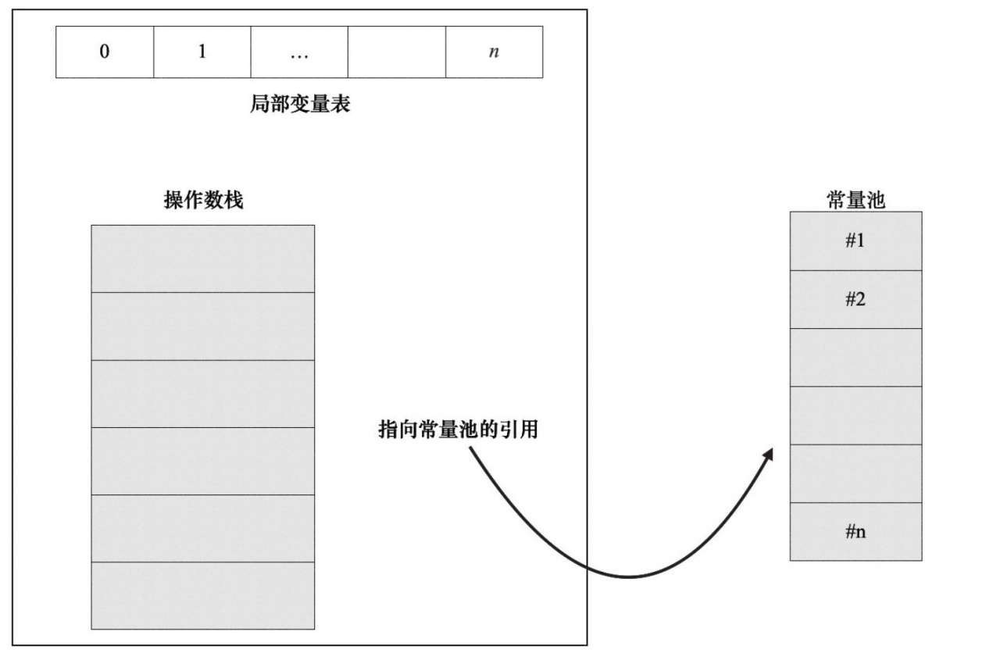
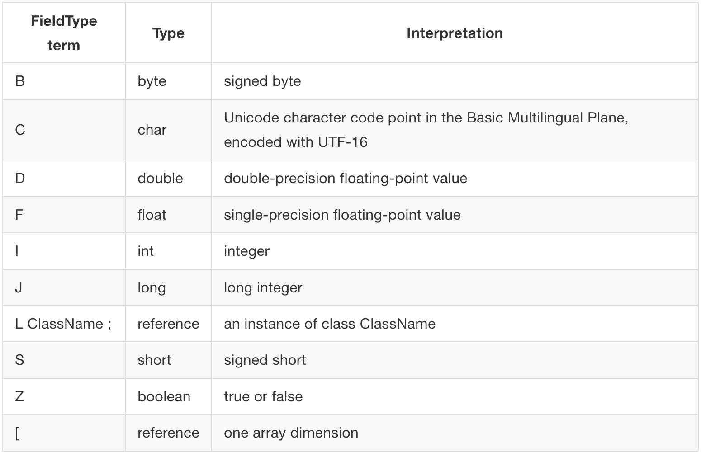
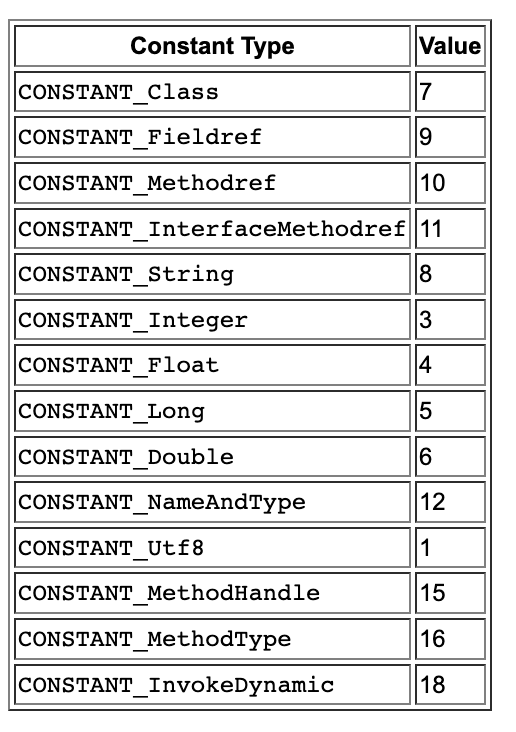
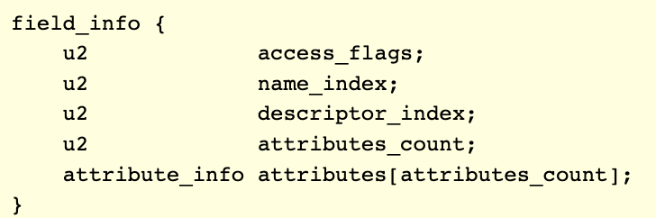
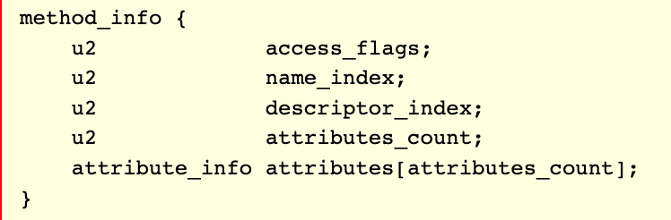

# Java8 的 .class 文件

> [官方文档](https://docs.oracle.com/javase/specs/jvms/se7/html/jvms-4.html)
>
> [火焰图](https://cn.pingcap.com/blog/flame-graph)

## 文件结构

### 总揽

我们可以参考官方文档使用类似 C 的结构来表示 .class 文件的结构：

```c
ClassFile {
  	// 魔数
    u4             magic;
  	// 版本
    u2             minor_version;
    u2             major_version;
  	// 常量池
    u2             constant_pool_count;
    cp_info        constant_pool[constant_pool_count-1];
  	// 类
    u2             access_flags;
    u2             this_class;
    u2             super_class;
    u2             interfaces_count;
    u2             interfaces[interfaces_count];
  	// 字段
    u2             fields_count;
    field_info     fields[fields_count];
  	// 方法
    u2             methods_count;
    method_info    methods[methods_count];
  	// 属性
    u2             attributes_count;
    attribute_info attributes[attributes_count];
}
```

1. magic: 即 0xCAFEBABE，是 Java 创始人的一个玩笑，因为爪哇也是世界上人口最多的岛屿，也是那里种植的咖啡的一个常见名称。
2. minor_version 和 major_version: 是该类文件的次要版本号和主要版本号。主要版本号和次要版本号确定了类文件格式的版本。如果一个类文件的主要版本号为M，次要版本号为m，我们将其类文件格式的版本表示为M.m。因此，类文件格式的版本可以按字典顺序排序，例如，1.5 < 2.0 < 2.1。**典型的，Java8 是 52.0**

### 常量池

常量池包含了代码中使用的所有常量的部分：用于编码类引用的所有字符串，包括类、字段和方法名称、它们的类型和签名、引用的任何类和方法的名称，以及代码中的任何字符串。此外，所有数值常量也被编码并由字节码引用。主要对应这两部分：

1. constant_pool_count: 其值等于常量池表中的 item 数**加一**，用于标记常量的数量。如果常量池 index 大于零且小于 constant_pool_count，则认为该常量池 index 有效，长整型和双精度浮点型常量是个例（[参考](https://docs.oracle.com/javase/specs/jvms/se7/html/jvms-4.html#jvms-4.4.5)）。

2. constant_pool[]: constant_pool是一个表([参考](https://docs.oracle.com/javase/specs/jvms/se7/html/jvms-4.html#jvms-4.4))，表示各种字符串常量、类和接口名称、字段名称和其他在 ClassFile 结构及其子结构中引用的常量。每个constant_pool表条目的格式由其第一个“tag”字节表示。constant_pool表的索引范围为1到constant_pool_count-1。

我们举个例子：

```java
int x = 4242;
```

将通过在常量槽中存储的常量值为4242进行实现，假如其位于常量池位置8，将被通过诸如ldc 8的指令在代码中引用。

在类文件中，每个常量前面都有一个标识其类型的字节。例如，整数常量的类型为3：

```
CONSTANT_Integer_info {
    u1 tag;     // = 3
    u4 bytes;
}
```

> 类似的常量定义可以在文档的常量一部分找到

常量池由于历史原因而具有一些奇怪的特点。例如: 它们从1开始索引，而不是从0开始。

另一个复杂之处在于引用的概念，例如类本身的名称。这是通过两个步骤来编码的：首先，Java编译器将创建一个utf8类型的常量（实际上是真正的UTF-8编码的微小变体，称为CESU-8）。然后，将有另一个CONSTANT_Class_info类型的常量，它引用utf8常量。

最后一个奇怪的事情即存储长整型和双精度浮点型常量的异化：在常量表中它们占据两个条目。也就是说，如果位于位置7上的常量的类型是CONSTANT_Long_info，那么位置8上将不会存储常量！

> 这是JVM最初是为32位CPU设计的众多取舍之一

但是不得不说，**使8字节常量占据两个常量池条目是一个糟糕的选择。**

常量由两个字节索引；因此最多允许65,536个常量（2^16）。

### 类

下一部分是类相关的定义：

1. access_flags: 即为权限或者说标识在 class 前面的任何东西，他是一个掩码


2. this_class: 随后是对 CONSTANT_Class_info 类型常量的引用，表示类本身的名称。其值必须是 **constant_pool 表中的有效索引**。该索引处的 constant_pool 条目必须是一个 CONSTANT_Class_info 结构，表示由该类文件定义的类或接口。
3. Super_class: 父类的名称，对于 java/lang/Object 可以为 0，这是 Java 中唯一没有父类的类。而如果super_class项的值不为零，则该索引处的constant_pool条目必须是CONSTANT_Class_info结构，表示该类文件所定义的类的直接父类。无论直接父类还是其任何父类都不得在其ClassFile结构的access_flags项的access_flags项中设置**ACC_FINAL**标志。
4. interfaces_count: 接口数量
5. interfaces[]: 接口数组

### 字段

从接口开始，我们可以看到类似常量池的简单模式的重复：首先存储长度，然后是所有的条目。

对于后面的部分来说，我们更关注于其字结构体的实现。类似`CONSTANT_Class_info`这种类常量结构体，后续的字段、方法、属性都是类似的结构体，存储在文件的后面的部分，其首位由对应的指针位置指到。

```c
field_info {
    u2             access_flags;									// 同上的权限
    u2             name_index;										// ame_index 项的值必须是constant_pool 表中的有效索引。该索引处的constant_pool条目必须是CONSTANT_Utf8_info
    u2             descriptor_index;							// 描述符_索引项的值必须是constant_pool表的有效索引。
    u2             attributes_count;							// attribute_count 项的值指示该字段的附加属性的数量。
    attribute_info attributes[attributes_count];
}
```

字段的类型描述符(descriptor_index)代表着它的**类型**。为了紧凑性，它不会以与Java代码相同的版本存储，而是以较短的形式存储。例如，int 变成了 `I`，long 变成了 `J`，而类型为 String 的字段变成了 `Ljava/lang/String`; 而类型为 double 的数组变成了 `[D`。

### 属性

属性是一种通用机制，用于在类文件中将各种类型的数据附加到字段上。相同的机制也用于方法和类本身。

```c
attribute_info {
    u2 attribute_name_index;
    u4 attribute_length;
    u1 info[attribute_length];
}
```

属性的示例包括：

1. 注释;
2. 常量字段的值;
3. 方法的代码;
4. 方法抛出的异常列表;
5. 方法代码的异常表，用于实现try/catch;
6. 类的源文件名。

大多数新版本的JVM已扩展了常量类型和有效属性的集合。例如，在Java 17中添加了一个新属性来实现密封类。

### 方法

方法很像字段：

```c
method_info {
    u2             access_flags;
    u2             name_index;
    u2             descriptor_index;
    u2             attributes_count;
    attribute_info attributes[attributes_count];
}
```

方法的类型描述符建立在字段描述符的基础上，并具有以下形式 (<参数 1 描述符> <参数 2 描述符>) <返回类型>，其中 V 用于表示 void 方法。例如：

```Java
// descriptor: (I)J
long method(int a)

// descriptor: (FI)V
void method(float a, int b)

// descriptor: (Ljava/lang/String;I)Ljava/lang/String;
String method(String a, int b)
```

需要注意的是，一种方法，除非是原生的，它都必须始终具有一种名为 code 的属性类型，这非常不寻常，因为它是唯一具有自己属性的属性

> 本规范定义的属性出现在方法信息结构的属性表中，包括Code（§4.7.3），Exceptions（§4.7.5），Synthetic（§4.7.8），Signature（§4.7.9），Deprecated（§4.7.15），RuntimeVisibleAnnotations（§4.7.16），RuntimeInvisibleAnnotations（§4.7.17），RuntimeVisibleParameterAnnotations（§4.7.18），RuntimeInvisibleParameterAnnotations（§4.7.19）和AnnotationDefault（§4.7.20）属性。
>
> Java虚拟机实现必须**能够识别并正确读取方法信息结构的属性表中的Code（§4.7.3）和Exceptions（§4.7.5）属性**。如果Java虚拟机实现识别版本号为49.0或更高的类文件，则必须能够识别并正确读取方法信息结构的属性表中的Signature（§4.7.9），RuntimeVisibleAnnotations（§4.7.16），RuntimeInvisibleAnnotations（§4.7.17），RuntimeVisibleParameterAnnotations（§4.7.18），RuntimeInvisibleParameterAnnotations（§4.7.19）和AnnotationDefault（§4.7.20）属性。
>
> Java虚拟机实现必须默默忽略它无法识别的方法信息结构的属性表中的任何或所有属性。本规范中未定义的属性不允许影响类文件的语义，只能提供额外的描述信息（§4.7.1）。

它的格式如下：

```c
Code_attribute {
    u2 attribute_name_index;
    u4 attribute_length;
    u2 max_stack;
    u2 max_locals;
    u4 code_length;
    u1 code[code_length];
    u2 exception_table_length;
    {   u2 start_pc;
        u2 end_pc;
        u2 handler_pc;
        u2 catch_type;
    } exception_table[exception_table_length];
    u2 attributes_count;
    attribute_info attributes[attributes_count];
}
```

一些有趣的部分：

1. 实际的字节码存储在代码数组中，并在其前面存储其长度；
2. 在方法执行期间，值栈的最大深度将存储在类文件中 - 因此，JVM可以一次性分配具有正确最大大小的堆栈，并在执行方法时避免重新调整它；
3. 局部变量表也是如此；
4. 异常表用于实现任何捕获块。我们将在后面讨论这个。
5. 代码的一个有趣属性是`LineNumberTable`，它用于将字节码指令的范围映射到源代码位置。这对于实现调试器非常有用，但也可以在生成异常时将源文件包含在堆栈跟踪中。

#### 行号

LineNumberTable 属性是 Code 属性（§4.7.3）属性表中的一个可选的可变长度属性。**它可以被调试器用来确定 Java 虚拟机代码数组的哪一部分对应于原始源文件中的给定行号。**

如果在给定 Code 属性的属性表中存在 LineNumberTable 属性，则它们可以以任何顺序出现。此外，多个 LineNumberTable 属性可以共同表示源文件的给定行；**也就是说，LineNumberTable 属性不需要与源代码行一对一对应。**

LineNumberTable 属性的格式如下：

```c
LineNumberTable_attribute {
    u2 attribute_name_index;
    u4 attribute_length;
    u2 line_number_table_length;
    {   u2 start_pc;
        u2 line_number;	
    } line_number_table[line_number_table_length];
}
```

LineNumberTable_attribute 结构的各个 field 如下：

1. attribute_name_index项的值必须是一个有效的索引，指向constant_pool表。该索引处的constant_pool条目必须是一个表示字符串"LineNumberTable"的CONSTANT_Utf8_info (§4.4.7)结构。

2. attribute_length项的值表示属性的长度，不包括初始的6个字节。

3. line_number_table_length项的值表示line_number_table数组中的条目数。

4. line_number_table数组中的每个条目指示原始源代码文件中的行号在代码数组中的某一点发生变化。每个line_number_table条目必须包含以下两个 field：
   1. start_pc项的值必须指示代码数组中新行在原始源文件中的开始位置的索引。start_pc的值必须小于该LineNumberTable作为属性的Code属性的code_length项的值。
   2. line_number项的值必须给出原始源文件中对应的行号。

### 类属性

类文件中的最后一个条目是类属性。其中一些最有趣的属性是 Signature，用于泛型类，以及 Bootstrap，用于实现 invokedynamic 指令 - 这是 Lambda 基础设施的一部分。 

## 栈帧

JVM 是一个基于栈的虚拟机，每个线程都有一个虚拟机栈用来存储栈帧（stack frame），栈帧是用于支持虚拟机进行方法调用和方法执行的数据结构，**栈帧随着方法调用而创建，随着方法结束而销毁**。每个栈帧可以简单的认为由三部分组成：



局部变量表的大小在编译期间就已经确定，一般用来缓存一些临时数据，JVM 会把局部变量区当成一个数组，里面会依次缓存 this 指针（非静态方法）、参数、局部变量。

假设有一个类 SimpleClass :

```java
class SimpleClass {
    private int c = 1;
    
    public int add() {
        int a = 1;
        int b = 2;
        return a + b;
    }
    public int sub(int a, int b){
        int result = a + b - c;
        System.out.println(result);
        return result;
    }
}
```

其字节码为:

```java
Last modified 2021-8-22; size 702 bytes
    MD5 checksum 86c824b56f7eef2ec5cc5275232b93eb
    Compiled from "SimpleClass.java"
class wz.run.SimpleClass
    minor version: 0
    major version: 52
    flags: ACC_SUPER
Constant pool:
    #1 = Methodref          #6.#26         // java/lang/Object."<init>":()V
    #2 = Fieldref           #5.#27         // 5表示指向声明字段的类或者接口描述符CONSTANT_Class_info的索引项，即wz/run/SimpleClass；27表示指向字段描述符 CONSTANT_NameAndType的索引项，即c:I
    #3 = Fieldref           #28.#29        // java/lang/System.out:Ljava/io/PrintStream;
    #4 = Methodref          #30.#31        // java/io/PrintStream.println:(I)V
    #5 = Class              #32            // 类和接口的全限定名，wz/run/SimpleClass
    #6 = Class              #33            // java/lang/Object
    #7 = Utf8               c
    #8 = Utf8               I
    #9 = Utf8               <init>
    #10 = Utf8              ()V
    #11 = Utf8              Code
    #12 = Utf8              LineNumberTable
    #13 = Utf8              LocalVariableTable
    #14 = Utf8              this
    #15 = Utf8              Lwz/run/SimpleClass;
    #16 = Utf8              add            // 方法名称及其描述符
    #17 = Utf8              ()I
    #18 = Utf8              a              // 局部变量及其类型描述符 
    #19 = Utf8              b              
...
    #27 = NameAndType #7:#8 // c:I
    #28 = Class             #34            // java/lang/System   
    #29 = NameAndType       #35:#36        // out:Ljava/io/PrintStream;   
    #30 = Class             #37            // java/io/PrintStream   
    #31 = NameAndType       #38:#39        // println:(I)V   
    #32 = Utf8              wz/run/SimpleClass   
    #33 = Utf8              java/lang/Object
...

{
    private int c;
        descriptor: I
        flags: ACC_PRIVATE

    wz.run.SimpleClass();
        descriptor: ()V
        flags:
        Code:
            stack=2, locals=1, args_size=1
                0: aload_0
                1: invokespecial #1                  // Method java/lang/Object."<init>":()V
                4: aload_0
                5: iconst_1
                6: putfield      #2                  // Field c:I
                9: return
        LineNumberTable:
            line 6: 0
            line 8: 4
        LocalVariableTable:
            Start  Length  Slot  Name   Signature
                0      10     0  this   Lwz/run/SimpleClass;

    public int add();
        descriptor: ()I
        flags: ACC_PUBLIC
        Code:
            stack=2, locals=3, args_size=1
                0: iconst_1
                1: istore_1
                2: iconst_2
                3: istore_2
                4: iload_1
                5: iload_2
                6: iadd
                7: ireturn
        LineNumberTable:
            line 11: 0
            line 12: 2
            line 13: 4
        LocalVariableTable:
            Start  Length  Slot  Name   Signature
                0       8     0  this   Lwz/run/SimpleClass;
                2       6     1     a   I
                4       4     2     b   I
```

我们以 add 方法部分来看：

```Java
public int add();
    descriptor: ()I
    flags: ACC_PUBLIC
    Code:
        stack=2, locals=3, args_size=1
          ...
    LocalVariableTable:
        Start  Length  Slot  Name   Signature
            0       8     0  this   Lwz/run/SimpleClass;
            2       6     1     a   I
            4       4     2     b   I
```

add 方法没有参数，但是 args_size = 1，这是因为非静态方法被调用时，第 0 个局部变量是当前的 this。 locals = 3 代表当前局部变量表的长度是 3，LocalVariableTable 中就是变量表中的内容，它表示局部表量表中有 3 个槽（slot）。如果 add 方法是静态方法，局部变量表将不包含 this，args_size = 0，locals = 2。这一点很重要。

### 操作数栈（Operand Stack）

操作数栈是一个后进先出（LIFO）栈，在方法调用时，操作数栈用于准备调用方法的参数和接收方法返回的结果。 JVM 提供了很多字节码指令用于操作数栈和本地变量表通信，比如：

- load：从局部变量表或者对象实例的字段中复制常量或者变量到操作数栈
- store：从操作数栈取走数据、操作数据和把操作结果重新入栈

再看上述例子 add 方法的字节码和相应过程图：

```Java
public int add();
    descriptor: ()I
    flags: ACC_PUBLIC
    Code:
        stack=2, locals=3, args_size=1
            0: iconst_1 // push 常量 1 到操作数栈顶
            1: istore_1 // 将栈顶元素出栈并存到局部变量表 slot1 处
            2: iconst_2 // push 常量 2 到操作数栈顶
            3: istore_2 // 将栈顶元素出栈并存到局部变量表 slot2 处
            4: iload_1 // 加载局部变量表 slot1 处元素到栈顶
            5: iload_2 // 加载局部变量表 slot2 处元素到栈顶
            6: iadd // 将操作数栈栈顶两个元素出栈，相加后将结果入栈
            7: ireturn // 返回栈顶元素，方法结束
```

局部变量表的长度为 3，操作数栈的的深度为 2：


局部变量表的容量单位是变量槽（Variable Slot）。每个变量槽最大的存储长度是 32 位，因此上面提到对于 byte、char、boolean、short、int、float、reference 是占用 1 个变量槽，对于 double、long 类型占用 2 个变量槽。

### 描述符（descriptor）

如 add 的字节码中 descriptor: ()I。描述符的作用是描述字段的数据类型、方法的参数列表（包括数量、类型以及顺序）和返回值。一般对象类型末尾都会加一个“;”来表示全限定名的结束。在字节码中，各个地方的描述符都遵守同一套逻辑，这里有一张表进行了详细的描述：



举例：

```Java
java代码                               ->      字节码描述符
void init()                           ->      ()V
void test(Object o, long l)           ->      (Ljava/lang/object;J)V
String[] getArray(String s)           ->      (Ljava/lang/String;)[Ljava/lang/String;
```

### 常用操作码指令

字节码指令由一个标识该指令的操作码（[opcode](https://docs.oracle.com/javase/specs/jvms/se7/html/jvms-6.html)）和紧跟着的固定数目的参数/操作数（operand）组成。

opcode 占用一个字节，也就是说最多支持 256 个指令。有些指令带有前缀 x，指令的前缀表示操作对象的类型，**a（针对对象）**、i（针对 int）、l（针对 long）、f（针对 float）、d（针对 double）、b（针对 byte）、c（针对 char）、s（针对 short）。 

由于 Java 虚拟机是基于栈而不是寄存器的结构，所以大多数指令都只有一个操作码。比如 `aload_0`（将局部变量表中下标为 0 的数据压入操作数栈中）就只有操作码没有操作数，而 `invokespecial #1`（调用成员方法，并传递常量池中下标为 1 的常量）就是由操作码和操作数组成的。

1. **局部变量表和操作数栈相互操作**

- xload_n：表示将第 n 个局部变量压入操作数栈中（不带参数）；xload n 是通过指定参数的形式，与前者表示的含义一样。但前者相当于只有操作码，占用 1 个字节；后者相当于由操作码和操作数组成，操作码占 1 个字节，操作数可能占 2 个字节。两种选择是增加指令数量和字节码体积的取舍，xload_n 的 n 的范围只是[0，3]。
- xstore_n 和 xstore 与 load 同理，只是表示将操作数栈栈顶的数据存储到局部变量表索引为 n 的位置中

1. **操作数栈管理指令**

- xconst_n：将常量池中的常量压入操作数栈中。const 指令范围是[-1，5]，push 与 ldc 操作范围更大的常数
- pop：栈顶出栈
- dup(n)：复制栈顶并入栈。比如 dup2 指令，输入 v2 v1，输出 v2 v1 v2 v1
- swap：交换栈顶的两个元素

1. **对象的创建和（全局变量）访问**

- newarray：创建基本数据类型的数组
- 访问静态变量：getstatic、putstatic
- 访问成员变量：getfield、putfield。比如 getfield #2 ，会获取常量池中的 #2 字段压入栈顶。

1. **方法调用和返回**

方法调用有如下 5 种

- invokestatic：用于调用静态方法
- invokespecial：用于调用私有实例方法、构造器方法以及使用 super 关键字调用父类的实例方法等
- invokevirtual：用于调用非私有实例的成员方法
- invokeinterface：用于调用接口方法
- invokedynamic：用于运行时动态解析出调用点限定符所引用的方法，并执行，比如 lambda。

方法返回指令根据方法的返回值类型进行区分

- (x)return：方法返回 x 类型变量

1. **算术指令**

算术指令用于对两个操作数栈上的值进行某种特定运算，并把结果重新压入操作数栈。如 xadd、xsub、xmul、xdiv

再看上述 System.out.println(result) 对应的字节码

```Java
3: aload_0
9: getstatic     #3                  // Field java/lang/System.out:Ljava/io/PrintStream;
12: iload_3   
13: invokevirtual #4                 // Method java/io/PrintStream.println:(I)V
```

通过 `getstatic#3` 压入了一个 `PrintStream` 对象，通过 `aload_0` 和 `iload_3` 将 this 和参数压入了操作数栈，调用 `invokevirtual #4`获取常量池中的 #4 字段，将实例 this 和参数出栈并调用 println 方法。

综上，局部变量表、操作数栈和常量池的关系可汇总如下：

-20230921120056509.(null))

# 解析 .class 文件

对于 Class 文件的抽象很简单，就是单纯的对照 JVM 规范进行 struct 的书写即可，具体参考[代码](https://github.com/ssshengh/little_jvm)，将会着重去讲的是对应到 .class 文件结构的读取。

## 安德鲁版本的读取方式

本文的工作主要参考的是[安德鲁的无私科普和奉献](https://andreabergia.com/blog/2023/07/i-have-written-a-jvm-in-rust/)，目前分支上的代码还是带着大量安德鲁原本的样子，未来我会用 norm 进行改造，并完全兼容 Java8 .class 文件的读取，在完成这一步之后，会进一步的去天马行空的写一个执行器，例如在判断 IO 操作很多之后将 Java 完全改为异步的，或者其他更有趣的方案，just for fun🤣。

读取魔数和版本，也即COFEBABY

```rust
/// 魔数是四个字节
fn check_magic_number(&mut self) -> ClassFileParserResult<()> {
    match self.buffer.read_u32() {
        Ok(0xCAFEBABE) => Ok(()),
        Ok(_) => Err(
            ClassFileParserError::InvalidClassData {
                name: "invalid magic number".to_owned(),
                is_invalidate_constant_pool_idx: false,
            }),
        Err(err) => Err(err.into()),
    }
}

/// 版本号的两部分分别两字节
fn read_version(&mut self) -> ClassFileParserResult<()> {
    let minor_version = self.buffer.read_u16()?;
    let major_version = self.buffer.read_u16()?;

    self.class_file.version = ClassFileVersion::new(major_version, minor_version)?;
    Ok(())
}
```

较为复杂的是读取常量池(其 idx 从 1 开始，但是语言中一般 0 开始)：



```rust
fn read_constants(&mut self) -> ClassFileParserResult<()> {
  	// 得到数量, 从第一个 2 字节处保存。因为是从 1 开始, 而我们这里 0 开始, 所以需要减 1
    let constants_count = self.buffer.read_u16()? - 1;
    let mut i = 0;
    while i < constants_count {
        let tag = self.buffer.read_u8()?;
        let constant = match tag {
	          // 读两个字节, 注意 Java 是 Cesu8
            1 => self.read_utf8_constant()?,
            3 => self.read_int_constant()?,
            4 => self.read_float_constant()?,
            5 => {
                i += 1; // long 类型包含了两个 slot
                self.read_long_constant()?
            }
            6 => {
                i += 1; // double 也包含了两个 slot
                self.read_double_constant()?
            }
            7 => self.read_class_reference_constant()?,
            8 => self.read_string_reference_constant()?,
            9 => self.read_field_reference_constant()?,
            10 => self.read_method_reference_constant()?,
            11 => self.read_interface_method_reference_constant()?,
            12 => self.read_name_and_type_constant()?,
            // JVM 后面增加了更多常量类型
            _ => {
                warn!("invalid entry in constant pool at index {} tag {}", i, tag);
                return Err(
                    ClassFileParserError::InvalidClassData {
                        name: format!("Unknown constant type: 0x{tag:X}"),
                        is_invalidate_constant_pool_idx: true,
                    })
            }
        };
        self.class_file.constants.add_entry(constant);

        i += 1;
    }

    Ok(())
}
```

接下来是读取类的 flag，具体来说就是 Public | Static | Final 等：

```rust
fn read_class_access_flags(&mut self) -> ClassFileParserResult<()> {
    let num = self.buffer.read_u16()?;
  	// bitsflag 帮我们解决了这个解析的麻烦事
    match ClassAccessFlags::from_bits(num) {
        Some(flags) => {
            self.class_file.flags = flags;
            Ok(())
        }
        None => Err(
            ClassFileParserError::InvalidClassData {
                name: format!("invalid class flags: {num}"),
                is_invalidate_constant_pool_idx: false,
            }),
    }
}
```

接下来读取类的名字和超类：

```rust
fn read_class_reference(&mut self) -> ClassFileParserResult<String> {
    let class_constant_idx = self.buffer.read_u16()?;
    self.read_string_reference(class_constant_idx)
}

fn read_class_reference_optional(&mut self) -> ClassFileParserResult<Option<String>> {
    let super_constant_idx = self.buffer.read_u16()?;
    if super_constant_idx == 0 {
        Ok(None)
    } else {
        Ok(Some(self.read_string_reference(super_constant_idx)?))
    }
}
```

然后读取继承的接口：

```rust
fn read_interfaces(&mut self) -> ClassFileParserResult<()> {
    let interfaces_count = self.buffer.read_u16()?;
    self.class_file.interfaces = (0..interfaces_count)
        .map(|_| self.read_class_reference())
        .collect::<ClassFileParserResult<Vec<String>>>()?;
    Ok(())
}
```

然后读取字段与方法：



```rust
fn read_fields(&mut self) -> ClassFileParserResult<()> {
    let fields_count = self.buffer.read_u16()?;
    self.class_file.fields = (0..fields_count)
        .map(|_| self.read_field())
        .collect::<ClassFileParserResult<Vec<ClassFileField>>>()?;
    Ok(())
}

fn read_methods(&mut self) -> ClassFileParserResult<()> {
    let methods_count = self.buffer.read_u16()?;
    self.class_file.methods = (0..methods_count)
        .map(|_| self.read_method())
        .collect::<ClassFileParserResult<Vec<ClassFileMethod>>>()?;
    Ok(())
}
```

最后是类的属性，这也是 Java 可以在不大改 .class 文件的前提下不断更新的关键所在:

```rust
fn read_class_attributes(&mut self) -> ClassFileParserResult<()> {
  	// 先是读取文件中的属性，他们以 bytes 存为了一个数组。
    let raw_attributes = self.read_raw_attributes()?;
  	// 然后进行解析。
    self.class_file.deprecated = self.search_deprecated_attribute(&raw_attributes);
    self.class_file.source_file = self.search_source_file_attribute(&raw_attributes)?;
    Ok(())
}
```

对于一个简单的仅包含字段和一个方法的 Java 文件的 .class 文件:

```java
package com.ss.example;

final class BasicClass {
    private int value = 10;
    private double num;
    private String ss = "ni hao";

    public static void main(String[] args) {
        for (int i = 0; i < 10; i++) {
            System.out.println("idx = " + i);
        }
    }
}
```

可以读取得到：

```
The readed class file is: 
 Class com/ss/example/BasicClass (extends java/lang/Object) version: Jdk8
Constant pool: (size: 55)
    1, MethodReference: 2, 3 => (ClassReference: 4 => (String: "java/lang/Object")), (NameAndTypeDescriptor: 5, 6 => (String: "<init>"), (String: "()V"))
    2, ClassReference: 4 => (String: "java/lang/Object")
    3, NameAndTypeDescriptor: 5, 6 => (String: "<init>"), (String: "()V")
    4, String: "java/lang/Object"
    5, String: "<init>"
    6, String: "()V"
    7, FieldReference: 8, 9 => (ClassReference: 10 => (String: "com/ss/example/BasicClass")), (NameAndTypeDescriptor: 11, 12 => (String: "value"), (String: "I"))
    8, ClassReference: 10 => (String: "com/ss/example/BasicClass")
    9, NameAndTypeDescriptor: 11, 12 => (String: "value"), (String: "I")
    10, String: "com/ss/example/BasicClass"
    11, String: "value"
    12, String: "I"
    13, StringReference: 14 => (String: "ni hao")
    14, String: "ni hao"
    15, FieldReference: 8, 16 => (ClassReference: 10 => (String: "com/ss/example/BasicClass")), (NameAndTypeDescriptor: 17, 18 => (String: "ss"), (String: "Ljava/lang/String;"))
    16, NameAndTypeDescriptor: 17, 18 => (String: "ss"), (String: "Ljava/lang/String;")
    17, String: "ss"
    18, String: "Ljava/lang/String;"
    19, FieldReference: 20, 21 => (ClassReference: 22 => (String: "java/lang/System")), (NameAndTypeDescriptor: 23, 24 => (String: "out"), (String: "Ljava/io/PrintStream;"))
    20, ClassReference: 22 => (String: "java/lang/System")
    21, NameAndTypeDescriptor: 23, 24 => (String: "out"), (String: "Ljava/io/PrintStream;")
    22, String: "java/lang/System"
    23, String: "out"
    24, String: "Ljava/io/PrintStream;"
    25, ClassReference: 26 => (String: "java/lang/StringBuilder")
    26, String: "java/lang/StringBuilder"
    27, MethodReference: 25, 3 => (ClassReference: 26 => (String: "java/lang/StringBuilder")), (NameAndTypeDescriptor: 5, 6 => (String: "<init>"), (String: "()V"))
    28, StringReference: 29 => (String: "idx = ")
    29, String: "idx = "
    30, MethodReference: 25, 31 => (ClassReference: 26 => (String: "java/lang/StringBuilder")), (NameAndTypeDescriptor: 32, 33 => (String: "append"), (String: "(Ljava/lang/String;)Ljava/lang/StringBuilder;"))
    31, NameAndTypeDescriptor: 32, 33 => (String: "append"), (String: "(Ljava/lang/String;)Ljava/lang/StringBuilder;")
    32, String: "append"
    33, String: "(Ljava/lang/String;)Ljava/lang/StringBuilder;"
    34, MethodReference: 25, 35 => (ClassReference: 26 => (String: "java/lang/StringBuilder")), (NameAndTypeDescriptor: 32, 36 => (String: "append"), (String: "(I)Ljava/lang/StringBuilder;"))
    35, NameAndTypeDescriptor: 32, 36 => (String: "append"), (String: "(I)Ljava/lang/StringBuilder;")
    36, String: "(I)Ljava/lang/StringBuilder;"
    37, MethodReference: 25, 38 => (ClassReference: 26 => (String: "java/lang/StringBuilder")), (NameAndTypeDescriptor: 39, 40 => (String: "toString"), (String: "()Ljava/lang/String;"))
    38, NameAndTypeDescriptor: 39, 40 => (String: "toString"), (String: "()Ljava/lang/String;")
    39, String: "toString"
    40, String: "()Ljava/lang/String;"
    41, MethodReference: 42, 43 => (ClassReference: 44 => (String: "java/io/PrintStream")), (NameAndTypeDescriptor: 45, 46 => (String: "println"), (String: "(Ljava/lang/String;)V"))
    42, ClassReference: 44 => (String: "java/io/PrintStream")
    43, NameAndTypeDescriptor: 45, 46 => (String: "println"), (String: "(Ljava/lang/String;)V")
    44, String: "java/io/PrintStream"
    45, String: "println"
    46, String: "(Ljava/lang/String;)V"
    47, String: "num"
    48, String: "D"
    49, String: "Code"
    50, String: "LineNumberTable"
    51, String: "main"
    52, String: "([Ljava/lang/String;)V"
    53, String: "StackMapTable"
    54, String: "SourceFile"
    55, String: "basic.java"
flags: FINAL | SUPER, deprecated: false
interfaces: []
fields:
  - PRIVATE value = Int [constant None] 
  - PRIVATE num = Double [constant None] 
  - PRIVATE ss = java/lang/String [constant None] 
methods:
  - -------------------------- Method  <init> Start --------------------------
 <init>: () -> void throws []
  code: max_stack = 2, max_locals = 1, exception_table = ExceptionTable { entries: [] }, line_number_table: Some(LineNumberTable { entries: [LineNumberTableEntry { program_counter: ProgramCounter(0), line_number: LineNumber(3) }, LineNumberTableEntry { program_counter: ProgramCounter(4), line_number: LineNumber(4) }, LineNumberTableEntry { program_counter: ProgramCounter(10), line_number: LineNumber(6) }] }), attributes = [Attribute { name: "LineNumberTable", bytes: [0, 3, 0, 0, 0, 3, 0, 4, 0, 4, 0, 10, 0, 6] }], instructions:
      0 Aload_0
      1 Invokespecial(1)
      4 Aload_0
      5 Bipush(10)
      7 Putfield(7)
     10 Aload_0
     11 Ldc(13)
     13 Putfield(15)
     16 Return

  raw_attributes: [Attribute { name: "Code", bytes: [0, 2, 0, 1, 0, 0, 0, 17, 42, 183, 0, 1, 42, 16, 10, 181, 0, 7, 42, 18, 13, 181, 0, 15, 177, 0, 0, 0, 1, 0, 50, 0, 0, 0, 14, 0, 3, 0, 0, 0, 3, 0, 4, 0, 4, 0, 10, 0, 6] }]
  - -------------------------- Method End --------------------------

  - -------------------------- Method PUBLIC | STATIC main Start --------------------------
PUBLIC | STATIC main: (java/lang/String[]) -> void throws []
  code: max_stack = 3, max_locals = 2, exception_table = ExceptionTable { entries: [] }, line_number_table: Some(LineNumberTable { entries: [LineNumberTableEntry { program_counter: ProgramCounter(0), line_number: LineNumber(9) }, LineNumberTableEntry { program_counter: ProgramCounter(8), line_number: LineNumber(10) }, LineNumberTableEntry { program_counter: ProgramCounter(33), line_number: LineNumber(9) }, LineNumberTableEntry { program_counter: ProgramCounter(39), line_number: LineNumber(12) }] }), attributes = [Attribute { name: "LineNumberTable", bytes: [0, 4, 0, 0, 0, 9, 0, 8, 0, 10, 0, 33, 0, 9, 0, 39, 0, 12] }, Attribute { name: "StackMapTable", bytes: [0, 2, 252, 0, 2, 1, 250, 0, 36] }], instructions:
      0 Iconst_0
      1 Istore_1
      2 Iload_1
      3 Bipush(10)
      5 If_icmpge(39)
      8 Getstatic(19)
     11 New(25)
     14 Dup
     15 Invokespecial(27)
     18 Ldc(28)
     20 Invokevirtual(30)
     23 Iload_1
     24 Invokevirtual(34)
     27 Invokevirtual(37)
     30 Invokevirtual(41)
     33 Iinc(1, 1)
     36 Goto(2)
     39 Return

  raw_attributes: [Attribute { name: "Code", bytes: [0, 3, 0, 2, 0, 0, 0, 40, 3, 60, 27, 16, 10, 162, 0, 34, 178, 0, 19, 187, 0, 25, 89, 183, 0, 27, 18, 28, 182, 0, 30, 27, 182, 0, 34, 182, 0, 37, 182, 0, 41, 132, 1, 1, 167, 255, 222, 177, 0, 0, 0, 2, 0, 50, 0, 0, 0, 18, 0, 4, 0, 0, 0, 9, 0, 8, 0, 10, 0, 33, 0, 9, 0, 39, 0, 12, 0, 53, 0, 0, 0, 9, 0, 2, 252, 0, 2, 1, 250, 0, 36] }]
  - -------------------------- Method End --------------------------

```

