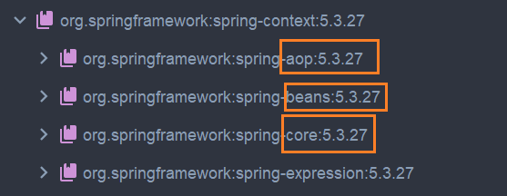

# Ioc 使用及分析

对于单纯使用 IOC 能力的模块，我们只需要依赖 context 即可，如果再额外依赖 core 啥的会导致依赖链很奇怪，升级的时候出现大量问题：

```xml
<dependency>
    <groupId>org.springframework</groupId>
    <artifactId>spring-context</artifactId>
    <version>5.3.27</version>
</dependency>
```

可以看到他的层次结构如下：



# 基本使用

## 基于 XML 文件的使用

> 本节例子在 ioc_demo1

### 简单地加载一个 bean

我们在 resource 文件夹下创建对应的 bean 文件：


该文件里描述了我们需要的对象：

```xml
<?xml version="1.0" encoding="UTF-8"?>
<beans xmlns="http://www.springframework.org/schema/beans"
       xmlns:xsi="http://www.w3.org/2001/XMLSchema-instance"
       xsi:schemaLocation="http://www.springframework.org/schema/beans http://www.springframework.org/schema/beans/spring-beans.xsd">


    <!-- 这个 bean 就是我们的 Dog 类，它以这个方式注册到了容器中，其 id 为 dog -->
    <bean class="com.ss.example.Dog" id="dog"/>
</beans>
```

> 需要注意的是，我们既可以设置 id 也可以使用 name，一般来说我们不会使用 name，他们都可以通过作为参数 name 传入以获取到 bean。
>
> 如果是同时设置了 id 和 name 的话，二者都会生效，例如：
>
> ```kotlin
> <bean class="com.ss.example.Dog" id="dog" name="dog3"/>
> ```
>
> 既可以使用'dog'去查找也可以使用'dog3'去查找，但是需要注意的是，id 和 name 在 xml 中不能重复、重名。
>
> 但是需要注意的是，name 可以定义多个，但是 id 不行，即：
>
> ```xml
> <bean class="com.ss.example.Dog" name="dog,dog2,dog3"/>
> ```
>
> 可以通过 dog，dog2，dog3 找到该 bean，但是 id 不行。
>
> 最后就是，如果没有设置 id 和 name，那么获取时，该 bean 的名字就是其全路径`"com.ss.example.Dog"`。

其对应的类为：

```kotlin
package com.ss.example

class Dog {
    var name: String = ""

    var age: Int = 0

    var weight: Double = 0.0

    constructor() {
        println("Dog constructor")
    }

    override fun toString(): String {
        return "Dog(name='$name', age=$age, weight=$weight)"
    }
}
```

我们加载容器以调用它：

```kotlin
import org.springframework.context.support.ClassPathXmlApplicationContext

fun main(args: Array<String>) {
    // 这个类会去 resource 目录下找 beans.xml 文件, 他会加载 Spring 文件, 并初始化容器
    // 这意味着, 哪怕不执行, Dog 对象也已经存在了
    val context = ClassPathXmlApplicationContext("beans.xml")
}
```

执行的话可以看到无参构造器中的 print 执行了，这意味着，容器初始化其实已经把对象 new 出来了。

### 获取到 bean

获取到 bean 有三种简单的方法：

```kotlin
fun main(args: Array<String>) {
    // 这个类会去 resource 目录下找 beans.xml 文件, 他会加载 Spring 文件, 并初始化容器
    // 这意味着, 哪怕不执行, Dog 对象也已经存在了
    val context = ClassPathXmlApplicationContext("beans.xml")

    // 从容器中获取对象, name 其实就是 beans.xml 中的 id
    val dog1 = context.getBean("dog") as Dog
    dog1.name = "dog1"
    println(dog1)
    // 也可以直接获取, 这样就不需要强制转换了, 由于是基于类型, 因此需要确保只有一个 bean
    val dog2 = context.getBean(Dog::class.java)
    dog2.name = "dog2"
    println(dog2 == dog1)

    val dog3 = context.getBean("dog", Dog::class.java)
    println(dog3 == dog2)
}
```

输出很有意思：

```kotlin
Dog constructor
Dog(name='dog1', age=0, weight=0.0)
true
true
```

这意味着其实我们拿到的都是一个对象。

### 属性注入

* **set 注入**

这里主要是通过类的无参构造方法构建一个对象，然后通过 set 方法注入其 filed。我们定义一个类：

```kotlin
package com.ss.example

class User {
    var name: String = ""
        set(value) {
            field = value
            println("name set: $value")
        }

    var age: Int = 0

    var address: String = ""

    override fun toString(): String {
        return "User(name='$name', age=$age, address=$address)"
    }
}
```

然后在配置文件中`set_properities`中进行注入：

```xml
<?xml version="1.0" encoding="UTF-8"?>
<beans xmlns="http://www.springframework.org/schema/beans"
       xmlns:xsi="http://www.w3.org/2001/XMLSchema-instance"
       xsi:schemaLocation="http://www.springframework.org/schema/beans http://www.springframework.org/schema/beans/spring-beans.xsd">

    <bean class="com.ss.example.User" id="user" >
        <property name="name" value="张三"/>
        <property name="age" value="18"/>
        <property name="address" value="street1"/>
    </bean>

</beans>
```

本质上是通过 set 方法注入的，因此我们在执行之后能够看到 set 方法中的 print。

> 需要注意的是，属性名其实不是字段名字，而是通过 get/set 方法推断出来的（反射中的 Java 内省）

除了上面这种很基本的属性注入，我们还需要考虑：对象、数组、map 等复杂属性的注入，我们修改 User 为：

```kotlin
package com.ss.example

class User {
    var name: String = ""
        set(value) {
            field = value
            println("name set: $value")
        }

    var age: Int = 0

    var address: String = ""

    var dog: Dog? = null

    var cats = mutableListOf<Cat>()

    var favorites = mutableListOf<String>()

    var infos = mutableMapOf<String, String>()

    override fun toString(): String {
        return "User:{name=$name, age=$age, address=$address, dog=$dog, cats=$cats, favorites=$favorites, infos=$infos}"
    }
}
```

然后我们就可以用类似的办法给注入即可：

```xml
<?xml version="1.0" encoding="UTF-8"?>
<beans xmlns="http://www.springframework.org/schema/beans"
       xmlns:xsi="http://www.w3.org/2001/XMLSchema-instance"
       xsi:schemaLocation="http://www.springframework.org/schema/beans http://www.springframework.org/schema/beans/spring-beans.xsd">

    <bean class="com.ss.example.Dog" id="dog"/>

    <bean class="com.ss.example.User" id="user" >
        <property name="name" value="张三"/>
        <property name="age" value="18"/>
        <property name="address" value="street1"/>
        <!--引用一个外部对象-->
        <property name="dog" ref="dog"/>
        <!--在内部来完成对象的定义-->
        <property name="cats">
            <list>
                <bean class="com.ss.example.Cat">
                    <property name="name" value="小白"/>
                    <property name="age" value="2"/>
                </bean>
                <bean class="com.ss.example.Cat">
                    <property name="name" value="小黑"/>
                    <property name="age" value="3"/>
                </bean>
            </list>
        </property>
        <!--array-->
        <property name="favorites">
            <array>
                <value>足球</value>
                <value>篮球</value>
                <value>rap</value>
            </array>
        </property>
        <!--map-->
        <property name="infos">
            <map>
                <entry key="身份证" value="123456"/>
                <entry key="职位" value="工程师"/>
            </map>
        </property>
    </bean>

</beans>
```

* **构造器注入**

我们给上面的 User 添加一个简单的构造方法：

```kotlin
constructor(name: String, age: Int, address: String, cats: MutableList<Cat>) {
    println("User constructor")
    this.name = name
    this.age = age
    this.address = address
    this.cats = cats
    println(this.cats)
}
```

在具体注入的时候可以使用上面类似的办法：

```xml
<bean class="com.ss.example.User" id="user" >
    <constructor-arg name="name" value="张三"/>
    <constructor-arg name="age" value="18"/>
    <constructor-arg name="address" value="street1"/>
    <constructor-arg name="cats">
        <list>
            <bean class="com.ss.example.Cat" name="cat1"/>
            <bean class="com.ss.example.Cat" name="cat2"/>
        </list>
    </constructor-arg>
</beans>
```

* **p 名称空间注入（本质还是 set 注入）**

其实就是加了一个 xml 的命名空间：

```xml
<bean class="com.ss.example.Cat" id="cat1" p:name="cat"/>
```

### 属性自动注入

主要是说明 bean 标签中的 autowire 属性的作用。

| 取值        | 含义                                                         |
| ----------- | ------------------------------------------------------------ |
| no          | 默认取值，表示不做自动注入，如果需要注入，需要用户手动去指定注入 |
| byName      | 这个会分析需要注入的 bean 中对应字段的名字，然后去容器中拿到该名字的对应的同名 name 的 bean 并注入进来（set方法，例如字段为`var cat: Cat? = null`，那么拿的`name="cat"`） |
| byType      | 这个会分析当前 beans 中 bean 的类型，去拿同类型的，注意，如果同类型有多个会抛异常 |
| construstor | 这个会找到合适的构造方法，通过构造方法来注入值               |
| default     | 这个使用 beans 标签中的定义来进行处理                        |

default 的一个典型的例子如下，他会使用 byName 来进行处理:

```xml
<beans default-autowire="byName">
    <bean class="com.ss.example.Cat" name="cat">
        <property name="name" value="Tom"/>
        <property name="age" value="3"/>
    </bean>

    <bean class="com.ss.example.Cat" name="cat2">
        <property name="name" value="Jerry"/>
        <property name="age" value="2"/>
    </bean>
	<!--拿到的会是 Tom 而不是 Jerry-->
    <bean class="com.ss.example.User" name="user" autowire="default">
        <property name="name" value="Jack"/>
        <property name="age" value="18"/>
    </bean>

</beans>
```

## 配置文件加载

我们到目前为止都是使用的 xml 加载：

```kotlin
import com.ss.example.User
import org.springframework.context.support.ClassPathXmlApplicationContext

fun main(args: Array<String>) {
    val ctx = ClassPathXmlApplicationContext("beans.xml")
    val bean = ctx.getBean("user", User::class.java) as User
    println(bean)
}
```

实际上，我们在类文件中通过 ctrl+H 可以看该类的继承关系，可以看到我们上面使用的 xml 加载方法的类有着一个兄弟类：


我们使用这个`FileSystemXmlApplicationContext`来查找一下看看：

```kotlin
import com.ss.example.User
import org.springframework.context.support.FileSystemXmlApplicationContext

fun main(args: Array<String>) {
    val ctx = FileSystemXmlApplicationContext("src/main/resources/beans.xml")
    val bean = ctx.getBean("user", User::class.java) as User
    println(bean)
}
```

可以看到，无非就是默认的父路径不一样。

## Java 代码配置

> 本节例子在 ioc_demo2

我们使用代码来配置相对于 xml 来说会更好理解一些，因为其实就是完整的 new 一个对象然后设置对应的字段而已，例如下面的配置类：

```kotlin
import com.ss.example.Cat
import com.ss.example.User
import org.springframework.context.annotation.Bean


class BeanConfig {

    /**
     * @Bean 注解相当于在 xml 中配置了一个 bean，方法名相当于 bean 的 id，返回值相当于 bean的 class
     */
    @Bean
    fun user(): User {
        val user = User()
        user.name = "user1"
        user.age = 18
        user.cat2 = Cat()
        return user
    }
}
```

`@Bean("u1")`就是给到一个自定义的名字，然后我们来加载它：

```kotlin
fun main(args: Array<String>) {
    AnnotationConfigApplicationContext(BeanConfig::class.java).use { ctx ->
        val bean2 = ctx.getBean("user", User::class.java) as User
        println(bean2)
    }
}
```

上面的代码中没有提到一个问题：如果是管理的对象中涵盖了另一个 bean 的话，那么应该怎么来处理？在 xml 中我们直接使用`ref`即可，但是代码中不太一样：

```kotlin
import com.ss.example.Cat
import com.ss.example.User
import org.springframework.context.annotation.Bean


class BeanConfig {

    /**
     * @Bean 注解相当于在 xml 中配置了一个 bean，方法名相当于 bean 的 id，返回值相当于 bean的 class
     */
    @Bean
    fun user(cat: Cat): User {
        val user = User()
        user.name = "user1"
        user.age = 18
        user.cat2 = cat
        return user
    }

    @Bean
    fun cat(): Cat {
        val cat = Cat()
        cat.name = "小黑"
        cat.age = 2
        cat.weight = 3.5
        return cat
    }
}
```

其实还是一个关键点，新加的函数参数中，名字还是直接对应了 bean 的 name **也即我们的形参名称应该对应 bean 的函数名称**。