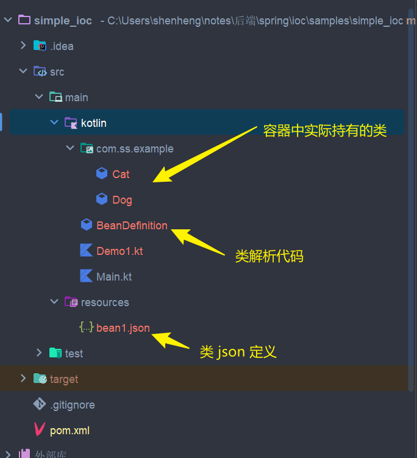

# IOC

IOC(Inversion of control) 即控制反转，为 Spring 里面的重要概念，也是最需要掌握的跨语言知识及工程方法。

其核心目的是减小代码耦合度，常见实现方式为依赖注入 DI。

# 背景及问题

对于 Java 代码中，由于存在类，因此需要常常考虑 A 类需要使用 B 类对象的时候：

```java
class B {}

class A {
    B b = new B();
}
```

对于上面的代码，A 中使用 B 对象，则 B 对象的控制权就在 A 中。

由于我们在工程中有着成百上千个类，各个类之间又存在耦合，如果我们只能以字段这种方式注入的话，那么将会十分复杂且耦合。因此 Spring 创造了 IOC 容器，用来存放所有的 Bean 以解决这个问题，也即 IOC 容器来完成对类的管理，并处理他们之间的依赖联系。

例如，将上面这个例子改为 IOC 的话就是，项目启动的时候 A 与 B 的类全路径、Bean 名称等信息都会被 IOC 容器获取到(xml 方式或者是注解的方式)，然后 IOC 容器就通过这些信息基于反射区创建对象，这些对象控制权都收拢在 Spring 容器中。此时如果 A 类需要 B 类，它只需要去 IOC 容器拿就行了。

因此，所谓的控制反转无非就是：B 的控制权从 A 移交到 Spring 容器。

# 写一个简单的 IOC 容器

对于 Spring 来说，一个 IOC 容器无非就是收容了所有的类，我们可以使用如下的一个小程序来模拟(代码在 samples/simple_ioc 中)：



我们使用一个 json 来描述需要存放的容器类，很简单，一个是类的全路径信息，一个是类的 id：

```kotlin
[
  {
    "clazz": "com.ss.example.Dog",
    "id": "dog"
  },
  {
    "clazz": "com.ss.example.Cat",
    "id": "cat"
  }
]
```

有了 JSON 之后需要将 JSON 读取为一个我们可以在运行时操控的类文件，这个类文件我们定义很简单，就是对应其 JSON 字段来即可：

```kotlin
/**
 * 这个类主要是用来描述一个Bean的定义，将 json 中的类信息解析出来，然后封装到这个类中
 * (Spring 中是将 XML 中的信息解析出来，然后封装到 BeanDefinition 中)
 */
class BeanDefinition {
    var clazz: String? = null
    var id: String? = null
}
```

然后我们再构建两个对应全路径的 Dog 和 Cat 类：

```kotlin
class Cat {
    var name = "cat"
    override fun toString(): String {
        return "com.ss.example.Cat: $name"
    }
}

class Dog {
    var name = "dog"

    override fun toString(): String {
        return "com.ss.example.Dog: $name"
    }
}
```

最后我们就可以解析了：

```kotlin
import com.fasterxml.jackson.core.type.TypeReference
import com.fasterxml.jackson.databind.ObjectMapper
import com.ss.example.Cat
import com.ss.example.Dog
import java.io.FileInputStream
import java.lang.reflect.Type

fun main() {
    // 文件路径
    val path = "./src/main/resources/bean1.json"
    val inputStream = FileInputStream(path)

    // json 读取器
    val om = ObjectMapper()
    val beanDefinition = om.readValue(inputStream, object : TypeReference<List<BeanDefinition>>() {
        override fun getType(): Type {
            return super.getType()
        }
    })

    // 读取并装载容器
    val beanFactory = mutableMapOf<String, Any>()
    beanDefinition.forEach {
        val id = it.id
        val clazz = it.clazz
        Class.forName(clazz).getConstructor().newInstance().also { bean ->
            beanFactory[id!!] = bean
        }
    }

    // 从容器中获取对象
    val bean1 = beanFactory["dog"] as Dog
    val bean2 = beanFactory["cat"] as Cat
    println(bean1)
    println(bean2)
}


// 结果
com.ss.example.Dog: dog
com.ss.example.Cat: cat
```

