# Android ANR 触发原理

## 概述

ANR(Application Not responding)，即应用程序无响应。是Android系统对特定事件的超时检测机制，系统如果检测到这些事件在预定的时间内未完成，系统则触发ANR。触发ANR后系统会收集相关日志，如果是前台应用则弹出一个对话框通知用户，用户可以选择继续等待或强制关闭应用；如果是后台应用则直接kill。

系统触发ANR的场景有以下几种：

- Input事件处理超时 
- Service启动超时
- 广播处理超时
- ContentProvider启动超时

要理解ANR的触发原理，需要对 Android 的 Service 启动流程，广播处理流程，ContentProvider 启动流程和 Input 事件派发流程有所了解。因为，ANR的检测机制就是针对以上几个流程中的关键步骤的超时监测。

监测一般包括3个步骤：事件开始时启动定时，事件如果在预定时间之前结束则解除定时，事件如果在预定时间未结束则触发ANR。

下面通过时序图分别分析下触发ANR的几个场景，重点关ANR注定时器的启动/解除和触发的时机（以下分析基于Android11 源码）。

## Service 启动超时

一般有3种启动Service的方法：startService，bindService和startForegroundService，在以下流程图中使用不同的背景色体现不同启动方法的差异。另外，Service启动过程中我们重点关注和ANR相关的点，因此流程图中对与ANR不相关的逻辑做了大量的简化。

Service启动ANR的超时时间和下面两个系统变量有关：

[fgRequired](https://cs.android.com/android/platform/superproject/+/master:frameworks/base/services/core/java/com/android/server/am/ServiceRecord.java?q=fgRequired&ss=android/platform/superproject)：是指Service是否作为前台运行。如果用户调用bindservice或startService，该变量为false；如果调用startForegroundService() 则该变量为true。如果该变量为true则启动流程中会多一个10秒的超时检测（参考startForegroundService小节）。

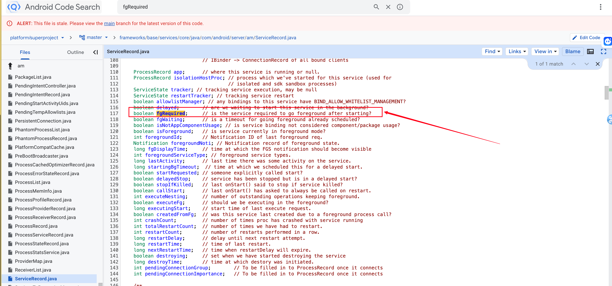

[execInFg](https://cs.android.com/android/platform/superproject/+/master:frameworks/base/services/core/java/com/android/server/am/ActiveServices.java;l=3665?q=execInFg&sq=&ss=android/platform/superproject)：是指启动Service的应用（caller）是处于前台还是后台，如果为true，则ANR超时时间为20s，如果为false则为200s。

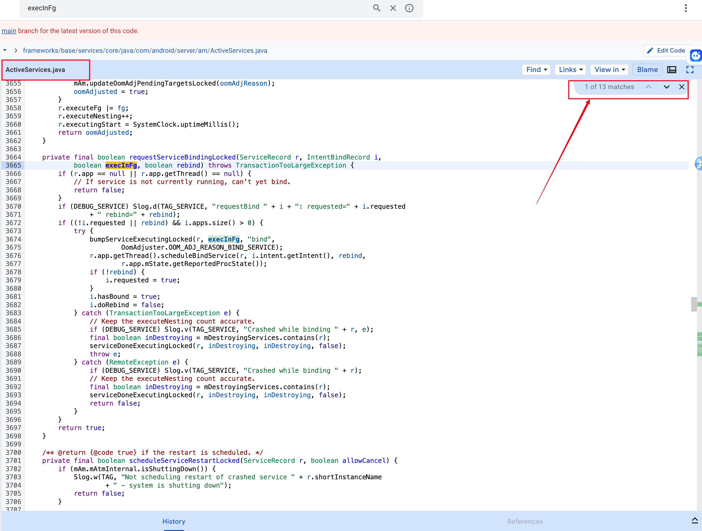

我们平常说的前台和后台service超时时间分别为20s和200s，**指的是启动servce的应用是处于前台还是后台**，而不是说service本身是处于前台或后台。

### startService

**时序图：**

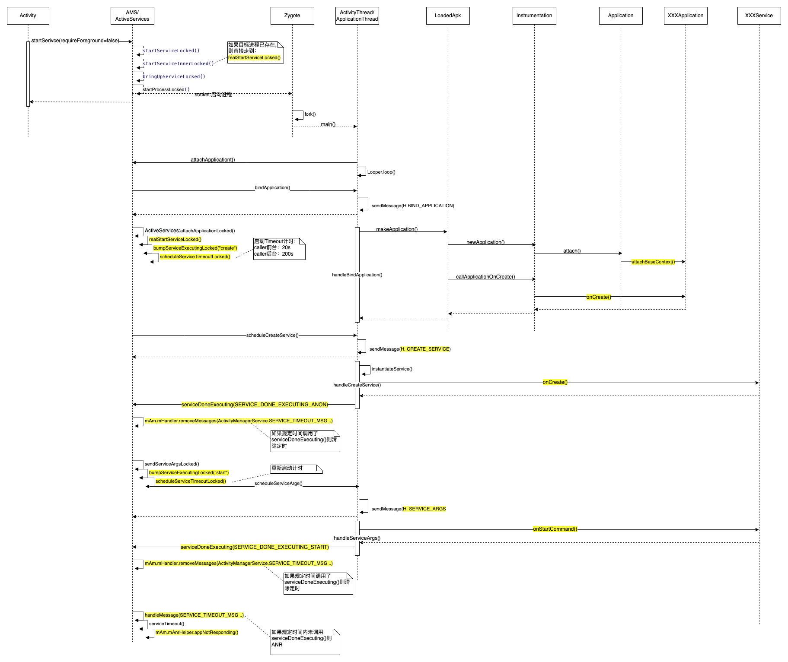

**生命周期函数调用栈：**

通过生命周期函数的调用栈，可以加深对 service 启动流程的理解。

**Application attach():**-20240403161240949.(null))

**Application onCreat():**

-20240403161212908.(null))

**Service onCreate():**

-20240403161212780.(null))

**Service onStartCommand():**

-20240403161212822.(null))

**通过以上流程分析，可以得出以下结论**：

1. 启动service时，如果目标进程没有启动，则先启动对应的应用进程。但启动应用阶段并没有超时监控，因此如果在应用的attachBaseContex()或onCreate()中有耗时不会导致service 启动类ANR。
2. startService的启动分为两个阶段，第一阶段是create，第二个阶段是start，这两个阶段都是分别有超时监控，因此如果在业务service的onCreate()和onStartCommand()有耗时会导致ANR。两个阶段的超时时间是独立里，都有20s/200s而不是总的时间是20s或200s。
3. 超时时间是20s还是200s，这和Caller App的状态有关，如果Caller App处于前台则20s超时；如果Caller App处于后台则200s超时。（超时时间的定义：[SERVICE_TIMEOUT](https://cs.android.com/search?q=SERVICE_TIMEOUT&sq=&ss=android/platform/superproject)/[SERVICE_BACKGROUND_TIMEOUT](https://cs.android.com/search?q=SERVICE_BACKGROUND_TIMEOUT&sq=&ss=android/platform/superproject)）

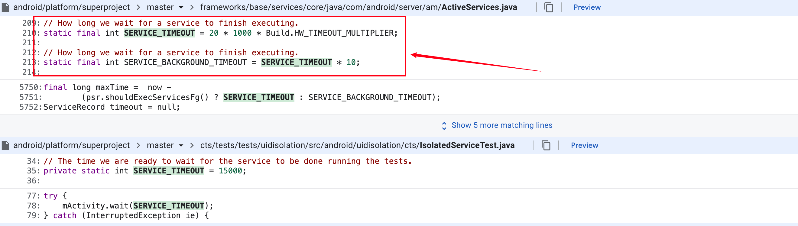

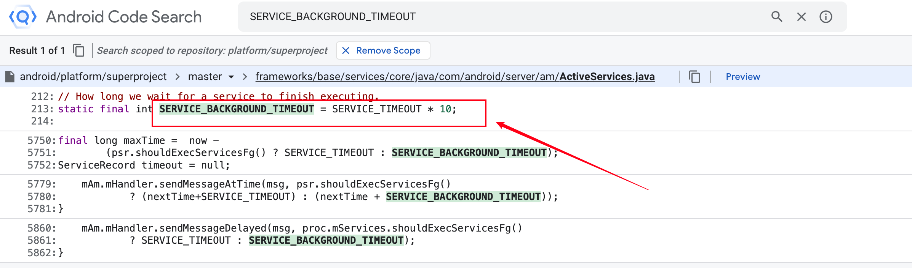

4. 从应用的角度看Service启动ANR的原因：

- 系统启动定时后，应用没收到H. CREATE_SERVICE 或 H.SERVICE_ARGS消息就ANR了。 
- 应用有收到H. CREATE_SERVICE 或 H.SERVICE_ARGS消息，但主线程太忙还没有开始处理就ANR了（目前Slardar遗留的Service超时类ANR主要是这类）。
- 应用处理H. CREATE_SERVICE 或 H.SERVICE_ARGS消息耗时太长（对应onCreate()和onStartCommand()）。

5. 应用可以监测H. CREATE_SERVICE 和H.SERVICE_ARGS这两个消息来感知service启动事件。

### startForegroundService

**时序图：**

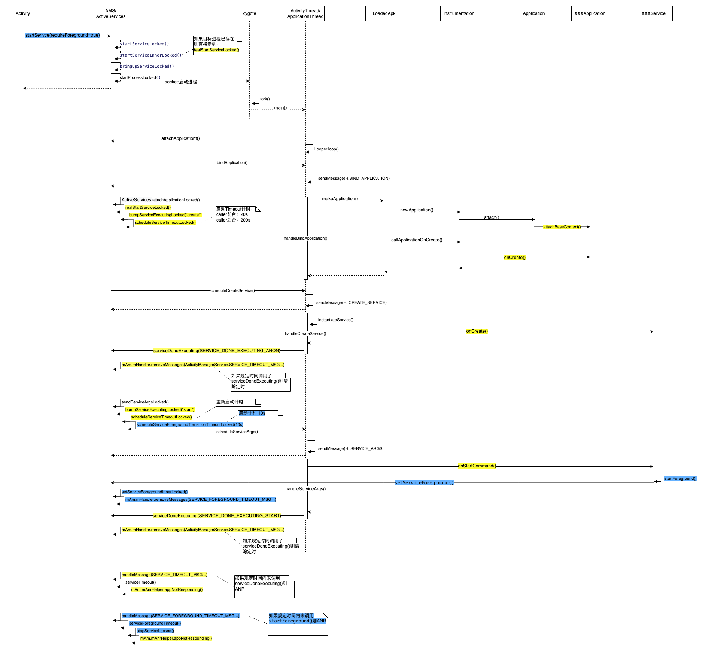

说明：

1. startForegrondService() 最终还是调用startService()，只是requireForeground参数为true。

-20240403161212916.(null))

1. 从上述时序图可以看到，startForegrondService()的启动流程相比startService()，在应用处理完onCreate()返回到系统时，系统同时启动了两个定时器：第一个和上一小节的startService()一样用于检测onStartCommand()的耗时；第二个的目的是要求应用在10秒内必须调用startForeground()方法，如果应用在10s没有调用该方法，系统则出发ANR并stop该service。（超时时间的定义：**[SERVICE_START_FOREGROUND_TIMEOUT](https://cs.android.com/search?q=SERVICE_START_FOREGROUND_TIMEOUT&ss=android/platform/superproject)**）
2. 上述的第二个超检测是Android8.0开始新引入的机制，Android8.0之后系统不允许后台应用启动后台service，但可以通过startForegrondService()启动前台service。应用一般在onStartCommand()中调用startForeground()方法，如果onStartCommand()中任务较多，可以先调下startForeground()避免10s超时ANR。

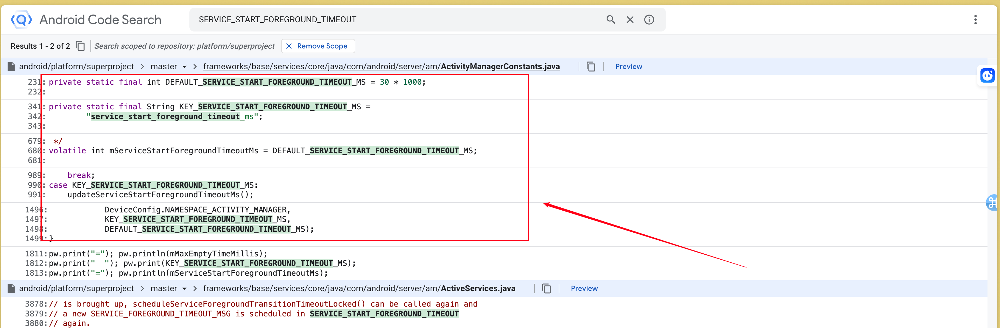

### bindService:

**时序图：**

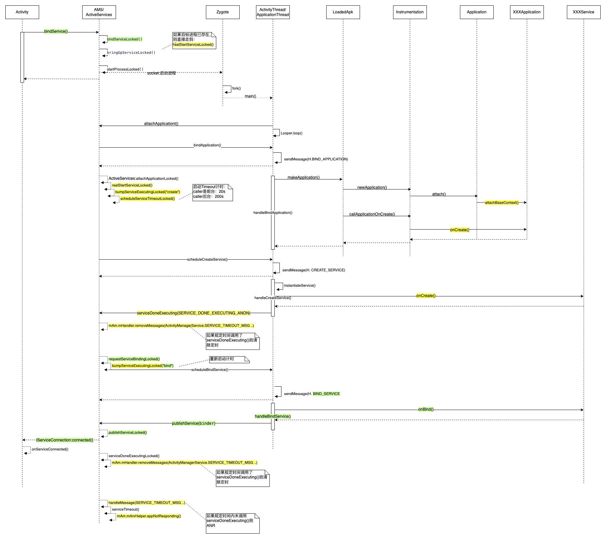

**调用栈：**

**onBind():**

-20240403161212900.(null))

**onServiceConneted():**

-20240403161212853.(null))

说明：

bindService和startService的流程相似，只是启动过程第二阶段的onStartCommand()变成了onBind()，因此如果在onBind()中有耗时会导致ANR。

# 广播处理超时

完整的广播机制包括3个重要的流程：

- 广播注册：应用告诉系统你关注那些广播，以及对应的广播接收器是什么。注册分为动态注册和静态注册。注册方式会影响到后面的广播派发。
- 广播发送：应用通过Binder调用将广播发给出系统，系统根据具体情况将广播存放到对应的广播消息队列中，然后返回。广播发送者一般不关心广播的处理情况。
- 广播派发：系统将广播消息队列中的广播列表分别派发到广播接收者。

广播ANR的触发场景是发生在广播派发阶段。

## 广播发送

虽然ANR的触发场景发生的广播派发阶段，但广播发送方式对后面的派发流程有影响，因此先看下发送过程。

**时序图：**

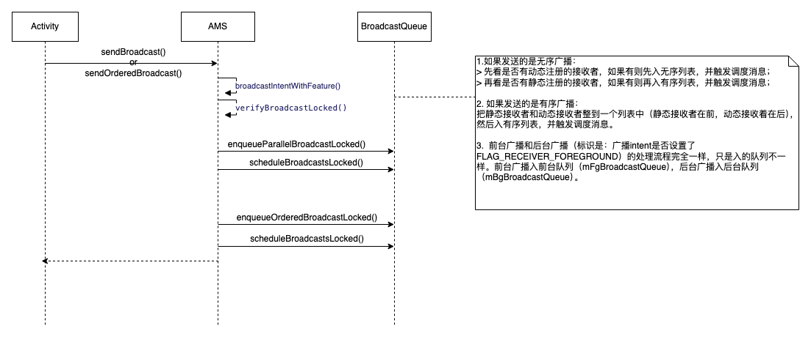

说明：

1. 系统有两个广播消息队列（mFgBroadcastQueue和mBgBroadcastQueue）分别用于存放前台广播和后台广播。系统识别前台和后台广播的标识是看广播intent是否设置了FLAG_RECEIVER_FOREGROUND。这两个队列的派发流程基本一致，ANR触发时机也一致。这两个队列的广播都是在同一个线程中派发，从派发流程上看，前台广播的派发优先级并没有比后台广播高。前台广播之所以能快速收到，主要是前台广播比较少。
2. 每个消息队列（即：mFgBroadcastQueue和mBgBroadcastQueue）又包含两个消息列表，分别用于存放有序广播和无序广播。一个广播是放入有序列表还是无序列表，分以下几种情况：

- 如果用户是调用sendOrderedBroadcast()发送的广播，则不管该广播的接收者是动态注册的还是静态注册的或两种方式都有，都入有序列表。
- 如果用户是调用sendBroadcast()发送的广播，则需要看接受者的注册方式：
  - 如果只有动态注册的接收者，则只入无序列表；
  - 如果只有静态注册的接收者，则只如有序列表；
  - 如果既有动态注册又有静态注册的，则分别入有序列表和有序列表。

## 广播派发

**时序图：**

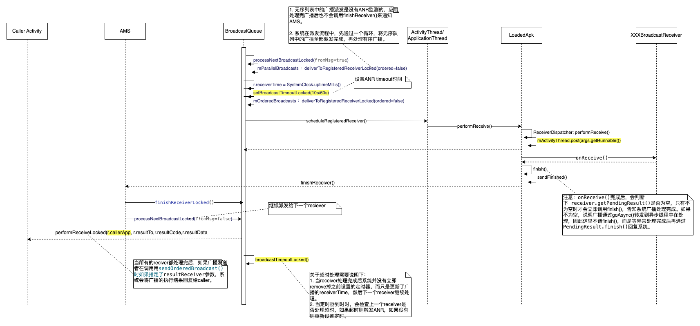

**调用栈：**

**onReceive():**

-20240403161212969.(null))

通过以上流程分析，可以得出以下结论：

1. 广播ANR超时只针对有序队列中的广播，因此，如果一个广播是通过sendBroadcast()接口发送并且其接收者都是通过动态注册的，那么这个广播就不可能导致ANR。应用应该尽可能使用动态注册广播监听而非静态注册。
2. 广播ANR的超时时间是针对一个receiver而言的，也就是说每个receiver都必须在10s(前台队列)或60s(后台队列)内完成。（超时时间的定义：[BROADCAST_FG_TIMEOUT](https://cs.android.com/search?q=BROADCAST_FG_TIMEOUT&sq=&ss=android/platform/superproject)/[BROADCAST_BG_TIMEOUT](https://cs.android.com/search?q=BROADCAST_BG_TIMEOUT&ss=android/platform/superproject)）
3. 一个reciver如果处理超时引发ANR并不影响下一个receiver的接收，不过系统有一个总的处理超时时间（2 * mConstants.TIMEOUT * numReceivers），即：ANR超时时间*该广播的接收者的个数*2。当广播的总处理时间超过该值后会强制结束该广播，后面的receiver就收不到该广播了。 
4. 如果广播处理器在onReceive()中通过goAsync()方式将广播转到异步线程中处理，异步处理过程也需要在预定时间内完成并调用PendingResult.finish()回复系统，否则也会导致ANR。
5. 如果通过goAsync()将广播转到某个service执行，则承载该service的应用的启动时间也算在广播超时时间里的，如果应用启动慢，容易触发ANR。比如google firebase 广播ANR就是这种情况。
6. 从应用的角度看广播ANR的原因：

- 系统启动定时后，应用没收到广播就ANR了。 
- 应用有收到消息（即args.getRunnable()已经进入到应用的主线程looper队列），但主线程太忙还没有开始处理就ANR了。
- 应用广播接收器的onReceive()处理耗时或广播异常处理耗时。

1. 应用可以监测args.getRunnable()这个消息来感知广播事件。

# ContentProvider启动超时

ContentProvider是伴随着ContentProvider进程的启动而启动的。下面通过分析ContentProvider进程的启动说明ContentProvider启动ANR的触发时机。

**时序图：**

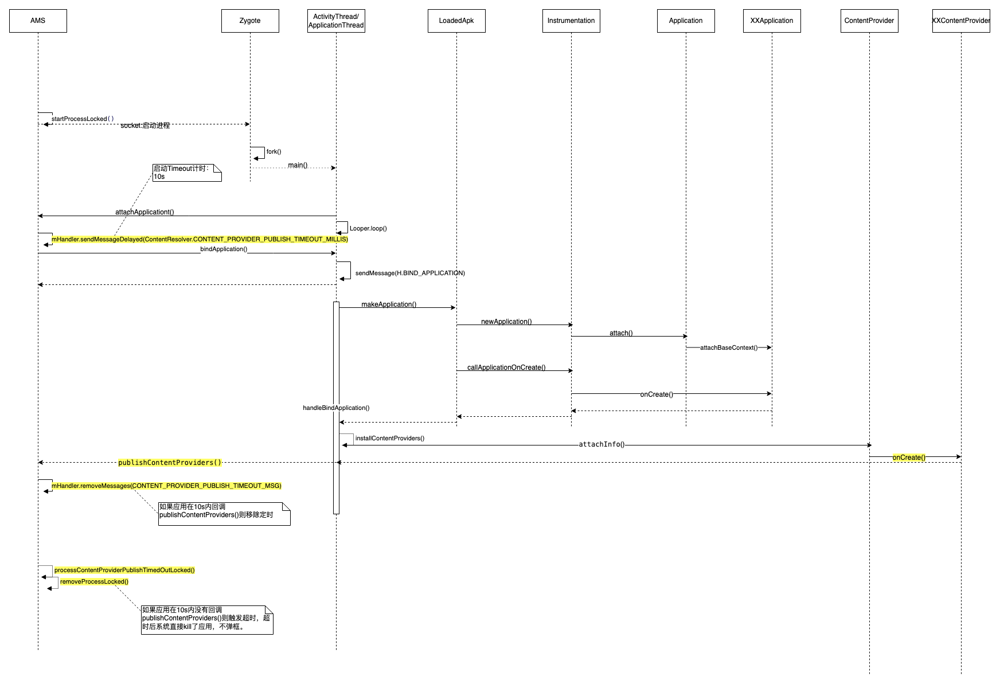

**调用栈：**

从以上流程分析得出以下结论：

1. contentProvider的超时检测时间段包含了应用的attachBaseContext()和onCreate()以及contentProvider的onCreate()。
2. contentProvider在publish过程中出现的ANR，系统并没有调用appNotResponding()做后续处理，而是直接kill了应用。因此slardar上没有此类ANR。

# Input事件超时ANR

Input事件超时类ANR的触发逻辑相对复杂一些，需要对Android Input子系统有所了解，Input系统主要包含以下关键流程：

- 应用程序窗口向InputDispatcher注册inputchanel的流程
- WMS(WindowManagerService)向InputDispatcher设置焦点窗口的流程
- InputReader通过eventhub读取“/dev/input/”设备节点来获取kernel 上报的input消息的流程
- InputReader派发消息到InputDispatcher的流程
- InputDispatcher派发消息到应用的流程
- 应用程序处理消息并回复InputDispatcher的流程

Input超时类ANR的触发发生在InputDispatcher派发到应用过程，触发原因主要有两类：一类等foucus窗口超时（no focus window），另一类是应用处理事件超时。下面通过分析InputDispatcher的派发过程说明Input ANR的触发原理。

**时序图：**

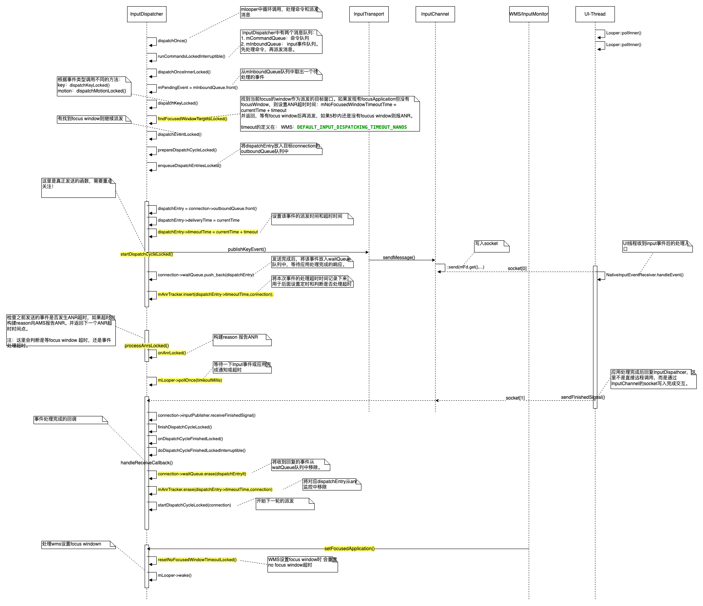

**调用栈：**

**说明：**

1. 对于事件处理超时可能有下面几种情况：

消息还在socket buffer中未被应用UI线程读走

消息已经读走，但处理超时

1. NativeInputEventReceiver是作为ui线程looper 监听的多个fd中的其中一个fd的callback，input消息的处理并没有进入MessagQueue。
2. 滑动事件（BatchedInput）的真正处理是在Choreographer doFrame()流程中。
3. No focus window 类ANR主要应用启动时或窗口切换耗时。

