# Android-Native崩溃入门

Native崩溃问题一直是困扰APP开发工程师的大难题，遇到问题往往无从入手。

原因可能是如下三点：

1. 看不懂Native崩溃，不知道它是如何产生的
2. 缺少有效调试信息，不知道如何抓取调试信息
3. 看不懂调试信息，不知道如何分析Native崩溃


根据上述原因，本文将分三个部分进行讲解：Native崩溃的产生原因，Native崩溃的调试信息，Native崩溃的分析方法

## Native 崩溃产生的原因

### 外在表现

在产生 Native 崩溃时，程序一般会有几种表现：

1. APP立即重启。
2. APP卡顿几秒，重启。
3. APP退出，回到桌面。
4. 卡顿几秒，出现 ANR 弹窗。

### 异常与信号基础知识

应用程序崩溃的原因是发生了某种无法忽略的异常，异常分为软件和硬件两种

1. **软件异常来自于我们编写代码时的异常检测点，比如assert断言**；
2. 硬件异常来自于CPU的
   1. 内存访问中的地址异常
   2. 指令解析过程中的指令异常
   3. 其他CPU中断异常。 

Linux系统通过信号(Signal)来表示一个应用程序的异常事件，Linux下的信号处理机制即是应用程序的异常处理机制，不同的信号值(Signal Number)表示不同类型的异常，常见异常如下：

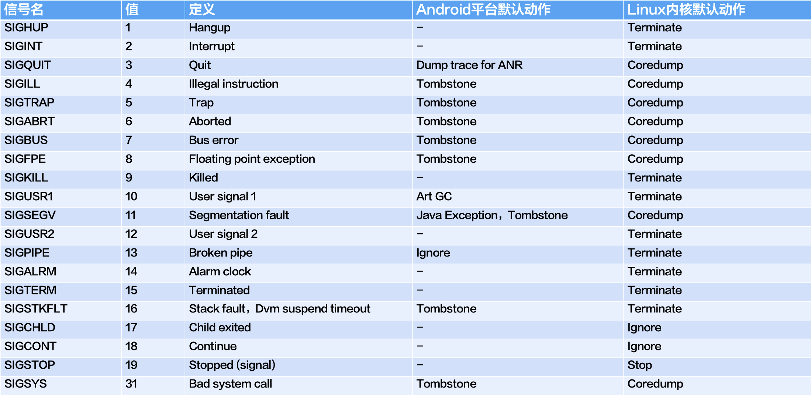

当应用程序出现异常后，异常检测代码或者异常检测模块会根据异常类型将对应的信号发送给出现异常的进程或者线程。

### 信号的发送

每个线程在内核空间中都有一个独立的信号队列(sigqueue)，每个进程又有一个共享的信号队列。

1. 发送给线程的信号是存储在线程的信号队列中；
2. 发送给进程的信号是存储在进程的共享队列中。


软件异常都是在用户态下产生的，用户态下有如下几种发送信号的方式：

1. **调用系统调用**进入到内核态后，将特定信号(如SIGABRT、SIGSTKFLT)发送给指定进程和线程的信号队列中
2. **利用特殊的ARM指令(如udf、bkpt)触发CPU异常**，在内核CPU异常处理流程中，利用内核信号相关函数，将信号发送给当前线程的信号队列中


硬件异常通常指的是CPU异常，它的异常处理流程在内核态下利用内核信号相关函数，将信号发送给**当前线程**的信号队列中。

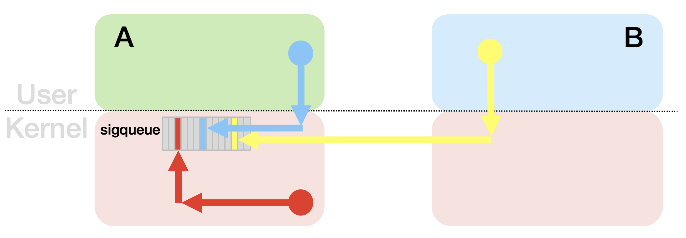

上图中：

1. 蓝色是同进程用户态的信号发送流程
2. 黄色是不同进程间的用户态信号发送流程
3. 红色是CPU异常相关的信号处理流程


总结下来，发送信号途径有系统调用和CPU异常两种方式。

### 系统调用

发送信号相关的系统调用有如下几种：

1. 发给进程
   1. __NR_kill
   2. ___NR_rt_sigqueueinfo
2. 发给线程
   1. __NR_tgkill
   2. __NR_rt_tgsigqueueinfo

kill类系统调用只能发信号值(Signal Number)，sigqueueinfo类能发送更多信号相关的信息。

此外，安卓平台也提供很多发送信号的系统库函数：

| 系统库函数                                                   | 依赖系统调用       | 目标     |
| ------------------------------------------------------------ | ------------------ | -------- |
| int kill(pid_t pid, int signo);                              | __NR_kill          | 指定进程 |
| int tgkill(int tgid, int tid, int sig);                      | __NR_tgkill        | 指定线程 |
| int raise(int signo);                                        | __NR_tgkill        | 本线程   |
| void abort(void);                                            | __NR_tgkill        | 本线程   |
| void __assert(const char * file, int line, const char * msg); | __NR_tgkill        | 本线程   |
| void __assert2(const char * file, int line, const char * func, const char * msg); | __NR_tgkill        | 本线程   |
| int pthread_kill(pthread_t pthread, int signo);              | __NR_tgkill        | 本线程   |
| void __android_log_assert(const char *cond, const char *tag, const char *fmt, ...); | __NR_tgkill        | 本线程   |
| int sigqueue(pid_t pid, int signo, const sigval value);      | ___rt_sigqueueinfo | 指定进程 |
| int ___rt_sigqueueinfo(pid_t pid, int signo, siginfo_t* siginfo); | ___rt_sigqueueinfo | 指定进程 |

### CPU 异常

#### CPU 运行（异常）模式

ARM CPU有如下 7 种运行模式：USER、SYS、SVC、ABORT、UNDEF、IRQ、FIQ：

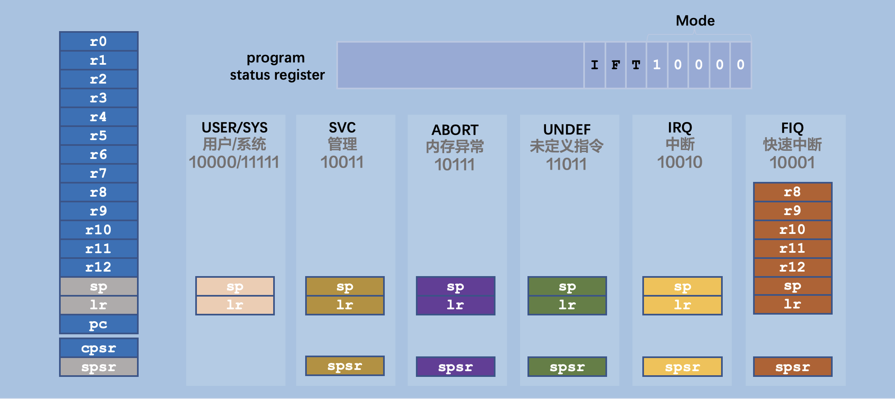

其中：

- 用户态代码是运行在USER模式
- 内核态代码在正常情况下(系统调用)运行在SVC模式
- CPU异常是运行在ABORT模式和UNDEF模式
- 中断是在IRQ模式
- SYS模式用的很少
- FIQ没有被启用

每个模式间是通过CPU的向量表及其对应的异常处理流程转换模式的：

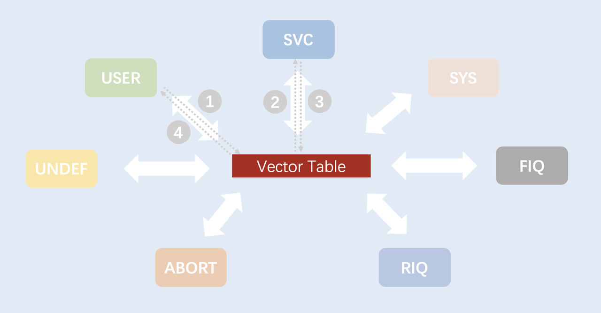

如上图中的1 -> 2 -> 3 -> 4 是用户态调用一个系统调用的流程。

异常向量表及其异常处理流程做的事情有

1. 保存寄存器上下文，并切换CPU模式
2. 跳转到异常对应的异常处理函数
3. 还原寄存器和CPU模式


异常向量表中存储的是每种异常的异常处理函数的地址，下图中的Offset就是异常处理函数在向量表中的偏移，CPU遇到异常时直接跳转到向量表，执行对应的异常处理函数：

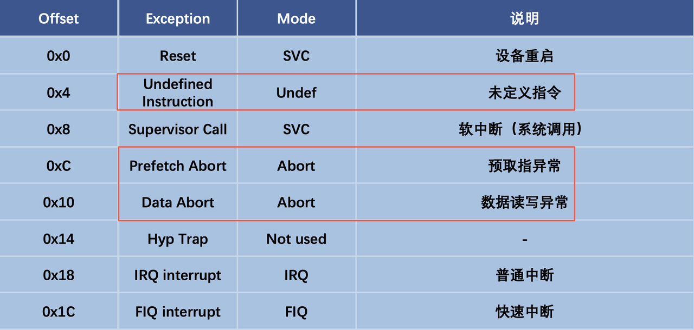

更多ARM架构相关的内容请参考： https://zh.wikipedia.org/wiki/ARM%E6%9E%B6%E6%A7%8B

#### CPU 异常处理函数

Native崩溃信号相关的CPU异常和对应的异常处理函数如下：

| **CPU异常**           | **异常处理函数** |
| --------------------- | ---------------- |
| Data Abort            | do_DataAbort     |
| Prefetch Abort        | do_PrefetchAbort |
| Undefined Instruction | do_undefinstr    |

这三个异常处理函数做的事情都类似：

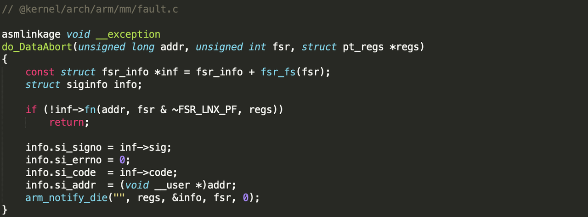

.png)

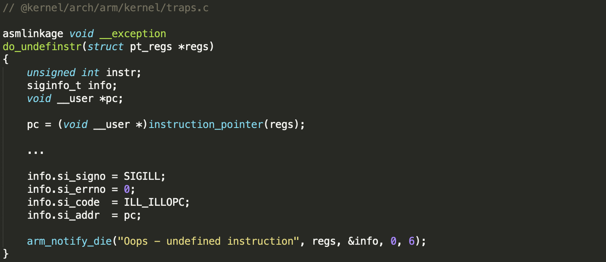

都是先构造signal info，不同的异常用不同的信号，然后调用arm_notify_die()将信号发送给当前线程：

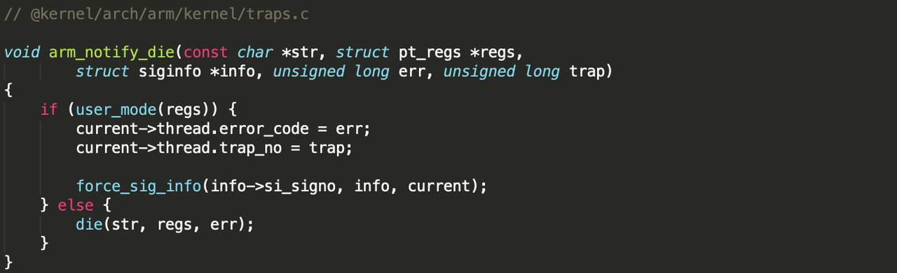

内核中的force_sig_info()函数用于给指定线程发送信号。

### Undef异常

CPU无法识别正在执行的指令时会触发Undefined Instruction异常，它的signo和sicode是SIGILL和ILL_ILLOPC。ARM/Thumb指令集中的udf指令也会触发Undefined Instruction异常。

> 注意，信号是按信号名或者信号值分类，每个信号又可以按sigcode是分成若干子类，后面可以看到很多信号都有多个子类。

### Data Abort异常

CPU在访问内存数据时产生的Abort异常，寄存器DFSR(Data Fault Status Register)中记录当前异常相关信息。DFSR中的异常信息包含当前异常的异常号，根据这个异常号，可以从fsr_info表中找到对应的异常处理函数和相关signo和sigcode。

-20240403102546513.(null))

最常见的是缺页异常(page translation fault)，是MMU把虚拟地址转换成物理地址时产生的：

-20240403102546639.(null))

#### **缺页异常**

Linux虚拟内存采用延迟加载模式，内存访问分为映射和加载两个步骤。映射只是在地址空间中划分一段区域，当真正访问地址时，如果CPU发现对应的物理页还未加载，就会触发Abort异常，并在异常处理流程中触发缺页异常流程，缺页异常流程再去分配物理页，并为其加载对应数据。


地址访问有两种情况：

- 读取指令：CPU在指令执行前，预先从PC寄存器指向的内存地址中读取指令，这个过程叫预取指
- 数据访问：执行内存访问相关的指令，如ldr、str等


do_page_fault()是缺页异常的处理函数：

-20240403102546571.(null))

它会根据__do_page_fault()的返回值，确定是否要发送信号以及具体发送哪类信号。如果需要发送信号，就会调用__do_user_fault()函数将对应的信号发送给当前线程：

)


__do_page_fault()代码如下：

-20240403102546629.(null))

用户态映射的每一段内存对应内核里的一个vma，这里先通过find_vma()查找匹配的vma。

1. 找不到vma说明该地址并未映射到当前进程的地址空间中，直接返回VM_FAULT_BADMAP。
2. 接下来判断当前地址访问操作是否符合vma的访问权限限制，不符合就返VM_FAULT_BADACCESS。
3. 如果前两个判断都通过，就会调用handle_mm_fault()分配物理页和加载数据。当访问的地址是文件映射时，加载数据时有可能会出错：
   1. 文件系统查找文件时出错，常见于访问sdcard中的文件时
   2. 当前访问的文件偏移超出了文件的长度，常见于多线程多进程访问同一个文件时

​     这个时候handle_mm_fault()就会返回VM_FAULT_SIGBUS


__do_page_fault()返回错误，根据错误类型do_page_fault()就会给当前线程发送对应信号。

| **fault**          | **signo** | **sigcode** |
| ------------------ | --------- | ----------- |
| VM_FAULT_BADMAP    | SIGSEGV   | SEGV_MAPERR |
| VM_FAULT_BADACCESS | SIGSEGV   | SEGV_ACCERR |
| VM_FAULT_SIGBUS    | SIGBUS    | BUS_ADRERR  |

#### **对齐异常**

CPU异常的处理函数是可以动态注册的方式修改fsr_info表中的异常处理函数和相关signo和sigcode。

例如地址对齐类异常：

-20240403102546615.(null))

当前访问的内存地址不满足指令的对齐要求时，就会触发do_DataAbort()，接着会执行do_alignment()

-20240403102546721.(null))

出现这类异常，会给当前线程发送BUS_ADRALN类型的SIGBUS


### Prefetch Abort异常

CPU在预取指失败时时产生的Abort异常。寄存器IFSR(Instruction Fault Status Register)中记录当前异常相关信息。IFSR中的异常信息包含当前异常的异常号，根据这个异常号，可以从ifsr_info表中找到对应的异常处理函数和相关signo和sigcode。

ifsr_info的定义类似fsr_info：

-20240403102546758.(null))

#### 缺页异常

同Data Abort异常中的缺页异常

#### **断点指令**

ARM的bkpt指令用于触发程序断点，当CPU读取指令时发现是bkpt指令，就会触发Prefetch Abort，它的异常号是2，默认处理函数是do_bad()，相关信号是SIGBUS。

-20240403102546815.(null))

但内核初始化时会将异常处理函数hw_breakpoint_pending()、SIGTRAP和TRAP_HWBKPT(64位内核是TRAP_BRKPT)注册到ifsr_info数组中的FAULT_CODE_DEBUG(2)位置中。

-20240403102546834.(null))

hw_breakpoint_pending()返回1，因此do_PrefetchAbort()会将SIGTRAP和对应sigcode发给当先线程：

-20240403102546848.(null))

### 小结

CPU异常及对应的信号：

| CPU异常               | 异常子类    | signo      | sigcode     |
| --------------------- | ----------- | ---------- | ----------- |
| Data Abort            | 缺页异常    | SIGSEGV    | SEGV_MAPERR |
| SIGSEGV               | SEGV_ACCERR |            |             |
| SIGBUS                | BUS_ADRERR  |            |             |
| 对齐异常              | SIGBUS      | BUS_ADRALN |             |
| Prefetch Abort        | 缺页异常    | SIGSEGV    | SEGV_MAPERR |
| SIGSEGV               | SEGV_ACCERR |            |             |
| SIGBUS                | BUS_ADRERR  |            |             |
| 断点指令              | SIGTRAP     | TRAP_BRKPT |             |
| SIGTRAP               | TRAP_HWBKPT |            |             |
| Undefined Instruction | 未定义指令  | SIGILL     | ILL_ILLOPC  |

## Native崩溃的调试信息

### 信号的处理流程

#### 信号处理线程

**发给指定线程时**

发送信号的函数会将信号放入目标线程的信号队列中，并且唤醒目标线程，使其能执行信号处理流程。


**发送给进程时**

发送信号的函数会将信号放入目标进程的共享信号队列中，并且唤醒一个合适的线程（有筛选逻辑），使其能执行信号处理流程。

#### 信号处理时机

信号是异步通信机制，线程会以CPU异常、中断、系统调用等方式进入内核态，很多时候线程会在内核态进入睡眠，所以发送信号的流程需要唤醒目标线程。在被唤醒或者执行完内核任务后，在返回用户态前，线程会检查自己和进程共享信号队列，如果有待处理的信号就去处理信号。

-20240403112441543.(null))

#### 用户态信号处理函数

可以通过sigaction()或者signal()系统函数，给特定信号注册用户态信号处理函数。当线程从内核态返回到用户态前，如果信号队列中有信号且该信号注册了用户态信号处理函数，则会调用用户态信号处理函数，如上图中的黄色部分。


用户态信号处理函数常用于收集异常相关的信息。比如安卓平台的Tombstone和NPTH的Native异常信息，因此可能会有多个模块需要注册信号处理函数。不过内核只会保存最后一个注册的信号处理函数，为了不影响前面注册的信号处理函数，后面注册的信号处理函数必须要保存前面注册的信号处理函数的信息。系统函数sigaction()不仅能注册新的信号处理函数，也能返回之前的信号处理函数。

-20240403112441648.(null))


为了能够继续调用其他的信号处理函数，用户态信号处理函数结束前，需要再次调用sigaction()函数，设置之前保存的信号处理函数。并且再次通过tgkill()、tgsigqueue()等函数给当前线程发送同样的信号，这样就能开始新的信号处理流程。


如果希望执行内核态信号处理流程，则需要调用`signal(signo, SIG_DFL)`，将信号处理函数设置成SIG_DFL，这样相当于是没有用户态的信号处理函数了，此后当有新的信号就会进入内核态信号处理流程。

#### 内核态信号处理流程

Linux内核中每个信号都有默认的处理动作，最常见的是terminate和coredump，还有少量信号的默认动作是ignore、stop、continue等。

- `terminate`：退出进程
- `coredump`：将进程用户态内存和各线程的CPU信息dump到文件中，结束后也会退出进程
- `ignore`：忽略，啥都不做
- `stop`：停止进程，常用于调试
- `continue`：让进程从stop状态恢复到正常状态


各信号的Linux内核默认动作如下：

-20240403112442087-2114682.(null))

### 崩溃的调试信息

#### 可调试信号

大部分信号的默认处理是Terminate或者是Coredump。但只有部分信号是异常相关且需要Coredump，这类信号被称作可调试信号，对于Android来说，也只会去监控可调试信号。

所以Android上的Native崩溃说是的下图中绿色标注的8种可调试信号相关的异常。

-20240403144145359.(null))

#### Linux的调试信息

Linux提供了Coredump机制用于分析Native崩溃。Coredump将进程退出前的CPU寄存器信息和内存信息保存到文件中，工程师可通过GDB等工具离线加载Coredump文件，还原到应用崩溃前的状态进行调试。

Linux下Coredump默认是关闭的，需要用Coredump需要开启一些调试开关。网上有很多Coredump相关文档，这里就不细说了。

**Coredump 是分析此类问题的终极手段**。

#### Android的调试信息

Coredump需要导出的信息太多，有安全隐私风险，手机在发行时会关闭该功能。Android为了调试Native崩溃，提供了Tombstone抓取机制。Tombstone文件大致和Coredump类似，只是打印了少量栈和寄存器附近的内存，如下图：

-20240403112441951-2114681.(null))

主要有如下信息：

1. 进程pid、线程tid、线程名、进程名
2. 信号值，信号子类、崩溃地址
3. Abort message
4. CPU寄存器
5. 调用栈
6. 栈附近的内存
7. 寄存器附近的内存

通过上述信息，我们就可以对崩溃进行详细的分析。

# Native崩溃的分析方法


上一章讲到Native崩溃相关的可调试信号有8种，在某APP上这8种可调试信号崩溃的分布如下：

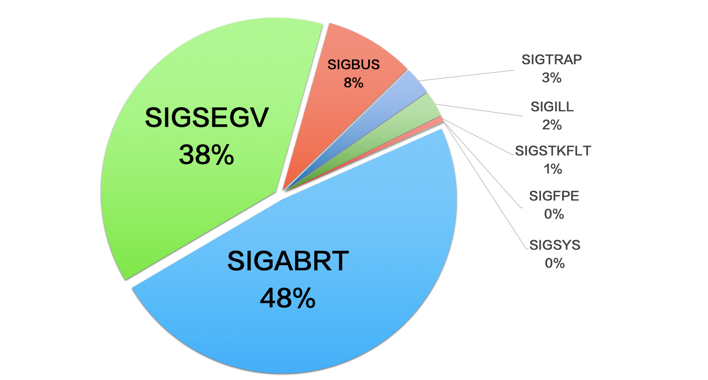


下面按异常占比多少，依次介绍每种信号及其分析方法。

## 1.SIGABRT

当用户态的Native代码在运行过程中发现了某些状态异常，就会给自己（线程）发送信号触发自杀流程。

### 1.1 异常流程

-20240403144611518.(null))

如上面代码，当系统因内存不足无法分配buffer，代码就选择了调用LOG_ALWAYS_FATAL宏函数，这个宏展开后其实是LOG模块的一个接口__android_log_assert()


这个__android_log_assert()函数做三件事情：

1. 将异常信息写入系统日志
2. 将异常信息写入Abort Message中
3. 触发abort()，在abort()流程中给自己发SIGABRT


下面看详细代码：

-20240403144611361.(null))

其中__android_log_write(ANDROID_LOG_FATAL, tag, buf)负责完成上面的1和2

-20240403144611463.(null))

其中：

android_set_abort_message()将异常信息写入一个单独的内存页中，系统在生成tombstone时把这块内存段中的abort message给取出来写入到tombstone中。NPTH也实现了类似功能[APP抓取Abort Message方案](https://bytedance.feishu.cn/docs/doccnJ3aw3BeT2JVOwAcUz)，所以我们Slardar上的也能看到abort message。


write_to_log()会将日志写入到系统日志中，这里就不继续展开了。


接下来看一下abort()的实现（Android 8.0）：

-20240403144611474.(null))

这里先获取pid和tid，然后用tgkill()系统调用将SIGABRT信号发到当前线程的信号队列中。


用户态发送信号一般用两种系统调用：

1. tgkill一般用于将信号发送到特定线程的信号队列中
2. kill一般用于将信号到进程共享信号队列中


当tgkill返回用户态前，就会check到自己的信号队列里有SIGABRT信号，就会去执行SIGABRT的信号处理函数，也就会经过NPTH信号处理流程->Linker信号处理流程(Tombstone)->Linux内核信号处理流程，最终会在内核态执行进程的退出。所以abort()函数的最后一句_exit(127)一般是执行不到的。


因此，在收到并处理SIGABRT信号时，线程的用户态调用栈就定格在tgkill()：

-20240403144611508.(null))


另外一个需要注意的是，abort message是安卓日志系统的一种调试机制，和abort()系统库函数没什么关系，如果代码中直接调用abort()函数，就不会有abort message。因此会有部分SIGABRT类异常是没有abort message的。

下面看一下几种比较常见的SIGABRT

### 1.2 虚拟内存泄漏

32位APP的地址空间只有4GB，因此程序运行过程中内存用的多了容易引起OOM。64位APP地址空间几乎无限大，基本不存在OOM的问题，所以下面我们只讨论32位APP。


**进程地址空间**

进程地址空间分用户态和内核态，在32位设备上用户态占用0～3GB（`0x00000000-0xbfffffff`）范围，内核态占3～4GB（`0xc0000000-0xffffffff`）范围。


我们可以通过进程map表(/proc/self/maps节点)查看用户态的地址空间分布：

-20240403144611629.(null))

从上图中可以看到，除了最高地址的异常向量表外，用户态地址空间最多涨到了`0xb*******`。


64位设备有所区别，因为64位设备中的内核是64位的，因此需要64位地址空间，因此32位地址空间的高1G的部分就可以划给用户态用了，因此64位设备下的APP拥有几乎4G的地址空间，如下图：

-20240403145330105.(null))


**判断内存泄漏异常**

我们可以通过获取崩溃时的虚拟内存大小，就知道是否有内存泄漏。内存大小可以通过解析map表计算，但线上更高效的方法是读取进程/proc/self/status节点，该节点中里面有VmPeak和VmSize字段。VmPeak表示进程虚拟内存大小的峰值，VmSize是当前虚拟内存大小。NPTH崩溃时抓取这个信息，因此Slardar上可以直接查看：

-20240403144611809.(null))

由于可能会存在内存碎片，所以一般虚拟内存大小在2.8GB(32位)或者3.8GB(64位)左右时容易出现内存申请不到的情况。


**内存泄漏关键字**

另外，因为是SIGABRT类型，虚拟内存泄漏也有常见的Abort Message关键字：

- Out of memory
- Failed to map PBO
- failed to allocate TLS


具体如下：

-20240403144611797.(null))

可以在搜索框搜索这些关键字，就可以列出所有匹配到异常。


**Maps归类分析**

确定内存泄漏后我们可以通过分析maps查看详细的内存分布，一些平台提供了针对 maps 的排序、过滤、求和等功能，但因为内存段数实在太多（几千个），因此也提供了自动Maps归类功能：

-20240403145707509.(null))

上图中可以明显能发现stack区域过大，都达到了1.63GB。一个线程栈的大小大致是1MB，因此可以推断当前进程中有1600+个线程。一般一个大的APP中的线程数量在200～300个左右，所以可以肯定的是线程泄漏了。这个时候就要去查看线程相关信息：

-20240403144611787.(null))

可以看到线程数量是1612，随便下拉滚动条，很容易就发现是OkHttp Dispatch的线程。

用线程名搜索确定有1493个OkHttp Dispatch的线程泄漏：

-20240403144611896.(null))


另外，Maps归类分析中也能发现其他一些问题，比如

1. Native Heap有点大
2. Other中的"---p"内存段过大
3. Other中的"wr-p"内存段过大

### 1.3文件描述符泄漏

Linux下皆是文件，文件在Linux操作系统中应用广泛，在Android上也是有大量功能是基于文件实现的。用户态操作文件，首先需要打开目标文件获取文件描述符(file descriptor)，文件描述符又叫做文件句柄。文件句柄是一个int类型的数，从0开始递增。文件句柄在内核中关联着文件相关的数据结构，因此Linux对进程打开的文件数量有限制， 在安卓低版本中这个限制是1024个，在高版本中增加到了32768个。


当进程的文件句柄个数达到上限时，打开文件操作就会失败，如果正在打开的是关键的文件，那程序可额能就会选择abort，如：

-20240403144612121.(null))

上面的Looper构造函数中，eventfd()返回的是用于唤醒线程的文件句柄。如果这个文件句柄获取失败，那Looper就跑不起来，因此程序只能选择abort。对应的崩溃信息如下：

-20240403144612055.(null))

当文件句柄达到上限时，系统调用会失败，并且会返回Too many open files类型的错误。因此我们可以在abort message中看到这个关键字。


既然是文件句柄泄漏，那我们只需要把所有文件句柄给列出来就行了，如下图：

-20240403144612101.(null))


文件句柄列表可以详细的查看每个文件的路径，也支持关键字搜索。但1000多个文件句柄查起来还是比较麻烦，因此我们也开发了FD归类分析功能，直接看这个就可以了。

-20240403144612138.(null))

从FD归类分析中很容易发现是apk文件打开过多。这种问题比较常见，很多业务会用扫描APK安装List，如果用户APK过多就容易产生这种异常。


从文件句柄列表可以看到，在崩溃前打开的文件都是APK，因此崩溃时也很可能正在做打开APK的操作，这个操作很可能也会吐出错误日志，因此我们可以查看崩溃时间点附近的Logcat信息：

-20240403144612301.(null))

从Logcat中可以看到，应该是usergrowth在循环遍历APK，找到对应代码修复即可。


小提示：

1. 如果循环体内有文件打开操作，那必须保证进行下一轮循环之前关闭文件
2. 打开的文件如果不再使用了，需要及时关闭。


### 1.4 虚拟机异常

虚拟机异常有很多种，下面列出了几个常见类型：

#### **Thread suspend timeout**

-20240403144612100.(null))

虚拟机在做GC或者Trim Java堆的时候需要挂起所有的Java线程。当挂起操作在规定时间（30秒）内无法完成时，虚拟机就会采取这类abort措施。这种异常常见于5.0和6.0的art虚拟机上，因为这个版本的虚拟机的Suspend流程有个缺陷。具体问题和解决方案可参考[ART虚拟机Thread suspend timeout问题](https://bytedance.feishu.cn/docs/doccnYXgBMs6Jl2zsSx9KvDqWpg#sgaR7s)


#### **local reference table overflow** 

我们知道Java对象是通过对象之间的引用链来保证不被GC回收，而JNI层创建的Java对象因为没有被任何Java对象引用，因此一旦有GC就会被释放。为此虚拟机在JNI层创建Java对象的同时，会把该Java对象加入Local Reference Table中，这样就不会被GC释放了。如JNI创建一个String对象时：

-20240403144612090.(null))

可见，在string对象创建同时，就被加入到了Local Reference Table。这个table是线程局部数据，且有512个的数量上限，每个线程独立维护着自己的Local Reference Table，一旦一个线程的Local Reference Table中的对象的数量超过了512个，那就会触发如下异常：

-20240403144612331.(null))

那什么时候会把Local Reference Table中清除掉呢？

有两种方法：

1. 代码中显式地调用DeleteLocalRef清除引用

-20240403144612277.(null))

1. JNI调用返回时虚拟机会清除当次JNI调用过程中产生的所有Local Reference。

-20240403144612289.(null))

这个机制稍微有点复杂，这里就不展开讨论了。


既然虚拟机会自动清除Local Reference，那为什么会有Local Reference Table的溢出问题呢？原因很简单，就是单次JNI调用中创建并未清除的Reference超过了512个。因此这个异常和崩溃时的调用栈有必然的关系，也就是说这个异常肯定和当前调用栈里的JNI函数有关，一般是循环或者递归中产生大量Local Reference。所以发现这类异常，只要排查调用栈肯定能找到问题点。另外虚拟机也会在这类异常发生时，将Local Reference Table中的部分信息输出到Logcat中。因此通过这两个信息我们很容易就能定位问题。


另外，如果是非JNI方法中创建了Local Reference，因为它返回时不会执行到JniMehodEnd()，需要手动调用DeleteLocalRef()。


一般产生这类问题有两种原因：

1. JNI代码中的循环体中创建Java对象，且未及时释放http://t.wtturl.cn/W5juY7/

-20240403144612478-2126772.(null))

这个例子中，红框部分很显然是有个循环（decodeMap->decodeOneMap），再加上Logcat的信息：

-20240403144612407.(null))

虚拟机打印的Local Reference Table中的最后10个引用，明显是有重复的，最后Summary的信息中显示所有的reference都是String类型的，因此极有可能512个都是和最后10个一样的重复性数据。


另外decodeOneMap()的下一帧函数刚好也是CodeInputData类的方法，和Logcat中重复的String对象一致，也能说明问题。由于没有源码，就不再继续分析了。


1. 有多层递归JNI调用，每层有部分未释放的对象 http://t.wtturl.cn/W5MuPt/

-20240403144612546.(null))

这个问题的Java调用栈有512行，一直重复着上面列出来的一串函数调用。只要中间有JNI调用，即使只有少量的reference未被释放，但重复的次数多了也很容易突破512个


1. Native线程反射调用java时，http://t.wtturl.cn/o4P7PF/

因为不是从Java调用到Native，所以函数退出时不会有JniMethodEnd()函数，也就不会有清理LocalReference的动作，Local Reference会一直累计，最终会导致超过阈值崩溃。

案例：[GameService native crash之local reference table overflow](https://bytedance.feishu.cn/docs/doccnhgb7pdwagYV1AXnKbutXvF#) 


小提示：

1. JNI代码中的循环体中申请的Java对象，要及时调用DeleteLocalRef清除引用。
2. 及时清除引用是良好的编程习惯，不仅仅是循环体内
3. 这类异常是送分题，很容易解。


#### **java.lang.OutOfMemoryError**

-20240403144612617.(null))

http://t.wtturl.cn/W5dnEC/


这类异常其实是Java的OOM，出现OOM异常时系统或者NPTH会尝试去收集调用栈等异常信息。而收集异常信息本身也需要用到Java内存，会执行如上调用栈中的alloc流程，当alloc流程无法申请到内存，且发现自己本身就在OOM异常处理流程中时，就直接触发abort流程，如下图：

-20240403144612478.(null))

Java的OOM问题需要通过hpof等信息去分析，用Native的信息是无法准确定位的，Java调用栈通常也抓不到，所以这类问题是没有分析的必要。当然遇到某些极端case，需要抓取Java调用栈时，可以用特殊版本的NPTH[Android Native系列：Native层获取Java异常调用栈的方法](https://bytedance.feishu.cn/docs/doccn1s3woQvmGpvbvIN9Qs9O6d) 。


小提示：

1. 发现Java OOM问题，优先去查同版本的Java异常，Native问题可以直接忽略。

### 1.5 堆内存破坏


-20240403144612579.(null))

C/C++程序中调用malloc，系统堆管理模块（dlmalloc、jemalloc）会根据申请的内存大小，在系统空闲堆内存中找到一个合适的空闲块，返回给调用者。在这个过程中如果发现堆的结构被破坏了，堆管理模块会主动报abort。当然free时也会做检查，所以经常能看到malloc和free时出现SIGABRT。野指针、越界、重复释放等常见问题都会引起堆破坏，


Native堆破坏是最常见也是最难解决的一类问题。

C/C++开发过程中的，这类问题的难点是：

1. 内存破坏不会马上引起崩溃，有一定的滞后性
2. 崩溃的模块往往是受害者，加害者很可能逃之夭夭了。
3. 受害模块随机，异常类型也随机（很多时候是SIGSEGV、SIGILL等异常）
4. 信息少，因为只有地址和一小部分内存信息，很难找到线索


虽然有这么多难处，但并不是无法解决的，我们还是有很多成功案例：

[Android Native系列：ttmplayer double free 问题](https://bytedance.feishu.cn/docs/doccnAu3WkDahhILWyn05N2kUgd#) 

[Android Native系列：TTmplayer use-after-free问题调查分析](https://bytedance.feishu.cn/docs/doccnEyRtyX4muLtOOdPkkSOnqe) 

[Android Native系列：10.25西瓜头条线上Native崩溃问题分析报告](https://bytedance.feishu.cn/docs/doccnh8q2EkLbgQuTNfNBJqAzqc) 

[Android Native系列：alog内存越界导致的崩溃案例分析](https://bytedance.feishu.cn/docs/doccnJOEyrxFbYcqaHXjQc3tWWc) 

[Android Native系列：secsdk的内存越界问题分析](https://bytedance.feishu.cn/docs/doccns49nvSYy1p4dMUZTu9kAwg) 

[Android Native系列：ResTable野指针问题](https://bytedance.feishu.cn/docs/doccn4jXNXHcX6YnfnOXmpqChIg) 

[鲜时光Top1 NativeCrash问题分析](https://bytedance.feishu.cn/docs/doccn1p1vqRxdiVQ9Ki8qmbQJcd#) 


小提示：

1. 堆内存破坏是Native崩溃中最难的一类问题，初学者需要找有经验的同学一起分析。


## 2.SIGSEGV

SIGSEGV类错误出现在CPU的虚拟地址转换物理地址的过程，分两种不同情况。

- SEGV_MAPERR：当前执行的指令访问的内存地址未映射到当前进程地址空间
- SEGV_ACCERR：当前执行的指令访问的内存地址无访问权限(读、写、执行)


### 2.1 SEGV_MAPERR

#### **字符串溢出**

这类问题首先要确定当前执行的指令，这可以通过Tomstone文件获取。

-20240403144612655.(null))

http://t.wtturl.cn/WQL93M/


上图中的PC寄存器指向的`0xf0c732e8`是指令的地址，Tombstone中记录有PC附近的指令：

-20240403144612664.(null))

其中：

`f0c732e8`是指令的地址，调用栈显示崩溃的函数是strlen，这个函数是在/system/lib/libc.so中定义的，因此指令地址当然也是指向了/system/lib/libc.so中的程序段(r-xp)。

-20240403144612748.(null))

`c90c`是指令的机器码

`ldmia    r1!, {r2, r3}`是机器吗`c90c`对应的汇编代码，其中ldmia指令，r1、r2、r3是寄存器。

-20240403144612768.(null))

上面代码将寄存器r2、r3的值写入r1指向的地址中，同时增加r1的值。


回到tombstone头部位置，查看r1的值：

-20240403144612765.(null))

r1的值正是`0x5f80000`，和fault addr的值是一致的。崩溃的直接原因就是r1的值异常。


查看进程内存映射表(maps)，

-20240403144612802.(null))

发现`0xe5f80000`是内存段`0xe5f0000-0xe5f80000`的结束位置，和它的下一个内存段`0xe5f83000-0xe5f84000`有0x3000大小的gap。也就是说`0xe5f80000-0xe5f83000`这段空间是未被映射的，因此CPU异常处理流程触发SEGV_MAPERR类的SIGSEGV信号。


收集以下线索：

- 通过`f0c732e0`处的指令`mov r1, r0`我们知道r1的值是从r0赋值过来，
- 而r0的值是`0xe5f7e00`比当前r1的值小且地址合法
- 崩溃的函数strlen()，它只有1个参数，是字符串指针
- r0是strlen()的第一个参数（ATPCS规范）


综合上面线索，大概猜得出，strlen()函数在遍历字符串时出现崩溃。


查看r0附近的内存，看是否是字符串：

-20240403144612876.(null))

这个是功能会把寄存器附近的256个字节的内存值展示出来。最左边的是内存地址，中间的是内存值，最右边的是将中间的内存值格式化成字符串后的结果。由于当前r1值比r0值大512字节，这超出了展示范围，所以我们无法确定这个字符串后半部分的内容。


不过从常理推断这个json字符串很可能没有结束符，导致strlen()的越界访问。


从调用栈可知，strlen()是系统库libIVImageSR.so中的iv_gpgpu::GP_Manager::init()函数调用的。

-20240403144612864.(null))

查找同版本AOSP代码没发现这个函数，那很可能是厂商特有的问题。


查看机型分布：

-20240403144612946.(null))

确定是魅族机型特有问题，需跟厂商沟通解决，后面就不再分析了。


#### **空对象**

-20240403144612970.(null))

跟前面案例一样，先看PC附近的指令：

-20240403144612927.(null))

崩溃的指令是将r9寄存器的值写入sl寄存器为基地址，偏移8字节的内存中。因为这个时候的sl值是0，这里也就是当相当于写入x8这个内存地址，自然CPU报了SEGV_MAPERR异常。


由于tombstone打印的指令字节数有限（256个），这次pc附近的指令中并没有sl寄存器的赋值，这种时候我们就可以直接去so中查指令，具体步骤如下：


1. 下载带符号的so

因为最上层的调用栈是APP自己的so，而且so对应的栈帧也已经Retrace了。这表示Slardar上已经有这个so的符号表，我们可以直接从Slardar下载so的符号表：

-20240403144613048.(null))

-20240403144613023.(null))

这里顺便提一句，及时上传符号表能大大提升分析问题的效率，接入文档：[Android符号表自动上传](https://bytedance.feishu.cn/docs/doccnwZK5UEslHeObk7JztVJ2Gh#) 


1. 用objdump工具将so反汇编成arm汇编指令

objdump工具在ndk目录下，分32位和64位两种：

32位：android-ndk-r16b/toolchains/arm-linux-androideabi-4.9/prebuilt/darwin-x86_64/bin/arm-linux-androideabi-objdump


64位：android-ndk-r16b/toolchains/aarch64-linux-android-4.9/prebuilt/darwin-x86_64/bin/aarch64-linux-android-objdump


反汇编so的命令是：

```
objdump -D libxxx.so > out.txt
```


反汇编过程可能会很慢，需要耐心等待。


1. 从反汇编的文件中查找目标代码

从tombstone的调用栈我们看到，最高层栈帧的pc在so中的偏移是`76fb4`。

-20240403144613087.(null))

从反汇编的文件中，查找这`76fb4`地址：

-20240403144613154.(null))

可以看到反汇编文件中0x76fb4的指令和tombstone中的指令是一模一样的，而反汇编文件中可以看到当前这个函数的全部内容。


需要注意的是，反汇编文件中的函数名和tombstone中的函数名是有区别的，这是因为tombstone中的函数名是经过c++filt(与objdump同目录)工具转换过的。我们把反汇编文件中的函数名也用c++filt处理一下，就能得到和tombstone一样的函数名:


1. 逆向推导第00层

从反汇编文件中smash::attr::AttributePredictor::InitModel()方法的指令中发现，sl寄存器的值只有在函数开头从r0赋过值，后面就一直没改过。所以sl就是函数smash::attr::AttributePredictor::InitModel()中开头的r0值。


C/C++函数调用过程中，r0一般表示为

- C函数：第一个参数
- C++静态方法：第一个参数
- C++非静态方法：this指针


当前函数显然是C++中的方法，但还不清楚是静态的还是非静态的。通常看源码可以确定，但没有源码的情况下我们也可以通过指令来推算：

-20240403144613191.(null))

有两点可以证明当前方法是非静态的：

- `mov r8, r3`中r3值是有效数据，表示这个方法的参数应该是大于等于4个 （r0～R3都是参数），而当前方法中的参数列表中参数只有3个，那r0一定是this了
- `cmp r1, #1`中，r1是跟数字1做了比较，可见r1不可能是string，那只能是AttrModeType了，既然方法的第一个参数是r1，那r0一定是this了


也就是说smash::attr::AttributePredictor对象NULL了。


1. 逆向推导第01层

再看看这个函数的r0值是怎么来的，这个得看它的上一级方法：

-20240403144613225.(null))

第01层的PC是`75a90`，对应的方法是FS_AttrLoadModelFromBuff()。它也是函数入口把r0赋值给r4，又在`75a90`之前将r4赋给了r0。


这里有个问题点是`75a90`调用的是`76d68`，而不是第00层的`76d70`。


先看下`76d68`：

-20240403144613241.(null))

原来是`76d68`中，将r0值改成r0偏移196字节的对象的值，之后再调用了`76d70`。

因为这里没有保存bl或者blx的指令，所以调用栈中不会显示这一层调用。

`76d68`是smash::attr::AttributeSDK::init_model(AttrModelType, ... )

`76d70`是smash::attr::AttributePredictor::InitModel(AttrModelType, ...)


所以完整调用关系应该是：

-20240403144613281.(null))

也就是说，FS_AttrLoadModelFromBuff()传入的smash::attr::AttributeSDK类对象的某个smash::attr::AttributePredictor类型的成员是NULL，后面在smash::attr::AttributePredictor::InitModel()中，对smash::attr::AttributePredictor对象的某个成员赋值时，出现空指针异常，触发SIGSEGV了。


小提示：

1. SIGSEGV异常的关键信息是Tombstone
2. SIGSEGV异常首先要确认当前出错的指令及寄存器
3. 从寄存器附近的内存值找字符串往往是分析问题的关键
4. 如果tombstone中的指令不够分析，可以找对应的so，用objdump反汇编后查看
5. SIGSEGV的原因和堆破坏类似，通常是野指针、越界、重复释放等


相关案例：

[Android Native系列：ttmplayer double free 问题](https://bytedance.feishu.cn/docs/doccnAu3WkDahhILWyn05N2kUgd#) 

[Android Native系列：TTmplayer use-after-free问题调查分析](https://bytedance.feishu.cn/docs/doccnEyRtyX4muLtOOdPkkSOnqe) 

[Android Native系列：10.25西瓜头条线上Native崩溃问题分析报告](https://bytedance.feishu.cn/docs/doccnh8q2EkLbgQuTNfNBJqAzqc) 

[Android Native系列：alog内存越界导致的崩溃案例分析](https://bytedance.feishu.cn/docs/doccnJOEyrxFbYcqaHXjQc3tWWc) 

[Android Native系列：secsdk的内存越界问题分析](https://bytedance.feishu.cn/docs/doccns49nvSYy1p4dMUZTu9kAwg) 

[Android Native系列：ResTable野指针问题](https://bytedance.feishu.cn/docs/doccn4jXNXHcX6YnfnOXmpqChIg) 


#### **PC跑飞**

-20240403144613333.(null))

http://t.wtturl.cn/v5xjWm/

上面这个例子的调用栈比较特殊：

- \#01层是je_free()，
- \#00层是xxx_nativeSimilarityCreateHandle()

相当与je_free()调用了xxx_nativeSimilarityCreateHandle() ，这显然是不合理的，也就是说调用栈是错误的。出现这种栈回溯出错一般是程序(PC寄存器)跑飞或者栈(SP寄存器)被破坏。


还是先从PC附近指令开始查：

-20240403144613399.(null))

崩溃时，r4 = 0，所以fault addr = 0，发生SEG_MAPERR异常。


上图中的push指令是xxx_nativeSimilarityCreateHandle()的起始地址，函数开始处r4是从r0赋值过来的。也就是说r0值是0，即xxx_nativeSimilarityCreateHandle()的第一个参数是NULL。

-20240403144613421.(null))

看源码发现这个函数是jniEnv，一般只有native线程是jniEnv有可能会空，因此看了下崩溃时的java栈，发现崩溃线程是一个很正常的Java线程：

-20240403144613500.(null))

不过从上面调用栈中，也发现一个问题，崩溃时调用的Java的native函数是：xxx.nativePornClassifierReleaseeHandle()。与其对应的Native函数是：

-20240403144613458.(null))

这个函数只是调用了一个外部函数：PornClassifier_ReleaseHandle()，并没有对xxx_nativeSimilarityCreateHandle()的调用，那Native的调用栈是怎么来的呢？


源码看不出来，只能用objdump看汇编代码（具体操作方法参考前一节内容）：

-20240403144613477.(null))

xxx_nativePornClassifierReleaseHandle()中有一个很奇怪的指令：

在调用PornClassifier_ReleaseHandle()之前，将lr赋值为pc。这里pc的值是当前指令的地址+8的位置，刚好是xxx_nativeSimilarityCreateHandle()。所以当PornClassifier_ReleaseHandle()返回时，会跳转到

xxx_nativeSimilarityCreateHandle()，并最终崩溃在xxx_nativeSimilarityCreateHandle()中。


从上面的分析我们知道，虽然源码里xxx_nativePornClassifierReleaseHandle()没有调用xxx_nativeSimilarityCreateHandle()，但汇编中却会有跳转，很显然这是汇编代码生成错了。


那为什么汇编代码会生成错误的指令呢？仔细看源码，发现其实是源码写错了：

-20240403144613583.(null))

xxx_nativePornClassifierReleaseHandle()函数声明中是要返回jobject，但函数体中没有返回任何对象。可能因为有这种歧义，编译器生成了错误的指令，最终导致PC跑飞而崩溃。


解决返回值不匹配的问题后，生成的汇编指令如下：

-20240403144613503.(null))

这回就不会再崩溃了。


那为什么调用栈中的##01层有je_free()函数呢？


如下面汇编指令：

-20240403144613600.(null))

崩溃时的PC是指向`40ac4`，在函数开头，会用push指令将lr和其他通用寄存器存储在栈中。栈回溯其实就是通过查找栈中的lr，找到当前函数的返回地址，这样也就能找到是哪个函数在调用当前函数了。


所以崩溃时是的lr应该就是指向je_free()的，该地址可以从tombstone中的stack数据中查到：

-20240403144613614.(null))

其中push指令执行前sp = 0xaa677658

-20240403144613727.(null))

push指令执行后：

| sp     | 栈地址   | 寄存器 |
| ------ | -------- | ------ |
| push后 | aa677640 | r4     |
|        | aa677644 | r5     |
|        | aa677648 | r6     |
|        | aa67764c | sl     |
|        | aa677650 | fp     |
|        | aa677654 | lr     |
| push前 | aa677658 |        |

sub指令执行前sp = aa677640

-20240403144613696.(null))

aa677640：r4

sub指令执行后sp = aa677638


所以根据stack里地址aa677654的中的值ecc062d5就是lr的值。也就是说调用xxx_nativeSimilarityCreateHandle()之前，lr值是指向je_free()的。


再回顾一下调用xxx_nativeSimilarityCreateHandle()的指令：

-20240403144613477.(null))

调用xxx_nativeSimilarityCreateHandle()执行的函数是PornClassifier_ReleaseHandle()，它的汇编实现如下：

-20240403144613746.(null))

最后调用的是blx r1，里面可能还会继续修改lr，但目前不清楚是什么函数。直接看源码：

-20240403144613665.(null))

源码中可以看到，最后调用的是delete()，而delete()最终会调用free()来释放对象，而free()又会调用je_free()，je_free()再去调用它的子函数时，lr就成了je_free()中的某个地址。


所以调用xxx_nativeSimilarityCreateHandle()之前lr是je_free()。

另外从上面代码看到，PornClassifier_ReleaseHandle()返回前，也就是调用xxx_nativeSimilarityCreateHandle()之前，r0值是被赋为0，所以xxx_nativeSimilarityCreateHandle()的第一个参数jniEnv的值是NULL，最终导致崩溃。

### 2.2 SEGV_ACCERR

和SEGV_MAPERR一样，首先要确定当前执行的指令：

-20240403144613827.(null))

http://t.wtturl.cn/WXGCbb/


查看PC附近的汇编指令：

-20240403144613796.(null))

崩溃的指令是 `strb.w    sl, [r6, r2]`，其中：

- `strb.w`中str是store指令，把寄存器的值写入到内存中的意思，b表示操作的是1个字节，w表示指令是4字节的宽指令(因为strb指令也有2字节的，这里标示w便于区分)
- `sl`是r10寄存器的别名
- `[r6, r2]`中括号表示的是一个内存地址，其中是寄存器r6的值是基地址，寄存器r2是偏移地址。

所以，这条指令的做的是将sl寄存器中的1个字节写入r6为基地址，偏移为r2的内存中。

```
r6 = c2c0fb80
r2 = 00018056
```

因此:

`r6 + r2 = c2c0fb80 + 00018056 = c2c27bd6`，这个值就是fault addr了


我们再通过maps看下这个c2c27bd6所属的内存段：

-20240403144613848.(null))

这个内存段是apk的文件映射，是只读属性，所以写入这个内存地址时CPU就报出SEGV_ACCERR异常。


出错的地址是r6和r2相关，其中r6的值c2c0fb80是从下面这条指令得来的：

-20240403144613863.(null))

其中sp是当前栈顶的地址，#208是10进制表示的立即数，表示成16进制是0xd0，add指令将sp寄存器的值加上0xd0后赋值给r6寄存器。因此看起来r6是当前线程栈中的一个地址，所属内存段也符合线程栈的特点（参考[Android虚拟内存优化之精简线程栈](https://bytedance.feishu.cn/docs/doccn8pjzsrngS8Cn4Uz7nLcjKd)），加上r6附近的内存值看起来也没什么异常：

-20240403144613917.(null))

所以r6的地址应该是没问题的，它是栈空间中存放"no-cache"字符串的一个buffer。


再看看r2值00018056，它是下面这条指令得了来的

-20240403144613920.(null))

sub指令将r8值减去r5后赋给r2，因为是4字节的宽指令，因此sub后面也加了.w。


r8的值`e07e11a8`和r5值`e07c9152`都是Native堆空间内的地址，都是合法地址，无法判断谁对谁错：

-20240403144613955.(null))

接下来看看这两段内存中的值：

-20240403144614016.(null))

r5值指向字符串的一个地址，r8看不出来是什么。


再看看崩溃时的指令：

-20240403144613796.(null))

崩溃点的下一条指令是blx，这是函数跳转指令，这个函数的参数r0、r1分别是r6和r5，也就是两个字符串地址。第三个参数看起来是一个长度值，在执行blx前给r6字符串写入结束符时崩溃的。


综上，目前看起来是r8值是有问题的，但因为tombstone我们只会打印256个字节的指令，当前打印的内存中没有更多r8相关的线索，所以没法继续分析了。Slardar中翻了几个问题，字符串内容和上述情况一模一样，这个函数肯定有问题的，后续如果有符号表和源码应该能精确定位问题。


小提示：

1. 分析到崩溃原因后，需要根据附近的指令推导异常值是怎么传递过来的
2. 分析SIGSEGV异常时需要灵活运用Tombstone中的寄存器、内存、指令、调用栈等信息
3. 要熟练掌握add、sub、mov、str、ldr、blx等最基本的指令
4. 自研的动态库需要及时保存和上传符号表

## 3.SIGBUS

BUS原意为总线，SIGBUS异常很难和总线关联。它有两种完全不相关的类型：

- BUS_ADRALN：当前执行的指令访问的内存地址不符合指令的对齐规范
- BUS_ADRERR：当前执行的指令访问的文件映射地址的缺页异常错误

### 3.1 BUS_ADRALN

和SIGSEGV一样，首先通过Tomstone确定当前执行的指令：


http://t.wtturl.cn/WVNRM9/


查看PC附近的汇编指令：

-20240403144614064.(null))

崩溃的指令是将r1、r2的值写入到r0偏移120字节的内存地址中，这个地址就是fault addr：

```
r0 + 120 = 0xc558dbfe + 0x78 = 0xc558dc76
```


从map表中可以看到，0xc558dc76是映射到地址空间的堆内存范围内的地址，也有写权限：

-20240403144614499.(null))


但因为这个地址并非是4字节对齐的，CPU还是报了异常。不过并非所有的指令都对要求4字节对齐，ARM手册中描述如下：

-20240403144614183.(null))

大部分的内存读写指令LDR和STR指令是不需要地址对齐，只有少数不常用的指令有对齐要求。


线上的BUS_ADRERR错误都是类似特殊的指令：

-20240403144614150.(null))


这类异常通常是内存踩踏导致的偶现的随机问题，一般跟崩溃的调用栈无关。

发生问题的概率 = 随机内存踩踏概率 X 遇到特殊指令的概率，因此BUS_ADRALN类异常比较少见。加上崩溃现场很可能是被破坏的现场，分析意义不大，所以遇到这类异常可以降低优先级处理。


小提示：

1. 如果是小概率的问题，降低优先级处理


### 3.2 BUS_ADRERR

这类异常和文件的读写相关。

一般我们在C/C++代码中读文件有read和mmap两种方式：

-20240403144614201.(null))

两者区别是：

1. read需要栈或者堆内存保存文件内容，mmap是在地址空间分配独立的内存块
2. read需要一次读取完所需文件内容，mmap在读到buf内容时才会分配物理页，并把对应的文件内容读取到内存中
3. read需要内核态到用户态的内容拷贝，mmap不需要拷贝
4. read需要一直保持fd，mmap不需要保持fd


看起来mmap有很多优势，但它也有比较严重的缺陷。

先看下用mmap访问文件的流程：

1. mmap后虚拟地址空间中就有了一块虚拟内存，此时还没有为这个地址分配物理内存

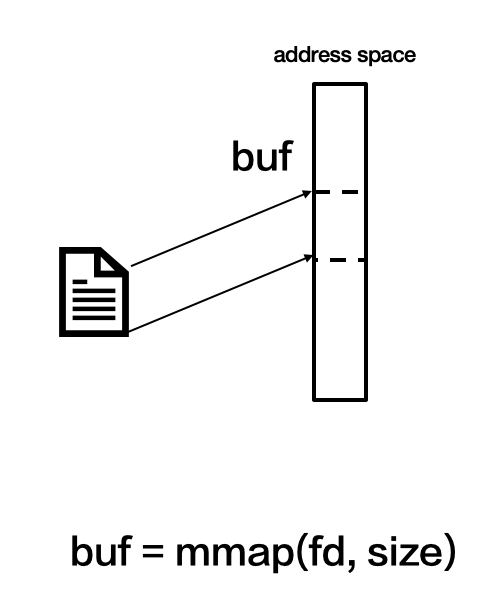

1. 当要读取buf内容时，CPU发现当前地址并未分配物理页，就会中断程序触发缺页异常

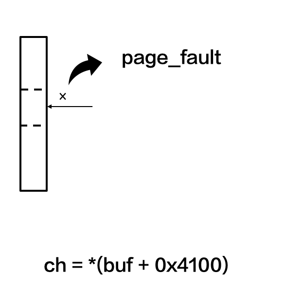

1. 缺页异常流程先分配一个物理页，再通过文件系统的接口将文件内容读到物理页中

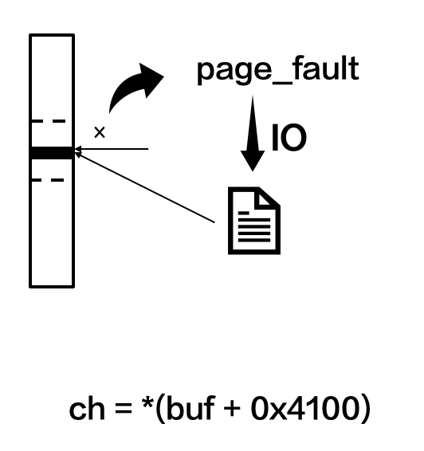

1. 缺页异常结束，程序继续运行


问题出现在第三部，当缺页异常流程通过文件系统接口去读取文件内容时可能会失败

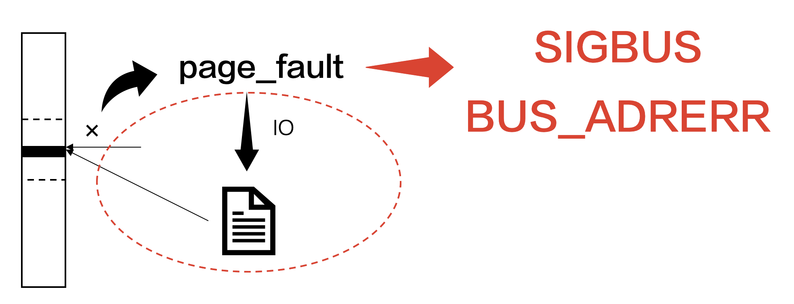

如果失败了，CPU就没法继续处理了，只能报BUS_ADRERR类的SIGBUS信号，杀死进程。


那什么情况下缺页异常流程会失败呢？常见的有如下两种情况：

1. mmap后文件被改小或者删除，导致虚拟地址对应的文件偏移超过了文件当前大小。情常见于多线程、多进程访问操作同一个文件时，如插件更新、数据库访问等。
2. FUSE文件系统bug导致的缺页异常流程读sdcard文件内容失败，常见于用fuse文件系统的特定rom（Android5.0～7.0）。


接下来看一下具体例子：

-20240403144614416.(null))


这类异常中的Tombstone中会多一个Crash message显示正在访问的文件相关的信息，比如路径，映射地址之类的，这个信息显然是从map表中获取的：

-20240403144614515.(null))


从路径可以看到当前被访问的文件是sdcard目录（/storage/emulate/0/）下的，我们应该避免用mmap方式访问sdcard路径下的文件。但从调用栈我们了解到这个文件访问其实是系统库做的，而系统库我们是改不了的。因此我们要做的是限制这类系统接口的使用，起码不能在主进程做这些操作。


再通过完整调用栈查看具体是哪个业务调用了这个系统接口：

Native调用栈：

-20240403144614478.(null))

Java调用栈：

-20240403144614539-2126774.(null))

com.ss.android.socialbase.appdownloader.AppDownloadUtils.isApkInstalled()这个函数在调用PackageManager接口去访问sdcard下的文件导致的崩溃。


解决方案是将这种有风险的函数调用逻辑放到子进程中。

小提示：

1. 尽量不要用mmap的方式访问sdcard中的文件
2. 尽量不要用mmap的方式访问多进程、多线程访问同一个文件

## 4.SIGTRAP

SIGTRAP是通过汇编指令bkpt触发CPU的预取指异常，并在内核态的在预取指异常处理函数中，给当前线程发送SIGTRAP信号，一般（也有少量例外）情况下：

- 64设备上是TRAP_BRKPT类型
- 32位设备上是TRAP_HWBKPT类型


bkpt指令常见于webview代码中的调试代码：

-20240403144614539.(null))


PC指向的指令就是bkpt：

-20240403144614606.(null))


这类异常基本上只有webview在用，类似SIGABRT是自杀式信号，相对SIGABRT有如下两个有点：

1. 调用链短，能更好的保存崩溃时的寄存器和内存值
2. 如果链接如GDB之类的调试器，可以将程序暂定方便调试


小提示：

1. SIGTRAP绝大部分是webview的问题
2. 系统webview问题APP侧很难解决，推荐使用字节跳动自研webview[Webview 稳定性/兼容性 相关汇总](https://bytedance.feishu.cn/docs/doccnwtElSMkVOk3Iqkj7himppb) 

## 5.SIGILL

当前执行的指令是CPU无法识别的非法指令时，会触发SIGILL信号。根据异常指令的来源分三种情况。

### 5.1 udf指令

arm汇编指令集中的udf指令是ARM CPU无法识别的，类似SIGABRT和SIGTRAP，常用于主动崩溃。

-20240403144614636.(null))

http://t.wtturl.cn/WgtrMD/

看PC附近的指令：

-20240403144614691.(null))

显然v8::base::OS::Abort()函数是通过udf指令实现了主动崩溃。

> 另外有些情况下编译器也会在代码中插入这类udf指令。

### 5.2 指令被破坏

通常是生成指令时（ROM or RAM的BIt位反转）出错，导致RAM或者ROM中的指令异常，当执行到这类被破坏的指令时触发SIGILL信号。这种硬件出错的概率很小，因此RAM出错一般只会崩溃一次，重新启动APP就恢复了。但一旦ROM里面的指令出错，重新启动APP也不会恢复，这类异常会导致单机反复重启。


看下面的例子：

-20240403144614705.(null))

这类指令被破坏的情况常见于dex、odex、oat、jit等动态生成指令。


还是先看PC附近的指令：

-20240403144614721.(null))

咋一看，PC指向的指令很正常，是常见的sub指令，那为啥CPU会报SIGILL呢？


熟悉ART的oat代码的同学应该能发现，当前PC指向的代码很像Java函数的入口地址的指令。正常的Java函数入口地址的指令如下：

-20240403144614708.(null))

黄色部分的指令是我们常见的函数入口的指令，其中第三行是跟通常C/C++函数一样，是在保存寄存器，第一行和第二行是ART的栈溢出检测机制。


**Java栈溢出检测的实现原理**

[Android虚拟内存优化之精简线程栈](https://bytedance.feishu.cn/docs/doccn8pjzsrngS8Cn4Uz7nLcjKd)中提到，Java线程有两个guard页，其中java stack guard页是用于Java栈溢出的检测。按通常的做法当前栈顶指针涨搭配java stack guard页，因为gaurd页没有访问权限，就会触发SIGSEGV SEGV_ACCERR信号。ART虚拟机的信号处理函数接收到这个信号后，就开始收集异常信息。但收集异常信息本身也需要用到栈空间，而这个时候栈已经到顶了，无法继续执行任何函数了。为了解决这个问题，ART虚拟机就为每个Java线程预留2个页大小的reserved页用于栈溢出后的异常信息的收集。为了reserved页不被占用，栈顶涨到reserved区域后就要产生栈溢出异常。因此每个函数入口就会做上面第一、第二行的检测：

第一步：SP减去0x2000，赋值给IP寄存器

第二步：从IP寄存器值指向的内存地址中读取一个字，写入IP寄存器（其实就是看地址能不能读）

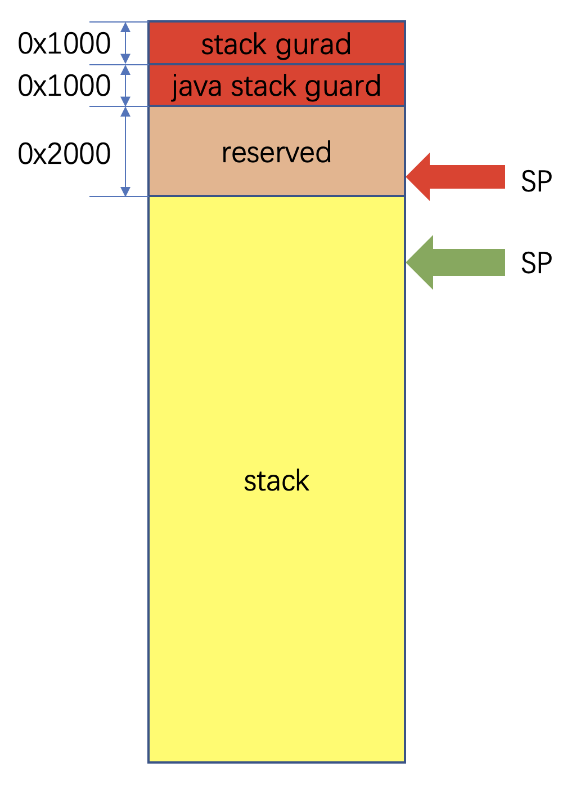

因此，检测代码必须是检测SP寄存器，但崩溃的指令是在检测PC寄存器，很可能指令是被破坏了。


那如何证明当前PC地址是函数入口地址呢？我们先假设当前PC是函数的入口地址，那LR寄存器指向的是调用当前这个Java函数的指令的下一条指令。我们看一下LR附近的指令：

-20240403144614810.(null))

LR指向的是thumb指令，因此LR中存储的是函数的返回地址+1，因此函数的返回地址是0xe2679edc，而它的上一条指令`blx  lr`就是调用Java函数的地方。而LR值是从上一条指令`ldr.w  lr, [r0, #36]`来的，是从r0指向的地址偏移36字节的地址中获取的。 查看r0附近的内存：

-20240403144614859.(null))

r0的值是0xef520fe8，偏移36个字节的地址中存放的是0xe2b51ae5，而崩溃时PC值是0xe2b51ae4，两着差1是因为当前pc指向的指令是thumb指令。


因此可以确定，当前PC指向的地址0xe2b51ae4确实是函数入口，那也就证明了指令被破坏的事实。


接下来的疑问是，为什么`subs.w    ip, pc, #8192 `指令会触发SIGILL？

解释这个疑问需要查ARM手册：

-20240403144614873.(null))

手册中写着，当sub.w指令的源寄存器编号是15，结果将不可预测(unpredictable)，这里的编号15的寄存器就是PC。


这下基本就确定是指令被破坏，但我们还不清楚是内存中的指令出错，还是odex文件中的指令被破坏。这个只需要看当前用户出现这个问题的频率即可，单点查询的结果如下：

-20240403144614977.(null))

看来是odex文件被破坏了，遇到这类问题只能卸载APP重新安装。


小提示：

1. odex、dex、oat、jit相对容易触发指令被破坏的SIGILL
2. 如果是单机反复崩溃问题，很可能是文件被破坏了

### 5.3 指令集错误

ARMv7架构下有ARM和Thumb两种指令集，BX、BLX等指令可以切换CPU指令集状态。同样一个机器码在两种指令集状态下被CPU解析成不同的指令，如果CPU的指令集状态和指令实际的指令集不符合时，CPU会错误地解析指令，会导致这类SIGILL异常。


**BL和BLX**

- BL 和 BLX 指令可将下一个指令的地址复制到 lr（r14，链接寄存器）中。
- BX 和 BLX 指令可将处理器的状态从 ARM 更改为 Thumb，或从 Thumb 更改为 ARM。
- BLX label 无论何种情况，始终会更改处理器的状态。
- BX Rm 和 BLX Rm 可从 Rm 的位 [0] 推算出目标状态：
  - 如果 Rm 的位 [0] 为 0，则处理器的状态会更改为（或保持在）ARM 状态
  - 如果 Rm 的位 [0] 为 1，则处理器的状态会更改为（或保持在）Thumb 状态。


**状态寄存器CPSR**

CPSR(Current Program Status Register) 的低8位（包括I、F、T和M[4：0]）称为控制位：

| 31   | 30   | 29   | 28   | 27～8 | 7    | 6    | 5    | 4    | 3    | 2    | 1    | 0    |
| ---- | ---- | ---- | ---- | ----- | ---- | ---- | ---- | ---- | ---- | ---- | ---- | ---- |
| N    | Z    | C    | V    | 保留  | I    | F    | T    | M4   | M3   | M2   | M1   | M0   |

几个控制位和它在用户态的值如下：

| **I**      | 屏蔽中断          | 0                    |
| ---------- | ----------------- | -------------------- |
| **F**      | 屏蔽快速中断      | 0                    |
| **T**      | CPU指令集状态     | 0表示ARM，1表示Thumb |
| **M0～M4** | CPU运行(异常)模式 | user：10000          |

因此，Tombstone中的CPSR[7:0]只有两种情况：`00110000`和`00010000`，也就是0x30和0x10。

因此CPSR的最低位是0x30或者0x10：

- 0x10表示当前指令是ARM
- 0x30表示当前指令是Thumb


下面看一下具体例子：

-20240403144614921.(null))

http://t.wtturl.cn/WGoa46/


首先看下PC附近的指令，当前CPSR是0x600d0010，是ARM指令因此Slardar是以ARM指令翻译的了机器码，看起来且杂乱无章，看起来是状态寄存器的T位不对。


我们可以通过objdump或者hex2arm[调试工具：hex2arm使用方法](https://bytedance.feishu.cn/docs/doccnfsLQXiYURgFwidtnOEEPpe) 工具将机器码强制转换成Thumb指令，但这个例子中的因为lr和pc只相差1且lr是基数，因此lr附近的指令是以Thumb指令集解析的：

-20240403144615014.(null))

可见，同一个组机器码，用ARM和Thumb指令集解析的结果截然不同。而且这里明显是用Thumb指令集解析的汇编指令看起来更像是正常的汇编代码。


接下来分析状态寄存器的T位出错，这需要完整的动态库so，好在libhelium.so的符号表已经上传到slardar上。通过`arm-linux-androideabi-objdump -D libhelium.so > libhelium.txt` 命令将libhelium.so反汇编生成libhelium.txt。


再从libhelium.txt中查看pc、lr附近的指令：

-20240403144615078.(null))

从lr值可以推断，崩溃前应该是执行过`blx 1b618 <coroutine_getcontext@plt>`，那会不会是这个函数返回的时候出错的呢？为此，查看了下coroutine_getcontext()的汇编代码：

-20240403144615102.(null))

果然里面是通过`bx lr`指令返回的，bx是有可能改变状态寄存器的T位。但仔细看的话能发现lr在这个函数里没变过，而且又有`mov r2, r9`，崩溃时的r2和r9并不相同，所以上述推论不成立。


再仔细看这个函数不难发现，是在保存当前CPU的R4～R14寄存器。这个就奇怪了，调用EGL接口，为啥还要保存CPU上下文？


这种操作源码中一般也是用汇编实现的，有保存就有还原，还原时直接操作寄存器，会不会有问题呢？


再去看看`ptDrawableEGL::makeCurrent()`完整实现，才发现这里获取CPU上下文的原因了：

-20240403144615144.(null))

这里是在调用系统函数eglMakeCurrent()前，先注册SIGSEGV(11)的信号处理函数，调用后再还原信号处理函数。为什么要这么做呢？大概是eglMakeCurrent()这个系统函数经常出现SIGSEGV错误吧：

-20240403144615224.(null))

因此，这里在注册信号处理函数后，先保存上下文，出现异常再用保存下来的上下文还原给CPU。


而本例中的历史栈中出现libEGL.so，这个说明在崩溃前是执行过eglMakeCurrent()。

-20240403144615193.(null))

eglMakeCurrent()出现SIGSEGV异常，在信号处理函数中还原寄存器上下文后直接崩溃了。可能是因为崩溃前的指令是ARM指令，状态寄存器T位是0。而目前的保护机制并未对状态寄存器做保存和还原。因此，还原后CPU错误的认为当前指令是ARM指令，导致了SIGILL异常。


如何解决？

1. 状态寄存器是通过msr和mrs指令保存和还原，但不知道能不能在用户态用。
2. 在信号处理函数中判断通过崩溃前的pc值，如果是ARM指令则做一个ARM桥接指令`bx lable`，这里的lable是目标地址。这样既可以还原PC，也能切换Thumb状态


小提示：

1. 如果发现PC附近的指令是乱糟糟的，那很可能是状态寄存器错了
2. 发现状态寄存器错了，就找附近的`bx`或者`blx`指令，看目标地址会不会有问题

## 6.SIGSTKFLT

这类异常是dvm虚拟机特有的。dvm虚拟机在GC或者打印trace文件时会suspend所有线程，如果有suspend失败的线程，就会给这个线程发送SIGSTKFLT信号。

-20240403144615194.(null))

http://t.wtturl.cn/78oBm2/


**suspend的原理**

以GC为例，GC线程给先每个线程设置suspend标志然后进入等待状态

-20240403144615239.(null))

每个线程运行过程中，在一些特定点上（如Java函数跳转、for循环、JNI函数返回时）检查suspend标志，如果被设置了就会自动进入挂起状态，并且切换线程状态为非running状态。


当GC唤醒后检查每个线程状态，如果有一个线程依然处于running，那GC线程就会打印处于running状态的线程的trace，然后会继续睡眠。等尝试10次后还有running状态的线程。那就宣告suspend失败，GC线程在打印所有线程trace后调用dvmNukeThread()  

-20240403144615439.(null))

dvmNukeThread()将给running状态的线程发送SIGSTKFLT杀死进程。

-20240403144615304.(null))


**超时线程**

这类异常出现时，dvm虚拟机还会通过系统日志，打印suspend记录和所有线程的trace：

日志中显示3201线程等待threadid=55的线程的suspend，等了10次还是失败，最终发送SIGSKTKFLT给threadid=42的线程。日志中看出这个信号是3337线程收到的，可见threadid=55线程就是3337线程。

-20240403144615518.(null))

从Logcat中也能看到threadid=55的详细信息：

-20240403144615445.(null))

这个threadid=55 sysTid=3337的线程当前状态为RUNNABLE，但从崩溃时的调用栈我们看到它是Native层等待状态，这种一般是Native状态才对：

-20240403144615194.(null))

从Tombstone的调用栈能看出dvmDexChangeDex2()函数被一个futex锁给block了，正常来说这种情况下虚拟机应该是VMWAIT状态，为什么现在是RUNNABLE状态呢？查看源码发现：

-20240403144615445-2126775.(null))

正如注释描述，虚拟机觉得这个函数不会太耗时，所以就没切换成VMWAIT状态。而出问题时却被dvmLockMutex(&pDvmDex->modLock)给block了，也就是说别的线程已经持有了这个锁。


**持锁线程**

从代码里搜索modLock锁：

-20240403144615478.(null))

有三处持锁、释放锁的函数：

1. dvmDexChangeDex1()
2. dvmDexChangeDex2()
3. Java_java_lang_Class_getDex()


可以从Tombstone和Logcat文件中的调用栈中查找这三个函数，就能发现3201线程的调用栈：

-20240403144615545.(null))

-20240403144615725.(null))

com.ss.android.articl.news.launch.boost.tasks.h$7.run()函数调用getDex()函数，最终在Java_java_lang_Class_getDex()中调用dvmChangeStatus()进入suspend状态。


查看Java_java_lang_Class_getDex()的源码：

-20240403144615712.(null))

这里dev_dex->modLock持锁后只是调用了NewGlobalRef()函数:

-20240403144615640.(null))

NewGlobalRef()中需要改变Java对象，因此在函数开始时会调用dvmChangeStatus(),试图将虚拟机运行状态设置为RUNNING状态。这时如果GC已经触发了Suspend流程，dvmChangeStatus()就会进入等待状态：

-20240403144615744.(null))


**小结**

所以出错的时序是：

1. GC(3201)线程发起suspend请求
2. a-3(3225)在Java_java_lang_Class_getDex()时持modLock锁后发现有suspend请求，进入睡眠状态
3. ServerPluginCon(3337)线程在dvmDexChangeDex2()中，在RUNNING状态下等待modLock锁
4. GC(3201)线程等待ServerPluginCon(3337)线程10次后，给3337线程发送SIGSTKFLT信号
5. ServerPluginCon(3337)线程收到SIGSTKFLT信号后崩溃


翻看多个日志，发现：

- 每次Java_java_lang_Class_getDex()都是com.ss.android.article.news.launch.boost.tasks.h$7.run()
- 多处dvmDexChangeDex2()被block的com.ss.android.socialbase.downloader.downloader.Down loader.getInstance()


所以这两处业务得再排查一下，这里就不再分析了。


小提示：

1. SIGSTKFLT类异常，我们首先要从Logcat中找到suspend失败的线程和suspend失败的的原因
2. dvm虚拟机的SIGSTKFLT异常和art虚拟机的Suspend timeout类SIGABRT本质上是相同的

## 7.SIGFPE

除零错误：

arm中的除法是编译器内敛函数__aeabi_idiv()实现的，__aeabi_idiv()会判断除数为0，就调用__aeabi_idiv0()，__aeabi_idiv0()又调用raise()、tgkill()等系统库函数将SIGFPE信号发送给当前线程：

-20240403144615746.(null))


看下例子：

-20240403144615754.(null))

SIGFPE类异常调用栈中通常有__aeabi_ldiv0、__aeabi_idiv0等编译器内敛函数，我们只需要看它的上一个栈帧就可以了。上面这个问题就是buffer.hpp的69行中的除零语句导致的崩溃。


## 8.SIGSYS

SIGSYS被定义为错误的系统调用异常，但实际似乎和系统调用无关。

看一个slardar上TOP1的SIGSYS：

-20240403144615837.(null))

http://t.wtturl.cn/7Lo91H/

既然是错误的系统调用，那PC指向的指令应该是系统调用指令(svc or swi)，不过：

-20240403144615895.(null))

看到PC指向的指令并非是系统调用指令，且PC附近的指令比较杂乱。根据之前的经验可能是状态寄存器的T位错了。用objdump或者hex2arm[调试工具：hex2arm使用方法](https://bytedance.feishu.cn/docs/doccnfsLQXiYURgFwidtnOEEPpe)将当前指令转换成Thumb指令：

-20240403144615910.(null))

果然切换到Thumb指令后代码规整多了，通过反编译SO也能确定这块代码确实是Thumb指令：

-20240403144615954.(null))

从SO反汇编的代码里又发现一个线索，原来这个代码和5.3节中的上下文保护的黑客技是同一个代码，看来又是黑科技的锅。这个黑科技为啥会导致strex指令触发SIGSYS信号目前还不清楚，可能看源码或许能找到原因。


当前崩溃现场发现的线索是：

- 执行 ldrex r0, [r5]时，[r5]中的值是r0值，也就是acc9fbc0
- 执行srtrex r1, r4, [r5]时，[r5] 中的值已经是r4的值0

这说明内存更新成功了，这个时候r1值应当是0(失败情况是1)，但崩溃时r1值要么是0xa8要么是0xffffffff，令人费解。


另外，从Slardar上的数据可以看出这类问题只有华为机型上有：

-20240403144615984.(null))

[strex](http://chinaunix.net/uid-24999560-id-3908239.html)指令是用于多CPU架构下内存地址的独占访问，依赖CPU芯片的设计，也许这次刚好是libhelium的黑科技撞上了华为芯片的某个BUG（纯属瞎猜）。


这类问题已经不是常规Native崩溃，这里就不再分析了。


# Native崩溃常用工具

## 1.objdump

## 2.readelf

## 3.gdb


# 总结


Nativ崩溃可分为用户态程序自杀和内核态系统自杀。

| **分类**        | **信号**    | **子类**              | **关键信息**          |
| --------------- | ----------- | --------------------- | --------------------- |
| 用户态 程序自杀 | SIGABRT     | -                     | abort message、logcat |
| SIGTRAP         | -           | 调用栈                |                       |
| SIGSTKFLT       | -           | 调用栈、logcat        |                       |
| SIGILL          | udf指令     | 调用栈                |                       |
| SIGFPE          | -           | 调用栈                |                       |
| 内核态 系统自杀 | SIGSEGV     | SEGV_MAPERR           | tombstone、maps       |
| SIGSEGV         | SEGV_ACCERR | tombstone、maps       |                       |
| SIGILL          | 非udf指令   | tombstone、maps       |                       |
| SIGSBUS         | BUS_ADRALN  | tombstone、maps       |                       |
| SIGSBUS         | BUS_ADRERR  | crash message，调用栈 |                       |
| SIGSYS          | -           | -                     |                       |

**用户态程序自杀**

程序的主动行为，程序在自杀前已经完成自我诊断，会准备好一些调试的日志，因此一般在abort message、logcat、调用栈中都会有关键调试信息。分析这类问题要求研发对自杀的模块代码非常熟悉。


**内核态系统自杀**

对于程序无感知，因此程序崩溃前无法自己诊断并输出有效信息，因此需要分析tombstone中的寄存器和内存信息。分析这类问题要求研发对操作系统、汇编指令都有一定的了解。